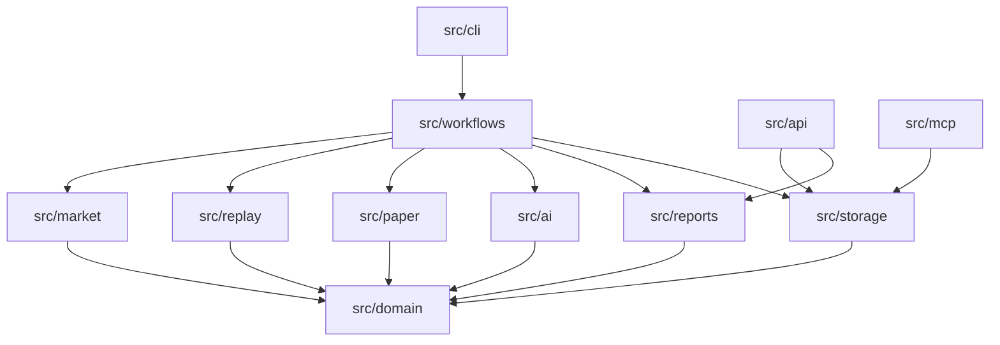

# Project Structure

## 목적

이 문서는 `toss-trading` 코드베이스에서 기능 위치와 책임 경계를 빠르게 찾기 위한 구조 문서다.

기존 `architecture.md`, `trading-runtime.md`, `risk-policy.md`가 시스템 설계와 안전 정책을 설명한다면, 이 문서는 실제 파일과 디렉터리 기준으로 "어디를 수정해야 하는가"를 정리한다.

## 전체 구조

```text
toss-trading/
├── AGENTS.md                  # Codex 작업 경계와 안전 규칙
├── README.md                  # 프로젝트 개요와 실행 예시
├── package.json               # Node.js scripts와 의존성
├── tsconfig.json              # TypeScript strict compiler 설정
├── .codex/                    # Codex MCP 설정 예시
├── dashboard/                 # read-only local dashboard 정적 파일
├── data/                      # 로컬 실행 산출물. Git source of truth 아님
├── docs/                      # 아키텍처, 정책, 운영, 리팩토링 문서
├── schemas/                   # 외부로 노출되는 JSON Schema
└── src/                       # TypeScript backend source
```

## Source 디렉터리 책임

| 경로 | 책임 | 주의 |
| --- | --- | --- |
| `src/domain/` | Zod schema, TypeScript contract, 공통 validation | I/O, storage, provider 호출 금지 |
| `src/config/` | `.env` 로딩과 실행 설정 해석 | trading mode를 암묵적으로 활성화하지 않음 |
| `src/collectors/` | optional read-only source 수집과 정규화 | 주문, 계좌 mutation, raw command runner 금지 |
| `src/market/` | market packet, historical packet, packet hash 생성 | Codex CLI나 broker API 호출 금지 |
| `src/ai/` | Codex CLI decision provider, prompt, failure summary | paper-only `VirtualDecision`만 생성 |
| `src/paper/` | virtual decision validation, risk, order, ledger, allocation policy | live `TradingSignal`/`OrderIntent`로 연결 금지 |
| `src/replay/` | simulated clock, replay runner, sampling, lookahead guard | 실시간 trading loop로 사용 금지 |
| `src/workflows/` | CLI/API가 호출하는 유스케이스 orchestration | 순수 정책을 중복 구현하지 않음 |
| `src/storage/` | JSON/JSONL file store, storage path mapping | trading 판단을 하지 않음 |
| `src/reports/` | paper/historical/batch report 생성 | 투자 조언이나 성과 보장 표현 금지 |
| `src/analytics/` | regime 분류와 portfolio analytics | 분석 metadata이며 주문 정책으로 자동 승격하지 않음 |
| `src/portfolio/` | mark-to-market, portfolio 계산 보조 | broker-grade accounting으로 주장하지 않음 |
| `src/scheduler/` | paper run one-shot scheduling gate | OS service나 live loop 설치 금지 |
| `src/security/` | masking 등 보안 보조 | 계좌번호, token, order ID 원문 노출 금지 |
| `src/api/` | read-only local operations HTTP API | replay 실행, Codex 실행, order 실행 endpoint 금지 |
| `src/mcp/` | Codex MCP server와 enabled tool surface | raw `tossctl`, raw `codex exec`, `place_order` 노출 금지 |
| `src/cli/` | command-line entrypoint와 argument parsing | 정책 자체는 workflow/domain module로 위임 |

## 의존성 방향

권장 의존성 방향은 아래와 같다.



원칙:

- `src/domain`은 가장 안쪽 contract 계층이다. 외부 I/O 계층을 import하지 않는다.
- `src/paper`는 paper-only execution 계층이다. live order path를 만들지 않는다.
- `src/api`와 `src/mcp`는 운영 조회 surface다. batch/replay/AI 실행을 직접 시작하지 않는다.
- `src/workflows`는 orchestration 계층이다. CLI와 low-level module 사이의 연결을 맡는다.

## 주요 Entry Point

| 명령 | 진입 파일 | 주요 역할 |
| --- | --- | --- |
| `npm run start` | `src/index.ts` | read-only MCP server 시작 |
| `npm run ops:api` / `npm run dashboard` | `src/cli/localOperationsApi.ts` | read-only local operations API와 dashboard 제공 |
| `npm run paper:run-once` | `src/cli/paperRunOnce.ts` | mock/static provider 기반 paper run |
| `npm run paper:run-from-market-packet` | `src/cli/paperRunFromMarketPacket.ts` | 저장된 market packet 기반 paper run |
| `npm run paper:scheduler:run` | `src/cli/paperSchedulerRun.ts` | paper run scheduler gate |
| `npm run paper:report` | `src/cli/paperDailyReport.ts` | daily paper report 생성 |
| `npm run tossinvest:collect` | `src/cli/tossInvestCollect.ts` | read-only TossInvest source 수집 |
| `npm run market:ingest` | `src/cli/marketIngest.ts` | 수집 데이터를 market packet으로 정규화 |
| `npm run historical:replay` | `src/cli/historicalReplay.ts` | single historical replay |
| `npm run historical:batch:replay` | `src/cli/historicalBatchReplay.ts` | batch historical replay |
| `npm run historical:batch:report` | `src/cli/historicalBatchReport.ts` | batch aggregate report 생성 |
| `npm run historical:yahoo:ingest` | `src/cli/historicalYahooDailyIngest.ts` | Yahoo daily historical input 생성 |
| `npm run historical:universe:coverage` | `src/cli/historicalUniverseCoverage.ts` | universe coverage 점검 |

## 변경 위치 찾기

### Virtual decision contract 변경

수정 후보:

- `src/domain/schemas.ts`
- `schemas/virtual-decision.schema.json`
- `src/paper/virtualDecisionValidation.ts`
- `src/paper/decisionNormalizer.ts`
- `src/ai/decisionPrompt.ts`
- `docs/codex-cli-paper-trading.md`

필수 확인:

- schema field가 camelCase인지 확인
- Zod schema와 JSON Schema가 같은 계약을 표현하는지 확인
- invalid decision이 paper order로 기록되지 않는지 테스트

### Paper risk 또는 order behavior 변경

수정 후보:

- `src/paper/riskEngine.ts`
- `src/paper/riskPolicy.ts`
- `src/paper/riskProfile.ts`
- `src/paper/orderEngine.ts`
- `src/paper/executionModel.ts`
- `docs/risk-policy.md`
- `docs/historical-replay.md`

필수 확인:

- `VirtualRiskEngine` 실패는 fail-closed인지 확인
- 새 reject code는 report, audit, docs에서 해석 가능한지 확인
- risk 관련 분기는 테스트를 추가하거나 기존 `*.test.ts`를 보강

### Market packet 또는 candidate 생성 변경

수정 후보:

- `src/market/packetBuilder.ts`
- `src/market/historicalPacketBuilder.ts`
- `src/market/packetHash.ts`
- `src/replay/historicalDataAvailability.ts`
- `src/domain/schemas.ts`
- `docs/historical-replay.md`

필수 확인:

- lookahead data가 packet에 포함되지 않는지 확인
- `sourceRefs`, `collectedAt`, `staleAfter`가 유지되는지 확인
- packet hash와 decision binding이 깨지지 않는지 확인

### Historical replay 변경

수정 후보:

- `src/replay/`
- `src/workflows/historicalReplayWorkflow.ts`
- `src/workflows/historicalReplayWorkflowPlan.ts`
- `src/workflows/historicalReplayWorkflowArtifacts.ts`
- `src/workflows/historicalBatchReplayWorkflow.ts`
- `src/reports/historicalReplayReport.ts`
- `src/reports/batchReplayReport.ts`
- `docs/historical-replay.md`

필수 확인:

- simulated time 이후 데이터가 사용되지 않는지 확인
- batch run artifact path가 dashboard/API와 일치하는지 확인
- replay 결과가 투자 조언이나 성과 보장으로 표현되지 않는지 확인

### Read-only dashboard/API 변경

수정 후보:

- `src/api/localOperationsServer.ts`
- `dashboard/index.html`
- `dashboard/app.js`
- `dashboard/styles.css`
- `docs/historical-replay.md`

필수 확인:

- HTTP method는 `GET`/`HEAD`만 허용
- endpoint가 replay 실행, Codex 실행, 주문 실행을 시작하지 않음
- 응답은 `maskObject`를 통과

### MCP tool 변경

수정 후보:

- `src/mcp/server.ts`
- `src/mcp/virtualPortfolioTools.ts`
- `docs/mcp-tools.md`
- `docs/llm-boundary.md`

필수 확인:

- enabled tool은 read-only인지 확인
- raw `tossctl`, raw `codex exec`, live order tool을 추가하지 않음
- tool contract와 docs 예시가 일치

### Storage artifact 변경

수정 후보:

- `src/storage/artifactPaths.ts`
- `src/storage/repositories.ts`
- `src/storage/fileStore.ts`
- `src/storage/jsonlStore.ts`
- `src/api/localOperationsServer.ts`
- 관련 report/replay workflow

필수 확인:

- path mapping 변경이 dashboard/API와 batch report를 깨지 않는지 확인
- append-only audit/replay JSONL 의미가 유지되는지 확인
- corrupt line handling이 read path를 전체 실패로 만들지 않는지 확인

주요 source of truth:

| 위치 | 역할 |
| --- | --- |
| `src/storage/artifactPaths.ts` | batch replay artifact root, manifest/runs file name, runs JSONL allowlist path policy |
| `src/storage/repositories.ts#createStoragePaths` | 단일 storage base dir 안의 paper/replay/report artifact path mapping |
| `src/storage/jsonlStore.ts` | append-only JSONL read/write와 corrupt line count 처리 |
| `src/storage/fileStore.ts` | snapshot JSON read/write |

Artifact 역할:

- `*.jsonl`: append-only log입니다. audit event, virtual decision/trade, market packet, historical replay packet/decision/risk/trade/timeline, batch run record처럼 시간 순서 기록을 보존합니다.
- `*.json`: latest snapshot 또는 generated report입니다. virtual portfolio, replay report/progress/metadata, batch manifest, aggregate report처럼 현재 상태 또는 산출 report를 담습니다.
- `data/` 아래 파일은 runtime artifact이며 Git source of truth가 아닙니다.
- Local Operations API는 storage helper가 정의한 path만 read-only로 조회하고, replay/batch/Codex 실행을 시작하지 않습니다.

## 테스트와 검증

기본 검증:

```powershell
npm run build
npm test
```

리팩토링 범위가 좁더라도 `npm test`는 `npm run build`를 포함한다. risk, paper order, replay, storage contract를 바꾸면 해당 영역 테스트를 추가하거나 보강한다.

## 관련 문서

- [CODE_CONVENTION.md](CODE_CONVENTION.md)
- [REFACTORING_GUIDE.md](REFACTORING_GUIDE.md)
- [architecture.md](architecture.md)
- [trading-runtime.md](trading-runtime.md)
- [risk-policy.md](risk-policy.md)
- [historical-replay.md](historical-replay.md)
- [mcp-tools.md](mcp-tools.md)
