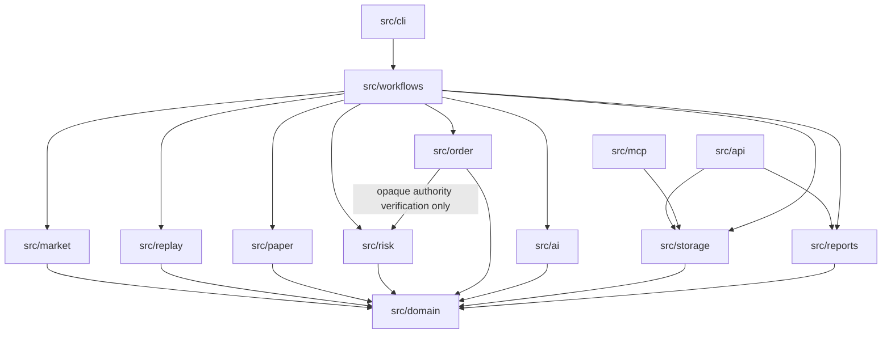

# Project Structure

## 목적

이 문서는 `toss-trading` 코드베이스에서 기능 위치와 책임 경계를 빠르게 찾기 위한 구조 문서다.

기존 `architecture.md`, `trading-runtime.md`, `risk-policy.md`, `official-toss-open-api-adapter-design.md`, `official-token-auth-design.md`가 시스템 설계와 안전 정책을 설명한다면, 이 문서는 실제 파일과 디렉터리 기준으로 "어디를 수정해야 하는가"를 정리한다.

## 전체 구조

```text
toss-trading/
├── AGENTS.md                  # Codex 작업 경계와 안전 규칙
├── README.md                  # 프로젝트 개요와 실행 예시
├── package.json               # Node.js scripts와 의존성
├── tsconfig.json              # TypeScript strict compiler 설정
├── .github/                   # CODEOWNERS와 PR template
├── .codex/                    # Codex MCP 설정 예시
├── apps/                      # Next.js dashboard app 등 frontend package
├── dashboard/                 # read-only local dashboard ES module 정적 파일
├── data/                      # 로컬 실행 산출물. Git source of truth 아님
├── docs/                      # 아키텍처, 정책, 운영, 리팩토링 문서
├── scripts/                   # dependency-free quality gate와 유지보수 스크립트
├── schemas/                   # 외부로 노출되는 JSON Schema
└── src/                       # TypeScript backend source
```

## Source 디렉터리 책임

| 경로 | 책임 | 주의 |
| --- | --- | --- |
| `src/domain/` | Zod schema, TypeScript contract, 공통 validation | I/O, storage, provider 호출 금지 |
| `src/config/` | `.env` 로딩과 실행 설정 해석, official token auth config parsing | trading mode를 암묵적으로 활성화하지 않음 |
| `src/broker/` | official broker integration helper, token auth client boundary | live order gateway, direct MCP/API 노출 금지 |
| `src/collectors/` | optional read-only source 수집과 정규화 | 주문, 계좌 mutation, raw command runner 금지 |
| `src/market/` | market packet, historical packet, packet hash 생성 | Codex CLI나 broker API 호출 금지 |
| `src/ai/` | Codex CLI decision provider, prompt, failure summary | paper-only `VirtualDecision`만 생성 |
| `src/paper/` | virtual decision validation, risk, order, ledger, allocation policy | live `TradingSignal`/`OrderIntent`로 연결 금지 |
| `src/risk/` | live order intent용 deterministic RiskEngine과 opaque authority handoff | broker gateway, OrderRouter, MCP mutation surface 연결 금지 |
| `src/order/` | row 16의 internal mock-only dry-run state와 shadow idempotency contract | broker/network I/O, live mutation, API/MCP/dashboard 연결 금지 |
| `src/replay/` | simulated clock, replay runner, sampling, lookahead guard | 실시간 trading loop로 사용 금지 |
| `src/workflows/` | CLI/API가 호출하는 유스케이스 orchestration | 순수 정책을 중복 구현하지 않음 |
| `src/storage/` | JSON/JSONL file store, storage path mapping | trading 판단을 하지 않음 |
| `src/reports/` | paper/historical/batch report 생성 | 투자 조언이나 성과 보장 표현 금지 |
| `src/analytics/` | regime 분류와 portfolio analytics | 분석 metadata이며 주문 정책으로 자동 승격하지 않음 |
| `src/portfolio/` | mark-to-market, portfolio 계산 보조 | broker-grade accounting으로 주장하지 않음 |
| `src/scheduler/` | paper run one-shot scheduling gate | OS service나 live loop 설치 금지 |
| `src/security/` | masking 등 보안 보조 | 계좌번호, token, order ID 원문 노출 금지 |
| `src/api/` | read-only local operations HTTP API | replay 실행, Codex 실행, order 실행 endpoint 금지 |
| `src/mcp/` | Codex MCP server와 enabled tool surface | raw `tossctl`, raw `codex exec`, `place_order` 노출 금지 |
| `src/cli/` | command-line entrypoint와 argument parsing | 정책 자체는 workflow/domain module로 위임 |

## 의존성 방향

권장 의존성 방향은 아래와 같다.


```mermaid
flowchart TD
    CLI["src/cli"] --> Workflows["src/workflows"]
    API["src/api"] --> Storage["src/storage"]
    API --> Reports["src/reports"]
    MCP["src/mcp"] --> Storage
    Workflows --> Market["src/market"]
    Workflows --> Replay["src/replay"]
    Workflows --> Paper["src/paper"]
    Workflows --> Risk["src/risk"]
    Workflows --> Order["src/order"]
    Workflows --> AI["src/ai"]
    Workflows --> Reports
    Workflows --> Storage
    Market --> Domain["src/domain"]
    Replay --> Domain
    Paper --> Domain
    Risk --> Domain
    Order --> Domain
    Order -->|"opaque authority verification only"| Risk
    AI --> Domain
    Storage --> Domain
    Reports --> Domain
```

원칙:

- `src/domain`은 가장 안쪽 contract 계층이다. 외부 I/O 계층을 import하지 않는다.
- `src/paper`는 paper-only execution 계층이다. live order path를 만들지 않는다.
- `src/order`는 row 16 전용 internal dry-run 계층이다. `src/workflows`가 먼저
  `LiveRiskEngine`을 통과시킨 typed input만 받고 mock/shadow state에서 종료하며,
  broker transport나 enabled entrypoint를 소유하지 않는다.
- `src/api`와 `src/mcp`는 운영 조회 surface다. batch/replay/AI 실행을 직접 시작하지 않는다.
- `src/workflows`는 orchestration 계층이다. CLI와 low-level module 사이의 연결을 맡는다.

## 주요 Entry Point

| 명령 | 진입 파일 | 주요 역할 |
| --- | --- | --- |
| `npm run start` | `src/index.ts` | read-only MCP server 시작 |
| `npm run ops:api` / `npm run dashboard` | `src/cli/localOperationsApi.ts` | read-only local operations API와 dashboard 제공 |
| `npm run paper:run-once` | `src/cli/paperRunOnce.ts` | mock/static provider 기반 paper run |
| `npm run paper:run-from-market-packet` | `src/cli/paperRunFromMarketPacket.ts` | 저장된 market packet 기반 paper run |
| `npm run paper:scheduler:run` | `src/cli/paperSchedulerRun.ts` | paper run scheduler gate |
| `npm run paper:report` | `src/cli/paperDailyReport.ts` | daily paper report 생성 |
| `npm run tossinvest:collect` | `src/cli/tossInvestCollect.ts` | read-only TossInvest source 수집 |
| `npm run market:ingest` | `src/cli/marketIngest.ts` | 수집 데이터를 market packet으로 정규화 |
| `npm run historical:replay` | `src/cli/historicalReplay.ts` | single historical replay |
| `npm run historical:batch:replay` | `src/cli/historicalBatchReplay.ts` | batch historical replay |
| `npm run historical:batch:report` | `src/cli/historicalBatchReport.ts` | batch aggregate report 생성 |
| `npm run historical:yahoo:ingest` | `src/cli/historicalYahooDailyIngest.ts` | Yahoo daily historical input 생성 |
| `npm run historical:universe:coverage` | `src/cli/historicalUniverseCoverage.ts` | universe coverage 점검 |

## 변경 위치 찾기

### Virtual decision contract 변경

수정 후보:

- `src/domain/schemas.ts`
- `schemas/virtual-decision.schema.json`
- `src/paper/virtualDecisionValidation.ts`
- `src/paper/decisionNormalizer.ts`
- `src/ai/decisionPrompt.ts`
- `docs/codex-cli-paper-trading.md`

필수 확인:

- schema field가 camelCase인지 확인
- Zod schema와 JSON Schema가 같은 계약을 표현하는지 확인
- invalid decision이 paper order로 기록되지 않는지 테스트

### Paper risk 또는 order behavior 변경

수정 후보:

- `src/paper/riskEngine.ts`
- `src/paper/riskBranches.ts`
- `src/paper/riskPolicy.ts`
- `src/paper/riskProfile.ts`
- `src/paper/orderEngine.ts`
- `src/paper/executionModel.ts`
- `docs/risk-policy.md`
- `docs/historical-replay.md`

필수 확인:

- `VirtualRiskEngine` 실패는 fail-closed인지 확인
- 새 reject code는 report, audit, docs에서 해석 가능한지 확인
- risk 관련 분기는 테스트를 추가하거나 기존 `*.test.ts`를 보강

### 전략 포트폴리오 Risk 결정 정책 해소

전략 포트폴리오의 저장된 Risk 결정과 활성 정책·규칙 참조를 대조하는 코드는
`src/portfolio/portfolioActionRiskDecisionPolicyResolver.ts`에 있다. 설정된 단일 저장 경로에서
Risk history와 정책·activation·의존성 generation을 직접 읽은 뒤 결정시각의 activation fold와
bucket/legacy rule-set 선택, side별 required rule ID 해소를 담당하며, 개별 규칙 수치 재평가나
최종 실행 승인은 제공하지 않는다. 관련 회귀 테스트는 같은 이름의 `*.test.ts`와 운용 모델
계획 문서를 함께 확인한다.

### Live RiskEngine 변경

수정 후보:

- `src/risk/liveRiskEngine.ts`
- `src/risk/liveRiskPolicy.ts`
- `src/risk/liveRiskEngine.test.ts`
- `docs/risk-policy.md`
- `docs/trading-runtime.md`
- `docs/official-toss-open-api-adapter-design.md`

필수 확인:

- 기본 policy는 fail-closed인지 확인
- root payload, order intent, preview, risk snapshot, risk policy의 숫자/enum/boolean/collection/timestamp/audit identity 값이 malformed 입력에서 fail-closed 되는지 확인
- risk snapshot freshness와 duplicate position row 기반 aggregate exposure/sellable quantity가 테스트되는지 확인
- kill switch, max order amount, max daily loss, exposure, allowlist, market hours, duplicate, cooldown, open order count, market order policy, stale signal, preview requirement가 테스트되는지 확인
- `RiskDecision`은 `orderIntentId`, `signalId`, `rejectCodes`, `checkedRules`, `riskSnapshotRef`, `createdAt`을 남기는지 확인
- `src/risk`에 broker gateway 또는 `OrderRouter`를 추가하거나 import하지 않음
- row 16 dry-run은 별도 `src/order` 경계에만 두고 Local Operations API/MCP/dashboard
  mutation surface와 연결하지 않음
- Codex CLI `virtual_decision`을 live order intent로 승격하지 않음

### Live OrderRouter dry-run 경계 변경

수정 후보:

- `src/risk/liveRiskAuthority.ts` (구현됨: frozen intent와 opaque authority)
- `src/risk/liveRiskAuthority.test.ts` (구현됨: 위조·변조·재구성 차단 회귀 테스트)
- `src/order/dryRunShadowState.ts` (구현됨: isolated reservation, permanent tombstone와 audit)
- `src/order/dryRunShadowState.test.ts` (구현됨: duplicate/timeout/reconciliation 상태 전이 테스트)
- `src/order/dryRunOrderRouter.ts` (구현됨: exact safe config, opaque synthetic approval와 shadow reservation 연결)
- `src/order/dryRunOrderRouter.test.ts` (구현됨: gate/authority/approval/duplicate/masking 회귀 테스트)
- `docs/live-trading-threat-model.md`
- `docs/official-toss-open-api-adapter-design.md`
- `docs/PROJECT_STRUCTURE.md`
- `docs/CODE_CONVENTION.md`

필수 확인:

- 첫 구현은 `BROKER_PROVIDER=mock`, `TRADING_ENABLED=false`, mutation disabled를 exact
  typed input으로 검증하고 하나라도 다르면 fail-closed함
- caller가 만든 자연어, Codex paper evidence 또는 raw broker payload를 intent로 변환하지
  않음
- 구현된 risk authority 경계는 risk 평가 전에 strict-validated `LiveOrderIntent`를
  deep-copy/deep-freeze하고 그 exact snapshot을 `LiveRiskEngine`에 전달함. 후속 workflow와
  router도 평가 결과가 소유한 동일 snapshot만 handoff해야 함
- Risk module은 descriptive plain object를 handoff authority로 받지 않고, module-private
  mint path와 runtime-owned `WeakSet` brand를 통과한 deep-frozen opaque
  `LiveRiskAuthority`만 생성해야 함. Public constructor/factory 또는 caller-supplied approval
  flag를 허용하지 않으며 rejected authority는 approved authority로 바뀔 수 없음
- Opaque authority 내부의 readonly decision에는 domain-separated canonical
  `evaluatedIntentHash`를 추가해야 함.
  Hash input은 schema version, optional-field presence와 exact raw string/number/boolean 값을
  보존한 frozen snapshot 전체를 length-prefix해 포함하며, raw `symbol`과 RiskEngine이 실제
  사용하는 normalized symbol projection을 서로 다른 field로 모두 bind함
- `src/order`는 risk module의 narrow `verifyLiveRiskAuthority()`만 runtime import해 module-owned
  brand, frozen state, approved result와 recomputed intent hash를 함께 검증함. 하나라도 다르면
  fail-closed하며 plain `LiveRiskDecision`, caller-constructed object 또는 새로 재구성·정규화한
  intent는 router handoff authority가 아님
- `LiveRiskEngine` reject 뒤에는 router가 호출되지 않으며 router 자체가 risk engine,
  sizing 또는 allocation 책임을 복제하지 않음
- 구현된 shadow state는 synthetic scenario/hash tuple만 받고 isolated permanent tombstone을 최초
  reservation과 함께 생성하며 simulated terminal 뒤에도 같은 identity 재예약을 거부함. Scenario
  input은 opaque ref로 저장하고 immutable state handle은 single-use로 소비해 stale branch reservation을
  차단함
- 구현된 router는 네 safe config field를 exact data value로 검증하고, 승인된 exact risk authority,
  동일 frozen intent와 opaque scenario binding에 묶인 module-owned synthetic owner approval fixture를
  한 번만 소비함. Counterfeit, stale, mismatched approval은 shadow reservation 전에 fail-closed함
- 결과는 `dry_run_validated` 또는 `shadow_reconciled_no_external_effect` 같은 paper-only
  상태로 끝나며 broker order/execution identity를 만들지 않음
- `src/order`는 `src/broker`, `src/api`, `src/mcp`, `src/cli`, `src/ai`, `src/paper`,
  `src/storage`를 import하지 않고 network, filesystem, process 또는 environment I/O를 하지 않음
- Local Operations API, MCP, dashboard, CLI와 package entrypoint에 mutation route/tool/command를
  추가하지 않음
- 이 internal dry-run 구현은 official order POST, broker gateway, runtime owner approval channel 또는
  live enablement를 승인하지 않음

### Market packet 또는 candidate 생성 변경

수정 후보:

- `src/market/packetBuilder.ts`
- `src/market/historicalPacketBuilder.ts`
- `src/market/packetHash.ts`
- `src/replay/historicalDataAvailability.ts`
- `src/domain/schemas.ts`
- `docs/historical-replay.md`

필수 확인:

- lookahead data가 packet에 포함되지 않는지 확인
- `sourceRefs`, `collectedAt`, `staleAfter`가 유지되는지 확인
- packet hash와 decision binding이 깨지지 않는지 확인

### Historical replay 변경

수정 후보:

- `src/replay/`
- `src/workflows/historicalReplayWorkflow.ts`
- `src/workflows/historicalReplayWorkflowPlan.ts`
- `src/workflows/historicalReplayWorkflowArtifacts.ts`
- `src/workflows/historicalBatchReplayWorkflow.ts`
- `src/reports/historicalReplayReport.ts`
- `src/reports/batchReplayReport.ts`
- `docs/historical-replay.md`

필수 확인:

- simulated time 이후 데이터가 사용되지 않는지 확인
- batch run artifact path가 dashboard/API와 일치하는지 확인
- replay 결과가 투자 조언이나 성과 보장으로 표현되지 않는지 확인

### Read-only dashboard/API 변경

현재 구현은 `dashboard/`의 정적 HTML/CSS/ES module과 `src/api`의 Local Operations API가 담당한다. `apps/dashboard`는 Next.js 전환을 위한 별도 app skeleton이며, 전략 버킷, dynamic cash reserve, hedge, validation lab을 policy 중심으로 포용하는 future Next.js 전환 계획은 [nextjs-dashboard-architecture-plan.md](nextjs-dashboard-architecture-plan.md)를 기준으로 한다.

수정 후보:

- `src/api/localOperationsSurface.ts`
- `src/api/localOperationsServer.ts`
- `src/api/localOperationsRouting.ts`
- `src/api/dashboardViewModels.ts`
- `src/api/localOperationsReaders.ts`
- `src/api/localOperationsDashboardAssets.ts`
- `src/api/localOperationsResponse.ts`
- `src/api/localOperationsTypes.ts`
- `dashboard/index.html`
- `dashboard/app.js`
- `dashboard/apiClient.js`
- `dashboard/batchRunRenderers.js`
- `dashboard/dashboardStatusRenderers.js`
- `dashboard/decisionRenderers.js`
- `dashboard/dom.js`
- `dashboard/formatters.js`
- `dashboard/metadata.js`
- `dashboard/portfolioModel.js`
- `dashboard/portfolioRenderers.js`
- `dashboard/reportRenderers.js`
- `dashboard/replayProgressCoordinator.js`
- `dashboard/replayProgressRenderers.js`
- `dashboard/reportViewHelpers.js`
- `dashboard/router.js`
- `dashboard/sourceRenderers.js`
- `dashboard/state.js`
- `dashboard/tableRenderers.js`
- `dashboard/styles.css`
- `docs/historical-replay.md`

필수 확인:

- HTTP method는 `GET`/`HEAD`만 허용
- endpoint가 replay 실행, Codex 실행, 주문 실행을 시작하지 않음
- 응답은 `maskObject`를 통과

### MCP tool 변경

수정 후보:

- `src/mcp/server.ts`
- `src/mcp/virtualPortfolioTools.ts`
- `src/mcp/toolSurfacePolicy.ts`
- `docs/mcp-tools.md`
- `docs/llm-boundary.md`

필수 확인:

- enabled tool은 read-only인지 확인
- raw `tossctl`, raw `codex exec`, live order tool을 추가하지 않음
- tool contract와 docs 예시가 일치
- disabled-by-default tool 이름이 `toolSurfacePolicy.ts`와 docs에서 일치

### Official Toss Open API token auth config 변경

수정 후보:

- `src/config/tossOpenApiAuthConfig.ts`
- `src/config/tossOpenApiAuthConfig.test.ts`
- `.env.example`
- `scripts/qualityGate.mjs`
- `docs/official-token-auth-design.md`

필수 확인:

- `readTossOpenApiAuthConfig({})`가 `enabled=false`, `status=disabled`를 유지하는지 확인
- `TOSS_OPEN_API_AUTH_ENABLED=true`에서 `client_id` 또는 `client_secret` 누락 시 `invalid`로 fail-closed 되는지 확인
- safe summary가 credential value를 반환하지 않는지 확인
- token 발급 HTTP call, token cache, broker adapter, account/order adapter를 추가하지 않음

### Official Toss Open API token auth client 변경

수정 후보:

- `src/broker/tossOpenApiAuthClient.ts`
- `src/broker/tossOpenApiAuthClient.test.ts`
- `docs/official-token-auth-design.md`

필수 확인:

- token issue request가 `application/x-www-form-urlencoded`와 `grant_type=client_credentials`를 사용
- `TossOpenApiAuthClient`가 disabled/invalid config에서 issuer를 호출하지 않고 fail-closed 처리
- token response의 `token_type`이 `Bearer`가 아니면 cache하지 않음
- `expires_in`과 safety margin 기준으로 memory cache를 재사용 또는 재발급
- concurrent token request가 single-flight로 합쳐짐
- 실제 HTTP transport, persistent token store, account/order adapter, live order gateway를 추가하지 않음

### Official Toss Open API token issuer network transport 변경

수정 후보:

- `src/broker/tossOpenApiTokenIssuerNetworkTransport.ts`
- `src/broker/tossOpenApiTokenIssuerNetworkTransport.test.ts`
- `docs/official-token-auth-design.md`
- `docs/official-toss-open-api-adapter-design.md`

필수 확인:

- production factory가 canonical `https://openapi.tossinvest.com/oauth2/token` 외 URL, dial target, custom CA 또는 test connector override를 받지 않음
- disabled/invalid config와 noncanonical request는 DNS/socket 전송 전에 fail-closed
- token POST가 exact form body, `Accept-Encoding: identity`, no `Range`/`If-Range`와 no caller credential header를 유지
- response가 exact `200`, no `Content-Range`/`Content-Encoding`, single JSON content type, 256KiB cap, complete UTF-8 JSON과 10초 이하 absolute deadline을 통과한 뒤에만 AuthClient parser로 전달됨
- test-only connector가 loopback IP와 synthetic CA에 한정되고 logical URL, Host, SNI와 hostname verification을 production identity로 유지
- external credential call, Calendar GET, persistent token/raw response, account/order request와 automatic retry를 추가하지 않음

### Official Toss Open API Calendar GET network transport 변경

수정 후보:

- `src/broker/tossOpenApiCalendarNetworkTransport.ts`
- `src/broker/tossOpenApiCalendarNetworkTransport.test.ts`
- `src/replay/officialMarketCalendarNetworkResponseFreshness.ts`
- `docs/official-token-auth-design.md`
- `docs/official-toss-open-api-adapter-design.md`
- `docs/replay-calendar-fx-contract.md`

필수 확인:

- production factory가 canonical `https://openapi.tossinvest.com/api/v1/market-calendar/{KR|US}?date=YYYY-MM-DD` 외 URL, query, dial target, custom CA, clock 또는 deadline override를 받지 않음
- disabled/invalid config, malformed market/date와 invalid token lease는 DNS/socket 전송 전에 fail-closed
- initial/retry GET이 Bearer 외 credential/account header를 보내지 않고 exact no-cache, `Accept-Encoding: identity`, no Range/conditional header를 유지
- refreshable `401`만 사용한 generation을 compare-and-clear한 뒤 한 번 재시도하고 retry `401`은 retry generation만 정리하며 세 번째 attempt를 만들지 않음
- final response가 exact `200`, complete JSON identity bytes, response trailer 없음, 1MiB cap과 10초 이하 final-attempt monotonic deadline을 통과함
- raw `Date`/`Age`/`Expires`와 Cache-Control을 기존 network corrected-age verifier로 검증하고 response delay, hash, byte length와 exact bytes를 process-local observation에 결합함
- test-only connector가 loopback IP, synthetic CA와 deterministic clock에 한정되고 logical URL, Host, SNI와 hostname verification을 production identity로 유지
- external credential call, durable raw-byte persistence, replay consumer migration, acquisition coordinator, account/order request와 broker mutation을 추가하지 않음

### Official Toss Open API Calendar ephemeral lifecycle 변경

수정 후보:

- `src/replay/officialBrokerObservedCalendarEphemeralObservation.ts`
- `src/replay/officialBrokerObservedCalendarEphemeralObservation.test.ts`
- `src/replay/officialBrokerObservedCalendarEvidenceV2.ts`
- `src/replay/officialBrokerObservedCalendarReplayAdapter.ts`
- `src/replay/officialBrokerObservedCalendarCoverageProbe.ts`
- `docs/official-token-auth-design.md`
- `docs/official-toss-open-api-adapter-design.md`
- `docs/replay-calendar-fx-contract.md`

필수 확인:

- actual network-derived v2 evidence와 exact bytes의 ownership을 verified process-local opaque handle에 함께 이전함
- factory가 bytes를 내부 copy로 격리하고 transferred caller view를 즉시 zeroize하며 handle에서 evidence/raw bytes를 노출하지 않음
- factory가 v2 schema, response hash/byte length, normalized response와 acquisition freshness를 검증하고 invalid input도 bytes를 zeroize함
- handle을 한 번만 소비하고 module-owned replay/coverage operation이 current `asOf`와 internal exact bytes로 evidence를 다시 검증함
- fixed operation이 replay input/report를 내부에서만 만들고 caller callback이나 return value로 derived object를 제공하지 않음
- success, verifier/consumer failure, stale, explicit disposal과 JSON export 시도 뒤 internal bytes를 zeroize함
- handle 재사용과 직렬화를 거부하고 public consumer registration 또는 derived output export surface를 만들지 않음
- durable raw-byte store, workflow artifact writer, CLI/MCP/API export, replay 실행과 acquisition coordinator를 추가하지 않음

### Official Toss Open API Calendar acquisition coordinator 변경

수정 후보:

- `src/broker/tossOpenApiCalendarAcquisitionCoordinator.ts`
- `src/broker/tossOpenApiCalendarAcquisitionCoordinator.test.ts`
- `src/broker/tossOpenApiTokenIssuerNetworkTransport.ts`
- `src/broker/tossOpenApiAuthClient.ts`
- `src/broker/tossOpenApiCalendarNetworkTransport.ts`
- `src/replay/officialBrokerObservedCalendarOpenApiCompatibility.ts`
- `src/replay/officialBrokerObservedCalendarEvidenceV2.ts`
- `src/replay/officialBrokerObservedCalendarEphemeralObservation.ts`
- `docs/official-token-auth-design.md`
- `docs/official-toss-open-api-adapter-design.md`
- `docs/replay-calendar-fx-contract.md`

필수 확인:

- production factory가 token issuer, generation-aware auth client와 calendar transport를 내부에서 고정 조립하고 connector/client/clock override를 받지 않음
- test-only factory도 arbitrary calendar client를 받지 않고 loopback connector와 injected token issuer만 사용함
- public input은 exact `market`/`date`만 받고 retrieval/evaluation timestamp, cache metadata, URL, contract version, evidence 또는 raw bytes를 받지 않음
- disabled/invalid config와 malformed input이 token issue, DNS 또는 socket 전에 fail-closed 처리됨
- network observation의 request URL, market/date, parsed body, response hash/byte length, completedAt/delay와 corrected freshness를 evidence 생성 전에 다시 검증함
- pinned example로 trusted parser registry contract를 선택하고 actual network bytes를 v2 strict parser와 ephemeral observation factory에 통과시킨 opaque handle만 반환함
- success, compatibility/schema/freshness/lifecycle failure 모두 transport raw-byte view를 zeroize함
- persistent token/raw-byte store, stored report, replay 실행, completeness claim, CLI/MCP/API output, account/order path와 broker mutation을 추가하지 않음

### Official Toss Open API credential readiness preflight 변경

수정 후보:

- `src/broker/tossOpenApiCredentialReadinessPreflight.ts`
- `src/broker/tossOpenApiCredentialReadinessPreflight.test.ts`
- `src/cli/tossOpenApiCredentialReadinessPreflight.ts`
- `src/config/tossOpenApiAuthConfig.ts`
- `.env.example`
- `docs/official-token-auth-design.md`
- `docs/official-toss-open-api-adapter-design.md`

필수 확인:

- raw env 기준 exact canonical host/base URL, safe auth summary, DNS family/count와 fixed token/calendar endpoint identity만 출력하고 미설정 외 noncanonical URL은 path까지 fixed placeholder로 치환함
- client id/secret, resolved IP address, token, provider response와 raw bytes를 출력하거나 저장하지 않음
- exact `BROKER_PROVIDER=mock`, `TRADING_ENABLED=false`, `AI_DECISION_MODE=paper_only` 경계를 벗어나면 fail-closed blocker를 기록하고 명시된 값의 오타, 빈 값 또는 공백 변형도 허용하지 않음
- outbound IP registration은 raw env의 exact `TOSS_OPEN_API_OUTBOUND_IP_REGISTERED=true|false`만 허용하고 owner attestation과 실제 egress 검증을 구분함
- DNS lookup 외 HTTP request, token issue, calendar acquisition, account/order request 또는 provider response 검증을 수행하지 않음
- `ready_for_external_verification`을 successful acquisition/evidence/completeness로 해석하지 않음
- production DNS resolver는 exact `openapi.tossinvest.com`만 조회하고 resolver override는 test-only factory에만 노출함

### Official Toss Open API read-only HTTP client 변경

수정 후보:

- `src/broker/tossOpenApiReadOnlyHttpClient.ts`
- `src/broker/tossOpenApiReadOnlyHttpClient.test.ts`
- `docs/official-token-auth-design.md`
- `docs/official-toss-open-api-adapter-design.md`

필수 확인:

- read-only HTTP client가 `GET`만 허용하고 mutation method를 token 발급 전 차단
- disabled/invalid auth config에서 token provider와 transport를 호출하지 않음
- Bearer token은 injected token provider에서 받아 request header에만 주입
- actual network transport는 injected interface 밖에 두고 직접 `fetch`/`http.request`/`https.request`를 추가하지 않음
- 401/403/429/4xx/5xx response를 분류하고 429 `Retry-After`를 해석
- official error envelope의 nested `error.code`를 해석
- 401 `invalid-token`/`expired-token` 계열에서 request가 실제 사용한 lease generation을 `invalidateTokenLease(generation)`으로 compare-and-clear한 뒤 `GET`을 최대 1회만 재시도하고, retry 401은 retry generation만 정리하며 stale generation은 current newer lease를 변경하지 않음
- absolute URL, protocol-relative URL, non-https base URL, backslash path를 reject
- market endpoint mapping, account snapshot reader, Local Operations API/MCP/dashboard surface, live order gateway를 추가하지 않음

### Official Toss Open API market data adapter 변경

수정 후보:

- `src/broker/tossOpenApiMarketDataAdapter.ts`
- `src/broker/tossOpenApiMarketDataAdapter.test.ts`
- `docs/official-toss-open-api-adapter-design.md`

필수 확인:

- adapter가 injected read-only JSON client만 호출
- `/api/v1/prices`, `/api/v1/orderbook`, `/api/v1/trades`, `/api/v1/candles`, `/api/v1/stocks/{symbol}/warnings`, `/api/v1/market-calendar/{KR|US}`만 mapping
- `prices.symbols`는 official limit에 맞춰 1-200개만 허용
- symbol은 official pattern에 맞춰 letters, numbers, dot, dash만 허용하고 path segment는 encoded path로 구성
- `trades.count`는 1-50, `candles.count`는 1-200, `candles.interval`은 `1m` 또는 `1d`만 허용
- account snapshot reader, order endpoint, Local Operations API/MCP/dashboard surface, live `TradingSignal`/`OrderIntent`/`OrderRouter`를 추가하지 않음

### Official Toss Open API account snapshot reader 변경

수정 후보:

- `src/broker/tossOpenApiAccountSnapshotReader.ts`
- `src/broker/tossOpenApiAccountSnapshotReader.test.ts`
- `docs/official-toss-open-api-adapter-design.md`

필수 확인:

- reader가 injected account read-only JSON client만 호출
- `/api/v1/accounts`, `/api/v1/holdings`만 mapping
- holdings 조회는 explicit `accountSeq`가 있을 때만 수행하고 없으면 degraded source status로 남김
- output에서 account number와 accountSeq를 masking
- symbol filter는 letters, numbers, dot, dash만 허용
- order endpoint, portfolio mutation, Local Operations API/MCP/dashboard surface, live `TradingSignal`/`OrderIntent`/`OrderRouter`를 추가하지 않음

### Storage artifact 변경

수정 후보:

- `src/storage/artifactPaths.ts`
- `src/storage/repositories.ts`
- `src/storage/fileStore.ts`
- `src/storage/jsonlStore.ts`
- `src/api/localOperationsServer.ts`
- 관련 report/replay workflow

필수 확인:

- path mapping 변경이 dashboard/API와 batch report를 깨지 않는지 확인
- append-only audit/replay JSONL 의미가 유지되는지 확인
- corrupt line handling이 read path를 전체 실패로 만들지 않는지 확인

주요 source of truth:

| 위치 | 역할 |
| --- | --- |
| `src/api/localOperationsSurface.ts` | read-only HTTP method, Local Operations API route, dashboard ES module/static path 기준 |
| `src/api/localOperationsServer.ts` | HTTP server bootstrap, method guard, dashboard asset/API dispatch |
| `src/api/localOperationsRouting.ts` | Local Operations API route handler table과 query parameter parsing |
| `src/api/dashboardViewModels.ts` | Next.js dashboard 전환용 read-only ViewModel 계산 |
| `src/api/localOperationsReaders.ts` | storage/report artifact read-only payload 생성 |
| `src/api/localOperationsDashboardAssets.ts` | dashboard document/module/static asset 매핑과 응답 |
| `src/api/localOperationsResponse.ts` | masked JSON response writer |
| `dashboard/app.js` | dashboard bootstrap, refresh orchestration, renderer composition |
| `dashboard/batchRunRenderers.js` | batch replay 개별 run 목록, 탭, 상세, polling renderer |
| `dashboard/dashboardStatusRenderers.js` | API 연결 상태, file-mode notice, dashboard 상단 metric renderer |
| `dashboard/decisionRenderers.js` | AI decision timeline, filter event binding, performance, risk summary DOM renderer |
| `dashboard/portfolioModel.js` | portfolio timeline, trade PnL, position valuation, benchmark data helper |
| `dashboard/portfolioRenderers.js` | portfolio 성과, 벤치마크, 노출, 이벤트, 목표, 리스크 metric DOM renderer |
| `dashboard/reportRenderers.js` | daily/replay/batch report DOM renderer |
| `dashboard/replayProgressCoordinator.js` | replay progress polling과 live replay section composition |
| `dashboard/replayProgressRenderers.js` | replay progress panel, performance metric, event table renderer와 view helper |
| `dashboard/reportViewHelpers.js` | report/replay/batch renderer가 공유하는 label/summary helper |
| `dashboard/sourceRenderers.js` | source summary renderer와 dashboard symbol metadata registration |
| `dashboard/tableRenderers.js` | positions/trades/market packet table renderer와 symbol cell helper |
| `src/mcp/toolSurfacePolicy.ts` | MCP에 기본 enabled하면 안 되는 disabled-by-default tool 이름 기준 |
| `src/mcp/virtualPortfolioTools.ts` | 현재 enabled MCP read-only tool name, input schema, handler 기준 |
| `src/storage/artifactPaths.ts` | batch replay artifact root, manifest/runs file name, runs JSONL allowlist path policy |
| `src/storage/repositories.ts#createStoragePaths` | 단일 storage base dir 안의 paper/replay/report artifact path mapping |
| `src/storage/jsonlStore.ts` | append-only JSONL read/write와 corrupt line count 처리 |
| `src/storage/fileStore.ts` | snapshot JSON read/write |

Artifact 역할:

- `*.jsonl`: append-only log입니다. audit event, virtual decision/trade, market packet, historical replay packet/decision/risk/trade/timeline, batch run record처럼 시간 순서 기록을 보존합니다.
- `*.json`: latest snapshot 또는 generated report입니다. virtual portfolio, replay report/progress/metadata, batch manifest, aggregate report처럼 현재 상태 또는 산출 report를 담습니다.
- `data/` 아래 파일은 runtime artifact이며 Git source of truth가 아닙니다.
- Local Operations API는 storage helper가 정의한 path만 read-only로 조회하고, replay/batch/Codex 실행을 시작하지 않습니다.

## 테스트와 검증

기본 검증:

```powershell
npm run check:review
npm run check
```

반복 개발·review 수정에서는 `npm run check:review`(호환 alias `check:changed`)가 `origin/main` 대비 변경 module의 transitive reverse
dependency, compiled CLI를 실행하는 subprocess/worker test, source text를 직접 검사하는 안전성
test만 실행한다. 영향 범위를 안전하게 계산할 수 없으면 전체 suite로 자동 fallback한다.
이 명령은 최종 gate를 대체하지 않으며 검수 완료한 최종 병합 후보에는 `npm run check` 또는
동등한 `npm run check:merge`를 실행한다. 동일 변경에 두 profile을 연속 필수 실행하지 않는다.

`scripts/verificationRunner.mjs`가 build → quality → tooling test → 영향/전체 test를 실행하고
각 단계 timing과 실패 상태를 출력한다. 실패하면 이후 단계는 실행하지 않는다. `quality:gate`의
Local Operations API route, dashboard endpoint, MCP enabled/disabled tool name, Codex decision
provider safe default와 문서 drift 검사는 유지된다. 상세 절차는 [test-verification.md](test-verification.md)를 따른다.

리팩토링 범위가 좁더라도 `npm test`는 `npm run build`를 포함한다. risk, paper order, replay, storage contract를 바꾸면 해당 영역 테스트를 추가하거나 보강한다.

## 관련 문서

- [CODE_CONVENTION.md](CODE_CONVENTION.md)
- [REFACTORING_GUIDE.md](REFACTORING_GUIDE.md)
- [ai-investment-process-refactoring-plan.md](ai-investment-process-refactoring-plan.md)
- [architecture.md](architecture.md)
- [official-toss-open-api-adapter-design.md](official-toss-open-api-adapter-design.md)
- [official-token-auth-design.md](official-token-auth-design.md)
- [trading-runtime.md](trading-runtime.md)
- [risk-policy.md](risk-policy.md)
- [historical-replay.md](historical-replay.md)
- [quant-research-paper-simulation-review.md](quant-research-paper-simulation-review.md)
- [quant-research-paper-simulation-plan.md](quant-research-paper-simulation-plan.md)
- [nextjs-dashboard-architecture-plan.md](nextjs-dashboard-architecture-plan.md)
- [mcp-tools.md](mcp-tools.md)
