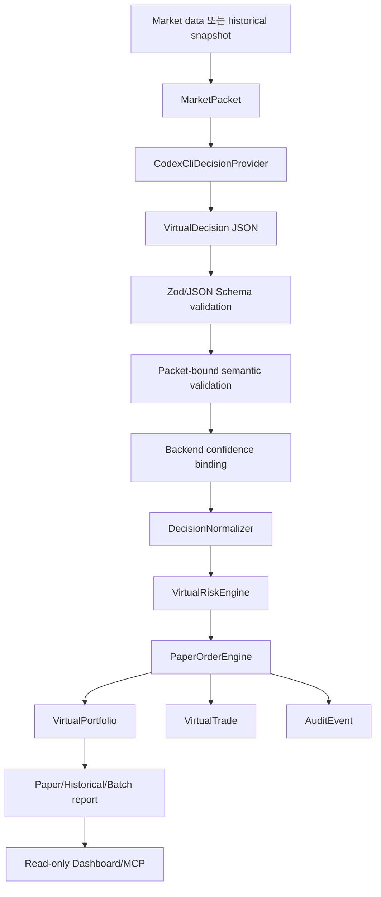

# AI Investment Process Refactoring Plan

## 목적

이 문서는 `toss-trading`에서 AI를 활용한 paper-only 투자 판단 흐름을 프로세스 관점에서 리팩토링하기 위한 세부 계획이다.

기존 리팩토링은 dashboard와 local operations surface를 작은 module로 분리하는 데 초점이 있었다. 다음 리팩토링은 code convention이 아니라, `Codex CLI`가 생성하는 `VirtualDecision`이 어떤 단계로 검증되고 가상 포트폴리오에 반영되는지 전체 프로세스를 고정하는 작업이다.

목표는 AI 자동매매가 아니다. AI는 paper-only 제안 provider이고, deterministic backend가 packet 생성, schema 검증, semantic validation, normalization, risk gate, paper order, storage, audit, report를 소유한다.

## 안전 기준

이 계획의 모든 phase는 아래 기준을 유지해야 한다.

- `TRADING_ENABLED=false` 기본값 유지
- `AI_DECISION_MODE=paper_only` 유지
- `AI_DECISION_ENABLED=false` 기본값 유지
- `BROKER_PROVIDER=mock` 기본값 유지
- Codex CLI 실행은 `read-only` sandbox만 사용
- `--search`는 기본 비활성 유지
- AI output은 `VirtualDecision`으로만 처리
- AI output을 live `TradingSignal`, live `OrderIntent`, `OrderRouter`로 연결하지 않음
- 모든 가상 주문은 `VirtualRiskEngine`을 통과
- risk reject 이후 `VirtualTrade`를 기록하지 않음
- raw `codex exec`, raw `tossctl`, `place_order` MCP tool을 enabled surface에 추가하지 않음
- 실제 계좌, token, order ID, execution data를 문서, 로그, report에 노출하지 않음
- report와 dashboard 문구가 투자 조언, 수익률 보장, 실계좌 성과처럼 읽히지 않게 유지

## 현재 AI 활용 프로세스

현재 AI 활용 경로는 paper-only pipeline이다.



핵심 경계:

- AI는 `VirtualDecision` JSON을 생성한다.
- backend는 packet hash, schema, candidate refs, action eligibility, evidence refs를 검증한다.
- backend는 AI sizing hint를 그대로 실행하지 않고 `DecisionNormalizer`로 paper order 크기를 다시 계산한다.
- `VirtualRiskEngine`은 최종 gate이며, 실패하면 paper trade도 없다.
- `PaperOrderEngine`은 broker adapter를 호출하지 않고 virtual state만 갱신한다.
- dashboard와 MCP는 저장된 artifact를 read-only로 조회한다.

## 실행 모드별 프로세스

| 실행 모드 | Entrypoint | AI 사용 조건 | 입력 | 출력 | 리팩토링 주의점 |
| --- | --- | --- | --- | --- | --- |
| one-shot paper run | `src/cli/paperRunOnce.ts` | `AI_DECISION_ENABLED=true`이고 `--dry-run`이 아닐 때 | mock `MarketPacket` | virtual decision, risk decision, trade, portfolio, audit | mock packet과 static provider 경로를 분리하되 검증/risk/order 순서는 공유 |
| stored packet paper run | `src/cli/paperRunFromMarketPacket.ts` | `AI_DECISION_ENABLED=true`이고 `--dry-run`이 아닐 때 | latest stored `MarketPacket` | virtual decision, risk decision, trade, portfolio, audit | packet stale/missing 처리를 no-trade로 유지 |
| single historical replay | `src/cli/historicalReplay.ts` | `AI_DECISION_MODE=paper_only`, `AI_DECISION_ENABLED=true`, dry-run 아님 | historical snapshots, simulated clock | replay report, progress, packets, decisions, risk decisions, trades, timeline | lookahead guard와 simulated time을 훼손하지 않음 |
| batch historical replay | `src/cli/historicalBatchReplay.ts` | `--use-codex-ai`, `AI_DECISION_MODE=paper_only`, `AI_DECISION_ENABLED=true` | source data dir, random windows, sampling policy | batch manifest, run records, per-run replay artifacts | per-run Codex budget과 batch/daily budget 의미를 분리 |

## 프로세스 단계별 소유권

| 단계 | 주 소유 계층 | 주요 파일 | 실패 시 처리 |
| --- | --- | --- | --- |
| packet 생성 | backend market/replay workflow | `src/market/`, `src/replay/`, `src/workflows/` | packet 없음 또는 stale이면 AI 호출 없이 실패/skip |
| Codex CLI 호출 | AI provider | `src/ai/codexCliDecisionProvider.ts` | `AI_DECISION_FAILED` 또는 provider failure record, no trade |
| output schema 검증 | domain/provider | `src/domain/schemas.ts`, `schemas/virtual-decision.schema.json` | invalid output reject, no trade |
| packet-bound semantic validation | paper validation | `src/paper/virtualDecisionValidation.ts` | `VIRTUAL_DECISION_REJECTED`, no trade |
| confidence metadata binding | backend paper workflow | `src/paper/decisionConfidence.ts` | backend-generated metadata만 저장 |
| sizing 정규화 | paper model | `src/paper/decisionNormalizer.ts` | invalid/no-op sizing은 risk/order 단계에서 reject |
| risk gate | paper risk | `src/paper/riskEngine.ts`, `src/paper/riskBranches.ts` | reject decision 저장, no trade |
| paper execution | paper order | `src/paper/orderEngine.ts` | broker adapter 호출 없음, virtual state만 변경 |
| artifact 저장 | storage | `src/storage/repositories.ts` | append-only log와 snapshot 역할 유지 |
| read-only 조회 | API/MCP/dashboard | `src/api/`, `src/mcp/`, `dashboard/` | 조회 실패는 실행 trigger가 아니며 가능한 데이터만 표시 |

## 실패 흐름 표준화 대상

프로세스 리팩토링에서는 아래 실패 흐름을 문서와 테스트에서 같은 이름으로 추적할 수 있어야 한다.

| 실패 조건 | 기대 동작 | trade 생성 | portfolio 변경 | audit/report |
| --- | --- | --- | --- | --- |
| `AI_DECISION_ENABLED=false` | provider attempted=false 또는 disabled failure | 없음 | 없음 | disabled reason 기록 |
| daily/per-run budget 초과 | provider failure | 없음 | 없음 | budget exceeded reason 기록 |
| Codex timeout/non-zero exit | provider failure | 없음 | 없음 | AI failure event 기록 |
| invalid JSON/schema | validation failure | 없음 | 없음 | schema failure reason 기록 |
| packet hash/id mismatch | semantic reject | 없음 | 없음 | decision rejected event 기록 |
| candidate/action eligibility mismatch | semantic reject | 없음 | 없음 | decision rejected event 기록 |
| stale packet/decision | risk reject | 없음 | 없음 | risk reject code 기록 |
| cash/exposure/cooldown 초과 | risk reject | 없음 | 없음 | risk reject code 기록 |
| no-op/dust sizing | risk/order reject 또는 no trade | 없음 | 없음 | no-op reason 기록 |
| paper trade 성공 | virtual fill 기록 | 있음 | 있음 | trade, portfolio, audit 기록 |

## Phase 20. AI 투자 프로세스 기준선 문서화

목표:

- AI 투자 판단 프로세스를 상태 기계와 실행 모드별 흐름으로 고정한다.
- 이후 코드 리팩토링에서 사용할 단계 이름과 safety invariant를 문서화한다.

범위:

- `docs/ai-investment-process-refactoring-plan.md`
- `docs/REFACTORING_GUIDE.md`
- `docs/codex-cli-paper-trading.md`
- `docs/llm-boundary.md`
- `docs/PROJECT_STRUCTURE.md`
- `README.md`

작업:

- 현재 paper-only AI decision pipeline을 문서화한다.
- 실행 모드별 entrypoint, 입력, 출력, AI 사용 조건을 표로 정리한다.
- 단계별 owner와 실패 처리 기준을 정리한다.
- 후속 phase 21-26의 범위, 금지선, 완료 기준을 `REFACTORING_GUIDE.md`에 연결한다.

금지:

- 코드 동작 변경
- live trading capability 추가
- AI output을 live contract로 승격

완료 기준:

- 새 문서만 보고도 `VirtualDecision`이 어디서 생성되고 어디서 거부/승인되는지 추적 가능하다.
- phase별 PR 범위가 문서에 분리되어 있다.
- 기존 안전 문서와 충돌하지 않는다.

검증:

```powershell
npm run check
git diff --check
```

검토:

- 1차: 문서의 파일 경로와 실제 entrypoint가 일치하는지 확인
- 2차: safety invariant 누락 여부 확인
- 3차: phase 범위가 PR 단위로 분리 가능한지 확인

## Phase 21. Codex Decision Provider 설정 경계 정리

목표:

- CLI마다 흩어진 Codex provider 설정 생성 방식을 공통 기준으로 정리한다.
- 안전 기본값과 env alias 해석을 테스트 가능한 단위로 고정한다.

범위:

- `src/cli/paperRunOnce.ts`
- `src/cli/paperRunFromMarketPacket.ts`
- `src/cli/historicalReplay.ts`
- `src/cli/historicalBatchReplay.ts`
- `src/cli/codexDecisionEnv.ts`
- `src/ai/codexCliDecisionProvider.ts`
- 관련 `*.test.ts`

작업:

- provider config 생성 helper를 도입하거나 기존 `codexDecisionEnv.ts` 책임을 확장한다.
- `AI_DECISION_OUTPUT_SCHEMA_PATH`와 `CODEX_OUTPUT_SCHEMA_PATH` fallback 우선순위를 문서와 맞춘다.
- `AI_DECISION_MAX_RUNS_PER_DAY`, `CODEX_DECISION_MAX_RUNS_PER_DAY`, batch per-run call cap의 의미를 분리한다.
- `read-only` sandbox, `ephemeral`, web search flag, timeout default를 테스트한다.

금지:

- `workspace-write` 또는 `danger-full-access` sandbox 허용
- `--search` 기본 활성화
- raw `codex exec` MCP tool 추가
- provider 실패를 paper order로 변환

완료 기준:

- CLI entrypoint는 provider 설정을 직접 조립하는 중복이 줄어든다.
- paper run과 replay가 같은 env 해석 규칙을 공유한다.
- batch replay의 per-run budget 의미가 코드와 문서에서 분명하다.

검증:

```powershell
npm run check
npm run paper:run-once:dry -- --data-dir data/process-refactor-smoke
git diff --check
```

historical snapshot fixture가 있는 경우 추가 smoke:

```powershell
npm run historical:replay:dry -- --data-dir <historical-snapshot-data-dir> --start-at <start-at> --end-at <end-at> --step-seconds 60 --every-n-steps 1
```

검토:

- 1차: env alias와 default value 검토
- 2차: sandbox/web-search/ephemeral safety 검토
- 3차: dry-run 경로가 Codex CLI를 호출하지 않는지 검토

## Phase 22. Paper Decision Pipeline 공통화

목표:

- `paperRunOnce`와 `paperRunFromMarketPacket`의 provider 호출 이후 흐름을 공통 pipeline으로 정리한다.
- AI failure, validation, confidence binding, normalization, risk, order, audit 순서를 코드에서 한 번만 이해할 수 있게 만든다.

범위:

- `src/workflows/paperRunOnce.ts`
- `src/workflows/paperRunFromMarketPacket.ts`
- 신규 후보: `src/workflows/paperDecisionPipeline.ts`
- `src/paper/virtualDecisionValidation.ts`
- `src/paper/decisionNormalizer.ts`
- `src/paper/orderEngine.ts`
- 관련 workflow tests

작업:

- packet 준비와 decision 처리 pipeline을 분리한다.
- 공통 pipeline input/output type을 정의한다.
- provider failure, semantic reject, risk reject, trade success를 같은 result shape으로 반환한다.
- decision 저장 전 backend-generated metadata 처리 순서를 고정한다.

금지:

- packet 생성 방식 변경
- risk rule 변경
- order sizing behavior 변경
- risk reject 후 trade 기록
- live order path 추가

완료 기준:

- 두 paper workflow가 같은 validation/risk/order 순서를 공유한다.
- invalid decision은 no-trade로 유지된다.
- provider failure는 portfolio 변경 없이 audit/report로만 남는다.

검증:

```powershell
npm run check
npm run paper:run-once:dry -- --data-dir data/process-refactor-smoke
npm run market:ingest -- --data-dir data/process-refactor-smoke
npm run paper:run-from-market-packet:dry -- --data-dir data/process-refactor-smoke
git diff --check
```

`paper:run-from-market-packet:dry`는 stored `market-packets.jsonl`을 읽으므로,
`data/process-refactor-smoke`에 packet이 없으면 read-only source fixture 또는
`tossinvest:collect` 결과를 먼저 준비한다.

검토:

- 1차: 기존 workflow behavior 유지 여부 검토
- 2차: failure path가 no-trade인지 검토
- 3차: audit/storage 기록 순서가 유지되는지 검토

## Phase 23. Historical Replay Decision 처리 경계 정리

목표:

- historical replay의 AI/provider decision 처리 단계를 paper pipeline과 같은 용어로 정리한다.
- simulated time, lookahead guard, exit policy, sampling, provider failure의 책임을 명확히 나눈다.

범위:

- `src/replay/historicalReplayRunner.ts`
- `src/replay/codexHistoricalReplayRunner.ts`
- `src/replay/codexHistoricalDecisionProvider.ts`
- `src/replay/historicalReplayRunner.test.ts`
- `src/paper/exitPolicy.ts`
- `docs/historical-replay.md`

작업:

- replay tick 처리 순서를 명시적 단계로 분리한다.
- exit policy decision과 provider decision의 실행 순서를 테스트로 고정한다.
- provider failure가 replay 전체 실패로 번지지 않고 progress/audit에 기록되는지 확인한다.
- lookahead guard가 packet 생성 단계에서 유지되는지 확인한다.

금지:

- simulated time 이후 데이터 사용
- replay를 live trading loop로 재사용
- exit policy를 live policy로 승격
- provider failure를 trade로 변환

완료 기준:

- same tick에서 exit policy가 실행된 symbol의 provider decision suppression이 유지된다.
- provider timeout/invalid decision은 paper order 없이 기록된다.
- replay artifact contract가 유지된다.

검증:

```powershell
npm run check
git diff --check
```

historical snapshot fixture가 있는 경우 추가 smoke:

```powershell
npm run historical:replay:dry -- --data-dir <historical-snapshot-data-dir> --start-at <start-at> --end-at <end-at> --step-seconds 60 --every-n-steps 1
```

검토:

- 1차: lookahead guard 검토
- 2차: exit policy/provider decision 충돌 처리 검토
- 3차: replay failure와 run failure 구분 검토

## Phase 24. Process Audit와 Artifact Contract 정리

목표:

- AI decision pipeline의 각 단계가 어떤 artifact를 남기는지 표준화한다.
- 실패 시 어떤 파일을 보면 원인을 추적할 수 있는지 명확히 한다.

범위:

- `src/storage/artifactPaths.ts`
- `src/storage/repositories.ts`
- `src/storage/jsonlStore.ts`
- `src/api/localOperationsReaders.ts`
- `src/reports/`
- `docs/historical-replay.md`
- `docs/risk-policy.md`
- `docs/codex-cli-paper-trading.md`

작업:

- `MarketPacket`, `VirtualDecision`, `VirtualRiskDecision`, `VirtualTrade`, `AuditEvent`, report artifact 관계를 문서화한다.
- append-only JSONL과 snapshot/report JSON의 역할을 다시 고정한다.
- corrupt line handling과 read-only 조회 실패 정책을 테스트로 확인한다.
- dashboard/API가 읽는 artifact와 workflow가 쓰는 artifact path drift를 줄인다.

금지:

- storage path를 문서 없이 변경
- corrupt line 하나로 전체 read-only 조회를 실패시키는 변경
- 민감 정보 masking 우회
- replay/API/dashboard에서 실행 side effect 추가

완료 기준:

- AI decision run 실패 원인을 artifact 기준으로 추적할 수 있다.
- storage path와 local operations reader 계약이 문서와 일치한다.
- masking과 read-only policy가 유지된다.

검증:

```powershell
npm run check
git diff --check
```

검토:

- 1차: artifact path와 reader path 일치 여부 검토
- 2차: masking/read-only 정책 검토
- 3차: failure artifact가 충분한지 검토

## Phase 25. AI Paper Trading 운영 Runbook 정리

목표:

- 사람이 Codex AI paper run 또는 batch replay를 실행하기 전후에 확인해야 할 절차를 한곳에 모은다.
- 실패했을 때 재실행 가능 여부와 확인 파일을 명확히 한다.

범위:

- 신규 후보: `docs/ai-paper-trading-runbook.md`
- `docs/codex-cli-paper-trading.md`
- `docs/historical-replay.md`
- `docs/automation.md`
- `README.md`

작업:

- 실행 전 체크리스트 작성:
  - `.env`
  - `AI_DECISION_MODE=paper_only`
  - `AI_DECISION_ENABLED`
  - `CODEX_EXEC_PATH`
  - output schema path
  - data availability
  - daily/per-run budget
- 실행 중 체크리스트 작성:
  - progress file
  - provider timeout
  - failed/skipped run count
  - audit log
- 실행 후 체크리스트 작성:
  - decision count
  - risk reject count
  - trade count
  - portfolio timeline
  - report
- 투자 조언/성과 보장 방지 문구를 runbook과 report 기준에 맞춘다.

금지:

- 실계좌 실행 절차 작성
- live trading enable 절차를 paper runbook에 포함
- 수익률 목표 달성을 보장하는 문구 추가

완료 기준:

- Codex AI batch replay를 안전하게 준비, 실행, 검토하는 절차가 문서화된다.
- 실패 시 확인할 artifact와 재실행 판단 기준이 분명하다.

검증:

```powershell
npm run check
git diff --check
```

검토:

- 1차: 실행 명령이 현재 package script와 일치하는지 검토
- 2차: live trading으로 오해될 수 있는 문구가 없는지 검토
- 3차: 실패 후 확인 순서가 실제 artifact와 일치하는지 검토

## Phase 26. Process Quality Gate 보강

목표:

- AI 투자 프로세스의 safety invariant를 사람 기억이 아니라 test/quality gate로 일부 강제한다.
- 문서, MCP surface, package script, provider default의 drift를 조기에 발견한다.

범위:

- `scripts/qualityGate.mjs`
- `package.json`
- `src/mcp/toolSurfacePolicy.ts`
- `src/mcp/virtualPortfolioTools.ts`
- `src/cli/codexDecisionEnv.ts`
- 관련 tests
- 관련 docs

작업:

- enabled MCP tool 목록에 forbidden side-effect tool이 없는지 검사한다.
- docs와 실제 MCP enabled/disabled tool name drift를 검사한다.
- `npm run check`가 `quality:gate`와 `node --test`를 계속 포함하는지 검사한다.
- provider config default가 safety invariant와 일치하는지 테스트한다.
- dashboard/API 변경이 포함된 phase에서는 browser smoke, 성능 지표 측정, 접근성 자동 검사를 PR 검증에 포함한다.

금지:

- lint/formatter 도입과 behavior refactor를 같은 PR에 섞기
- dashboard mutation endpoint 추가
- raw command execution surface 추가

완료 기준:

- `npm run check`로 AI paper process safety drift 일부를 자동 감지한다.
- quality gate 실패 메시지가 수정할 파일과 이유를 명확히 알려준다.

검증:

```powershell
npm run check
git diff --check
```

dashboard/API 영향이 있는 경우 추가 검증:

```powershell
npm run dashboard -- --data-dir data/paper
```

- browser E2E smoke
- 성능 지표 측정
- 접근성 자동 검사

검토:

- 1차: quality gate가 실제 drift를 잡는지 검토
- 2차: false positive가 PR 진행을 막지 않는지 검토
- 3차: dashboard/API 영향이 있을 때 browser 검증 항목이 빠지지 않았는지 검토

## PR 운영 기준

- 한 PR은 하나의 phase만 포함한다.
- behavior-preserving refactor와 behavior change를 섞지 않는다.
- risk/order/schema/replay 변경은 테스트를 포함한다.
- docs-only phase라도 안전 경계와 실제 코드 위치를 검토한다.
- PR 생성 전 최소 3회 검토한다.
- PR 생성 후 Codex review를 요청하고, merge 확인 전 다음 phase를 시작하지 않는다.

PR 전 기본 검토:

1. 코드/문서 일치 검토
2. safety boundary 검토
3. 검증 명령과 실패 흐름 검토

기본 검증:

```powershell
npm run check
git diff --check
```

dashboard/API를 변경한 PR의 추가 검증:

- browser E2E smoke
- 성능 지표 측정
- 접근성 자동 검사

## 중단 조건

아래 조건이 발생하면 phase를 계속 진행하지 않고 별도 설계를 먼저 작성한다.

- live trading capability가 필요해지는 경우
- `VirtualDecision`을 live `TradingSignal` 또는 `OrderIntent`로 연결해야 하는 경우
- `VirtualRiskEngine` 또는 `RiskEngine`을 우회해야 하는 경우
- MCP에 side-effect tool을 enabled해야 하는 경우
- 실계좌 정보, API key, 주문/체결 데이터가 필요한 경우
- replay/report 결과가 투자 조언이나 성과 보장처럼 읽히는 경우
