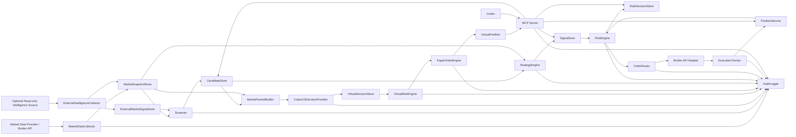

# Architecture

> Codex is not the trading engine. Codex is an MCP-based operations interface for inspecting, explaining, and safely controlling a deterministic trading backend.

## System Goal

이 아키텍처의 핵심 목표는 실시간 매매 판단과 주문 실행을 결정론적 백엔드에 두고, Codex는 MCP를 통해 운영자가 시스템 상태를 조회하고 설명을 받으며 승인 기반으로 제한적 제어를 수행하도록 만드는 것입니다.

Codex는 분석과 운영 인터페이스로 유용하지만, 실시간 trading loop의 소유자가 되어서는 안 됩니다. 실시간 루프는 latency, repeatability, auditability, failure isolation이 중요하므로 일반 애플리케이션 백엔드처럼 명시적인 코드, 테스트, 로그, 정책으로 제어해야 합니다.

## High-level Architecture

## Component Responsibilities

### Trading Engine

`Trading Engine`은 Codex와 독립적으로 실행됩니다. market data ingestion, screener execution, strategy evaluation, risk checks, order routing, execution tracking, position updates, audit logging을 담당합니다.

Trading Engine은 Codex가 실행 중이 아니어도 동작해야 합니다. Codex 장애, 네트워크 지연, 세션 종료가 매매 루프의 안정성에 영향을 주면 안 됩니다.

### MarketDataCollector

`MarketDataCollector`는 시세, 거래량, 호가, 체결, market hours 정보를 수집합니다. 수집된 데이터는 `MarketSnapshotStore`에 저장되고 screener와 strategy가 동일한 snapshot 기준으로 판단할 수 있게 합니다.

공식 broker adapter의 primary source는 Toss Securities Open API입니다. `tossinvest-cli` fork 같은 비공식 source는 production broker adapter가 아니라 optional read-only intelligence source로만 다룹니다. Official adapter 구현 전 설계 경계는 [official-toss-open-api-adapter-design.md](official-toss-open-api-adapter-design.md)를 따릅니다.

### ExternalIntelligenceCollector

`ExternalIntelligenceCollector`는 공식 API에 없는 market ranking, market signals, screener, quote flows 같은 보조 정보를 수집할 수 있는 선택적 worker입니다.

이 collector는 다음 경계를 지켜야 합니다.

- 기본 비활성화: `TOSSINVEST_CLI_ENABLED=false`
- read-only 강제: `TOSSINVEST_CLI_READ_ONLY=true`
- command allowlist 기반 실행
- `order`, `auth`, `config`, `watchlist` mutation, `--execute` 차단
- 모든 결과에 `source`, `official=false`, `collected_at`, `stale_after` 기록
- Codex MCP tool에서 raw external CLI command 직접 실행 금지

수집된 값은 candidate enrichment와 운영 설명에는 사용할 수 있지만, 계좌/주문/체결의 source of truth가 될 수 없습니다.

### Screener

`Screener`는 3~5분 같은 일정 주기로 실행되는 정량 필터입니다. volume spike, trading value, price change, moving average breakout, RSI, MACD, VWAP, spread, watchlist membership, existing position status 같은 규칙으로 후보 종목을 선별합니다.

Screener 결과는 `CandidateStore`에 저장됩니다. LLM은 후보 설명을 도울 수 있지만 후보 생성의 최종 기준이 되어서는 안 됩니다.

### CodexCliDecisionProvider

`CodexCliDecisionProvider`는 paper trading 전용 AI 판단 provider입니다. backend worker가 만든 `market_packet`을 `codex exec --sandbox read-only`에 전달하고, Codex는 schema가 고정된 `virtual_decision` JSON만 출력합니다.

이 provider는 다음 경계를 지켜야 합니다.

- 기본 비활성화: `AI_DECISION_ENABLED=false`
- paper 전용: `AI_DECISION_MODE=paper_only`
- read-only sandbox: `CODEX_EXEC_SANDBOX=read-only`
- 실제 `TradingSignal` 또는 live `OrderIntent` 생성 금지
- `tossctl`, broker API, shell command 실행 금지
- output schema validation 실패 시 no-decision 처리
- usage limit, timeout, login failure는 `AI_DECISION_FAILED` audit event로 기록

자세한 설계는 [codex-cli-paper-trading.md](codex-cli-paper-trading.md)를 참고합니다.

### PaperOrderEngine

`PaperOrderEngine`은 `virtual_decision`과 `VirtualRiskEngine` 결과를 받아 실제 주문 없이 가상 체결을 기록합니다.

`PaperOrderEngine`은 broker adapter를 호출하지 않습니다. 가상 현금, 가상 포지션, 평균단가, realized/unrealized PnL, decision outcome을 `VirtualPortfolio`와 `VirtualLedger`에 반영합니다.

### StrategyEngine

`StrategyEngine`은 후보 종목과 market snapshot을 입력으로 받아 구조화된 `TradingSignal`을 생성합니다. live trading 신호 생성은 deterministic code로 수행해야 하며 LLM이 final signal generator가 되면 안 됩니다.

`CodexCliDecisionProvider`의 `virtual_decision`은 실거래 `TradingSignal`이 아닙니다. paper trading 결과를 검증한 뒤에도 live trading으로 승격하려면 별도 설계, threat model, Risk Engine 테스트가 필요합니다.

### RiskEngine

`RiskEngine`은 주문 전 최종 gate입니다. max order amount, max daily loss, max position exposure, symbol allowlist, market allowlist, market hours, duplicate order prevention, cooldown, open order count, market order policy, kill switch를 하드코딩된 정책 또는 명시적 설정으로 검증합니다.

Codex는 Risk Engine의 정책을 런타임에 약화하거나 우회할 수 없습니다.

### OrderRouter

`OrderRouter`는 Risk Engine이 승인한 주문만 브로커 API adapter로 전달합니다. idempotency key, retry policy, timeout, execution tracking, reconciliation을 담당합니다.

Codex에서 전달된 자연어 주문 요청을 직접 받지 않습니다. 주문은 `TradingSignal`과 `RiskDecision`을 통과한 구조화된 intent만 처리합니다.

### MCP Server

`MCP Server`는 Codex에 운영 tool을 제공합니다. 기본은 read-only tools입니다. 제한적 side-effect tools는 명시적 approval을 요구하고, `place_order` 같은 위험 tool은 기본적으로 노출하지 않습니다.

MCP Server는 raw broker order API를 Codex에 직접 노출하는 계층이 아닙니다.

### Codex

Codex는 운영자 인터페이스입니다. portfolio status, screened candidates, signals, risk decisions, strategy status, open orders, recent executions, audit logs를 조회하고 설명할 수 있습니다. 후보 분석 보고서와 리스크 거절 사유 설명을 생성할 수 있습니다.

Codex is not the trading engine. Codex is an MCP-based operations interface for inspecting, explaining, and safely controlling a deterministic trading backend.

## Data Flow

1. `MarketDataCollector`가 시세와 호가 데이터를 수집합니다.
2. `ExternalIntelligenceCollector`가 선택적으로 read-only intelligence data를 수집합니다.
3. `Screener`가 후보를 만들고 `CandidateStore`에 저장합니다.
4. Paper trading mode에서는 `MarketPacketBuilder`가 후보와 snapshot을 압축해 `market_packet`을 만듭니다.
5. `CodexCliDecisionProvider`가 `market_packet`을 읽고 `virtual_decision` JSON을 생성합니다.
6. `VirtualRiskEngine`이 `virtual_decision`을 검증합니다.
7. `PaperOrderEngine`이 승인된 virtual decision만 가상 체결로 기록합니다.
8. Live trading mode에서는 deterministic `StrategyEngine`과 `RiskEngine` 경로를 별도로 유지합니다.
9. 승인된 live 주문만 `OrderRouter`가 브로커 adapter로 전달합니다.
10. 모든 주요 이벤트는 `AuditLogger`에 기록됩니다.
11. Codex는 MCP tools를 통해 저장된 상태와 감사 로그를 조회합니다.

## Why Codex Is Not the Real-time Trading Engine

LLM 기반 인터페이스는 설명, 요약, 검색, 운영 질의에 적합하지만 low-latency trading decision에는 적합하지 않습니다.

- 동일 입력에 대해 항상 동일한 판단을 보장하기 어렵습니다.
- latency와 timeout이 예측 가능하지 않습니다.
- 시장 급변 상황에서 재현 가능한 장애 대응이 어렵습니다.
- 주문, 체결, 리스크 판단은 감사 가능한 deterministic trace가 필요합니다.
- 자연어 요청은 오해, 누락, 과잉 해석 가능성이 있습니다.
- 런타임 정책 변경을 LLM이 수행하면 리스크 통제선이 무너집니다.

따라서 Codex는 상태 조회, 설명, 분석, 보고서 생성, 승인 기반 운영 제어에 한정합니다.

예외적으로 paper trading에서는 Codex CLI가 `virtual_decision`을 만들 수 있습니다. 이 판단은 실계좌 주문 판단이 아니라 가상 포트폴리오 실험 데이터이며, live `TradingSignal`이나 `OrderIntent`로 사용할 수 없습니다.

## Recommended Runtime Boundaries

- Trading jobs는 backend scheduler, queue worker, service daemon에서 실행합니다.
- Codex automation은 trading loop를 실행하지 않습니다.
- MCP Server는 Trading Engine의 상태 저장소와 service API를 read-only 중심으로 감쌉니다.
- OrderRouter는 MCP tool이 아니라 backend internal service로 유지합니다.
- 실거래 adapter는 `TRADING_ENABLED=false`를 기본값으로 두고 mock provider에서 먼저 검증합니다.
- 비공식 intelligence source는 read-only collector로 격리하고, 주문 실행 경로와 MCP raw command 실행 경로에 연결하지 않습니다.
- Codex CLI decision provider는 `paper_only` mode에서만 실행하고 `VirtualPortfolio`에만 영향을 줍니다.
- Risk Engine은 독립 테스트와 fixture를 가져야 합니다.
- 운영 제어 tool은 approval, audit log, idempotency를 가져야 합니다.
