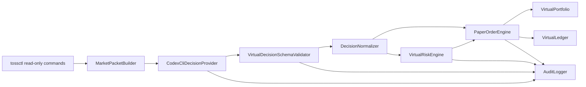

# Codex CLI Paper Trading

> Codex is not the trading engine. Codex CLI may be used as a paper-only decision provider that emits virtual decisions for a simulated portfolio.

## 목적

이 문서는 `codex exec`를 사용해 API 비용을 추가로 내지 않고, 사용자의 ChatGPT Pro/Codex 사용량 안에서 AI 기반 가상 투자 판단을 실행하는 구조를 정의합니다.

목표는 실제 주문이 아니라 `VirtualPortfolio`에 기록되는 paper trading입니다. Codex CLI는 시장 데이터를 직접 수집하거나 주문을 실행하지 않습니다. backend worker가 만든 압축된 `market_packet`을 읽고, schema가 고정된 `virtual_decision` JSON만 출력합니다.

참고 문서:

- Codex non-interactive mode: <https://developers.openai.com/codex/noninteractive>
- Codex CLI command reference: <https://developers.openai.com/codex/cli/reference>
- Codex usage limits: <https://help.openai.com/en/articles/11369540-using-codex-with-your-chatgpt-plan>

## High-level Flow



## 역할 분리

### Backend Worker

Backend worker는 반복 가능성과 상태를 소유합니다.

- allowlist wrapper를 통해 `tossctl` read-only command만 실행합니다.
- market data와 source metadata를 정규화합니다.
- compact `market_packet`을 생성합니다.
- read-only sandbox 설정으로 `codex exec`를 호출합니다.
- Codex output을 JSON Schema로 검증합니다.
- AI가 낸 raw sizing hint를 `NormalizedVirtualOrder`로 변환합니다.
- `VirtualRiskEngine`을 적용합니다.
- `VirtualPortfolio`와 `VirtualLedger`를 갱신합니다.
- audit event를 기록합니다.

### Codex CLI

Codex CLI는 paper trading 전용 AI decision provider입니다.

- `market_packet`을 읽습니다.
- `virtual_decision` JSON을 생성합니다.
- thesis와 risk factor를 설명합니다.
- `tossctl`을 실행하지 않습니다.
- broker API를 호출하지 않습니다.
- worker가 final message를 output file로 라우팅하는 경우 외에는 파일을 쓰지 않습니다.
- real `TradingSignal` 또는 live `OrderIntent`를 생성하지 않습니다.

### VirtualRiskEngine

`VirtualRiskEngine`은 AI 판단을 대체하지 않습니다. `DecisionNormalizer`가 계산한 paper notional을 기준으로 가상 decision을 승인하거나 거절하는 최종 gate입니다.

예시:

- stale market packet
- insufficient virtual cash
- max symbol exposure exceeded
- max daily turnover exceeded
- cooldown not satisfied
- unsupported market or symbol
- missing thesis or risk factors
- invalid confidence range

## 설정

안전한 기본값:

```env
AI_DECISION_PROVIDER=codex_cli
AI_DECISION_MODE=paper_only
AI_DECISION_ENABLED=false
CODEX_EXEC_PATH=codex
CODEX_EXEC_SANDBOX=read-only
CODEX_EXEC_TIMEOUT_SECONDS=300
CODEX_DECISION_MAX_RUNS_PER_DAY=3
CODEX_DECISION_MAX_SYMBOLS=20
CODEX_DECISION_ALLOW_WEB_SEARCH=false
PAPER_TRADING_ENABLED=true
VIRTUAL_INITIAL_CASH_KRW=1000000
```

`AI_DECISION_ENABLED=false`가 기본값입니다. scheduled AI decision을 켜기 전에 storage, schema, dry-run 검증을 먼저 구현해야 합니다.

로컬 실행에서는 CLI와 MCP server 진입점이 프로젝트 루트 `.env`를 자동으로 읽습니다. `CODEX_EXEC_PATH`는 Windows 전역 환경 변수일 필요가 없고, 이 프로젝트의 `.env`에만 둘 수 있습니다. Windows Store alias가 `Access is denied`를 반환하는 경우에는 `codex` alias 대신 실제 Codex binary 경로를 사용합니다.

예시:

```env
CODEX_EXEC_PATH=C:\Users\<user>\AppData\Local\OpenAI\Codex\bin\<version>\codex.exe
```

`.env`는 Git에서 제외됩니다. real account data, brokerage credential, API key는 넣지 않습니다.

## Market Packet

`market_packet`은 automated paper decision run에서 Codex가 받는 유일한 입력입니다.

권장 형태:

```json
{
  "packet_id": "packet_20260611_153000",
  "mode": "paper_only",
  "generated_at": "2026-06-11T15:30:00+09:00",
  "expires_at": "2026-06-11T15:35:00+09:00",
  "virtual_portfolio": {
    "cash_krw": 1000000,
    "positions": []
  },
  "candidates": [
    {
      "market": "KR",
      "symbol": "005930",
      "name": "Sample Corp",
      "last_price_krw": 70000,
      "ranking": 12,
      "reason_codes": ["RANKING", "FLOW_POSITIVE"],
      "featureRefs": [
        "candidate.KR.005930.lastPriceKrw",
        "candidate.KR.005930.ranking",
        "candidate.KR.005930.buyEligible"
      ],
      "buyEligible": true,
      "sellEligible": false,
      "blockedReasonCodes": ["POSITION_NOT_FOUND"],
      "budgetTierAllowed": "LARGE",
      "positionExists": false,
      "cooldownActive": false,
      "source_refs": ["external_snapshot_001"]
    }
  ],
  "constraints": {
    "max_new_positions": 3,
    "max_budget_per_symbol_krw": 100000,
    "allowed_actions": ["VIRTUAL_BUY", "VIRTUAL_SELL", "VIRTUAL_HOLD"]
  }
}
```

packet은 작게 유지합니다. raw quote data, order book, news text를 대량으로 넘기기보다 top 10-20 후보만 전달합니다.

candidate별 action eligibility는 backend가 미리 계산합니다. AI는 `buyEligible`, `sellEligible`, `blockedReasonCodes`, `budgetTierAllowed`, `positionExists`, `cooldownActive`를 policy-safe envelope로 읽고, `buyEligible=false`인 후보에 `VIRTUAL_BUY`를 제안하거나 `sellEligible=false`인 후보에 `VIRTUAL_SELL`을 제안하지 않습니다. 이런 proposal은 semantic validator에서 hard reject됩니다.

candidate별 `featureRefs`도 backend가 deterministic하게 생성합니다. AI decision의 optional `featureRefs`는 같은 candidate의 `featureRefs`에서 복사한 값만 허용됩니다. packet 밖 feature path나 다른 symbol의 feature path는 semantic validator에서 hard reject됩니다.

## Virtual Decision Schema

paper order를 만들기 전에 Codex output은 반드시 schema validation을 통과해야 합니다. 현재 런타임 계약은 `schemas/virtual-decision.schema.json`과 `virtualDecisionSchema`의 camelCase 필드를 기준으로 합니다.

기본 필수 필드는 다음과 같습니다.

```json
{
  "type": "object",
  "required": [
    "packetId",
    "packetHash",
    "promptVersion",
    "modelId",
    "schemaVersion",
    "policyVersion",
    "decisions",
    "summary"
  ],
  "additionalProperties": false,
  "properties": {
    "packetId": { "type": "string" },
    "packetHash": {
      "type": "string",
      "pattern": "^sha256:[a-f0-9]{64}$"
    },
    "promptVersion": { "type": "string" },
    "modelId": { "type": "string" },
    "schemaVersion": { "type": "string" },
    "policyVersion": { "type": "string" },
    "summary": { "type": "string" },
    "decisions": {
      "type": "array",
      "maxItems": 20,
      "items": {
        "type": "object",
        "required": [
          "symbol",
          "market",
          "action",
          "confidence",
          "budgetKrw",
          "thesis",
          "riskFactors",
          "dataRefs",
          "claimSupport",
          "expiresAt"
        ],
        "additionalProperties": false,
        "properties": {
          "symbol": { "type": "string" },
          "market": { "type": "string", "enum": ["KR", "US"] },
          "action": {
            "type": "string",
            "enum": ["VIRTUAL_BUY", "VIRTUAL_SELL", "VIRTUAL_HOLD"]
          },
          "holdReasonCode": {
            "type": "string",
            "enum": [
              "INSUFFICIENT_EVIDENCE",
              "STALE_DATA",
              "CONTRADICTORY_SIGNALS",
              "POLICY_BLOCKED",
              "PORTFOLIO_CONFLICT",
              "NO_POSITION_TO_SELL",
              "NOT_IN_CANDIDATES",
              "LOW_LIQUIDITY"
            ]
          },
          "confidence": { "type": "number", "minimum": 0, "maximum": 1 },
          "budgetKrw": { "type": "integer", "minimum": 0 },
          "maxBudgetKrw": { "type": "integer", "minimum": 0 },
          "sellQuantity": { "type": "number", "exclusiveMinimum": 0 },
          "sellRatio": { "type": "number", "exclusiveMinimum": 0, "maximum": 1 },
          "targetWeightPct": { "type": "number", "minimum": 0, "maximum": 1 },
          "sellAll": { "type": "boolean" },
          "reduceOnly": { "type": "boolean" },
          "thesis": { "type": "string" },
          "riskFactors": {
            "type": "array",
            "items": { "type": "string" }
          },
          "dataRefs": {
            "type": "array",
            "items": { "type": "string" }
          },
          "featureRefs": {
            "type": "array",
            "items": { "type": "string" }
          },
          "claimSupport": {
            "type": "array",
            "minItems": 1,
            "items": {
              "type": "object",
              "required": ["claim"],
              "anyOf": [
                { "required": ["dataRefs"] },
                { "required": ["featureRefs"] }
              ],
              "additionalProperties": false,
              "properties": {
                "claim": { "type": "string" },
                "dataRefs": {
                  "type": "array",
                  "minItems": 1,
                  "items": { "type": "string" }
                },
                "featureRefs": {
                  "type": "array",
                  "minItems": 1,
                  "items": { "type": "string" }
                }
              }
            }
          },
          "expiresAt": { "type": "string" }
        }
      }
    }
  }
}
```

저장된 `VirtualDecision` record에는 backend-generated `decisionHash`가 추가될 수 있습니다. 이 값은 Codex output field가 아니며 `schemas/virtual-decision.schema.json`에도 포함하지 않습니다. backend는 validation을 통과한 decision을 저장하기 직전에 `decisionHash` 자신을 제외한 stable JSON을 `sha256:<hex>`로 계산해 붙입니다.

`budgetKrw`는 v1 호환성을 위해 아직 필수입니다. 다만 `VIRTUAL_SELL`에서는 매도 금액을 임의 추정하지 않도록 다음 규칙을 적용합니다.

- `VIRTUAL_SELL`은 `budgetKrw > 0`, `sellQuantity`, `sellRatio`, `targetWeightPct`, `sellAll` 중 하나가 있어야 합니다.
- `sellQuantity`, `sellRatio`, `targetWeightPct`, `sellAll`을 사용하는 v2 SELL sizing은 반드시 `reduceOnly: true`여야 합니다.
- `VIRTUAL_HOLD`는 `budgetKrw: 0`과 `holdReasonCode`를 포함해야 하고 SELL sizing 필드를 넣지 않습니다.
- `holdReasonCode`는 `INSUFFICIENT_EVIDENCE`, `STALE_DATA`, `CONTRADICTORY_SIGNALS`, `POLICY_BLOCKED`, `PORTFOLIO_CONFLICT`, `NO_POSITION_TO_SELL`, `NOT_IN_CANDIDATES`, `LOW_LIQUIDITY` 중 하나입니다.
- `VIRTUAL_BUY`와 `VIRTUAL_SELL`에는 `holdReasonCode`를 넣지 않습니다.
- `packetHash`는 backend가 입력 packet에서 계산한 `sha256:<hex>` 값과 정확히 같아야 합니다.
- `promptVersion`, `modelId`, `schemaVersion`, `policyVersion`은 backend가 stdin envelope에 넣은 값을 그대로 복사해야 합니다.
- `decisionHash`는 AI가 출력하지 않습니다. AI가 제공한 `decisionHash`는 semantic validator에서 reject됩니다.
- `claimSupport`는 각 핵심 thesis/risk claim을 같은 candidate의 `dataRefs` 또는 `featureRefs`에 매핑해야 합니다. 누락, 다른 candidate ref, packet 밖 ref는 semantic validator에서 reject됩니다.
- Risk Engine과 PaperOrderEngine은 후보 가격과 현재 포지션을 기준으로 실제 paper notional을 다시 계산합니다.

## Normalized Virtual Order

AI decision의 `budgetKrw`, `sellQuantity`, `sellRatio`, `targetWeightPct`, `sellAll`은 실행 명령이 아니라 sizing hint입니다. `DecisionNormalizer`가 backend state와 packet constraint를 사용해 `NormalizedVirtualOrder`를 만들고, `VirtualRiskEngine`과 `PaperOrderEngine`은 이 정규화 결과의 `targetNotionalKrw`를 사용합니다.

정규화 규칙:

- `VIRTUAL_BUY`: `budgetKrw`를 `market_packet.constraints.maxBudgetPerSymbolKrw` 이하로 cap합니다.
- `VIRTUAL_SELL`: 현재 virtual position과 packet candidate price를 기준으로 reduce-only notional을 계산합니다.
- `sellAll`: 현재 보유 수량 전체의 후보 가격 기준 value를 target으로 사용합니다.
- `sellQuantity`: 요청 수량과 후보 가격으로 target notional을 계산합니다.
- `sellRatio`: 현재 보유 수량의 비율만큼 target notional을 계산합니다.
- `targetWeightPct`: 현재 position value와 목표 portfolio weight의 차이만큼 축소 notional을 계산합니다.
- oversize SELL은 현재 virtual position value를 넘지 않도록 clip합니다.
- `VIRTUAL_HOLD`: `targetNotionalKrw: 0`, `reduceOnly: true`로 정규화합니다.

이 계층 때문에 Codex CLI output은 paper-only 판단 설명과 sizing hint까지만 담당합니다. paper 체결 가능 금액, position 초과 매도 방지, 최종 승인/거절은 backend가 결정합니다.

예시:

```json
{
  "packetId": "packet_2026-06-12T09:00:00+09:00",
  "packetHash": "sha256:aaaaaaaaaaaaaaaaaaaaaaaaaaaaaaaaaaaaaaaaaaaaaaaaaaaaaaaaaaaaaaaa",
  "promptVersion": "paper-v9",
  "modelId": "codex-cli-unspecified",
  "schemaVersion": "virtual-decision.schema.v1",
  "policyVersion": "paper-risk-policy.v1",
  "summary": "보유 종목 일부 차익 실현 후보",
  "decisions": [
    {
      "symbol": "005930",
      "market": "KR",
      "action": "VIRTUAL_SELL",
      "confidence": 0.61,
      "budgetKrw": 0,
      "sellRatio": 0.5,
      "reduceOnly": true,
      "thesis": "최근 packet 기준 단기 과열 신호가 있어 paper-only로 절반 축소를 제안한다.",
      "riskFactors": ["과거 데이터 기반 replay이며 실거래 신호가 아니다."],
      "dataRefs": ["packet.candidates[0]"],
      "featureRefs": ["candidate.KR.005930.buyEligible"],
      "claimSupport": [
        {
          "claim": "단기 과열 신호가 있어 paper-only로 절반 축소를 제안한다.",
          "dataRefs": ["packet.candidates[0]"],
          "featureRefs": ["candidate.KR.005930.buyEligible"]
        }
      ],
      "expiresAt": "2026-06-12T10:00:00+09:00"
    }
  ]
}
```

## Codex Exec Invocation

권장 패턴:

```powershell
codex exec `
  --sandbox read-only `
  --output-schema .\schemas\virtual-decision.schema.json `
  "Use only the provided packetHash and marketPacket. Return virtual_decision JSON only."
```

stdin은 backend provider가 다음 형태로 구성합니다.

```json
{
  "packetHash": "sha256:aaaaaaaaaaaaaaaaaaaaaaaaaaaaaaaaaaaaaaaaaaaaaaaaaaaaaaaaaaaaaaaa",
  "promptVersion": "paper-v9",
  "modelId": "codex-cli-unspecified",
  "schemaVersion": "virtual-decision.schema.v1",
  "policyVersion": "paper-risk-policy.v1",
  "marketPacket": {
    "packetId": "packet_2026-06-12T09:00:00+09:00",
    "mode": "paper_only"
  }
}
```

Codex output의 top-level `packetHash`, `promptVersion`, `modelId`, `schemaVersion`, `policyVersion`은 stdin 값을 그대로 복사해야 합니다.
`decisionHash`는 복사 대상이 아닙니다. backend가 validated decision을 storage와 replay audit record에 기록할 때 생성합니다.

workspace가 아직 Git repository가 아니라면 scheduled Codex run 전에 Git을 초기화합니다. `codex exec --skip-git-repo-check`는 통제된 one-off dry run에서만 사용합니다.

사용하지 않습니다:

- `--sandbox workspace-write`
- `--sandbox danger-full-access`
- `--search` by default
- Codex에게 `tossctl` 실행을 요청하는 prompt
- real order execution을 요청하는 prompt

## Prompt Contract

prompt는 단순하고 엄격해야 합니다.

필수 지시:

- paper trading only임을 명시합니다.
- supplied packet만 사용합니다.
- schema에 맞는 JSON만 반환합니다.
- command를 호출하지 않습니다.
- 누락된 가격을 추정하지 않습니다.
- candidate `featureRefs`가 있으면 같은 candidate에서 복사한 값만 사용합니다.
- decision item마다 `claimSupport`를 포함하고 각 claim을 같은 candidate의 `dataRefs` 또는 `featureRefs`에 연결합니다.
- investment advice로 읽히는 표현을 쓰지 않습니다.
- stale, incomplete, contradictory data에서는 `VIRTUAL_HOLD`를 선호합니다.
- non-hold decision에는 risk factor를 포함합니다.
- candidate eligibility field가 action을 막고 있으면 해당 action을 제안하지 않습니다.

## 실패 정책

worker는 다음 경우 Codex를 unavailable로 처리해야 합니다.

- `codex` executable이 없습니다.
- Codex authentication이 없습니다.
- usage limit에 도달했습니다.
- command timeout이 발생했습니다.
- output이 valid JSON이 아닙니다.
- output이 schema validation에 실패했습니다.
- decision이 존재하지 않는 `data_ref`를 참조합니다.
- decision action이 allowed action set 밖에 있습니다.

실패 결과:

- paper order를 생성하지 않습니다.
- `AI_DECISION_FAILED` audit event를 기록합니다.
- 기존 virtual position은 변경하지 않습니다.
- daily run budget이 남아 있으면 다음 scheduled run에서 재시도할 수 있습니다.

## 사용량 정책

Codex Pro는 더 높은 포함 사용량을 제공하지만 usage limit이 있습니다. automated paper trading은 절약형으로 운영합니다.

권장 기본값:

- 장 종료 후 scheduled decision run 1회
- 선택적 intraday run 1회
- 하루 최대 3회
- packet당 후보 최대 20개
- 특정 strategy가 요구하지 않으면 raw order book dump 금지
- scheduled run에서는 web search 비활성화
- 품질이 충분할 때만 더 작은 model/profile 사용

현재 Codex limit은 Codex usage dashboard 또는 active Codex CLI session의 `/status`에서 확인합니다.

## 보안과 안전 규칙

- `TRADING_ENABLED=false`를 기본값으로 유지합니다.
- `AI_DECISION_MODE=paper_only`가 필수입니다.
- Codex virtual decision은 live `TradingSignal` record가 되지 않습니다.
- Codex virtual decision은 live `OrderIntent` record가 되지 않습니다.
- MCP는 `run_codex_exec` 같은 raw execution tool을 노출하지 않습니다.
- live trading migration은 별도 threat model, test, explicit approval, Risk Engine integration이 필요합니다.
- paper trading report는 profitability나 financial advice를 주장하지 않습니다.

## TradingAgents와의 관계

`tossinvest-cli` repository에는 `TradingAgents -> tossctl` bridge example이 있습니다. AI-generated decision 참고 패턴으로는 유용하지만, 이 프로젝트는 live order bridge를 복사하지 않습니다.

참고할 부분:

- AI가 buy/hold/sell 스타일의 analysis를 생성합니다.
- output이 structured and auditable합니다.

복사하지 않을 부분:

- AI output을 `tossctl order place`로 전달
- `--execute` 활성화
- real brokerage state를 execution target으로 사용

이 프로젝트에서는 AI output을 `PaperOrderEngine`으로만 라우팅합니다.
