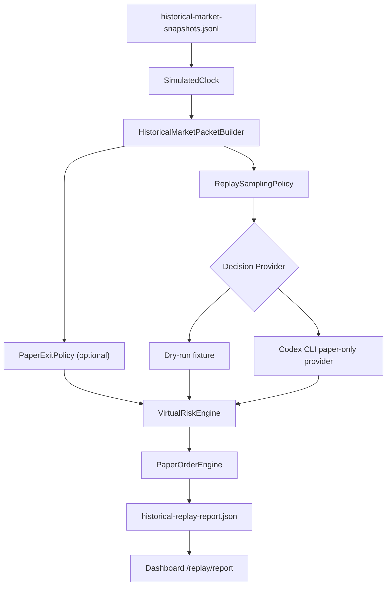

# Historical Replay

이 문서는 과거 시장 데이터를 simulated time으로 빠르게 흘려보내고, paper-only 가상 투자 판단과 결과를 확인하는 흐름을 설명합니다.

## 목적

Historical replay는 실제 시간을 기다리지 않고 저장된 과거 snapshot을 순서대로 `market_packet`으로 변환합니다. 이 packet은 dry-run fixture provider 또는 Codex CLI paper-only provider에 전달할 수 있습니다.

이 기능은 실거래 백테스트 엔진이 아닙니다. 결과는 가상 포트폴리오 시뮬레이션이며 투자 조언, 수익률 보장, 실계좌 성과가 아닙니다.

## 입력과 출력

입력:

- `historical-market-snapshots.jsonl`
- 선택적 `virtual-portfolio.json`
- replay window: `startAt`, `endAt`, `stepSeconds`
- sampling policy: `everyNSteps`, `candidateChangedOnly`, `decisionFrequency`, `maxDecisionCalls`
- decision provider: dry-run fixture 또는 Codex CLI paper-only provider
- paper risk profile: `conservative`, `balanced`, `aggressive_paper`
- optional paper exit policy: take-profit, stop-loss, rebalance threshold

출력:

- `historical-replay-report.json`
- `historical-replay-progress.json`
- `historical-replay-run-metadata.json`
- `historical-replay-packets.jsonl`
- `historical-replay-decisions.jsonl`
- `historical-replay-risk-decisions.jsonl`
- `historical-replay-trades.jsonl`
- `historical-replay-portfolio-timeline.jsonl`
- dashboard `/replay/report` read-only 조회
- CLI stdout markdown report

`historical-replay-progress.json`은 dashboard 표시용 snapshot입니다. 전체 분석과 재현에는 append-only JSONL 로그를 사용합니다.

`historical-replay-run-metadata.json`은 replay 실행 단위의 재현성 근거를 저장합니다.

포함되는 metadata:

- `identity`: `runId`, optional `batchId`, optional `runIndex`
- `window`: explicit/random window source, start/end, selected month, seed, timezone offset
- `configuration`: clock, sampling policy, initial cash, packet/risk profile/constraint, paper exit policy 요약
- `logPaths`: packet, decision, risk decision, trade, portfolio timeline log path
- `status`: `running`, `completed`, `failed`

Batch replay runner는 후속 단계에서 이 metadata를 각 실행 결과의 기본 manifest로 사용합니다.

## Portfolio Valuation

Historical replay는 각 simulated tick에서 보유 포지션을 해당 tick까지 관측 가능한 최신 historical snapshot 가격으로 재평가합니다.

저장되는 position valuation 필드:

- `marketPriceKrw`
- `marketValueKrw`
- `unrealizedPnlKrw`
- `priceUpdatedAt`
- `priceStaleAfter`
- `priceSourceRefs`
- `isPriceStale`

가격이 없는 포지션은 기존 `marketValueKrw`를 유지하고, 값이 없으면 `quantity * averagePriceKrw`를 fallback으로 사용합니다. 이 fallback은 성과 검증용 현재가가 아니라 데이터 결손 상태로 해석해야 합니다.

## Benchmark Report

`historical-replay-report.json`은 replay 결과와 함께 최소 비교 기준을 생성합니다.

포함되는 benchmark:

- `strategy`: 실제 paper replay portfolio timeline 기준
- `cashOnly`: 초기 순자산을 현금으로 보유한 기준
- `equalWeightBuyAndHold`: 첫 priced replay packet의 후보를 동일가중으로 매수 후 보유한 기준
- `initialPortfolioBuyAndHold`: 초기 포트폴리오를 거래 없이 보유한 기준
- `comparisons`: strategy metric에서 각 benchmark metric을 뺀 차이

포함되는 metric:

- `initialNetWorthKrw`
- `finalNetWorthKrw`
- `totalReturnRatio`
- `maxDrawdownRatio`
- `tickVolatilityRatio`
- `turnoverRatio`
- `feeDragKrw`

`comparisons`는 `strategyVsCashOnly`, `strategyVsEqualWeightBuyAndHold`, `strategyVsInitialPortfolioBuyAndHold`를 포함합니다. 각 delta는 strategy metric minus benchmark metric입니다. 비교 대상 benchmark를 만들 수 없으면 `benchmarkAvailable=false`와 `null` delta를 기록합니다.

이 benchmark는 저장된 replay packet과 portfolio timeline만 사용합니다. 외부 지수, 미래 가격, 실계좌 성과와 비교하지 않습니다.

## Flow



## 실행

dry-run은 AI 호출 없이 deterministic fixture decision을 사용합니다.

```powershell
npm run historical:replay:dry -- data/paper 2025-01-02T09:00:00+09:00 2025-01-02T15:30:00+09:00 60 5
```

Codex CLI provider를 사용할 때는 `.env`에 로컬 실행 설정을 둡니다.

```text
AI_DECISION_MODE=paper_only
AI_DECISION_ENABLED=true
CODEX_EXEC_PATH=codex
CODEX_EXEC_SANDBOX=read-only
CODEX_EXEC_TIMEOUT_SECONDS=300
CODEX_OUTPUT_SCHEMA_PATH=schemas/virtual-decision.schema.json
CODEX_DECISION_MAX_RUNS_PER_DAY=5
CODEX_DECISION_ALLOW_WEB_SEARCH=false
```

Historical replay CLI는 기존 paper CLI와 같은 `CODEX_*` 설정명을 fallback으로 읽습니다. 같은 목적의 `AI_DECISION_*` 값이 함께 있으면 `AI_DECISION_OUTPUT_SCHEMA_PATH`, `AI_DECISION_MAX_RUNS_PER_DAY`, `CODEX_ALLOW_WEB_SEARCH`가 우선됩니다.

```powershell
npm run historical:replay -- data/paper 2025-01-02T09:00:00+09:00 2025-01-02T15:30:00+09:00 60 5
```

positional arguments:

```text
dataDir startAt endAt stepSeconds everyNSteps
```

예:

- `dataDir`: `data/paper`
- `startAt`: `2025-01-02T09:00:00+09:00`
- `endAt`: `2025-01-02T15:30:00+09:00`
- `stepSeconds`: `60`
- `everyNSteps`: `5`

### 랜덤 1개월 Window 선택

batch replay의 선행 단계로 seed 기반 랜덤 calendar-month window를 선택할 수 있습니다.

선택만 확인:

```powershell
npm run historical:replay:dry -- -- --random-window --random-window-from 2023-01-01T00:00:00+09:00 --random-window-to 2026-05-31T23:59:59.999+09:00 --random-window-seed batch-seed-001 --window-months 1 --print-window-only
```

선택된 window로 dry-run replay 실행:

```powershell
npm run historical:replay:dry -- -- --data-dir data/paper --random-window --random-window-from 2023-01-01T00:00:00+09:00 --random-window-to 2026-05-31T23:59:59.999+09:00 --random-window-seed batch-seed-001 --window-months 1 --step-seconds 60 --every-n-steps 5
```

특성:

- 같은 `--random-window-seed`와 같은 range는 항상 같은 window를 선택합니다.
- window는 지정 range 안에 완전히 포함되는 calendar-month 단위로만 선택됩니다.
- `--print-window-only`는 replay를 실행하지 않고 선택된 window metadata만 JSON으로 출력합니다.
- 이 선택 metadata는 batch runner와 aggregate report에서 재현성 근거로 사용할 예정입니다.

### Historical Data Availability 확인

선택된 replay window에 실제 historical snapshot이 있는지 사전에 확인할 수 있습니다.

```powershell
npm run historical:availability -- -- --data-dir data/paper --random-window --random-window-from 2023-01-01T00:00:00+09:00 --random-window-to 2026-05-31T23:59:59.999+09:00 --random-window-seed batch-seed-001 --window-months 1 --min-window-snapshots 1
```

특정 symbol coverage도 함께 요구할 수 있습니다.

```powershell
npm run historical:availability -- -- --data-dir data/paper --start-at 2025-02-01T00:00:00+09:00 --end-at 2025-02-28T23:59:59.999+09:00 --required-symbols KR:005930,KR:000660 --min-snapshots-per-symbol 1
```

실제 replay 실행 전에 데이터 부족을 fail-closed로 막으려면 `--require-data-availability`를 사용합니다.

```powershell
npm run historical:replay:dry -- -- --data-dir data/paper --random-window --random-window-from 2023-01-01T00:00:00+09:00 --random-window-to 2026-05-31T23:59:59.999+09:00 --random-window-seed batch-seed-001 --window-months 1 --require-data-availability
```

availability report는 저장된 `historical-market-snapshots.jsonl`만 읽습니다. 외부 데이터 수집, broker API 호출, replay 실행, 주문 생성은 수행하지 않습니다.

### Batch Run Metadata

반복 batch 실행에서 개별 run을 추적하려면 metadata용 식별자를 CLI에 전달할 수 있습니다.

```powershell
npm run historical:replay:dry -- -- --data-dir data/paper --start-at 2025-02-01T00:00:00+09:00 --end-at 2025-02-28T23:59:59.999+09:00 --step-seconds 60 --every-n-steps 5 --batch-id batch-2025-q1-smoke --batch-run-index 0 --run-id batch-2025-q1-smoke-run-000000
```

이 옵션은 `historical-replay-run-metadata.json`에만 저장됩니다. replay sampling, AI decision, risk decision, paper order 처리 정책을 바꾸지 않습니다.

### Batch Replay Runner

여러 random 1개월 window를 반복 실행하고 run별 결과를 JSONL로 남길 수 있습니다.

```powershell
npm run historical:batch:replay:dry -- -- --source-data-dir data/replay-2026-04-12-2026-06-12 --output-dir data/batch-replay --batch-id batch-smoke-001 --seed batch-seed-001 --runs 10 --random-window-from 2023-01-01T00:00:00+09:00 --random-window-to 2026-05-31T23:59:59.999+09:00 --window-months 1 --decision-frequency once_per_week --max-decision-calls 5 --step-seconds 604800 --max-snapshot-age-seconds 2678400 --min-window-snapshots 1
```

출력 구조:

```text
data/batch-replay/
└── batch-smoke-001/
    ├── batch-replay-manifest.json
    ├── batch-replay-runs.jsonl
    └── runs/
        └── batch-smoke-001_run_000000_202604/
            ├── historical-replay-report.json
            ├── historical-replay-run-metadata.json
            ├── historical-replay-packets.jsonl
            ├── historical-replay-decisions.jsonl
            ├── historical-replay-risk-decisions.jsonl
            ├── historical-replay-trades.jsonl
            └── historical-replay-portfolio-timeline.jsonl
```

- batch runner는 source data directory의 `historical-market-snapshots.jsonl`을 읽고, run별 출력은 batch output directory 아래에 분리해 씁니다.
- 각 run은 `seed:runIndex`를 사용해 deterministic random window를 선택합니다.
- availability check가 `insufficient`이면 해당 run은 `skipped`로 기록되고 replay workflow를 실행하지 않습니다.
- 각 run record는 `marketRegime`을 포함합니다. label은 `bull`, `bear`, `sideways`, `mixed`, `insufficient_data` 중 하나입니다.
- `--window-sampling balanced_regime`을 사용하면 requested market regime bucket을 순환하며 window를 선택합니다.
- 기본 batch runner는 deterministic paper replay를 실행합니다. Codex CLI AI 호출은 `--use-codex-ai`를 명시하고 환경 변수가 활성화된 경우에만 수행합니다.
- `batch-replay-runs.jsonl`은 후속 aggregate report의 입력으로 사용됩니다.

#### Market Regime Balanced Sampling

기본 batch replay는 seed 기반 random month sampling을 사용합니다. 장세별 결과를 더 균형 있게 비교하려면 `balanced_regime` sampling을 명시합니다.

```powershell
npm run historical:batch:replay:dry -- -- --source-data-dir data/replay-2023-01-2026-05-yahoo-daily --output-dir data/batch-replay --batch-id batch-balanced-regime-smoke --seed batch-seed-001 --runs 4 --random-window-from 2023-01-01T00:00:00+09:00 --random-window-to 2026-05-31T23:59:59.999+09:00 --window-months 1 --decision-frequency once_per_week --max-decision-calls 1 --step-seconds 604800 --max-snapshot-age-seconds 2678400 --min-window-snapshots 1 --window-sampling balanced_regime
```

동작:

- 기본 target regime은 `bull,bear,sideways,mixed`입니다.
- `--target-regimes bull,bear,sideways,mixed`처럼 target을 명시할 수 있습니다.
- sampler는 전체 후보 month를 먼저 `marketRegime`으로 분류한 뒤, 사용 가능한 target bucket만 active target으로 둡니다.
- run index는 active target regime을 순환합니다. 예를 들어 active target이 4개이고 run이 4개이면 각 regime이 1번씩 target이 됩니다.
- target bucket 안의 month 선택은 seed, run index, target regime, replay range를 사용해 deterministic하게 수행합니다.
- 선택 결과는 run record의 `windowSampling.targetRegime`, `targetCandidateCount`, `marketRegime`에 저장됩니다.
- manifest의 `windowSampling`에는 requested/active/unavailable target regime, 전체 candidate count, bucket count가 저장됩니다.

이 sampling은 분석용 window selection metadata입니다. trading signal, risk approval, order intent, strategy 자동 조정으로 사용하지 않습니다.

#### Paper Risk Profile

Historical replay와 batch replay는 paper-only 실험용 risk profile을 선택할 수 있습니다.

```powershell
npm run historical:batch:replay:dry -- -- --source-data-dir data/replay-2023-01-2026-05-yahoo-daily --output-dir data/batch-replay --batch-id batch-aggressive-profile-smoke --seed batch-seed-001 --runs 10 --random-window-from 2023-01-01T00:00:00+09:00 --random-window-to 2026-05-31T23:59:59.999+09:00 --window-months 1 --decision-frequency once_per_week --max-decision-calls 5 --step-seconds 604800 --max-snapshot-age-seconds 2678400 --min-window-snapshots 1 --risk-profile aggressive_paper
```

| Profile | `maxNewPositions` | `maxBudgetPerSymbolKrw` | `maxPositionWeightRatio` | `minCashReserveRatio` |
| --- | ---: | ---: | ---: | ---: |
| `conservative` | 3 | 100,000 | 0.35 | 0.10 |
| `balanced` | 4 | 200,000 | 0.45 | 0.08 |
| `aggressive_paper` | 5 | 400,000 | 0.65 | 0.05 |

- 기본값은 `conservative`입니다.
- `--max-new-positions`, `--max-budget-per-symbol-krw`를 명시하면 선택한 profile의 packet constraint와 paper risk policy에 같은 override가 반영됩니다.
- `aggressive_paper`는 더 큰 paper-only 매수 후보와 종목 exposure를 허용해 수익률 분포를 실험하기 위한 profile입니다.
- 선택된 profile과 정규화된 risk policy는 `batch-replay-manifest.json`과 각 run의 `historical-replay-run-metadata.json`에 기록됩니다.
- 이 profile은 `VirtualRiskEngine`과 `PaperOrderEngine` 경로에만 적용됩니다. live `RiskEngine`, `TradingSignal`, `OrderIntent`, `OrderRouter`로 전파하지 않습니다.
- profile 이름은 투자 조언, 수익률 보장, 실계좌 성과 예측으로 해석하면 안 됩니다.

#### Aggressive Codex Prompt Policy

Codex CLI provider를 historical replay에서 사용할 때 `--risk-profile aggressive_paper`를 지정하면 별도 prompt policy를 사용합니다.

| Risk profile | Prompt policy | Prompt version |
| --- | --- | --- |
| `conservative` | `default` | `paper-v11-historical-replay-v1` |
| `balanced` | `default` | `paper-v11-historical-replay-v1` |
| `aggressive_paper` | `aggressive_paper` | `paper-v11-historical-replay-aggressive-paper-v1` |

`aggressive_paper` prompt policy는 다음을 Codex 입력 prompt에 추가합니다.

- paper-only historical replay에만 적용되며 live trading에는 적용하지 않습니다.
- 월 15~30% 수익률 목표를 쫓기 위해 trade를 강제하지 않습니다.
- `buyEligible=true`, 강한 `featureScores` 또는 `reasonCodes`, fresh `dataRefs`, packet constraint 내 현금 여력이 동시에 있을 때만 `VIRTUAL_BUY`를 더 적극적으로 검토합니다.
- `budgetKrw`는 `marketPacket.constraints.maxBudgetPerSymbolKrw`를 넘지 않으며, concentration/drawdown/stale-data/cash-reserve risk를 `riskFactors`에 명시해야 합니다.
- evidence, eligibility, constraints가 부족하면 `aggressive_paper`에서도 `VIRTUAL_HOLD`가 올바른 판단입니다.

batch replay에서 Codex CLI를 사용할 경우 선택된 prompt policy와 prompt version은 `batch-replay-manifest.json`의 `decisionProvider.promptPolicy`, `decisionProvider.promptVersion`에 기록됩니다.

#### Paper Exit Policy

Historical replay와 batch replay는 AI/provider 판단과 별도로 deterministic paper-only exit rule을 실행할 수 있습니다. 기본값은 비활성입니다.

```powershell
npm run historical:batch:replay:dry -- -- --source-data-dir data/replay-2023-01-2026-05-yahoo-daily --output-dir data/batch-replay --batch-id batch-exit-policy-smoke --seed batch-seed-001 --runs 10 --random-window-from 2023-01-01T00:00:00+09:00 --random-window-to 2026-05-31T23:59:59.999+09:00 --window-months 1 --decision-frequency once_per_week --max-decision-calls 5 --step-seconds 604800 --max-snapshot-age-seconds 2678400 --min-window-snapshots 1 --risk-profile aggressive_paper --paper-take-profit-ratio 0.15 --paper-stop-loss-ratio 0.08 --paper-rebalance-max-position-weight-ratio 0.55
```

옵션:

- `--paper-take-profit-ratio 0.15`: 보유 포지션의 미실현 수익률이 15% 이상이면 reduce-only `VIRTUAL_SELL` sell-all decision을 생성합니다.
- `--paper-stop-loss-ratio 0.08`: 보유 포지션의 미실현 수익률이 -8% 이하이면 reduce-only `VIRTUAL_SELL` sell-all decision을 생성합니다.
- `--paper-rebalance-max-position-weight-ratio 0.55`: 포지션 평가액이 가상 순자산의 55%를 초과하면 `targetWeightPct=0.55` reduce-only sell decision을 생성합니다.

동작:

- exit rule은 AI/provider call count에 포함되지 않습니다.
- exit decision도 기존 `VirtualRiskEngine`과 `PaperOrderEngine`만 통과합니다.
- 같은 tick에서 exit이 발생한 종목은 provider가 같은 종목에 대해 낸 decision item을 실행하지 않습니다.
- stop-loss가 take-profit/rebalance보다 우선하고, take-profit이 rebalance보다 우선합니다.
- 실행된 exit policy는 `historical-replay-decisions.jsonl`, `historical-replay-risk-decisions.jsonl`, `historical-replay-trades.jsonl`, `historical-replay-run-metadata.json`, `historical-replay-report.json`, `batch-replay-manifest.json`에 기록됩니다.

이 정책은 paper-only replay 실험용입니다. live `TradingSignal`, `OrderIntent`, `OrderRouter`로 전파하지 않으며 수익률 목표 달성이나 실계좌 성과를 보장하지 않습니다.

#### Historical Universe Coverage

확장 universe는 `docs/historical-universe.kr-expanded.json`에 저장합니다.

- `required=true`: 현재 core replay dataset에 반드시 있어야 하는 symbol입니다.
- `required=false`: 더 넓은 실험을 위한 expansion target입니다.
- 기본 coverage status는 required symbol만 기준으로 판단합니다.
- optional symbol까지 강제하려면 `--require-optional-symbols` 또는 batch replay의 `--require-optional-universe-symbols`를 사용합니다.

coverage report 생성:

```powershell
npm run historical:universe:coverage -- -- --data-dir data/replay-2023-01-2026-05-yahoo-daily --universe-path docs/historical-universe.kr-expanded.json --range-start 2023-01-01T00:00:00+09:00 --range-end 2026-05-31T23:59:59.999+09:00 --min-monthly-coverage-ratio 1 --min-snapshots-per-symbol 1 --output-path data/replay-2023-01-2026-05-yahoo-daily/historical-universe-coverage.json
```

JSON 출력이 필요하면 `--json`을 추가합니다.

batch replay에서 universe required symbol을 availability check에 반영:

```powershell
npm run historical:batch:replay:dry -- -- --source-data-dir data/replay-2023-01-2026-05-yahoo-daily --output-dir data/batch-replay --batch-id batch-universe-coverage-smoke --seed batch-seed-001 --runs 4 --random-window-from 2023-01-01T00:00:00+09:00 --random-window-to 2026-05-31T23:59:59.999+09:00 --window-months 1 --decision-frequency once_per_week --max-decision-calls 1 --step-seconds 604800 --max-snapshot-age-seconds 2678400 --min-window-snapshots 1 --universe-path docs/historical-universe.kr-expanded.json
```

이 검증은 저장된 `historical-market-snapshots.jsonl`만 읽습니다. 외부 데이터 수집, broker API 호출, replay 결과 최적화, 주문 생성은 수행하지 않습니다.

#### Batch Replay에서 Codex CLI AI 사용

실제 Codex CLI paper-only provider를 batch replay에서 사용하려면 명시 옵션과 환경 변수가 모두 필요합니다.

```text
AI_DECISION_MODE=paper_only
AI_DECISION_ENABLED=true
CODEX_EXEC_PATH=codex
CODEX_EXEC_TIMEOUT_SECONDS=300
AI_DECISION_MAX_RUNS_PER_DAY=50
CODEX_ALLOW_WEB_SEARCH=false
CODEX_OUTPUT_SCHEMA_PATH=schemas/virtual-decision.schema.json
```

권장 첫 실행은 10개 random month, run당 최대 5회 판단, 주간 판단입니다.

```powershell
npm run historical:batch:replay -- -- --use-codex-ai --source-data-dir data/replay-2026-04-12-2026-06-12 --output-dir data/batch-replay --batch-id batch-codex-001 --seed batch-seed-001 --runs 10 --random-window-from 2023-01-01T00:00:00+09:00 --random-window-to 2026-05-31T23:59:59.999+09:00 --window-months 1 --decision-frequency once_per_week --max-decision-calls 5 --max-codex-calls-per-run 5 --step-seconds 604800 --max-snapshot-age-seconds 2678400 --min-window-snapshots 1
```

- `--use-codex-ai`가 없으면 Codex CLI를 호출하지 않습니다.
- `--use-codex-ai`는 `AI_DECISION_ENABLED=true`가 아니면 fail-fast 됩니다.
- batch 전체 daily budget은 `AI_DECISION_MAX_RUNS_PER_DAY`로 제한합니다. 값이 없으면 기존 paper CLI 호환 설정인 `CODEX_DECISION_MAX_RUNS_PER_DAY`를 사용합니다.
- 각 run의 Codex call cap은 `--max-codex-calls-per-run`으로 제한합니다.
- replay sampling call cap은 `--max-decision-calls`로 제한합니다.
- Codex CLI는 `read-only` sandbox로 호출됩니다.
- Codex output schema는 `AI_DECISION_OUTPUT_SCHEMA_PATH` 또는 fallback `CODEX_OUTPUT_SCHEMA_PATH`로 전달됩니다.
- provider 실패, timeout, packet mismatch는 paper order 없이 audit/progress log에 실패로 기록됩니다.
- Codex output은 `VirtualDecision`으로만 처리되며 live `TradingSignal` 또는 `OrderIntent`로 연결하지 않습니다.
- 모든 가상 매수/매도는 기존 `VirtualRiskEngine`과 `PaperOrderEngine` 경로만 통과합니다.

### Market Regime Classification

Market regime은 window 안 snapshot만 사용해 deterministic하게 계산합니다.

- symbol별 window 첫 가격과 마지막 가격의 return ratio를 계산합니다.
- 기본값 기준 최소 2개 snapshot이 있는 symbol만 분류에 사용합니다.
- 평균 return이 `+3%` 이상이고 상승 symbol 비율이 `60%` 이상이면 `bull`입니다.
- 평균 return이 `-3%` 이하이고 하락 symbol 비율이 `60%` 이상이면 `bear`입니다.
- 평균 return의 절대값이 `1%` 이하이면 `sideways`입니다.
- 위 조건이 충돌하거나 방향성과 breadth가 엇갈리면 `mixed`입니다.
- 분류 가능한 symbol이 부족하면 `insufficient_data`입니다.

이 분류는 batch 결과를 나중에 조건별로 나누기 위한 metadata입니다. trading signal, risk approval, order intent로 사용하지 않습니다.

### Batch Aggregate Report

batch replay가 생성한 `batch-replay-runs.jsonl`을 읽어 전체 및 market regime별 결과를 집계할 수 있습니다.

```powershell
npm run historical:batch:report -- -- --runs-path data/batch-replay/batch-smoke-001/batch-replay-runs.jsonl --output-path data/batch-replay/batch-smoke-001/batch-replay-aggregate-report.json
```

목표 수익률 threshold별 hit-rate를 함께 계산하려면 ratio 값을 comma-separated로 전달합니다.

```powershell
npm run historical:batch:report -- -- --runs-path data/batch-replay/batch-smoke-001/batch-replay-runs.jsonl --output-path data/batch-replay/batch-smoke-001/batch-replay-aggregate-report.json --target-return-thresholds "0.15,0.30"
```

집계 report는 다음 정보를 포함합니다.

- 전체 run 수, completed/skipped/failed count
- return sample이 있는 completed run 수
- 전체 및 regime별 평균/중앙값/min/max paper return ratio
- 전체 및 regime별 win rate
- 전체 및 regime별 target return threshold hit-rate
- final virtual net worth 평균
- trade/rejected count 요약
- 집계에 포함된 run ID 목록

이 report는 이미 완료된 paper-only batch run record를 읽는 사후 분석 도구입니다. replay 실행, Codex CLI AI 호출, 외부 데이터 수집, broker API 호출, 주문 생성은 수행하지 않습니다.

집계된 수익률과 target return hit-rate는 paper-only 시뮬레이션 결과를 요약한 값입니다. 투자 조언, 수익률 보장, 실계좌 성과, live trading signal로 해석하면 안 됩니다.

Dashboard는 `--data-dir`로 지정된 directory의 `batch-replay-aggregate-report.json`을 `/batch/replay/report`에서 read-only로 조회합니다. batch output directory를 dashboard data dir로 지정하면 반복 리플레이 요약과 장세별 결과를 확인할 수 있습니다.

## Lookahead Guard

Historical replay는 simulated time 이후 데이터를 현재 packet에 넣지 않습니다.

적용된 guard:

- `FileHistoricalMarketSnapshotStore.readUpTo`는 `asOf` 이후 snapshot을 제외합니다.
- `HistoricalMarketPacketBuilder`는 `snapshot.observedAt > simulatedAt`이면 candidate에서 제외하고 warning을 남깁니다.
- `runHistoricalReplay`와 `runCodexHistoricalReplay`는 `SimulatedClock` tick만 기준으로 packet을 생성합니다.
- Codex historical prompt는 `packet.generatedAt` 이후 데이터 사용, 미래 가격, 미래 뉴스, 미래 체결, 미래 포트폴리오 상태 사용을 금지합니다.
- sampling skip은 portfolio를 변경하지 않습니다.

## Safety Boundary

- 실주문을 만들지 않습니다.
- live `TradingSignal` 또는 live `OrderIntent`를 생성하지 않습니다.
- dashboard는 replay를 실행하지 않고 `/replay/report`를 조회만 합니다.
- raw `codex exec` MCP tool을 노출하지 않습니다.
- raw `tossctl` MCP tool을 노출하지 않습니다.
- `CodexHistoricalReplayDecisionProvider` 결과는 paper-only `VirtualDecision`으로만 처리합니다.
- 모든 가상 주문은 `VirtualRiskEngine`을 통과해야 합니다.
- provider failure, timeout, packet mismatch는 paper order 없이 audit event와 timeline만 남깁니다.

## Dashboard

```powershell
npm run dashboard -- --data-dir data/paper
```

Dashboard는 저장된 `historical-replay-report.json`을 `/replay/report`로 조회하고, 저장된 `batch-replay-aggregate-report.json`을 `/batch/replay/report`로 조회합니다. 조회 endpoint는 `GET`/`HEAD`만 허용되며 replay 실행 버튼을 제공하지 않습니다.
