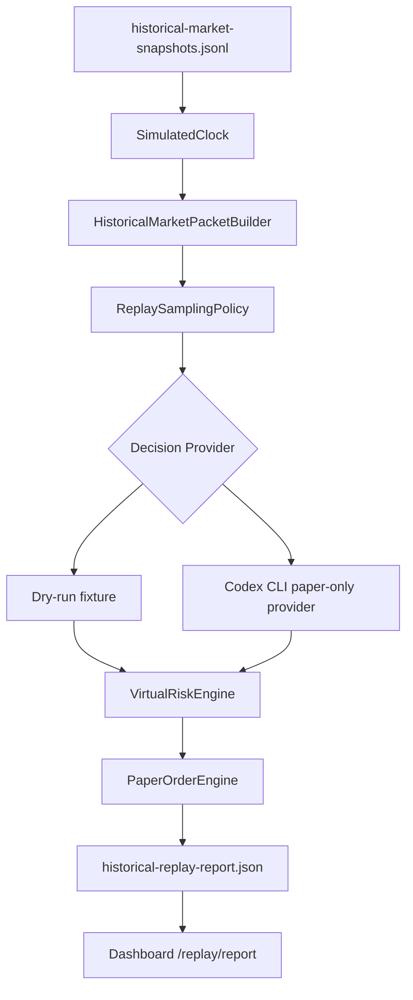

# Historical Replay

이 문서는 과거 시장 데이터를 simulated time으로 빠르게 흘려보내고, paper-only 가상 투자 판단과 결과를 확인하는 흐름을 설명합니다.

## 목적

Historical replay는 실제 시간을 기다리지 않고 저장된 과거 snapshot을 순서대로 `market_packet`으로 변환합니다. 이 packet은 dry-run fixture provider 또는 Codex CLI paper-only provider에 전달할 수 있습니다.

이 기능은 실거래 백테스트 엔진이 아닙니다. 결과는 가상 포트폴리오 시뮬레이션이며 투자 조언, 수익률 보장, 실계좌 성과가 아닙니다.

## 입력과 출력

입력:

- `historical-market-snapshots.jsonl`
- 선택적 `virtual-portfolio.json`
- replay window: `startAt`, `endAt`, `stepSeconds`
- sampling policy: `everyNSteps`, `candidateChangedOnly`, `decisionFrequency`, `maxDecisionCalls`
- decision provider: dry-run fixture 또는 Codex CLI paper-only provider

출력:

- `historical-replay-report.json`
- `historical-replay-progress.json`
- `historical-replay-run-metadata.json`
- `historical-replay-packets.jsonl`
- `historical-replay-decisions.jsonl`
- `historical-replay-risk-decisions.jsonl`
- `historical-replay-trades.jsonl`
- `historical-replay-portfolio-timeline.jsonl`
- dashboard `/replay/report` read-only 조회
- CLI stdout markdown report

`historical-replay-progress.json`은 dashboard 표시용 snapshot입니다. 전체 분석과 재현에는 append-only JSONL 로그를 사용합니다.

`historical-replay-run-metadata.json`은 replay 실행 단위의 재현성 근거를 저장합니다.

포함되는 metadata:

- `identity`: `runId`, optional `batchId`, optional `runIndex`
- `window`: explicit/random window source, start/end, selected month, seed, timezone offset
- `configuration`: clock, sampling policy, initial cash, packet/risk constraint 요약
- `logPaths`: packet, decision, risk decision, trade, portfolio timeline log path
- `status`: `running`, `completed`, `failed`

Batch replay runner는 후속 단계에서 이 metadata를 각 실행 결과의 기본 manifest로 사용합니다.

## Portfolio Valuation

Historical replay는 각 simulated tick에서 보유 포지션을 해당 tick까지 관측 가능한 최신 historical snapshot 가격으로 재평가합니다.

저장되는 position valuation 필드:

- `marketPriceKrw`
- `marketValueKrw`
- `unrealizedPnlKrw`
- `priceUpdatedAt`
- `priceStaleAfter`
- `priceSourceRefs`
- `isPriceStale`

가격이 없는 포지션은 기존 `marketValueKrw`를 유지하고, 값이 없으면 `quantity * averagePriceKrw`를 fallback으로 사용합니다. 이 fallback은 성과 검증용 현재가가 아니라 데이터 결손 상태로 해석해야 합니다.

## Benchmark Report

`historical-replay-report.json`은 replay 결과와 함께 최소 비교 기준을 생성합니다.

포함되는 benchmark:

- `strategy`: 실제 paper replay portfolio timeline 기준
- `cashOnly`: 초기 순자산을 현금으로 보유한 기준
- `equalWeightBuyAndHold`: 첫 priced replay packet의 후보를 동일가중으로 매수 후 보유한 기준
- `initialPortfolioBuyAndHold`: 초기 포트폴리오를 거래 없이 보유한 기준

포함되는 metric:

- `initialNetWorthKrw`
- `finalNetWorthKrw`
- `totalReturnRatio`
- `maxDrawdownRatio`
- `tickVolatilityRatio`
- `turnoverRatio`
- `feeDragKrw`

이 benchmark는 저장된 replay packet과 portfolio timeline만 사용합니다. 외부 지수, 미래 가격, 실계좌 성과와 비교하지 않습니다.

## Flow



## 실행

dry-run은 AI 호출 없이 deterministic fixture decision을 사용합니다.

```powershell
npm run historical:replay:dry -- data/paper 2025-01-02T09:00:00+09:00 2025-01-02T15:30:00+09:00 60 5
```

Codex CLI provider를 사용할 때는 `.env`에 로컬 실행 설정을 둡니다.

```text
AI_DECISION_MODE=paper_only
AI_DECISION_ENABLED=true
CODEX_EXEC_PATH=codex
CODEX_EXEC_SANDBOX=read-only
CODEX_EXEC_TIMEOUT_SECONDS=300
```

```powershell
npm run historical:replay -- data/paper 2025-01-02T09:00:00+09:00 2025-01-02T15:30:00+09:00 60 5
```

positional arguments:

```text
dataDir startAt endAt stepSeconds everyNSteps
```

예:

- `dataDir`: `data/paper`
- `startAt`: `2025-01-02T09:00:00+09:00`
- `endAt`: `2025-01-02T15:30:00+09:00`
- `stepSeconds`: `60`
- `everyNSteps`: `5`

### 랜덤 1개월 Window 선택

batch replay의 선행 단계로 seed 기반 랜덤 calendar-month window를 선택할 수 있습니다.

선택만 확인:

```powershell
npm run historical:replay:dry -- -- --random-window --random-window-from 2023-01-01T00:00:00+09:00 --random-window-to 2026-05-31T23:59:59.999+09:00 --random-window-seed batch-seed-001 --window-months 1 --print-window-only
```

선택된 window로 dry-run replay 실행:

```powershell
npm run historical:replay:dry -- -- --data-dir data/paper --random-window --random-window-from 2023-01-01T00:00:00+09:00 --random-window-to 2026-05-31T23:59:59.999+09:00 --random-window-seed batch-seed-001 --window-months 1 --step-seconds 60 --every-n-steps 5
```

특성:

- 같은 `--random-window-seed`와 같은 range는 항상 같은 window를 선택합니다.
- window는 지정 range 안에 완전히 포함되는 calendar-month 단위로만 선택됩니다.
- `--print-window-only`는 replay를 실행하지 않고 선택된 window metadata만 JSON으로 출력합니다.
- 이 선택 metadata는 batch runner와 aggregate report에서 재현성 근거로 사용할 예정입니다.

### Historical Data Availability 확인

선택된 replay window에 실제 historical snapshot이 있는지 사전에 확인할 수 있습니다.

```powershell
npm run historical:availability -- -- --data-dir data/paper --random-window --random-window-from 2023-01-01T00:00:00+09:00 --random-window-to 2026-05-31T23:59:59.999+09:00 --random-window-seed batch-seed-001 --window-months 1 --min-window-snapshots 1
```

특정 symbol coverage도 함께 요구할 수 있습니다.

```powershell
npm run historical:availability -- -- --data-dir data/paper --start-at 2025-02-01T00:00:00+09:00 --end-at 2025-02-28T23:59:59.999+09:00 --required-symbols KR:005930,KR:000660 --min-snapshots-per-symbol 1
```

실제 replay 실행 전에 데이터 부족을 fail-closed로 막으려면 `--require-data-availability`를 사용합니다.

```powershell
npm run historical:replay:dry -- -- --data-dir data/paper --random-window --random-window-from 2023-01-01T00:00:00+09:00 --random-window-to 2026-05-31T23:59:59.999+09:00 --random-window-seed batch-seed-001 --window-months 1 --require-data-availability
```

availability report는 저장된 `historical-market-snapshots.jsonl`만 읽습니다. 외부 데이터 수집, broker API 호출, replay 실행, 주문 생성은 수행하지 않습니다.

### Batch Run Metadata

반복 batch 실행에서 개별 run을 추적하려면 metadata용 식별자를 CLI에 전달할 수 있습니다.

```powershell
npm run historical:replay:dry -- -- --data-dir data/paper --start-at 2025-02-01T00:00:00+09:00 --end-at 2025-02-28T23:59:59.999+09:00 --step-seconds 60 --every-n-steps 5 --batch-id batch-2025-q1-smoke --batch-run-index 0 --run-id batch-2025-q1-smoke-run-000000
```

이 옵션은 `historical-replay-run-metadata.json`에만 저장됩니다. replay sampling, AI decision, risk decision, paper order 처리 정책을 바꾸지 않습니다.

### Batch Replay Runner

여러 random 1개월 window를 반복 실행하고 run별 결과를 JSONL로 남길 수 있습니다.

```powershell
npm run historical:batch:replay:dry -- -- --source-data-dir data/replay-2026-04-12-2026-06-12 --output-dir data/batch-replay --batch-id batch-smoke-001 --seed batch-seed-001 --runs 10 --random-window-from 2023-01-01T00:00:00+09:00 --random-window-to 2026-05-31T23:59:59.999+09:00 --window-months 1 --step-seconds 604800 --max-snapshot-age-seconds 2678400 --min-window-snapshots 1
```

출력 구조:

```text
data/batch-replay/
└── batch-smoke-001/
    ├── batch-replay-manifest.json
    ├── batch-replay-runs.jsonl
    └── runs/
        └── batch-smoke-001_run_000000_202604/
            ├── historical-replay-report.json
            ├── historical-replay-run-metadata.json
            ├── historical-replay-packets.jsonl
            ├── historical-replay-decisions.jsonl
            ├── historical-replay-risk-decisions.jsonl
            ├── historical-replay-trades.jsonl
            └── historical-replay-portfolio-timeline.jsonl
```

- batch runner는 source data directory의 `historical-market-snapshots.jsonl`을 읽고, run별 출력은 batch output directory 아래에 분리해 씁니다.
- 각 run은 `seed:runIndex`를 사용해 deterministic random window를 선택합니다.
- availability check가 `insufficient`이면 해당 run은 `skipped`로 기록되고 replay workflow를 실행하지 않습니다.
- 각 run record는 `marketRegime`을 포함합니다. label은 `bull`, `bear`, `sideways`, `mixed`, `insufficient_data` 중 하나입니다.
- 현재 batch runner는 deterministic paper replay만 실행합니다. Codex CLI AI 호출, 외부 data 수집, broker API 호출, 주문 생성은 수행하지 않습니다.
- `batch-replay-runs.jsonl`은 후속 aggregate report의 입력으로 사용됩니다.

### Market Regime Classification

Market regime은 window 안 snapshot만 사용해 deterministic하게 계산합니다.

- symbol별 window 첫 가격과 마지막 가격의 return ratio를 계산합니다.
- 기본값 기준 최소 2개 snapshot이 있는 symbol만 분류에 사용합니다.
- 평균 return이 `+3%` 이상이고 상승 symbol 비율이 `60%` 이상이면 `bull`입니다.
- 평균 return이 `-3%` 이하이고 하락 symbol 비율이 `60%` 이상이면 `bear`입니다.
- 평균 return의 절대값이 `1%` 이하이면 `sideways`입니다.
- 위 조건이 충돌하거나 방향성과 breadth가 엇갈리면 `mixed`입니다.
- 분류 가능한 symbol이 부족하면 `insufficient_data`입니다.

이 분류는 batch 결과를 나중에 조건별로 나누기 위한 metadata입니다. trading signal, risk approval, order intent로 사용하지 않습니다.

### Batch Aggregate Report

batch replay가 생성한 `batch-replay-runs.jsonl`을 읽어 전체 및 market regime별 결과를 집계할 수 있습니다.

```powershell
npm run historical:batch:report -- -- --runs-path data/batch-replay/batch-smoke-001/batch-replay-runs.jsonl --output-path data/batch-replay/batch-smoke-001/batch-replay-aggregate-report.json
```

집계 report는 다음 정보를 포함합니다.

- 전체 run 수, completed/skipped/failed count
- return sample이 있는 completed run 수
- 전체 및 regime별 평균/중앙값/min/max paper return ratio
- 전체 및 regime별 win rate
- final virtual net worth 평균
- trade/rejected count 요약
- 집계에 포함된 run ID 목록

이 report는 이미 완료된 paper-only batch run record를 읽는 사후 분석 도구입니다. replay 실행, Codex CLI AI 호출, 외부 데이터 수집, broker API 호출, 주문 생성은 수행하지 않습니다.

집계된 수익률은 paper-only 시뮬레이션 결과를 요약한 값입니다. 투자 조언, 수익률 보장, 실계좌 성과, live trading signal로 해석하면 안 됩니다.

## Lookahead Guard

Historical replay는 simulated time 이후 데이터를 현재 packet에 넣지 않습니다.

적용된 guard:

- `FileHistoricalMarketSnapshotStore.readUpTo`는 `asOf` 이후 snapshot을 제외합니다.
- `HistoricalMarketPacketBuilder`는 `snapshot.observedAt > simulatedAt`이면 candidate에서 제외하고 warning을 남깁니다.
- `runHistoricalReplay`와 `runCodexHistoricalReplay`는 `SimulatedClock` tick만 기준으로 packet을 생성합니다.
- Codex historical prompt는 `packet.generatedAt` 이후 데이터 사용, 미래 가격, 미래 뉴스, 미래 체결, 미래 포트폴리오 상태 사용을 금지합니다.
- sampling skip은 portfolio를 변경하지 않습니다.

## Safety Boundary

- 실주문을 만들지 않습니다.
- live `TradingSignal` 또는 live `OrderIntent`를 생성하지 않습니다.
- dashboard는 replay를 실행하지 않고 `/replay/report`를 조회만 합니다.
- raw `codex exec` MCP tool을 노출하지 않습니다.
- raw `tossctl` MCP tool을 노출하지 않습니다.
- `CodexHistoricalReplayDecisionProvider` 결과는 paper-only `VirtualDecision`으로만 처리합니다.
- 모든 가상 주문은 `VirtualRiskEngine`을 통과해야 합니다.
- provider failure, timeout, packet mismatch는 paper order 없이 audit event와 timeline만 남깁니다.

## Dashboard

```powershell
npm run dashboard -- --data-dir data/paper
```

Dashboard는 저장된 `historical-replay-report.json`을 `/replay/report`로 조회합니다. 조회 endpoint는 `GET`/`HEAD`만 허용되며 replay 실행 버튼을 제공하지 않습니다.
