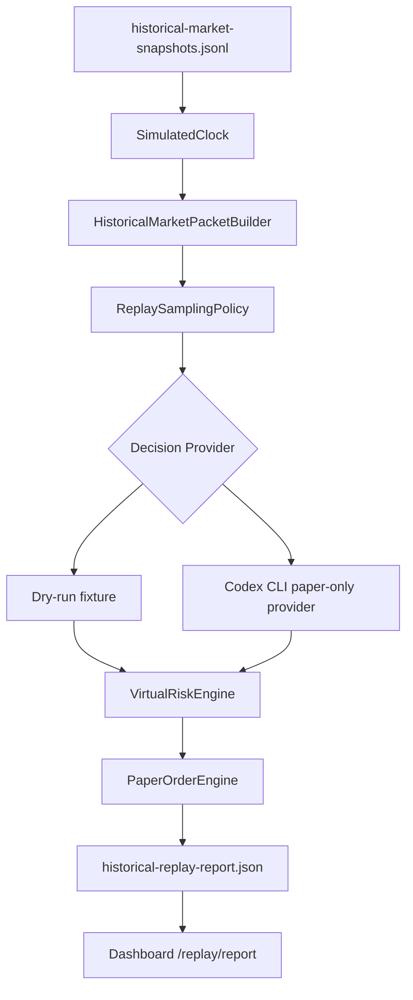

# Historical Replay

이 문서는 과거 시장 데이터를 simulated time으로 빠르게 흘려보내고, paper-only 가상 투자 판단과 결과를 확인하는 흐름을 설명합니다.

## 목적

Historical replay는 실제 시간을 기다리지 않고 저장된 과거 snapshot을 순서대로 `market_packet`으로 변환합니다. 이 packet은 dry-run fixture provider 또는 Codex CLI paper-only provider에 전달할 수 있습니다.

이 기능은 실거래 백테스트 엔진이 아닙니다. 결과는 가상 포트폴리오 시뮬레이션이며 투자 조언, 수익률 보장, 실계좌 성과가 아닙니다.

## 입력과 출력

입력:

- `historical-market-snapshots.jsonl`
- 선택적 `virtual-portfolio.json`
- replay window: `startAt`, `endAt`, `stepSeconds`
- sampling policy: `everyNSteps`, `candidateChangedOnly`, `decisionFrequency`, `maxDecisionCalls`
- decision provider: dry-run fixture 또는 Codex CLI paper-only provider

출력:

- `historical-replay-report.json`
- dashboard `/replay/report` read-only 조회
- CLI stdout markdown report

## Flow



## 실행

dry-run은 AI 호출 없이 deterministic fixture decision을 사용합니다.

```powershell
npm run historical:replay:dry -- data/paper 2025-01-02T09:00:00+09:00 2025-01-02T15:30:00+09:00 60 5
```

Codex CLI provider를 사용할 때는 `.env`에 로컬 실행 설정을 둡니다.

```text
AI_DECISION_MODE=paper_only
AI_DECISION_ENABLED=true
CODEX_EXEC_PATH=codex
CODEX_EXEC_SANDBOX=read-only
CODEX_EXEC_TIMEOUT_SECONDS=300
```

```powershell
npm run historical:replay -- data/paper 2025-01-02T09:00:00+09:00 2025-01-02T15:30:00+09:00 60 5
```

positional arguments:

```text
dataDir startAt endAt stepSeconds everyNSteps
```

예:

- `dataDir`: `data/paper`
- `startAt`: `2025-01-02T09:00:00+09:00`
- `endAt`: `2025-01-02T15:30:00+09:00`
- `stepSeconds`: `60`
- `everyNSteps`: `5`

## Lookahead Guard

Historical replay는 simulated time 이후 데이터를 현재 packet에 넣지 않습니다.

적용된 guard:

- `FileHistoricalMarketSnapshotStore.readUpTo`는 `asOf` 이후 snapshot을 제외합니다.
- `HistoricalMarketPacketBuilder`는 `snapshot.observedAt > simulatedAt`이면 candidate에서 제외하고 warning을 남깁니다.
- `runHistoricalReplay`와 `runCodexHistoricalReplay`는 `SimulatedClock` tick만 기준으로 packet을 생성합니다.
- Codex historical prompt는 `packet.generatedAt` 이후 데이터 사용, 미래 가격, 미래 뉴스, 미래 체결, 미래 포트폴리오 상태 사용을 금지합니다.
- sampling skip은 portfolio를 변경하지 않습니다.

## Safety Boundary

- 실주문을 만들지 않습니다.
- live `TradingSignal` 또는 live `OrderIntent`를 생성하지 않습니다.
- dashboard는 replay를 실행하지 않고 `/replay/report`를 조회만 합니다.
- raw `codex exec` MCP tool을 노출하지 않습니다.
- raw `tossctl` MCP tool을 노출하지 않습니다.
- `CodexHistoricalReplayDecisionProvider` 결과는 paper-only `VirtualDecision`으로만 처리합니다.
- 모든 가상 주문은 `VirtualRiskEngine`을 통과해야 합니다.
- provider failure, timeout, packet mismatch는 paper order 없이 audit event와 timeline만 남깁니다.

## Dashboard

```powershell
npm run dashboard -- --data-dir data/paper
```

Dashboard는 저장된 `historical-replay-report.json`을 `/replay/report`로 조회합니다. 조회 endpoint는 `GET`/`HEAD`만 허용되며 replay 실행 버튼을 제공하지 않습니다.
