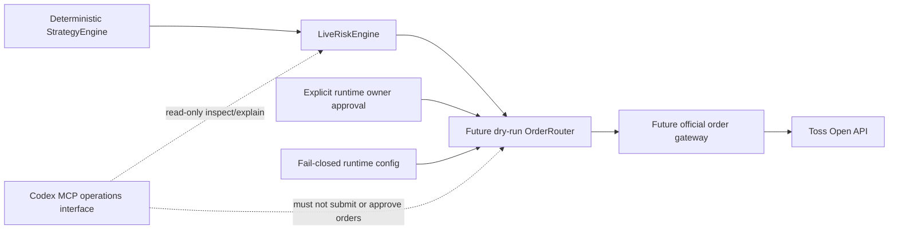

# Live Trading Threat Model

이 문서는 future live order path를 검토하기 전에 지켜야 할 security invariant,
approval, idempotency, audit와 rollback gate를 고정한다. 현재 repository의
`LiveRiskEngine`은 deterministic fail-closed module contract일 뿐 broker gateway,
`OrderRouter`, API/MCP/dashboard mutation surface에 연결되지 않는다.

이 문서는 live trading, broker mutation 또는 `TRADING_ENABLED=true`를 승인하지
않는다. 실제 order mutation 구현과 활성화에는 별도의 명시적인 owner 지시와 각 단계의
review가 필요하다.

## 현재 안전 상태

- `BROKER_PROVIDER=mock`
- `TRADING_ENABLED=false`
- order mutation config/parser 자체가 아직 없으며, future 도입 시
  `TOSS_OPEN_API_ORDER_MUTATIONS_ENABLED=false`와 `TOSS_OPEN_API_DRY_RUN=true`를
  safe default로 요구
- enabled MCP/API/dashboard `place_order` surface 없음
- Codex CLI `virtual_decision`은 paper-only이며 live `TradingSignal` 또는
  `OrderIntent`로 승격되지 않음
- `LiveRiskEngine`은 broker gateway와 연결되지 않음
- official order POST/modify/cancel transport 없음

이 중 하나라도 문서나 runtime에서 다르게 보이면 live readiness가 아니라 safety
breach로 처리한다.

## 보호 대상

| 자산 | 보호 기준 |
| --- | --- |
| Client credential와 access token | source, fixture, log, audit, PR body와 error output에 저장하거나 출력하지 않음 |
| Account identity | runtime secret provider에서만 읽고 외부 output에는 masked reference만 사용 |
| `OrderIntent`와 preview | backend-generated identity/hash, expiry와 exact payload binding 유지 |
| `RiskDecision`과 risk snapshot | current intent, current snapshot, checked rules와 freshness를 재검증 |
| Runtime owner approval | intent/preview/risk identity에 결합하고 만료·1회 사용·취소 가능하게 설계 |
| Idempotency state | send 전 reservation, broker 결과와 reconciliation 상태를 보존 |
| Kill switch와 mutation flags | fail-closed default, 변경 주체/시각/사유 audit 필수 |
| Order/execution audit | tamper-evident ordering과 masked metadata 보존 |

## Trust Boundary



Trust boundary 원칙:

- Strategy output만으로 order를 전송하지 않는다.
- Risk approval만으로 order를 전송하지 않는다.
- Config flag 하나만으로 order를 전송하지 않는다.
- Codex message, PR approval, code review 또는 bot reaction은 runtime order approval이
  아니다.
- Router는 natural language, MCP tool payload 또는 dashboard free-form text를
  `OrderIntent`로 변환하지 않는다.

## 위협과 필수 대응

| ID | 위협 | 실패 영향 | 필수 대응과 검증 증거 |
| --- | --- | --- | --- |
| LT-01 | Natural-language/MCP/dashboard command가 order path로 직접 진입 | Risk/approval 우회 주문 | mutation route/tool 부재 test, typed internal `OrderIntent`만 허용, Codex는 read-only |
| LT-02 | AI paper evidence가 live signal/intent로 승격 | 비결정론적 주문 생성 | paper/live schema 분리, promotion adapter 금지 grep/test, deterministic backend만 intent 생성 |
| LT-03 | 환경 변수 오타, 공백, 대소문자 변형 또는 flag 하나로 enable | 의도하지 않은 live mode | raw exact config validation, safe default, multiple independent gates, invalid value fail-closed |
| LT-04 | Malformed/stale intent, preview, risk snapshot 또는 policy | 잘못된 risk approval | strict normalization, router-owned authoritative clock 기반 freshness/expiry, clock rollback/skew fail-closed, preview-intent hash binding, 모든 rule 재검증 |
| LT-05 | Timeout, retry 또는 concurrent worker로 duplicate send | 중복 주문 | durable idempotency reservation, intent/order hash uniqueness, unknown result reconciliation 전 blind retry 금지 |
| LT-06 | Token, client secret, account/order/execution identity 노출 | 계정 탈취와 개인정보 노출 | secret provider 격리, header/body logging 금지, structured masking test, raw provider error 차단 |
| LT-07 | Account header와 intent owner/context 혼합 | 다른 account에 mutation | account scope를 runtime config와 intent context에 exact bind, raw account input surface 금지 |
| LT-08 | Arbitrary URL/method, redirect, proxy 또는 TLS downgrade | SSRF, credential exfiltration | exact origin/path/method allowlist, redirect 금지, platform trust/hostname 검증, proxy credential 금지 |
| LT-09 | Partial/oversized/encoded response 또는 status confusion | 잘못된 order state 기록 | exact status contract, finite body/deadline, complete framing, content encoding/redirect/range fail-closed |
| LT-10 | Broker `5xx`, disconnect 또는 ambiguous acknowledgement | local/broker state divergence | `unknown_reconciliation` 상태, order history/detail 조회, 자동 재전송 금지 |
| LT-11 | Kill switch 변경과 in-flight send race | stop 이후 신규 주문 | send 직전 atomic gate 재확인, activation 뒤 신규 reservation 차단, in-flight 목록 audit/reconciliation |
| LT-12 | Approval replay, scope 확대 또는 forged actor | 승인되지 않은 주문 | approval identity/hash/expiry/scope/actor binding, one-time consume, owner channel 검증 |
| LT-13 | Audit omission 또는 log tampering | 사고 원인·주문 경로 추적 불가 | append-only event chain, request/intent/risk/approval correlation, mutation 전후 event completeness test |
| LT-14 | Rollback이 in-flight order를 잊거나 자동 cancel을 오작동 | 미확인 position/order mutation | code rollback과 broker reconciliation 분리, unknown state 보존, explicit cancel policy와 owner approval |

## Runtime Approval Contract

Future runtime approval은 typed record로 설계하며 다음 identity에 exact bind해야 한다.

- backend-generated `approvalId`
- `orderIntentId`와 deterministic order hash
- preview identity/hash와 expiry
- current `RiskDecision` identity와 risk snapshot reference
- 허용 operation (`create`, `modify`, `cancel`) 한 종류
- 허용 market/symbol/side/order type/quantity/limit price의 exact projection
- 승인 actor와 검증된 owner channel
- `approvedAt`, `expiresAt`, one-time consumption state
- human-readable reason과 masked audit reference

Expiry 검증 시각은 future `OrderRouter`가 소유한 authoritative clock에서만 얻는다.
Approval payload, API/MCP/CLI input 또는 caller가 주입한 policy 값으로 evaluation time을
선택하지 않는다. 현재 deterministic risk test seam인 `LiveRiskPolicy.now`는 runtime
mutation authorization clock으로 전달하거나 재사용하지 않는다. Clock source를 읽을 수
없거나 마지막 검증 시각보다 뒤로 이동했거나 허용 범위를 넘는 wall-clock/monotonic
clock skew가 감지되면 approval, preview와 risk evidence를 모두 no-send로 처리하고
operator-visible reconciliation/clock-error 상태를 남긴다.

마지막으로 authorization에 사용한 authoritative wall-clock timestamp는 durable
high-water mark로 원자적으로 보존하고 감소시키지 않는다. Process startup/restart에서는
독립적으로 인증된 time source를 다시 검증하고, 새 authoritative time이 허용 skew를
고려한 durable high-water mark보다 과거가 아님을 확인하기 전까지 mutation path를
fail-closed로 유지한다. Durable checkpoint가 없거나 손상됐거나 time source를 인증할 수
없으면 approval을 재사용하지 않고 owner-visible clock-recovery가 끝날 때까지 no-send다.

다음은 유효한 runtime approval이 아니다.

- Codex가 자연어로 생성한 동의
- GitHub PR approval, merge 또는 review bot 결과
- `TRADING_ENABLED=true` 같은 config 값만 존재하는 상태
- Risk Engine의 `approved=true`만 존재하는 상태
- 오래된 preview, intent 또는 risk snapshot에 대한 승인
- symbol/quantity/price/operation 범위를 재사용하거나 확대한 승인
- Approval payload 또는 caller-controlled policy가 evaluation time을 선택하는 승인

Approval verification이 unavailable, malformed, expired, already consumed 또는 current
intent와 불일치하면 no-send로 종료한다.

## Safe-Disabled State Machine

Future `OrderRouter`는 최소 다음 상태를 구분해야 한다.

```text
disabled
  -> dry_run_validated
  -> approval_required
  -> send_reserved

send_reserved
  -> broker_rejected
  -> acknowledgement_unknown
  -> broker_accepted

acknowledgement_unknown
  -> reconciliation_pending

broker_accepted
  -> open

open
  -> partially_filled | filled | canceled | expired

partially_filled
  -> partially_filled | filled | canceled | expired

broker_rejected | filled | canceled | expired
  -> reconciliation_pending

reconciliation_pending
  -> terminal_reconciled
```

- Default는 `disabled`다.
- Row 16 dry-run은 `dry_run_validated` 밖으로 전이하지 않는다.
- `approval_required` 이후 payload가 바뀌면 새 preview, risk decision과 approval이
  필요하다.
- `send_reserved` 뒤 timeout/disconnect는 `acknowledgement_unknown`을 거쳐
  `reconciliation_pending`으로 이동하며
  `send_reserved`로 되돌려 재전송하지 않는다.
- `broker_accepted`는 terminal 상태가 아니다. Accepted/open order와 partial fill은
  in-flight set에서 제거하지 않고 이후 fill, cancel 또는 expiry를 계속 추적한다.
- `terminal_reconciled`는 broker order가 `broker_rejected`, `filled`, `canceled` 또는
  `expired`로 terminal이고, 체결로 생긴 position/cash state까지 read-only broker
  evidence와 local ledger가 일치할 때만 허용한다.
- Partial fill 뒤 cancel/expiry가 발생해도 이미 체결된 수량의 position/cash
  reconciliation이 끝나기 전에는 terminal로 전이하지 않는다.
- Kill switch가 active이면 `send_reserved` 신규 진입을 차단한다.
- Process restart는 durable reservation/reconciliation state와 authoritative-clock
  high-water mark를 모두 검증하기 전에는 send를 재개하지 않는다.

## Idempotency와 Retry

- `orderIntentId`와 deterministic order hash는 backend가 생성한다.
- Send 전에 idempotency reservation을 원자적으로 확보한다.
- 같은 intent/hash의 open, acknowledged 또는 unknown record가 있으면 duplicate send를
  거부한다.
- Broker idempotency contract는 구현 시점의 official OpenAPI document로 다시
  확인한다. 지원 여부를 추측하지 않는다.
- Network timeout, connection reset, `5xx` 또는 malformed response에서 mutation을
  blind retry하지 않는다.
- Retry 전 read-only order history/detail reconciliation으로 broker state를 확인한다.
- Reconciliation identity가 충분하지 않으면 자동 복구하지 않고 owner-visible blocked
  state로 남긴다.

## Secret와 Network Boundary

- Credential와 account identity는 repository, docs, fixture, PR body에 넣지 않는다.
- Access token은 process memory에서만 사용하고 persistence/log/error에 포함하지 않는다.
- Order transport는 exact official origin과 registered mutation path/method만 사용한다.
- Caller가 URL, method, account header, TLS option, proxy credential 또는 redirect
  policy를 override하지 못하게 한다.
- `Authorization`, account header와 order body를 request log에 기록하지 않는다.
- Provider error는 allowlisted code/status/request correlation metadata로 축약하고 raw
  response를 operator surface에 노출하지 않는다.
- Deadline, payload limit, complete message framing과 exact response status를 모두
  통과하기 전에는 broker acknowledgement로 기록하지 않는다.

## Audit와 Masking

Mutation-capable future flow는 최소 다음 event를 순서대로 기록해야 한다.

1. intent created
2. preview verified
3. risk evaluated
4. owner approval verified
5. idempotency reservation acquired 또는 duplicate rejected
6. kill switch/config gate rechecked
7. dry-run result 또는 broker send attempted
8. broker acknowledgement/rejection/unknown recorded
9. reconciliation completed 또는 blocked

Audit에는 schema version, intent/risk/approval reference, method/path template, masked
request correlation, state transition, timestamp와 reason code를 남긴다. Client secret,
token, raw account id, raw broker order id, raw execution data와 request/response body는
남기지 않는다.

## Incident Stop과 Rollback

의도하지 않은 mutation, identity mismatch, credential exposure 또는 audit gap이 의심되면
다음 순서로 처리한다.

1. Kill switch를 activate하고 mutation enable flag를 false로 되돌린다.
2. 신규 intent reservation과 broker send를 차단한다.
3. In-flight/unknown intent 목록과 마지막 안전 audit checkpoint를 보존한다.
4. Read-only order history/detail과 position reconciliation으로 external state를 확인한다.
5. Secret 노출 가능성이 있으면 token/client credential을 owner가 폐기·회전한다.
6. Unsafe code/config는 revert하되 code rollback을 broker order rollback으로 간주하지
   않는다.
7. Cancel/modify가 필요하면 별도 typed intent, current risk check와 explicit owner
   approval을 거친다. 사고 대응이라는 이유로 raw cancel command를 허용하지 않는다.
8. Root cause, affected intent range, reconciliation result와 재발 방지 test를 기록한다.
9. 재개는 fresh config/risk/approval evidence와 explicit owner decision 뒤에만 허용한다.

## Row 16 Dry-Run 진입 조건

이 문서가 merge돼도 dry-run `OrderRouter` 구현이 자동 승인되는 것은 아니다. 별도 구현
범위가 승인되면 첫 PR은 다음 경계를 모두 만족해야 한다.

- mock broker만 사용하고 official order endpoint network call을 만들지 않음
- `BROKER_PROVIDER=mock`, `TRADING_ENABLED=false`, mutation disabled를 exact 검증
- dry-run result만 반환하고 broker order identity/execution을 생성하지 않음
- `LiveRiskEngine` reject 시 router를 호출하지 않음
- approval contract는 synthetic owner approval fixture로만 검증
- idempotency reservation, duplicate/timeout/unknown state를 deterministic test로 검증
- MCP/API/dashboard mutation route/tool을 추가하지 않음
- natural-language order와 Codex paper evidence promotion을 compile/runtime boundary로 차단
- audit output에 secret/account/order/execution raw identity가 없음을 검증
- `git diff --check`, `npm run check`, focused risk/router/security test와 current-head
  review를 통과

## 실제 Gateway 전 Owner Gate

다음은 자동 승인 범위가 아니며 owner action이 필요하다.

- live order 또는 broker mutation 구현·활성화
- `TRADING_ENABLED=true` 또는 mutation enablement
- real client credential/account identity 입력
- outbound IP/OAuth application/external account 설정
- 실제 주문 endpoint 호출 또는 sandbox 부재 상태의 외부 mutation test
- 법적·약관·비용 책임 선택
- runtime approval channel과 emergency operational authority 결정

이 단계 전까지 repository는 paper-only와 read-only 경계를 유지한다.

## 검증 체크리스트

- [ ] Live order entrypoint가 internal typed contract로만 제한됨
- [ ] Natural-language/MCP/dashboard direct order surface가 없음
- [ ] Safe defaults와 invalid config가 fail-closed로 검증됨
- [ ] Risk, preview, approval, idempotency와 kill-switch gate가 send 직전에 재검증됨
- [ ] Timeout/unknown result의 blind retry가 없음
- [ ] Secret/account/order/execution raw identity가 output에 없음
- [ ] Exact host/path/method/TLS/deadline/body/status boundary가 검증됨
- [ ] Audit event chain과 masking이 test됨
- [ ] Incident stop, reconciliation과 rollback runbook이 testable함
- [ ] 실제 mutation 전 owner action과 명시적 승인 기록이 있음
