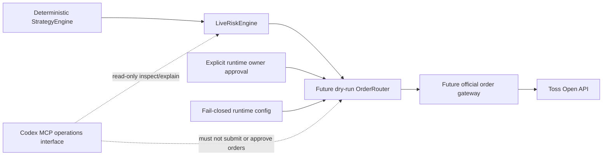

# Live Trading Threat Model

이 문서는 future live order path를 검토하기 전에 지켜야 할 security invariant,
approval, idempotency, audit와 rollback gate를 고정한다. 현재 repository의
`LiveRiskEngine`은 deterministic fail-closed module contract일 뿐 broker gateway,
`OrderRouter`, API/MCP/dashboard mutation surface에 연결되지 않는다.

이 문서는 live trading, broker mutation 또는 `TRADING_ENABLED=true`를 승인하지
않는다. 실제 order mutation 구현과 활성화에는 별도의 명시적인 owner 지시와 각 단계의
review가 필요하다.

## 현재 안전 상태

- `BROKER_PROVIDER=mock`
- `TRADING_ENABLED=false`
- order mutation config/parser 자체가 아직 없으며, future 도입 시
  `TOSS_OPEN_API_ORDER_MUTATIONS_ENABLED=false`와 `TOSS_OPEN_API_DRY_RUN=true`를
  safe default로 요구
- enabled MCP/API/dashboard `place_order` surface 없음
- Codex CLI `virtual_decision`은 paper-only이며 live `TradingSignal` 또는
  `OrderIntent`로 승격되지 않음
- `LiveRiskEngine`은 broker gateway와 연결되지 않음
- official order POST/modify/cancel transport 없음

이 중 하나라도 문서나 runtime에서 다르게 보이면 live readiness가 아니라 safety
breach로 처리한다.

## 보호 대상

| 자산 | 보호 기준 |
| --- | --- |
| Client credential와 access token | source, fixture, log, audit, PR body와 error output에 저장하거나 출력하지 않음 |
| Account identity | runtime secret provider에서만 읽고 외부 output에는 masked reference만 사용 |
| `OrderIntent`와 preview | backend-generated identity/hash, expiry와 exact payload binding 유지 |
| `RiskDecision`, risk snapshot과 capacity | current intent/snapshot/rules/freshness를 재검증하고 portfolio/account risk-capacity reservation을 보존 |
| Runtime owner approval | intent/preview/risk identity에 결합하고 만료·1회 사용·취소 가능하게 설계 |
| Idempotency state | send 전 reservation, broker 결과, reconciliation 상태와 permanent intent/hash tombstone을 보존 |
| Kill switch와 mutation flags | fail-closed default, exact normalized gate snapshot, dispatch와 공유하는 durable monotonic fencing epoch/lock, 변경 주체/시각/사유 audit 필수 |
| Order/execution audit | tamper-evident ordering과 masked metadata 보존 |

## Trust Boundary



Trust boundary 원칙:

- Strategy output만으로 order를 전송하지 않는다.
- Risk approval만으로 order를 전송하지 않는다.
- Config flag 하나만으로 order를 전송하지 않는다.
- Codex message, PR approval, code review 또는 bot reaction은 runtime order approval이
  아니다.
- Router는 natural language, MCP tool payload 또는 dashboard free-form text를
  `OrderIntent`로 변환하지 않는다.

## 위협과 필수 대응

| ID | 위협 | 실패 영향 | 필수 대응과 검증 증거 |
| --- | --- | --- | --- |
| LT-01 | Natural-language/MCP/dashboard command가 order path로 직접 진입 | Risk/approval 우회 주문 | mutation route/tool 부재 test, typed internal `OrderIntent`만 허용, Codex는 read-only |
| LT-02 | AI paper evidence가 live signal/intent로 승격 | 비결정론적 주문 생성 | paper/live schema 분리, promotion adapter 금지 grep/test, deterministic backend만 intent 생성 |
| LT-03 | 환경 변수 오타, 공백, 대소문자 변형, stale worker 또는 flag 하나로 enable | 의도하지 않은 live mode | raw exact config validation, durable normalized gate-snapshot hash/epoch, safe default, multiple independent gates, invalid/mismatched value fail-closed |
| LT-04 | Malformed/stale intent, preview, risk snapshot 또는 policy | 잘못된 risk approval | strict normalization, router-owned authoritative clock 기반 freshness/expiry, clock rollback/skew fail-closed, preview-intent hash binding, 모든 rule 재검증 |
| LT-05 | Timeout, crash, retry 또는 concurrent worker로 duplicate send | 중복 주문 | write-ahead durable idempotency reservation, recovered `send_reserved` 강제 reconciliation, permanent intent/hash tombstone, unknown result reconciliation 전 blind retry 금지 |
| LT-06 | Token, client secret, account/order/execution identity 노출 | 계정 탈취와 개인정보 노출 | secret provider 격리, header/body logging 금지, structured masking test, raw provider error 차단 |
| LT-07 | Account header와 intent owner/context 혼합 | 다른 account에 mutation | account scope를 runtime config와 intent context에 exact bind, raw account input surface 금지 |
| LT-08 | Arbitrary URL/method, redirect, proxy 또는 TLS downgrade | SSRF, credential exfiltration | exact origin/path/method allowlist, redirect 금지, platform trust/hostname 검증, proxy credential 금지 |
| LT-09 | Partial/oversized/encoded response 또는 status confusion | 잘못된 order state 기록 | exact status contract, finite body/deadline, complete framing, content encoding/redirect/range fail-closed |
| LT-10 | Broker `5xx`, disconnect 또는 ambiguous acknowledgement | local/broker state divergence | `unknown_reconciliation` 상태, order history/detail 조회, 자동 재전송 금지 |
| LT-11 | Kill switch/mutation flag 변경·재시작과 in-flight send race | disable 이후 신규 주문 | dispatch와 모든 gate-disable transition의 shared lock, durable monotonic fencing epoch, disable이 이기면 reserved-unsent 차단, restart 시 arbiter/gateway gate snapshot/epoch 합의, dispatch가 이기면 in-flight audit/reconciliation |
| LT-12 | Approval replay, concurrent consume, scope 확대 또는 forged actor | 승인되지 않거나 중복된 주문 | approval identity/hash/expiry/scope/actor binding, state/permit과 묶인 linearizable one-time consume, gateway permit CAS, owner channel 검증 |
| LT-13 | Audit omission 또는 log tampering | 사고 원인·주문 경로 추적 불가 | append-only event chain, request/intent/risk/approval correlation, mutation 전후 event completeness test |
| LT-14 | Rollback이 in-flight order를 잊거나 자동 cancel을 오작동 | 미확인 position/order mutation | code rollback과 broker reconciliation 분리, unknown state 보존, explicit cancel policy와 owner approval |
| LT-15 | 서로 다른 concurrent intent가 같은 risk snapshot/capacity를 각각 통과하거나 broker-visible order와 reservation을 이중 계산 | open-order, exposure, cash 또는 sellable quantity 한도 오판 | portfolio/account-keyed serializable final risk evaluation/reservation, durable correlation 기반 broker/reservation exactly-once union과 atomic lifecycle handoff |

## Runtime Approval Contract

Future runtime approval은 typed record로 설계하며 다음 identity에 exact bind해야 한다.

- backend-generated `approvalId`
- `orderIntentId`와 deterministic order hash
- preview identity/hash와 expiry
- current `RiskDecision` identity와 risk snapshot reference
- 허용 operation (`create`, `modify`, `cancel`) 한 종류
- 허용 market/symbol/side/order type/quantity/limit price의 exact projection
- 승인 actor와 검증된 owner channel
- `approvedAt`, `expiresAt`, one-time consumption state
- human-readable reason과 masked audit reference

Expiry 검증 시각은 future `OrderRouter`가 소유한 authoritative clock에서만 얻는다.
Approval payload, API/MCP/CLI input 또는 caller가 주입한 policy 값으로 evaluation time을
선택하지 않는다. 현재 deterministic risk test seam인 `LiveRiskPolicy.now`는 runtime
mutation authorization clock으로 전달하거나 재사용하지 않는다. Clock source를 읽을 수
없거나 마지막 검증 시각보다 뒤로 이동했거나 허용 범위를 넘는 wall-clock/monotonic
clock skew가 감지되면 approval, preview와 risk evidence를 모두 no-send로 처리하고
operator-visible reconciliation/clock-error 상태를 남긴다.

마지막으로 authorization에 사용한 authoritative wall-clock timestamp는 durable
high-water mark로 보존하고 감소시키지 않는다. Approval verification과 send 직전 gate는
각각 fresh authoritative time `T`를 읽고 기존 high-water mark와 비교한 뒤, `T`까지의
floor advance를 durable store에 write-ahead로 commit해야 한다. 이 commit의 성공이
확인되기 전에는 approval success, `send_reserved` 생성 또는 broker dispatch를 허용하지
않으며, commit 실패는 no-send다. Authorization 또는 dispatch 뒤에 비동기로 저장하는
방식은 허용하지 않는다.

Process startup/restart에서는 독립적으로 인증된 time source를 다시 검증하고, 새
authoritative time이 허용 skew를 고려한 durable high-water mark보다 과거가 아님을
확인하기 전까지 mutation path를 fail-closed로 유지한다. Durable checkpoint가 없거나
손상됐거나 time source를 인증할 수 없으면 approval을 재사용하지 않고 owner-visible
clock-recovery가 끝날 때까지 no-send다.

다음은 유효한 runtime approval이 아니다.

- Codex가 자연어로 생성한 동의
- GitHub PR approval, merge 또는 review bot 결과
- `TRADING_ENABLED=true` 같은 config 값만 존재하는 상태
- Risk Engine의 `approved=true`만 존재하는 상태
- 오래된 preview, intent 또는 risk snapshot에 대한 승인
- symbol/quantity/price/operation 범위를 재사용하거나 확대한 승인
- Approval payload 또는 caller-controlled policy가 evaluation time을 선택하는 승인

Approval verification이 unavailable, malformed, expired, already consumed 또는 current
intent와 불일치하면 no-send로 종료한다.

Approval consume은 단순 read-then-write가 아니다. Future `OrderRouter`는 한 linearizable
transaction/CAS에서 `approval_required` current state, unconsumed approval, exact
risk/capacity/idempotency reservation, current gate snapshot/epoch를 확인하고 approval을
one-time consumed로 바꾸면서 `send_reserved`로 전이하고 unique `dispatchPermitId`를 정확히
하나 만든다. 두 worker가 경쟁하면 하나만 성공하며 loser는 consumed/state/version mismatch로
no-send다. Consume/state/permit commit의 일부만 성공하는 상태는 허용하지 않는다.

Gateway는 같은 dispatch/gate lock 안에서 permit identity, reservation, epoch/snapshot,
approval expiry와 current authoritative time을 재검증하고, first network byte 전에 permit을
durable CAS로 one-time consume한다. Duplicate/expired/stale permit 또는 CAS 실패는
`stopped_before_dispatch`/blocked reconciliation로 전이하고 network write를 금지한다.
Permit consume 뒤 crash/unknown은 재발급·재사용하지 않고 acknowledgement reconciliation로
보낸다.

## Safe-Disabled State Machine

Future `OrderRouter`는 최소 다음 상태를 구분해야 한다.

```text
disabled
  -> dry_run_validated
  -> final_risk_reserved
  -> approval_required
  -> send_reserved

send_reserved
  -> stopped_before_dispatch
  -> dispatch_permit_acquired

dispatch_permit_acquired
  -> broker_rejected
  -> acknowledgement_unknown
  -> broker_accepted

restart(send_reserved | dispatch_permit_acquired)
  -> acknowledgement_unknown

mutation_gate_disable(send_reserved)
  -> stopped_before_dispatch

acknowledgement_unknown
  -> reconciliation_pending

broker_accepted
  -> open

open
  -> partially_filled | filled | canceled | expired

partially_filled
  -> partially_filled | filled | canceled | expired

stopped_before_dispatch | broker_rejected | filled | canceled | expired
  -> reconciliation_pending

reconciliation_pending
  -> terminal_reconciled
```

- Default는 `disabled`다.
- Row 16 dry-run은 `dry_run_validated` 밖으로 전이하지 않는다.
- `final_risk_reserved`는 portfolio/account capacity, idempotency와 tombstone transaction이
  commit된 상태이며, 이 transaction이 만든 exact risk/reservation identity를 owner에게
  제시한 뒤에만 `approval_required`로 이동한다.
- `approval_required` 이후 payload가 바뀌면 기존 intent를 no-dispatch reconciliation로
  닫고 capacity를 atomic release한 뒤 새 preview, final risk/capacity reservation과
  approval을 만들어야 한다.
- `approval_required`에서 `send_reserved`로의 전이는 approval consume과 unique dispatch
  permit 생성을 한 versioned CAS로 commit한 경우에만 허용한다.
- `send_reserved` 뒤 timeout/disconnect는 `acknowledgement_unknown`을 거쳐
  `reconciliation_pending`으로 이동하며
  `send_reserved`로 되돌려 재전송하지 않는다.
- Process가 `send_reserved`를 복구하면 실제 network dispatch 여부를 알 수 없다고
  가정한다. 해당 record를 자동 resend하지 않고 즉시 `acknowledgement_unknown`과
  `reconciliation_pending`으로 전이해 read-only order history/detail을 조회하며,
  identity가 부족하면 owner-visible blocked state로 남긴다.
- `broker_accepted`는 terminal 상태가 아니다. Accepted/open order와 partial fill은
  in-flight set에서 제거하지 않고 이후 fill, cancel 또는 expiry를 계속 추적한다.
- Broker request가 dispatch된 record의 `terminal_reconciled`는 order가
  `broker_rejected`, `filled`, `canceled` 또는 `expired`로 terminal이고, 체결로 생긴
  position/cash state까지 read-only broker evidence와 local ledger가 일치할 때만
  허용한다.
- `stopped_before_dispatch`는 같은 dispatch/gate-transition lock 안에서 disable이 첫
  network byte보다 먼저 이겼다는 durable fencing record, matching epoch/snapshot,
  no-dispatch state,
  permanent tombstone과 complete audit chain이 모두 commit된 경우에만 no-external-mutation
  evidence로 `terminal_reconciled`를 허용한다. 하나라도 없거나 불일치하면 terminal로
  만들지 않고 owner-visible blocked reconciliation에 남긴다.
- Partial fill 뒤 cancel/expiry가 발생해도 이미 체결된 수량의 position/cash
  reconciliation이 끝나기 전에는 terminal로 전이하지 않는다.
- Dispatch arbiter는 kill-switch activation, `TRADING_ENABLED=false`, mutation flag false와
  그 밖의 모든 gate-disable transition을 broker socket write와 같은 linearizable
  lock/fencing epoch로 직렬화한다. Worker가 runtime 환경 변수를 독립적으로 읽어 gate를
  바꾸지 못하게 하고, reservation/permit은 current epoch와 exact normalized gate-snapshot
  hash를 보존한다. Gateway는 stale/mismatched epoch 또는 snapshot의 permit을 거부한다.
- Gate disable이 dispatch보다 먼저 lock/epoch를 획득하면 기존 reserved-unsent record를
  `stopped_before_dispatch`로 전이하고 permanent tombstone을 남긴 뒤 network write를
  금지한다. Dispatch가 먼저 획득해 첫 network byte write boundary를 넘으면 해당 record를
  in-flight로 audit하고 disable 뒤에도 terminal reconciliation까지 추적한다.
- Kill switch가 active이거나 mutation gate 하나라도 false/invalid/mismatched이면
  `send_reserved` 신규 진입과 새 dispatch permit 발급을 모두 차단한다.
- Exact mutation-gate snapshot과 global fencing epoch의 모든 enable/disable transition은
  완료를 응답하기 전에 write-ahead durable commit한다. Epoch는 감소, reset 또는
  재사용하지 않으며 commit 실패 시 arbiter와 gateway를 모두 fail-closed로 유지한다.
- Process restart는 durable reservation/reconciliation state, authoritative-clock
  high-water mark, exact mutation-gate snapshot과 global fencing epoch를 모두 복구하고
  arbiter와 gateway가 같은 값에 합의하기 전에는 send를 재개하지 않는다. Startup
  default는 kill-active이며 모든 mutation flag는 false다.
- Explicit owner restart decision은 `disabled E`에서 exact enabled snapshot `E+1`로의
  transition과 새 instance generation을 먼저 durable commit해야 한다. 등록된 모든
  mutation-capable arbiter/gateway instance가 committed snapshot, `E+1`과 generation을
  다시 읽어 acknowledgement한 뒤에만 post-restart dispatch permit을 발급한다.
  Commit/acknowledgement 누락, instance set 불명확 또는 snapshot/epoch/generation
  mismatch는 kill-active로 남기며,
  surviving process가 가진 old/uncommitted permit은 gateway에서 영구 거부한다.

## Idempotency와 Retry

- `orderIntentId`와 deterministic order hash는 backend가 생성한다.
- Final risk evaluation은 portfolio/account를 key로 한 serializable transaction에서 current
  broker/local snapshot과 모든 active capacity reservation을 exactly-once union으로 읽는다.
  Open-order slot, buy notional/exposure/cash, pending sell quantity와 적용되는 risk budget을
  차감한 effective snapshot으로 모든 limit을 다시 평가한다.
- Exactly-once union은 internal durable `reservationId`/`orderIntentId`/broker correlation을
  사용한다. 아직 broker-visible하지 않은 logical order는 reservation contribution만,
  acknowledged/open order는 broker open-order contribution만, partial fill은 broker가 확인한
  filled position/cash와 remaining open quantity만 반영한다. Reservation/tombstone record는
  lineage를 위해 남겨도 같은 capacity를 다시 합산하지 않는다.
- Broker snapshot에서 correlation이 missing, duplicate, ambiguous 또는 reservation state와
  불일치하면 보수적으로 이중 계산해 계속 진행하지 않고 snapshot reconciliation을
  owner-visible blocked로 만들며 새로운 final risk approval/send를 금지한다.
- Approved final `RiskDecision`, affected capacity reservation, idempotency reservation과
  intent/hash tombstone을 같은 durable transaction에서 commit한다. 하나라도 충돌하거나
  commit에 실패하면 전부 rollback하고 no-send하며, approval은 이 transaction이 생성한
  exact risk/reservation identity에 bind해야 한다.
- 현재 `LiveRiskEngine`의 caller-provided snapshot은 deterministic module/test contract일
  뿐 shared capacity reservation이 아니다. Future `OrderRouter`는 stale snapshot을 그대로
  재사용하거나 서로 다른 worker에서 독립적으로 reserve하지 않는다.
- 최초 reservation은 `orderIntentId`와 deterministic order hash의 permanent tombstone을
  함께 만들며, rejected, stopped-before-dispatch 또는 `terminal_reconciled` 뒤에도 삭제,
  만료 또는 재사용하지 않는다.
- 같은 intent/hash의 과거 tombstone이 하나라도 있으면 현재 상태와 새 approval 여부에
  관계없이 duplicate send를 거부한다. Recovered reservation은 broker rejection/no-
  dispatch가 신뢰 가능한 read-only evidence로 확인되더라도 기존 intent를 자동
  재전송하지 않고 owner-visible reconciliation 결과로 닫는다.
- 이후 create/modify/cancel operation은 backend가 새 intent identity와 새 deterministic
  hash를 생성해야 하며, 이전 intent의 approval/idempotency record를 승계하지 않는다.
- Approval/permit identity도 intent tombstone에 결합해 영구 보존하며 같은 approval 또는
  permit의 concurrent/sequential replay를 상태와 무관하게 거부한다.
- Capacity reservation record는 process restart와 broker acknowledgement 뒤에도 보존한다.
  Broker acknowledgement/fill이 나타나면 같은 serializable store에서 capacity source를
  reservation에서 correlated broker order/position/cash로 atomic handoff해 계산 공백이나
  이중 계산을 만들지 않는다. Logical capacity는 broker order/position/cash가 terminal
  reconciliation되거나 `stopped_before_dispatch`의 durable no-dispatch evidence가 완성된
  뒤에만 release한다. Approval expiry/취소도 no-dispatch evidence와 tombstone을 보존한
  atomic transition 없이는 capacity를 release하지 않는다.
- Broker idempotency contract는 구현 시점의 official OpenAPI document로 다시
  확인한다. 지원 여부를 추측하지 않는다.
- Network timeout, connection reset, `5xx` 또는 malformed response에서 mutation을
  blind retry하지 않는다.
- Retry 전 read-only order history/detail reconciliation으로 broker state를 확인한다.
- Reconciliation identity가 충분하지 않으면 자동 복구하지 않고 owner-visible blocked
  state로 남긴다.

## Secret와 Network Boundary

- Credential와 account identity는 repository, docs, fixture, PR body에 넣지 않는다.
- Access token은 process memory에서만 사용하고 persistence/log/error에 포함하지 않는다.
- Order transport는 exact official origin과 registered mutation path/method만 사용한다.
- Caller가 URL, method, account header, TLS option, proxy credential 또는 redirect
  policy를 override하지 못하게 한다.
- `Authorization`, account header와 order body를 request log에 기록하지 않는다.
- Provider error는 allowlisted code/status/request correlation metadata로 축약하고 raw
  response를 operator surface에 노출하지 않는다.
- Deadline, payload limit, complete message framing과 exact response status를 모두
  통과하기 전에는 broker acknowledgement로 기록하지 않는다.

## Audit와 Masking

Mutation-capable future flow는 최소 다음 event를 순서대로 기록해야 한다.

1. intent created
2. preview verified
3. risk evaluated
4. portfolio/account risk capacity와 idempotency/tombstone atomically reserved 또는 rejected
5. owner approval consumed, state transitioned and sole dispatch permit created atomically
6. clock, kill switch/config gate와 permit rechecked
7. dispatch permit consumed once 또는 rejected before first byte
8. broker send attempted
9. broker acknowledgement/rejection/unknown recorded
10. reconciliation completed 또는 blocked

Audit에는 schema version, intent/risk/approval/capacity reservation reference,
idempotency tombstone, capacity source/handoff, kill-switch fencing epoch, method/path
template, masked request correlation, state
transition, timestamp와 reason code를 남긴다. Client secret,
token, raw account id, raw broker order id, raw execution data와 request/response body는
남기지 않는다.

## Incident Stop과 Rollback

의도하지 않은 mutation, identity mismatch, credential exposure 또는 audit gap이 의심되면
다음 순서로 처리한다.

1. Kill switch를 activate하고 mutation enable flag를 false로 되돌린다.
2. Shared dispatch lock/fencing epoch를 advance해 신규 reservation/permit을 차단하고,
   activation이 이긴 reserved-unsent request를 `stopped_before_dispatch`로 fence한다.
3. In-flight/unknown intent 목록과 마지막 안전 audit checkpoint를 보존한다.
4. Read-only order history/detail과 position reconciliation으로 external state를 확인한다.
5. Secret 노출 가능성이 있으면 token/client credential을 owner가 폐기·회전한다.
6. Unsafe code/config는 revert하되 code rollback을 broker order rollback으로 간주하지
   않는다.
7. Cancel/modify가 필요하면 별도 typed intent, current risk check와 explicit owner
   approval을 거친다. 사고 대응이라는 이유로 raw cancel command를 허용하지 않는다.
8. Root cause, affected intent range, reconciliation result와 재발 방지 test를 기록한다.
9. 재개는 fresh config/risk/approval evidence와 explicit owner decision 뒤에만 허용한다.

## Row 16 Dry-Run 진입 조건

이 문서가 merge돼도 dry-run `OrderRouter` 구현이 자동 승인되는 것은 아니다. 별도 구현
범위가 승인되면 첫 PR은 다음 경계를 모두 만족해야 한다.

- mock broker만 사용하고 official order endpoint network call을 만들지 않음
- `BROKER_PROVIDER=mock`, `TRADING_ENABLED=false`, mutation disabled를 exact 검증
- dry-run result만 반환하고 broker order identity/execution을 생성하지 않음
- `LiveRiskEngine` reject 시 router를 호출하지 않음
- approval contract는 synthetic owner approval fixture로만 검증
- idempotency reservation, duplicate/timeout/unknown state를 deterministic test로 검증
- MCP/API/dashboard mutation route/tool을 추가하지 않음
- natural-language order와 Codex paper evidence promotion을 compile/runtime boundary로 차단
- audit output에 secret/account/order/execution raw identity가 없음을 검증
- `git diff --check`, `npm run check`, focused risk/router/security test와 current-head
  review를 통과

## 실제 Gateway 전 Owner Gate

다음은 자동 승인 범위가 아니며 owner action이 필요하다.

- live order 또는 broker mutation 구현·활성화
- `TRADING_ENABLED=true` 또는 mutation enablement
- real client credential/account identity 입력
- outbound IP/OAuth application/external account 설정
- 실제 주문 endpoint 호출 또는 sandbox 부재 상태의 외부 mutation test
- 법적·약관·비용 책임 선택
- runtime approval channel과 emergency operational authority 결정

이 단계 전까지 repository는 paper-only와 read-only 경계를 유지한다.

## 검증 체크리스트

- [ ] Live order entrypoint가 internal typed contract로만 제한됨
- [ ] Natural-language/MCP/dashboard direct order surface가 없음
- [ ] Safe defaults와 invalid config가 fail-closed로 검증됨
- [ ] Risk, preview, approval, idempotency와 kill-switch gate가 send 직전에 재검증됨
- [ ] Concurrent worker 중 하나만 approval/state/dispatch permit CAS를 소비할 수 있음
- [ ] Dispatch/kill-switch fencing과 permanent intent/hash tombstone이 검증됨
- [ ] Concurrent intent의 final risk evaluation/capacity reservation이 serializable하고 reconciliation까지 보존됨
- [ ] Broker-visible order/partial fill과 capacity reservation이 correlation 기반 exactly-once handoff됨
- [ ] Timeout/unknown result의 blind retry가 없음
- [ ] Secret/account/order/execution raw identity가 output에 없음
- [ ] Exact host/path/method/TLS/deadline/body/status boundary가 검증됨
- [ ] Audit event chain과 masking이 test됨
- [ ] Incident stop, reconciliation과 rollback runbook이 testable함
- [ ] 실제 mutation 전 owner action과 명시적 승인 기록이 있음
