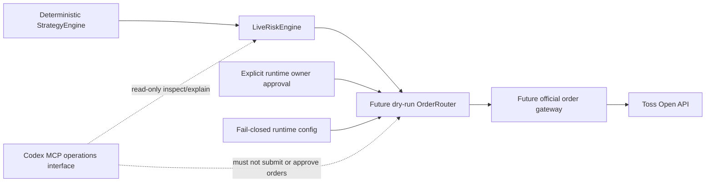

# Live Trading Threat Model

이 문서는 future live order path를 검토하기 전에 지켜야 할 security invariant,
approval, idempotency, audit와 rollback gate를 고정한다. 현재 repository의
`LiveRiskEngine`은 deterministic fail-closed module contract일 뿐 broker gateway,
`OrderRouter`, API/MCP/dashboard mutation surface에 연결되지 않는다.

이 문서는 live trading, broker mutation 또는 `TRADING_ENABLED=true`를 승인하지
않는다. 실제 order mutation 구현과 활성화에는 별도의 명시적인 owner 지시와 각 단계의
review가 필요하다.

## 현재 안전 상태

- `BROKER_PROVIDER=mock`
- `TRADING_ENABLED=false`
- order mutation config/parser 자체가 아직 없으며, future 도입 시
  `TOSS_OPEN_API_ORDER_MUTATIONS_ENABLED=false`와 `TOSS_OPEN_API_DRY_RUN=true`를
  safe default로 요구
- enabled MCP/API/dashboard `place_order` surface 없음
- Codex CLI `virtual_decision`은 paper-only이며 live `TradingSignal` 또는
  `OrderIntent`로 승격되지 않음
- `LiveRiskEngine`은 broker gateway와 연결되지 않음
- official order POST/modify/cancel transport 없음

이 중 하나라도 문서나 runtime에서 다르게 보이면 live readiness가 아니라 safety
breach로 처리한다.

## 보호 대상

| 자산 | 보호 기준 |
| --- | --- |
| Client credential와 access token | source, fixture, log, audit, PR body와 error output에 저장하거나 출력하지 않음 |
| Account identity | runtime secret provider에서만 읽고 intent/approval에는 CSPRNG으로 발급한 opaque stable `accountScopeRef`, 외부 output에는 masked reference만 사용 |
| Mutation intent와 preview | backend-generated identity/hash, `create`/`modify`/`cancel`, target version, expiry와 exact payload/account binding 유지 |
| `RiskDecision`, risk snapshot과 capacity | current intent/snapshot/rules/freshness를 재검증하고 portfolio/account risk-capacity reservation을 보존 |
| Runtime owner approval | intent/preview/risk identity에 결합하고 만료·1회 사용·취소 가능하게 설계 |
| Idempotency state | send 전 reservation, broker 결과, reconciliation 상태와 permanent intent/hash tombstone을 보존 |
| Kill switch와 mutation flags | fail-closed default, exact normalized gate snapshot, dispatch와 공유하는 durable monotonic fencing epoch/lock, 변경 주체/시각/사유 audit 필수 |
| Order/execution audit | tamper-evident ordering과 masked metadata 보존 |

## Trust Boundary



Trust boundary 원칙:

- Strategy output만으로 order를 전송하지 않는다.
- Risk approval만으로 order를 전송하지 않는다.
- Config flag 하나만으로 order를 전송하지 않는다.
- Codex message, PR approval, code review 또는 bot reaction은 runtime order approval이
  아니다.
- Router는 natural language, MCP tool payload 또는 dashboard free-form text를
  `OrderIntent`로 변환하지 않는다.

## 위협과 필수 대응

| ID | 위협 | 실패 영향 | 필수 대응과 검증 증거 |
| --- | --- | --- | --- |
| LT-01 | Natural-language/MCP/dashboard command가 order path로 직접 진입 | Risk/approval 우회 주문 | mutation route/tool 부재 test, typed internal `OrderIntent`만 허용, Codex는 read-only |
| LT-02 | AI paper evidence가 live signal/intent로 승격 | 비결정론적 주문 생성 | paper/live schema 분리, promotion adapter 금지 grep/test, deterministic backend만 intent 생성 |
| LT-03 | 환경 변수 오타, 공백, 대소문자 변형, stale worker 또는 flag 하나로 enable | 의도하지 않은 live mode | raw exact config validation, durable normalized gate-snapshot hash/epoch, safe default, multiple independent gates, invalid/mismatched value fail-closed |
| LT-04 | Malformed/stale intent, preview, risk snapshot, policy 또는 delayed approval | 잘못된 risk approval | strict normalization, router-owned authoritative clock 기반 freshness/expiry, clock rollback/skew fail-closed, dispatch 직전 current exactly-once snapshot으로 모든 rule 재검증, exact risk-binding mismatch 시 fresh approval |
| LT-05 | Timeout, crash, retry 또는 concurrent worker로 duplicate send | 중복 주문 | write-ahead durable idempotency reservation, recovered `send_reserved` 강제 reconciliation, permanent intent/hash tombstone, unknown result reconciliation 전 blind retry 금지 |
| LT-06 | Token, client secret, account/order/execution identity 노출 | 계정 탈취와 개인정보 노출 | secret provider 격리, header/body logging 금지, structured masking test, raw provider error 차단 |
| LT-07 | Account header와 intent/approval/context 혼합 또는 low-entropy account hash 열거 | 다른 account에 mutation 또는 account identity 복구 | CSPRNG opaque `accountScopeRef`와 versioned encrypted mapping을 intent/reservation/risk/approval/permit/gateway에 exact bind, ordinary hash와 raw account input surface 금지 |
| LT-08 | Arbitrary URL/method, redirect, proxy 또는 TLS downgrade | SSRF, credential exfiltration | exact origin/path/method allowlist, redirect 금지, platform trust/hostname 검증, proxy credential 금지 |
| LT-09 | Partial/oversized/encoded response 또는 status confusion | 잘못된 order state 기록 | exact status contract, finite body/deadline, complete framing, content encoding/redirect/range fail-closed |
| LT-10 | Broker `5xx`, disconnect 또는 ambiguous acknowledgement | local/broker state divergence | `unknown_reconciliation` 상태, order history/detail 조회, 자동 재전송 금지 |
| LT-11 | Kill switch/mutation flag 변경·재시작과 final reservation/in-flight send race | disable 이후 capacity/fence/approval request 생성 또는 신규 주문 | final-risk reservation, approval request, dispatch와 모든 gate-disable transition의 shared lock, durable monotonic fencing epoch, disable이 이기면 reservation 전 거부하거나 reserved-unsent atomic no-dispatch closure, restart 시 arbiter/gateway gate snapshot/epoch 합의, dispatch가 이기면 in-flight audit/reconciliation |
| LT-12 | Approval replay, concurrent consume, revocation race, market-order boolean 우회, scope 확대 또는 forged actor | 승인되지 않거나 중복된 주문 | typed staged approval identity/hash/expiry/scope/actor/revocation-version binding, state/permit과 묶인 linearizable one-time consume/revoke, gateway permit CAS, owner channel 검증 |
| LT-13 | Audit omission, crash window 또는 log deletion/rewrite/reordering | 사고 원인·주문 경로 추적 불가와 altered dispatch history 신뢰 | first-byte 전 masked write-ahead dispatch event, canonical hash chain, runtime과 분리된 signed append-only canonical-payload WORM archive, hash-only prefix discard 금지, startup/pre-dispatch fail-closed verification, request/intent/risk/approval correlation, crash/tamper recovery test |
| LT-14 | Rollback이 in-flight order를 잊거나 자동 cancel을 오작동 | 미확인 position/order mutation | code rollback과 broker reconciliation 분리, unknown state 보존, explicit cancel policy와 owner approval |
| LT-15 | Concurrent intent/target mutation이 같은 capacity나 target의 다른 version을 각각 통과하거나 broker/reservation/self를 이중 계산 | open-order, exposure, cash 또는 sellable quantity 한도 오판과 conflicting modify/cancel | portfolio/account-keyed serializable final risk reservation, broker/reservation exactly-once union, conservative modify capacity envelope, version-lineage 전체의 exclusive target mutation fence와 exact scoped replace evaluation |

## Runtime Approval Contract

Future runtime approval은 typed record로 설계하며 다음 identity에 exact bind해야 한다.

- backend-generated `approvalId`
- backend-generated `approvalRequestId`와 monotonic request generation
- `orderIntentId`와 deterministic order hash
- non-reversible stable `accountScopeRef`와 credential/config generation
- preview identity/hash와 expiry
- current `RiskDecision` identity와 risk snapshot reference
- intent, policy revision, exact effective snapshot/capacity-source version, market-session
  evidence, `accountScopeRef`와 gate epoch를 canonicalize한 `riskBindingHash`
- 허용 operation (`create`, `modify`, `cancel`) 한 종류
- `modify`/`cancel`이면 exact `targetOrderRef`, target version/state hash와 remaining quantity
- 허용 market/symbol/side/order type/quantity/limit price의 exact projection
- trusted serializer schema/version과 canonical `transportRequestHash`
- secret provider가 만든 `accountHeaderMac`과 MAC key generation
- `modify`/`cancel`이면 opaque `targetOrderRef`, registered path template과 `targetRouteMac`/key generation
- 승인 actor와 검증된 owner channel
- `approvedAt`, `expiresAt`, one-time consumption state
- human-readable reason과 masked audit reference

Trusted serializer는 approval request를 commit하기 전에 immutable non-secret transport envelope을
한 번 만들고, length-prefixed canonical `(schemaVersion, method, providerOriginId,
registeredPathTemplateId, opaque targetOrderRef, non-sensitive query, contentType, accountScopeRef,
credentialGeneration, exact non-sensitive body bytes)`에 domain-separated SHA-256을 적용해
`transportRequestHash`를 만든다. Gateway는 bound projection을 다시 serialize하거나 변경하지
못한다. Create처럼 raw broker identity가 없는 exact registered path만 non-sensitive envelope에
포함할 수 있다. `modify`/`cancel`의 raw broker order id가 들어간 materialized path/query bytes는
durable envelope, approval, permit, audit에 저장하지 않는다. Encrypted target mapping은 opaque
`targetOrderRef`로 raw order id를 process memory에 resolve하고, secret provider가 dedicated
non-exportable target-route key로 domain/schema/provider/environment, template id, target ref,
credential generation과 exact materialized route bytes를 HMAC-SHA-256한 `targetRouteMac`/key
generation만 bind한다. Gateway는 first-byte lock에서 같은 route buffer를 late-materialize해
MAC을 다시 계산·비교하며 buffer를 교체하지 않는다.

Authorization token과 raw account header는 transport hash에 넣지 않는다. 대신 secret provider는 raw account id를 보관하지 않는 전용 non-exportable
MAC key로 length-prefixed domain/schema/provider/environment/credential generation, exact header
name과 exact header bytes에 HMAC-SHA-256을 적용한 `accountHeaderMac`을 만든다. MAC/key generation은
reservation, approval request/record와 permit에 exact bind하고 raw header는 persist/log/output하지
않는다. MAC key rotation은 새 generation과 fresh approval을 요구하며 old permit을 재사용하지 않는다.

Expiry 검증 시각은 future `OrderRouter`가 소유한 authoritative clock에서만 얻는다.
Approval payload, API/MCP/CLI input 또는 caller가 주입한 policy 값으로 evaluation time을
선택하지 않는다. 현재 deterministic risk test seam인 `LiveRiskPolicy.now`는 runtime
mutation authorization clock으로 전달하거나 재사용하지 않는다. Clock source를 읽을 수
없거나 마지막 검증 시각보다 뒤로 이동했거나 허용 범위를 넘는 wall-clock/monotonic
clock skew가 감지되면 approval, preview와 risk evidence를 모두 no-send로 처리하고
operator-visible reconciliation/clock-error 상태를 남긴다.

마지막으로 authorization에 사용한 authoritative wall-clock timestamp는 durable
high-water mark로 보존하고 감소시키지 않는다. Approval verification과 send 직전 gate는
각각 fresh authoritative time `T`를 읽고 기존 high-water mark와 비교한 뒤, `T`까지의
floor advance를 durable store에 write-ahead로 commit해야 한다. 이 commit의 성공이
확인되기 전에는 approval success, `send_reserved` 생성 또는 broker dispatch를 허용하지
않으며, commit 실패는 no-send다. Authorization 또는 dispatch 뒤에 비동기로 저장하는
방식은 허용하지 않는다.

Process startup/restart에서는 독립적으로 인증된 time source를 다시 검증하고, 새
authoritative time이 허용 skew를 고려한 durable high-water mark보다 과거가 아님을
확인하기 전까지 mutation path를 fail-closed로 유지한다. Durable checkpoint가 없거나
손상됐거나 time source를 인증할 수 없으면 approval을 재사용하지 않고 owner-visible
clock-recovery가 끝날 때까지 no-send다.

다음은 유효한 runtime approval이 아니다.

- Codex가 자연어로 생성한 동의
- GitHub PR approval, merge 또는 review bot 결과
- `TRADING_ENABLED=true` 같은 config 값만 존재하는 상태
- Risk Engine의 `approved=true`만 존재하는 상태
- 오래된 preview, intent 또는 risk snapshot에 대한 승인
- symbol/quantity/price/operation 범위를 재사용하거나 확대한 승인
- Approval payload 또는 caller-controlled policy가 evaluation time을 선택하는 승인

Approval verification이 unavailable, malformed, expired, already consumed 또는 current
intent와 불일치하면 no-send로 종료한다. `approval_required`에서 approval이 만료된 경우에는
authoritative clock evidence와 exact active/unconsumed approval 및 state/version CAS를 같은
transaction에 commit한 `approval_expired` no-dispatch fence가 있어야 reservation/target fence를
release할 수 있다.

Final reservation transaction은 exact intent/reservation/risk/transport binding, request generation,
authoritative `requestedAt`/`requestExpiresAt`과 owner channel을 묶은 durable `approvalRequest`
`pending` 생성 및 `approval_required` 전이를 같은 serializable atomic commit에 포함한다.
Standalone durable reservation state나 request 없는 crash-recovery gap은 허용하지 않는다. Commit 뒤 owner에게
보내는 typed approval payload에는 exact `approvalRequestId`, generation, requested/expires time,
intent/reservation/risk binding, `transportRequestHash`, `targetRouteMac`, `accountHeaderMac`과 각 key generation, preview가 모두 포함돼야 하며, `dispatchApproval`은 이 request
identity/generation/deadline에 exact bind되지 않으면 거부한다. 유효한 approval record가 한 번도 생성되지 않은
요청은 다음 reason만 `approval_not_issued` no-dispatch cause로 닫을 수 있다.

- `owner_declined`: verified owner channel의 typed decline가 exact request id/generation에 bind됨
- `approval_request_expired`: authoritative clock이 request deadline을 넘음
- `approval_channel_unavailable`: allowlisted channel transport가 request/response 실패를 확정함
- `approval_response_malformed`: strict parser가 exact request에 대한 response를 거부함

Closure transaction은 exact `approval_required` state/version과 pending request generation, current
reservation/target fence, valid approval record 부재, permit/`dispatch_attempted` 부재를 한 CAS로
검증하고 request를 permanently `closed`로 바꾸며 request id/generation tombstone과 reason/audit를
commit한다. 이후 delayed approval/decline은 tombstone mismatch로 거부하며 새 시도는 새
intent/reservation/request generation을 요구한다. Approval record 존재 여부나 channel delivery가
불명확하면 `approval_not_issued`를 추정하지 않고 owner-visible blocked reconciliation에 남긴다.

Approval consume은 단순 read-then-write가 아니다. Future `OrderRouter`는 한 linearizable
transaction/CAS에서 `approval_required` current state, unconsumed approval, exact
risk/capacity/idempotency reservation, current gate snapshot/epoch를 확인한다. 먼저 fresh
read-only broker/local evidence와 exact self reservation을 제외한 다른 모든 capacity
source의 exactly-once union으로 risk,
freshness, market hours, sellable quantity, exposure, loss/budget과 open-order rule을 전부 다시
평가한다. Resulting `riskBindingHash`가 owner approval에 bind된 값과 exact match하고 모든
rule, immutable `transportRequestHash`, `targetRouteMac`, `accountHeaderMac`과 각 key generation이 여전히 exact match하는 경우에만 approval을 one-time consumed로 바꾸면서
`send_reserved`로 전이하고 unique `dispatchPermitId`를 정확히 하나 만든다. 두 worker가
경쟁하면 하나만 성공하며 loser는 consumed/state/version mismatch로 no-send다.
Consume/state/permit commit의 일부만 성공하는 상태는 허용하지 않는다.

Owner approval revocation도 단순 flag update가 아니다. Approval record는 durable monotonic
`revocationVersion`과 `active | consumed | revoked` state를 가지며, verified owner의 revoke는
dispatch와 같은 linearizable lock/fencing epoch에서 write-ahead CAS한다. Revocation이 first
network byte보다 먼저 lock을 획득하면 exact approval을 `revoked`로 전이하고 version/epoch를
advance하며, 그 approval에서 파생된 모든 reserved-unsent permit을 영구 fence한다. 해당
intent는 `stopped_before_dispatch`/no-dispatch reconciliation과 tombstone/audit evidence를
남기며 network write를 금지한다. Process restart도 이 revocation version과 fenced permit을
복구하기 전에는 dispatch하지 않는다.

Dispatch가 먼저 lock을 획득해 first network byte boundary를 넘었다면 revoke 응답은
`too_late_for_dispatch`를 명시하고 전송 취소를 주장하지 않는다. Intent는 in-flight/unknown
reconciliation에 남기며, broker-open order 취소가 필요하면 normal approval revocation을
재사용하지 않고 위 typed cancel-only recovery 절차를 거친다.

Snapshot/version/capacity/market-session/policy가 달라졌거나 evidence가 stale/unavailable이면
old approval을 dispatch에 사용하지 않는다. Existing reservation을 durable no-dispatch
reconciliation로 닫되 아래 cause-specific `noDispatchFence`를 같은 transaction에 commit한
뒤에만 capacity를 atomic handoff/release한다. 이후 새 backend-generated intent identity/hash,
final risk/capacity reservation, preview, `riskBindingHash`와 fresh owner approval을 요구한다.
더 보수적인 새 decision이라도 identity가 달라졌다면 old approval을 재사용하지 않는다.
Approval consume 전 revalidation에서 binding이 달라졌다면 exact `approval_required` state/version,
old/current binding mismatch, active/unconsumed approval, permit/`dispatch_attempted` 부재를 한 CAS로
검증한 `pre_permit_binding_invalidated` noDispatchFence로 닫는다.

Gateway는 같은 dispatch/gate lock 안에서 permit identity, reservation, epoch/snapshot,
`accountScopeRef`, approval expiry/state/current `revocationVersion`, `riskBindingHash`,
`transportRequestHash`, `targetRouteMac`, `accountHeaderMac`과 각 key generation, evidence
freshness/market-session validity와 current authoritative time을 재검증한다. Permit은 bounded
immediate-dispatch deadline을 가지며 그 deadline은 approval expiry, evidence/session freshness
deadline과 configured immediate window 중 최솟값이라 approval보다 오래 살아남지 않는다. Queue나
delay 뒤 재사용하지 않는다. First network byte
전에 approval이 revoked됐거나 current binding/version이 달라지거나 deadline이 지났으면 old
intent를 cause-specific `noDispatchFence`로 닫고 새 intent/final reservation/fresh approval을
요구한다. Gateway는 write에 사용할 immutable non-sensitive method/template/query/content-type/body
projection과 current account binding으로 canonical hash를 다시 계산해 permit/approval hash와
constant-time compare한다. Modify/cancel은 exact late-materialized target route buffer의 MAC도
permit과 비교한다. Secret provider가 first byte에 사용할 exact account header buffer로 MAC을 다시
계산해 permit MAC과 constant-time compare하며 header buffer 생성부터 compare/write까지 같은
lock에서 다른 buffer로 교체하지 못하게 한다. Non-sensitive transport, target route 또는
account-header mismatch면 각각 `transport_request_mismatch`, `target_route_mismatch` 또는
`account_header_mismatch` noDispatchFence로 닫는다. 모든 값이 exact
match할 때만 permit을 durable CAS로 one-time consume한다. Permit consume과
masked `dispatch_attempted` audit event는 같은 write-ahead durable commit으로 first network
byte 전에 완료하며, audit commit 실패 시 network write를 금지한다.
Duplicate/expired/stale permit은 arbiter가 그 permit이 unconsumed이고 `dispatch_attempted`가
없음을 같은 lock에서 증명해 cause-specific fence를 commit한 경우에만
`stopped_before_dispatch`로 전이한다. CAS loser는 실패 자체를 no-dispatch 증거로 사용하지
않는다. Winner가 durable no-dispatch state인 것을 exact version으로 읽은 경우에만 그 state를
따르고, winner가 permit을 consume했거나 outcome이 불명확하면 `acknowledgement_unknown`/
blocked reconciliation로 전이한다.
Restart recovery도 먼저 exclusive dispatch/gate recovery lock을 획득하고 fencing epoch를
advance해 stale worker를 차단한다. Recovered durable high-water mark까지 externally checkpointed된
complete audit chain과 exact `send_reserved` state/version에서 sole permit이 unconsumed이고
`dispatch_attempted`가 없음을 함께 증명하면 atomic `restart_unconsumed_permit`
noDispatchFence와 permanent tombstone으로 닫는다. Permit consume/attempt가 존재하거나 audit,
lock ownership 또는 state가 불명확하면 이 cause를 금지하고 unknown reconciliation로 보낸다.
Permit consume 뒤 crash/unknown은 재발급·재사용하지 않고 acknowledgement reconciliation로
보낸다.

## Operation-aware Intent와 Approval 단계

Future mutation path는 현재 create-like `LiveOrderIntent`를 `modify`/`cancel`에 그대로
재사용하지 않는다. Internal typed envelope은 최소 다음을 포함한다.

- `operation`: `create`, `modify`, `cancel` 중 정확히 하나
- backend-generated `orderIntentId`, deterministic hash와 reservation identity
- secret provider가 canonical provider/environment/account identity마다 CSPRNG으로 한 번
  발급한 최소 128-bit opaque stable `accountScopeRef`와 별도 credential/config generation
- create/replace terms: market, symbol, side, order type, quantity, limit price
- `modify`/`cancel`의 exact `targetOrderRef`, target version/state hash, remaining quantity와
  last reconciled snapshot reference

`accountScopeRef`는 account number처럼 열거 가능한 low-entropy identity의 일반 hash나
truncated hash로 만들지 않는다. Secret provider는 CSPRNG opaque ref와 raw identity 사이의
mapping만 authenticated encryption으로 보관한다. Mapping encryption key rotation은 ref를
바꾸지 않는 versioned atomic re-encryption으로 수행하고, 새 ciphertext 검증 전에는 old key를
폐기하지 않는다. Old/new mapping이 누락·충돌하거나 rotation이 불완전하면 mutation을
fail-closed한다. Credential/config rotation은 별도 monotonic generation을 올린다.

Gateway는 `accountScopeRef`를 raw account input으로 받지 않는다. Secret provider의 current
credential/account mapping이 intent, reservation, approval, permit의 stable ref와 exact
match하는지 확인해 account header를 내부에서 조립한다. Configured account나 generation이
바뀌면 binding mismatch로 old intent를 no-dispatch 처리하고 새 intent/approval을 요구한다.

Operation-specific final risk 규칙은 다음과 같다.

- `create`: current candidate를 exactly-once effective snapshot에 한 번 적용한다.
- `modify`: 같은 account/symbol/side의 exact target open-order contribution을 replace-target
  view에서 새 terms로 한 번 평가하되 broker reconciliation 전에는 old remaining capacity를
  해제하지 않는다. Capacity store는 각 risk dimension에서 old contribution과 replacement의
  component-wise maximum을 보존하고, official endpoint가 original/replacement 동시 생존을
  배제한다고 확인할 수 없으면 둘의 conservative union을 reserve한다. Increase/decrease
  전체에 current exposure, cash, sellable quantity, order-count와 market-hours rule을 다시
  적용한다.
- `cancel`: exact open target/version을 확인하고 new exposure/order slot을 추가하지 않는
  cancel-specific policy로 평가한다. Cancel request가 성공하고 target의 remaining quantity와
  position/cash가 reconciled될 때까지 기존 target capacity를 미리 release하지 않는다.
- Target가 fill/partial fill/modify/cancel로 바뀌었거나 version/correlation이 ambiguous하면
  replace/release하지 않고 no-send하며 fresh target snapshot, intent와 approvals를 요구한다.
- Replace-self는 새 operation reservation에만 적용하고 replace-target은 exact target에만
  적용한다. 두 exclusion scope를 하나의 serializable transaction에서 검증하며 caller가
  임의 target/reservation을 제외하지 못한다.
- Final transaction은 stable `(accountScopeRef, targetOrderRef)` key에 exclusive durable
  mutation fence를 원자적으로 claim하고 exact `claimedTargetVersion`, current version/state
  hash와 monotonic fence generation을 record 안에 둔다. Active fence는 target version이 v1에서
  v2로 바뀌어도 같은 target의 모든 version에 대한 다른 `modify`/`cancel`을 operation/actor와
  무관하게 차단한다. Read-only broker reconciliation이 새 version을 확인하면 capacity handoff,
  version lineage와 fence generation을 같은 transaction에서 atomic migrate하되 fence 소유권은
  유지하고 새 version을 다른 mutation에 eligible하게 만들지 않는다. 첫 operation이 resulting
  position/cash를 포함해 terminal reconciliation되거나 durable no-dispatch로 증명되기 전에는
  새 target mutation을 reserve/approve하지 않는다. 유일한 예외는 아래 kill-active
  owner-approved cancel-recovery takeover다.
- Modify acknowledgement/rejection/unknown만으로 old capacity나 target fence를 release하지
  않는다. Read-only broker reconciliation이 exact new target version/remaining terms와
  position/cash를 확인한 transaction에서 capacity source를 old+delta envelope에서 new target로
  atomic handoff한다. Rejected/ambiguous 결과는 old capacity와 fence를 유지한다. Fence가
  종료된 뒤에도 old target-version operation tombstone은 보존해 delayed replay를 차단한다.

현재 `LiveRiskEngine`은 operation/target-order field가 없는 deterministic create-like module
contract다. Future `OrderRouter`/gateway는 operation-aware deterministic risk contract와
concurrency/partial-fill regression test가 별도로 구현되기 전까지 `modify`/`cancel`을 이
engine의 create 평가로 우회하지 않는다.

`marketOrderPolicy=requires_approval`은 두 typed approval 단계를 구분한다.

1. Final risk reservation 전에 `marketOrderAuthorization`을 받는다. 이는 intent/hash,
   `accountScopeRef`, exact market-order projection, preview, policy revision, actor와 expiry에
   bind한다.
2. Final risk transaction은 이 authorization을 linearizable one-time consume하고 trusted
   adapter 내부에서만 `marketOrderApproved=true` evidence로 변환한다. API/MCP/caller가 raw
   boolean을 제공하지 못한다.
3. Final risk/capacity reservation 뒤에는 별도의 `dispatchApproval`을 exact
   risk/reservation/`riskBindingHash`에 bind해 받는다.

Market authorization 또는 final binding이 stale/mismatched이면 둘을 합치거나 재사용하지
않고 새 intent와 필요한 approval 단계부터 다시 시작한다. Limit order는 별도 market-order
authorization 없이 final risk reservation으로 진행하지만 `dispatchApproval`은 동일하게
필요하다.

## Safe-Disabled State Machine

Future `OrderRouter`는 최소 다음 상태를 구분해야 한다.

```text
disabled
  -> dry_run_validated

dry_run_validated
  -> market_order_authorization_required | approval_required(atomic reservation + pending request)

market_order_authorization_required
  -> approval_required(atomic authorization consume + reservation + pending request)

approval_required
  -> send_reserved
  -> stopped_before_dispatch(cause-specific noDispatchFence)

send_reserved
  -> stopped_before_dispatch(cause-specific noDispatchFence)
  -> dispatch_permit_acquired

dispatch_permit_acquired
  -> dispatch_failed_zero_byte
  -> broker_rejected
  -> acknowledgement_unknown
  -> broker_accepted

restart(send_reserved, sole permit unconsumed, no dispatch_attempted)
  -> stopped_before_dispatch(restart_unconsumed_permit noDispatchFence)

restart(send_reserved, consumed | attempted | ambiguous)
  -> acknowledgement_unknown

restart(dispatch_permit_acquired)
  -> acknowledgement_unknown

no_dispatch_fence(approval_required | send_reserved)
  -> stopped_before_dispatch

dispatch_cas_loser(consumed | outcome_unknown)
  -> acknowledgement_unknown

acknowledgement_unknown
  -> reconciliation_pending

broker_accepted
  -> open

open
  -> partially_filled | filled | canceled | expired

partially_filled
  -> partially_filled | filled | canceled | expired

stopped_before_dispatch | dispatch_failed_zero_byte | broker_rejected | filled | canceled | expired
  -> reconciliation_pending

reconciliation_pending
  -> terminal_reconciled
```

- Default는 `disabled`다.
- Row 16 dry-run의 live intent는 `dry_run_validated` 밖으로 전이하지 않는다. Idempotency와
  failure semantics 검증은 live state/reservation store가 아닌 아래 isolated
  `DryRunShadowRecord`에서만 수행한다.

```text
shadow_created
  -> shadow_reserved

shadow_reserved
  -> shadow_completed | shadow_timeout_unknown

shadow_timeout_unknown
  -> shadow_reconciled_no_external_effect

duplicate(shadow_reserved | shadow_timeout_unknown | shadow_completed | shadow_reconciled_no_external_effect)
  -> shadow_duplicate_rejected
```

- Shadow store는 별도 namespace와 synthetic scenario/intent key를 사용하고 live
  idempotency tombstone, portfolio/account capacity, target fence, approval request, permit,
  broker order/execution identity를 생성·조회·변경하지 않는다.
- 최초 `shadow_reserved` commit은 `(scenarioId, syntheticIntentHash)` permanent shadow tombstone을
  같은 transaction에서 만들고 terminal reconciliation 뒤에도 삭제·만료·재사용하지 않는다.
  Tombstone이 있으면 record state와 무관하게 모든 후속 shadow reservation을 duplicate로 거부한다.
- `shadow_timeout_unknown`은 injected deterministic fault에 대한 simulation label일 뿐이며
  network attempt나 broker-side unknown을 주장하지 않는다. Shadow reconciliation은 항상
  `shadow_reconciled_no_external_effect`로 닫히며 live reconciliation queue에 들어가지 않는다.
- Type/runtime boundary는 `DryRunShadowRecord`나 shadow key를 gateway/dispatch permit 입력으로
  변환하지 못하게 한다. Shadow audit는 `simulation_only=true`와 synthetic correlation만
  남기고 raw account/order/execution identity를 받지 않는다.
- 첫 durable post-validation 상태인 `approval_required`는 portfolio/account capacity,
  idempotency/tombstone, target fence, immutable non-sensitive transport envelope/hash,
  `targetRouteMac`/`accountHeaderMac` binding,
  pending `approvalRequest`와 state transition을 한 atomic
  transaction에서 commit한 결과다. Market order이면 exact `marketOrderAuthorization` consume도
  같은 transaction에 포함한다. Request 없는 `final_risk_reserved` 상태는 저장하거나 복구하지
  않으며, commit 뒤에만 request identity, generation, deadline과 preview를 owner에게 제시한다.
- Final risk/capacity/idempotency/target-fence transaction 자체가 dispatch arbiter의 current
  gate lock/epoch 아래 exact enabled snapshot을 검증하고 commit돼야 한다. Kill-active 또는
  false/invalid/mismatched gate에서는 reservation, target fence나 approval request를 새로 만들지
  않는다. Reservation transaction이 먼저 이긴 직후 disable이 경쟁하면 disable transaction이
  해당 exact `approval_required` state, reservation/fence, pending request와 permit/
  `dispatch_attempted` 부재를 atomic CAS해 `gate_disabled` noDispatchFence와 permanent tombstone을
  commit한 뒤 capacity/fence를 release한다.
- `approval_required` 이후 payload가 바뀌면 기존 intent를 no-dispatch reconciliation로
  닫는다. Exact stored intent/order/preview/transport/account binding hash와 normalized new
  payload hash의 mismatch, pending request 또는 active/unconsumed approval의 exact
  id/generation/state, permit/`dispatch_attempted` 부재를 `pre_permit_payload_changed` CAS로
  commit한 뒤에만 capacity를 atomic release하고 새 intent, preview, final risk/capacity
  reservation과 approval request를 만들어야 한다.
- `approval_required`에서 `send_reserved`로의 전이는 approval consume과 unique dispatch
  permit 생성을 current exactly-once snapshot의 same `riskBindingHash` 및 immutable
  `transportRequestHash`, `targetRouteMac`, `accountHeaderMac`과 각 key generation 재검증과 한
  versioned CAS로 commit한 경우에만 허용한다.
- Permit consume 또는 dispatch attempt 뒤 timeout/disconnect는 `acknowledgement_unknown`을 거쳐
  `reconciliation_pending`으로 이동하며
  `send_reserved`로 되돌려 재전송하지 않는다.
- Process가 `send_reserved`를 복구하면 exclusive recovery lock과 새 fencing epoch에서 exact
  state/version, sole permit의 unconsumed 상태, `dispatch_attempted` 부재와 recovered durable
  high-water mark까지 externally checkpointed된 complete audit chain을 한 CAS로 검증한다. 모두
  일치하면 first-byte invariant상
  전송이 불가능했던 `restart_unconsumed_permit` noDispatchFence와 permanent tombstone을 commit한
  뒤 current attempt를 terminal 처리한다. Attempt-local capacity/fence release는 아래 lineage
  규칙을 따라야 하며, `recovery_cancel_takeover`이면 superseded original operation이 아직
  ambiguous한 동안 inherited conservative capacity envelope와 target lineage fence를 유지한다.
  Permit이 consumed이거나
  `dispatch_attempted`가 존재하거나 어느 evidence든 불명확하면 자동 resend하지 않고 즉시
  `acknowledgement_unknown`/`reconciliation_pending`으로 전이해 read-only order history/detail을
  조회하며, identity가 부족하면 owner-visible blocked state로 남긴다.
- `broker_accepted`는 terminal 상태가 아니다. Accepted/open order와 partial fill은
  in-flight set에서 제거하지 않고 이후 fill, cancel 또는 expiry를 계속 추적한다.
- Broker request가 dispatch된 record의 `terminal_reconciled`는 order가
  `broker_rejected`, `filled`, `canceled` 또는 `expired`로 terminal이고, 체결로 생긴
  position/cash state까지 read-only broker evidence와 local ledger가 일치할 때만
  허용한다.
- `stopped_before_dispatch`는 같은 dispatch/gate-transition lock 안에서 first network byte와
  `dispatch_attempted` commit이 모두 없음을 증명하고 cause-specific durable
  `noDispatchFence`를 commit한 경우에만 허용한다. 공통 record에는 exact intent/reservation/
  approval/permit state와 version, current epoch/snapshot, reason code, permanent tombstone과
  externally checkpointed hash chain으로 검증된 complete audit chain이 포함돼야 한다. Cause별
  추가 evidence는 다음과 같다.
  - `gate_disabled`: disable transition이 dispatch보다 먼저 이긴 fencing epoch/snapshot
  - `approval_revoked`: winning revocation CAS와 current `revocationVersion`, 파생 permit fence
  - `binding_invalidated`: exact old/current binding mismatch와 `send_reserved`의 unconsumed old
    permit invalidation CAS
  - `pre_permit_binding_invalidated`: exact old/current binding mismatch, active/unconsumed approval,
    permit/`dispatch_attempted` 부재와 exact `approval_required` state/version CAS
  - `permit_expired_or_stale`: authoritative deadline/freshness evidence와 unconsumed permit CAS.
    Permit deadline이 approval expiry보다 늦을 수 없으므로 post-permit approval expiry도 이 cause로 닫음
  - `restart_unconsumed_permit`: exclusive startup recovery lock과 advanced fencing epoch, exact
    `send_reserved` state/version, sole unconsumed permit, recovered durable high-water mark까지
    externally checkpointed된 complete audit chain의 `dispatch_attempted` 부재를 한 CAS로 commit
  - `transport_request_mismatch`: approved/permit hash, exact recomputed outbound hash,
    `send_reserved` state/version, unconsumed permit과 `dispatch_attempted` 부재 CAS
  - `target_route_mismatch`: opaque target ref/template, permit의 MAC/key generation, exact
    late-materialized target route bytes로 recompute한 MAC mismatch, `send_reserved`, unconsumed
    permit과 `dispatch_attempted` 부재 CAS
  - `account_header_mismatch`: permit의 MAC/key generation, exact outbound header bytes로
    recompute한 MAC mismatch, `send_reserved`, unconsumed permit과 `dispatch_attempted` 부재 CAS
  - `recovery_target_changed`: same `recoveryLineageId`의 exact old/current target version/remaining
    mismatch, old recovery state/version, unconsumed permit과 `dispatch_attempted` 부재 CAS
  - `approval_expired`: authoritative expiry evidence와 아직 permit이 없는 exact
    active/unconsumed approval-required state/version CAS
  - `approval_not_issued`: exact pending approval-request generation, valid approval/permit 부재,
    typed owner decline 또는 authoritative request expiry/channel failure/malformed evidence와
    permanent request tombstone을 한 CAS로 commit
  - `pre_permit_payload_changed`: exact immutable old intent/order/preview/transport/account binding
    hash와 normalized new payload hash mismatch, exact `approval_required` state/version,
    pending request 또는 active/unconsumed approval id/generation/state, permit/`dispatch_attempted`
    부재와 closed request/approval 및 permanent intent tombstone을 한 CAS로 commit
  CAS contention/duplicate observation만으로는 이 record를 만들 수 없다. 다른 worker가
  permit을 consume했거나 first-byte 여부가 불명확하면 `acknowledgement_unknown`/blocked
  reconciliation로 보낸다. Matching cause evidence가 완전한 record만
  no-external-mutation evidence로 `terminal_reconciled`를 허용하며, 하나라도 누락되거나
  불일치하면 terminal 처리하거나 capacity/target fence를 release하지 않는다.
  `recovery_target_changed`는 old recovery attempt만 no-dispatch로 닫고 lineage fence/capacity를
  release하지 않으며, 아래 same-lineage `recovery_rebind_pending_approval`에만 인계할 수 있다.
- `dispatch_failed_zero_byte`는 permit consume과 signed/checkpointed `dispatch_attempted`가 이미
  존재하므로 `stopped_before_dispatch` 또는 `noDispatchFence`로 취급하지 않는다. Gateway transport가
  exact permit/instance generation에서 mutation request write function과 kernel/TLS buffer handoff가
  한 번도 시작되지 않았고 mutation request byte counter가 0임을 같은 dispatch lock에서 증명한
  connect/TLS/pre-write failure만 별도 durable `zeroByteAttemptFence`로 commit할 수 있다. Record는
  consumed permit/state version, signed `dispatch_attempted`, zero-byte transport proof, failure reason,
  permanent tombstone과 externally checkpointed complete audit chain을 포함한다. Target operation은
  read-only broker evidence로 exact target/version/state가 unchanged임도 확인한 뒤 mutation delta
  reservation과 target fence를 atomic release한다. 단, `recovery_cancel_takeover` lineage에서는 이
  proof가 current recovery cancel attempt만 종료하며 superseded original operation의 outcome을
  증명하지 않으므로 inherited conservative capacity envelope와 lineage fence를 release하지 않는다.
  Write function이 호출됐거나 buffer handoff/byte
  count가 불명확하면 이 state를 금지하고 `acknowledgement_unknown`으로 보낸다. Intent/permit은
  zero-byte proof 뒤에도 재사용하지 않는다.
- Partial fill 뒤 cancel/expiry가 발생해도 이미 체결된 수량의 position/cash
  reconciliation이 끝나기 전에는 terminal로 전이하지 않는다.
- Dispatch arbiter는 kill-switch activation, `TRADING_ENABLED=false`, mutation flag false와
  그 밖의 모든 gate-disable transition을 broker socket write와 같은 linearizable
  lock/fencing epoch로 직렬화한다. Worker가 runtime 환경 변수를 독립적으로 읽어 gate를
  바꾸지 못하게 하고, reservation/permit은 current epoch와 exact normalized gate-snapshot
  hash를 보존한다. Gateway는 stale/mismatched epoch 또는 snapshot의 permit을 거부한다.
- Gate disable이 final reservation 또는 dispatch보다 먼저 lock/epoch를 획득하면 새
  reservation/fence/approval request를 거부한다. 이미 reservation이 먼저 commit됐지만 first
  byte 전인 `approval_required`, `send_reserved` record는 disable transaction이
  exact state/version과 no-permit/no-dispatch 또는 unconsumed permit을 확인해
  `stopped_before_dispatch`/`gate_disabled` noDispatchFence로 atomic close하고 permanent tombstone을
  남긴 뒤 network write를 금지한다. Dispatch가 먼저 획득해 첫 network byte write boundary를
  넘으면 해당 record를 in-flight로 audit하고 disable 뒤에도 terminal reconciliation까지 추적한다.
- Kill switch가 active이거나 normal mutation gate 하나라도 false/invalid/mismatched이면
  normal `create`/`modify`/`cancel`의 final risk/capacity reservation, target fence, approval
  request, `send_reserved` 신규 진입과 dispatch permit 발급을 모두 차단한다. 아래 typed
  cancel-only recovery transition만 normal gate를 재활성화하지 않는 별도 예외다.
- Exact mutation-gate snapshot과 global fencing epoch의 모든 enable/disable transition은
  완료를 응답하기 전에 write-ahead durable commit한다. Epoch는 감소, reset 또는
  재사용하지 않으며 commit 실패 시 arbiter와 gateway를 모두 fail-closed로 유지한다.
- Process restart는 durable reservation/reconciliation state, authoritative-clock
  high-water mark, exact mutation-gate snapshot과 global fencing epoch를 모두 복구하고
  arbiter와 gateway가 같은 값에 합의하기 전에는 send를 재개하지 않는다. Startup
  default는 kill-active이며 모든 mutation flag는 false다.
- Explicit owner restart decision은 `disabled E`에서 exact enabled snapshot `E+1`로의
  transition과 새 instance generation을 먼저 durable commit해야 한다. 등록된 모든
  mutation-capable arbiter/gateway instance가 committed snapshot, `E+1`과 generation을
  다시 읽어 acknowledgement한 뒤에만 post-restart dispatch permit을 발급한다.
  Commit/acknowledgement 누락, instance set 불명확 또는 snapshot/epoch/generation
  mismatch는 kill-active로 남기며,
  surviving process가 가진 old/uncommitted permit은 gateway에서 영구 거부한다.

### Cancel-only incident recovery

Kill switch가 active인 동안 normal `create`, `modify`, `cancel`은 계속 차단한다. 이미 broker에
open인 order를 중단하기 위한 future cancel은 별도의 typed cancel-only recovery transition과
gate로만 허용할 수 있다. Normal cancel intent/approval/permit은 recovery permit으로 승격하거나
재사용하지 않는다.

- Recovery gate default는 disabled이며 general `TRADING_ENABLED`/mutation gate를 true로
  바꾸지 않는다.
- Read-only reconciliation으로 확인한 exact `accountScopeRef`, `targetOrderRef`, target
  version/state hash와 remaining quantity 하나만 대상으로 한다.
- Verified owner가 발급한 one-time `cancelRecoveryApproval`을 cancel intent, target,
  reservation, current snapshot, reason, expiry와 recovery fencing epoch에 exact bind한다. Takeover
  transaction은 이 approval을 active/unconsumed 상태로 보존하고 final risk transaction만 consume한다.
- Normal modify/cancel fence가 이미 target을 점유하면 recovery transaction은 kill-active,
  exact current broker-open account/target/version과 unconsumed owner recovery approval을
  확인한 뒤 fence를 `recovery_cancel_takeover` generation으로 atomic CAS한다. Original
  operation은 `superseded_pending_reconciliation`로 남기고 tombstone, permit history,
  unknown/result reconciliation과 capacity envelope를 삭제하거나 terminal 처리하지 않는다.
- Takeover CAS는 recovery epoch를 advance해 original operation의 unconsumed dispatch permit을
  영구 fence하고 `recovery_takeover_pending_final_risk`로 전이할 뿐 dispatch-capable cancel permit을
  만들지 않는다. Original request가 이미 first byte를
  넘었거나 outcome이 ambiguous여도 current read-only broker evidence가 exact open target을
  확인한 경우에만 cancel을 보낼 수 있으며, target state/version을 확인할 수 없으면 raw/blind
  cancel 대신 owner-visible blocked reconciliation로 남긴다.
- Takeover gate snapshot은 `normalCreate=false`, `normalModify=false`, `normalCancel=false`,
  `recoveryCancelDispatch=false`와 no-permit을 write-ahead commit하며 gateway allowlist도 비어 있다.
  Final transaction은 fresh current target/account evidence, cancel-specific risk/freshness와 all-rule
  final Risk Engine approval, recovery gate/epoch, account/transport binding을 재검증하고 exact
  `cancelRecoveryApproval`을 one-time consume하면서 state transition, sole recovery permit 생성과
  그 permit 하나만 허용하는 gateway snapshot/allowlist를 한 linearizable CAS로 commit한다. 이
  transaction 전에는 typed `operation=recovery_cancel`도 dispatch할 수 없다. Normal
  `operation=cancel`, symbol, side, quantity, price 변경이나 새 order 생성은 항상 거부한다.
- Write-ahead audit, timeout unknown reconciliation과 permanent tombstone은 normal flow와 동일하게
  적용한다.
- Takeover fence는 stable `recoveryLineageId`와 account/target lineage를 보존한다. Dispatch 전
  read-only evidence에서 같은 account/target이 여전히 open이지만 partial fill, version/state hash
  또는 remaining quantity가 바뀌면 stale recovery cancel을 보내거나 fence를 release하지 않는다.
  먼저 exact old recovery intent/state/version, unconsumed permit, first-byte/`dispatch_attempted`
  부재와 target mismatch evidence를 `recovery_target_changed` no-dispatch fence로 commit해야 한다.
  Prior permit이 이미 consumed/attempted이면 이 pre-dispatch cause를 사용하지 않고 exact definitive
  broker rejection 또는 `zeroByteAttemptFence`처럼 complete audit chain이 terminal no-effect를
  증명해야 한다. Consumed/attempted outcome이 unknown 또는 ambiguous이면 rebind하지 않고 blocked
  reconciliation에 남긴다.
- Old recovery attempt의 no-dispatch 또는 terminal no-effect가 증명된 경우 같은 recovery lock/epoch에서 fence ownership을
  유지한 채 generation을 증가시키고 old/new target version, old attempt tombstone/history,
  original operation reconciliation과 conservative filled/remaining capacity envelope를 보존하는
  `recovery_rebind_pending_approval` CAS를 수행한다. 이 CAS는 fresh backend-generated recovery
  intent와 pending approval request를 새 generation/current snapshot에 bind한다. Fresh owner
  approval과 cancel-specific risk revalidation 뒤에만 새 sole permit을 만들며 모든 old permit은
  영구 fence한다. Repeated version change도 동일 lineage/generation 규칙을 반복한다.
- Target이 같은 version/state/remaining quantity로 여전히 open이고 prior recovery cancel이 exact
  broker rejection, `zeroByteAttemptFence`, `restart_unconsumed_permit` 또는 다른 cause-specific
  pre-dispatch noDispatchFence로 terminal/proven no-effect인 경우에도 target fence를 release하지 않고
  같은 `recoveryLineageId`에서 `recovery_retry_pending_approval` CAS를 허용한다. Transaction은 prior
  attempt의 terminal/no-effect evidence와 complete audit chain, unchanged current target, exact
  original-operation reconciliation state를 검증하고 fence ownership, inherited conservative
  capacity envelope, original/prior-attempt history를 보존한 채 generation을 증가시킨다. 새
  backend-generated recovery intent와 pending request, fresh owner approval, cancel-specific risk
  revalidation 뒤에만 새 sole permit을 만들며 모든 prior permit은 영구 fence한다. Rejection이
  definitive하지 않거나 prior attempt/outcome/target이 ambiguous하면 retry를 만들지 않는다.
- Target가 이미 terminal이면 새 cancel을 만들지 않고 reconciliation만 진행한다. Account/target
  lineage가 달라졌거나 state가 ambiguous하면 rebind/cancel하지 않고 owner-visible blocked state로
  남긴다. Cancel acknowledgement만으로 capacity를 release하지 않고 target order와 resulting
  position/cash reconciliation까지 추적한다. Takeover가 있으면 original operation과 모든 recovery
  attempt가 terminal 또는 proven no-dispatch이고 external state가 reconciled된 뒤에만 conservative
  old/replacement/current-target capacity envelope와 fence를 release한다.
- Recovery permit consume 자체는 gate-disable transition이 아니다. Arbiter는 permit consume과
  `dispatch_attempted` commit 뒤에도 같은 dispatch/gate lock을 first network byte boundary까지
  유지하며, exact consumed permit 외 다른 request는 허용하지 않는다. First byte를 실제로 넘은
  뒤 `dispatch_won` evidence를 append하고 나서만 recovery gate를 disabled로 durable transition하고
  epoch를 advance한다. Permit consume 전 expiry/staleness는 authoritative clock/freshness evidence,
  exact unconsumed permit/state와 `dispatch_attempted` 부재를 `permit_expired_or_stale`
  noDispatchFence, recovery gate disable과 epoch advance로 한 CAS에 commit한다. 이 pre-attempt cause에
  `zeroByteAttemptFence`를 사용하지 않는다. Permit consume과 signed `dispatch_attempted` 뒤 실제
  connect/TLS/pre-write failure의 zero-byte proof만 `zeroByteAttemptFence`와 gate disable을 같은
  transaction에 commit하고, target unchanged
  reconciliation로 current recovery cancel attempt가 broker에 영향 없었음만 확인한다. Takeover가
  없고 다른 unresolved lineage가 없는 경우에만 attempt-local recovery capacity/fence를 release할 수
  있다. `recovery_cancel_takeover`이면 zero-byte cancel이 superseded original modify/cancel의
  terminal 또는 no-dispatch를 증명하지 않으므로 original outcome과 external state가 reconciled될
  때까지 conservative old/replacement/current-target capacity envelope와 stable lineage fence를
  유지한다. Crash나 socket 결과로 byte boundary가
  불명확하면 gate를 다시 열거나 permit을 재사용하지 않고 startup kill-active 상태의
  `acknowledgement_unknown` reconciliation로 보낸다. 어떤 경우에도 zero-byte post-attempt state를
  pre-attempt `noDispatchFence`나 현재 recovery dispatch보다 먼저 이긴 일반 `gate_disabled` cause로
  재해석하지 않으며 kill switch는 active로 유지한다.

이 recovery contract는 현재 cancel endpoint나 live mutation을 구현·활성화하지 않는다.

## Idempotency와 Retry

- `orderIntentId`와 deterministic order hash는 backend가 생성한다.
- Final risk evaluation은 portfolio/account를 key로 한 serializable transaction에서 current
  broker/local snapshot과 모든 active capacity reservation을 exactly-once union으로 읽는다.
  Open-order slot, buy notional/exposure/cash, pending sell quantity와 적용되는 risk budget을
  차감한 effective snapshot으로 모든 limit을 다시 평가한다.
- Exactly-once union은 internal durable `reservationId`/`orderIntentId`/broker correlation을
  사용한다. 아직 broker-visible하지 않은 logical order는 reservation contribution만,
  acknowledged/open order는 broker open-order contribution만, partial fill은 broker가 확인한
  filled position/cash와 remaining open quantity만 반영한다. Reservation/tombstone record는
  lineage를 위해 남겨도 같은 capacity를 다시 합산하지 않는다.
- Initial final evaluation은 candidate intent를 snapshot에 한 번 적용한 뒤 exact capacity를
  reserve한다. 이후 같은 intent의 pre-dispatch revalidation은 caller input이 아닌 durable
  current `reservationId`로 자기 reservation contribution과 duplicate/idempotency marker만
  원자적으로 제외하고 candidate intent를 같은 자리에 한 번 다시 적용하는 replace-self
  view를 사용한다. 모든 다른 reservation/tombstone/broker contribution은 그대로 유지한다.
- Replace-self는 reservation state/version, intent/hash, reserved capacity projection과
  approval binding이 모두 exact match하고 아직 broker-visible correlation이 없는 경우에만
  허용한다. 다른 reservation, terminal tombstone 또는 caller-provided identity를 제외할 수
  없으며, recomputed capacity가 held capacity와 다르거나 self가 이미 broker-visible이면
  no-send reconciliation과 fresh intent/approval을 요구한다.
- Modify reservation은 old broker target contribution을 snapshot에서 즉시 제거하지 않는다.
  Effective capacity는 old contribution과 replacement 증가분을 exactly once 결합한
  conservative max/union envelope를 사용하고, broker-reconciled new target로 atomic handoff될
  때만 obsolete old capacity를 release한다.
- `modify`/`cancel` final transaction은 stable account/target key와 exact claimed version을 가진
  exclusive mutation fence도 idempotency/risk reservation과 함께 commit한다. Active fence는
  target의 모든 version에서 다른 intent를 no-send하며, broker version change는 fence generation/
  lineage와 capacity를 atomic migrate할 뿐 target terminal/no-dispatch reconciliation 전에는
  fence를 release하거나 새 version mutation을 허용하지 않는다.
- Broker snapshot에서 correlation이 missing, duplicate, ambiguous 또는 reservation state와
  불일치하면 보수적으로 이중 계산해 계속 진행하지 않고 snapshot reconciliation을
  owner-visible blocked로 만들며 새로운 final risk approval/send를 금지한다.
- Approved final `RiskDecision`, affected capacity reservation, idempotency reservation과
  intent/hash tombstone을 같은 durable transaction에서 commit한다. 하나라도 충돌하거나
  commit에 실패하면 전부 rollback하고 no-send하며, approval은 이 transaction이 생성한
  exact risk/reservation identity에 bind해야 한다.
- 현재 `LiveRiskEngine`의 caller-provided snapshot은 deterministic module/test contract일
  뿐 shared capacity reservation이 아니다. Future `OrderRouter`는 stale snapshot을 그대로
  재사용하거나 서로 다른 worker에서 독립적으로 reserve하지 않는다.
- 최초 reservation은 `orderIntentId`와 deterministic order hash의 permanent tombstone을
  함께 만들며, rejected, stopped-before-dispatch 또는 `terminal_reconciled` 뒤에도 삭제,
  만료 또는 재사용하지 않는다.
- 같은 intent/hash의 과거 tombstone이 하나라도 있으면 현재 상태와 새 approval 여부에
  관계없이 duplicate send를 거부한다. Recovered reservation은 broker rejection/no-
  dispatch가 신뢰 가능한 read-only evidence로 확인되더라도 기존 intent를 자동
  재전송하지 않고 owner-visible reconciliation 결과로 닫는다.
- 이후 create/modify/cancel operation은 backend가 새 intent identity와 새 deterministic
  hash를 생성해야 하며, 이전 intent의 approval/idempotency record를 승계하지 않는다.
- Approval/permit identity도 intent tombstone에 결합해 영구 보존하며 같은 approval 또는
  permit의 concurrent/sequential replay를 상태와 무관하게 거부한다.
- Capacity reservation record는 process restart와 broker acknowledgement 뒤에도 보존한다.
  Broker acknowledgement/fill이 나타나면 같은 serializable store에서 capacity source를
  reservation에서 correlated broker order/position/cash로 atomic handoff해 계산 공백이나
  이중 계산을 만들지 않는다. Logical capacity는 broker order/position/cash가 terminal
  reconciliation되거나 `stopped_before_dispatch`의 durable no-dispatch evidence가 완성된
  뒤에만 release한다. Approval expiry/취소도 no-dispatch evidence와 tombstone을 보존한
  atomic transition 없이는 capacity를 release하지 않는다.
- Broker idempotency contract는 구현 시점의 official OpenAPI document로 다시
  확인한다. 지원 여부를 추측하지 않는다.
- Network timeout, connection reset, `5xx` 또는 malformed response에서 mutation을
  blind retry하지 않는다.
- Retry 전 read-only order history/detail reconciliation으로 broker state를 확인한다.
- Reconciliation identity가 충분하지 않으면 자동 복구하지 않고 owner-visible blocked
  state로 남긴다.

## Secret와 Network Boundary

- Credential와 account identity는 repository, docs, fixture, PR body에 넣지 않는다.
- Access token은 process memory에서만 사용하고 persistence/log/error에 포함하지 않는다.
- Order transport는 exact official origin과 registered mutation path/method만 사용한다.
- Caller가 URL, method, account header, TLS option, proxy credential 또는 redirect
  policy를 override하지 못하게 한다.
- `Authorization`, account header와 order body를 request log에 기록하지 않는다.
- Provider error는 allowlisted code/status/request correlation metadata로 축약하고 raw
  response를 operator surface에 노출하지 않는다.
- Deadline, payload limit, complete message framing과 exact response status를 모두
  통과하기 전에는 broker acknowledgement로 기록하지 않는다.

## Audit와 Masking

Mutation-capable future flow는 최소 다음 event를 순서대로 기록해야 한다.

1. intent created
2. preview와 immutable transport projection/hash verified
3. required market-order authorization consumed 또는 not-applicable recorded
4. risk evaluated
5. portfolio/account risk capacity와 idempotency/tombstone atomically reserved 또는 rejected
6. dispatch owner approval received for exact risk/reservation/transport binding
7. current exactly-once snapshot과 모든 risk/freshness rule revalidated
8. owner approval consumed, state transitioned and sole dispatch permit created atomically
9. approval revocation state/version, clock, risk/account/transport binding, kill switch/config gate와 permit rechecked
10. exact outbound transport hash matched, permit consumed and masked `dispatch_attempted` event write-ahead committed 또는 rejected
11. broker network write attempted
12. broker acknowledgement/rejection/unknown appended
13. reconciliation completed 또는 blocked

각 event는 canonical masked serialization을 사용해 immutable `auditStreamId`, monotonic
`sequence`, `previousEventHash`, event type/state version과 payload hash를 domain-separated
SHA-256 `eventHash`로 연결한다. Sequence gap, duplicate, previous-hash mismatch, schema가 허용하지
않은 field 또는 canonicalization mismatch는 chain failure다. Raw secret/account/order/execution
값은 canonical payload나 hash input에 넣지 않는다.

Local mutation runtime과 delete/rewrite 권한을 공유하지 않는 별도 checkpoint boundary가 각
security-critical event의 `(auditStreamId, sequence, exact canonical masked event bytes, eventHash,
checkpoint generation, keyId)`를 append-only/WORM store에 기록하고 independent signing key로
서명한다. Hash/sequence anchor만 저장하지 않으며 archived canonical payload에서 event hash와 전체
prefix chain을 다시 계산할 수 있어야 한다. Runtime은 pinned public
verification key만 가지며 checkpoint 삭제, sequence rewind, 기존 hash 교체 또는 signer key를
수행할 수 없다. `dispatch_attempted`의 signed checkpoint acknowledgement는 first network byte
전에 필요하고, acknowledgement/rejection/unknown 및 terminal reconciliation checkpoint도 해당
state를 authoritative하게 사용하거나 capacity/fence를 release하기 전에 필요하다. Checkpoint가
unavailable하거나 signature/store append가 실패하면 no-send/no-terminal이다.

Local canonical event payload prefix는 signed checkpoint 존재만으로 삭제할 수 없다. Future runtime
default retention은 automatic deletion 없음이다. Prefix discard가 도입되려면 independent boundary가
discard 대상 모든 exact payload bytes를 WORM archive에서 readback해 genesis부터 sequence/hash chain을
재계산하고, archive object identity, covered sequence range, retention deadline과 verification result를
담은 signed retention manifest를 먼저 commit해야 한다. Payload 하나라도 누락되거나 manifest/retention
deadline이 불명확하면 local prefix를 보존한다. Hash tuple/checkpoint만 있는 상태는 discard 권한이나
복구 anchor가 아니다.

Startup과 각 dispatch lock 진입 시 local payload와 WORM archived payload를 합쳐 반드시 genesis부터
head까지 chain을 재계산하고, 외부 checkpoint의 최신 sequence/hash/generation이 local head와 일치하며
regress하지 않았는지 검증한다. Missing/deleted/reordered/rewritten event, invalid signature, unknown
key, archived payload/retention-manifest gap, checkpoint rollback/fork 또는 local/external head mismatch가 하나라도 있으면 kill switch를
active로 유지하고 모든 mutation을 fail-closed로 차단한다. 손상 chain을 truncate, reseed 또는
자동 복구하지 않고 원본 local bytes와 external checkpoint를 보존해 owner-visible integrity
incident로 만든 뒤 read-only broker reconciliation을 수행한다. Verified owner가 원인과 external
state를 확인하고 새 stream generation의 signed genesis를 승인한 경우에만 재개하며 old stream과
canonical payload archive/checkpoint/retention manifest는 immutable evidence로 유지한다. Signing-key rotation도 old key로 서명된 continuity
record와 새 pinned key/generation을 요구한다.

Audit에는 schema version, operation, masked stable `accountScopeRef`, target order/version,
intent/risk/approval/capacity reservation reference,
idempotency tombstone, capacity source/handoff, kill-switch fencing epoch, method/path
template, `transportRequestHash`, target-route/account-header MAC key generation/match status, masked request correlation, state
transition, timestamp와 reason code를 남긴다. Client secret,
token, raw account id, raw broker order id, raw execution data와 request/response body는
남기지 않는다.

`dispatch_attempted` event는 permit consume/state transition과 같은 durable commit에 포함하고
first network byte보다 먼저 완료한다. Commit 실패 시 send하지 않는다. Recovery에서 verified
complete audit chain에 이 event가 있고 broker result event가 없으면 실제 byte 전송 여부를
추측하지 않고 `acknowledgement_unknown`으로 처리해 read-only reconciliation한다. 반대로
exclusive recovery lock에서 exact `send_reserved`와 sole unconsumed permit, 이 event 부재가 모두
증명된 경우에만 위 `restart_unconsumed_permit` noDispatchFence로 닫는다.

## Incident Stop과 Rollback

의도하지 않은 mutation, identity mismatch, credential exposure 또는 audit gap이 의심되면
다음 순서로 처리한다.

1. Kill switch를 activate하고 mutation enable flag를 false로 되돌린다.
2. Shared dispatch lock/fencing epoch를 advance해 신규 reservation/permit을 차단하고,
   activation이 이긴 reserved-unsent request를 `stopped_before_dispatch`로 fence한다.
3. In-flight/unknown intent 목록과 마지막 안전 audit checkpoint를 보존한다.
4. Read-only order history/detail과 position reconciliation으로 external state를 확인한다.
5. Secret 노출 가능성이 있으면 token/client credential을 owner가 폐기·회전한다.
6. Unsafe code/config는 revert하되 code rollback을 broker order rollback으로 간주하지
   않는다.
7. Open target cancel이 필요하면 normal gates를 재활성화하지 않고 위 cancel-only recovery
   gate에서 exact target typed intent, current cancel-specific risk check와 explicit owner
   approval을 거친다. Kill-active incident path에서 `modify`는 허용하지 않으며 raw cancel
   command도 허용하지 않는다.
8. Root cause, affected intent range, reconciliation result와 재발 방지 test를 기록한다.
9. 재개는 fresh config/risk/approval evidence와 explicit owner decision 뒤에만 허용한다.

## Row 16 Dry-Run 진입 조건

이 문서가 merge돼도 dry-run `OrderRouter` 구현이 자동 승인되는 것은 아니다. 별도 구현
범위가 승인되면 첫 PR은 다음 경계를 모두 만족해야 한다.

- mock broker만 사용하고 official order endpoint network call을 만들지 않음
- `BROKER_PROVIDER=mock`, `TRADING_ENABLED=false`, mutation disabled를 exact 검증
- dry-run result만 반환하고 broker order identity/execution을 생성하지 않음
- `LiveRiskEngine` reject 시 router를 호출하지 않음
- approval contract는 synthetic owner approval fixture로만 검증
- isolated shadow idempotency reservation, duplicate reject, simulated timeout/unknown과
  `shadow_reconciled_no_external_effect`를 deterministic test로 검증
- MCP/API/dashboard mutation route/tool을 추가하지 않음
- natural-language order와 Codex paper evidence promotion을 compile/runtime boundary로 차단
- audit output에 secret/account/order/execution raw identity가 없음을 검증
- `git diff --check`, `npm run check`, focused risk/router/security test와 current-head
  review를 통과

## 실제 Gateway 전 Owner Gate

다음은 자동 승인 범위가 아니며 owner action이 필요하다.

- live order 또는 broker mutation 구현·활성화
- `TRADING_ENABLED=true` 또는 mutation enablement
- real client credential/account identity 입력
- outbound IP/OAuth application/external account 설정
- 실제 주문 endpoint 호출 또는 sandbox 부재 상태의 외부 mutation test
- 법적·약관·비용 책임 선택
- runtime approval channel과 emergency operational authority 결정

이 단계 전까지 repository는 paper-only와 read-only 경계를 유지한다.

## 검증 체크리스트

- [ ] Live order entrypoint가 internal typed contract로만 제한됨
- [ ] Natural-language/MCP/dashboard direct order surface가 없음
- [ ] Safe defaults와 invalid config가 fail-closed로 검증됨
- [ ] Risk, preview, approval, idempotency와 kill-switch gate가 send 직전에 재검증됨
- [ ] Concurrent worker 중 하나만 approval/state/dispatch permit CAS를 소비할 수 있음
- [ ] Approval revoke와 dispatch가 직렬화되고 revoke가 이긴 reserved-unsent permit은 영구 fence됨
- [ ] 모든 stopped-before-dispatch cause가 전용 durable no-dispatch evidence로 terminal 처리됨
- [ ] Pre-permit approval expiry가 authoritative clock과 unconsumed approval/state CAS로 종료됨
- [ ] Approval 미발급 요청이 decline/timeout/channel failure별 request-generation tombstone으로 종료됨
- [ ] Dispatch CAS loser가 다른 worker의 send 가능성을 no-dispatch로 오인하지 않음
- [ ] Restart된 send_reserved의 sole permit이 unconsumed이고 dispatch_attempted가 없으면 전용 no-dispatch CAS로 종료됨
- [ ] Recovery gate disable이 dispatch first-byte winner 또는 zeroByteAttemptFence 뒤에만 발생함
- [ ] Signed dispatch-attempt 뒤 confirmed zero-byte failure가 별도 zeroByteAttemptFence로 종료됨
- [ ] Dispatch 직전 current effective snapshot의 riskBindingHash가 달라지면 fresh approval을 요구함
- [ ] Exact outbound non-sensitive projection의 transportRequestHash가 approval/permit과 다르면 first byte 전에 차단됨
- [ ] Modify/cancel raw broker order id는 opaque target ref와 late-materialized route MAC으로만 bind되고 저장되지 않음
- [ ] Exact outbound account header bytes의 keyed MAC이 permit과 다르면 raw identity 저장 없이 first byte 전에 차단됨
- [ ] Pre-permit binding mismatch와 post-permit approval expiry가 각각 exact no-dispatch CAS로 종료됨
- [ ] Pre-permit payload 변경이 exact old/new binding mismatch와 request/approval/no-permit CAS로 종료됨
- [ ] accountScopeRef가 CSPRNG opaque mapping으로 발급되고 key rotation에도 stable하며 intent/reservation/approval/permit/gateway에서 exact match함
- [ ] Market order의 typed pre-risk authorization과 final dispatch approval이 분리됨
- [ ] Modify/cancel이 exact target version 기반 operation-specific replace/release rule을 사용함
- [ ] Modify old capacity가 reconciliation 전 보존되고 conservative max/union으로 reserve됨
- [ ] Stable account/target mutation fence가 version lineage 전체의 concurrent modify/cancel을 terminal까지 차단함
- [ ] Kill-active가 normal create/modify/cancel을 막고 typed cancel-only recovery만 허용함
- [ ] Cancel recovery takeover가 original fence/outcome/capacity를 보존하고 stale permit을 차단함
- [ ] Takeover는 final Risk Engine 재검증/approval consume transaction 전 dispatch permit을 만들지 않음
- [ ] Takeover cancel의 zeroByteAttemptFence가 ambiguous original lineage capacity/fence를 release하지 않음
- [ ] Recovery permit pre-attempt expiry는 zeroByteAttemptFence가 아닌 permit_expired_or_stale CAS로 종료됨
- [ ] Proven no-effect recovery cancel이 unchanged target에서 same-lineage fresh approval retry로만 이어짐
- [ ] Recovery target version/partial fill 변경이 same-lineage fence rebind와 fresh approval로만 이어짐
- [ ] Dispatch/kill-switch fencing과 permanent intent/hash tombstone이 검증됨
- [ ] Disabled gate가 final reservation/fence/approval request를 막고 race loser를 atomic close함
- [ ] Final reservation/pending approval request/approval_required가 한 transaction이며 request 없는 durable gap이 없음
- [ ] Row 16 dry-run shadow가 live reservation/capacity/fence/permit/gateway와 분리되고 simulated unknown을 no-external-effect로 종료함
- [ ] Shadow tombstone이 terminal reconciliation 뒤에도 동일 synthetic intent의 재예약을 영구 차단함
- [ ] Concurrent intent의 final risk evaluation/capacity reservation이 serializable하고 reconciliation까지 보존됨
- [ ] Broker-visible order/partial fill과 capacity reservation이 correlation 기반 exactly-once handoff됨
- [ ] Pre-dispatch revalidation이 exact current reservation만 exclude-self/replace하고 다른 capacity를 유지함
- [ ] Timeout/unknown result의 blind retry가 없음
- [ ] Secret/account/order/execution raw identity가 output에 없음
- [ ] Exact host/path/method/TLS/deadline/body/status boundary가 검증됨
- [ ] Canonical audit hash chain, external signed checkpoint, tamper/fork/rollback fail-closed와 masking이 test됨
- [ ] WORM boundary가 canonical event payload를 보존하고 hash-only checkpoint로 local prefix를 삭제하지 않음
- [ ] Permit consume와 masked dispatch-attempt audit가 first byte 전에 write-ahead commit됨
- [ ] Incident stop, reconciliation과 rollback runbook이 testable함
- [ ] 실제 mutation 전 owner action과 명시적 승인 기록이 있음
