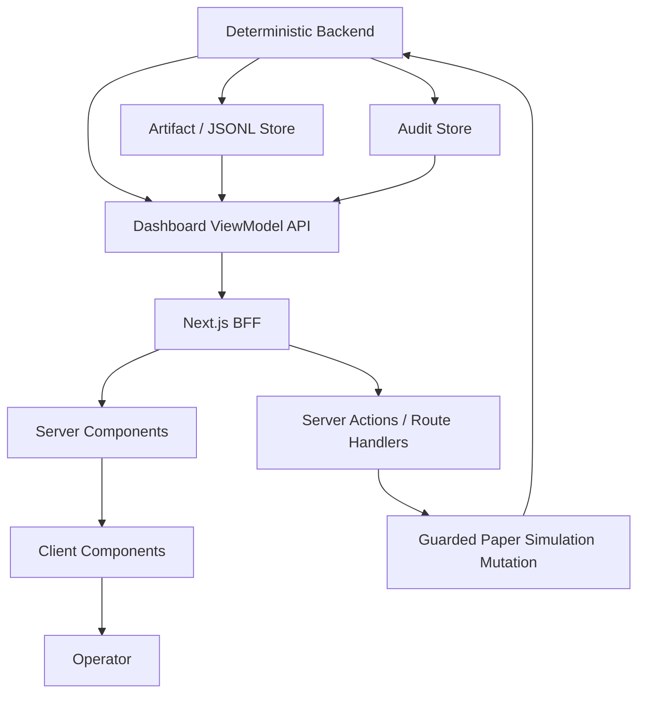
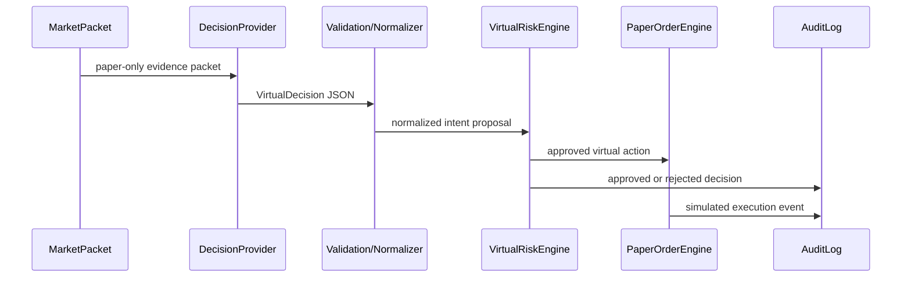

# Next.js Dashboard Architecture Plan

이 문서는 기존 정적 `dashboard/`를 Next.js 기반 운영 UI로 전환하기 위한 아키텍처 계획이다.

핵심 결론은 단순한 UI 프레임워크 교체가 아니다. 현재 대시보드는 historical replay artifact를 읽어 표시하는 viewer에 가깝고, 앞으로 필요한 화면은 `PortfolioPolicy`를 중심으로 전략 버킷, 현금 정책, hedge, risk gate, 검증 결과를 함께 다루는 운영 cockpit이어야 한다.

이 계획은 실거래 주문 구현 계획이 아니다. live order, live `OrderIntent`, broker mutation endpoint, 자연어 주문, `place_order` MCP tool, raw `codex exec`, raw `tossctl` 실행 surface는 범위에 포함하지 않는다.

## 배경

현재 정적 dashboard는 다음 일을 이미 수행한다.

- Local Operations API가 저장된 artifact를 읽는다.
- browser ES module이 여러 endpoint를 병렬 조회한다.
- latest batch run artifact를 현재 실행처럼 보여준다.
- paper simulation 생성은 guarded `POST /paper/simulations`로 제한한다.
- live trading disabled 상태를 별도 route에서 보여준다.

하지만 백엔드의 paper simulation 모델은 그보다 더 넓어졌다.

- `long_term`, `swing`, `short_term`, `intraday`, `hedge` strategy bucket
- portfolio exposure aggregation
- sector, country, currency, asset type, strategy bucket risk gate
- regime-aware dynamic cash reserve
- hedge policy
- liquidity, slippage, cost, partial fill
- validation protocol, embargo, PBO-like diagnostics
- reproducibility hash와 selection trial log

정적 dashboard에 패널을 계속 추가하면 이 모델을 사용자 작업 흐름으로 번역하지 못한다. 따라서 화면 중심을 `SimulationRunConfig`에서 `PortfolioPolicy`로 옮겨야 한다.

## 목표

- `PortfolioPolicy`를 중심으로 paper-only simulation을 설계하고 검증한다.
- 전략 버킷별 target/current/gap을 한 화면에서 본다.
- 장세별 target cash와 현재 cash gap을 명확히 본다.
- hedge가 downside exposure를 줄였는지, 아니면 gross exposure만 늘렸는지 추적한다.
- 장기, 스윙, 단기, 초단기, hedge 전략을 각각 독립 replay/test 단위로 실행하고 비교한다.
- AI 판단, deterministic risk gate, simulated execution, report를 한 trace로 연결한다.
- 여러 run이 아니라 여러 policy 후보를 비교한다.
- 향후 live 관제 화면으로 확장해도 deterministic backend final gate와 audit boundary가 흔들리지 않게 한다.

## 비목표

- Next.js가 trading engine이 되는 것
- Next.js Server Action이 live order를 생성하는 것
- browser client가 portfolio risk, hedge effectiveness, cash reserve compliance를 직접 계산하는 것
- AI confidence를 주문 크기로 직접 연결하는 것
- `VirtualDecision`을 live `TradingSignal`이나 live `OrderIntent`로 승격하는 것
- middleware 또는 proxy만으로 authorization을 끝내는 것
- 수익률 보장, 투자 조언, 특정 종목 추천 문구 추가

## 핵심 원칙

1. Deterministic backend가 domain truth를 계산한다.
2. Next.js는 Ops UI와 BFF 역할만 한다.
3. Client Component는 상호작용과 시각화에만 쓴다.
4. live order mutation은 구현하지 않는다.
5. paper simulation mutation도 backend guard와 audit boundary를 반드시 통과한다.
6. dashboard에 표시되는 숫자는 backend ViewModel에서 내려온 값을 우선한다.
7. future live readiness 화면도 read-only 관제에서 시작한다.

## 대상 구조



역할 분리:

| 계층 | 책임 | 금지 |
| --- | --- | --- |
| Deterministic backend | market data, replay, risk, allocation, hedge, cash reserve, cost, validation, audit 계산 | UI 편의를 위해 risk rule 약화 |
| ViewModel API | dashboard 전용 read model 제공, artifact parsing 은닉 | browser에 raw artifact 조합 책임 전가 |
| Next.js BFF | server-side fetch, session/RBAC, route composition, paper-only action proxy | live order 생성, trading loop 실행 |
| Server Components | fresh dashboard data 렌더링, loading/error boundary | browser-only state 남용 |
| Client Components | form interaction, charts, filters, tables, optimistic UI | domain truth 계산 |

## App 위치

권장 위치:

```text
apps/dashboard/
```

이유:

- 기존 backend package와 Next.js app의 dependency/runtime을 분리한다.
- 기존 `dashboard/` 정적 파일을 migration 기간 동안 유지할 수 있다.
- 나중에 deployment, auth, E2E, Storybook을 독립적으로 관리하기 쉽다.

초기 package 역할:

```text
apps/dashboard/
├── app/
│   ├── dashboard/
│   │   ├── page.tsx
│   │   ├── portfolio/page.tsx
│   │   ├── risk-gate/page.tsx
│   │   ├── validation/page.tsx
│   │   └── lab/
│   │       ├── policies/page.tsx
│   │       ├── strategy-tests/page.tsx
│   │       ├── strategy-tests/buckets/[bucket]/new/page.tsx
│   │       ├── strategy-tests/tests/[testId]/page.tsx
│   │       ├── replays/new/page.tsx
│   │       └── runs/[runId]/page.tsx
│   ├── layout.tsx
│   ├── loading.tsx
│   └── error.tsx
├── src/
│   ├── entities/
│   ├── features/
│   ├── shared/
│   └── widgets/
├── tests/
└── package.json
```

## Route IA

| Route | 목적 | Mutation |
| --- | --- | --- |
| `/dashboard` | live trading disabled/readiness 상태 | 없음 |
| `/dashboard/portfolio` | strategy bucket, cash, hedge compliance | 없음 |
| `/dashboard/risk-gate` | AI decision -> risk gate -> simulated execution trace | 없음 |
| `/dashboard/validation` | policy 후보별 OOS, PBO-like, regime robustness 비교 | 없음 |
| `/dashboard/audit` | audit event, rejected action, failure trace 조회 | 없음 |
| `/dashboard/lab/policies` | paper-only portfolio policy builder | policy draft 저장 후보 |
| `/dashboard/lab/strategy-tests` | 전략 버킷별 test matrix와 결과 비교 | 없음 |
| `/dashboard/lab/strategy-tests/buckets/[bucket]/new` | 특정 strategy bucket 단독 replay/test 생성 | guarded paper-only mutation |
| `/dashboard/lab/strategy-tests/tests/[testId]` | 실행 중인 bucket test progress, event, partial metric 조회 | 없음 |
| `/dashboard/lab/replays/new` | paper simulation 생성 | guarded paper-only mutation |
| `/dashboard/lab/runs/[runId]` | 실행 상세, progress, report | 없음 |

`/dashboard`는 실거래 시작 화면이 아니다. 미래에도 첫 화면은 `TRADING_ENABLED=false`, broker mutation disabled, `OrderRouter` not connected 같은 safety boundary를 명확히 보여줘야 한다.

## 핵심 ViewModel

Next.js는 raw artifact를 조합하지 않고 dashboard ViewModel을 받는다. 아래 contract는 구현 전 설계 기준이다.

### `PortfolioPolicyViewModel`

```ts
type StrategyBucket = "long_term" | "swing" | "short_term" | "intraday" | "hedge";

interface PortfolioPolicyViewModel {
  mode: "paper_only";
  policyId: string;
  version: string;
  name: string;
  strategyBuckets: StrategyBucketPolicyView[];
  cashPolicy: CashReservePolicyView;
  hedgePolicy: HedgePolicyView;
  exposurePolicy: ExposurePolicyView;
  validationStatus: "draft" | "valid" | "invalid";
  warnings: string[];
}

interface StrategyBucketPolicyView {
  bucket: StrategyBucket;
  targetWeightRatio: number;
  minWeightRatio: number;
  maxWeightRatio: number;
  maxTurnoverRatio: number | null;
  maxDrawdownRatio: number | null;
  holdingPeriodHint: "multi_month" | "multi_week" | "multi_day" | "intraday" | "hedge";
  enabledAssetClasses: string[];
}
```

### `PolicyComplianceViewModel`

```ts
interface PolicyComplianceViewModel {
  mode: "paper_only";
  asOf: string;
  portfolioId: string;
  virtualNetWorthKrw: number;
  bucketCompliance: BucketComplianceRow[];
  cashCompliance: CashComplianceView;
  hedgeCompliance: HedgeComplianceView;
  exposureCompliance: ExposureComplianceView;
  riskGateSummary: RiskGateSummaryView;
  complianceAnalytics: ComplianceAnalyticsView;
  status: "ok" | "watch" | "breach" | "missing";
}

interface BucketComplianceRow {
  bucket: StrategyBucket;
  targetWeightRatio: number;
  currentWeightRatio: number;
  gapRatio: number;
  exposureKrw: number;
  turnoverRatio: number | null;
  status: "ok" | "under" | "over" | "missing";
  primaryReason: string | null;
}
```

### `CashComplianceView`

```ts
interface CashComplianceView {
  marketRegime: "bull" | "bear" | "sideways" | "mixed" | "insufficient_data";
  targetCashRatio: number;
  currentCashRatio: number;
  currentCashKrw: number;
  minimumCashReserveKrw: number;
  cashGapKrw: number;
  ruleSource: "static" | "dynamic_regime" | "high_volatility" | "fallback";
  status: "ok" | "under_reserved" | "missing";
  rejectedCount: number;
  rejectCodes: Record<string, number>;
}
```

### `HedgeComplianceView`

```ts
interface HedgeComplianceView {
  hedgeEnabled: boolean;
  hedgeExposureKrw: number;
  hedgeExposureRatio: number;
  grossExposureKrw: number;
  netDownsideExposureKrw: number;
  estimatedDownsideReductionKrw: number | null;
  hedgeCostKrw: number;
  hedgeTradeCount: number;
  rejectedCount: number;
  rejectCodes: Record<string, number>;
  status: "ok" | "ineffective" | "over_hedged" | "missing";
}
```

### `ComplianceAnalyticsView`

```ts
interface ComplianceAnalyticsView {
  strategyBucket: {
    occupiedBucketCount: number;
    missingPolicyTargetCount: number;
    largestBucket: ExposureBucket | null;
    concentrationRatio: number | null;
    status: "ok" | "watch" | "breach" | "missing";
  };
  cashReserve: {
    currentCashKrw: number;
    currentCashRatio: number;
    targetCashRatio: number;
    minimumCashReserveKrw: number;
    cashGapKrw: number;
    reserveStatus: "ok" | "under_reserved" | "missing";
    marketRegime: "bull" | "bear" | "sideways" | "mixed" | "insufficient_data";
    ruleSource: "static" | "dynamic_regime" | "high_volatility" | "fallback";
  };
  hedgeEffectiveness: {
    hedgeCoverageRatio: number | null;
    netDownsideExposureRatio: number | null;
    costDragRatio: number | null;
    status: "ok" | "ineffective" | "over_hedged" | "missing";
  };
  costTurnover: {
    totalTradeAmountKrw: number;
    totalCostKrw: number;
    totalTurnoverRatio: number | null;
    totalCostDragRatio: number | null;
    byStrategyBucket: BucketCostTurnoverRow[];
  };
}

interface BucketCostTurnoverRow {
  bucket: StrategyBucket;
  tradeCount: number;
  grossTradeAmountKrw: number;
  totalCostKrw: number;
  turnoverRatio: number | null;
  costDragRatio: number | null;
}
```

### `StrategyBucketAnalyticsViewModel`

```ts
interface StrategyBucketAnalyticsViewModel {
  mode: "paper_only";
  range: { startAt: string; endAt: string };
  rows: StrategyBucketAnalyticsRow[];
}

interface StrategyBucketAnalyticsRow {
  bucket: StrategyBucket;
  totalReturnRatio: number | null;
  maxDrawdownRatio: number | null;
  turnoverRatio: number | null;
  costDragRatio: number | null;
  decisionCount: number;
  approvedCount: number;
  rejectedCount: number;
  tradeCount: number;
  providerFailureCount: number;
  regimeBreakdown: Record<string, BucketRegimeMetric>;
}
```

### `StrategyBucketTestLabViewModel`

```ts
interface StrategyBucketTestLabViewModel {
  mode: "paper_only";
  policyId: string;
  supportedBuckets: StrategyBucketTestCapability[];
  activeTests: StrategyBucketTestSummary[];
  recentResults: StrategyBucketTestResultSummary[];
  comparison: StrategyBucketComparisonView;
}

interface StrategyBucketTestCapability {
  bucket: StrategyBucket;
  canRunIsolatedReplay: boolean;
  requiredPolicyFields: string[];
  defaultHoldingPeriodHint: "multi_month" | "multi_week" | "multi_day" | "intraday" | "hedge";
  disabledReason: string | null;
}

interface StrategyBucketTestSummary {
  testId: string;
  bucket: StrategyBucket;
  status: "queued" | "running" | "completed" | "failed" | "cancelled";
  startedAt: string | null;
  completedAt: string | null;
  runId: string | null;
  configHash: string;
  progress: StrategyBucketTestProgressView;
  heartbeat: StrategyBucketTestHeartbeatView;
}

interface StrategyBucketTestProgressView {
  phase:
    | "queued"
    | "loading_data"
    | "building_packets"
    | "calling_provider"
    | "risk_gate"
    | "simulating_execution"
    | "writing_artifacts"
    | "aggregating_report"
    | "completed"
    | "failed"
    | "cancelled";
  progressRatio: number | null;
  completedPacketCount: number;
  totalPacketCount: number | null;
  decisionCount: number;
  riskApprovedCount: number;
  riskRejectedCount: number;
  simulatedTradeCount: number;
  providerFailureCount: number;
  latestMessage: string | null;
  latestAuditEventRef: string | null;
  updatedAt: string;
}

interface StrategyBucketTestHeartbeatView {
  status: "fresh" | "stale" | "missing";
  lastSeenAt: string | null;
  staleAfterSeconds: number;
}

interface StrategyBucketTestResultSummary {
  testId: string;
  bucket: StrategyBucket;
  validationSplitRole: "train" | "validation" | "test" | null;
  totalReturnRatio: number | null;
  maxDrawdownRatio: number | null;
  turnoverRatio: number | null;
  costDragRatio: number | null;
  riskRejectRate: number | null;
  providerFailureRate: number | null;
  warnings: string[];
}

interface StrategyBucketComparisonView {
  rows: StrategyBucketTestResultSummary[];
  baselineBucket: StrategyBucket | null;
  selectionWarning: string | null;
}
```

프론트는 이 ViewModel로 전략별 독립 test 가능 여부와 결과를 보여준다. 특정 bucket test 생성 request는 browser에서 임의로 계산하지 않고 backend가 policy, universe, date range, cash rule, hedge dependency를 검증한 뒤 기존 paper-only replay runner에 전달해야 한다.

`validationSplitRole`은 현재 `validationSplitRoleSchema`의 `train`, `validation`, `test` role과 맞춘다. holdout 진단은 별도 warning/metric으로 파생해야 하며 split role 값으로 저장하지 않는다.

### `RiskGateTraceViewModel`

```ts
interface RiskGateTraceViewModel {
  mode: "paper_only";
  traces: RiskGateTraceRow[];
}

interface RiskGateTraceRow {
  packetId: string;
  decisionId: string;
  market: "KR" | "US";
  symbol: string;
  action: "VIRTUAL_BUY" | "VIRTUAL_SELL" | "VIRTUAL_HOLD";
  strategyBucket: StrategyBucket | "unknown";
  aiThesis: string | null;
  evidenceRefs: string[];
  normalizedBudgetKrw: number | null;
  riskApproved: boolean;
  rejectCodes: string[];
  simulatedExecutionStatus: "filled" | "partial" | "rejected" | "none";
  auditEventRefs: string[];
}
```

## Backend API 방향

초기 후보 endpoint:

```text
GET  /dashboard/view-model/live-readiness
GET  /dashboard/view-model/portfolio-compliance
GET  /dashboard/view-model/strategy-bucket-analytics
GET  /dashboard/view-model/risk-gate-trace
GET  /dashboard/view-model/strategy-test-lab
GET  /dashboard/view-model/strategy-test-lab/tests/{testId}/progress
GET  /dashboard/view-model/validation-lab
GET  /dashboard/view-model/audit
GET  /dashboard/stream/strategy-bucket-tests/{testId}
POST /paper/simulations
POST /paper/simulations/strategy-bucket-tests/validate
POST /paper/simulations/strategy-bucket-tests
POST /paper/simulations/strategy-bucket-tests/matrix
```

원칙:

- `GET /dashboard/view-model/*`는 read-only다.
- ViewModel API는 raw account number, token, order ID, execution detail을 masking한다.
- portfolio compliance, hedge effectiveness, cash reserve rule, cost, turnover, validation metric은 backend가 계산한다.
- strategy bucket별 isolated test 가능 여부, test config hash, 결과 비교 metric도 backend가 계산한다.
- active bucket test progress는 backend artifact, manifest, audit event에서 계산한 summary만 내려준다. raw provider output이나 sensitive execution detail을 browser로 직접 흘리지 않는다.
- Next.js BFF는 backend ViewModel을 그대로 렌더링하거나 화면 상태에 맞게 얇게 reshape한다.
- `POST /paper/simulations`는 기존 same-origin/header/body guard를 유지하고, Next.js Server Action 또는 Route Handler에서 한 번 더 operation intent를 검증한다.
- `POST /paper/simulations/strategy-bucket-tests/validate`는 strategy bucket test 생성 전 validation-only endpoint다. 선택 bucket, policy draft, source data dir, split role, date window, sampling/provider config를 backend에서 검증하지만 test record 생성, artifact 저장, replay runner 시작은 하지 않는다.
- `POST /paper/simulations/strategy-bucket-tests`는 paper-only bucket replay 생성 후보 endpoint다. 구현 시 기존 simulation guard와 동일한 same-origin, operation header, typed config validation, audit event를 요구해야 한다. 초기 구현은 queued test record와 audit event 생성까지만 허용하고, replay runner 시작은 별도 guard가 붙은 후속 PR에서 연결한다.
- `POST /paper/simulations/strategy-bucket-tests/matrix`는 현재 validation candidate의 policy snapshot에서 target weight가 0보다 큰 bucket을 backend가 확정하고, 각 bucket을 독립 queued test record로 저장한다. 이 endpoint도 별도 operation header, same-origin, JSON body guard를 요구하며 replay runner는 시작하지 않는다.
- `GET /dashboard/stream/strategy-bucket-tests/{testId}`는 active test progress SSE 후보 endpoint다. SSE를 지원하지 못하는 환경에서는 `GET /dashboard/view-model/strategy-test-lab/tests/{testId}/progress` polling fallback을 사용한다.

## Next.js 설계 기준

- App Router를 사용한다.
- Server Component를 기본값으로 둔다.
- interactive form, chart, filter, table selection만 Client Component로 분리한다.
- dashboard 데이터는 per-request fresh가 기본이다.
- progress, risk trace, audit data는 cache하지 않는다.
- static metadata, label, taxonomy는 명시적 cache 대상 후보로만 둔다.
- database client, service SDK, external API client는 module scope에서 초기화하지 않는다.
- `proxy.ts` 또는 middleware 계층만으로 authorization을 끝내지 않는다.
- Server Action과 Route Handler에서 authorization, method, content type, origin, CSRF, operation header를 다시 확인한다.
- Next.js app은 broker secret을 browser bundle에 절대 노출하지 않는다.

권장 rendering:

| 데이터 | 전략 |
| --- | --- |
| live readiness | SSR, no-store |
| active replay progress | SSE preferred, polling fallback, server-authenticated endpoint |
| portfolio compliance | SSR initial load + controlled refresh |
| strategy test lab | SSR initial load + Client Component filter/table/progress subscription |
| validation lab aggregate | SSR, 짧은 TTL 또는 explicit refresh |
| static labels/taxonomy | cached server function 후보 |
| paper simulation create form | Server Action + Client Component form |

## 화면별 설계

### Live Readiness

목적:

- live trading이 꺼져 있음을 분명히 보여준다.
- official API read-only readiness와 order gateway disabled 상태를 분리해 보여준다.

표시:

- `TRADING_ENABLED`
- `BROKER_PROVIDER`
- official auth config status
- read-only account snapshot status
- live order gateway status
- `OrderRouter` connection status
- MCP mutation tool exposure status

금지:

- 주문 버튼
- 자연어 주문 입력
- live risk policy 수정
- live order preview mutation

### Portfolio Policy Builder

목적:

- 사용자가 장기, 스윙, 단기, 초단기, hedge, cash 구성을 paper-only policy로 설계한다.

주요 UI:

- strategy bucket target slider
- bucket별 min/max exposure input
- bucket별 turnover cap input
- dynamic cash reserve rule selector
- hedge rule selector
- validation summary
- generated `PortfolioPolicy` preview

정책:

- risk profile은 preset template일 뿐이다.
- 최종 policy validation은 backend가 수행한다.
- invalid policy는 replay 생성에 사용할 수 없다.
- policy builder는 전체 포트폴리오 policy를 만든다. 전략별 성능과 risk gate 동작 검증은 `Strategy Test Lab`에서 별도 실행한다.

### Strategy Test Lab

목적:

- 장기, 스윙, 단기, 초단기, hedge 전략을 각각 독립적인 paper-only replay/test 단위로 실행한다.
- 전체 portfolio policy가 좋아 보이는 경우에도 특정 bucket이 과도한 turnover, cost drag, drawdown, risk rejection을 만들고 있는지 분리해서 확인한다.
- isolated bucket test와 full portfolio replay 결과를 나란히 비교해 조합 효과와 개별 전략 품질을 구분한다.

주요 UI:

- strategy bucket selector: `long_term`, `swing`, `short_term`, `intraday`, `hedge`
- bucket별 date range, market, universe, validation split selector
- bucket policy snapshot preview
- isolated test 생성 버튼
- enabled bucket 전체 test matrix 생성 버튼
- active bucket test progress table
- active test detail timeline
- per-phase progress meter
- stale heartbeat warning
- bucket별 result matrix
- full portfolio replay 대비 delta view
- rejected decision, provider failure, cost drag, turnover warning filter

생성 흐름:

1. 사용자가 `PortfolioPolicy`에서 test할 strategy bucket을 선택한다.
2. 프론트는 선택한 bucket과 test 조건만 Server Action 또는 Route Handler에 전달한다.
3. backend는 해당 bucket이 독립 test 가능한지 검증한다.
4. backend는 bucket policy, cash reserve rule, hedge dependency, universe, date range, validation split을 typed config로 고정한다.
5. guarded paper-only runner가 해당 bucket test를 실행한다.
6. 실행 중 progress는 phase, processed packet count, decision/risk/trade count, latest audit ref로 갱신된다.
7. 결과는 `StrategyBucketTestLabViewModel`과 `ValidationLab`에서 비교 가능해야 한다.

전체 bucket matrix 생성 흐름:

1. 사용자가 enabled bucket 전체 test를 요청한다.
2. 프론트는 현재 validation candidate의 `PortfolioPolicy` snapshot과 공통 test 조건을 Next.js route handler에 전달한다.
3. backend가 target weight가 0보다 큰 enabled bucket 목록을 확정하고 bucket별 typed config를 만든다.
4. 각 bucket은 서로 다른 `testId`와 `configHash`를 가진 독립 test로 기록된다.
5. 프론트는 하나의 aggregate run으로 합치지 않고 bucket별 progress와 결과를 matrix로 보여준다.

실시간 progress 표시:

- active test row는 `queued`, `loading_data`, `building_packets`, `calling_provider`, `risk_gate`, `simulating_execution`, `writing_artifacts`, `aggregating_report`, `completed` 같은 phase를 표시한다.
- progress ratio를 계산할 수 있으면 progress bar를 표시하고, total packet count를 모르면 indeterminate 상태로 표시한다.
- decision count, risk rejected count, provider failure count, simulated trade count는 test 중에도 갱신된다.
- heartbeat가 stale이면 "중단"으로 단정하지 않고 `stale` 상태와 마지막 update 시각을 보여준다.
- 최신 audit event ref와 reject code summary는 masking된 summary만 보여준다.
- 사용자가 수동 새로고침하지 않아도 SSE 또는 polling fallback으로 progress가 갱신되어야 한다.

정책:

- 프론트가 bucket별 performance metric을 직접 계산하지 않는다.
- bucket test는 실거래 주문 preview가 아니다.
- `hedge` bucket은 독립 수익률보다 downside exposure reduction과 cost drag를 중심으로 평가한다.
- `intraday` bucket은 market calendar, timezone, liquidity, slippage 가정을 별도 표시한다.
- isolated test 결과가 좋더라도 full portfolio allocation으로 자동 승격하지 않는다.
- 전체 bucket matrix 실행도 bucket별 독립 test들의 묶음일 뿐이며, 이를 full portfolio replay로 오인하게 표현하지 않는다.
- 여러 bucket 중 best result만 선택하는 UI는 selection bias warning을 함께 표시한다.

### Portfolio Compliance

목적:

- 현재 가상 포트폴리오가 policy에서 얼마나 벗어났는지 보여준다.

주요 UI:

- bucket target/current/gap matrix
- cash target/current/gap
- hedge gross/net/downside reduction
- sector/country/currency/asset class concentration
- policy breach list

### Risk Gate Trace

목적:

- AI 판단이 deterministic backend에서 어떻게 승인 또는 반려됐는지 추적한다.

흐름:



표시:

- decision evidence
- normalized sizing input
- checked risk rules
- reject codes
- hedge/cash/bucket breach 여부
- simulated fill status
- audit references

첫 번째 구현 단위:

- Next.js `/dashboard/risk-gate` route를 추가해 `GET /dashboard/view-model/risk-gate-trace` read-only ViewModel을 서버 컴포넌트에서 조회한다.
- 화면은 AI decision, normalized budget, deterministic risk verdict, reject code, simulated execution status, audit reference를 한 trace row에서 연결해서 보여준다.
- rejected trace는 `risk rejected`와 `not executed by risk gate`를 별도 표기하고, raw simulated status를 보조 정보로만 둔다.
- `/dashboard` 요약 패널과 전용 `/dashboard/risk-gate` 화면은 같은 route-local 렌더링 컴포넌트를 공유한다.
- Playwright E2E는 rejected decision row가 `filled`로 표시되지 않고 mutation control이 없는지 검증한다.

제외 범위:

- risk engine rule, order execution policy, audit schema, migration은 변경하지 않는다.
- replay runner 시작, SSE stream, retry action, live order surface는 추가하지 않는다.
- browser client는 risk trace metric을 재계산하지 않고 backend ViewModel을 렌더링만 한다.

### Validation Lab

목적:

- best run 하나를 고르는 화면이 아니라 policy 후보와 strategy bucket 후보의 반복 가능성을 비교하는 화면이다.

표시:

- policy별 OOS return
- strategy bucket별 isolated OOS return
- drawdown distribution
- turnover distribution
- cost drag
- PBO-like warning
- validation split role
- regime robustness
- provider failure rate
- risk reject rate
- selection trial count
- isolated bucket test count
- full portfolio replay 대비 bucket contribution

경고:

- 표본 수 부족
- 특정 regime 편중
- prompt/config selection bias
- strategy bucket selection bias
- high turnover/high cost
- hedge ineffective

## Migration Plan

### N0. 문서 기준선

산출물:

- 이 문서
- 기존 dashboard plan에서 Next.js 전환 계획 링크
- project structure 문서에서 `apps/dashboard` 후보 위치 설명

검증:

```powershell
git diff --check
npm run check
```

### N1. Next.js skeleton

범위:

- `apps/dashboard` scaffold
- App Router layout
- 기본 navigation
- live readiness placeholder
- 기존 정적 dashboard와 병행

금지:

- backend behavior 변경
- live order mutation 추가
- 기존 dashboard 삭제

검증:

- `npm run check`
- dashboard app build
- Playwright smoke test

### N2. Dashboard ViewModel API

범위:

- backend view model contract
- `portfolio-compliance`
- `strategy-test-lab`
- `risk-gate-trace`
- `validation-lab` read model 후보
- contract test

원칙:

- browser가 raw artifact를 직접 조합하지 않게 한다.
- ViewModel 계산은 backend module에 둔다.

초기 구현 기준:

- `GET /dashboard/view-model/portfolio-compliance`
- `GET /dashboard/view-model/strategy-test-lab`
- `GET /dashboard/view-model/risk-gate-trace`
- `GET /dashboard/view-model/validation-lab`
- policy draft 저장소가 없는 값은 `policyStatus: "missing"` 또는 row-level `status: "missing"`으로 내려준다.
- strategy bucket isolated replay mutation과 결과 artifact가 없는 값은 disabled capability 또는 empty result로 내려준다.
- live order, raw `codex exec`, raw `tossctl` 실행 surface는 추가하지 않는다.

### N3. Read-only Next dashboard

범위:

- live readiness
- portfolio compliance read-only
- risk gate trace read-only
- validation lab read-only

구현 기준:

- `/dashboard` Server Component가 Local Operations API의 dashboard ViewModel을 병렬 조회한다.
- ViewModel API base URL은 server-only env인 `DASHBOARD_OPS_API_BASE_URL` 또는 `OPS_API_BASE_URL`을 사용한다.
- backend API가 내려가 있거나 일부 ViewModel이 실패해도 해당 패널만 offline/invalid 상태로 표시한다.
- browser bundle은 raw artifact를 직접 읽거나 조합하지 않는다.
- 화면에는 live order, broker mutation, raw command 실행 control을 추가하지 않는다.

검증:

- Server Component fetch contract test
- E2E route smoke
- accessibility smoke

두 번째 구현 단위:

- `/dashboard` Validation Lab에 stored batch aggregate의 `overfittingDiagnostics.splitMetricMatrix`를 읽은 candidate comparison table을 추가한다.
- backend `ValidationLabViewModel`은 selection metric, selected candidate key, candidate count, split별 train/validation/test return sample을 read-only summary로 제공한다.
- 화면은 best run 단일 선택을 성과 보장처럼 표시하지 않고, 후보별 split metric과 holdout degradation count를 비교 정보로만 렌더링한다.
- 이 단계는 replay 실행, strategy selection 자동화, policy mutation, live order surface를 추가하지 않는다.

### N4. Paper-only policy builder

범위:

- `PortfolioPolicy` draft UI
- backend policy validation
- guarded paper simulation create
- generated config preview
- strategy bucket별 test 가능 여부 표시

금지:

- live policy mutation
- live `OrderIntent` 생성

첫 구현 단위:

- `/dashboard/lab/policies` route에서 local draft form과 JSON preview를 먼저 제공한다.
- 이 단계의 validation은 frontend local guard이며, backend policy validation을 대체하지 않는다.
- policy draft 저장, replay 생성, strategy bucket isolated test 생성은 후속 PR 범위로 둔다.

두 번째 구현 단위:

- Local Operations API에 `POST /paper/policies/validate` validation-only endpoint를 둔다.
- Next.js route handler는 browser가 Local Operations API를 직접 cross-origin 호출하지 않도록 server-side proxy로 validation request를 전달한다.
- backend validation은 `PortfolioPolicy` candidate의 strategy bucket, cash, hedge, exposure, execution boundary를 deterministic하게 검증한다.
- validation endpoint는 explicit operation header와 same-origin local dashboard guard를 요구하지만, policy 저장, replay runner 시작, live `OrderIntent` 생성을 수행하지 않는다.
- policy draft 저장, replay 생성, strategy bucket isolated test 생성은 후속 PR 범위로 둔다.

세 번째 구현 단위:

- `/dashboard/lab/policies`에 backend validation을 통과한 현재 `PortfolioPolicy` draft 기준 paper simulation create panel을 연결한다.
- Next.js route handler는 browser가 Local Operations API를 직접 cross-origin 호출하지 않도록 `POST /paper/simulations`를 server-side proxy로 전달한다.
- proxy는 dashboard intent header, dashboard mutation token, positive same-origin request metadata, `application/json` content type을 요구한다.
- 현재 backend `PaperSimulationRunConfig`는 `PortfolioPolicy` artifact를 직접 받지 않으므로, policy builder는 `policyHash`를 simulation seed에 반영해 재현 가능한 create request를 만들고 policy draft 저장 또는 runner policy artifact 적용은 수행하지 않는다.
- 이 단계는 guarded paper simulation create까지 연결하지만, policy artifact persistence, policy별 replay report 연결, strategy bucket isolated test 생성은 후속 PR 범위로 둔다.
- live order, live `OrderIntent`, broker mutation, raw command 실행 surface를 추가하지 않는다.

네 번째 구현 단위:

- Local Operations API에 `POST /paper/policies` guarded create endpoint를 둔다.
- endpoint는 `POST /paper/policies/validate`와 같은 `PortfolioPolicy` candidate schema를 사용하고, backend validation을 통과한 draft만 append-only policy artifact와 audit event로 저장한다.
- Next.js route handler는 browser가 Local Operations API를 직접 cross-origin 호출하지 않도록 `POST /paper/policies`를 server-side proxy로 전달한다.
- proxy는 dashboard intent header, dashboard mutation token, positive same-origin request metadata, `application/json` content type을 요구한다.
- 이 단계는 policy artifact persistence만 구현하고, replay runner의 policy artifact 적용, policy별 replay report 연결, DB schema migration은 후속 PR 범위로 둔다.
- live order, live `OrderIntent`, broker mutation, raw command 실행 surface를 추가하지 않는다.

### N5. Strategy Bucket Test Lab

범위:

- bucket selector와 isolated test 생성 화면
- `long_term`, `swing`, `short_term`, `intraday`, `hedge`별 test config form
- backend bucket test validation
- guarded paper-only bucket replay 생성
- active bucket test progress view
- per-phase progress timeline
- SSE 또는 polling fallback 기반 progress refresh
- strategy bucket result matrix
- full portfolio replay 대비 delta view

검증:

- 각 bucket별 E2E test 생성 smoke
- enabled bucket 전체 matrix 생성 smoke
- active test progress refresh smoke
- stale heartbeat warning rendering
- invalid bucket policy rejection
- selection bias warning rendering
- live order CTA 부재 확인

첫 구현 단위:

- `/dashboard/lab/strategy-tests` route를 read-only Server Component로 추가한다.
- 화면은 `GET /dashboard/view-model/strategy-test-lab` 응답을 직접 사용해 bucket별 isolated replay capability, required policy fields, default holding period hint, disabled reason을 표시한다.
- active bucket test progress와 result matrix는 backend ViewModel의 `activeTests`, `recentResults`, `comparison`을 표시하되, artifact가 없으면 empty state로 둔다.
- 이 단계는 test 생성 mutation, replay runner 시작, SSE/polling progress refresh를 구현하지 않는다.
- live order, broker mutation, raw command 실행 surface를 추가하지 않는다.

두 번째 구현 단위:

- Local Operations API에 `POST /paper/simulations/strategy-bucket-tests/validate` validation-only endpoint를 둔다.
- backend validation은 `PortfolioPolicy` candidate와 선택한 strategy bucket, source data dir, validation split, date window, sampling policy, decision provider boundary를 deterministic하게 검증한다.
- validation endpoint는 explicit operation header와 same-origin local dashboard guard를 요구한다.
- 응답에는 `readOnly`, `storageMutationEnabled`, `liveTradingEnabled`, `orderPlacementEnabled`, `replayRunnerStarted`를 명시해 validation-only 범위를 고정한다.
- 이 단계는 strategy bucket test record 생성, artifact 저장, replay runner 시작, SSE/polling progress refresh를 구현하지 않는다.
- strategy bucket isolated test 생성 mutation과 progress stream은 후속 PR 범위로 둔다.

세 번째 구현 단위:

- `/dashboard/lab/strategy-tests`에 validation-only bucket test config form을 연결한다.
- Next.js route handler는 browser가 Local Operations API를 직접 cross-origin 호출하지 않도록 server-side proxy로 validation request를 전달한다.
- 화면은 backend validation result, `configHash`, issue list, `replayRunnerStarted: false` boundary를 표시한다.
- 이 단계는 strategy bucket test record 생성, artifact 저장, replay runner 시작, SSE/polling progress refresh를 구현하지 않는다.

네 번째 구현 단위:

- Local Operations API에 `POST /paper/simulations/strategy-bucket-tests` guarded create endpoint를 둔다.
- endpoint는 validation-only candidate와 같은 schema를 사용하고, backend validation을 통과한 요청만 append-only strategy bucket test record와 audit event로 저장한다.
- 응답은 `storageMutationEnabled: true`, `liveTradingEnabled: false`, `orderPlacementEnabled: false`, `replayRunnerStarted: false`를 명시해 저장 mutation과 runner 시작을 분리한다.
- 이 단계는 Next.js create button, replay runner 시작, SSE/polling progress refresh를 구현하지 않는다.

다섯 번째 구현 단위:

- `/dashboard/lab/strategy-tests/create` Next.js route handler를 추가해 browser가 Local Operations API를 직접 cross-origin 호출하지 않도록 한다. 이 proxy는 backend operation header를 주입하기 전에 dashboard intent header와 positive same-origin request metadata를 요구한다.
- `/dashboard/lab/strategy-tests` form은 backend validation이 통과한 현재 request에 대해서만 queued test record 생성을 허용한다.
- `GET /dashboard/view-model/strategy-test-lab`은 append-only strategy bucket test record를 읽어 queued/running active test summary를 반환한다.
- 이 단계는 replay runner 시작, SSE/polling progress refresh, result metric aggregation을 구현하지 않는다.

여섯 번째 구현 단위:

- Local Operations API에 `GET /dashboard/view-model/strategy-test-lab/tests/{testId}/progress` read-only endpoint를 추가한다.
- endpoint는 append-only strategy bucket test record에서 해당 `testId`의 최신 parseable record를 찾아 phase, heartbeat, decision/risk/trade count를 반환한다.
- `/dashboard/lab/strategy-tests/tests/{testId}/progress` Next.js route handler는 browser가 Local Operations API를 직접 cross-origin 호출하지 않도록 server-side read-only proxy로 동작한다.
- `/dashboard/lab/strategy-tests` active progress table은 SSR initial snapshot을 렌더링한 뒤 queued/running test에 대해 polling fallback으로 progress를 갱신한다.
- 이 단계는 replay runner 시작, SSE stream, result metric aggregation, full portfolio delta view를 구현하지 않는다.

일곱 번째 구현 단위:

- `GET /dashboard/view-model/strategy-test-lab`은 append-only strategy bucket test record에서 `completed`, `failed`, `cancelled` 상태의 최신 parseable record를 `recentResults`로 반환한다.
- 완료된 bucket result의 `totalReturnRatio`, `maxDrawdownRatio`, `turnoverRatio`, `costDragRatio`, `riskRejectRate`, `providerFailureRate`, `validationSplitRole`, warning을 backend ViewModel에서만 파싱한다.
- stored batch aggregate report의 `overall.averageTotalReturnRatio`를 full portfolio baseline으로 사용하고, bucket result와 baseline의 paper-only delta를 `comparison.portfolioDeltaRows`로 내려준다.
- `/dashboard/lab/strategy-tests`는 result matrix와 full portfolio baseline comparison panel을 렌더링한다.
- 이 단계는 replay runner 시작, SSE stream, enabled bucket 전체 matrix 생성, strategy 자동 선택, 투자 조언성 best bucket 추천을 구현하지 않는다.

여덟 번째 구현 단위:

- Local Operations API에 `POST /paper/simulations/strategy-bucket-tests/matrix` guarded create endpoint를 둔다.
- endpoint는 현재 validation candidate의 `PortfolioPolicy` snapshot에서 target weight가 0보다 큰 enabled bucket을 확정하고, bucket별 `requestId`, seed, `testId`, `configHash`를 가진 독립 queued test record와 audit event를 저장한다.
- `/dashboard/lab/strategy-tests/matrix-create` Next.js route handler는 browser가 Local Operations API를 직접 cross-origin 호출하지 않도록 server-side proxy로 전달하고, dashboard intent header, dashboard mutation token, positive same-origin request metadata, `application/json` content type을 요구한다.
- `/dashboard/lab/strategy-tests` form은 backend validation이 통과한 현재 request에 대해서만 enabled bucket matrix 생성을 허용하고, 생성 결과를 하나의 aggregate run이 아닌 bucket별 queued record 목록으로 표시한다.
- 이 단계는 replay runner 시작, SSE stream, result metric aggregation, strategy 자동 선택, 투자 조언성 best bucket 추천, live order surface를 구현하지 않는다.

### N6. Compliance analytics 확장

범위:

- strategy bucket analytics
- cash reserve compliance
- hedge effectiveness
- bucket-level cost and turnover

첫 번째 구현 단위:

- 기존 `portfolio-compliance` ViewModel에 `complianceAnalytics` 요약을 추가한다.
- backend가 strategy bucket 활성 개수, 최대 bucket 집중도, 정책 target 누락 수를 계산한다.
- backend가 policy artifact가 없는 현재 범위에서는 static cash reserve floor 기준으로 현재 cash gap과 reserve status를 계산하고, market regime은 context로만 표시한다.
- backend가 hedge exposure coverage, net downside exposure ratio, hedge cost drag proxy를 계산한다.
- backend가 strategy bucket별 거래대금, cost, turnover, cost drag를 계산한다.
- `/dashboard`는 새 ViewModel 필드를 read-only summary로 렌더링한다.

제외 범위:

- 새 저장 schema, migration, policy artifact persistence는 추가하지 않는다.
- strategy bucket replay runner, SSE, result aggregation, live order surface는 추가하지 않는다.
- browser client는 compliance metric을 재계산하지 않고 backend ViewModel을 렌더링만 한다.

### N6-2. Audit event review

조건:

- operator가 Next.js dashboard에서 audit event, rejected action, failure trace를 read-only로 확인할 수 있어야 한다.
- raw `/audit/events` 응답과 별개로 dashboard contract에는 `viewModel`, summary count, source status, warning이 포함되어야 한다.
- audit 화면은 retry, replay runner start, live order, direct command 실행을 노출하지 않는다.

첫 번째 구현 단위:

- Local Operations API에 `GET /dashboard/view-model/audit` read-only ViewModel을 추가한다.
- backend가 최근 audit event, event type count, actor count, rejected action count, failure trace count, latest event timestamp를 계산한다.
- backend가 audit event type과 summary를 기준으로 severity와 category를 결정하되, 주문 가능 여부나 재시도 여부는 판단하지 않는다.
- Next.js `/dashboard/audit` route가 audit ViewModel을 서버 컴포넌트에서 조회하고 summary와 event table을 렌더링한다.
- E2E는 audit 화면에 mutation control이 없고 민감 계좌/주문 문자열이 masking된 상태로 표시되는지 검증한다.

제외 범위:

- audit event schema migration은 추가하지 않는다.
- audit event replay, retry, runner start, live order surface는 추가하지 않는다.
- SSE stream이나 실시간 push는 추가하지 않는다.

### N7. Static dashboard deprecation

조건:

- Next.js가 기존 정적 dashboard의 주요 read-only 화면을 대체
- paper simulation 생성 플로우가 Next.js에서 검증됨
- E2E와 component test가 안정화됨

처리:

- 기존 `dashboard/`는 compatibility route 또는 archive로 전환
- Local Operations API의 static asset allowlist는 제거 전 별도 PR에서 정리

첫 번째 구현 단위:

- Local Operations API가 제공하는 기존 정적 `/dashboard`를 legacy static compatibility view로 명시한다.
- 정적 dashboard HTML은 migration 기간 동안 유지되는 legacy compatibility 화면임을 화면 상단에 표시한다.
- 정적 dashboard는 read-only 조회 영역과 guarded paper-only simulation 생성 flow가 함께 있으므로 전체 surface를 read-only로 표시하지 않는다.
- 정적 dashboard asset 응답에는 `x-toss-trading-dashboard-surface: legacy-static-compat` header를 붙여 Next.js 기본 UI와 구분한다.
- CLI와 README는 Next.js `apps/dashboard`를 기본 operator UI로 안내하고, Local Operations API의 `/dashboard`는 compatibility view로 설명한다.

제외 범위:

- 이번 단계에서는 기존 `dashboard/` asset allowlist를 제거하지 않는다.
- static dashboard archive 이동, redirect 전환, Next.js deployment routing 통합은 별도 PR에서 다룬다.

## 테스트 전략

필수 테스트 축:

- backend ViewModel contract unit test
- paper simulation mutation guard test
- Next.js route rendering smoke test
- policy builder form validation test
- strategy bucket test form validation test
- strategy bucket isolated replay mutation guard test
- strategy bucket progress ViewModel contract test
- risk gate trace rendering test
- strategy bucket compliance rendering test
- strategy bucket comparison rendering test
- active strategy bucket progress rendering test
- Playwright E2E
- Storybook 또는 component catalog
- accessibility smoke
- security boundary test

E2E 기준:

- live readiness route에 주문 CTA가 없어야 한다.
- policy builder가 invalid weight sum을 막아야 한다.
- 각 strategy bucket별 test 생성 화면이 bucket 전용 조건을 전달해야 한다.
- enabled bucket 전체 test 요청은 bucket별 독립 test record로 분리되어야 한다.
- isolated bucket test 생성은 operation header와 same-origin guard를 유지해야 한다.
- 실행 중인 bucket test는 phase, progress, heartbeat, latest audit ref를 화면에서 갱신해야 한다.
- stale heartbeat는 완료나 실패로 오인되지 않아야 한다.
- `hedge` bucket 결과는 단순 수익률 순위가 아니라 downside reduction, cost drag, exposure effect를 표시해야 한다.
- paper simulation create는 operation header와 same-origin guard를 유지해야 한다.
- risk gate trace에서 rejected decision이 체결로 오인되지 않아야 한다.
- validation lab은 best run 단일 선택을 성과 보장처럼 표현하지 않아야 한다.

## 운영/보안 기준

- Next.js app은 operator UI일 뿐 trading loop가 아니다.
- backend API token, broker secret, account number는 browser bundle에 들어가지 않는다.
- live readiness는 readiness이지 enablement가 아니다.
- future live 화면도 read-only 관제로 시작한다.
- side-effect operation은 paper simulation create부터 시작하며, audit event를 남긴다.
- live trading mutation은 별도 threat model, approval design, rollback design, E2E, security review 전까지 금지한다.

## 완료 기준

이 전환 계획이 완료됐다고 말하려면 다음 조건을 만족해야 한다.

- 사용자가 Next.js dashboard에서 policy 단위로 paper simulation을 만들 수 있다.
- 사용자가 장기, 스윙, 단기, 초단기, hedge strategy bucket별로 독립 paper test를 만들 수 있다.
- 사용자가 진행 중인 strategy bucket test의 phase, progress, heartbeat, partial count를 실시간으로 볼 수 있다.
- 사용자가 isolated strategy bucket test와 full portfolio replay 결과를 비교할 수 있다.
- 사용자가 strategy bucket, cash, hedge compliance를 한 화면에서 볼 수 있다.
- 사용자가 AI decision, risk gate, simulated execution trace를 연결해서 볼 수 있다.
- 사용자가 policy 후보를 validation lab에서 비교할 수 있다.
- 모든 계산 값은 backend ViewModel 또는 deterministic backend report에서 온다.
- live order, broker mutation, natural language order surface는 여전히 없다.

## 남은 의사결정

- Next.js package manager를 root `npm` workspace로 통합할지, 독립 package로 둘지 결정 필요
- UI primitive를 shadcn/ui로 둘지, 최소 자체 component로 시작할지 결정 필요
- SSE progress stream의 reconnect 정책과 polling fallback interval 결정 필요
- policy draft를 file artifact로 저장할지, DB schema를 먼저 둘지 결정 필요
- 기존 정적 dashboard를 언제 archive할지 결정 필요
