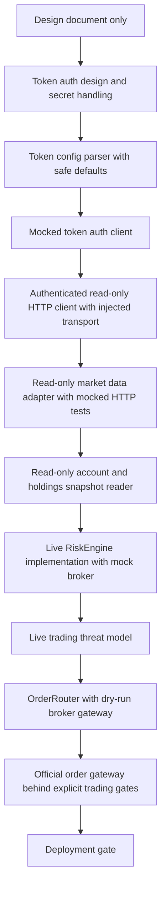
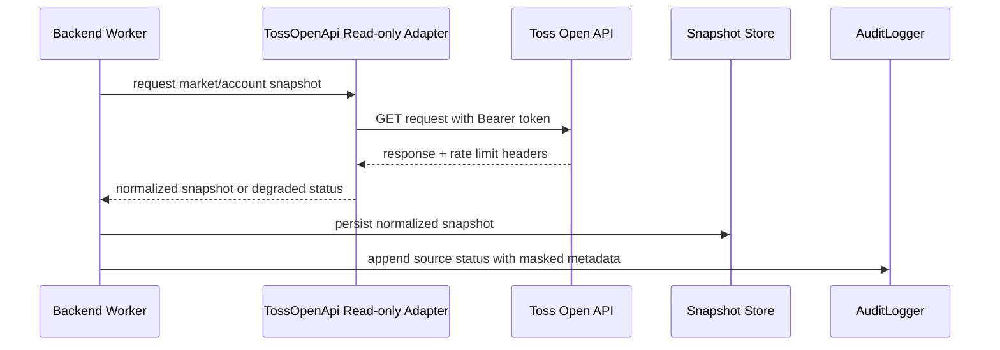
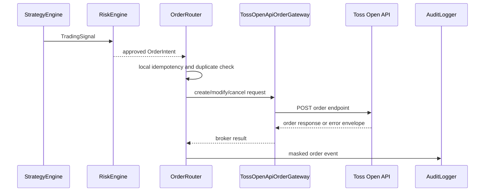

# Official Toss Open API Adapter Design

> 이 문서는 official Toss Open API adapter의 안전 경계 설계 문서다. 현재 구현은 safe-disabled token auth config, mocked token auth client, injected transport 기반 read-only HTTP client, read-only market data adapter, masked read-only account snapshot reader까지이며 actual network transport, order adapter, live order routing, live trading enable 기능은 구현하지 않는다.

## 목적

`toss-trading`의 broker primary source를 Toss Securities Open API로 옮기기 전에, 어떤 계층과 안전 조건을 먼저 고정해야 하는지 정리한다.

핵심 목표는 다음과 같다.

- official API와 비공식 `tossinvest-cli` source의 책임을 분리한다.
- `BROKER_PROVIDER=mock`, `TRADING_ENABLED=false` 기본값을 유지한 채 설계만 문서화한다.
- market/account/order endpoint를 바로 live trading path로 연결하지 않고, mock, read-only, dry-run, Risk Engine, OrderRouter 순서로만 확장한다.
- Codex MCP surface에 raw broker API, raw `tossctl`, raw `codex exec`, `place_order`를 노출하지 않는다.
- 후속 구현 PR의 중단 조건, 테스트 조건, threat model 선행 조건을 명확히 한다.

## 공식 문서 기준

이 문서는 2026-06-17 확인 기준으로 다음 official source를 참고했다.

- Human documentation: https://developers.tossinvest.com/docs
- LLM entrypoint: https://developers.tossinvest.com/llms.txt
- Overview Markdown: https://openapi.tossinvest.com/openapi-docs/overview.md
- OpenAPI Markdown: https://openapi.tossinvest.com/openapi-docs/latest/api-reference/README.md
- OpenAPI JSON source of truth: https://openapi.tossinvest.com/openapi-docs/latest/openapi.json

확인한 현재 OpenAPI metadata:

| 항목 | 값 |
| --- | --- |
| `openapi` | `3.1.0` |
| `info.title` | `토스증권 Open API` |
| `info.version` | `1.1.1` |
| base server | `https://openapi.tossinvest.com` |
| auth | OAuth 2.0 Client Credentials Grant |
| account/order header | `X-Tossinvest-Account` |

구현 PR을 시작하기 전에는 위 OpenAPI JSON을 다시 받아 endpoint, schema, auth, error, rate limit 변경 여부를 확인해야 한다. 이 문서의 endpoint 목록은 방향을 잡기 위한 snapshot이며, 구현 source of truth는 항상 OpenAPI JSON이다.

## 현재 공식 API 표면

### Auth

| Method | Path | 설명 |
| --- | --- | --- |
| `POST` | `/oauth2/token` | OAuth2 access token 발급 |

### Market Data, Stock Info, Market Info

| Method | Path | 설명 |
| --- | --- | --- |
| `GET` | `/api/v1/orderbook` | 호가 조회 |
| `GET` | `/api/v1/prices` | 현재가 조회 |
| `GET` | `/api/v1/trades` | 최근 체결 내역 조회 |
| `GET` | `/api/v1/price-limits` | 상/하한가 조회 |
| `GET` | `/api/v1/candles` | 캔들 차트 조회 |
| `GET` | `/api/v1/stocks` | 종목 기본 정보 조회 |
| `GET` | `/api/v1/stocks/{symbol}/warnings` | 매수 유의사항 조회 |
| `GET` | `/api/v1/exchange-rate` | 환율 조회 |
| `GET` | `/api/v1/market-calendar/KR` | 국내 장 운영 정보 조회 |
| `GET` | `/api/v1/market-calendar/US` | 해외 장 운영 정보 조회 |

### Account, Asset

| Method | Path | 설명 |
| --- | --- | --- |
| `GET` | `/api/v1/accounts` | 계좌 목록 조회 |
| `GET` | `/api/v1/holdings` | 보유 주식 조회 |

### Order, Order History, Order Info

| Method | Path | 설명 |
| --- | --- | --- |
| `POST` | `/api/v1/orders` | 주문 생성 |
| `POST` | `/api/v1/orders/{orderId}/modify` | 주문 정정 |
| `POST` | `/api/v1/orders/{orderId}/cancel` | 주문 취소 |
| `GET` | `/api/v1/orders` | 주문 목록 조회 |
| `GET` | `/api/v1/orders/{orderId}` | 주문 상세 조회 |
| `GET` | `/api/v1/buying-power` | 매수 가능 금액 조회 |
| `GET` | `/api/v1/sellable-quantity` | 판매 가능 수량 조회 |
| `GET` | `/api/v1/commissions` | 매매 수수료 조회 |

계좌, 자산, 주문 관련 API는 `Authorization: Bearer {access_token}` 외에 `X-Tossinvest-Account` 헤더가 필요하다.

## Adapter 책임 경계

### 이 문서가 허용하는 것

- official API endpoint category와 인증 방식에 맞춘 adapter 설계
- future module boundary, data flow, fail-closed policy 정의
- mock-first 구현 순서 정의
- read-only account/market snapshot과 order mutation path 분리
- rate limit, error envelope, audit, masking 정책 설계

### 이 문서가 금지하는 것

- real `client_id`, `client_secret`, account id, token 문서화
- official API 실제 호출 코드 추가
- 실제 network transport 구현
- `TRADING_ENABLED=true` 기본값 또는 예시 추가
- live `TradingSignal`, live `OrderIntent`, `OrderRouter`, broker adapter 구현
- `place_order` MCP tool enabled surface 추가
- dashboard 또는 Local Operations API에 broker mutation endpoint 추가
- Codex가 natural language 주문을 live order로 변환하는 경로 추가

## 권장 후속 구현 순서



후속 PR은 이 순서를 건너뛰면 안 된다. 특히 `POST /api/v1/orders` 구현은 token auth, read-only adapter, live Risk Engine, mock OrderRouter, threat model이 먼저 merge된 뒤에만 검토한다.

## 제안 계층

후속 구현에서 `src/broker/` 또는 동등한 broker integration layer를 도입할 수 있다. 실제 코드 도입 전에는 `docs/PROJECT_STRUCTURE.md`와 `docs/CODE_CONVENTION.md`를 먼저 갱신한다.

| 계층 | 책임 | 금지 |
| --- | --- | --- |
| `TossOpenApiAuthClient` | Client Credentials Grant, token cache, expiry handling | token 로그 출력, token storage commit |
| `TossOpenApiHttpClient` | base URL, auth header, account header, timeout, retry, error envelope parsing | business decision, risk approval |
| `TossOpenApiMarketDataAdapter` | prices, orderbook, trades, candles, stock warnings, market calendar read-only 조회 | account/order source of truth 역할 |
| `TossOpenApiAccountReader` | accounts, holdings read-only snapshot 조회와 masking | order mutation, portfolio mutation |
| `TossOpenApiOrderInfoReader` | buying power, sellable quantity, commissions 조회 | 주문 생성 판단 |
| `TossOpenApiOrderGateway` | create/modify/cancel order HTTP call | Risk Engine 우회, Codex/MCP 직접 호출 |
| `OrderRouter` | approved `OrderIntent`만 gateway로 전달, idempotency, retry, execution tracking | natural language order 수신 |

## Runtime data flow

### Read-only market/account flow



### Future order flow



Codex는 이 flow에 직접 참여하지 않는다. Codex는 MCP read-only tools로 audit, position, risk decision, order status를 조회하고 설명할 수 있을 뿐이다.

## Config 정책

후속 구현에서 사용할 수 있는 config 후보는 다음과 같다. 이름은 구현 PR에서 다시 검토한다.

```text
BROKER_PROVIDER=mock
TRADING_ENABLED=false
TOSS_OPEN_API_BASE_URL=https://openapi.tossinvest.com
TOSS_OPEN_API_CLIENT_ID=<local secret only>
TOSS_OPEN_API_CLIENT_SECRET=<local secret only>
TOSS_OPEN_API_ACCOUNT_ID=<local secret only>
TOSS_OPEN_API_ORDER_MUTATIONS_ENABLED=false
TOSS_OPEN_API_DRY_RUN=true
```

원칙:

- repository에는 `.env.example` 수준의 placeholder만 둔다.
- `client_id`, `client_secret`, account id, token은 source, docs, test fixture, PR body에 쓰지 않는다.
- `BROKER_PROVIDER=mock`과 `TRADING_ENABLED=false`를 계속 safe default로 둔다.
- order mutation은 `TRADING_ENABLED=true`, provider가 official API, dry-run false, Risk Engine approval, user approval 조건이 모두 맞아야만 future runtime에서 허용한다.

## Rate limit 정책

공식 overview 기준 rate limit은 client와 API group 단위 TPS로 적용된다. 현재 문서 snapshot:

| Group | 기본 한도 | 피크 한도 |
| --- | --- | --- |
| `AUTH` | 5 TPS | 해당 없음 |
| `ACCOUNT` | 1 TPS | 해당 없음 |
| `ASSET` | 5 TPS | 해당 없음 |
| `STOCK` | 5 TPS | 해당 없음 |
| `MARKET_INFO` | 3 TPS | 해당 없음 |
| `MARKET_DATA` | 10 TPS | 해당 없음 |
| `MARKET_DATA_CHART` | 5 TPS | 해당 없음 |
| `ORDER` | 6 TPS | 09:00-09:10 KST 3 TPS |
| `ORDER_HISTORY` | 5 TPS | 해당 없음 |
| `ORDER_INFO` | 6 TPS | 09:00-09:10 KST 3 TPS |

구현 정책:

- adapter는 `X-RateLimit-Limit`, `X-RateLimit-Remaining`, `X-RateLimit-Reset`, `Retry-After`를 읽어 audit/debug metadata로 남긴다.
- `429`는 `Retry-After`를 우선하고 jitter가 있는 backoff를 적용한다.
- order mutation은 retry 가능성이 공식적으로 안전하다고 확인되기 전까지 blind retry하지 않는다.
- `ORDER`와 `ORDER_INFO`는 장 시작 피크 한도를 별도 budget으로 둔다.

## Error handling 정책

공식 에러 응답은 `error.requestId`, `error.code`, `error.message`, `error.data` envelope을 사용한다.

구현 정책:

- `requestId` 또는 응답 헤더 `X-Request-Id`는 audit metadata로 남기되, 민감 주문/계좌 값은 masking한다.
- `401 invalid-token`, `401 expired-token`은 token refresh 또는 auth failure로 분리한다.
- `400 account-header-required`는 config error로 fail-closed 처리한다.
- `400 confirm-high-value-required`는 backend가 자동으로 `confirmHighValueOrder=true`를 붙이지 않는다. 별도 high-value order policy와 명시 승인 없이는 reject한다.
- `429`는 rate limit degraded status로 기록하고 재시도 가능 여부를 endpoint group별로 판단한다.
- `5xx` 또는 network timeout은 circuit breaker와 no-order/no-position-mutation 정책으로 처리한다.

## Idempotency와 duplicate prevention

OpenAPI snapshot에서 order idempotency key 계약은 이 문서에서 확정하지 않는다. 구현 전 OpenAPI JSON과 order endpoint detail을 다시 확인한다.

로컬 정책은 다음을 기본으로 한다.

- `OrderIntent`에는 backend-generated `intentId`와 deterministic order hash를 둔다.
- `OrderRouter`는 같은 `intentId` 또는 같은 order hash가 열린 상태이면 중복 전송하지 않는다.
- mutation 요청이 timeout된 경우에는 즉시 재전송하지 않고 order history/detail 조회로 상태를 먼저 확인한다.
- 공식 API가 idempotency key를 지원하면 local `intentId`와 매핑한다.
- 공식 API가 idempotency key를 지원하지 않으면 retry policy를 더 보수적으로 제한한다.

## Audit와 masking

후속 구현은 다음 필드를 audit/logging 대상으로 구분한다.

| 구분 | 저장 가능 | 원문 출력 |
| --- | --- | --- |
| API group, method, path template | 가능 | 가능 |
| requestId, rate limit header | 가능 | 가능 |
| account id | masked 또는 encrypted local store만 | 금지 |
| access token, client secret | 금지 | 금지 |
| broker order id | masked 또는 encrypted local store만 | 금지 |
| execution detail | encrypted local store 검토 필요 | 금지 |
| normalized market quote | 가능 | 가능 |

문서, fixture, PR body에는 real account data, token, order id, execution data를 넣지 않는다.

## 공식 API와 `tossinvest-cli` 관계

- official Toss Open API는 production broker adapter의 primary source 후보다.
- `tossinvest-cli` fork는 optional read-only intelligence source로만 유지한다.
- account, order, execution, holdings source of truth는 official API 또는 mock broker가 담당해야 한다.
- 비공식 source의 ranking, signals, watchlist-like data는 candidate enrichment에는 쓸 수 있지만 live order routing의 필수 근거가 될 수 없다.

## MCP와 dashboard 노출 정책

이 설계 이후에도 MCP와 dashboard 기본 surface는 read-only다.

허용 가능한 future read-only 조회:

- masked broker source health
- masked account snapshot status
- order router dry-run status
- risk decision summary
- execution reconciliation summary

기본 금지:

- `place_order`
- `place_market_order`
- `enable_live_trading`
- raw broker API call
- raw `tossctl`
- raw `codex exec`
- dashboard-triggered order mutation
- natural language order command

제한적 operational tool을 추가하려면 별도 threat model, approval, audit, idempotency, rollback, mock test가 필요하다.

## 테스트 전략

후속 구현은 최소 다음 테스트를 포함해야 한다.

- auth config parser가 secrets를 로그에 남기지 않고 missing secret을 fail-closed 처리한다.
- HTTP client가 OpenAPI fixture 기반 response/error envelope을 parsing한다.
- rate limit `429`와 `Retry-After`를 처리한다.
- account header가 필요한 endpoint에서 누락 시 fail-closed 처리한다.
- read-only market/account adapter는 mutation endpoint를 호출하지 않는다.
- order gateway는 `TRADING_ENABLED=false` 또는 `ORDER_MUTATIONS_ENABLED=false`에서 실행되지 않는다.
- Risk Engine reject가 있으면 `OrderRouter`가 broker gateway를 호출하지 않는다.
- duplicate order intent는 전송되지 않는다.
- MCP enabled tool 목록에 live order tool이 추가되지 않는다.
- dashboard/API에 mutation endpoint가 추가되지 않는다.

## PR 분리 계획

| 순서 | PR | 포함 | 제외 |
| --- | --- | --- | --- |
| 1 | Official API adapter design | 이 문서와 링크 | code, token auth, order |
| 2 | [Official token auth design](official-token-auth-design.md) | env, secret handling, token lifecycle 문서와 tests plan | real secret, API call |
| 3 | Token config parser | safe-disabled env parser, placeholder, missing secret tests | token issue HTTP call |
| 4 | Mocked token auth client | form request builder, response parser, memory cache, single-flight tests | HTTP transport, account/order adapter |
| 5 | Authenticated read-only HTTP client | Bearer injection, read-only method guard, error/rate mapping tests | actual network transport, mutation retry |
| 6 | Read-only market data adapter | mocked HTTP client, market endpoint read-only mapping | account/order mutation |
| 7 | Read-only account snapshot | accounts/holdings reader, masking, source status | order mutation |
| 8 | Live RiskEngine implementation | deterministic policy, fixtures, fail-closed tests | broker gateway |
| 9 | Live trading threat model | attack paths, secrets, approval, rollback | implementation shortcut |
| 10 | Live OrderRouter dry-run | local idempotency, mock broker, audit | official order POST |
| 11 | Official order gateway behind gates | create/modify/cancel under explicit gates | MCP direct order tool |
| 12 | Deployment packaging | process isolation, config, monitoring | default live enable |

## Merge 전 체크리스트

후속 구현 PR은 아래 항목이 확인되지 않으면 merge하지 않는다.

- [ ] OpenAPI JSON을 구현 시점에 다시 확인했다.
- [ ] `BROKER_PROVIDER=mock` 기본값을 유지한다.
- [ ] `TRADING_ENABLED=false` 기본값을 유지한다.
- [ ] secrets가 source, docs, test fixture, PR body에 없다.
- [ ] order mutation은 mock 또는 dry-run에서 먼저 검증했다.
- [ ] Risk Engine reject가 broker call보다 앞에 있다.
- [ ] mutation retry는 idempotency와 status 조회 없이 blind retry하지 않는다.
- [ ] MCP enabled surface에 live order tool이 없다.
- [ ] Local Operations API와 dashboard에 broker mutation endpoint가 없다.
- [ ] audit log가 requestId와 masked metadata를 남긴다.
- [ ] 투자 조언, 성과 보장, 종목 추천으로 읽힐 수 있는 문구가 없다.
