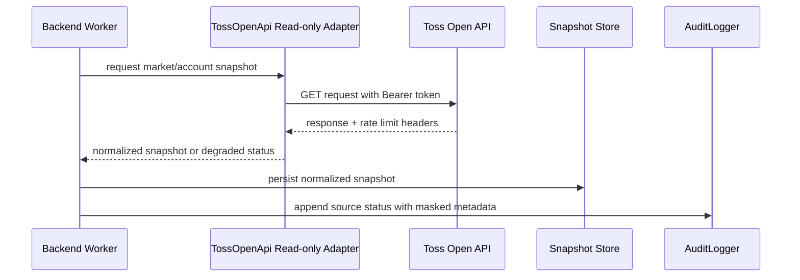

# Official Toss Open API Adapter Design

> 이 문서는 official Toss Open API adapter의 안전 경계 설계 문서다. 현재 구현은 safe-disabled token auth config, generation-aware token auth client, calendar 전용 token issuer와 Calendar GET network transport, paper-only calendar acquisition coordinator, injected transport 기반 read-only HTTP client, read-only market data adapter, masked read-only account snapshot reader까지다. Order adapter, live order routing, live trading enable 기능은 계속 구현하지 않는다.

## 목적

`toss-trading`의 broker primary source를 Toss Securities Open API로 옮기기 전에, 어떤 계층과 안전 조건을 먼저 고정해야 하는지 정리한다.

핵심 목표는 다음과 같다.

- official API와 비공식 `tossinvest-cli` source의 책임을 분리한다.
- Official market calendar의 operational/observed broker source 책임과 KRX/NYSE exchange-grade historical evidence 책임을 분리한다.
- `BROKER_PROVIDER=mock`, `TRADING_ENABLED=false` 기본값을 유지한 채 설계만 문서화한다.
- market/account/order endpoint를 바로 live trading path로 연결하지 않고, mock, read-only, dry-run, Risk Engine, OrderRouter 순서로만 확장한다.
- Codex MCP surface에 raw broker API, raw `tossctl`, raw `codex exec`, `place_order`를 노출하지 않는다.
- 후속 구현 PR의 중단 조건, 테스트 조건, threat model 선행 조건을 명확히 한다.

## 공식 문서 기준

이 문서는 2026-08-13 확인 기준으로 다음 official source를 참고했다.

- Human documentation: https://developers.tossinvest.com/docs
- LLM entrypoint: https://developers.tossinvest.com/llms.txt
- Overview Markdown: https://openapi.tossinvest.com/openapi-docs/overview.md
- OpenAPI Markdown: https://openapi.tossinvest.com/openapi-docs/latest/api-reference/README.md
- OpenAPI JSON source of truth: https://openapi.tossinvest.com/openapi-docs/latest/openapi.json

확인한 현재 OpenAPI metadata:

| 항목 | 값 |
| --- | --- |
| `openapi` | `3.1.0` |
| `info.title` | `토스증권 Open API` |
| `info.version` | `1.2.14` |
| base server | `https://openapi.tossinvest.com` |
| auth | OAuth 2.0 Client Credentials Grant |
| account/order header | `X-Tossinvest-Account` |

구현 PR을 시작하기 전에는 위 OpenAPI JSON을 다시 받아 endpoint, schema, auth, error, rate limit 변경 여부를 확인해야 한다. 이 문서의 endpoint 목록은 방향을 잡기 위한 snapshot이며, 구현 source of truth는 항상 OpenAPI JSON이다. 2026-08-14 재확인한 `1.2.14` document는 416,651 bytes, `sha256:d29f9079a557c0b6affcec330aa131f93b09fd49932354668e3dc4524cd42180`이며 KR/US calendar path, operation id와 response schema reference가 아래 compatibility contract와 일치한다.

`scripts/extractTossCalendarOpenApiSnapshot.mjs <pinned-openapi.json>`는 최대 1 MB의 explicit local source file만 받고 transient full source bytes의 SHA-256을 검증한 뒤 calendar path만 추출한다. Mutable `latest` URL을 script가 다시 fetch하지 않으므로 원본 bytes는 별도 read-only acquisition 단계에서 저장하고 hash를 확인한 뒤 전달해야 한다. `src/replay/officialBrokerObservedCalendarOpenApiCompatibility.ts`는 이 document identity와 기존 strict response parser contract를 고정하고, 추출된 `src/replay/officialTossCalendarOpenApi-1.2.14.json` bytes의 자체 SHA-256과 `sourceDocumentSha256`, metadata, KR/US operation binding과 response schema reference를 먼저 검증한다. Pinned artifact는 `.gitattributes`에서 LF bytes로 고정하며 전체 OpenAPI 문서의 account/order/execution example은 저장하지 않는다. Compatibility result는 caller response가 해당 market의 pinned example value와 exact match할 때만 생성된다. 이 결과의 호환성 범위는 `compatibilityScope="pinned_document_examples_only"`이며 OpenAPI component schema가 허용하는 모든 optional/nullable 조합이나 actual authenticated network response evidence를 주장하지 않는다. Version-aware v2 evidence, replay consumer migration과 ephemeral lifecycle boundary가 구현된 뒤에도 compatibility result 자체는 handoff authority가 아니므로 `paper_only`, `official_broker_observed`, `observed_session_only`와 legacy `evidenceHandoffStatus="blocked_pending_version_aware_consumers"`를 유지한다. Actual network-derived v2 handoff authority는 process-local lifecycle factory provenance에서만 생기며, 이 compatibility 결과만으로 network response를 v1 evidence builder에 전달하거나 `official_exchange`로 승격할 수 없다.

## 현재 공식 API 표면

### Auth

| Method | Path | 설명 |
| --- | --- | --- |
| `POST` | `/oauth2/token` | OAuth2 access token 발급 |

### Market Data, Stock Info, Market Info

| Method | Path | 설명 |
| --- | --- | --- |
| `GET` | `/api/v1/orderbook` | 호가 조회 |
| `GET` | `/api/v1/prices` | 현재가 조회 |
| `GET` | `/api/v1/trades` | 최근 체결 내역 조회 |
| `GET` | `/api/v1/price-limits` | 상/하한가 조회 |
| `GET` | `/api/v1/candles` | 캔들 차트 조회 |
| `GET` | `/api/v1/stocks` | 종목 기본 정보 조회 |
| `GET` | `/api/v1/stocks/{symbol}/warnings` | 매수 유의사항 조회 |
| `GET` | `/api/v1/exchange-rate` | 환율 조회 |
| `GET` | `/api/v1/market-calendar/KR` | 국내 장 운영 정보 조회 |
| `GET` | `/api/v1/market-calendar/US` | 해외 장 운영 정보 조회 |

Market calendar endpoint는 primary operational/observed broker calendar source다.
Future evidence class는 `official_broker_observed`이며 실제로 검증된 requested date와
returned session 범위에만 적용한다. 이 source는 KRX/NYSE first-party raw document
기반 `official_exchange` evidence보다 아래 계층이고, historical completeness,
official holiday archive completeness 또는 `official_exchange` readiness를
증명하지 않는다. Historical coverage가 검증되기 전 replay calendar evidence
class는 `observed_session_only`를 유지한다.

Future evidence contract는 request path/query, requested date, market, retrieval
timestamp, accepted identity payload의 exact hash와 byte length, parser/API contract
snapshot identity, stale policy와 requested/returned coverage 결과를 기록해야 한다. Unversioned provider
response가 실제 배포 version을 노출하지 않으면 이를 추정하거나 contract snapshot version을
provider-served version으로 표시하지 않는다. Unsupported date, partial response, schema
mismatch, provenance 누락, stale source와 coverage 불명확성은 fail-closed로 거부한다.
Access token과 client credential은 기록하지 않는다.
이 source hierarchy 결정만으로 network transport, OAuth credential, response bytes
취득, response schema/parser 또는 replay 연결을 승인하지 않는다. 각 책임은 별도
Small PR에서 strict contract와 fail-closed test를 함께 검토한다.

`official_broker_observed_calendar_evidence.v1`은 이 metadata 경계를 구현한다.
OpenAPI `1.2.13`의 market별 exact GET path, operation id와 `date` query를 요청
market/date에 결합하고, exact UTF-8 JSON identity payload bytes의 SHA-256과 byte length를
보존한다. Legacy `source.apiVersion="1.2.13"`은 이 synthetic-only v1 parser가 검증된
OpenAPI contract snapshot identity이며 실제 network response를 제공한 deployment version
관측값이 아니다. Raw bytes 자체와 credential은 artifact에 넣지 않는다. 정규화 response,
request identity, response identity, requested/returned date와 session range,
24시간 retrieval-age freshness policy를 하나의 canonical artifact hash로 묶는다.
Freshness는 retrieval 시각 이상이고 `staleAfter` 미만인 `asOf`에서만 통과한다.
Coverage는 반환된 세 date와 그 response에 실제로 포함된 session에만 `verified`이며
historical completeness는 항상 `not_claimed`, replay class는 계속
`observed_session_only`다. 이 계약은 synthetic/in-memory bytes만 처리하며 HTTP
transport, OAuth 또는 replay fixture 연결을 추가하지 않는다.

후속 read-only replay adapter는 verified evidence를 기존 market calendar
validation rule과 세 returned-day fixture로만 투영한다. Open day에는 exactly one
regular session을 요구하고 KR/US IANA timezone에서 기존 fixture parser를 다시
통과시킨다. Closed day는 legacy replay의 no-session fail-closed 표현으로만 보존하며
official holiday 명칭이나 completeness로 해석하지 않는다. Adapter는 evidence의
artifact/raw-response hash, freshness와 eligible transition을 사용 시점에 다시
검증하고 network, credential, source file write 또는 replay 실행을 수행하지 않는다.

Credential-free coverage probe는 지정 범위의 모든 calendar date를 canonical plan으로
열거하고 외부에서 제공된 verified evidence observation만 평가한다. Missing/rejected
date 또는 겹치는 response의 동일 returned date session 불일치가 하나라도 있으면
coverage를 `ambiguous`, observed replay eligibility를 `rejected`로 보고한다. 모든
planned date가 verified여도 이 결과는 계획 범위의 broker observation coverage이며
historical completeness 또는 `official_exchange` readiness가 아니다. Probe는
HTTP/OAuth를 호출하지 않고 raw response bytes나 credential을 report에 저장하지 않는다.
Stored report를 다시 읽을 때는 별도로 보관된 evidence와 exact raw bytes observation을
요구하고 report를 완전히 재생성해 비교한다. Report의 public hash만 다시 계산해서
conflict나 reject 결과를 지우는 변경은 검증을 통과할 수 없다.
이 stored-report 경로는 synthetic v1 또는 별도 저장 계약으로 exact bytes를 제공할 수 있는
observation에만 적용한다. Actual network-derived v2 observation과 그 coverage report는 아래
ephemeral lifecycle 경계 때문에 process 재시작 뒤 stored-report 입력으로 사용할 수 없다.

### Calendar 전용 network acquisition 허용 경계

Standing maintenance delegation에 따라 actual network 구현은 다음 두 책임으로만
제한한다. 이 승인은 general-purpose official API client, account 조회 또는 order
surface 승인이 아니다.

| 책임 | 허용 request | 필수 제한 |
| --- | --- | --- |
| Token issuer transport | `POST https://openapi.tossinvest.com/oauth2/token` | `application/x-www-form-urlencoded`, `grant_type=client_credentials`, `Accept-Encoding: identity`, redirect 금지, credential/token masking |
| Calendar read-only transport | `GET https://openapi.tossinvest.com/api/v1/market-calendar/KR` 또는 `/US` | canonical `date=YYYY-MM-DD` query를 exactly one으로 요구, `Accept-Encoding: identity`, exact no-cache request policy, Bearer 외 credential header 금지, `X-Tossinvest-Account` 금지 |

공통 fail-closed 조건:

- `TOSS_OPEN_API_AUTH_ENABLED=false`를 기본값으로 유지하고 disabled/invalid config에서는
  DNS 또는 socket 연결 전에 중단한다.
- Base URL은 userinfo, path, query, fragment가 없는 exact HTTPS origin
  `https://openapi.tossinvest.com`만 허용한다. 임의 host, protocol-relative URL,
  backslash path와 caller-provided absolute URL은 거부한다.
- Provider endpoint와 generic `TossOpenApiMarketDataAdapter`가 `date` 생략을 지원해도
  evidence acquisition은 생략을 허용하지 않는다. Coordinator는 canonical
  `date=YYYY-MM-DD`를 정확히 하나 전송하고 market, requested date와 effective query를
  evidence builder 전에 exact bind한다. Query 누락, duplicate, unknown query 또는 값
  mismatch는 response를 evidence로 조립하지 않고 거부한다.
- Automatic redirect, cookie jar, client certificate와 credential-bearing proxy auth를
  사용하지 않는다. `Authorization`, `Content-Type`, `Accept` 외의 credential 또는
  account header를 임의 주입하지 않는다.
- Token issue와 calendar GET의 각 network attempt는 request 시작 직전에 monotonic absolute
  deadline을 설정하고 DNS lookup, TCP connection, TLS handshake, response header와 complete
  body 수신 전체를 10,000ms 이하로 제한한다. Socket inactivity timeout만 사용하거나
  response chunk 수신마다 deadline을 재설정하지 않는다. Guarded `401` 뒤 calendar retry는
  별도 attempt지만 각 attempt가 같은 absolute deadline 상한을 지켜야 한다. Deadline까지
  complete body가 수신되지 않으면 request/socket/stream을 abort하고 partial bytes를 폐기한다.
  Token response는 256KiB, calendar response는 1MiB를 초과하면 body를 사용하지 않고 거부한다.
- Token POST와 calendar GET은 exact `Accept-Encoding: identity`를 전송하고 HTTP library의
  automatic compression advertisement와 response decompression을 비활성화한다. Caller,
  config 또는 retry path가 다른 `Accept-Encoding`을 주입할 수 없다.
- Token POST와 calendar GET request는 `Range`와 `If-Range` header를 보내지 않는다. Caller,
  config 또는 retry path가 이 header를 주입하면 socket 전송 전에 거부한다.
- Initial calendar GET과 guarded `401` 뒤 retry는 각각 exact
  `Cache-Control: no-cache, no-store, max-age=0`과 `Pragma: no-cache`를 전송한다.
  `If-None-Match`와 `If-Modified-Since`를 포함한 conditional request는 보내지 않는다.
  Transport는 실제 전송 header value 목록을
  `verifyOfficialMarketCalendarCacheRequestPolicy`로 검증하며 caller, config 또는 retry가
  cache policy를 변경하지 못하게 한다.
- Calendar final response는 status exact `200`만 허용하고 raw `Content-Range` header가
  없어야 한다. `206 Partial Content`, 그 밖의 `2xx`와 status `200`의 `Content-Range`
  response는 body가 syntactically valid calendar JSON이어도 parser 또는 evidence builder에
  전달하지 않는다.
- Token response도 status exact `200`이고 raw `Content-Range` header가 없어야 한다. `201`,
  `202`, `204`, `206`을 포함한 그 밖의 `2xx`, non-`2xx`와 status `200`/`Content-Range`
  조합은 body가 syntactically valid token JSON이어도 token parser나 cache에 전달하지 않는다.
- Token과 calendar response의 raw `Content-Encoding` header는 값이 `identity`여도
  허용하지 않는다. Transport는 raw header를 확인한 뒤 HTTP transfer framing이 제거되고
  content decoding은 수행되지 않은 exact payload bytes를 streaming으로 센다. Token
  256KiB와 calendar 1MiB cap, UTF-8 JSON parser, calendar response SHA-256/byte length는
  모두 이 동일한 bytes에 적용한다.
- 허용된 status/header를 통과한 response도 complete `application/json` body만 사용한다.
  Unsupported content type, truncated body, size 초과, timeout과 transport error는 partial
  evidence를 만들지 않는다.
- 첫 구현은 기존 read-only client의 invalid/expired token 대상 guarded reissue 1회
  외에 network, `429` 또는 `5xx` 자동 retry를 추가하지 않는다.
- Guarded reissue 전에 HTTP request가 사용한 token generation을 보존하고 AuthClient가
  failed generation과 current cached generation을 compare-and-clear하도록 client contract를
  강화한다. Token A의 늦은 `401`이 이미 발급된 token B를 지우거나 token C를 발급하는
  unconditional invalidation 경로가 남아 있으면 production transport를 연결하지 않는다.
- Token B로 수행한 유일한 retry도 `401 invalid-token` 또는 expired-token 계열로 실패하면
  retry lease의 B generation을 compare-and-clear한 뒤 auth failure를 반환한다. 이 정리는
  현재 호출에서 token C 발급이나 세 번째 calendar request를 시작하지 않는다. B가 current면
  제거해 다음 caller의 재사용을 막고, 이미 C가 current면 stale B invalidation은 C를 지우지
  않는 no-op이어야 한다.
- Token과 credential은 process memory 밖에 저장하지 않는다. Calendar exact response
  bytes는 evidence hash와 parser 입력을 위해 acquisition result의 memory에만 보존하며
  log, PR body 또는 public artifact에 기록하지 않는다. Durable raw-byte 저장은 별도
  threat model과 저장 계약 전에는 도입하지 않는다.
- Actual network acquisition result는 v2 evidence, exact response bytes와 검증된 cache
  metadata를 함께 가진 process-local ephemeral observation envelope로만 표현한다. Coordinator는
  이 envelope를 같은 process의 replay adapter 또는 coverage probe에 직접 전달할 수 있지만
  evidence나 derived replay input/coverage report를 envelope에서 분리해 JSON, file, DB, object
  store, audit, CLI, MCP 또는 API output으로 직렬화하거나 저장할 수 없다. Consumer는 같은 exact
  bytes로 version별 verifier를 통과한 뒤에만 결과를 사용하고, 성공/실패와 관계없이 consumer
  chain 종료 시 bytes reference를 폐기한다. Process 종료 또는 bytes 누락 뒤 남은 v2 evidence,
  replay input과 report는 unverifiable로 취급해 fail-closed로 거부하며 재사용하려면 acquisition을
  다시 수행한다.
- Calendar final response의 raw `Date`는 exactly one canonical IMF-fixdate여야 하고 raw
  `Age`는 없거나 single non-negative decimal integer, raw `Expires`는 없거나 single canonical
  IMF-fixdate여야 한다. Duplicate/missing/invalid `Date`, duplicate/invalid `Age`,
  duplicate/invalid `Expires`와 invalid `Cache-Control` directive syntax는 body가 valid calendar
  JSON이어도 거부한다. Response `Cache-Control`과 `Expires` 부재는 각각 canonical `null`로
  보존한다.
- Calendar transport는 final request attempt 시작 직전에 monotonic clock을 기록하고,
  status/header/encoding/size 검증을 통과한 complete body 수신 시 같은 monotonic clock과
  coordinator-owned UTC clock을 읽어 immutable `completedAt`을 transport result에 결합한다.
  Final attempt의 monotonic elapsed nanoseconds를 millisecond로 올림한
  `responseDelayMilliseconds`는 safe integer `0..10,000`이어야 한다. Raw
  `Date`/`Age`/`Expires`와 `completedAt`은 기존 cache header/control parser를 확장한
  backward-compatible network-bound variant로 검증한다. Response delay와 `Expires`를 받지
  않는 현재 `resolveOfficialMarketCalendarResponseFreshness`를 actual network v2에 그대로
  사용하지 않는다. Network-bound variant가 HTTP corrected age와 expiry를 다음과 같이
  결정론적으로 계산해야 한다.

  ```text
  responseDelayMilliseconds = ceil(finalAttemptElapsedNanoseconds / 1,000,000)
  apparentAgeMilliseconds = max(0, completedAtMs - responseDateMs)
  correctedAgeValueMilliseconds = (responseAgeSeconds ?? 0) * 1,000 + responseDelayMilliseconds
  correctedInitialAgeMilliseconds = max(apparentAgeMilliseconds, correctedAgeValueMilliseconds)
  effectiveResponseAtMs = completedAtMs - correctedInitialAgeMilliseconds
  policyStaleAfterMs = effectiveResponseAtMs + 86,400 * 1,000
  expiresFreshnessLifetimeMilliseconds = responseExpiresMs == null
    ? null
    : max(0, responseExpiresMs - responseDateMs)
  expiresStaleAfterMs = expiresFreshnessLifetimeMilliseconds == null
    ? null
    : effectiveResponseAtMs + expiresFreshnessLifetimeMilliseconds
  responseStaleAfterMs = hasValidatedResponseMaxAge
    ? effectiveResponseAtMs + validatedResponseMaxAgeSeconds * 1,000
    : responseExpiresMs != null
      ? expiresStaleAfterMs
      : policyStaleAfterMs
  staleAfterMs = min(policyStaleAfterMs, responseStaleAfterMs)
  ```

  Response semantic allowlist는 `public`, `private`, `no-transform`, `must-revalidate`,
  `proxy-revalidate`, `max-age`, `s-maxage`, `no-cache`, `no-store`로 고정한다. `max-age`와
  `s-maxage`는 unquoted `0|[1-9][0-9]*` safe integer argument를 정확히 하나 요구하며,
  `validatedResponseMaxAgeSeconds`는 두 값 중 최솟값이고 둘 다 없으면 86,400이다. 나머지
  directive는 argument를 허용하지 않는다. `no-cache` 또는 `no-store`는 offline evidence
  reuse와 양립할 수 없으므로 evidence 생성 전에 거부하고, allowlist 밖 extension도 의미를
  추측하지 않고 거부한다. 허용된 non-lifetime directive는 provenance로 보존하되
  `staleAfter`를 늘리지 않는다. 따라서 `max-age=0`, `s-maxage=0` 또는 corrected age 때문에
  `completedAt >= staleAfter`가 되면 initial evaluation부터 already-stale로 거부한다.
  `max-age`/`s-maxage`가 하나라도 있으면 raw `Expires`보다 우선하고, 둘 다 없을 때만
  `Expires - Date`의 non-negative freshness lifetime을 corrected `effectiveResponseAt`에 더해
  response expiry를 계산한다. 이 fallback `Expires`가 `Date`와 같거나 이전이거나 corrected
  age 때문에 이미 expiry에 도달했으면 evidence를 만들지 않는다. `Expires` millisecond
  subtraction과 expiry addition의 overflow 또는 canonical date range 이탈도 fail-closed다.

  Monotonic clock 역행, deadline 초과, second-to-millisecond 변환과 age/delay 합산의 safe-integer
  overflow, timestamp subtraction/addition의 canonical date range 이탈은 evidence 생성 전에
  fail-closed로 거부한다. Guarded retry가 있으면 실패 attempt의 elapsed time을 final response의
  delay에 합산하지 않고 final response를 만든 attempt의 request/response delay만 결합한다.

  Evidence의 `retrievedAt`은 실제 network completion인 `completedAt`을 기록하되 freshness는
  response delay가 반영된 `effectiveResponseAt`에서만 시작한다. Initial `evaluatedAt`은 `completedAt`이며
  `completedAt >= staleAfter`이면 이미 stale인 response로 거부한다. 따라서 같은 cached
  representation을 다시 받아도 retrieval completion만으로 24시간 eligibility를 재시작하지
  않는다. Acquisition coordinator public input은 `retrievedAt`, `evaluatedAt`, response cache
  metadata, response delay 또는 `effectiveResponseAt`을 받지 않으며 provider body, caller, env,
  config 값으로 이를 덮어쓸 수 없다. Production factory는 clock override를 노출하지 않고
  deterministic wall/monotonic clock injection은 test-only factory에만 둔다.
- Existing `official_broker_observed_calendar_evidence.v1` synthetic/in-memory builder는
  caller-provided `retrievedAt`에서 `staleAfter`를 계산하고 response cache provenance를
  표현하지 못하므로 actual network response handoff에 사용하지 않는다. V2 evidence가
  `retrievedAt`, raw header에서 parse한 canonical `responseDate`, nullable
  `responseAgeSeconds`와 nullable `responseExpires`, transport가 측정한
  `responseDelayMilliseconds`, canonical response cache-control, `effectiveResponseAt`과
  cache-adjusted `staleAfter`를 strict provenance로 기록하고 재검증한 뒤에만 coordinator가
  actual response를 evidence로 조립할 수 있다.
- Coordinator output은 `paper_only`, `official_broker_observed`,
  `observed_session_only`로 고정한다. Historical completeness와 `official_exchange`
  readiness를 주장하거나 Risk Engine, order, portfolio mutation 경로에 연결하지 않는다.

실제 external request에는 owner가 repository 밖에서 발급한 credential과 허용 IP 설정이
필요하다. 이 외부 설정이 없어도 transport, local mock server, coordinator, preflight와
negative test 구현은 계속할 수 있다. 실제 호출을 실행하지 않은 PR은 그 사실을
명시하며, mock 결과를 official response evidence로 기록하지 않는다.

OpenAPI `1.2.14` calendar schema가 현재 strict response parser와 호환된다는
byte-level synthetic fixture gate와 backward-compatible evidence transition은 구현됐다.
Compatibility gate 자체는 evidence artifact를 만들지 않으며, v2 evidence도 version-aware
consumer와 ephemeral lifecycle handle을 통과하지 않고 replay adapter 또는 coverage probe로
handoff하지 않는다.

- `official_broker_observed_calendar_evidence.v1` schema, builder와 verifier는
  OpenAPI `1.2.13`에 계속 고정한다. 기존 v1 artifact를 rewrite하거나 v1의
  legacy `source.apiVersion` 상수만 `1.2.14`로 바꾸지 않는다. 이 field는 v1 parser contract
  snapshot identity이며 acquired provider deployment version이 아니다.
- `1.2.14` response는 별도 `official_broker_observed_calendar_evidence.v2`
  schema/builder/verifier가 `source.apiContractVersion="1.2.14"`와 검증에 사용한 official
  OpenAPI document의 SHA-256을 provenance에 기록할 때만 받을 수 있다. V2는
  `source.apiVersion` 또는 `source.providerApiVersion`을 허용하지 않는다. 이 hash와
  contract version은 response parser의 interpretation context이며 response hash나 실제
  provider deployment version의 관측 증거가 아니다. V2 source provenance는 위 cache
  request policy version, `retrievedAt`, canonical `responseDate`, nullable
  `responseAgeSeconds`, nullable `responseExpires`, transport-derived
  `responseDelayMilliseconds`, canonical response cache-control, corrected
  `effectiveResponseAt`과 `staleAfter`도 필수로 결합한다.
- Immutable trusted parser contract registry는 API contract version, OpenAPI document hash,
  calendar operation id/path와 response parser contract version을 하나의 entry로 결합한다.
  Coordinator와 builder는 caller-provided version string을 신뢰하지 않고 compatibility gate가
  process-local로 생성한 결과에서 registry entry를 선택해 exact parser provenance를 구성한다.
  Compatibility result의 pinned example response는 registry 검증용이고 actual network body와
  equality를 요구하지 않는다. Network observation은 별도 requested date와 exact raw bytes를
  strict response parser, response hash와 request/coverage binding으로 검증한다.
- Verifier는 artifact schema version으로 v1과 v2 검증 경로를 결정한다. Unknown schema,
  registry에 없는 API contract version, document hash/operation/parser mismatch와 contract
  version 누락은 artifact 생성 또는 검증 전에 fail-closed로 거부한다. V2에 actual provider
  version을 주장하는 unknown field를 추가하는 것도 strict schema에서 거부한다.
- Replay adapter와 coverage probe의 consumer migration은 v1/v2 schema-version dispatch를
  사용한다. 두 consumer는 version별 verifier에 같은 exact raw response bytes와 `asOf`를 전달해
  response hash, byte length, normalized response와 freshness를 다시 검증하고 unknown schema,
  raw-byte 누락/불일치와 registry mismatch를 fail-closed로 거부한다. Existing v1 replay input과
  coverage report 검증도 그대로 통과한다.
- `officialBrokerObservedCalendarEphemeralObservation.ts`는 network-derived v2 evidence와
  exact bytes의 ownership을 하나의 process-local opaque handle로 이전한다. Factory는 exact bytes를
  내부 copy로 격리한 뒤 caller view를 즉시 zeroize하고, handle은 evidence/raw bytes를 직접 노출하지
  않는다. Factory provenance, 1회 소비와 consume 시 exact-byte 재검증을 강제하고
  success/error/stale/serialization 뒤 internal bytes를 zeroize한다. Replay input과 coverage report는
  module-owned fixed non-exporting operation 안에서만 만들고 caller callback 또는 return value로
  제공하지 않는다. Handle JSON export와 재사용은 fail-closed 처리하며 public consumer registration
  surface를 두지 않는다.
  Durable content-addressed raw-byte store를
  도입하려면 response bytes의 confidentiality classification, hash-to-evidence atomic binding,
  file permission, retention/deletion, tamper detection과 restart readback을 정의한 별도 threat
  model과 저장 계약이 먼저 merge돼야 한다.

Calendar URL과 official OpenAPI `latest` document는 versioned immutable identifier가 아니므로
registry 선택만으로 response가 `1.2.14` deployment에서 제공됐다고 주장할 수 없다. Provider가
공식적으로 정의한 authenticated response header/body field, versioned endpoint 또는 signed
manifest 같은 contemporaneous binding을 확인하기 전에는 provider-served API version은
`unknown/not_claimed` 의미로만 취급하고 artifact field로 기록하지 않는다. 향후 binding을
추가하려면 해당 값의 official semantics, request-response 결합과 위변조 방지 test를 별도
contract PR에서 먼저 고정한다.

따라서 version drift를 무시하거나 metadata만 `1.2.14`로 바꿔 기존 artifact를 재해석하는
동작은 금지한다. Compatibility test와 version-aware evidence transition 중 하나라도
없으면 coordinator는 raw response bytes를 evidence builder에 전달하지 않는다.

### Test-only network injection 계약

Local integration test는 production URL allowlist를 localhost URL로 완화하지 않는다.
Request validator가 exact logical origin, method, path와 query를 먼저 통과시킨 뒤 저수준
socket connector만 test factory에서 주입한다.

- Logical request URL과 provenance origin은 `https://openapi.tossinvest.com`,
  destination authority는 `openapi.tossinvest.com:443`, HTTP `Host` header는
  `openapi.tossinvest.com`, TLS SNI/servername은 port 없는 bare DNS hostname
  `openapi.tossinvest.com`을 사용한다. Loopback dial address와 ephemeral port는
  artifact, request identity 또는 application config에 나타나지 않는다. Authority의
  port를 TLS servername에 전달하거나 certificate SAN과 비교하지 않는다.
- Test connector는 validated production host의 socket dial만 `127.0.0.1` 또는 `::1`의
  지정된 ephemeral HTTPS server로 매핑한다. 다른 host, non-loopback address와 두 번째
  redirect target은 거부한다.
- Local HTTPS server는 per-test CA가 서명하고 SAN이 `openapi.tossinvest.com`인 server
  certificate를 사용한다. Test connector에만 해당 CA를 주입하며 hostname/certificate
  verification은 유지한다. `NODE_TLS_REJECT_UNAUTHORIZED=0`,
  `rejectUnauthorized=false`와 plaintext HTTP는 허용하지 않는다.
- Production factory는 dial target, custom CA 또는 test connector 입력을 받지 않고
  platform trust 기반 connector만 구성한다. Test factory는 별도 test-only module에 두고
  runtime config, env, CLI, MCP, dashboard 또는 Local Operations API에 노출하지 않는다.
- Redirect, timeout, oversized body, incomplete stream과 abort test는 이 loopback HTTPS
  server가 응답을 제어해 실행한다. Redirect `Location`은 logical production URL 기준으로
  검증하며 automatic follow 금지는 그대로 적용한다.
- Test fixture는 synthetic credential/token만 사용하고 mock response를 official evidence로
  표시하지 않는다. Test dial metadata도 evidence builder 입력에 포함하지 않는다.

### Account, Asset

| Method | Path | 설명 |
| --- | --- | --- |
| `GET` | `/api/v1/accounts` | 계좌 목록 조회 |
| `GET` | `/api/v1/holdings` | 보유 주식 조회 |

### Order, Order History, Order Info

| Method | Path | 설명 |
| --- | --- | --- |
| `POST` | `/api/v1/orders` | 주문 생성 |
| `POST` | `/api/v1/orders/{orderId}/modify` | 주문 정정 |
| `POST` | `/api/v1/orders/{orderId}/cancel` | 주문 취소 |
| `GET` | `/api/v1/orders` | 주문 목록 조회 |
| `GET` | `/api/v1/orders/{orderId}` | 주문 상세 조회 |
| `GET` | `/api/v1/buying-power` | 매수 가능 금액 조회 |
| `GET` | `/api/v1/sellable-quantity` | 판매 가능 수량 조회 |
| `GET` | `/api/v1/commissions` | 매매 수수료 조회 |

계좌, 자산, 주문 관련 API는 `Authorization: Bearer {access_token}` 외에 `X-Tossinvest-Account` 헤더가 필요하다.

## Adapter 책임 경계

### 이 문서가 허용하는 것

- official API endpoint category와 인증 방식에 맞춘 adapter 설계
- future module boundary, data flow, fail-closed policy 정의
- mock-first 구현 순서 정의
- read-only account/market snapshot과 order mutation path 분리
- rate limit, error envelope, audit, masking 정책 설계
- 위 allowlist에 한정된 safe-disabled token/calendar transport와 paper-only acquisition coordinator

### 이 문서가 금지하는 것

- real `client_id`, `client_secret`, account id, token 문서화
- calendar allowlist 밖 official API 실제 호출 코드 추가
- 임의 URL/method를 받는 general-purpose network transport 구현
- account, holdings, order, order history endpoint를 calendar acquisition에 연결
- `TRADING_ENABLED=true` 기본값 또는 예시 추가
- live `TradingSignal`, live `OrderIntent`, `OrderRouter`, broker adapter 구현
- `place_order` MCP tool enabled surface 추가
- dashboard 또는 Local Operations API에 broker mutation endpoint 추가
- Codex가 natural language 주문을 live order로 변환하는 경로 추가

## 권장 후속 구현 순서


```mermaid
flowchart TD
    D["Design document only"] --> T["Token auth design and secret handling"]
    T --> C["Token config parser with safe defaults"]
    C --> AC["Mocked token auth client"]
    AC --> H["Authenticated read-only HTTP client with injected transport"]
    H --> M["Read-only market data adapter with mocked HTTP tests"]
    M --> A["Read-only account and holdings snapshot reader"]
    A --> NC["Calendar network acquisition contract"]
    NC --> V["OpenAPI calendar compatibility gate"]
    V --> EV["Version-aware calendar evidence transition"]
    EV --> TG["Token generation invalidation hardening"]
    TG --> NT["Safe-disabled token issuer transport"]
    NT --> CT["Calendar-only GET transport"]
    CT --> EC["Version-aware replay consumer migration"]
    EC --> EL["Ephemeral acquisition lifecycle boundary"]
    EL --> CC["Paper-only acquisition coordinator"]
    CC --> PF["Credential readiness preflight"]
    PF --> R["Implemented fail-closed Live RiskEngine"]
    R --> TM["Implemented live trading threat model"]
    TM --> O["OrderRouter with dry-run broker gateway"]
    O --> P["Official order gateway behind explicit trading gates"]
    P --> Q["Deployment gate"]
```

후속 PR은 이 순서를 건너뛰면 안 된다. Calendar transport는 current OpenAPI compatibility
gate와 backward-compatible version-aware evidence transition을 먼저 통과해야 하고, token
issuer와 calendar GET 책임을 서로 다른 PR로 유지한다. Acquisition coordinator는 추가로
token generation invalidation hardening, replay adapter/coverage probe consumer migration과
ephemeral acquisition lifecycle boundary가 모두 merge된 뒤에만 구현한다. 특히
`POST /api/v1/orders` 구현은 token auth, read-only adapter, live Risk Engine, mock
OrderRouter, threat model이 먼저 merge된 뒤에만 검토한다.

현재 `src/risk/liveRiskPolicy.ts`와 `src/risk/liveRiskEngine.ts`는 deterministic
live order-intent risk policy와 fail-closed evaluation을 구현한다. 기본 policy는 kill
switch와 zero limit으로 닫혀 있고, malformed intent/snapshot/policy, stale data,
exposure, allowlist, market-hours, duplicate/idempotency, cooldown, open-order,
market-order와 preview gate를 `src/risk/liveRiskEngine.test.ts`에서 검증한다. 이 구현은
broker gateway, `OrderRouter`, API/MCP/dashboard mutation surface에 연결되지 않으며
live trading enablement를 뜻하지 않는다.

Future order path의 attack surface, runtime approval, idempotency, secret/network,
audit, incident rollback과 dry-run 진입 조건은
[Live Trading Threat Model](live-trading-threat-model.md)을 기준으로 한다. 이 문서는
live order 또는 broker mutation을 승인하지 않는다.

## 제안 계층

후속 구현에서 `src/broker/` 또는 동등한 broker integration layer를 도입할 수 있다. 실제 코드 도입 전에는 `docs/PROJECT_STRUCTURE.md`와 `docs/CODE_CONVENTION.md`를 먼저 갱신한다.

| 계층 | 책임 | 금지 |
| --- | --- | --- |
| `TossOpenApiAuthClient` | Client Credentials Grant, token cache, expiry handling | token 로그 출력, token storage commit |
| `TossOpenApiHttpClient` | base URL, auth header, account header, timeout, retry, error envelope parsing | business decision, risk approval |
| `TossOpenApiMarketDataAdapter` | prices, orderbook, trades, candles, stock warnings, market calendar read-only 조회 | account/order source of truth 역할 |
| `TossOpenApiAccountReader` | accounts, holdings read-only snapshot 조회와 masking | order mutation, portfolio mutation |
| `TossOpenApiOrderInfoReader` | buying power, sellable quantity, commissions 조회 | 주문 생성 판단 |
| `TossOpenApiOrderGateway` | create/modify/cancel order HTTP call | Risk Engine 우회, Codex/MCP 직접 호출 |
| `OrderRouter` | account-scoped operation-aware intent, target-version risk/capacity reservation, version-lineage target fence, staged typed owner approval, permanent idempotency tombstone, retry, execution tracking | natural language order 수신 |

## Runtime data flow

### Read-only market/account flow


```mermaid
sequenceDiagram
    participant Worker as Backend Worker
    participant Adapter as TossOpenApi Read-only Adapter
    participant API as Toss Open API
    participant Store as Snapshot Store
    participant Audit as AuditLogger

    Worker->>Adapter: request market/account snapshot
    Adapter->>API: GET request with Bearer token
    API-->>Adapter: response + rate limit headers
    Adapter-->>Worker: normalized snapshot or degraded status
    Worker->>Store: persist normalized snapshot
    Worker->>Audit: append source status with masked metadata
```

### Future order flow

```mermaid
sequenceDiagram
    participant Strategy as StrategyEngine
    participant Risk as RiskEngine
    participant Owner as Runtime Owner Approval
    participant Router as OrderRouter
    participant Gateway as TossOpenApiOrderGateway
    participant API as Toss Open API
    participant Audit as AuditLogger

    Strategy->>Risk: TradingSignal
    Risk-->>Router: candidate OrderIntent and preliminary decision
    Router-->>Owner: typed market-order authorization request when required
    Owner->>Router: exact-bound marketOrderAuthorization
    Router->>Router: serialize immutable projection/hash and atomically reserve with pending request
    Router-->>Owner: typed request with id/generation/deadline, preview, risk and transport hash
    Owner->>Router: exact-bound dispatchApproval
    Router->>Router: refresh exactly-once snapshot and revalidate risk/freshness binding
    Router->>Router: atomic approval consume, state transition and sole permit CAS
    Router->>Router: acquire shared dispatch/gate lock; recompute bindings and verify sole permit
    Router->>Audit: atomic CAS consumes permit/state and appends masked dispatch_attempted
    Audit-->>Router: combined durable commit confirmed
    Router->>Gateway: lock-held request with exact consumed permit
    Gateway->>API: POST first network byte under the same lock
    Gateway->>Gateway: release lock after first-byte boundary
    API-->>Gateway: order response or error envelope
    Gateway-->>Router: broker result
    Router->>Audit: append acknowledgement/rejection/unknown
```

Codex는 이 flow에 직접 참여하지 않는다. Codex는 MCP read-only tools로 audit, position, risk decision, order status를 조회하고 설명할 수 있을 뿐이다.

## Config 정책

후속 구현에서 사용할 수 있는 config 후보는 다음과 같다. 이름은 구현 PR에서 다시 검토한다.

```text
BROKER_PROVIDER=mock
TRADING_ENABLED=false
TOSS_OPEN_API_BASE_URL=https://openapi.tossinvest.com
TOSS_OPEN_API_CLIENT_ID=<local secret only>
TOSS_OPEN_API_CLIENT_SECRET=<local secret only>
TOSS_OPEN_API_ACCOUNT_ID=<local secret only>
TOSS_OPEN_API_ORDER_MUTATIONS_ENABLED=false
TOSS_OPEN_API_DRY_RUN=true
```

원칙:

- repository에는 `.env.example` 수준의 placeholder만 둔다.
- `client_id`, `client_secret`, account id, token은 source, docs, test fixture, PR body에 쓰지 않는다.
- `BROKER_PROVIDER=mock`과 `TRADING_ENABLED=false`를 계속 safe default로 둔다.
- order mutation은 `TRADING_ENABLED=true`, provider가 official API, dry-run false, Risk Engine approval, user approval 조건이 모두 맞아야만 future runtime에서 허용한다.

## Rate limit 정책

공식 overview 기준 rate limit은 client와 API group 단위 TPS로 적용된다. 현재 문서 snapshot:

| Group | 기본 한도 | 피크 한도 |
| --- | --- | --- |
| `AUTH` | 5 TPS | 해당 없음 |
| `ACCOUNT` | 1 TPS | 해당 없음 |
| `ASSET` | 5 TPS | 해당 없음 |
| `STOCK` | 5 TPS | 해당 없음 |
| `MARKET_INFO` | 3 TPS | 해당 없음 |
| `MARKET_DATA` | 10 TPS | 해당 없음 |
| `MARKET_DATA_CHART` | 5 TPS | 해당 없음 |
| `ORDER` | 6 TPS | 09:00-09:10 KST 3 TPS |
| `ORDER_HISTORY` | 5 TPS | 해당 없음 |
| `ORDER_INFO` | 6 TPS | 09:00-09:10 KST 3 TPS |

구현 정책:

- adapter는 `X-RateLimit-Limit`, `X-RateLimit-Remaining`, `X-RateLimit-Reset`, `Retry-After`를 읽어 audit/debug metadata로 남긴다.
- `429`와 `Retry-After`는 rate-limit metadata로 보존한다. 첫 token/calendar network transport는 자동 retry하지 않으며, bounded jitter backoff는 후속 endpoint-specific orchestrator 계약에서만 도입한다.
- order mutation은 retry 가능성이 공식적으로 안전하다고 확인되기 전까지 blind retry하지 않는다.
- `ORDER`와 `ORDER_INFO`는 장 시작 피크 한도를 별도 budget으로 둔다.

## Error handling 정책

공식 에러 응답은 `error.requestId`, `error.code`, `error.message`, `error.data` envelope을 사용한다.

구현 정책:

- `requestId` 또는 응답 헤더 `X-Request-Id`는 audit metadata로 남기되, 민감 주문/계좌 값은 masking한다.
- `401 invalid-token`, `401 expired-token`은 token refresh 또는 auth failure로 분리한다.
- `400 account-header-required`는 config error로 fail-closed 처리한다.
- `400 confirm-high-value-required`는 backend가 자동으로 `confirmHighValueOrder=true`를 붙이지 않는다. 별도 high-value order policy와 명시 승인 없이는 reject한다.
- `429`는 rate limit degraded status로 기록한다. 이 문서가 승인한 첫 calendar acquisition 경로는 재시도하지 않고 fail-closed 결과를 반환한다.
- `5xx` 또는 network timeout은 circuit breaker와 no-order/no-position-mutation 정책으로 처리한다.

## Idempotency와 duplicate prevention

OpenAPI snapshot에서 order idempotency key 계약은 이 문서에서 확정하지 않는다. 구현 전 OpenAPI JSON과 order endpoint detail을 다시 확인한다.

로컬 정책은 다음을 기본으로 한다.

- Future mutation intent에는 최초 typed request에서 한 번 생성하고 retry/restart/approval
  generation을 통과해 유지하는 backend-generated CSPRNG `logicalRequestId`, generation별
  `intentId`, deterministic order hash,
  CSPRNG으로 발급한 최소 128-bit opaque stable `accountScopeRef`, 별도 credential/config
  generation과 operation을 둔다. `modify`/`cancel`은 exact
  `targetOrderRef`, target version/state hash와 remaining quantity도 포함한다.
- Caller가 선택할 수 없는 canonical `operationFingerprint`는 create의 account scope,
  instrument, side, quantity, order type, limit/trigger terms와 time-in-force를 포함하고,
  modify/cancel은 stable target lineage와 requested mutation terms를 포함한다. Raw account/order
  identity는 fingerprint 입력이나 output에 포함하지 않는다.
- Initial reservation은 `(accountScopeRef, operationFingerprint)` unresolved equivalence fence와
  monotonic equivalence generation을 같은 serializable transaction에서 claim한다. Concurrent
  equivalent create의 CAS loser는 winner lineage의 alias/blocked result를 따르며 새 identity,
  reservation 또는 approval request를 만들 수 없다.
- `accountScopeRef`는 low-entropy account identity의 ordinary/truncated hash로 만들지 않는다.
  Secret provider는 canonical provider/environment/account identity마다 opaque ref를 한 번
  발급하고 raw identity mapping을 authenticated encryption으로만 보관한다. Mapping encryption
  key rotation은 ref를 유지하는 versioned atomic re-encryption이며 새 ciphertext 검증 전 old
  key를 폐기하지 않는다. Mapping 누락·충돌 또는 incomplete rotation은 mutation을 fail-closed한다.
- Row 16 dry-run의 live intent는 `dry_run_validated`에 머문다. Idempotency reservation,
  duplicate reject와 timeout/unknown test는 별도 namespace의 `DryRunShadowRecord`에서만
  `shadow_created -> shadow_reserved -> shadow_completed | shadow_timeout_unknown ->
  shadow_reconciled_no_external_effect`로 진행한다. Shadow key/state는 live idempotency,
  account/portfolio capacity, target fence, approval, permit, broker identity, reconciliation
  queue 또는 gateway 입력과 type/runtime 수준에서 호환되지 않으며 audit는
  `simulation_only=true`와 synthetic correlation만 기록한다.
  최초 shadow reservation은 permanent `(scenarioId, syntheticIntentHash)` tombstone을 atomic
  commit하며 `shadow_reconciled_no_external_effect` 뒤에도 같은 synthetic intent를 거부한다.
- Current create-like `LiveRiskEngine`의 caller boolean이나 snapshot을 `modify`/`cancel`에
  재사용하지 않는다. Create는 candidate를 한 번 추가하고, modify는 exact target remaining
  terms를 replacement로 평가하되 reconciliation 전 old capacity를 해제하지 않는다. 각 risk
  dimension에서 old/replacement max를 보존하고 endpoint atomic-replace semantics가 확인되지
  않으면 conservative union을 reserve한다. Cancel은 새 exposure/order slot을 추가하지 않는
  target-version-specific policy로 평가한다. Target version mismatch 또는 partial fill 변화는
  no-send와 fresh intent/approval을 요구한다.
- Modify/cancel final transaction은 stable `(accountScopeRef, targetOrderRef)` key의 exclusive
  durable mutation fence를 claim하고 exact claimed/current version과 monotonic generation을
  내부 record에 둔다. Active fence는 target의 모든 version에서 다른 operation을
  reserve/approve하지 않는다. Broker reconciliation이 v1에서 v2 같은 version change를 확인하면
  capacity handoff, version lineage와 fence generation을 한 transaction에서 atomic migrate하되
  fence ownership은 terminal/no-dispatch reconciliation까지 유지하고 v2를 새 mutation에
  eligible하게 만들지 않는다. Modify result가 ambiguous/rejected이면 old capacity와 fence를
  유지하고, exact reconciled new target로 handoff된 뒤에만 obsolete capacity를 release한다.
- Kill-active에서 exact reconciled open target에 active normal mutation/recovery fence가 없으면 exclusive
  recovery lock의 serializable initializer가 stable account/target lineage, current
  version/state/remaining, complete reconciled history와 conflicting unresolved operation/fence 부재를
  한 CAS로 검증한다. Fresh `recoveryLineageId`와 target-lineage exclusive fence를 claim하고 observed
  target contribution을 double-add/release하지 않는 conservative `recoveryCapacityEnvelope`,
  `recovery_init_pending_approval`, fresh pending approval request와 empty gateway allowlist를 atomic
  commit한다. Approval/permit은 만들지 않으며 ambiguous evidence는 blocked reconciliation로 남긴다.
  Target이 terminal이면 cancel 없이 resulting position/cash까지 reconcile한 뒤에만 resource를 release한다.
- Kill-active cancel recovery는 exact current broker-open target, complete audit/reconciliation history,
  recovery request/permit 부재가 확인될 때 active fence를 `recovery_cancel_takeover` generation으로
  atomic CAS할 수 있다.
  Original operation은 superseded-pending-reconciliation으로 보존하고 stale permit을 fence하며,
  original/cancel outcome과 conservative capacity envelope를 모두 terminal reconcile할 때까지
  release하지 않는다. 같은 takeover CAS가 `recovery_takeover_pending_approval`, exact request
  identity/generation/deadline, masked preview, target/reservation/snapshot/proposed risk binding과 empty
  gateway allowlist를 commit한다. Approval/permit은 만들지 않으며, owner에게 request를 제시한 뒤 exact
  bound response만 active approval과 `recovery_takeover_pending_final_risk`를 만든다. Target
  state/version이나 history가 불명확하면 takeover/cancel을 보내지 않는다.
- `cancelRecoveryApproval`은 exact current snapshot identity/version과 approved `riskBindingHash`에
  bind된다. Fresh target/account evidence와 cancel-specific risk/freshness의 all-rule final Risk
  Engine revalidation이 통과한 뒤에도 recomputed hash를 approved hash와 constant-time exact
  compare한다. Mismatch면 old approval을 consume하거나 permit을 만들지 않고 exact current
  `*_pending_final_risk`/active approval/no-permit/empty-allowlist/current-generation no-attempt CAS로
  `recovery_approval_invalidated`/`recovery_approval_closed`에 닫는다. Inherited
  fence/capacity/history를 유지하며 verified owner `recoveryApprovalRetry`만 fresh snapshot/hash에
  bind된 새 request/approval generation을 만들 수 있다. Exact hash까지 일치한 transaction만 active
  owner recovery approval을 one-time consume하면서 state,
  sole recovery permit과 그 permit 하나의 gateway allowlist를 atomic commit한다. 이 final transaction
  전 recovery dispatch surface는 disabled/no-permit이다.
- Recovery pre-permit CAS의 attempt 부재는 complete audit chain 전체가 아니라 exact current
  recovery intent/request/approval generation과 permit identity에 bind된 `dispatch_attempted`의
  부재를 뜻한다. Prior generation의 signed attempt/no-effect/terminal evidence는 삭제하지 않고
  보존한다. `recovery_retry_pending_approval`은 proven prior attempt를 전제로 하며 prior outcome이
  ambiguous하면 생성하지 않는다.
- Recovery init/takeover/rebind/retry의 모든 `*_pending_approval`과 `*_pending_final_risk`는 target이
  먼저 terminal이 되면 exact account/target lineage/version/state, recovery state/version, current
  request/approval generation, no-permit/empty-allowlist/current-generation no-attempt를 한 CAS로
  검증한다. 같은 transaction은 current request와 존재하는 active approval을
  `recovery_target_terminal`로 permanently close하고 `recovery_terminal_pending_reconciliation`으로
  전이한다. 새 rebind/retry/request/approval/permit은 만들지 않으며 delayed response는 거부한다.
  Terminal/identity evidence가 ambiguous하면 blocked reconciliation을 유지한다.
- `recovery_terminal_pending_reconciliation`은 target order terminal 관찰만으로 inherited lineage
  fence/capacity/history를 release하지 않는다. Target order와 그 체결 결과의 position/cash가 exact
  read-only broker evidence 및 local ledger와 reconciled된 뒤에만 `terminal_reconciled` CAS가 resource를
  release한다.
- Takeover 뒤 같은 account/target이 open인 채 partial fill/version/remaining quantity가 바뀌면
  recovery `*_pending_approval`에서는 exact state/version과 pending request generation, valid
  approval/permit 부재, empty gateway allowlist와 complete audit chain에서 exact current recovery
  generation의 `dispatch_attempted` 부재를,
  `*_pending_final_risk`에서는 exact state/version, active/unconsumed old recovery approval,
  no-permit/empty-allowlist/current-generation no-attempt를 target mismatch와 한 CAS로 검증한다. 이 pre-permit
  `recovery_target_changed` CAS는 old request 또는 approval/request를 permanently close하고 fence/capacity/history를
  유지한 채 generation, fresh recovery intent/pending request와
  `recovery_rebind_pending_approval`을 함께 commit한다. Rebind 전후 gateway는 disabled/no-permit다.
  Final-risk 뒤에는 exact old recovery state와 sole unconsumed permit/attempt 부재의 post-permit
  no-dispatch 또는 definitive broker rejection/`zeroByteAttemptFence`의 terminal no-effect를 먼저
  durable하게 증명한다. 같은
  `recoveryLineageId` 안에서 fence ownership/capacity/history를 유지하고 generation을 증가시키며
  current target snapshot, fresh recovery intent/pending request로
  `recovery_rebind_pending_approval`을 atomic CAS한다. Fresh owner approval/risk revalidation 뒤에만
  새 sole permit을 만들고 old permit은 영구 fence한다. Consumed/attempted outcome의 no-effect가
  proven되지 않았거나 unknown, account/target lineage mismatch 또는 ambiguous이면 rebind하지 않고
  blocked reconciliation에 남긴다.
- Target이 같은 version/state/remaining quantity로 open인 경우 prior recovery cancel의 definitive
  broker rejection, `zeroByteAttemptFence`, `restart_unconsumed_permit` 또는 pre-dispatch
  noDispatchFence가 complete audit chain으로 no-effect를 증명해야만 same-lineage
  `recovery_retry_pending_approval` CAS를 허용한다. Fence ownership, inherited conservative capacity,
  original/prior-attempt history를 유지하고 generation, fresh backend intent/pending request와 owner
  approval/risk revalidation을 새로 만든 뒤 sole permit 하나만 발급한다. Ambiguous outcome은 retry하지
  않고 blocked reconciliation에 남긴다.
- Recovery init/takeover/rebind/retry의 pending approval에서 typed owner decline, authoritative request
  expiry, allowlisted channel failure 또는 malformed response가 확정되면 exact state/version,
  request generation, valid approval/permit과 exact current recovery generation의
  `dispatch_attempted` 부재, empty gateway allowlist를
  `recovery_approval_not_issued` CAS로 닫는다. Fresh approval이 만들어진 뒤 final risk 전
  expiry/revoke/binding invalidation은 exact active approval과 no-permit/current-generation
  no-attempt를 각각
  `recovery_approval_expired`/`recovery_approval_revoked`/`recovery_approval_invalidated`로 닫는다.
  모든 closure는 request/approval tombstone을 남긴 `recovery_approval_closed`이며 inherited
  lineage fence, conservative capacity와 original/prior history를 release하지 않는다.
- Recovery approval closure 뒤 자동 재요청은 금지한다. Verified owner의 typed
  `recoveryApprovalRetry`가 exact closed generation/reason과 fresh current target evidence에 bind된
  경우에만 generation을 증가시키고 같은 phase의 fresh pending request를 atomic commit한다. Target이
  달라졌으면 `recovery_rebind_pending_approval`, terminal이면 exact target-terminal CAS로 current
  request/approval을 닫고 `recovery_terminal_pending_reconciliation`으로만 이동한다. 새 approval/permit을
  transition 자체에서 만들지 않고 gateway allowlist를 비워 둔다. Init retry는 fence-free target을
  재요구하지 않고 exact unchanged target과 current `recoveryLineageId`가 소유한 exclusive
  fence/capacity/history를 검증·유지하면서 fresh request generation만 만든다. Evidence가 ambiguous하면
  blocked로 유지한다.
- 서로 다른 intent도 같은 portfolio/account capacity를 경쟁하므로 final risk evaluation은
  current snapshot과 모든 active reservation을 읽고, risk capacity/idempotency/tombstone을
  pending `approvalRequest` 생성 및 `approval_required` 전이와 하나의 serializable durable
  transaction에서 commit한다. Request 없는 standalone final-reservation durable state는 없다.
  이 transaction은 dispatch arbiter의
  current gate lock/epoch에서 exact enabled snapshot도 검증하며 kill-active/disabled/mismatched이면
  reservation, target fence나 approval request를 만들지 않는다. Reservation commit 직후 disable이
  경쟁해 이기면 exact `approval_required` state, pending request와 no-permit/no-dispatch를 CAS해
  `gate_disabled` noDispatchFence와 tombstone을 commit하고 capacity/fence를 atomic release한다.
  Reservation lineage는 terminal reconciliation까지 보존하고 logical capacity는 아래 exactly-once
  source로 후속 risk evaluation에 포함한다.
- Final transaction은 exact risk/reservation identity로 backend-generated `approvalRequestId`,
  monotonic generation, authoritative requested/deadline과 owner channel을 가진 durable pending
  request 및 `approval_required` 전이를 reservation과 함께 atomic commit한다. Trusted serializer는
  그 전에 immutable non-secret transport envelope을 만들고 length-prefixed canonical
  `(schemaVersion, method, providerOriginId, registeredPathTemplateId, opaque targetOrderRef,
  non-sensitive query, semanticHeaderBindings, accountScopeRef, credentialGeneration, exact non-sensitive body
  bytes)`의 domain-separated SHA-256 `transportRequestHash`도 같은 record에 bind한다. Create처럼
  raw broker identity가 없는 exact registered path만 envelope에 저장한다. Modify/cancel은
  encrypted target mapping으로 opaque `targetOrderRef`를 raw broker order id에 process-local
  resolve하고, dedicated non-exportable target-route key가 domain/schema/provider/environment,
  template id, target ref, credential generation과 exact late-materialized route bytes를
  HMAC-SHA-256한 `targetRouteMac`/key generation만 reservation, approval과 permit에 bind한다. Raw
  broker order id와 그 값을 포함한 path/query는 persist/log/output하지 않는다. Endpoint registry는
  모든 outbound header를 `semantic_exact`, `semantic_mac`, `credential_only`,
  `fixed_transport_only` 중 하나로 schema-versioned 분류하며 unknown/unclassified header와 허용되지
  않은 duplicate를 socket 전에 거부한다. `Content-Type`과 official idempotency key 등 broker
  behavior를 바꾸는 모든 header는 lower-case canonical name/ordered occurrence와 exact outbound
  value bytes를 `semanticHeaderBindings`에 넣는다. 원문 persistence가 금지된 value는 dedicated
  non-exportable key가 domain/schema/provider/environment/logical request와 exact name/value bytes를
  HMAC-SHA-256한 MAC/key generation을 대신 넣는다. 이 tagged list 전체가 `transportRequestHash`에
  포함되며 registry/version 또는 MAC generation 변경은 fresh transport hash/approval을 요구한다.
  Authorization token은 `credential_only`로 raw value를 제외하되 exact credential generation을
  bind한다. Raw account header value는 제외하고 secret provider의
  dedicated non-exportable key로 domain/schema/provider/environment/credential generation, exact
  header name/bytes를 HMAC-SHA-256한 `accountHeaderMac`/key generation을 reservation, approval과
  permit에 bind한다. 같은 MAC/key generation을 `semantic_mac` tagged entry로
  `semanticHeaderBindings`/`transportRequestHash`에도 포함하고 raw identifier는 persist/log/output하지 않는다. 그 뒤 exact request
  identity/generation/deadline, reservation/risk/transport/target-route/account-header binding과
  preview를 한 typed payload로
  owner에게 제시한다. Runtime `dispatchApproval`이 이 request fields에 exact bind되고 검증된
  뒤에만 dispatch permit을 발급한다.
- `marketOrderPolicy=requires_approval`이면 final transaction 전에 typed
  `marketOrderAuthorization`을 intent/account/order projection/preview/policy/actor/expiry에
  bind해 받는다. Final transaction만 이를 one-time consume해 trusted internal
  `marketOrderApproved` evidence로 변환하며 caller boolean을 허용하지 않는다. 이후 exact
  final risk/reservation에는 별도 `dispatchApproval`을 받는다.
- Approval consume, `approval_required`에서 `send_reserved`로의 state transition과 unique
  dispatch permit 생성 직전에 fresh broker/local exactly-once effective snapshot으로 모든
  risk/freshness/market-session rule을 다시 평가한다. Approval의 `riskBindingHash`와 current
  binding, immutable `transportRequestHash`, semantic-header bindings/MAC generation,
  `targetRouteMac`, `accountHeaderMac`과 각 key generation이 exact match할 때만 한 linearizable versioned CAS로 approval/state/permit을
  commit한다. Snapshot, capacity source, policy 또는 session이 달라지면 old intent를
  exact `approval_required` state/version, active/unconsumed approval, permit/dispatch 부재와
  old/current mismatch를 한 CAS로 증명한 `pre_permit_binding_invalidated` noDispatchFence로 닫고
  새 identity/hash, final reservation/preview/approval을 요구한다.
- `approval_required`에서 payload 변경이 감지되면 exact immutable old
  intent/order/preview/transport/account binding hash와 normalized new payload hash mismatch,
  pending request 또는 active/unconsumed approval id/generation/state, permit/dispatch 부재를
  `pre_permit_payload_changed` CAS로 검증한다. 같은 CAS가 request/approval closure와 permanent
  intent tombstone을 commit한 뒤에만 capacity/fence를 release하고 fresh intent/request를 만든다.
- Approval record는 monotonic `revocationVersion`과 `active | consumed | revoked` state를
  보존한다. Verified owner revoke는 dispatch와 같은 linearizable lock/fencing epoch에서
  write-ahead CAS하며, first network byte 전에 revoke가 이기면 approval version/epoch를
  advance하고 그 approval의 모든 reserved-unsent permit을 영구 fence한다. Dispatch가 먼저
  byte boundary를 넘으면 revoke는 `too_late_for_dispatch`를 반환하고 in-flight/unknown
  reconciliation을 유지한다. Restart는 revocation state/version을 복구하기 전까지 no-send다.
- Gateway도 bounded immediate-dispatch deadline 안에서 first network byte 전에 clock,
  current approval revocation state/version, account/risk binding과 permit을 재검증한다.
  Permit deadline은 approval expiry, evidence/session freshness deadline과 configured immediate
  window 중 최솟값이며 approval보다 오래 살아남지 않는다. Approval이 permit 생성 뒤 만료되면
  exact `send_reserved`/unconsumed permit을 `permit_expired_or_stale` noDispatchFence로 CAS한다.
  Gateway는 exact outbound non-sensitive method/template/query/body projection, semantic-header
  exact/MAC list와 current account binding의 canonical hash를 다시 계산해 approval/permit hash와 constant-time
  compare한다. Modify/cancel은 first-byte lock에서 exact target route buffer를 late-materialize하고
  같은 buffer로 `targetRouteMac`을 다시 계산해 permit MAC/key generation과 constant-time
  compare한다. Raw broker order id와 materialized path/query는 durable state에 쓰지 않으며 compare와
  network write 사이에 route buffer 교체를 금지한다. Semantic header도 비교한 immutable buffer를
  그대로 write하고 compare와 first byte 사이 교체를 금지한다. Authorization token은 raw value를
  transport hash에서 제외하되 credential generation을 bind한다. Raw account header는 first byte에 쓸
  exact account header buffer로 current-key MAC을 다시 계산해 permit MAC/key generation과
  constant-time compare하고 같은 lock에서 buffer 교체를 금지한다. MAC rotation은 new generation과
  fresh approval을 요구한다. Transport/semantic-header/target-route/account-header mismatch는
  unconsumed permit과 no-dispatch를 CAS한 `transport_request_mismatch`/
  `semantic_header_mismatch`/`target_route_mismatch`/`account_header_mismatch` noDispatchFence이며
  first network byte를 금지한다.
  Permit consume/state transition과 masked `dispatch_attempted` audit event를 같은
  write-ahead durable commit으로 first byte 전에 완료하고, commit 실패 시 send하지 않는다. Concurrent
  worker/replay 중 하나만 성공한다. Consume 뒤 crash/unknown은 permit 재사용 없이
  reconciliation한다.
- Startup recovery arbiter는 먼저 exclusive dispatch/gate recovery lock을 획득하고 fencing epoch를
  advance해 stale worker를 차단한다. Recovered durable high-water mark까지 externally checkpointed된
  complete audit chain과 exact `send_reserved` state/version에서 sole permit이 unconsumed이고
  `dispatch_attempted`가 없으면,
  first-byte invariant상 전송되지 않은 `restart_unconsumed_permit` noDispatchFence와 permanent
  tombstone을 한 CAS로 commit해 current attempt를 닫는다. Attempt-local capacity/fence release는
  lineage rules를 따르며, `recovery_cancel_takeover`이면 superseded original operation이 ambiguous한
  동안 inherited conservative capacity envelope와 target lineage fence를 유지한다.
  Permit consume/attempt가 존재하거나 audit, lock ownership 또는 state가 불명확하면 이 cause를
  금지하고 `acknowledgement_unknown`/blocked reconciliation로 보낸다. 어떤 경우에도 recovered
  permit을 resend하지 않는다.
- `stopped_before_dispatch`는 arbiter가 first network byte와 `dispatch_attempted`가 없음을
  같은 lock에서 증명하고 cause-specific durable `noDispatchFence`를 commit한 경우에만
  terminal candidate가 된다. Record는 exact intent/reservation/approval/permit version,
  epoch/snapshot, reason, tombstone/audit과 함께 gate-disable winning fence, approval-revocation
  CAS/version, post-permit binding invalidation CAS, pre-permit binding mismatch와 no-permit CAS,
  authoritative permit expiry/staleness, authoritative approval expiry와 active/unconsumed
  approval-required state CAS, exact outbound transport-hash/target-route-MAC/account-header-MAC
  mismatch CAS, exclusive startup recovery lock/advanced epoch에서 exact `send_reserved`와 sole
  unconsumed permit/complete audit chain의 attempt 부재를 묶은 restart CAS,
  same-lineage recovery-target mismatch와 old unconsumed permit CAS 또는 exact recovery
  pending-request/no-approval/no-permit/empty-allowlist/current-generation attempt 부재 CAS 또는
  pending-final-risk/active old approval/no-permit/empty-allowlist/current-generation attempt 부재 CAS,
  approval-not-issued request
  closure 또는 exact old/new binding mismatch와 request/approval/no-permit을 묶은 pre-permit
  payload-change CAS 중 해당 cause evidence를 포함한다.
  `approval_not_issued`는 exact normal `approval_required` 또는 recovery pending-approval state와
  pending request generation, valid approval/permit 부재 및 typed owner decline, authoritative request
  expiry, allowlisted channel-unavailable 또는 malformed-response evidence를 request tombstone과 한
  CAS로 commit한다. Delayed response는 closed generation으로 거부한다. Normal flow는 새
  intent/reservation/request를 요구하고 recovery flow는 inherited fence/capacity를 유지한 채 verified
  owner retry가 있을 때만 fresh request generation을 만든다. Approval 존재 여부가 불명확하면
  blocked reconciliation에 남긴다. CAS loser/duplicate observation은
  no-dispatch 증거가 아니며 winner가 permit을 consume했거나 outcome이 불명확하면
  `acknowledgement_unknown`/blocked reconciliation로 보낸다. Evidence가 완성되기 전에는
  capacity나 target mutation fence를 release하지 않는다.
  Recovery-target-change cause는 old attempt만 no-dispatch로 닫고 lineage fence/capacity를
  release하지 않으며 `recovery_rebind_pending_approval`에만 인계한다.
- Permit consume과 signed `dispatch_attempted` 뒤의 confirmed zero-byte failure는 pre-attempt
  `noDispatchFence`를 사용하지 않는다. Exact transport instance/generation에서 mutation request
  write function과 kernel/TLS buffer handoff가 시작되지 않았고 request-byte counter가 0임을 같은
  lock에서 증명한 connect/TLS/pre-write failure만 `dispatch_failed_zero_byte`와 durable
  `zeroByteAttemptFence`로 commit한다. Target operation은 exact unchanged broker target/version
  readback 뒤에만 mutation delta capacity와 target fence를 release한다. 단,
  `recovery_cancel_takeover` lineage에서는 current recovery attempt만 닫고 superseded original
  operation이 terminal 또는 proven no-dispatch일 때까지 inherited capacity/fence를 유지한다. Write invocation, buffer
  handoff 또는 byte count가 불명확하면 `acknowledgement_unknown`이며 intent/permit을 재사용하지
  않는다.
- Cancel-recovery permit consume 자체는 recovery gate를 disable하지 않는다. Arbiter는 같은
  dispatch/gate lock을 first network byte boundary까지 유지하고 exact consumed permit 외 요청을
  거부한다. First byte 뒤 `dispatch_won` evidence를 append한 다음에만 gate를 disable하고 epoch를
  advance한다. Pre-consume expiry/staleness는 authoritative deadline/freshness, exact unconsumed
  permit/state와 `dispatch_attempted` 부재를 `permit_expired_or_stale` noDispatchFence, gate disable과
  epoch advance로 atomic commit하며 `zeroByteAttemptFence`를 사용하지 않는다. Permit consume과
  signed `dispatch_attempted` 뒤 실제 connect/TLS/pre-write zero-byte failure만 post-attempt
  `zeroByteAttemptFence`와 disable을 원자적으로 commit하고 unchanged target reconciliation로
  current recovery cancel의 no-effect만 확인한다. Takeover가 없고 다른 unresolved lineage가 없을
  때만 attempt-local capacity/fence를 release한다. Takeover lineage에서는 이 proof가 superseded
  original modify/cancel outcome을 종료하지 않으므로 original operation과 external state가 terminal
  reconcile될 때까지 conservative capacity envelope와 stable target fence를 유지한다. Target이
  unchanged open이면 current attempt를 재사용하지 않고 위 same-lineage
  `recovery_retry_pending_approval`과 fresh owner approval로만 새 cancel을 시도할 수 있다. Boundary가
  불명확한 crash/socket 결과는 startup kill-active
  `acknowledgement_unknown` reconciliation로 보내며 permit/gate를 재사용하지 않는다.
- Broker acknowledgement/open/partial fill이 snapshot에 나타나면 durable intent/reservation/
  broker correlation으로 reservation contribution을 broker order/position/cash contribution에
  atomic handoff한다. Effective snapshot은 logical order당 정확히 한 capacity source만
  포함하며 ambiguous/missing correlation은 새 risk approval/send를 fail-closed로 차단한다.
- Pre-dispatch revalidation은 durable current `reservationId`에 한해 자기 capacity와 duplicate
  marker를 snapshot에서 원자적으로 제외하고 candidate intent를 한 번 다시 적용한다.
  다른 reservation/tombstone은 유지하며, self state/version/intent/hash/capacity projection이
  다르거나 이미 broker-visible이면 replace하지 않고 no-send reconciliation한다.
- 최초 reservation은 `logicalRequestId`, `operationFingerprint`, `intentId`, attempt generation과
  order hash를 연결한 permanent lineage tombstone을 write-ahead로 만들며 rejected,
  stopped-before-dispatch 또는 terminal reconciliation 뒤에도 삭제, 만료 또는 재사용하지 않는다.
- `OrderRouter`는 reconnect/retry/restart와 fresh approval generation에서도 같은
  `logicalRequestId`를 유지한다. 기존 lineage가 unknown/reconciliation pending/blocked 또는
  broker-visible인 동안 같은 logical id나 equivalent `operationFingerprint`인 create는 caller가
  새 identity/hash를 제출해도 기존 record의 alias로 처리하고 새 reservation/approval/permit/send를
  만들지 않는다.
- Equivalent create를 새 logical operation으로 분류하려면 prior broker outcome과 capacity
  handoff/terminal state가 exact read-only evidence로 reconciliation되어야 한다. 그 뒤 verified
  owner의 one-time `newOperationApproval`이 old logical request/fingerprint, evidence hash와 explicit
  new-operation reason에 bind된 경우에만 backend가 새 `logicalRequestId`와 successor equivalence
  generation을 같은 CAS에서 발급한다. 둘 중 하나라도 없거나 equivalence가 불명확하면 blocked
  reconciliation에 남긴다.
- Genuinely new create/modify/cancel operation은 fresh intent/risk reservation/approval/permit을
  사용하며 기존 approval, permit 또는 attempt identity를 승계하지 않는다.
- Kill-active incident recovery는 normal create/modify/cancel gate와 permit을 모두 차단하고,
  exact reconciled target/version/account에 bind된 typed one-time `recovery_cancel` permit만
  별도 recovery epoch에서 허용한다. Normal cancel intent/approval/permit은 이 recovery
  transition으로 승격하거나 재사용하지 않는다. Cancel 결과와 position/cash reconciliation
  전에는 target capacity를 release하지 않으며 current 문서가 실제 cancel endpoint 구현을
  승인하지 않는다.
- mutation 요청이 timeout된 경우에는 즉시 재전송하지 않고 order history/detail 조회로 상태를 먼저 확인한다.
- 공식 API가 idempotency key를 지원하면 stable local `logicalRequestId`와 매핑하고 attempt마다
  새 broker key로 바꾸지 않는다.
- 공식 API가 idempotency key를 지원하지 않으면 retry policy를 더 보수적으로 제한한다.

## Audit와 masking

후속 구현은 다음 필드를 audit/logging 대상으로 구분한다.

| 구분 | 저장 가능 | 원문 출력 |
| --- | --- | --- |
| API group, method, path template | 가능 | 가능 |
| requestId, rate limit header | 가능 | 가능 |
| stable accountScopeRef | CSPRNG opaque masked ref만 | masked ref만 |
| raw account id | encrypted local mapping 검토 필요 | 금지 |
| access token, client secret | 금지 | 금지 |
| broker order id | authenticated encrypted target mapping만 | 금지 |
| materialized target path/query | 금지, targetRouteMac만 저장 | 금지 |
| execution detail | encrypted local store 검토 필요 | 금지 |
| normalized market quote | 가능 | 가능 |

문서, fixture, PR body에는 real account data, token, order id, execution data를 넣지 않는다.
Mutation dispatch는 permit consume과 masked `dispatch_attempted`를 first byte 전에 한 durable
commit으로 기록하고, 이후 acknowledgement/rejection/unknown을 append한다. Pre-dispatch audit
commit 실패는 no-send이며 attempt만 남은 restart는 unknown reconciliation로 처리한다. Restart가
exact `send_reserved`, sole unconsumed permit과 complete audit chain의 attempt 부재를 exclusive
recovery lock에서 증명한 경우만 `restart_unconsumed_permit` no-dispatch로 닫는다.

Audit event는 canonical masked serialization, immutable stream id, monotonic sequence,
`previousEventHash`와 domain-separated SHA-256 `eventHash`로 연결한다. Mutation runtime과
delete/rewrite 권한을 공유하지 않는 independent signer/append-only WORM checkpoint boundary가
각 security-critical `(stream, sequence, exact canonical masked event bytes, hash, generation,
keyId)`를 보관하고 서명한다. Hash/sequence anchor만 남기지 않으며 archived payload로 genesis부터
chain을 재계산할 수 있어야 한다. Runtime은 pinned
public verification key만 가지며 `dispatch_attempted`의 signed checkpoint acknowledgement가
first byte 전에 없으면 send하지 않는다. Result/unknown/terminal checkpoint도 해당 state 신뢰나
capacity/fence release 전에 필요하다.

Local event prefix는 checkpoint tuple만으로 삭제하지 않으며 future default는 automatic deletion
없음이다. Prefix discard를 도입하려면 independent boundary가 모든 covered canonical payload를 WORM
archive에서 readback해 genesis chain을 검증하고 archive objects/range/retention deadline을 signed
retention manifest로 먼저 commit해야 한다. Startup과 dispatch lock 진입 시 local+archived payload로
genesis부터 latest signed external checkpoint까지 재계산·대조한다. Sequence/payload gap,
hash/signature mismatch, deletion/reordering/rewrite, retention-manifest gap, checkpoint rollback/fork 또는
unknown key는 kill-active/no-send/no-terminal이다. Runtime은 chain을 truncate/reseed하지 않고
원본 evidence를 보존해 owner-visible integrity incident와 read-only broker reconciliation로
전이한다. Verified owner의 원인 확인과 signed new-generation genesis 없이는 재개하지 않으며,
old canonical payload archive/checkpoint/retention manifest를 유지하고 key rotation도 old-key continuity
record와 새 pinned key를 요구한다.

## 공식 API와 `tossinvest-cli` 관계

- official Toss Open API는 production broker adapter의 primary source 후보다.
- Official Toss Open API market calendar는 primary operational/observed broker calendar source이며 evidence class는 `official_broker_observed`다.
- KRX/NYSE first-party raw document는 별도의 상위 `official_exchange` historical evidence다. Toss response를 이 계층으로 승격하거나 exchange archive completeness 근거로 사용하지 않는다.
- `tossinvest-cli` fork는 optional read-only intelligence source로만 유지한다.
- account, order, execution, holdings source of truth는 official API 또는 mock broker가 담당해야 한다.
- 비공식 source의 ranking, signals, watchlist-like data는 candidate enrichment에는 쓸 수 있지만 live order routing의 필수 근거가 될 수 없다.

## MCP와 dashboard 노출 정책

이 설계 이후에도 MCP와 dashboard 기본 surface는 read-only다.

허용 가능한 future read-only 조회:

- masked broker source health
- masked account snapshot status
- order router dry-run status
- risk decision summary
- execution reconciliation summary

기본 금지:

- `place_order`
- `place_market_order`
- `enable_live_trading`
- raw broker API call
- raw `tossctl`
- raw `codex exec`
- dashboard-triggered order mutation
- natural language order command

제한적 operational tool을 추가하려면 별도 threat model, approval, audit, idempotency, rollback, mock test가 필요하다.

## 테스트 전략

후속 구현은 최소 다음 테스트를 포함해야 한다.

- auth config parser가 secrets를 로그에 남기지 않고 missing secret을 fail-closed 처리한다.
- token transport가 exact origin과 `/oauth2/token` POST만 허용하고 redirect, absolute
  deadline, oversized 또는 non-JSON response를 거부한다.
- token과 calendar 각 attempt의 DNS/TCP/TLS/header/complete body 전체 deadline이
  10,000ms 이하이며, deadline보다 짧은 간격으로 body chunk를 계속 보내는 slow-drip
  response도 absolute deadline에 abort되고 partial bytes가 parser/cache/evidence builder에
  전달되지 않는다.
- token request가 `Range`/`If-Range`를 보내지 않고 response가 exact `200`이며 raw
  `Content-Range`가 없을 때만 parser와 cache로 전달된다. Valid token JSON을 가진 `201`,
  `202`, `204`, `206`, 그 밖의 non-`200`과 status `200`/`Content-Range` 조합을 거부한다.
- calendar transport가 KR/US exact GET path와 required canonical `date` exactly one만 허용하고 query 누락/duplicate/mismatch, account header, `Range`/`If-Range`, 임의 query/path와 redirect를 거부한다.
- initial/retry calendar GET이 exact `Cache-Control: no-cache, no-store, max-age=0`과
  `Pragma: no-cache`를 보내고 conditional cache header를 보내지 않으며, caller/config/retry
  override를 socket 전송 전에 거부한다.
- calendar final response가 exact `200`이고 raw `Content-Range`가 없을 때만 parser로 전달되며, valid JSON body를 가진 `206`과 status `200`/`Content-Range` 조합을 거부한다.
- calendar final response의 raw `Date`/`Age` duplicate와 문법을 검증하고 response
  cache-control을 canonicalize한다. Test clock의 `completedAt`, older `Date`와 larger `Age`
  fixture에서 `effectiveResponseAt`과 `staleAfter`가 cache age를 반영하며, 같은 cached bytes의
  재조회가 freshness를 연장하지 않고 이미 stale인 response는 evidence를 만들지 않는다.
- response cache-control exact semantic allowlist와 directive argument 규칙을 검증하고
  `no-cache`, `no-store`, unknown extension directive를 fail-closed로 거부한다. Strict
  `max-age`/`s-maxage`는 86,400초 policy expiry를 줄이는 cap으로만 사용하고 zero, quoted,
  malformed, overflow와 initial already-stale boundary를 검증한다.
- raw `Expires` 부재, canonical value, duplicate/malformed value를 검증하고 nullable provenance로
  보존한다. `max-age`/`s-maxage`가 없을 때 `Expires - Date` lifetime을 corrected
  `effectiveResponseAt`에 적용하며 fallback past/equal expiry, corrected-age expiry와 arithmetic
  overflow를 fail-closed로 검증한다. `max-age`/`s-maxage`가 있으면 `Expires`보다 우선해야 한다.
- token/calendar request가 exact `Accept-Encoding: identity`만 보내고 automatic
  decompression을 비활성화하며 raw `Content-Encoding` response를 parser 전에 거부한다.
- 작은 compressed body와 decoded oversize payload를 조합한 gzip/br fixture를 거부하고,
  accepted identity payload의 byte count/hash와 parser input이 exact same bytes인지 검증한다.
- test-only loopback HTTPS connector에서 canonical production URL, destination authority, hostname-only HTTP Host/SNI와 TLS 검증을 유지한 채 token/calendar redirect, timeout, abort와 response byte boundary를 검증하고 mock bytes를 official evidence로 표시하지 않는다.
- read-only client의 staggered `401` test에서 token A의 늦은 실패가 current token B를
  invalidation하거나 token C를 발급하지 않고, 동일 generation reissue가 single-flight로
  합쳐지며 각 request가 최대 1회만 retry되는지 검증한다.
- Token A 실패 뒤 B retry도 refreshable `401`인 회귀 test에서 B를 compare-and-clear하고
  현재 호출은 두 request 뒤 실패하며 token C를 발급하지 않는지 검증한다. 다음 caller는 B를
  재사용하지 않고 C를 얻어야 하며, concurrent C가 이미 current인 variant에서는 stale B
  invalidation이 C를 지우지 않아야 한다.
- coordinator가 disabled/invalid config, OpenAPI contract mismatch, partial response와 schema mismatch에서 evidence를 만들지 않는다.
- coordinator public input이 retrieval/evaluation timestamp를 받지 않고, accepted complete
  body의 test-clock `completedAt`을 `retrievedAt`과 initial `evaluatedAt`에 exact bind하며
  final attempt의 monotonic `responseDelayMilliseconds`와 raw `Date`/`Age`에서 계산한
  corrected `effectiveResponseAt`으로만 `staleAfter`를 정하는지 검증한다. `Age`가 apparent age를
  지배하고 response delay 중 86,400초 경계를 넘는 fixture는 already-stale로 거부해야 한다.
  Caller/provider body/env가 arbitrary 또는 future timestamp/cache/timing metadata를 주입하는
  surface가 없어야 한다.
- evidence verifier가 기존 v1/`1.2.13` artifact를 그대로 검증하고, v2가 registry의 exact API
  contract version/OpenAPI document hash/operation/parser contract와 transport-derived
  `responseDelayMilliseconds`를 기록해 corrected age를 재계산하며 unknown 또는 mismatched
  contract identity, invalid delay와 provider deployment version claim을 거부한다.
- replay adapter와 coverage probe가 shared schema-version dispatch로 v1/v2 evidence를
  구분하고 각 observation의 exact raw bytes와 `asOf`를 version별 verifier에 다시 전달한다.
  V1 regression은 유지하고 v2 success, unknown schema, raw-byte 누락/불일치와 registry
  mismatch를 fail-closed로 검증한다.
- network-derived v2 observation envelope가 exact bytes와 evidence를 같은 process에서만
  consumer에 전달하고, detached evidence/replay input/coverage report의 serialization,
  artifact writer 전달과 process-restart readback을 fail-closed로 거부하며 completion/error 뒤
  bytes reference를 폐기한다.
- HTTP client가 OpenAPI fixture 기반 response/error envelope을 parsing한다.
- rate limit `429`와 `Retry-After`를 처리한다.
- account header가 필요한 endpoint에서 누락 시 fail-closed 처리한다.
- read-only market/account adapter는 mutation endpoint를 호출하지 않는다.
- order gateway는 `TRADING_ENABLED=false` 또는 `ORDER_MUTATIONS_ENABLED=false`에서 실행되지 않는다.
- disabled gate에서는 final risk reservation, target fence와 approval request도 생성되지 않고 race-loser reservation은 atomic no-dispatch closure된다.
- Row 16 dry-run reservation/timeout/unknown 검증은 isolated shadow state로만 수행되고 live capacity, permit, gateway 또는 reconciliation queue에 닿지 않는다.
- Row 16 shadow tombstone은 no-external-effect terminal 뒤에도 동일 synthetic intent의 중복 reservation을 차단한다.
- Risk Engine reject가 있으면 `OrderRouter`가 broker gateway를 호출하지 않는다.
- permanent logical-request lineage tombstone은 terminal 뒤에도 동일 request replay를 차단한다.
- timeout/unknown create의 equivalent resubmission은 새 identity/hash로 우회할 수 없고 prior reconciliation과 one-time owner approval 뒤에만 새 logical operation이 된다.
- concurrent distinct intent는 shared portfolio/account risk capacity를 atomic reserve하지 못하면 전송되지 않는다.
- acknowledged/open/partial-filled order와 active reservation은 durable correlation으로 exactly once만 capacity에 반영된다.
- concurrent worker가 같은 approval/intent를 재개해도 approval/state/sole-permit CAS는 하나만 성공한다.
- owner approval revoke가 dispatch보다 먼저 이기면 reserved-unsent permit이 영구 fence되고 network write가 없다.
- 모든 stopped-before-dispatch 원인이 전용 durable no-dispatch evidence 없이는 terminal/release되지 않는다.
- pre-permit approval expiry는 authoritative clock과 active/unconsumed approval-required state CAS로 종료한다.
- approval이 발급되지 않은 decline/timeout/channel-failure request는 exact generation tombstone CAS로 종료한다.
- dispatch CAS loser는 concurrent winner의 send 가능성이 있으면 unknown reconciliation로 전이한다.
- restart된 send_reserved의 sole permit이 unconsumed이고 dispatch_attempted가 없으면 전용 no-dispatch CAS로 종료한다.
- recovery gate는 first-byte dispatch winner 또는 zeroByteAttemptFence 뒤에만 disable된다.
- signed dispatch-attempt 뒤 confirmed zero-byte failure는 별도 zeroByteAttemptFence로 종료된다.
- delayed approval 뒤 current effective snapshot/riskBindingHash가 달라지면 dispatch하지 않고 fresh approval을 요구한다.
- canonical transportRequestHash가 approval/permit과 exact outbound non-sensitive projection에서 일치하지 않으면 first byte 전에 차단한다.
- 모든 allowlisted semantic header는 exact bytes 또는 keyed MAC으로 transportRequestHash에 bind되고 unknown/unclassified header는 first byte 전에 차단된다.
- modify/cancel raw broker order id는 opaque target ref로만 durable하게 참조하고 exact late-materialized route의 keyed MAC이 permit과 다르면 저장 없이 first byte 전에 차단한다.
- exact outbound account header bytes의 keyed MAC이 permit binding과 다르면 raw account를 저장하지 않고 first byte 전에 차단한다.
- pre-dispatch revalidation은 exact current reservation만 exclude-self/replace해 자기 capacity를 이중 계산하지 않는다.
- market order는 typed pre-risk authorization을 final risk transaction이 consume하고 별도 dispatch approval을 요구한다.
- modify/cancel은 exact target order/version과 operation-specific replace/release risk semantics를 사용한다.
- modify는 old capacity를 reconciliation까지 보존하고 stable target fence가 version lineage 전체의 concurrent modify/cancel을 차단한다.
- accountScopeRef는 ordinary account hash가 아닌 CSPRNG opaque encrypted mapping이며 key rotation에도 ref를 유지한다.
- intent/reservation/approval/permit/gateway accountScopeRef가 mismatch이면 전송되지 않는다.
- approval request는 owner에게 제시되기 전에 durable commit되고 response가 request identity/generation/deadline에 exact bind된다.
- final reservation, pending approval request와 approval_required 전이는 atomic이며 request 없는 durable reservation 상태가 없다.
- pre-permit binding mismatch와 post-permit approval expiry는 각각 no-permit 또는 unconsumed-permit CAS로 안전 종료된다.
- pre-permit payload 변경은 exact old/new binding mismatch와 request/approval/no-permit CAS 없이는 release되지 않는다.
- kill-active는 normal create/modify/cancel permit을 모두 막고 typed cancel-only recovery만 허용한다.
- active mutation fence가 없는 reconciled open target도 atomic recovery_init fence/capacity/request를 통해서만 cancel-only recovery에 진입한다.
- cancel-recovery fence takeover는 original operation reconciliation/capacity를 보존하고 stale permit을 차단한다.
- cancel-recovery takeover는 durable pending request를 owner에게 제시한 뒤에만 exact-bound approval을 수락한다.
- cancel-recovery takeover는 final Risk Engine revalidation/owner approval consume 전 permit을 만들지 않는다.
- cancel-recovery approval은 approved riskBindingHash와 fresh final-risk hash가 exact match할 때만 consume되고 permit을 만든다.
- cancel-recovery pending-approval/final-risk target 변경은 no-permit/empty-allowlist/current-generation attempt 부재 CAS로 old request/approval을 닫고 same-lineage fresh approval rebind만 허용한다.
- 모든 cancel-recovery pending-approval/final-risk state는 exact target-terminal CAS로 current request/approval을 닫고 position/cash reconciliation 전까지 inherited lineage resource를 유지한다.
- recovery approval decline/expiry/malformed/revoke closure는 current request/approval generation만 닫고 prior attempt history와 inherited fence/capacity를 유지한다.
- closed recovery approval은 verified owner retry와 fresh target evidence로만 same-lineage request generation을 다시 만든다.
- recovery init approval retry는 fence-free target을 재요구하지 않고 same-lineage owned fence/capacity/history를 유지한다.
- takeover cancel의 zeroByteAttemptFence는 ambiguous original lineage capacity/fence를 release하지 않는다.
- recovery permit pre-attempt expiry는 zeroByteAttemptFence가 아닌 permit_expired_or_stale no-dispatch CAS로 종료한다.
- proven no-effect recovery cancel은 unchanged target에서 same-lineage fresh approval retry만 허용한다.
- recovery target partial fill/version 변경은 prior attempt의 proven no-dispatch/terminal no-effect 뒤 same-lineage fence rebind와 fresh approval만 허용한다.
- masked dispatch_attempted event가 first network byte 전에 durable commit되지 않으면 전송되지 않는다.
- canonical audit hash chain과 external signed checkpoint가 불일치하면 mutation/terminal release가 fail-closed다.
- WORM boundary는 canonical event payload를 보존하며 hash-only checkpoint로 local prefix를 삭제하지 않는다.
- MCP enabled tool 목록에 live order tool이 추가되지 않는다.
- dashboard/API에 mutation endpoint가 추가되지 않는다.

## PR 분리 계획

| 순서 | PR | 포함 | 제외 |
| --- | --- | --- | --- |
| 1 | Official API adapter design | 이 문서와 링크 | code, token auth, order |
| 2 | [Official token auth design](official-token-auth-design.md) | env, secret handling, token lifecycle 문서와 tests plan | real secret, API call |
| 3 | Token config parser | safe-disabled env parser, placeholder, missing secret tests | token issue HTTP call |
| 4 | Mocked token auth client | form request builder, response parser, memory cache, single-flight tests | HTTP transport, account/order adapter |
| 5 | Authenticated read-only HTTP client | Bearer injection, read-only method guard, error/rate mapping tests | actual network transport, mutation retry |
| 6 | Read-only market data adapter | mocked HTTP client, market endpoint read-only mapping | account/order mutation |
| 7 | Read-only account snapshot | accounts/holdings reader, masking, source status | order mutation |
| 8 | Calendar network acquisition contract | exact host/method/path, disabled default, limits, masking과 evidence 경계 | code, credential, external call |
| 9 | OpenAPI calendar compatibility | 구현됨: `1.2.14` example-derived response bytes, response parser compatibility gate와 regression test | network, evidence artifact transition, metadata-only version bump |
| 9a | Version-aware calendar evidence transition | 구현됨: v1 legacy contract identity 보존, v2 `apiContractVersion`/document/parser/cache/response-delay provenance, network-bound corrected-age verifier와 dispatch test | provider deployment version 추정, v1 rewrite, caller-provided version trust, network |
| 9b | Token generation invalidation hardening | 구현됨: token lease generation, initial/retry compare-and-clear, staggered·double `401`과 single-flight regression test | network, token persistence, mutation retry |
| 10 | Token issuer network transport | 구현됨: exact token POST, no Range/Content-Range, identity encoding, finite payload limits, masked error와 test-only loopback HTTPS connector test | content decoding, market/account/order request, external credential call |
| 11 | Calendar GET network transport | 구현됨: KR/US allowlist, required canonical date binding, Bearer generation lease, identity encoding, exact no-cache request, raw `Date`/`Age`/`Expires`, response cache directive/expiry cap, monotonic response delay와 corrected freshness, exact `200`, no Range/Content-Range, exact payload bytes와 1MiB limit test | content decoding, query 생략, partial response, account/order/general market endpoint, external credential call |
| 11a | Version-aware replay consumer migration | 구현됨: replay adapter와 coverage probe의 v1/v2 schema dispatch, exact raw-byte 재검증, version별 freshness와 v1 regression test | network, evidence 재작성, completeness claim |
| 11b | Ephemeral acquisition lifecycle boundary | 구현됨: v2 evidence/raw-byte process-local opaque handle, transferable bytes 격리, fixed non-exporting replay/coverage operation, 1회 소비와 unconditional zeroization test | durable raw-byte store, workflow artifact persistence, replay 실행 |
| 12 | Calendar acquisition coordinator | 구현됨: production token/auth/calendar 고정 조립, exact market/date input, pinned example 기반 parser registry 선택과 actual-response v2 strict validation, ephemeral observation composition, loopback fail-closed test | raw-byte persistence, stored report, replay 실행, completeness claim |
| 13 | Credential-ready preflight | 구현됨: secret-free auth/config summary, exact host DNS family/count, fixed token/calendar allowlist, outbound-IP owner attestation와 paper-only boundary 진단 | HTTP token/calendar request, resolved IP/token/response 출력, successful external evidence claim |
| 14 | Live RiskEngine implementation | 구현됨: deterministic policy, fail-closed normalization/evaluation과 risk gate regression tests | broker gateway, `OrderRouter`, live enablement |
| 15 | [Live trading threat model](live-trading-threat-model.md) | 구현됨: attack paths, runtime approval, idempotency, secrets/network, audit, incident rollback와 dry-run gate | live order 승인, implementation shortcut |
| 16 | Live OrderRouter dry-run | local idempotency, mock broker, audit | official order POST |
| 17 | Official order gateway behind gates | create/modify/cancel under explicit gates | MCP direct order tool |
| 18 | Deployment packaging | process isolation, config, monitoring | default live enable |

## Merge 전 체크리스트

후속 구현 PR은 아래 항목이 확인되지 않으면 merge하지 않는다.

- [ ] OpenAPI JSON을 구현 시점에 다시 확인했다.
- [ ] `BROKER_PROVIDER=mock` 기본값을 유지한다.
- [ ] `TRADING_ENABLED=false` 기본값을 유지한다.
- [ ] secrets가 source, docs, test fixture, PR body에 없다.
- [ ] order mutation은 mock 또는 dry-run에서 먼저 검증했다.
- [ ] Risk Engine reject가 broker call보다 앞에 있다.
- [ ] mutation retry는 idempotency와 status 조회 없이 blind retry하지 않는다.
- [ ] MCP enabled surface에 live order tool이 없다.
- [ ] Local Operations API와 dashboard에 broker mutation endpoint가 없다.
- [ ] audit log가 requestId와 masked metadata를 남긴다.
- [ ] 투자 조언, 성과 보장, 종목 추천으로 읽힐 수 있는 문구가 없다.
