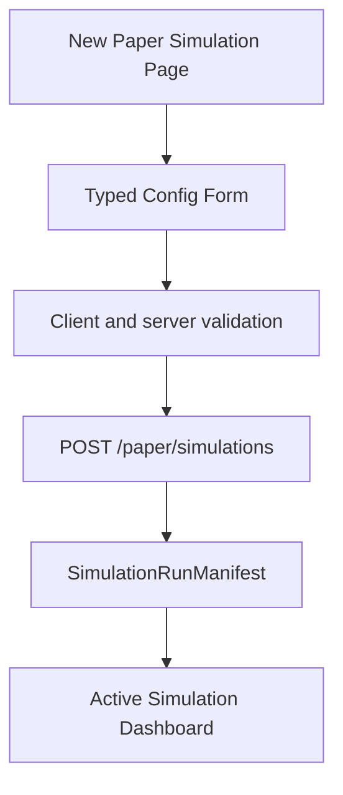
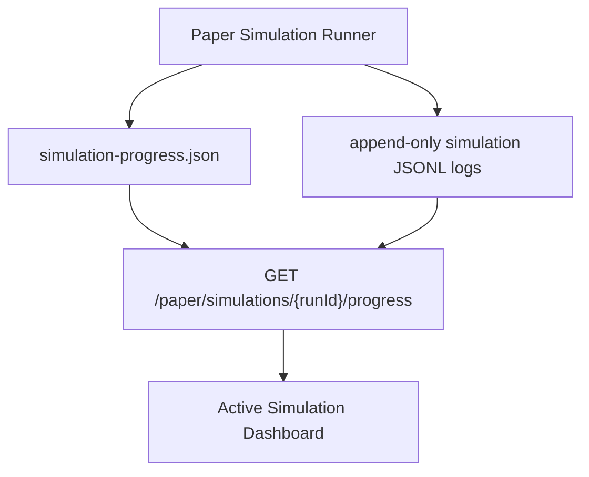
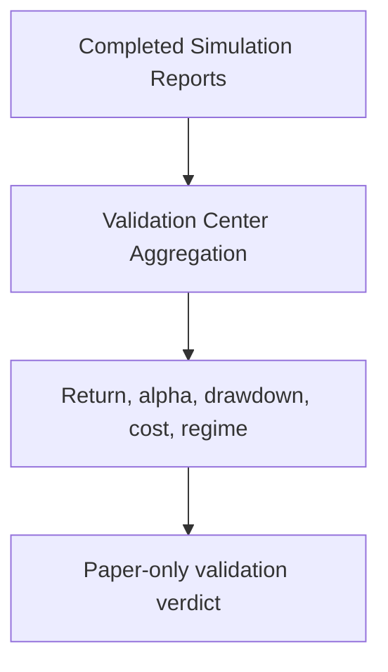

# Paper Simulation Dashboard Plan

## 목적

이 문서는 현재 CLI 실행 결과를 보여주는 dashboard를, paper-only 알고리즘 검증 제품으로 확장하기 위한 기획과 구현 순서를 정리한다.

핵심 목표는 실투자 실행이 아니다. Toss Securities Open API 신청이 통과되어도, 현재 단계에서는 실계좌 주문을 만들지 않고 알고리즘이 투자할 가치가 있는지 paper-only simulation으로 검증한다.

## 현재 상태

현재 dashboard는 `npm run historical:*` 또는 `npm run paper:*` CLI가 만든 artifact를 Local Operations API가 read-only로 읽고, 정적 dashboard가 이를 표시하는 구조다.

현재 구조의 장점:

- dashboard가 replay를 직접 실행하지 않는다.
- Local Operations API는 `GET`/`HEAD`만 허용한다.
- 저장된 artifact를 읽기만 하므로 live trading surface와 분리되어 있다.

현재 구조의 한계:

- 사용자가 dashboard에서 simulation 조건을 선택할 수 없다.
- 현재 실행 중인 simulation을 run 단위로 관리하지 못한다.
- single replay, batch replay, current virtual portfolio, aggregate report가 제품 흐름으로 연결되어 있지 않다.
- 지난 simulation 조건과 결과를 비교해 "이 알고리즘을 실험할 가치가 있는가"를 판단하기 어렵다.

## 제품 방향

Dashboard는 두 개의 큰 영역으로 나눈다.

1. **Live Investment Dashboard**
   - 실제 라이브 투자 관제 화면이다.
   - 현재는 사용하지 않는다.
   - live trading이 꺼져 있음을 명확히 보여주는 read-only 상태 화면으로 둔다.

2. **Paper Simulation Dashboard**
   - 실제로 사용할 주 화면이다.
   - 사용자가 조건을 선택해 가상 투자 simulation을 만들고, 실행 중 상태를 보고, 지난 simulation portfolio와 검증 리포트를 비교한다.

## 절대 안전 경계

모든 phase는 아래 원칙을 유지해야 한다.

- `TRADING_ENABLED=false` 기본값 유지
- `BROKER_PROVIDER=mock` 기본값 유지
- `AI_DECISION_MODE=paper_only` 유지
- `AI_DECISION_ENABLED=false` 기본값 유지
- live `TradingSignal`, live `OrderIntent`, `OrderRouter`, official order gateway로 연결하지 않음
- `place_order` MCP enabled tool 추가 금지
- raw `codex exec` 또는 raw `tossctl` dashboard/API/MCP 실행 금지
- dashboard에서 broker order endpoint 호출 금지
- Codex CLI output은 `VirtualDecision`으로만 처리
- 모든 가상 주문은 `VirtualRiskEngine`과 `PaperOrderEngine`을 통과
- provider failure, validation reject, risk reject는 no-trade
- report와 dashboard는 투자 조언, 수익률 보장, 실계좌 성과처럼 표현하지 않음

## Information Architecture

### 1. Live Investment Dashboard

Route:

```text
/dashboard
```

역할:

- 나중에 실투자 관제 화면이 될 자리
- 현재는 live trading disabled 상태와 준비 상태만 보여준다.

표시 항목:

- `TRADING_ENABLED=false`
- `BROKER_PROVIDER=mock`
- Toss Open API auth config status
- read-only market adapter status
- read-only account snapshot status
- `LiveRiskEngine` module readiness
- live order gateway: not implemented
- `OrderRouter`: not connected
- MCP `place_order`: disabled/not exposed

금지:

- 매수/매도 버튼
- 주문 preview 실행
- live order intent 생성
- risk policy runtime 완화
- broker mutation endpoint 호출

초기 UI 성격:

- operational status board
- "실거래 준비 완료"가 아니라 "실거래 비활성 / 검증 전" 상태를 강조
- 실제 계좌번호, token, order ID 노출 없음

### 2. Paper Simulation Home

Route:

```text
/dashboard/virtual
```

역할:

- 가상 투자 실험의 시작 화면
- 최근 simulation, 실행 중 simulation, 주요 검증 지표를 한 화면에서 보여준다.

주요 영역:

- Active simulation summary
- 최근 completed simulations
- 투자 가치 검증 요약
- data coverage 상태
- Codex provider safe status
- 빠른 실행 preset

주요 CTA:

- `새 가상 투자 만들기`
- `실행 중 simulation 보기`
- `지난 결과 비교`

주의:

- CTA는 paper-only simulation만 생성한다.
- live order 또는 broker mutation으로 이어지는 CTA를 두지 않는다.

### 3. New Paper Simulation

Route:

```text
/dashboard/virtual/simulations/new
```

역할:

- 사용자가 simulation 조건을 선택한다.
- 기존 CLI argument를 UI form과 typed config로 승격한다.

입력 그룹:

| 그룹 | 필드 | 설명 |
| --- | --- | --- |
| Data source | `sourceDataDir`, universe preset/path | historical snapshot과 universe 범위 |
| Window | fixed start/end, random month, seed, window months | out-of-sample 실험 구간 |
| Market | KR, US, mixed/global | universe와 market filter |
| Capital | initial cash KRW | paper-only 초기 자본 |
| Sampling | step seconds, decision frequency, max decision calls | provider 호출 빈도 |
| AI provider | dry-run fixture, Codex paper-only | 기본은 dry-run |
| Risk profile | conservative, balanced, aggressive_paper | 기본은 conservative |
| Exit policy | take-profit, stop-loss, rebalance threshold | optional |
| Cost model | commission, slippage | 비용 차감 성과 검증 |
| Benchmark | cash only, equal-weight buy and hold, initial portfolio buy and hold | 비교 기준 |

Form validation:

- 필수 입력 누락 시 simulation 생성 불가
- 날짜 범위 역전 금지
- random window seed 비어 있음 금지
- `maxDecisionCalls`, `maxCodexCallsPerRun` 상한 필요
- Codex provider 선택 시 `AI_DECISION_MODE=paper_only`와 output schema path 확인 필요
- 실거래 관련 env 또는 flag는 form에 노출하지 않음

생성 결과:

- `SimulationRunConfig`
- `SimulationRunManifest`
- 초기 `SimulationProgress`
- dashboard는 run id를 받아 active run page로 이동

### 4. Active Simulation Dashboard

Route:

```text
/dashboard/virtual/simulations/current
/dashboard/virtual/simulations/:runId
```

역할:

- 현재 실행 중인 가상 투자 simulation을 실시간으로 확인한다.
- polling 또는 server event 기반으로 progress artifact를 읽는다.

표시 항목:

- run status: queued, running, completed, failed, canceled
- run id, created at, started at, updated at
- selected config summary
- progress percent
- current simulated time
- processed ticks / total ticks
- decision provider call count
- decision skipped count
- trade count
- risk reject count
- current virtual portfolio
- net worth curve
- drawdown curve
- recent packets
- recent decisions
- recent risk decisions
- recent virtual trades
- recent audit events
- bottleneck/performance panel

운영 control:

- `새로고침`
- `실행 취소`

`실행 취소`는 paper-only simulation job만 중단한다. 이미 기록된 virtual artifact는 삭제하지 않는다.

금지:

- live trading enable
- broker order cancel
- broker order placement
- raw process command 입력
- raw CLI argument textarea

### 5. Simulation History

Route:

```text
/dashboard/virtual/simulations
```

역할:

- 지난 simulation run 목록을 보여준다.
- 조건과 결과를 비교한다.

목록 컬럼:

- status
- run id
- run type: single replay, batch replay
- created at / completed at
- source data range
- selected market/universe
- risk profile
- AI provider mode
- final return
- benchmark alpha
- max drawdown
- turnover
- fee drag
- decision count
- trade count
- risk reject count
- data coverage status

필터:

- status
- run type
- market
- risk profile
- provider mode
- date range
- benchmark verdict

정렬:

- completed at
- total return
- benchmark alpha
- max drawdown
- cost drag

### 6. Simulation Detail

Route:

```text
/dashboard/virtual/simulations/:runId/report
```

역할:

- 한 simulation run의 portfolio, decisions, trades, risk rejects, benchmark, validation result를 자세히 확인한다.

섹션:

- Run summary
- Config snapshot
- Portfolio timeline
- Final positions
- Trades
- Decisions
- Risk rejects
- Benchmark comparison
- Cost diagnostics
- Market regime breakdown
- Warnings and data quality
- Reproducibility metadata

### 7. Validation Center

Route:

```text
/dashboard/virtual/validation
```

역할:

- "이 알고리즘이 투자할 가치가 있는가"를 판단하기 위한 검증 센터다.
- 단일 run이 아니라 여러 completed simulation sample을 집계한다.

판정 지표:

- benchmark 대비 초과수익
- max drawdown
- return volatility
- win rate
- profit factor
- turnover
- fee drag
- risk reject ratio
- provider failure ratio
- market regime별 return
- target return hit rate
- sample count
- data coverage warning
- overfitting suspicion

판정은 투자 조언이 아니다. UI copy는 "실투자 적합"이 아니라 "추가 실험 필요", "데이터 부족", "paper-only 기준 통과/미통과"처럼 표현한다.

## API Surface 계획

기존 `Local Operations API`는 read-only 조회 전용으로 유지한다. 가상 투자 실행을 dashboard에서 시작하려면 별도 surface가 필요하다.

### Local Operations API

역할:

- 저장된 artifact read-only 조회
- dashboard static asset 제공
- `GET`/`HEAD`만 허용

유지:

```text
GET /virtual/portfolio
GET /virtual/decisions
GET /virtual/trades
GET /paper/report
GET /replay/report
GET /replay/progress
GET /batch/replay/report
GET /batch/replay/runs
GET /scheduler/status
GET /source/health
GET /market/packets
GET /audit/events
```

### Paper Simulation API

역할:

- paper-only simulation job 생성, 취소, 상태 조회
- live trading surface와 별도 namespace 사용

후보 endpoint:

```text
POST /paper/simulations
GET  /paper/simulations
GET  /paper/simulations/{runId}
GET  /paper/simulations/{runId}/progress
GET  /paper/simulations/{runId}/portfolio
GET  /paper/simulations/{runId}/report
POST /paper/simulations/{runId}/cancel
```

주의:

- `POST /paper/simulations`는 typed config만 받는다.
- raw shell command, raw CLI args, raw `codex exec`, raw `tossctl`은 받지 않는다.
- handler는 allowlisted paper simulation runner만 호출한다.
- live trading env/flag를 request body로 받지 않는다.
- local-only binding을 유지한다.
- local-only binding만 mutation 보호 수단으로 간주하지 않는다.
- create/cancel 같은 state-changing route는 구현 전 mutation authorization, origin allowlist, CSRF guard를 명시적으로 갖춰야 한다.
- browser-origin request는 dashboard same-origin 또는 allowlisted origin만 허용하고, cross-origin/simple request로 simulation을 시작하거나 취소할 수 없어야 한다.
- mutation token 또는 session-scoped CSRF token은 repository에 저장하지 않고 runtime에서 발급/검증한다.
- create/cancel route는 concurrency limit, per-run resource quota, audit event 기록을 적용한다.
- 실행 artifact는 run id directory에 격리한다.

초기 구현 단계에서는 create/cancel을 바로 열지 않고, mock/disabled response와 contract를 먼저 만들 수 있다.

## Artifact Contract 계획

기존 historical replay artifact는 단일 latest run 중심이다. dashboard 제품화에는 run 단위 artifact가 필요하다.

후보 directory:

```text
paper-simulations/
└── <simulationRunId>/
    ├── simulation-run-config.json
    ├── simulation-run-manifest.json
    ├── simulation-progress.json
    ├── simulation-report.json
    ├── simulation-packets.jsonl
    ├── simulation-decisions.jsonl
    ├── simulation-risk-decisions.jsonl
    ├── simulation-trades.jsonl
    ├── simulation-portfolio-timeline.jsonl
    └── simulation-audit-events.jsonl
```

### SimulationRunConfig

역할:

- 사용자가 선택한 실행 조건의 immutable snapshot
- replay 재현성과 비교 기준

주요 필드:

- `simulationRunId`
- `mode: "paper_only"`
- `runType`
- `sourceDataDir`
- `universe`
- `window`
- `samplingPolicy`
- `decisionProvider`
- `riskProfile`
- `paperExitPolicy`
- `costModel`
- `benchmarkPolicy`
- `createdAt`

### SimulationRunManifest

역할:

- 실행 lifecycle과 artifact path catalog

주요 필드:

- `simulationRunId`
- `status`
- `createdAt`
- `startedAt`
- `updatedAt`
- `completedAt`
- `failedAt`
- `canceledAt`
- `configPath`
- `progressPath`
- `reportPath`
- `logPaths`
- `error`

### SimulationProgress

역할:

- active dashboard polling용 snapshot

기존 `historical-replay-progress.json`과 유사하지만 run id와 config summary를 포함한다.

주요 필드:

- `simulationRunId`
- `status`
- `progressRatio`
- `simulatedAt`
- `completedTickCount`
- `tickCount`
- `currentPortfolio`
- `portfolioTimeline`
- `recentEvents`
- `recentPackets`
- `recentDecisions`
- `recentRiskDecisions`
- `recentTrades`
- `performance`
- `error`

### SimulationReport

역할:

- completed/failed run의 검증 결과

주요 필드:

- `simulationRunId`
- `configSummary`
- `strategyMetrics`
- `benchmarkMetrics`
- `benchmarkComparisons`
- `riskMetrics`
- `costDiagnostics`
- `marketRegimeBreakdown`
- `targetReturnHitRates`
- `dataQuality`
- `validationVerdict`
- `warnings`
- `disclaimer`

## 사용자 흐름

### 새 simulation 생성



### 실행 중 관찰



### 검증



## 화면별 핵심 컴포넌트

### 공통 shell

- top navigation: Live, Paper Simulation, Validation
- environment status: paper-only, live disabled
- data freshness status
- refresh button

### Live Investment Dashboard

- Live disabled banner
- readiness checklist
- read-only official API status
- LiveRiskEngine readiness
- unavailable live order pipeline diagram

### Paper Simulation Home

- active run card
- quick presets
- recent runs table
- validation summary
- data coverage panel

### New Simulation

- typed form sections
- config preview JSON summary
- estimated cost/budget warning
- paper-only confirmation
- create button

### Active Simulation

- progress header
- net worth chart
- current portfolio table
- recent decision feed
- risk reject feed
- trade feed
- benchmark panel
- performance bottleneck panel

### Simulation History

- run table
- filters
- sorting
- comparison drawer

### Simulation Detail

- report summary
- config snapshot
- portfolio timeline
- decisions/trades/risk rejects
- benchmark and cost diagnostics

### Validation Center

- sample coverage
- target return hit rates
- benchmark alpha distribution
- drawdown distribution
- regime breakdown
- overfitting/data quality warnings

## Copy 원칙

허용 표현:

- "paper-only simulation"
- "가상 투자"
- "검증 결과"
- "benchmark 대비"
- "추가 실험 필요"
- "데이터 부족"
- "실거래 비활성"

금지 표현:

- "수익 보장"
- "매수 추천"
- "실투자 적합"
- "자동매매 시작"
- "실계좌 성과"
- "확정 수익률"

## PR 분해 계획

### PR 1. Dashboard IA and Simulation Product Spec

목표:

- 이 문서를 추가하고 기존 README/implementation plan에 연결한다.
- 코드 동작 변경 없이 page structure, API boundary, artifact contract 후보를 고정한다.

검증:

- `git diff --check`
- 금지 표현이 실제 UI copy 또는 성과 주장으로 사용되지 않았는지 확인
- 실계좌 정보, API key, token, order ID, execution data 없음 확인

제외:

- UI 구현
- API 구현
- simulation runner 구현

### PR 2. SimulationRun Artifact Contract

목표:

- `SimulationRunConfig`, `SimulationRunManifest`, `SimulationProgress`, `SimulationReport` contract와 storage path를 정의한다.
- 기존 historical replay artifact를 바로 대체하지 않고 신규 run-scoped contract를 추가한다.

검증:

- schema/unit tests
- path traversal 방어
- corrupt JSON/JSONL read behavior
- `npm run check`
- `git diff --check`

제외:

- dashboard create form
- process spawning
- live trading

### PR 3. Paper Simulation API Skeleton

목표:

- `GET /paper/simulations`, `GET /paper/simulations/{runId}`, `GET /paper/simulations/{runId}/progress` 조회 skeleton을 추가한다.
- `POST /paper/simulations`와 cancel은 disabled 또는 mock contract로 둔다.

검증:

- route tests
- method guard tests
- read-only Local Operations API와 namespace 분리 확인
- `npm run check`

제외:

- 실제 runner 시작
- raw CLI 실행
- live order

### PR 4. Dashboard Navigation Restructure

목표:

- 현재 `/dashboard`를 Live Investment Dashboard placeholder로 바꾼다.
- 기존 paper dashboard 내용을 `/dashboard/virtual` 아래로 이동한다.
- 기존 `/dashboard/virtual-replays`, `/dashboard/batch-summary` link compatibility를 유지하거나 redirect 성격의 route mapping을 둔다.

검증:

- browser E2E 확인
- 접근성 자동 검사
- 성능 지표 측정
- existing dashboard endpoint read-only 유지
- `npm run check`

제외:

- simulation create form
- API mutation

### PR 5. New Simulation Form UI

목표:

- typed simulation config form을 만든다.
- server create endpoint가 disabled/mock이면 disabled state와 config preview까지만 구현한다.

검증:

- browser E2E 확인
- form validation
- 접근성 자동 검사
- 성능 지표 측정
- `npm run check`

제외:

- 실제 runner 실행
- live trading

### PR 6. Paper Simulation Runner Binding

목표:

- typed config를 기존 historical/batch replay runner에 연결한다.
- raw CLI command가 아니라 internal runner API를 호출한다.
- active progress artifact를 run-scoped path에 기록한다.

검증:

- create/cancel API tests
- dry-run simulation smoke
- progress polling
- no live order boundary grep
- `npm run check`

제외:

- broker order adapter
- live trading

### PR 7. Active Simulation Dashboard

목표:

- active run progress, current portfolio, recent events, decisions, risk rejects, trades를 실시간으로 표시한다.

검증:

- browser E2E 확인
- running/completed/failed state rendering
- 접근성 자동 검사
- 성능 지표 측정
- `npm run check`

### PR 8. Simulation History and Validation Center

목표:

- completed runs 목록과 validation center를 구현한다.
- benchmark, drawdown, cost, regime, target return hit-rate를 비교한다.

검증:

- browser E2E 확인
- table filter/sort tests
- report aggregation tests
- 접근성 자동 검사
- 성능 지표 측정
- `npm run check`

## 완료 기준

이 계획이 완료되면 사용자는 dashboard에서 다음을 할 수 있어야 한다.

- 실투자 dashboard가 아직 비활성 상태임을 확인한다.
- 가상 투자 조건을 선택한다.
- paper-only simulation을 시작한다.
- 실행 중인 simulation을 실시간으로 관찰한다.
- 지난 simulation portfolio와 report를 다시 본다.
- 여러 simulation 결과를 비교해 알고리즘의 투자 가치 검증 근거를 본다.

완료 후에도 실계좌 주문은 여전히 불가능해야 한다.
