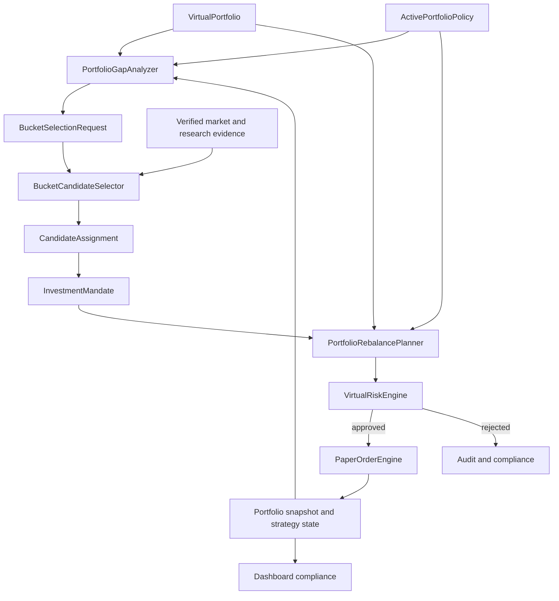

<!-- spom-source:1-2 sha256:3484de1e44828d55538af553b513decaa23fc12c6bd047d856e2c38cf0b9c8c7 -->

# 전략 포트폴리오 운용 및 버킷 기반 종목 선택 계획

<!-- /spom-source -->

## 읽기 기준

이 파일은 운용 목적·순서와 분리된 정본을 찾는 안정적인 진입점이다. 기존 heading anchor는
아래 이전 위치 안내에서 유지한다. 세부 계약과 구현 상태·이력은 각각 하나의 문서에서 관리한다.

- [policy와 lifecycle](../contracts/strategy-portfolio/policy-lifecycle.md)
- [mandate와 state](../contracts/strategy-portfolio/mandate-state.md)
- [selection·sizing·reservation](../contracts/strategy-portfolio/selection-sizing-reservation.md)
- [rebalance·Risk·fill](../contracts/strategy-portfolio/rebalance-risk-fill.md)
- [현재 main 구현과 남은 통합](../architecture/strategy-portfolio-implementation-status.md)
- [PR 1~8 단계와 API/Dashboard 계획](strategy-portfolio/implementation-stages.md)
- [검증·호환성·최종 수용 기준](strategy-portfolio/validation-and-acceptance.md)
- [과거 기준선과 구현 이력](../archive/strategy-portfolio-operating-model-history.md)
- [원문 구간·anchor·AC 대응](strategy-portfolio/source-map.md)

분리 기준은 2026-10-02 KST 확인한 `main`의 `8eede864a26143ac91a912671d7f98bd222632e0`이다.
미병합 [PR #788](https://github.com/misosiruda/toss-trading/pull/788)의 publisher-session composition은
이 기준에 포함하지 않는다. 문서 이동은 새로운 실행 권한이나 전체 운용 완료를 뜻하지 않는다.
제품 목적은 [프로젝트 개요](../architecture/project-overview.md), 미정 선택은 [Trainer MVP 제안](trainer-mvp-roadmap.md)을 함께 읽는다.

<!-- spom-source:16-30 sha256:8705c3907e3499d376a8d936055a0870501143b18116bf0469ebe508f520163b -->

## 1. 문서 목적

이 문서는 paper-only 가상 포트폴리오를 `종목 후보를 먼저 고르는 구조`에서
`포트폴리오 역할과 자금 배분을 먼저 정하고, 부족한 역할에 맞는 종목을 고르는 구조`로
전환하기 위한 제품·도메인·구현 계획을 정의한다.

핵심 결정은 다음과 같다.

> `ActivePortfolioPolicy`가 자금의 역할을 먼저 결정하고,
> `BucketCandidateSelector`는 목표 대비 부족한 strategy bucket만 채운다.

이 문서의 계획은 `BROKER_PROVIDER=mock`, `TRADING_ENABLED=false`,
`AI_DECISION_MODE=paper_only` 경계를 유지한다. 특정 종목 추천, 실계좌 변경,
live `TradingSignal`, live `OrderIntent`, broker mutation은 범위에 포함하지 않는다.

<!-- /spom-source -->

## 2. 문제 정의

[이 절의 정본으로 이동](../archive/strategy-portfolio-operating-model-history.md#spom-source-31-60)

<!-- spom-source:61-85 sha256:c2ea8a6a12e0c709387bc62d08e08f05325a331b6fe7ac19dad64dbc2eef9a40 -->

## 3. 목표와 비목표

### 3.1 목표

- 정책이 종목 선택보다 항상 먼저 평가된다.
- 하나의 shared virtual portfolio에서 여러 strategy bucket을 함께 운용한다.
- bucket별 목표·허용 비중, 회전율, 낙폭, 보유기간과 판단 주기를 강제한다.
- 종목마다 하나의 명시적인 `InvestmentMandate`를 유지한다.
- 부족한 bucket에 대해서만 candidate selection budget을 사용한다.
- 종목 선택, sizing, rebalance와 exit를 deterministic backend가 계산한다.
- Codex는 구조화된 근거를 바탕으로 후보를 설명하거나 paper-only 판단을 제안할 수
  있지만 최종 allocation과 Risk Engine을 소유하지 않는다.
- policy, mandate, selection, rebalance, risk decision, fill, portfolio snapshot을
  hash와 ID로 추적할 수 있어야 한다.
- historical replay가 동일한 policy와 evidence에서 재현 가능한 결과를 만든다.

### 3.2 비목표

- live trading 또는 실계좌 포트폴리오 변경
- 자연어에서 직접 주문을 생성하는 기능
- 근거가 없는 특정 종목 추천이나 수익률 보장
- AI가 임의로 bucket, target weight 또는 Risk Engine 결과를 확정하는 기능
- 하나의 backtest 최고 수익률만으로 정책을 자동 활성화하는 기능
- 승인되지 않은 외부 데이터나 비공식 Toss source를 live 경로에 연결하는 기능

<!-- /spom-source -->

## 4. 현재 구현 기준선

[이 절의 정본으로 이동](../archive/strategy-portfolio-operating-model-history.md#spom-source-86-126)

<!-- spom-source:127-167 sha256:1d4fa5a2afd21bdac25e4fc49fc510c9eaf9114b8966cbdbb1b7c2bb0765b71b -->

## 5. 목표 운용 모델

운용 순서는 다음으로 고정한다.

1. active policy와 현재 portfolio를 같은 시점 기준으로 읽는다.
2. mark-to-market 후 bucket, symbol, cash, market, country, currency exposure를 계산한다.
3. 목표 범위를 벗어난 bucket과 position을 찾는다.
4. 축소 또는 청산 계획을 신규 매수 계획보다 먼저 만든다.
5. bucket의 명시적인 `selectionTrigger`가 충족될 때만
   `BucketSelectionRequest`를 만든다.
6. bucket 전용 hard gate와 score로 candidate를 평가한다.
7. backend가 종목별 target range와 최대 notional을 산정한다.
8. Risk Engine이 최신 portfolio와 candidate evidence로 다시 검증한다.
9. 승인된 order만 paper fill로 반영한다.
10. policy/mandate/rebalance/risk/fill lineage를 저장하고 compliance를 다시 계산한다.

## 6. 도메인 계약

아래 contract는 구현 방향을 설명하기 위한 목표 형태다. 실제 schema 추가 시 Zod
strict schema, version, parser, migration과 negative test를 함께 작성한다.

<!-- /spom-source -->

### 6.1 `PortfolioPolicyActivationEvent`

[이 절의 정본으로 이동](../contracts/strategy-portfolio/policy-lifecycle.md#spom-source-168-590)

### 6.2 `StrategyBucketPolicy`

[이 절의 정본으로 이동](../contracts/strategy-portfolio/policy-lifecycle.md#spom-source-168-590)

### 6.3 `InvestmentMandate`

[이 절의 정본으로 이동](../contracts/strategy-portfolio/mandate-state.md#spom-source-591-1480)

### 6.4 `PositionStrategyState`

[이 절의 정본으로 이동](../contracts/strategy-portfolio/mandate-state.md#spom-source-591-1480)

### 6.5 `BucketRiskState`

[이 절의 정본으로 이동](../contracts/strategy-portfolio/mandate-state.md#spom-source-591-1480)

### 6.6 `PortfolioSizingSnapshot`, `BucketSelectionRequest`와 `CandidateAssignment`

[이 절의 정본으로 이동](../contracts/strategy-portfolio/selection-sizing-reservation.md#spom-source-1481-1870)

#### Selector mandate와 supplied assignment/set 연결

[이 절의 정본으로 이동](../contracts/strategy-portfolio/selection-sizing-reservation.md#spom-source-1481-1870)

### 6.7 `RebalancePlanRecord`와 `RebalancePlanEvent`

[이 절의 정본으로 이동](../contracts/strategy-portfolio/rebalance-risk-fill.md#spom-source-1871-2336)

## 7. Bucket별 종목 선택 정책

[이 절의 정본으로 이동](../contracts/strategy-portfolio/selection-sizing-reservation.md#spom-source-2337-2722)

### 7.1 Evidence 단계

[이 절의 정본으로 이동](../contracts/strategy-portfolio/selection-sizing-reservation.md#spom-source-2337-2722)

### 7.2 Score와 sizing 분리

[이 절의 정본으로 이동](../contracts/strategy-portfolio/selection-sizing-reservation.md#spom-source-2337-2722)

#### 초기 notional의 버전 정책과 원본 재생

[이 절의 정본으로 이동](../contracts/strategy-portfolio/selection-sizing-reservation.md#spom-source-2337-2722)

#### 초기 금액 기준 실행 비용 재계산

[이 절의 정본으로 이동](../contracts/strategy-portfolio/selection-sizing-reservation.md#spom-source-2337-2722)

#### 비용 포함 현금 상한에 맞춘 초기 금액 축소

[이 절의 정본으로 이동](../contracts/strategy-portfolio/selection-sizing-reservation.md#spom-source-2337-2722)

## 8. Portfolio gap과 리밸런싱

[이 절의 정본으로 이동](../contracts/strategy-portfolio/rebalance-risk-fill.md#spom-source-2723-3032)

### 8.1 Gap 계산

[이 절의 정본으로 이동](../contracts/strategy-portfolio/rebalance-risk-fill.md#spom-source-2723-3032)

### 8.2 결정 우선순위

[이 절의 정본으로 이동](../contracts/strategy-portfolio/rebalance-risk-fill.md#spom-source-2723-3032)

### 8.3 Idempotency와 동시성

[이 절의 정본으로 이동](../contracts/strategy-portfolio/rebalance-risk-fill.md#spom-source-2723-3032)

## 9. Multi-bucket orchestration

[이 절의 정본으로 이동](../contracts/strategy-portfolio/rebalance-risk-fill.md#spom-source-2723-3032)

## 10. Policy lifecycle과 저장 artifact

[이 절의 정본으로 이동](../contracts/strategy-portfolio/policy-lifecycle.md#spom-source-3033-3098)

## 11. API와 Dashboard 계획

[이 절의 정본으로 이동](strategy-portfolio/implementation-stages.md#spom-source-3099-3141)

### 11.1 Local Operations API

[이 절의 정본으로 이동](strategy-portfolio/implementation-stages.md#spom-source-3099-3141)

### 11.2 Dashboard

[이 절의 정본으로 이동](strategy-portfolio/implementation-stages.md#spom-source-3099-3141)

## 12. Historical replay와 검증 정책

[이 절의 정본으로 이동](strategy-portfolio/validation-and-acceptance.md#spom-source-3142-3154)

## 13. 구현 순서

[이 절의 정본으로 이동](strategy-portfolio/implementation-stages.md#spom-source-3155-3168)

### PR 1. Runtime policy contract와 activation lineage

[이 절의 정본으로 이동](strategy-portfolio/implementation-stages.md#spom-source-3155-3168)

### PR 2. Active policy 기반 portfolio compliance

[이 절의 정본으로 이동](strategy-portfolio/implementation-stages.md#spom-source-3255-3276)

### PR 3. `InvestmentMandate`와 position strategy state

[이 절의 정본으로 이동](strategy-portfolio/implementation-stages.md#spom-source-3309-3323)

### PR 4. `PortfolioGapAnalyzer`

[이 절의 정본으로 이동](strategy-portfolio/implementation-stages.md#spom-source-3915-3922)

### PR 5. Bucket candidate selector contract

[이 절의 정본으로 이동](strategy-portfolio/implementation-stages.md#spom-source-4405-4415)

#### 후보 assignment와 요청 단위 budget 결과 계약

[이 절의 정본으로 이동](../contracts/strategy-portfolio/selection-sizing-reservation.md#spom-source-4461-5616)

#### 후보 결과의 실제 원본 저장과 요청별 단일 확정

[이 절의 정본으로 이동](../contracts/strategy-portfolio/selection-sizing-reservation.md#spom-source-4461-5616)

#### 대기 action의 실제 계획 진행 이력 연결

[이 절의 정본으로 이동](../contracts/strategy-portfolio/selection-sizing-reservation.md#spom-source-4461-5616)

#### Snapshot pending 목록과 계획·잔여 gross 금액 대조

[이 절의 정본으로 이동](../contracts/strategy-portfolio/selection-sizing-reservation.md#spom-source-4461-5616)

#### Snapshot pending 계산에 사용된 체결·Risk 원본 연결

[이 절의 정본으로 이동](../contracts/strategy-portfolio/selection-sizing-reservation.md#spom-source-4461-5616)

#### Snapshot pending BUY의 실제 예약 원본 및 잔액 연결

[이 절의 정본으로 이동](../contracts/strategy-portfolio/selection-sizing-reservation.md#spom-source-4461-5616)

#### Selector opening reservation 발급 기록 계약

[이 절의 정본으로 이동](../contracts/strategy-portfolio/selection-sizing-reservation.md#spom-source-4461-5616)

#### Selector opening reservation 발급 원본 저장

[이 절의 정본으로 이동](../contracts/strategy-portfolio/selection-sizing-reservation.md#spom-source-4461-5616)

### PR 6. Rebalance preview planner

[이 절의 정본으로 이동](strategy-portfolio/implementation-stages.md#spom-source-5617-5629)

### PR 7. Shared portfolio multi-bucket paper orchestrator

[이 절의 정본으로 이동](strategy-portfolio/implementation-stages.md#spom-source-6433-6434)

### PR 8. Integrated replay와 운영 화면

[이 절의 정본으로 이동](strategy-portfolio/implementation-stages.md#spom-source-6688-6719)

### 후속 단계. Fundamental evidence source

[이 절의 정본으로 이동](strategy-portfolio/implementation-stages.md#spom-source-6688-6719)

## 14. 테스트 전략

[이 절의 정본으로 이동](strategy-portfolio/validation-and-acceptance.md#spom-source-6727-6918)

### Contract 및 invariant

[이 절의 정본으로 이동](strategy-portfolio/validation-and-acceptance.md#spom-source-6727-6918)

### Gap 및 sizing

[이 절의 정본으로 이동](strategy-portfolio/validation-and-acceptance.md#spom-source-6727-6918)

### Bucket risk state

[이 절의 정본으로 이동](strategy-portfolio/validation-and-acceptance.md#spom-source-6727-6918)

### Cadence 및 exit

[이 절의 정본으로 이동](strategy-portfolio/validation-and-acceptance.md#spom-source-6727-6918)

### 실패 및 복구

[이 절의 정본으로 이동](strategy-portfolio/validation-and-acceptance.md#spom-source-6727-6918)

### Safety

[이 절의 정본으로 이동](strategy-portfolio/validation-and-acceptance.md#spom-source-6727-6918)

## 15. 호환성과 롤백

[이 절의 정본으로 이동](strategy-portfolio/validation-and-acceptance.md#spom-source-6727-6918)

## 16. 최종 수용 기준

[이 절의 정본으로 이동](strategy-portfolio/validation-and-acceptance.md#spom-source-6727-6918)
