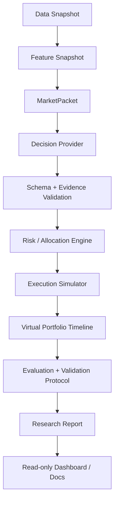

# Quant Research Paper Simulation Plan

이 문서는 `toss-trading`의 paper-only historical replay를 research-grade 검증 가능한 AI 자동투자 시뮬레이션으로 확장하기 위한 기획 문서다.

이 계획은 실거래 기능 구현 계획이 아니다. live order, live `TradingSignal`, live `OrderIntent`, broker order endpoint, raw `codex exec`, raw `tossctl` 실행 surface는 범위에 포함하지 않는다. 모든 산출물은 paper-only historical replay와 deterministic backend guardrail을 기준으로 한다.

## 목표

현재 구현은 안전한 paper-only replay runner와 기본 risk gate를 갖추고 있다. 다음 단계의 목표는 단순히 replay를 더 많이 돌리는 것이 아니라, 아래 질문에 답할 수 있는 구조를 만드는 것이다.

- 같은 전략이 여러 시장 국면에서 반복적으로 견디는가?
- prompt, risk profile, exit policy를 여러 번 바꿔서 우연히 좋은 결과만 고른 것은 아닌가?
- 단기/초단기 전략의 비용, 유동성, 체결 가정이 과소평가되지 않았는가?
- 장기, 스윙, 단기, 초단기, hedge bucket이 portfolio 전체 위험을 한쪽으로 몰지 않는가?
- AI 판단은 재현 가능한 evidence-bound proposal로 남고, sizing과 최종 승인 여부는 deterministic backend가 결정하는가?

## 비목표

- 실거래 주문 기능 추가
- 특정 종목 추천 또는 매수/매도 조언
- LLM을 execution engine으로 사용
- AI confidence를 주문 크기로 직접 연결
- Risk Engine 우회
- 수익률 보장 또는 실계좌 성과 주장
- 고빈도 실시간 매매 엔진 구현

## 현재 기준선

이미 구현된 주요 기반:

- `MarketPacket -> VirtualDecision -> validation -> normalization -> VirtualRiskEngine -> PaperOrderEngine`
- historical replay와 batch replay
- random month window, balanced regime sampling
- market regime allocation
- paper risk profile: `conservative`, `balanced`, `aggressive_paper`
- paper exit policy: take-profit, stop-loss, rebalance threshold
- research manifest와 config/data/prompt/schema/risk/cost hash
- prompt/config/risk/exit selection trial logging
- train/validation/test split role, walk-forward, embargo, Purged K-Fold, sampled CPCV/PBO-like report
- paper cost model v2, liquidity model, participation rate, partial fill/no-fill reject
- strategy bucket, portfolio exposure aggregation, sector/country/currency/unknown metadata risk gate
- regime-aware dynamic cash reserve와 hedge policy
- benchmark: cash-only, equal-weight buy-and-hold, initial portfolio hold
- metric: total return, CAGR, max drawdown, Calmar, turnover, fee drag, exposure-adjusted return, hit ratio, profit factor, tail loss, per-sample Sharpe
- universe coverage와 KR/US/ETF metadata
- read-only Local Operations API / dashboard / MCP boundary

Q1\~Q9 이후 Research Hardening milestone으로 분리된 범위:

- Sharpe confidence interval, Probabilistic Sharpe Ratio, Deflated Sharpe Ratio 계열은 RH5 contract와 구현 상태를 따른다.
- full CPCV/PBO 검증 구조는 RH6 contract와 구현 상태를 따른다.
- Triple Barrier Method와 meta-labeling은 RH7 contract와 구현 상태를 따른다.
- 날짜별 universe snapshot, delisted/suspended lifecycle, exchange calendar, FX stale rule은 RH2/RH3 contract와 구현 상태를 따른다.
- nonlinear market impact와 volatility-adjusted slippage는 RH4 contract와 구현 상태를 따른다.
- 이 항목들은 Q1\~Q9의 미완료가 아니라 [research-hardening-milestone-plan.md](research-hardening-milestone-plan.md)가 추적하는 별도 milestone 범위다.

## 설계 원칙

1. 먼저 재현성을 만든 뒤 성과 지표를 늘린다.
2. 먼저 비용과 체결 가정을 보수화한 뒤 단기/초단기 전략을 평가한다.
3. 먼저 portfolio-level exposure aggregation을 만든 뒤 hedge를 도입한다.
4. 먼저 walk-forward와 embargo를 도입한 뒤 CPCV/PBO로 확장한다.
5. AI는 direction/thesis/evidence proposal만 담당하고 sizing은 deterministic risk/allocation engine이 담당한다.
6. 모든 phase는 paper-only safety boundary를 유지한다.
7. risk, replay, schema, storage 변경은 테스트와 문서를 같이 갱신한다.

## 전체 흐름



## Milestone Q0. 안전 기준선 고정

목표:

- 새 research-grade 작업이 기존 paper-only 경계를 약화하지 않게 기준선을 명확히 한다.

범위:

- `docs/quant-research-paper-simulation-review.md`
- `docs/quant-research-paper-simulation-plan.md`
- `docs/risk-policy.md`
- `docs/historical-replay.md`
- `scripts/qualityGate.mjs` 후보

산출물:

- forbidden live capability checklist
- research feature가 live path로 연결되지 않는다는 문서 기준
- PR 전 확인 checklist

금지:

- 코드 동작 변경과 문서 기준선 작업을 섞기
- live order 관련 surface 추가

완료 기준:

- 새 기획 문서만 보고도 후속 phase의 순서와 금지선을 이해할 수 있다.
- README와 `PROJECT_STRUCTURE.md`에서 문서로 진입 가능하다.

검증:

```powershell
npm run check
git diff --check
```

## Milestone Q1. Research Manifest와 재현성 Hash

목표:

- replay 결과를 나중에 같은 조건으로 재현하고, 서로 다른 실험을 정확히 비교할 수 있게 한다.

범위:

- 신규 후보: `src/replay/replayRunManifest.ts`
- 신규 후보: `src/storage/manifestStore.ts`
- `src/workflows/historicalReplayWorkflowArtifacts.ts`
- `src/workflows/historicalBatchReplayWorkflow.ts`
- `src/storage/artifactPaths.ts`
- `src/domain/schemas.ts`
- `docs/historical-replay.md`

핵심 필드:

```json
{
  "runId": "string",
  "batchId": "string",
  "configHash": "sha256:string",
  "dataSnapshotHash": "sha256:string",
  "universeHash": "sha256:string",
  "coverageHash": "sha256:string",
  "promptHash": "sha256:string",
  "schemaHash": "sha256:string",
  "riskPolicyHash": "sha256:string",
  "costModelHash": "sha256:string",
  "executionModelVersion": "string"
}
```

구현 방향:

- hash 대상은 JSON stable stringify 기반으로 정의한다.
- hash가 없는 legacy run은 report에서 `reproducibilityStatus: "partial"`로 표시한다.
- data file 전체 hash가 비싸면 우선 manifest-level hash와 coverage hash부터 둔다.
- Q1-2 구현 기준으로 single replay는 `historical-replay-research-manifest.json`을 저장하고, batch run record는 manifest reference를 가진다.

테스트:

- 같은 config는 같은 hash를 만든다.
- config 값 하나가 바뀌면 hash가 바뀐다.
- manifest 누락은 replay 실행 실패가 아니라 report warning으로 표시한다.
- 민감 정보는 hash source나 report에 원문 저장하지 않는다.

완료 기준:

- batch run record와 per-run metadata에서 재현성 key를 확인할 수 있다.
- report가 hash 누락 여부를 표시한다.

구현 상태:

- [x] Q1-1: `replay_research_manifest.v1` schema와 stable JSON hash helper를 추가해 config/data/universe/coverage/prompt/schema/risk/cost hash를 생성한다.
- [x] Q1-2: single historical replay는 `historical-replay-research-manifest.json`을 저장하고, run metadata와 batch run record는 manifest reference를 남긴다.

## Milestone Q2. Trial Logging과 Prompt Overfitting 방어

목표:

- prompt, risk profile, exit policy, strategy config를 여러 번 바꾼 흔적을 숨기지 않고 selection bias를 추적한다.

범위:

- 신규 후보: `src/ai/decisionRunManifest.ts`
- 신규 후보: `src/replay/selectionTrialLog.ts`
- `src/ai/decisionPrompt.ts`
- `src/ai/codexCliDecisionProvider.ts`
- `src/replay/codexHistoricalDecisionProvider.ts`
- `src/workflows/historicalBatchReplayWorkflow.ts`
- `src/reports/batchReplayReport.ts`

핵심 필드:

```json
{
  "trialId": "string",
  "promptVersion": "string",
  "promptHash": "sha256:string",
  "riskProfile": "string",
  "exitPolicyHash": "sha256:string",
  "selectionMetric": "string",
  "selected": false,
  "selectedBy": null
}
```

정책:

- best run만 report하지 않는다.
- failed/rejected/no-trade run도 trial distribution에 포함한다.
- prompt sweep을 parameter sweep과 같은 overfitting risk로 취급한다.
- Q2-1 구현 기준으로 `batch-replay-selection-trials.jsonl`은 모든 batch run을 `selected=false`로 기록한다. 실제 selected trial 지정과 selection reason은 후속 PR에서 별도 명령/보고서로 추가한다.
- Q2-2 구현 기준으로 batch aggregate report는 selection trial log를 읽어 trial count, selected/unselected count, status count, prompt/config/risk/exit hash distribution을 남긴다. 이 단계는 사후 분석용이며 best trial 자동 선택이나 전략 조정은 수행하지 않는다.

테스트:

- prompt text가 바뀌면 prompt hash가 바뀐다.
- selected trial은 selection reason과 metric을 가진다.
- failed trial이 aggregate에서 사라지지 않는다.
- AI provider failure와 risk reject를 구분한다.

완료 기준:

- 어떤 prompt/config 조합을 몇 번 시도했고 무엇을 선택했는지 artifact로 추적 가능하다.

구현 상태:

- [x] Q2-1: `batch-replay-selection-trials.jsonl`을 추가해 completed/skipped/failed run을 모두 `selected=false` trial record로 남긴다.
- [x] Q2-2: batch aggregate report가 selection trial log를 읽어 trial count, selected/unselected count, status count, prompt/config/risk/exit hash distribution을 요약한다.

## Milestone Q3. Execution Cost와 Liquidity Model 고도화

목표:

- 단기/초단기 전략이 fixed bps cost와 단순 fill 때문에 과대평가되지 않게 한다.

범위:

- `src/paper/executionModel.ts`
- `src/paper/orderEngine.ts`
- 신규 후보: `src/paper/costModel.ts`
- 신규 후보: `src/paper/liquidityModel.ts`
- 신규 후보: `src/paper/fillModel.ts`
- `src/domain/schemas.ts`
- `src/reports/historicalReplayReport.ts`

1차 구현:

- spread cost
- slippage cost
- fee/tax 분리
- average volume 기반 participation rate
- partial fill
- no fill due to insufficient liquidity

2차 구현:

- volatility-adjusted slippage
- market별 spread assumption
- nonlinear market impact placeholder
- cost model versioning

Q3-1 구현 기준:

- `paper_cost_model.v1` interface를 추가해 fee/tax/slippage/fillRatio 정책을 버전 있는 cost model로 기록한다.
- `execution_simulator.v1`은 기존 단순 fill 산식을 유지하되 `costModelHash`와 report cost summary에서 비용 가정을 추적한다.
- spread/market impact/liquidity는 이번 PR에서 explicit zero/not-modeled placeholder로 남기고, 실제 participation rate, partial fill, no-fill reject는 Q3-2에서 구현한다.
- live broker order, live `TradingSignal`, live `OrderIntent`, raw execution surface는 추가하지 않는다.

Q3-2 구현 기준:

- `paper_cost_model.v2` / `execution_simulator.v2`는 기존 fee/tax/slippage 산식을 유지하면서 `conservative_when_available` liquidity model을 추가한다.
- `HistoricalMarketSnapshot.volume`은 `MarketCandidate.volume`으로 전달하고, 과거 window에서 계산한 `averageVolume`은 lookahead 없이 `MarketCandidate.averageVolume`으로 전달한다.
- `HistoricalMarketSnapshot.sector`는 `MarketCandidate.sector`로 전달한다. sector cap이 켜진 replay는 universe/collector/snapshot 경로에서 sector metadata를 공급해야 하며, 없으면 unknown metadata fail-closed 정책을 따른다.
- volume 또는 averageVolume이 있으면 `maxVolumeParticipationRate` cap을 적용한다. 기본값은 10%이며, 부족하면 partial fill 또는 no-fill reject가 발생한다.
- volume 정보가 없으면 legacy full-fill 동작을 보존하되 `liquidityStatus: "not_modeled"`로 기록한다.
- no-fill은 `VirtualTrade`를 만들지 않고 `VirtualRiskDecision.rejectCodes`에 `VIRTUAL_LIQUIDITY_STALE` 또는 `VIRTUAL_LIQUIDITY_INSUFFICIENT`를 남긴다.
- live broker order, live `TradingSignal`, live `OrderIntent`, raw execution surface는 추가하지 않는다.

예상 log:

```json
{
  "fillModel": "spread_slippage",
  "requestedNotionalKrw": 0,
  "filledNotionalKrw": 0,
  "feeKrw": 0,
  "taxKrw": 0,
  "spreadCostKrw": 0,
  "slippageCostKrw": 0,
  "impactCostKrw": 0,
  "participationRate": 0,
  "fillStatus": "filled | partial | rejected",
  "liquidityStatus": "not_modeled | sufficient | partial | rejected | stale"
}
```

테스트:

- volume 부족이면 partial fill 또는 reject된다.
- stale volume은 liquidity pass로 처리하지 않는다.
- cost model별 cost breakdown이 report에 남는다.
- volume이 없을 때 단순 fillRatio와 legacy fill behavior가 보존된다.

완료 기준:

- report에서 gross return과 cost-adjusted return을 구분할 수 있다.
- turnover가 높은 전략의 비용 민감도가 보인다.

구현 상태:

- [x] Q3-1: `paper_cost_model.v1`/execution model versioning과 cost model hash를 도입해 fee/tax/slippage/fillRatio 정책을 report와 manifest에서 추적한다.
- [x] Q3-2: `paper_cost_model.v2`/`execution_simulator.v2`와 `conservative_when_available` liquidity model을 추가해 volume participation cap, partial fill, no-fill reject, liquidity status를 기록한다.

## Milestone Q4. Strategy Bucket과 Portfolio Exposure Aggregation

목표:

- 장기, 스윙, 단기, 초단기 전략을 같은 portfolio 안에서 운용하되, 한쪽으로 쏠리지 않게 통제한다.

범위:

- `src/domain/schemas.ts`
- `src/paper/riskPolicy.ts`
- `src/paper/riskEngine.ts`
- `src/paper/riskBranches.ts`
- `src/paper/allocationPolicy.ts`
- 신규 후보: `src/paper/strategyBucketPolicy.ts`
- 신규 후보: `src/paper/portfolioExposureAggregator.ts`
- `src/reports/batchReplayReport.ts`
- `docs/risk-policy.md`

Bucket:

```text
long_term
swing
short_term
intraday
hedge
```

Aggregation 축:

- symbol
- sector
- country
- currency
- market
- asset type
- asset class
- strategy bucket
- gross exposure
- net exposure

정책:

- 같은 symbol exposure는 bucket이 달라도 합산한다.
- sector/country/currency metadata가 없으면 unknown bucket에 보수적으로 넣는다.
- sector는 paper position metadata를 우선 사용하고, 없으면 packet candidate metadata를 사용한다. historical replay candidate sector는 `HistoricalMarketSnapshot.sector`에서 온다.
- unknown exposure가 과도하면 신규 진입을 제한한다.
- bucket별 budget과 turnover를 둔다.

예상 reject code:

- `VIRTUAL_BUCKET_BUDGET_EXCEEDED`
- `VIRTUAL_BUCKET_TURNOVER_EXCEEDED`
- `VIRTUAL_SECTOR_EXPOSURE_EXCEEDED`
- `VIRTUAL_COUNTRY_EXPOSURE_EXCEEDED`
- `VIRTUAL_CURRENCY_EXPOSURE_EXCEEDED`
- `VIRTUAL_EXPOSURE_METADATA_MISSING`

테스트:

- 장기와 단기 bucket이 같은 symbol을 보유하면 exposure가 합산된다.
- sector exposure 한도 초과 시 신규 buy가 reject된다.
- unknown metadata가 많으면 보수적으로 reject된다.
- reduce-only sell은 bucket turnover 예외 정책을 따른다.

완료 기준:

- 전체 portfolio 기준으로 편중을 계산하고 risk reject를 남길 수 있다.

분할 PR:

- [x] Q4-1: `strategyBucket` schema와 paper artifact propagation을 먼저 추가한다. 이 단계에서는 `VirtualDecision` AI output에 bucket을 열지 않고, backend candidate metadata만 position/trade로 복사한다.
- [x] Q4-2: `portfolioExposureAggregator`에서 symbol, strategy bucket, asset type/class exposure를 계산하고 report에 노출한다. 이 단계는 계산 산식 고정이며 risk reject 연결은 포함하지 않는다.
- [x] Q4-3: sector/country/currency/unknown metadata limit과 bucket budget/turnover rule을 `VirtualRiskEngine`에 연결한다. country는 현재 schema의 `region`을 사용하고, currency exposure는 `currency_exposed` risk tag, `assetClass=currency`, `region=US|GLOBAL`을 기준으로 보수 판단한다.

## Milestone Q5. Regime-aware Cash Reserve와 Hedge Policy

목표:

- 현금 비중과 hedge를 시장 국면과 portfolio 위험에 따라 deterministic하게 조정한다.

범위:

- `src/analytics/marketRegimeClassifier.ts`
- `src/paper/marketRegimeAllocationPolicy.ts`
- 신규 후보: `src/paper/dynamicCashReservePolicy.ts`
- 신규 후보: `src/paper/hedgePolicy.ts`
- `src/paper/riskEngine.ts`
- `src/reports/historicalReplayReport.ts`
- `docs/market-regime-allocation.md`
- `docs/risk-policy.md`

Cash reserve 정책:

| Regime | 방향 |
| --- | --- |
| `bull` | configured floor까지 현금 비중 완화 가능 |
| `sideways` | 중립 reserve |
| `mixed` | 보수 reserve |
| `bear` | reserve 상향 |
| `insufficient_data` | 가장 보수적 reserve |
| high volatility | 방향과 무관하게 reserve 상향 |

Hedge 정책:

- hedge는 reduce-risk intent만 허용한다.
- hedge 때문에 gross leverage가 과도해지면 reject한다.
- inverse/hedge tag가 있는 ETF라도 speculative bucket으로 쓰지 않는다.
- hedge cost와 hedge failure possibility를 report에 남긴다.

예상 reject code:

- `VIRTUAL_REGIME_CASH_RESERVE_BREACHED`
- `VIRTUAL_HEDGE_NOT_REDUCE_RISK`
- `VIRTUAL_HEDGE_GROSS_EXPOSURE_EXCEEDED`
- `VIRTUAL_HEDGE_METADATA_MISSING`

테스트:

- bear regime에서 minimum cash reserve가 올라간다.
- bull regime에서도 cash floor는 0이 되지 않는다.
- hedge proposal이 net downside exposure를 줄이지 못하면 reject된다.
- hedge가 gross exposure만 키우면 reject된다.

완료 기준:

- market regime allocation과 cash reserve가 분리된 정책으로 설명된다.
- hedge가 수익 전략이 아니라 방어 정책으로 audit된다.

분할 PR:

- [x] Q5-1: `dynamicCashReservePolicy`를 추가하고 `VirtualRiskEngine` buy gate에 `VIRTUAL_REGIME_CASH_RESERVE_BREACHED`를 연결한다. Batch replay CLI는 `--dynamic-cash-reserve` opt-in으로 설정을 risk profile policy에 병합한다.
- [x] Q5-2: `hedgePolicy`를 추가하고 hedge intent가 net downside exposure를 줄이는지 deterministic하게 검증한다.
- [x] Q5-3: dynamic cash reserve와 hedge 결과를 historical replay report/audit summary에 노출한다.

## Milestone Q6. Walk-forward와 Embargo Validation Protocol

목표:

- 단일 기간 replay나 best random window 선택을 넘어, 시간 순서와 leakage 방지를 반영한 검증 protocol을 도입한다.

범위:

- 신규 후보: `src/replay/validationProtocol.ts`
- 신규 후보: `src/replay/walkForwardSplit.ts`
- 신규 후보: `src/replay/embargoPolicy.ts`
- `src/cli/historicalBatchReplay.ts`
- `src/workflows/historicalBatchReplayWorkflow.ts`
- `src/reports/batchReplayReport.ts`
- `docs/historical-replay.md`

1차 protocol:

- fixed train/validation/test date range
- walk-forward split
- embargo days
- split role 기록

예상 config:

```json
{
  "validationProtocol": "walk_forward",
  "splitRole": "validation",
  "trainStart": "2023-01-01T00:00:00+09:00",
  "trainEnd": "2024-12-31T23:59:59+09:00",
  "validationStart": "2025-01-01T00:00:00+09:00",
  "validationEnd": "2025-03-31T23:59:59+09:00",
  "embargoDurationDays": 5
}
```

테스트:

- validation/test 기간이 train selection에 쓰이지 않는다.
- embargo 기간 sample이 제외된다.
- split 생성이 seed/config로 재현된다.
- split role이 manifest와 report에 남는다.

완료 기준:

- batch 결과를 train/validation/test 역할별로 분리해 볼 수 있다.

분할 PR:

- [x] Q6-1: `walkForwardSplit` generator와 validation split schema를 추가한다. 이 단계는 deterministic split metadata 생성까지만 담당하며 batch replay 실행 선택에는 아직 연결하지 않는다.
- [x] Q6-2: `embargoPolicy`를 추가하고 split별 embargo excluded sample count summary를 계산한다. 이 단계는 policy 계산과 schema/test까지만 담당하며 batch replay manifest/report 연결은 Q6-3 범위로 남긴다.
- [x] Q6-3: batch replay `--validation-splits-path` 입력을 추가하고 manifest/run record/report에 split role metadata를 연결해 train/validation/test 결과를 분리 조회한다. 이 단계는 walk-forward assignment 기반 window 실행과 aggregate role grouping까지 담당하며 Purged K-Fold/CPCV는 Q7 범위로 남긴다.

## Milestone Q7. Purged K-Fold / CPCV / PBO 후보

목표:

- label horizon 겹침과 overfitting 확률을 더 엄격히 다룬다.

범위:

- 신규 후보: `src/replay/purgedSplit.ts`
- 신규 후보: `src/replay/combinatorialPurgedSplit.ts`
- 신규 후보: `src/analytics/backtestOverfitting.ts`
- `src/reports/batchReplayReport.ts`

전제 조건:

- Q1 manifest
- Q2 trial log
- Q6 validation protocol
- label horizon 또는 holding horizon 정의

1차 구현:

- Purged K-Fold split generator
- label horizon overlap 제거
- split별 metric matrix 저장

2차 구현:

- sampled CPCV
- PBO-like score
- strategy selection degradation report

테스트:

- Q7-1: test label horizon과 겹치는 train sample이 제거된다.
- Q7-1: embargo와 purging이 동시에 적용된다.
- Q7-2: CPCV split 수가 config와 일치한다.
- Q7-2: PBO 계산 sample이 부족하면 warning을 낸다.

완료 기준:

- strategy/prompt/risk profile 선택이 overfitting warning과 함께 보고된다.

작업 단위:

- [x] Q7-1: `purgedSplit` generator를 추가해 deterministic contiguous K-Fold split, label horizon overlap purging, post-test embargo exclusion summary를 생성한다. 이 단계는 standalone validation protocol 계산과 schema/test/docs 범위이며 batch replay manifest/report, split metric matrix, CPCV/PBO score 연결은 Q7-2 범위로 남긴다.
- [x] Q7-2: batch aggregate report에 selection trial과 validation split metadata를 join한 split별 metric matrix, sampled CPCV split count 검증, PBO-like score, strategy selection degradation warning을 연결한다. 이 단계는 사후 분석 report만 담당하며 full CPCV/PBO 수학 구현, strategy 자동 선택, replay 실행 정책 변경은 포함하지 않는다.

## Milestone Q8. Advanced Performance Metrics

목표:

- 단순 total return 대신 위험, 비용, 표본 불확실성을 함께 보는 metric을 제공한다.

범위:

- `src/analytics/paperPortfolioAnalytics.ts`
- 신규 후보: `src/analytics/sharpeStatistics.ts`
- `src/reports/historicalReplayReport.ts`
- `src/reports/batchReplayReport.ts`

Metric 후보:

- CAGR
- max drawdown 개선
- Calmar ratio
- hit ratio
- profit factor
- average win/loss
- tail loss
- exposure-adjusted return
- cost-adjusted return
- Sharpe with sample warning
- Sharpe confidence interval 후보
- Deflated Sharpe Ratio 후보

정책:

- sample이 부족하면 숫자를 억지로 만들지 않는다.
- serial correlation 가능성이 있으면 naive annualization warning을 표시한다.
- metric formula version을 report에 기록한다.

테스트:

- zero/short sample에서 NaN을 만들지 않는다.
- metric 계산이 deterministic하다.
- sample 부족 warning이 report에 나온다.
- fee/slippage/tax 포함 전후 성과가 분리된다.

완료 기준:

- report가 "수익률 하나"가 아니라 risk/cost/exposure-adjusted view를 제공한다.

구현 상태:

- [x] Q8-1: `performance_metrics.v1` helper를 추가해 historical replay report와 batch aggregate report에 hit ratio, profit factor, average win/loss, tail loss, per-sample Sharpe, CAGR, MDD, Calmar, cost-adjusted/gross return, exposure-adjusted return, sample warning을 노출한다. 이 단계는 deterministic paper-only 사후 metric이며 Sharpe confidence interval, Deflated Sharpe Ratio, dashboard 화면 연결은 포함하지 않는다.

## Milestone Q9. Research Report와 Dashboard Read-only 표시

목표:

- 연구용 검증 결과를 사람이 비교할 수 있는 report와 dashboard view로 제공한다.

범위:

- 신규 후보: `src/reports/replayResearchReport.ts`
- `src/api/localOperationsReaders.ts`
- `src/api/localOperationsSurface.ts`
- `dashboard/reportRenderers.js`
- `dashboard/portfolioRenderers.js`
- `dashboard/batchRunRenderers.js`
- `docs/ai-paper-trading-runbook.md`

Report 구획:

- run identity
- reproducibility hashes
- validation protocol
- data/universe coverage
- prompt/trial distribution
- risk/allocation policy
- execution assumptions
- cost breakdown
- exposure breakdown
- regime breakdown
- bucket breakdown
- benchmark comparison
- overfitting warning
- provider failure summary
- risk reject summary
- disclaimer

금지:

- research report 화면에 신규 replay 실행 버튼 추가
- live order, Codex execution, TossInvest execution endpoint 추가
- 투자 조언처럼 읽히는 verdict 문구 추가

테스트:

- 신규 research report 조회 API는 read-only `GET`/`HEAD`로 제한한다.
- 기존 guarded `POST /paper/simulations` Run 생성 예외를 보존하고, Q9 구현에서 global `GET`/`HEAD` only assertion으로 대체하지 않는다.
- report가 민감 정보를 mask한다.
- dashboard 일부 artifact 누락에도 가능한 값을 렌더링한다.
- report 문구가 성과 보장/종목 추천으로 읽히지 않는다.

완료 기준:

- 사용자가 batch별 연구 결과를 read-only로 비교하고, 왜 신뢰도가 낮은지까지 확인할 수 있다.

구현 상태:

- [x] Q9-1: 저장된 batch replay aggregate artifact를 `replay_research_report.v1` derived payload로 요약하고, local operations API의 read-only `GET /research/replay/report` route로 노출한다. 이 단계는 report/API contract까지만 포함하며 dashboard 전용 화면, 신규 replay 실행 버튼, live order surface는 포함하지 않는다.
- [x] Q9-2: dashboard validation 화면에 `GET /research/replay/report` 결과를 read-only 연구 리포트 패널로 표시한다. 이 단계는 저장된 artifact 기반 요약 렌더링만 담당하며 신규 replay 실행 버튼, Codex execution, TossInvest execution, live order surface는 포함하지 않는다.

## 권장 PR 분리

각 milestone은 다시 작은 PR로 쪼갠다.

권장 순서:

1. Q0 문서 기준선 - 완료
2. Q1-1 hash helper와 manifest schema - 완료
3. Q1-2 replay metadata/artifact 연결 - 완료
4. Q2-1 prompt hash와 selection trial manifest - 완료
5. Q2-2 trial log와 aggregate report 연결 - 완료
6. Q3-1 cost model interface - 완료
7. Q3-2 liquidity/partial fill - 완료
8. Q4-1 strategy bucket schema - 완료
9. Q4-2 exposure aggregator - 완료
10. Q4-3 sector/country/currency risk gate - 완료
11. Q5-1 dynamic cash reserve - 완료
12. Q5-2 hedge policy - 완료
13. Q6-1 walk-forward split - 완료
14. Q6-2 embargo - 완료
15. Q6-3 batch replay split role 연결 - 완료
16. Q7-1 purged split - 완료
17. Q7-2 PBO-like report - 완료
18. Q8-1 metric expansion - 완료
19. Q9-1 research report read-only API - 완료
20. Q9 dashboard read-only 표시 - 완료

한 PR에서 피해야 할 조합:

- schema 변경 + dashboard 대규모 UI 변경
- risk rule 변경 + metric/report 변경
- execution fill behavior 변경 + prompt 변경
- validation protocol 변경 + strategy selection 변경
- formatter/tooling 변경 + behavior change

## 운영 체크리스트

작업 전:

- [ ] `AGENTS.md` 확인
- [ ] `docs/quant-research-paper-simulation-review.md` 확인
- [ ] 관련 milestone 범위 확인
- [ ] `git status --short` 확인
- [ ] live trading surface가 필요 없는지 확인

작업 중:

- [ ] risk failure는 fail-closed
- [ ] provider failure는 no-trade
- [ ] rejected decision은 portfolio를 바꾸지 않음
- [ ] generated report는 투자 조언 문구를 포함하지 않음
- [ ] hash/log/schema 변경은 docs와 tests를 동반

작업 후:

- [ ] `npm run check`
- [ ] `git diff --check`
- [ ] 관련 smoke command 실행 가능 여부 확인
- [ ] README 또는 관련 docs 링크 필요 여부 확인
- [ ] 민감 정보 노출 여부 확인

## 우선순위 판단

Q1\~Q9는 현재 계획 기준으로 완료됐다. 기존 우선순위였던 재현성, trial logging, 비용/유동성, portfolio-level exposure aggregation, dynamic cash reserve, hedge, validation protocol, advanced metric, read-only research dashboard는 모두 paper-only 범위에서 구현된 상태다.

Q1\~Q9 이후의 연구 정밀도 강화 항목은 별도 Research Hardening milestone으로 분리됐다. Sharpe confidence interval/Deflated Sharpe Ratio, full CPCV/PBO, Triple Barrier Method, 날짜별 universe lifecycle, exchange calendar/FX stale rule, nonlinear market impact 같은 항목은 기존 Q1\~Q9 완료 여부와 분리해서 다룬다. 상세 순서와 현재 결정은 [research-hardening-milestone-plan.md](research-hardening-milestone-plan.md)를 기준으로 한다.

## 성공 기준

이 계획이 끝났다고 볼 수 있는 상태:

- 모든 replay run이 config/data/prompt/risk/cost hash로 추적된다.
- prompt/config/risk profile selection 과정이 trial log로 남는다.
- 장기/스윙/단기/초단기/hedge bucket이 portfolio-level exposure로 합산된다.
- cash reserve가 market regime과 volatility에 따라 deterministic하게 조정된다.
- execution simulator가 fee/tax/spread/slippage/liquidity/partial fill을 기록한다.
- validation protocol이 train/validation/test와 embargo를 지원한다.
- report가 benchmark, cost, exposure, regime, bucket, overfitting warning을 함께 제공한다.
- dashboard/API/MCP는 read-only boundary를 유지한다.
- 어떤 결과도 투자 조언, 성과 보장, 실계좌 성과로 표현하지 않는다.

현재 상태:

- 위 성공 기준은 Q1\~Q9 구현 범위에서 충족된 상태로 본다.
- Q1\~Q9 이후 연구 정밀도 강화 항목은 [research-hardening-milestone-plan.md](research-hardening-milestone-plan.md)의 별도 milestone 범위로 분리하며, 현재 Q1\~Q9 계획의 미완료 항목으로 계산하지 않는다.
