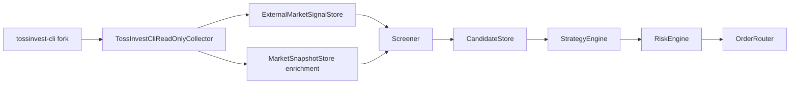

# Read-only Intelligence Sources

> Codex is not the trading engine. Codex is an MCP-based operations interface for inspecting, explaining, and safely controlling a deterministic trading backend.

## Purpose

이 문서는 공식 broker API 외부에서 얻는 보조 시장 정보를 어떻게 다룰지 정의합니다. 특히 `JungHoonGhae/tossinvest-cli` fork는 공식 API보다 넓은 시장 정보 표면을 제공할 수 있지만, 비공식 웹 내부 API 기반 도구이므로 실거래 경로에 직접 연결하지 않습니다.

이 프로젝트에서 `tossinvest-cli` fork는 production broker adapter가 아니라 optional read-only intelligence source입니다.

## Source Priority

우선순위는 다음과 같습니다.

1. `mock` provider: 개발과 테스트의 기본 provider입니다.
2. Official Toss Securities Open API: 계좌, 주문, 체결, 잔고, 공식 시세 adapter의 primary source입니다.
3. `tossinvest-cli` fork: 공식 API에 없는 시장 정보와 discovery data를 수집하는 optional non-production reference입니다.

`tossinvest-cli` 결과는 계좌, 주문, 체결, 포지션 정합성의 source of truth가 될 수 없습니다.

## Allowed Use Cases

`tossinvest-cli` fork는 다음 read-only 정보 수집에만 사용할 수 있습니다.

- market index
- market ranking
- market signals
- market screener
- market hours
- market fx
- quote get
- quote batch
- quote chart
- quote trades
- quote orderbook
- quote limits
- quote warnings
- quote flows
- quote commission
- push listen 기반 read-only event observation

수집된 정보는 `MarketSnapshotStore`, `ExternalMarketSignalStore`, `CandidateStore` enrichment에 저장할 수 있습니다. 저장 시 반드시 provenance를 남깁니다.

## Prohibited Use Cases

다음 사용은 금지합니다.

- `order place`, `order cancel`, `order amend`
- `--execute`가 포함된 command
- watchlist create, rename, delete, add, remove 같은 mutation
- `auth`, `config` 자동 변경
- Codex MCP tool에서 raw `tossctl` command 실행 노출
- `tossinvest-cli` 결과만으로 final `TradingSignal` 또는 order intent 생성
- `tossinvest-cli` 결과를 Risk Engine 우회 근거로 사용
- 계좌번호, token, cookie, order ID, execution data를 로그나 문서에 원문 저장

## Collector Boundary

권장 구조는 다음과 같습니다.



`TossInvestCliReadOnlyCollector`는 backend runtime 내부 worker입니다. Codex는 collector를 직접 실행하지 않고, 이미 저장된 normalized data만 MCP read-only tool로 조회합니다.

## Command Allowlist Policy

wrapper는 full command string을 받지 않습니다. enum 기반 command key만 받습니다.

허용 command key 예시:

- `market.index`
- `market.ranking`
- `market.signals`
- `market.screener`
- `market.hours`
- `market.fx`
- `quote.get`
- `quote.batch`
- `quote.chart`
- `quote.trades`
- `quote.orderbook`
- `quote.limits`
- `quote.warnings`
- `quote.flows`
- `quote.commission`
- `push.listen`

차단 규칙:

- command key가 allowlist에 없으면 실행하지 않습니다.
- argv에 `--execute`가 있으면 실행하지 않습니다.
- command group이 `order`, `auth`, `config`, `watchlist`, `transactions`, `account`, `portfolio`, `orders`이면 기본 차단합니다.
- output format은 가능한 경우 `json`으로 고정합니다.
- timeout, max output size, retry budget을 강제합니다.

`push.listen`은 장시간 stream이므로 별도 worker에서만 실행하고 MCP tool 호출 경로에서는 실행하지 않습니다.

## Data Contract

외부 intelligence data는 다음 metadata를 포함해야 합니다.

```json
{
  "source": "tossinvest_cli",
  "source_kind": "unofficial_read_only",
  "official": false,
  "provider_version": "v0.6.0",
  "command_key": "market.signals",
  "market": "KR",
  "symbol": "005930",
  "collected_at": "2026-06-11T09:00:00+09:00",
  "stale_after": "2026-06-11T09:03:00+09:00",
  "raw_ref": "external_snapshot_001",
  "normalized_schema_version": 1
}
```

원본 payload를 저장해야 한다면 계좌, token, cookie, order ID, execution data를 masking한 뒤 별도 raw store에 보관합니다.

## Failure Policy

- command 실패, schema mismatch, timeout은 `EXTERNAL_SOURCE_UNAVAILABLE`로 기록합니다.
- optional source 실패만으로 live order를 생성하거나 risk policy를 완화하지 않습니다.
- optional source가 stale이면 screener enrichment에서 제외합니다.
- strategy가 해당 source를 required input으로 선언했는데 source가 stale이면 signal을 만들지 않습니다.
- Risk Engine은 source freshness를 검증하고 불명확하면 fail-closed로 처리합니다.

## Fork Policy

fork를 만들 수는 있지만 우리 repository에 vendoring하지 않습니다.

- fork는 research fork로 유지합니다.
- upstream license와 copyright notice를 유지합니다.
- fork 변경은 read-only collector 안정성, schema observation, docs에 한정합니다.
- live order capability 추가나 기본 활성화 변경은 하지 않습니다.
- 우리 backend의 production adapter source of truth는 official Toss Securities Open API입니다.

## MCP Exposure Policy

Codex에 다음 형태의 raw tool을 노출하지 않습니다.

- `run_tossctl`
- `execute_tossctl`
- `place_toss_order`
- `sync_watchlist`

필요한 경우 향후 read-only normalized tool만 추가합니다.

- `get_external_market_intelligence`
- `get_external_market_signal_snapshot`
- `get_intelligence_source_status`

이 tool들은 저장된 데이터 조회만 수행하며, collector process나 external CLI를 즉시 실행하지 않습니다.
