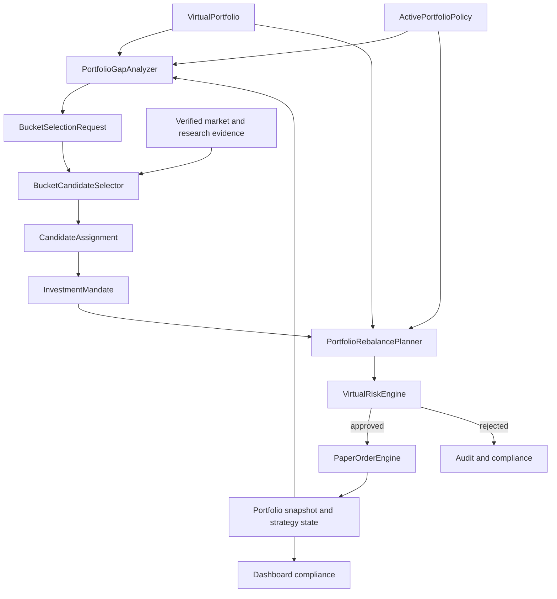

# 전략 포트폴리오 운용 및 버킷 기반 종목 선택 계획

## 1. 문서 목적

이 문서는 paper-only 가상 포트폴리오를 `종목 후보를 먼저 고르는 구조`에서
`포트폴리오 역할과 자금 배분을 먼저 정하고, 부족한 역할에 맞는 종목을 고르는 구조`로
전환하기 위한 제품·도메인·구현 계획을 정의한다.

핵심 결정은 다음과 같다.

> `ActivePortfolioPolicy`가 자금의 역할을 먼저 결정하고,
> `BucketCandidateSelector`는 목표 대비 부족한 strategy bucket만 채운다.

이 문서의 계획은 `BROKER_PROVIDER=mock`, `TRADING_ENABLED=false`,
`AI_DECISION_MODE=paper_only` 경계를 유지한다. 특정 종목 추천, 실계좌 변경,
live `TradingSignal`, live `OrderIntent`, broker mutation은 범위에 포함하지 않는다.

## 2. 문제 정의

현재 코드는 다음 기반을 이미 가지고 있다.

- `long_term`, `swing`, `short_term`, `intraday`, `hedge` strategy bucket
- strategy bucket metadata를 가진 candidate, position, trade contract
- bucket별 exposure와 turnover risk limit
- `PortfolioPolicy` draft validation과 append-only 저장
- strategy bucket별 historical replay preset과 isolated test record
- cash reserve, market regime allocation, hedge, execution cost, portfolio analytics

그러나 이 기능은 하나의 운용 루프로 연결되지 않았다.

- 저장된 `PortfolioPolicy` 중 현재 적용할 정책을 가리키는 active pointer가 없다.
- main portfolio compliance는 저장된 정책의 target을 읽지 못한다.
- 종목의 `strategyBucket`은 주로 universe manifest에 미리 지정된 metadata다.
- 같은 포트폴리오에서 bucket마다 다른 판단 주기와 exit policy를 동시에 적용하지 않는다.
- bucket 목표 비중은 있지만 종목별 역할, 목표 비중, 보유기간과 검토 주기가 없다.
- `holdingPeriodHint`는 validation metadata이며 실제 time-based exit를 강제하지 않는다.
- isolated bucket test 결과를 통합 포트폴리오 정책으로 자동 승격하지 않는다.

결과적으로 현재 시스템은 bucket별 실험은 가능하지만 다음 질문에 일관되게 답하지
못한다.

1. 현재 포트폴리오에서 어떤 역할이 부족한가?
2. 부족한 역할을 어떤 조건의 종목으로 채워야 하는가?
3. 선택된 종목은 어느 정도 비중과 기간으로 보유해야 하는가?
4. 언제 유지, 축소, 교체 또는 청산해야 하는가?
5. 여러 bucket의 판단이 충돌하면 어떤 규칙으로 해결하는가?

## 3. 목표와 비목표

### 3.1 목표

- 정책이 종목 선택보다 항상 먼저 평가된다.
- 하나의 shared virtual portfolio에서 여러 strategy bucket을 함께 운용한다.
- bucket별 목표·허용 비중, 회전율, 낙폭, 보유기간과 판단 주기를 강제한다.
- 종목마다 하나의 명시적인 `InvestmentMandate`를 유지한다.
- 부족한 bucket에 대해서만 candidate selection budget을 사용한다.
- 종목 선택, sizing, rebalance와 exit를 deterministic backend가 계산한다.
- Codex는 구조화된 근거를 바탕으로 후보를 설명하거나 paper-only 판단을 제안할 수
  있지만 최종 allocation과 Risk Engine을 소유하지 않는다.
- policy, mandate, selection, rebalance, risk decision, fill, portfolio snapshot을
  hash와 ID로 추적할 수 있어야 한다.
- historical replay가 동일한 policy와 evidence에서 재현 가능한 결과를 만든다.

### 3.2 비목표

- live trading 또는 실계좌 포트폴리오 변경
- 자연어에서 직접 주문을 생성하는 기능
- 근거가 없는 특정 종목 추천이나 수익률 보장
- AI가 임의로 bucket, target weight 또는 Risk Engine 결과를 확정하는 기능
- 하나의 backtest 최고 수익률만으로 정책을 자동 활성화하는 기능
- 승인되지 않은 외부 데이터나 비공식 Toss source를 live 경로에 연결하는 기능

## 4. 현재 구현 기준선

| 기능 | 현재 상태 | 목표 상태 |
| --- | --- | --- |
| strategy bucket schema | 구현 | 유지 |
| policy draft validation | 구현 | runtime policy contract와 통합 |
| policy append-only 저장 | 구현 | active/retired lifecycle 추가 |
| bucket target/min/max weight | draft에 구현 | 실제 compliance와 sizing에 적용 |
| bucket exposure/turnover gate | 구현, policy 입력 연결은 수동 | active policy에서 자동 파생 |
| bucket별 replay preset | 구현 | shared portfolio orchestration에 재사용 |
| 종목별 bucket | manifest metadata 중심 | deterministic assignment와 mandate로 승격 |
| 종목별 target range | 미구현 | mandate에 추가 |
| 실제 보유기간 상태 | 미구현 | position strategy state에 추가 |
| 통합 rebalance plan | 미구현 | preview와 paper execution 분리 |
| active policy 기반 dashboard | 미구현 | 동일 policy hash로 compliance 계산 |
| 여러 bucket 동시 실행 | 미구현 | cadence-aware orchestrator 추가 |

현재 dashboard policy builder의 초기 draft는 다음 비중을 사용한다. 이 값은 활성
정책이나 투자 권고가 아니라 paper simulation을 시작하기 위한 편집 가능한 예시다.

| Bucket | Target | Min | Max | Max turnover | Max drawdown | Holding hint | Selection trigger | Entry floor |
| --- | ---: | ---: | ---: | ---: | ---: | --- | --- | ---: |
| `long_term` | 35% | 20% | 50% | 15% | 18% | `multi_month` | `below_min` | - |
| `swing` | 20% | 10% | 30% | 35% | 12% | `multi_week` | `below_min` | - |
| `short_term` | 15% | 0% | 25% | 50% | 8% | `multi_day` | `entry_floor_on_due_cycle` | 5% |
| `intraday` | 10% | 0% | 15% | 100% | 4% | `intraday` | `entry_floor_on_due_cycle` | 2% |
| `hedge` | 5% | 0% | 15% | 40% | 6% | `hedge` | `entry_floor_on_due_cycle` | 2% |
| cash | 15% | - | - | - | - | dynamic regime | - | - |

`Selection trigger`와 `Entry floor` 열은 현재 builder에 구현된 값이 아니라 위 초기
비중을 runtime policy로 정규화할 때 추가할 계획 기본값이다.

Policy builder의 drawdown/turnover 값과 historical replay preset의 take-profit,
stop-loss, trailing stop 값은 현재 서로 다른 configuration source다. runtime policy를
도입할 때 두 설정을 하나의 versioned bucket policy로 통합해야 한다.

## 5. 목표 운용 모델



운용 순서는 다음으로 고정한다.

1. active policy와 현재 portfolio를 같은 시점 기준으로 읽는다.
2. mark-to-market 후 bucket, symbol, cash, market, country, currency exposure를 계산한다.
3. 목표 범위를 벗어난 bucket과 position을 찾는다.
4. 축소 또는 청산 계획을 신규 매수 계획보다 먼저 만든다.
5. bucket의 명시적인 `selectionTrigger`가 충족될 때만
   `BucketSelectionRequest`를 만든다.
6. bucket 전용 hard gate와 score로 candidate를 평가한다.
7. backend가 종목별 target range와 최대 notional을 산정한다.
8. Risk Engine이 최신 portfolio와 candidate evidence로 다시 검증한다.
9. 승인된 order만 paper fill로 반영한다.
10. policy/mandate/rebalance/risk/fill lineage를 저장하고 compliance를 다시 계산한다.

## 6. 도메인 계약

아래 contract는 구현 방향을 설명하기 위한 목표 형태다. 실제 schema 추가 시 Zod
strict schema, version, parser, migration과 negative test를 함께 작성한다.

### 6.1 `PortfolioPolicyActivationEvent`

```ts
type PortfolioPolicyActivationEvent =
  | {
      eventType: "activated";
      mode: "paper_only";
      activationId: string;
      activationEventHash: string;
      portfolioId: string;
      activationSequence: number;
      policyRecordId: string;
      policyId: string;
      policyVersion: string;
      policyHash: string;
      supersedesActivationId?: string;
      effectiveFrom: string;
      createdAt: string;
    }
  | {
      eventType: "retired";
      mode: "paper_only";
      retirementEventId: string;
      activationEventHash: string;
      portfolioId: string;
      activationSequence: number;
      retiredActivationId: string;
      reasonCode: string;
      effectiveFrom: string;
      createdAt: string;
    };
```

- policy record 자체는 immutable하게 유지한다.
- `activationId`와 `retirementEventId`는 재사용하지 않는다.
- `activationEventHash`는 variant별 event ID, hash와 `createdAt`을 제외한 complete canonical
  payload에서 계산하며 event ID는 hash에서 파생한다. resolver는 sequence fold 전에 모든
  event를 독립 rehash하고 policy tuple, supersedes/retired target, effective time 또는 reason이
  바뀐 record를 fail-closed한다. exact payload retry만 기존 event로 수렴한다.
- event는 backend가 append 시 부여한 portfolio별 연속 `activationSequence`를 가진다.
  예약·backdate를 지원하지 않으며 `effectiveFrom`은 `createdAt`과 같은 즉시 적용 시각이어야
  한다. 미래 또는 과거 effective time과 sequence gap/duplicate를 거절한다.
- 교체 activation은 현재 active ID를 `supersedesActivationId`로 지정해 한 event에서 이전
  activation을 닫고 새 policy를 연다. policy 없이 중단할 때는 `retiredActivationId`를 가진
  retirement event를 append한다.
- as-of resolver는 `effectiveFrom <= asOf`인 event만 선택한 뒤 `activationSequence` 오름차순으로
  fold하고 supersedes/retired target이 그 시점의 current active와 정확히 일치하는지
  검증한다. unknown target, 이미 닫힌 target과 분기된 transition은 fail-closed한다.
- 같은 `portfolioId`와 시점에 active policy가 0개 또는 2개 이상이면 해당 portfolio
  실행을 fail-closed한다.
- simulation run은 시작 시 policy hash를 고정하며 실행 도중 새 정책으로 바뀌지 않는다.

### 6.2 `StrategyBucketPolicy`

```ts
type TakeProfitPolicy =
  | { mode: "disabled" }
  | {
      mode: "full_exit";
      takeProfitRatio: number;
    }
  | {
      mode: "partial_then_trail";
      takeProfitRatio: number;
      takeProfitSellRatio: number;
      trailingStopFromPeakRatio: number;
    };

interface StrategyBucketExitPolicy {
  takeProfit: TakeProfitPolicy;
  stopLossRatio?: number;
  timeExpiryAction: "review_required" | "sell_all";
}

type EvidenceClass =
  | "market_technical"
  | "fundamental_quality"
  | "portfolio_fit"
  | "execution_fit";

interface EvidenceRequirement {
  evidenceClass: EvidenceClass;
  sourceContractId: string;
  maximumAgeSeconds: number;
  minimumObservationCount?: number;
}

interface BucketSelectionPolicyRecord {
  selectionPolicyRecordId: string;
  bucket: StrategyBucket;
  version: string;
  hash: string;
  requiredEvidence: EvidenceRequirement[];
  everyTickSourceRequirement?: {
    sourceContractId: string;
    eventType: "verified_market_packet";
    maximumAgeSeconds: number;
    dedupeKey: "packet_hash";
  };
  hardGateRuleIds: string[];
  scoringModelVersion: string;
  featureDefinitionRefs: string[];
  createdAt: string;
}

interface BucketSelectionPolicyRef {
  selectionPolicyRecordId: string;
  version: string;
  hash: string;
}

type CanonicalRiskParameterValue =
  | string
  | number
  | boolean
  | null
  | CanonicalRiskParameterValue[]
  | { [key: string]: CanonicalRiskParameterValue };

interface PortfolioRiskRuleParameterRecord {
  riskRuleParameterRecordId: string;
  ruleId: string;
  ruleVersion: string;
  version: string;
  hash: string;
  parameters: { [key: string]: CanonicalRiskParameterValue };
  createdAt: string;
}

interface PortfolioRiskRuleParameterRef {
  riskRuleParameterRecordId: string;
  version: string;
  hash: string;
}

interface PortfolioRiskRuleSetRecord {
  riskRuleSetRecordId: string;
  version: string;
  hash: string;
  rules: Array<{
    ruleId: string;
    ruleVersion: string;
    appliesTo: Array<"BUY" | "SELL">;
    parameterRef: PortfolioRiskRuleParameterRef;
  }>;
  createdAt: string;
}

interface PortfolioRiskRuleSetRef {
  riskRuleSetRecordId: string;
  version: string;
  hash: string;
}

interface PortfolioLegacyReduceOnlyPolicy {
  allowBuyOrIncrease: false;
  maximumParticipationRatio: number;
  riskRuleSetRef: PortfolioRiskRuleSetRef;
}

type BucketSelectionTrigger =
  | { mode: "below_min" }
  | {
      mode: "entry_floor_on_due_cycle";
      entryWeightRatio: number;
    };

interface ScheduleBoundaryRecord {
  scheduleBoundaryRecordId: string;
  market: Market;
  version: string;
  hash: string;
  timeZone: string;
  sessionCalendarRecordId: string;
  sessionCalendarVersion: string;
  sessionCalendarHash: string;
  interval: "hourly" | "daily" | "weekly";
  anchorLocalTime: string;
  weeklyAnchorDay?: "monday" | "tuesday" | "wednesday" | "thursday" | "friday";
  nonSessionDayRule: "previous_session" | "next_session";
  createdAt: string;
}

type SessionCalendarEntry =
  | {
      exchangeDate: string;
      sessionKind: "closed";
      sourceEvidenceRefs: string[];
    }
  | {
      exchangeDate: string;
      sessionKind: "regular" | "early_close" | "delayed_open";
      opensAt: string;
      closesAt: string;
      sourceEvidenceRefs: string[];
    };

interface SessionCalendarRecord {
  sessionCalendarRecordId: string;
  market: Market;
  version: string;
  hash: string;
  timeZone: string;
  validFromExchangeDate: string;
  validThroughExchangeDate: string;
  sessions: SessionCalendarEntry[];
  createdAt: string;
}

interface ScheduleBoundaryRef {
  scheduleBoundaryRecordId: string;
  version: string;
  hash: string;
}

type BucketReviewCadence =
  | { mode: "every_tick" }
  | {
      mode: "scheduled";
      boundaryRefs: ScheduleBoundaryRef[];
    };

interface BucketDrawdownSemanticsRecord {
  drawdownSemanticsRecordId: string;
  version: string;
  hash: string;
  equityBasis: "bucket_assets_plus_cash";
  unitFlowRule: "mint_burn_at_pre_flow_unit_nav";
  pnlRule: "mark_to_market_and_execution_cost_only";
  highWaterMarkRule: "max_previous_and_resulting_unit_nav";
  drawdownFormula: "one_minus_unit_nav_over_high_water_mark";
  emptyEpochRule: "preserve_nav_until_explicit_initial_or_empty_epoch";
  activationCarryRule: "carry_when_semantics_hash_matches";
  createdAt: string;
}

interface BucketDrawdownSemanticsRef {
  drawdownSemanticsRecordId: string;
  version: string;
  hash: string;
}

interface StrategyBucketPolicy {
  bucket: StrategyBucket;
  targetWeightRatio: number;
  minWeightRatio: number;
  maxWeightRatio: number;
  maxTurnoverRatio: number;
  turnoverWindow: {
    mode: "fixed_utc";
    durationSeconds: number;
    anchor: "unix_epoch";
    denominator: "window_open_portfolio_net_worth_krw";
  };
  maxDrawdownRatio: number;
  drawdownSemanticsRef: BucketDrawdownSemanticsRef;
  reviewCadence: BucketReviewCadence;
  eventTriggers: Array<
    "regime_change" | "thesis_evidence_change"
  >;
  selectionTrigger: BucketSelectionTrigger;
  minimumHoldingSeconds?: number;
  maximumHoldingSeconds?: number;
  exitPolicy: StrategyBucketExitPolicy;
  enabledMarkets: Market[];
  enabledAssetClasses: string[];
  selectionPolicyRef: BucketSelectionPolicyRef;
  riskRuleSetRef: PortfolioRiskRuleSetRef;
}
```

- `holdingPeriodHint`를 실제 cadence와 holding boundary로 구체화한다.
- `entry_floor_on_due_cycle`은 min 값과 무관하게 `entryWeightRatio`를 필수로 가지며
  `minWeightRatio <= entryWeightRatio <= targetWeightRatio`와 양수 조건을 검증한다.
- target이 양수이고 min이 0인 bucket에 `below_min`을 지정하면 empty portfolio에서
  영구적으로 선택 불가능하므로 policy validation에서 거절한다.
- `every_tick`은 `reviewCadence.mode = every_tick`으로 표현하며 `intraday` bucket이고
  참조한 immutable selection policy에
  `everyTickSourceRequirement`가 있을 때만 허용한다.
- selection policy hash는 record ID, `hash` 자체와 `createdAt`을 제외한 전체 payload에서
  계산한다. required evidence는 evidence class/source contract, hard-gate ID와 feature ref는
  각 canonical key로 정렬하고 duplicate를 거절하며 every-tick source requirement와 scoring
  model version도 digest에 포함한다. record ID는 hash에서 파생한다.
- scheduled cadence는 대상 market별 immutable `ScheduleBoundaryRecord`를 정확히 하나씩
  참조한다. record는 IANA timezone, versioned session calendar, local anchor, interval,
  weekly anchor와 non-session-day rule을 고정한다. 누락·중복 market, hash mismatch 또는
  policy가 허용한 market과 boundary market 불일치는 activation에서 거절한다.
- `weeklyAnchorDay`는 weekly record에서만 필수이며 hourly/daily record에는 허용하지 않는다.
  `hash`는 ID, `hash` 자체와 `createdAt`을 제외한 전체 boundary payload의 canonical hash로
  검증한다.
- `SessionCalendarRecord`는 exchange date별 session을 중복 없이 정렬해 저장한다. closed
  session은 open/close를 가질 수 없고, open session은 timezone offset이 포함된
  `opensAt < closesAt`을 필수로 가진다. record hash는 ID, `hash` 자체와 `createdAt`을 제외한
  전체 payload를 묶고 각 entry는 provenance ref를 가져야 한다.
- valid range의 모든 calendar date는 open 또는 closed entry를 정확히 하나 가져야 하며
  provenance ref는 검증된 official calendar evidence/publication으로 resolve되어야 한다.
- boundary resolver는 exact session calendar ID/version/hash를 읽고 market/timezone 일치와
  requested slot의 date coverage를 검증한다. record가 missing/corrupt하거나 date gap이 있으면
  policy activation과 due-cycle 생성을 fail-closed한다.
- `enabledMarkets`는 비어 있지 않은 canonical unique set이어야 한다. scheduled cadence의
  resolved boundary market 집합은 `enabledMarkets`와 정확히 같아야 하고 `every_tick` packet,
  selection request, mandate 및 rebalance action의 market도 이 집합 안에 있어야 한다.
- schedule slot ID와 cutoff는 boundary record 및 session calendar로 계산한다. DST, 휴장,
  조기 종료를 구현체의 local timezone이나 처리 시각으로 추정하지 않는다.
- turnover window는 Unix epoch를 anchor로 한 고정 UTC 구간이며 duration은 양의 정수다.
  window ID는 policy와 독립적으로 portfolio/bucket/window start/end에서 파생하고 분모는 window 시작 직전
  immutable portfolio snapshot의 positive `virtualNetWorthKrw`로 고정한다. 분모를 resolve할 수
  없거나 0 이하이면 신규 fill을 fail-closed하며 중간 자금 유입으로 분모를 재설정하지 않는다.
- 같은 window 안의 policy activation은 기존 turnover event/state 누계를 그대로 이어받고 새
  policy의 `maxTurnoverRatio`를 누계에 적용한다. `turnoverWindow` duration/anchor/denominator를
  바꾸는 policy는 기존 window가 끝난 정확한 boundary에서만 activation할 수 있으며 중간
  activation은 거절한다. 정책 교체 자체로 window나 누계를 초기화할 수 없다.
- 모든 BUY/SELL fill의 absolute filled notional을 `BucketTurnoverEvent`에 append하고 선형
  predecessor, exact plan/action/fill origin, full event hash와 누계를 검증한다. state hash는
  event replay 결과와 같아야 하며 fill retry는 기존 event로 수렴한다. turnover ratio는
  `cumulativeAbsoluteFilledNotionalKrw / windowOpenPortfolioNetWorthKrw`다.
- turnover event hash는 event ID/hash/createdAt을 제외한 complete payload에서 계산하고 ID는
  hash에서 파생한다. state ID는 window identity에서 파생하며 state hash는 자기 hash를 제외한
  complete snapshot payload에서 계산한다. resolver는 event chain을 replay해 누계, ratio,
  last event와 state hash를 독립 검증한다.
- `risk_breach`는 선택 가능한 `eventTriggers` 값이 아니다. 모든 enabled bucket은 market
  mark, fill, fee, cash-flow와 risk-state update마다 cadence와 무관하게 Risk Engine에서
  재평가되며 breach는 즉시 신규 매수를 차단하고 sell-first reduce-only cycle을 만든다.
- activation과 replay 시작 시 `selectionPolicyRef`가 같은 bucket/version/hash의 immutable
  record로 resolve되어야 한다. required evidence, freshness, source contract, hard gate,
  feature와 scoring version을 구현 기본값으로 대체하지 않는다. resolver는 canonical payload를
  독립 rehash해 ID/ref/hash가 모두 일치하지 않으면 fail-closed한다.
- `riskRuleSetRef`도 같은 ID/version/hash의 immutable record로 resolve하고 rule ID 중복,
  빈 applicability와 parameter ref mismatch를 거절한다. action side에 적용되는 rule 전체가
  Risk Engine decision의 required set이며 caller가 일부 rule만 선택할 수 없다.
- risk rule set은 rule ID로 canonical sort하고 ID/createdAt/hash를 제외한 payload에서 hash를
  계산한다. BUY와 SELL 각각에 적용되는 required rule이 하나 이상이어야 하며 record는
  append-only다.
- 각 `parameterRef`는 같은 rule ID/version을 가진 immutable
  `PortfolioRiskRuleParameterRecord`로 resolve되어야 한다. parameter record hash는 ID,
  `hash`, `createdAt`을 제외한 canonical payload에서 계산하고 ID는 hash에서 파생한다.
  object key는 lexical order로 canonicalize하고 non-finite number, duplicate key와 지원하지
  않는 value type을 거절한다. Risk Engine replay와 fill 직전 재검증은 이 저장 payload의
  수치·enum·boolean만 사용하며 현재 runtime default로 누락값을 보충하지 않는다.
- `drawdownSemanticsRef`는 exact immutable `BucketDrawdownSemanticsRecord`로 resolve한다. hash는
  ID/hash/createdAt을 제외한 complete payload에서 계산하고 ID는 hash에서 파생한다. activation,
  risk-state replay와 breach evaluation은 저장된 unit flow/PnL/HWM/drawdown/empty/carry rule만
  사용하고 runtime 구현 기본값으로 대체하지 않는다. 독립 rehash 또는 version/hash가 다르면
  activation과 신규 매수를 fail-closed한다.
- active `PortfolioPolicy` canonical hash는 각 bucket의 `enabledMarkets`, complete
  `selectionPolicyRef`, `riskRuleSetRef`, `drawdownSemanticsRef`, `reviewCadence` boundary ref와
  `turnoverWindow`를 포함해
  selection/risk/schedule rule 교체가 동일 policy hash 아래에서 일어나지 않게 한다.
- root `PortfolioPolicy`는 bucket lineage가 없는 position 전용
  `PortfolioLegacyReduceOnlyPolicy`를 필수로 가지며 이 config와 rule-set ref도 policy hash에
  포함한다. 이 policy는 SELL과 exposure 축소만 허용하고 bucket을 합성하지 않는다.
- take-profit을 사용하지 않으면 `disabled`, 전량 익절은 trigger ratio가 필수인
  `full_exit`, 부분 익절은 trigger/sell/trailing ratio가 모두 필수인
  `partial_then_trail`로만 표현한다. 각 ratio의 범위도 strict validation한다.
- `maximumHoldingSeconds`가 있으면 `timeExpiryAction`을 함께 검증한다.
- holding boundary는 `minimumHoldingSeconds >= 0`, `maximumHoldingSeconds > 0`이고 둘 다
  있으면 반드시 `minimumHoldingSeconds < maximumHoldingSeconds`여야 한다. 같거나 역전된
  값은 policy validation에서 거절한다.
- `review_required`는 만료 시 신규 매수를 차단하고 검토 상태로만 전환한다.
- `sell_all`을 명시한 bucket만 만료 시 reduce-only paper sell candidate를 만들며,
  Risk Engine 재검증을 통과해야 한다.
- lifecycle, stale evidence, Risk Engine reject는 minimum holding보다 우선한다.

### 6.3 `InvestmentMandate`

```ts
type ManualCapacityReservationLineage = {
  manualCapacityReservationId: string;
  manualCapacityReservationHash: string;
  reservedMaximumNotionalKrw: number;
} &
  (
    | {
        reservationKind: "new_position";
        reservedSlotOrdinal: number;
      }
    | {
        reservationKind: "increase_existing";
        existingPositionRef: string;
      }
  );

type MandateAssignmentLineage =
  | {
      assignmentSource: "manual_policy";
      manualAuthorizationScope: "open_or_increase";
      manualAssignmentEventId: string;
      capacityReservation: ManualCapacityReservationLineage;
    }
  | {
      assignmentSource: "manual_policy";
      manualAuthorizationScope: "classify_existing_reduce_only";
      manualAssignmentEventId: string;
    }
  | {
      assignmentSource: "deterministic_selector";
      selectionRequestId: string;
      candidateAssignmentId: string;
      candidateAssignmentSetId: string;
      candidateAssignmentSetHash: string;
      selectedRank: number;
      openingCapacityReservationId: string;
      openingCapacityReservationHash: string;
      reservedSlotOrdinal: number;
      reservedMaximumNotionalKrw: number;
      scoringModelVersion: string;
      selectionScore: number;
    };

type InvestmentMandateRecord = InvestmentMandateBase & MandateAssignmentLineage;

interface InvestmentMandateEventBase {
  mandateEventId: string;
  mandateEventHash: string;
  mandateId: string;
  mandateHash: string;
  portfolioId: string;
  market: Market;
  symbol: string;
  bucket: StrategyBucket;
  policyHash: string;
  asOf: string;
  reasonCodes: string[];
  createdAt: string;
}

type InvestmentMandateEvent = InvestmentMandateEventBase &
  (
    | {
        eventType: "activated";
        previousMandateEventId?: string;
      }
    | {
        eventType: "review_required";
        previousMandateEventId: string;
      }
    | {
        eventType: "retired";
        previousMandateEventId: string;
        supersededByMandateId?: string;
      }
  );

interface InvestmentMandateBase {
  mandateId: string;
  mandateHash: string;
  portfolioId: string;
  market: Market;
  symbol: string;
  bucket: StrategyBucket;
  policyHash: string;
  asOf: string;
  targetWeightRatio: number;
  minWeightRatio: number;
  maxWeightRatio: number;
  maximumOpeningNotionalKrw: number;
  reasonCodes: string[];
  evidenceRefs: string[];
  evidenceAsOf: string;
  reviewCadence: BucketReviewCadence;
  validFrom: string;
  reviewAfter?: string;
  expiresAt?: string;
  createdAt: string;
}

interface ManualAssignmentEventBase {
  manualAssignmentEventId: string;
  manualAssignmentEventHash: string;
  portfolioId: string;
  policyHash: string;
  market: Market;
  symbol: string;
  bucket: StrategyBucket;
  asOf: string;
  selectionPolicyRecordId: string;
  selectionPolicyHash: string;
  reasonCodes: string[];
  evidenceRefs: string[];
  evidenceAsOf: string;
  evidenceValidationHash: string;
  authorizationRef: string;
  createdAt: string;
}

type ManualAssignmentEvent = ManualAssignmentEventBase &
  (
    | {
        authorizationScope: "open_or_increase";
        evidenceEligibility: "eligible";
        portfolioSnapshotId: string;
        portfolioSnapshotHash: string;
        sizingInputRecordId: string;
        minWeightRatio: number;
        targetWeightRatio: number;
        maxWeightRatio: number;
        maximumNotionalKrw: number;
        sizingInputHash: string;
        sizingOutputHash: string;
      }
    | {
        authorizationScope: "classify_existing_reduce_only";
        evidenceEligibility: "eligible" | "blocked";
        classificationMinWeightRatio: number;
        classificationTargetWeightRatio: number;
        classificationMaxWeightRatio: number;
      }
  );

interface ManualOpeningCapacityReservationRecordBase {
  manualCapacityReservationId: string;
  manualCapacityReservationHash: string;
  manualAssignmentEventId: string;
  manualAssignmentEventHash: string;
  portfolioId: string;
  policyHash: string;
  bucket: StrategyBucket;
  market: Market;
  symbol: string;
  currentPortfolioSnapshotId: string;
  currentPortfolioSnapshotHash: string;
  capacityLedgerVersion: number;
  reservedMaximumNotionalKrw: number;
  resultingReservedNotionalKrw: number;
  authorizationRef: string;
  createdAt: string;
}

type ManualOpeningCapacityReservationRecord =
  ManualOpeningCapacityReservationRecordBase &
    (
      | {
          reservationKind: "new_position";
          reservedSlotOrdinal: number;
        }
      | {
          reservationKind: "increase_existing";
          existingPositionRef: string;
        }
    );

interface BucketOpeningCapacityState {
  capacityStateId: string;
  capacityStateHash: string;
  portfolioId: string;
  policyHash: string;
  bucket: StrategyBucket;
  currentPortfolioSnapshotId: string;
  currentPortfolioSnapshotHash: string;
  capacityLedgerVersion: number;
  activePositionCount: number;
  pendingReservationCount: number;
  mandateBoundUnusedSlotCount: number;
  availableSlots: number;
  reservedOpeningNotionalKrw: number;
  remainingOpeningBudgetKrw: number;
  lastReservationRecordId?: string;
  asOf: string;
}

interface OpeningCapacityReservationEventBase {
  capacityReservationEventId: string;
  capacityReservationEventHash: string;
  reservationId: string;
  reservationHash: string;
  portfolioId: string;
  policyHash: string;
  bucket: StrategyBucket;
  remainingReservedNotionalKrw: number;
  occupiesNewPositionSlot: boolean;
  capacityLedgerVersion: number;
  asOf: string;
  createdAt: string;
}

type OpeningCapacityReservationEvent = OpeningCapacityReservationEventBase &
  (
    | {
        eventType: "reserved";
        previousCapacityReservationEventId?: never;
        reservationSource:
          | {
              sourceKind: "manual";
              manualCapacityReservationId: string;
              manualCapacityReservationHash: string;
            }
          | {
              sourceKind: "selector";
              candidateAssignmentSetId: string;
              candidateAssignmentSetHash: string;
              candidateAssignmentId: string;
              reservedSlotOrdinal: number;
            };
      }
    | {
        eventType: "bound_to_mandate";
        previousCapacityReservationEventId: string;
        mandateId: string;
        mandateHash: string;
      }
    | {
        eventType: "partially_consumed";
        previousCapacityReservationEventId: string;
        mandateId: string;
        mandateHash: string;
        fillId: string;
        paperFillRecordId: string;
        paperFillHash: string;
      }
    | {
        eventType: "consumed_by_position";
        previousCapacityReservationEventId: string;
        mandateId: string;
        mandateHash: string;
        fillId: string;
        paperFillRecordId: string;
        paperFillHash: string;
        resultingPositionRef: string;
      }
    | {
        eventType: "released";
        previousCapacityReservationEventId: string;
        releaseOrigin:
          | { originKind: "request_cancelled"; requestOrManualEventId: string }
          | {
              originKind: "mandate_terminal";
              mandateId: string;
              mandateHash: string;
              mandateEventId: string;
              mandateEventHash: string;
            };
        releaseReasonCode: string;
      }
  );
```

- 같은 `portfolioId + market + symbol`에는 하나의 active mandate만 허용한다.
- 같은 portfolio 안에서 같은 종목을 두 bucket에 중복 계상하지 않는다.
- mandate record와 event ID는 재사용하지 않는다. record 생성 직후 상태는 `proposed`이며
  status는 event chain을 fold해 `active`, `review_required`, `retired`로 파생한다.
- `mandateHash`는 mandate ID, hash와 `createdAt`을 제외한 complete record payload에서
  계산하며 reason/evidence ref를 canonical sort하고 duplicate를 거절한다. mandate ID는 이
  hash에서 파생하고 resolver는 사용 전 독립 rehash한다. `reviewAfter`, `expiresAt`, cadence,
  target range, evidence와 assignment lineage 중 하나라도 달라지면 같은 mandate로 인정하지 않는다.
- mandate event도 event ID/hash/createdAt을 제외한 complete payload로 `mandateEventHash`를
  계산하고 ID를 hash에서 파생한다. 모든 event는 exact `mandateId + mandateHash`를 보존한다.
  position strategy state는 mandate ID/hash와 current mandate event ID/hash를 함께 저장하며
  record/event/state 중 하나라도 resolve 또는 rehash되지 않으면 신규 매수를 fail-closed한다.
- 첫 activation event만 `previousMandateEventId`를 생략할 수 있다. 이후 event는 현재 chain
  head를 정확히 가리켜야 하며 unknown predecessor, duplicate ID, branch, retired 이후 전이는
  fail-closed한다.
- bucket 변경은 새 mandate record를 먼저 만들고 기존 mandate의 retirement event에
  `supersededByMandateId`를 기록한 뒤 새 mandate를 activate하는 명시적 migration이다.
- 보유 position의 bucket 변경은 `BucketMandateMigrationTransferRecord` 없이는 완료할 수 없다.
  record는 retiring/activating mandate ID/hash, source mark head, quantity, 동일 price/evidence,
  `transferEquityKrw = quantity * transferPriceKrw`와 transfer group을 full-payload hash로 묶고
  ID를 hash에서 파생한다. from/to bucket은 달라야 하며 exact position과 mandate scope를
  resolve하고 독립 재계산한다.
- migration transaction은 old mark head `bucket_transfer_out`, old bucket
  `strategy_transfer_out(sequence=0)`, new bucket `strategy_transfer_in(sequence=1)`, new mark head
  `bucket_transfer_in`, old mandate retirement, new mandate activation, position strategy-state
  변경과 resulting risk states를 모두 원자 commit한다. transfer out은 음수, in은 같은 절댓값의
  양수여서 portfolio total equity는 변하지 않는다. 각 bucket은 transfer 직전 unit NAV에서 units를
  burn/mint해 NAV와 high-water mark history를 유지한다. old head는 terminal로 닫고 new head는
  동일 quantity/price/evidence로 시작한다. partial/cross-policy/duplicate transfer와 한쪽만 보이는
  상태는 fail-closed한다.
- resolver가 같은 `portfolioId + market + symbol`에 active mandate를 2개 이상 찾으면 해당
  종목의 신규 매수를 중단한다.
- `deterministic_selector` mandate는 request, assignment, scoring model과 score를 모두
  필수로 보존한다.
- `manual_policy` mandate는 selector lineage field를 포함하지 않고
  `manualAssignmentEventId`와 event의 `authorizationScope`를 필수로 보존한다. `open_or_increase`만
  strict `new_position | increase_existing` capacity reservation lineage를 요구하고
  `classify_existing_reduce_only`에는 이를 허용하지 않는다.
  같은 transaction에서 append될 event payload를 먼저 검증하고 portfolio/policy/symbol/bucket/as-of
  scope가 mandate와 일치해야 한다.
- manual assignment event hash는 event ID/hash/createdAt을 제외한 complete variant payload에서
  계산하고 ID는 hash에서 파생한다. mandate 발급 전에 scope, evidence/validation,
  authorization, sizing 또는 classification range를 포함한 payload를 독립 rehash하며 exact
  retry만 기존 event로 수렴한다.
- manual event의 `open_or_increase`는 active bucket selection policy를 resolve해 자동
  selector와 같은 required evidence, freshness와 hard gate를 통과한 `eligible` 결과 및
  validation hash가 있을 때만 허용한다. 또한 immutable portfolio sizing snapshot과
  selector와 동일한 backend sizing algorithm에서 나온 immutable sizing input record,
  input/output hash, min/target/max range와 maximum notional을 필수로 보존한다.
  `authorizationRef`는 이 gate와 sizing을 우회할 수 없다.
- manual open/increase는 event에 저장된 과거 snapshot만 신뢰하지 않는다. event append와
  mandate activation을 묶는 transaction에서 current portfolio와 `BucketOpeningCapacityState`를
  다시 읽어 active position+pending reservation+active mandate의 unused opening reservation 수,
  current gap과 aggregate reserved notional을 재계산한다. 신규 symbol은 available slot과 remaining
  budget이 모두 양수일 때만 다음 unique slot ordinal과 `min(manual maximum, remaining budget)`을
  reserve한다. 기존 position 증가는 새 slot을 차감하지 않지만 remaining budget은 reserve한다.
- `ManualOpeningCapacityReservationRecord`는 ID/hash/createdAt을 제외한 complete payload로 hash와
  hash-derived ID를 만들며 manual event ID/hash, current snapshot, CAS ledger version, slot과
  notional 또는 existing position ref를 보존한다. manual event, reservation, mandate activation과 ledger version increment는
  한 transaction으로 commit하고 실패 시 모두 rollback한다. mandate는 reservation ID/hash와
  동일 reservation kind/slot 또는 position ref/notional을 보존하며 reservation ID는 하나의
  mandate에만 bind할 수 있다.
- `BucketOpeningCapacityState`는 selector와 manual open/increase가 함께 사용하는 bucket별 current
  ledger다. state hash는 자기 hash를 제외한 complete payload로 계산하며 resolver는 current
  portfolio와 `OpeningCapacityReservationEvent` chain을 replay해 active position, pending 및
  mandate-bound unused slot 수, available slot, reserved notional과 remaining budget을 독립
  재계산한다. snapshot/hash mismatch, version
  gap 또는 state mismatch는 신규 mandate를 fail-closed한다.
- capacity reservation event hash는 event ID/hash/createdAt을 제외한 complete strict variant
  payload에서 계산하고 ID는 hash에서 파생한다. resolver는 source assignment/manual reservation,
  mandate/event와 paper fill origin을 exact ID/hash로 resolve한 뒤 독립 rehash한다. 첫 `reserved`
  event만 predecessor를 생략하며 이후 event는 current chain head와 다음 ledger version을 정확히
  가리켜야 한다. unknown/optional origin, transition branch, version gap, terminal 이후 event,
  증가한 remaining notional과 event type에 맞지 않는 slot flag는 모두 거절한다.
- selector assignment reservation과 manual reservation은 모두 expected `capacityLedgerVersion`을
  조건으로 같은 state를 compare-and-swap한다. `(portfolioId, policyHash, bucket,
  reservedSlotOrdinal)`은 active/unconsumed 동안 unique하고 총 reserved notional은 current gap과
  maximum additional exposure budget을 넘을 수 없다. mandate activation은 reservation을
  `bound_to_mandate`로 한 번만 전환할 뿐 slot/notional을 해제하지 않는다. 신규 position의 첫
  BUY fill이 생길 때 slot reservation을 `consumed_by_position`으로 바꾸고 active position count를
  같은 transaction에서 늘려 합계 점유량을 유지한다. partial fill은 filled notional만 차감하고
  잔여 reservation은 mandate에 계속 묶는다. target 충족 또는 mandate 취소·retire 시에만 잔여를
  consume/release하며 ledger를 같은 transaction에서 갱신한다.
  충돌한 요청은 stale snapshot으로 재계산해야 하며 이전 snapshot의 별도 reservation을 만들 수 없다.
- selector mandate와 최초 `reserved` event는 ledger가 부여한 전역 `reservedSlotOrdinal`, reservation
  ID/hash와 reserved maximum notional을 직접 보존한다. resolver는 assignment set의 request-local
  `selectedRank`를 slot으로 간주하지 않고 capacity event chain에서 같은 ordinal과 reservation
  ID/hash를 독립 검증한다.
- `classify_existing_reduce_only`는 evidence가 blocked여도 기존 position 분류를 위해
  classification range를 기록할 수 있지만 신규 매수와 수량 증가는 금지한다.
- AI 문자열은 `reasonCodes`나 `evidenceRefs`를 대체할 수 없다.
- target weight는 AI 출력이 아니라 backend sizing 결과다.

### 6.4 `PositionStrategyState`

```ts
type PositionStrategyState =
  | AssignedPositionStrategyState
  | UnassignedLegacyPositionStrategyState;

interface AssignedPositionStrategyState {
  stateKind: "assigned";
  positionStrategyStateHash: string;
  portfolioId: string;
  market: Market;
  symbol: string;
  mandateId: string;
  mandateHash: string;
  lastMandateEventId: string;
  lastMandateEventHash: string;
  policyHash: string;
  openedAt: string;
  lastIncreasedAt?: string;
  lastReducedAt?: string;
  lastReviewedAt: string;
  nextReviewAt?: string;
  lastReviewedTriggerRef: string;
  peakPriceKrw: number;
  partialTakeProfitExecuted: boolean;
  thesisStatus: "intact" | "watch" | "invalidated" | "unknown";
}

interface UnassignedLegacyPositionStrategyState {
  stateKind: "unassigned_legacy";
  positionStrategyStateHash: string;
  portfolioId: string;
  market: Market;
  symbol: string;
  observedPositionRef: string;
  reasonCodes: Array<
    "missing_mandate" | "missing_policy_lineage" | "missing_opened_at"
  >;
  detectedAt: string;
  status: "review_required";
}
```

기존 replay-local trailing state를 durable strategy state로 승격한다. portfolio snapshot과
strategy state의 policy/mandate lineage가 일치하지 않으면 신규 매수를 중단한다.
- `positionStrategyStateHash`는 hash 자체를 제외한 complete variant payload에서 계산한다.
  resolver는 매 read/restart마다 strict variant를 canonicalize해 독립 rehash하고 assigned
  state의 mandate/event ID/hash를 exact resolve한다. peak, partial take-profit, holding/review
  timestamp, thesis status 또는 legacy reason 중 하나라도 digest와 다르면 해당 symbol의 신규
  action을 fail-closed하고 read-only corruption 상태로 보고한다.
legacy position에 mandate, policy hash 또는 신뢰할 수 있는 `openedAt`이 없으면 값을
추정하지 않고 `unassigned_legacy` variant로 저장한다. 이 variant에는 가상의 lineage나
holding state를 채우지 않으며, 하나라도 존재하면 해당 portfolio의 신규 매수를
fail-closed하고 read-only inspection과 Risk Engine을 통과한 reduce-only 처리만 허용한다.
scheduled cadence mandate/state는 `reviewAfter`/`nextReviewAt`을 필수로 검증한다.
`every_tick`은 두 timestamp를 생략하고 `lastReviewedTriggerRef`에 마지막 처리 market
packet hash를 저장해 다음 packet의 due 여부를 결정한다.

### 6.5 `BucketRiskState`

```ts
interface BucketRiskState {
  riskStateEpochId: string;
  portfolioId: string;
  bucket: StrategyBucket;
  policyHash: string;
  drawdownSemanticsHash: string;
  units: number;
  unitNavKrw: number;
  highWaterMarkUnitNavKrw: number;
  equityKrw: number;
  drawdownRatio: number;
  lastBucketEquityEventId: string;
  riskStateHash: string;
  asOf: string;
}

interface BucketTurnoverState {
  turnoverStateId: string;
  turnoverStateHash: string;
  portfolioId: string;
  bucket: StrategyBucket;
  lastAppliedPolicyHash: string;
  windowStartedAt: string;
  windowEndsAt: string;
  windowOpenPortfolioNetWorthKrw: number;
  cumulativeAbsoluteFilledNotionalKrw: number;
  turnoverRatio: number;
  lastTurnoverEventId?: string;
  asOf: string;
}

interface BucketTurnoverEvent {
  turnoverEventId: string;
  turnoverEventHash: string;
  previousTurnoverEventId?: string;
  turnoverStateId: string;
  portfolioId: string;
  bucket: StrategyBucket;
  policyHash: string;
  rebalancePlanId: string;
  rebalanceActionId: string;
  fillId: string;
  absoluteFilledNotionalKrw: number;
  resultingCumulativeAbsoluteFilledNotionalKrw: number;
  asOf: string;
  createdAt: string;
}

interface BucketValuationMarkRecord {
  bucketValuationMarkRecordId: string;
  valuationMarkHash: string;
  portfolioId: string;
  bucket: StrategyBucket;
  policyHash: string;
  positionInputs: Array<{
    market: Market;
    symbol: string;
    quantity: number;
    previousPositionMarkHeadId: string;
    previousPositionMarkHeadHash: string;
    previousPriceKrw: number;
    currentPriceKrw: number;
    previousPriceEvidenceRef: string;
    currentPriceEvidenceRef: string;
  }>;
  equityDeltaKrw: number;
  asOf: string;
  createdAt: string;
}

interface BucketPositionMarkHeadState {
  positionMarkHeadId: string;
  positionMarkHeadHash: string;
  portfolioId: string;
  bucket: StrategyBucket;
  market: Market;
  symbol: string;
  quantity: number;
  currentPriceKrw: number;
  currentPriceEvidenceRef: string;
  lastPositionMarkHeadEventId: string;
  lastPositionMarkHeadEventHash: string;
  lastValuationMarkRecordId?: string;
  lastValuationMarkHash?: string;
  lastPositionMutationRef?: string;
  asOf: string;
}

interface BucketMandateMigrationTransferRecord {
  migrationRecordId: string;
  migrationRecordHash: string;
  portfolioId: string;
  market: Market;
  symbol: string;
  quantity: number;
  fromBucket: StrategyBucket;
  toBucket: StrategyBucket;
  retiringMandateId: string;
  retiringMandateHash: string;
  activatingMandateId: string;
  activatingMandateHash: string;
  sourcePositionMarkHeadId: string;
  sourcePositionMarkHeadHash: string;
  transferPriceKrw: number;
  transferPriceEvidenceRef: string;
  transferEquityKrw: number;
  transferGroupId: string;
  asOf: string;
  createdAt: string;
}

interface BucketPositionMarkHeadEventBase {
  positionMarkHeadEventId: string;
  positionMarkHeadEventHash: string;
  portfolioId: string;
  bucket: StrategyBucket;
  market: Market;
  symbol: string;
  resultingQuantity: number;
  resultingPriceKrw: number;
  resultingPriceEvidenceRef: string;
  asOf: string;
  createdAt: string;
}

type BucketPositionMarkHeadEvent = BucketPositionMarkHeadEventBase &
  (
    | {
        eventType: "initialized";
        previousPositionMarkHeadEventId?: never;
        initializationOrigin:
          | {
              originKind: "position_opening_fill";
              fillId: string;
              paperFillRecordId: string;
              paperFillHash: string;
            }
          | {
              originKind: "legacy_verified_mark";
              observedPositionRef: string;
              markEvidenceRef: string;
            };
      }
    | {
        eventType: "valuation_applied";
        previousPositionMarkHeadEventId: string;
        previousPositionMarkHeadEventHash: string;
        bucketValuationMarkRecordId: string;
        valuationMarkHash: string;
        bucketEquityEventId: string;
        bucketEquityEventHash: string;
      }
    | {
        eventType: "position_mutation_applied";
        previousPositionMarkHeadEventId: string;
        previousPositionMarkHeadEventHash: string;
        mutationOrigin:
          | {
              originKind: "paper_fill";
              fillId: string;
              paperFillRecordId: string;
              paperFillHash: string;
            }
          | {
              originKind: "verified_migration";
              migrationRecordId: string;
              migrationRecordHash: string;
            };
      }
    | {
        eventType: "bucket_transfer_out";
        previousPositionMarkHeadEventId: string;
        previousPositionMarkHeadEventHash: string;
        migrationRecordId: string;
        migrationRecordHash: string;
        transferGroupId: string;
      }
    | {
        eventType: "bucket_transfer_in";
        previousPositionMarkHeadEventId?: never;
        previousPositionMarkHeadEventHash?: never;
        migrationRecordId: string;
        migrationRecordHash: string;
        transferGroupId: string;
      }
  );

type BucketEquityEvent =
  | {
      eventType: "epoch_initialized";
      bucketEquityEventId: string;
      bucketEquityEventHash: string;
      riskStateEpochId: string;
      activationId: string;
      previousRiskStateEpochId?: string;
      portfolioId: string;
      bucket: StrategyBucket;
      policyHash: string;
      drawdownSemanticsHash: string;
      initializationMode: "initial_or_empty" | "carried_forward";
      initialEquityKrw: number;
      initialUnits: number;
      initialUnitNavKrw: number;
      initialHighWaterMarkUnitNavKrw: number;
      asOf: string;
    }
  | {
      eventType: "capital_flow";
      bucketEquityEventId: string;
      bucketEquityEventHash: string;
      previousBucketEquityEventId: string;
      riskStateEpochId: string;
      portfolioId: string;
      bucket: StrategyBucket;
      policyHash: string;
      amountKrw: number;
      rebalancePlanId: string;
      rebalanceActionId: string;
      fillId: string;
      paperFillRecordId: string;
      paperFillHash: string;
      fillAccountingGroupId: string;
      fillAccountingSequence: 0 | 1;
      asOf: string;
    }
  | {
      eventType: "valuation";
      bucketEquityEventId: string;
      bucketEquityEventHash: string;
      previousBucketEquityEventId: string;
      riskStateEpochId: string;
      portfolioId: string;
      bucket: StrategyBucket;
      policyHash: string;
      equityDeltaKrw: number;
      bucketValuationMarkRecordId: string;
      valuationMarkHash: string;
      evidenceRefs: string[];
      asOf: string;
    }
  | {
      eventType: "execution_cost";
      bucketEquityEventId: string;
      bucketEquityEventHash: string;
      previousBucketEquityEventId: string;
      riskStateEpochId: string;
      portfolioId: string;
      bucket: StrategyBucket;
      policyHash: string;
      equityDeltaKrw: number;
      rebalancePlanId: string;
      rebalanceActionId: string;
      fillId: string;
      paperFillRecordId: string;
      paperFillHash: string;
      fillAccountingGroupId: string;
      fillAccountingSequence: 0 | 1;
      evidenceRefs: string[];
      asOf: string;
    }
  | {
      eventType: "strategy_transfer_out" | "strategy_transfer_in";
      bucketEquityEventId: string;
      bucketEquityEventHash: string;
      previousBucketEquityEventId: string;
      riskStateEpochId: string;
      portfolioId: string;
      bucket: StrategyBucket;
      policyHash: string;
      migrationRecordId: string;
      migrationRecordHash: string;
      transferGroupId: string;
      transferSequence: 0 | 1;
      amountKrw: number;
      asOf: string;
    };
```

- policy activation은 bucket별 새 `riskStateEpochId`를 만들고 activation ID를 직접 참조하는
  `epoch_initialized` event로 시작한다. 초기화에는 존재하지 않는 rebalance plan을 참조하지
  않는다.
- 모든 bucket equity event는 event ID와 `bucketEquityEventHash`를 제외한 complete variant
  payload에서 hash를 계산하고 ID를 hash에서 파생한다. predecessor fold 전에 event type,
  epoch/activation, amount/delta, execution/mark origin과 초기 NAV/HWM/units를 포함한 payload를
  독립 rehash하며 mismatch는 전체 epoch를 corrupt로 처리해 신규 매수를 fail-closed한다.
- 기존 bucket risk state가 있고 `drawdownSemanticsHash`가 같으면 `carried_forward`로 이전
  epoch ID, unit NAV와 high-water mark를 그대로 이어받는다. 정책의 다른 field가 바뀌어도
  drawdown history는 초기화되지 않는다.
- 최초 epoch이거나 bucket units/equity가 모두 0인 경우에만 `initial_or_empty`를 허용하고
  unit NAV/high-water mark를 1로 시작한다. exposure가 남은 상태에서 drawdown semantics
  hash가 바뀌면 activation을 거절하며 암묵적인 baseline reset은 허용하지 않는다.
- 모든 initialization에서 `initialEquityKrw >= 0`,
  `initialUnits = initialEquityKrw / initialUnitNavKrw`, high-water mark가 unit NAV 이상인지
  검증한다. 이전 epoch와 high-water mark event는 삭제하지 않는다.
- shared cash와 bucket 사이의 allocation/deallocation은 `capital_flow` event로 기록하고
  flow 직전 unit NAV에서 unit을 mint/burn한다. 따라서 자금 이동 자체는 unit NAV와
  drawdown을 바꾸지 않는다. 양수 amount는 mint, 음수 amount는 burn이며 0 amount와
  보유 unit을 초과하는 burn은 거절한다.
- `strategy_transfer_out/in`은 shared cash flow나 fill이 아니라 위 verified mandate migration
  record만 origin으로 사용한다. 같은 transfer group의 out/in 금액 합은 0이고 sequence는
  old=0, new=1이어야 하며 두 bucket event, mark-head transfer와 mandate state를 한 transaction에서
  처리한다. transfer는 각 bucket의 unit 수만 조정하고 unit NAV/HWM 또는 portfolio total equity를
  바꾸지 않는다.
- capital flow는 exact plan/action/fill origin을 resolve하고 amount가 해당 fill에서 파생된
  cash 이동과 일치해야 한다. `fillId`는 모든 bucket capital-flow event에서 unique하며
  acknowledgement-loss retry는 기존 event를 반환한다. 새 event ID로
  같은 origin을 다시 append하거나 다른 amount에 재사용하면 거절한다.
- fill accounting group ID는 portfolio/plan/action/fill에서 결정론적으로 파생한다. BUY는
  `capital_flow(sequence=0) -> execution_cost(sequence=1)`, SELL은
  `execution_cost(sequence=0) -> capital_flow(sequence=1)` 순서로 고정한다. SELL deallocation
  amount는 비용 반영 후의 net proceeds이며 post-cost unit NAV에서 units를 burn한다.
  두 event는 한 durable transaction에서 연속 append하거나 둘 다 보이지 않게 처리하고,
  순서 역전·중간 event 삽입·불완전 group·같은 origin의 다른 sequence를 거절한다.
- bucket 내부 BUY/SELL은 asset/cash 교환이므로 체결 notional 자체는 손익이 아니다.
  mark-to-market PnL과 fee/slippage만 equity와 unit NAV를 변경한다.
- `valuation.equityDeltaKrw`는 mark-to-market 결과에 따라 양수 또는 음수일 수 있다.
  valuation은 exact immutable `BucketValuationMarkRecord` ID/hash를 참조한다. mark record는
  position input을 market/symbol 순으로 canonicalize하고 duplicate를 거절하며 ID/hash/createdAt을
  제외한 payload로 hash와 hash-derived ID를 만든다. resolver는 저장된 quantity와 이전/현재
  mark evidence로 delta를 독립 재계산한다. 각 input의 previous head ID/hash, quantity, price와
  evidence는 해당 symbol의 current `BucketPositionMarkHeadState`와 정확히 같아야 하고
  `previousPriceKrw`는 그 head의 `currentPriceKrw`여야 한다. current `asOf`는 head보다 뒤여야 하며
  같은 symbol의 overlapping/discontinuous interval은 거절한다. valuation event와 모든 resulting
  position mark head CAS update는 한 transaction으로 처리한다. 같은 epoch/bucket/mark record origin의 exact retry는
  기존 event를 반환하고 새 event ID, predecessor 또는 delta로 중복 append할 수 없다.
- fill 또는 position migration으로 quantity가 바뀌면 다음 valuation 전에 exact fill/migration
  origin을 가진 position mark head update로 quantity와 price basis를 조정한다. resolver는 이전
  head와 mutation origin을 replay해 새 head를 검증하며, 임의의 이전 가격을 제시하거나 fill 이후
  오래된 head에서 valuation을 분기할 수 없다. initial/legacy position의 첫 head는 verified current
  mark evidence로 열고 그 자체로 valuation PnL을 만들지 않는다.
- paper fill mutation은 quantity를 바꾸기 전에 기존 quantity 전체를 fill record의 authenticated
  `sourcePriceKrw`/price evidence로 valuation하고 그 valuation event/head update를 먼저 원자 적용한다.
  이어지는 mutation head의 `resultingPriceKrw`와 evidence는 같은 source price/evidence여야 하며
  BUY/SELL 모두 `fillPriceKrw`로 rebase할 수 없다. spread/slippage/impact 차이는 이미
  `execution_cost`로 계상하므로 이를 mark baseline에 다시 포함하지 않는다. 신규 position은 source
  price로 initialize하고, verified migration은 previous head의 price/evidence를 그대로 보존하는
  quantity reconciliation만 허용한다. migration이 가격을 바꾸려면 별도 authenticated valuation을
  먼저 적용해야 한다. resolver는 origin fill/migration과 이 규칙으로 resulting head를 독립 재계산한다.
- position mark head event hash는 event ID/hash/createdAt을 제외한 complete strict variant
  payload에서 계산하고 ID는 hash에서 파생한다. `initialized`와 새 bucket head의
  `bucket_transfer_in`만 predecessor를 생략하며 valuation, mutation과 `bucket_transfer_out`은
  previous event ID/hash와 exact authenticated origin을 필수로 가진다. transfer-out 이후 old
  head event는 terminal이다. head
  snapshot hash는 자기 hash를 제외한 complete payload에서 계산하고 stable ID는
  portfolio/bucket/market/symbol에서 파생한다. 사용 전 event chain을 독립 rehash·replay해 resulting
  quantity/price/evidence, last origin과 snapshot hash가 모두 일치해야 하며 mismatch는 valuation과
  신규 매수를 fail-closed한다.
  `execution_cost.equityDeltaKrw`는 0 이하만 허용하고 exact `PaperFillExecutionRecord`
  ID/hash를 참조한다. resolver는 source/fill price, quantity, participation/liquidity input,
  complete execution policy와 fee/tax/spread/slippage/impact breakdown을 독립 재계산하고
  `equityDeltaKrw = -totalCostKrw`인지 검증한다. exact plan/action/fill scope가 다르거나 양수
  cost, unresolved/corrupt fill 또는 중복 origin cost event는 거절한다.
- `capital_flow`, `valuation`, `execution_cost`를 append할 때마다 resulting equity/units에서
  unit NAV를 계산한다. capital flow는 NAV/HWM을 유지하고 valuation/execution cost 후에는
  `highWaterMarkUnitNavKrw = max(previous, unitNavKrw)`,
  `drawdownRatio = 1 - unitNavKrw / highWaterMarkUnitNavKrw`로 계산한다.
- resulting risk state를 같은 transaction/event fold에서 먼저 확정한 뒤 risk breach를
  평가한다. 특히 fee/slippage만으로 drawdown limit을 넘으면 이전 snapshot 값이 아니라 새
  drawdown으로 즉시 buy 차단과 reduce-only cycle을 만든다.
- units가 0이면 마지막 unit NAV/high-water mark를 유지하며, 같은 epoch의 재진입은 그
  NAV에서 mint한다. 새 policy activation도 위 `initial_or_empty` 조건이 아니면 baseline을
  재설정할 수 없다.
- epoch의 첫 event는 반드시 predecessor가 없는 `epoch_initialized`여야 한다. 이후 event는
  `previousBucketEquityEventId`를 필수로 가지며 event ID와 predecessor를 선형 append-only로
  검증한다. current snapshot은 event replay로 재구성 가능해야 하며 event/snapshot mismatch나
  누락은 신규 매수를 fail-closed한다.
- `riskStateHash`는 hash 자체를 제외한 current state payload의 canonical digest이며 event
  replay 결과와 독립 rehash가 모두 일치해야 한다.

### 6.6 `PortfolioSizingSnapshot`, `BucketSelectionRequest`와 `CandidateAssignment`

```ts
interface PortfolioExposureSnapshot {
  virtualNetWorthKrw: number;
  cashKrw: number;
  bucketExposureKrw: Record<StrategyBucket, number>;
  symbolExposureKrw: Array<{
    market: Market;
    symbol: string;
    exposureKrw: number;
  }>;
  marketExposureKrw: Record<string, number>;
  sectorExposureKrw: Record<string, number>;
  countryExposureKrw: Record<string, number>;
  currencyExposureKrw: Record<string, number>;
  pendingBuyExposureKrw: number;
  pendingSellExposureKrw: number;
}

type PendingPortfolioActionInput = {
  planId: string;
  planHash: string;
  planEventId: string;
  planEventHash: string;
  actionId: string;
  actionExecutionTargetHash: string;
  market: Market;
  symbol: string;
  remainingNotionalKrw: number;
  asOf: string;
} &
  (
    | {
        side: "BUY";
        openingCapacityReservationId: string;
        openingCapacityReservationHash: string;
      }
    | {
        side: "SELL";
        remainingQuantity: number;
        priceEvidenceRef: string;
      }
  );

interface PortfolioSizingSnapshot {
  portfolioSnapshotId: string;
  portfolioId: string;
  portfolioVersion: string;
  policyHash: string;
  asOf: string;
  virtualPortfolio: VirtualPortfolio;
  valuationInputs: Array<
    | {
        kind: "mark_price";
        market: Market;
        symbol: string;
        priceKrw: number;
        evidenceRef: string;
        evidenceAsOf: string;
      }
    | {
        kind: "fx_rate";
        baseCurrency: string;
        quoteCurrency: "KRW";
        rate: number;
        evidenceRef: string;
        evidenceAsOf: string;
      }
  >;
  pendingActionInputs: PendingPortfolioActionInput[];
  exposureSnapshot: PortfolioExposureSnapshot;
  exposureSnapshotHash: string;
  portfolioSnapshotHash: string;
}

interface BucketSelectionRequest {
  requestId: string;
  requestHash: string;
  cycleId: string;
  triggerIdentity: string;
  triggerRef: string;
  portfolioId: string;
  portfolioSnapshotId: string;
  portfolioSnapshotHash: string;
  policyHash: string;
  asOf: string;
  bucket: StrategyBucket;
  gapBasis: "min" | "entry_floor";
  gapKrw: number;
  availableSlots: number;
  maximumAdditionalExposureKrw: number;
  evidenceCutoffAt: string;
  createdAt: string;
}

interface CandidateSizingInputRecord {
  sizingInputRecordId: string;
  requestId: string;
  portfolioId: string;
  portfolioSnapshotId: string;
  portfolioSnapshotHash: string;
  policyHash: string;
  asOf: string;
  market: Market;
  symbol: string;
  bucket: StrategyBucket;
  scoringModelVersion: string;
  sizingAlgorithmVersion: string;
  selectionScore: number;
  exposureKeys: {
    sector: string;
    country: string;
    currency: string;
    classificationEvidenceRef: string;
  };
  featureInputs: Array<{
    featureDefinitionRef: string;
    value: number | boolean | string;
    evidenceRefs: string[];
  }>;
  exposureCapInputs: {
    bucketRemainingKrw: number;
    symbolRemainingKrw: number;
    sectorRemainingKrw: number;
    countryRemainingKrw: number;
    currencyRemainingKrw: number;
    cashAvailableKrw: number;
  };
  liquidityInput: {
    averageDailyNotionalKrw: number;
    maximumParticipationRatio: number;
    maximumLiquidityNotionalKrw: number;
    evidenceRefs: string[];
  };
  executionCostInput: {
    modelVersion: string;
    side: "BUY" | "SELL";
    referenceNotionalKrw: number;
    participationRate: number;
    fillPriceRule: "current_candidate_last_price";
    feeBps: number;
    taxBps: number;
    halfSpreadBps: number;
    slippageBps: number;
    fillRatio: number;
    allowFractionalShares: boolean;
    maxVolumeParticipationRate: number;
    minLiquidityFillRatio: number;
    rejectStaleLiquidity: boolean;
    marketImpactBpsPerParticipationRate: number;
    estimatedCostKrw: number;
    evidenceRefs: string[];
  };
  sizingInputHash: string;
  createdAt: string;
}

interface CandidateAssignment {
  assignmentId: string;
  requestId: string;
  sizingInputRecordId: string;
  portfolioId: string;
  portfolioSnapshotId: string;
  portfolioSnapshotHash: string;
  policyHash: string;
  asOf: string;
  market: Market;
  symbol: string;
  bucket: StrategyBucket;
  eligibility: "eligible" | "watch" | "blocked";
  minWeightRatio: number;
  targetWeightRatio: number;
  maxWeightRatio: number;
  maximumNotionalKrw: number;
  selectionScore: number;
  reasonCodes: string[];
  evidenceRefs: string[];
  scoringModelVersion: string;
  sizingInputHash: string;
  sizingOutputHash: string;
  assignmentHash: string;
  createdAt: string;
}

interface CandidateAssignmentSetRecord {
  candidateAssignmentSetId: string;
  candidateAssignmentSetHash: string;
  requestId: string;
  requestHash: string;
  availableSlots: number;
  requestAllocationBudgetKrw: number;
  orderedAssignments: Array<{
    assignmentId: string;
    assignmentHash: string;
    eligibility: "eligible" | "watch" | "blocked";
    selectionScore: number;
    market: Market;
    symbol: string;
  }>;
  selectedAssignments: Array<{
    assignmentId: string;
    assignmentHash: string;
    selectedRank: number;
    reservedMaximumNotionalKrw: number;
  }>;
  totalReservedMaximumNotionalKrw: number;
  createdAt: string;
}
```

`watch`와 `blocked` candidate는 주문 후보가 될 수 없다. required evidence가 없거나
stale이면 높은 score가 있더라도 `eligible`로 승격하지 않는다.
`PortfolioSizingSnapshot`은 해당 시점의 paper `VirtualPortfolio`, 실제 사용한 mark/FX
값과 provenance, 계산된 exposure payload를 canonical form으로 append-only 저장한다.
symbol exposure는 raw symbol string으로 keying하지 않고 `(market, symbol)` tuple을 market,
symbol 순서로 정렬하며 duplicate tuple을 거절한다.
- `exposureSnapshotHash`는 hash field를 제외한 complete exposure payload에서 계산한다. map
  key는 lexical order, symbol exposure는 market/symbol order로 canonicalize하고 duplicate와
  non-finite number를 거절한다. resolver는 virtual portfolio와 valuation input에서 exposure를
  다시 계산해 payload와 hash가 모두 같은지 검증한다.
- `portfolioSnapshotHash`는 snapshot ID와 자기 hash를 제외하고 independently verified
  `exposureSnapshotHash`를 포함한 complete snapshot payload에서 계산하며 ID는 hash에서
  파생한다. virtual portfolio의 position/order array는 stable domain key로 정렬한다. valuation
  input은 mark를 market/symbol, FX를 base/quote currency로 정렬하고 duplicate logical identity를
  거절하며 mark는 exact `(market, symbol)` position, FX는 exact currency pair에만 적용한다.
  downstream consumer는 두 hash를
  독립 재구성하기 전에는 snapshot을 sizing 또는 risk input으로 사용하지 않는다.
- `pendingActionInputs`는 nonterminal approved/executing plan의 remaining action만 포함하고 exact
  plan/event ID/hash, execution target과 BUY reservation 또는 SELL quantity/price origin을 직접
  보존한다. resolver는 plan event chain, fill cumulative와 reservation chain을 replay해 remaining
  amount를 재계산하고 market/symbol/side 순으로 canonicalize한다. `pendingBuyExposureKrw`와
  `pendingSellExposureKrw`는 이 입력의 합으로만 파생하며 pending input이 빈 경우에만 둘 다 0일
  수 있다. unresolved/corrupt action, duplicate logical action 또는 total mismatch는 snapshot을
  sizing에 사용하지 않고 fail-closed한다.
request의 snapshot ID/hash가 이 immutable record와 일치하지 않으면 selection과 sizing을
거절한다.
- `requestHash`는 request ID/hash/createdAt을 제외한 complete payload에서 계산하고 request ID는
  hash에서 결정론적으로 파생한다. request는 cycle의 exact trigger identity/ref를 직접
  보존하며 같은 payload retry는 기존 record를 반환한다. `(cycleId, bucket)` unique key가 같은
  두 번째 payload나 같은 ID의 hash collision은 거절한다.
- selector는 sizing 전에 exact policy와 independently verified portfolio snapshot에서 current
  exposure, min/entry-floor gap, available slot, cash/exposure cap을 다시 계산한다. derived
  `gapBasis`, `gapKrw`, `availableSlots`, `maximumAdditionalExposureKrw`, cutoff와 request full
  digest가 저장값과 정확히 같지 않으면 request를 소비하지 않는다.
`CandidateSizingInputRecord`는 policy/snapshot/request scope, versioned feature value와 evidence,
exposure cap, liquidity 및 execution cost model input 전체를 canonical form으로 append-only
저장한다. `sizingInputHash`는 record ID, hash와 생성 시각을 제외한 이 전체 payload에서
계산한다. assignment는 exact record ID/hash를 직접 보존하며 record가 resolve되지 않거나
scope/hash가 다르면 생성하지 않는다.
execution cost input은 현재 `PaperExecutionPolicy`의 fill rule, fee, tax, spread, slippage,
fill/fractional/liquidity/staleness 및 market-impact parameter 전체와 side, reference notional,
participation rate를 보존한다. `estimatedCostKrw`는 이 저장값만으로 독립 재계산하며 runtime
default로 누락 parameter를 보충하지 않는다.
feature/evidence ref와 분류 metadata는 모두 resolve되어야 하며 array와 exposure key는
canonical order로 정규화한다. sizing algorithm version이 다르면 같은 input으로 취급하지 않는다.
- `sizingInputRecordId`와 `assignmentId`는 서로 다른 domain prefix와
  request/market/symbol에서 각각 결정론적으로 파생한다. exact retry는 기존 record를
  반환하고 같은 identity에 다른 sizing input hash 또는 assignment payload를 쓰는 요청은
  fail-closed한다.
`sizingOutputHash`는 계산된 min/target/max weight range와 최대 notional을 canonicalize해
만든다. selector mandate의 range는 assignment 값과 정확히 같아야 하며 input/output hash
검증을 모두 통과해야 한다. assignment의 portfolio/snapshot/policy/as-of scope는 request를
읽지 못해도 독립 검증할 수 있도록 직접 저장하고, resolve 가능한 request와도 일치해야 한다.
- `assignmentHash`는 `assignmentId`, `assignmentHash`, `createdAt`을 제외한 assignment 전체
  payload에서 계산한다. reason/evidence ref는 canonical sort하고 duplicate를 거절하며
  eligibility, score, model version, input/output hash와 range/notional을 모두 digest에 포함한다.
  append와 mandate 발급 전에 독립 rehash가 일치해야 한다.
- mandate resolver는 exact selection policy와 sizing input의 feature/evidence를 다시 읽어
  required evidence freshness 및 모든 hard gate를 deterministic하게 재평가한다. 재계산한
  `eligibility`, `selectionScore`, `reasonCodes`가 assignment와 정확히 같지 않거나 assignment가
  `eligible`이 아니면 input/output/assignment hash가 유효해도 mandate를 만들지 않는다.
- 한 request의 모든 assignment를 저장한 뒤 immutable `CandidateAssignmentSetRecord`를 한 번
  seal한다. eligible 우선, selection score 내림차순, market/symbol canonical tie-break로 전체를
  정렬하고 selected assignment는 앞의 `min(availableSlots, eligibleCount)`개와 정확히 같아야
  한다. `requestAllocationBudgetKrw = min(gapKrw, maximumAdditionalExposureKrw)`로 고정하고
  rank 순서로 각 assignment의 individual maximum과 remaining request budget 중 작은 값을
  reserve한다. 모든 positive reservation의 합은 request budget 이하여야 하며 0 reservation은
  selected list에서 제외한다. set hash는 ID/hash/createdAt을 제외한 complete payload에서 계산하고 ID는 hash에서
  파생하며 request당 두 번째 set을 거절한다.
- deterministic selector mandate는 exact set ID/hash와 selected rank를 보존한다. resolver는
  request의 verified `availableSlots`, ordered assignment hashes와 top-N을 독립 재계산하고 해당
  assignment가 selected list의 같은 rank에 있을 때만 발급한다.
  assignment의 individual cap과 set의 `reservedMaximumNotionalKrw` 중 작은 값을
  `maximumOpeningNotionalKrw`로 고정하고 request 전체 reservation 합도 다시 검증한다.
  mandate repository는
  `candidateAssignmentId`를 unique consumption key로 사용해 같은 assignment의 두 번째 mandate를
  거절한다. set의 reservation을 실제 mandate로 소비할 때 current `BucketOpeningCapacityState`를
  다시 계산하고 manual reservation과 같은 slot/notional ledger를 expected version으로
  compare-and-swap한다. set seal과 mandate activation 사이에 manual 또는 다른 selector가 용량을
  먼저 차지했으면 transaction을 rollback하고 stale request로 재평가한다.

### 6.7 `RebalancePlanRecord`와 `RebalancePlanEvent`

```ts
type RebalanceExecutionTarget =
  | {
      targetKind: "fractional_buy_notional";
      targetNotionalKrw: number;
    }
  | {
      targetKind: "fractional_sell_quantity";
      targetQuantity: number;
      referencePriceKrw: number;
      markedTargetNotionalKrw: number;
      priceEvidenceRef: string;
    }
  | {
      targetKind: "whole_share_quantity";
      targetQuantity: number;
      referencePriceKrw: number;
      plannedNotionalKrw: number;
      residualNotionalKrw: number;
      priceEvidenceRef: string;
    };

interface RebalanceActionBase {
  actionId: string;
  actionSequence: number;
  market: Market;
  symbol: string;
  executionTarget: RebalanceExecutionTarget;
  maximumNotionalKrw: number;
  reasonCodes: string[];
}

type RebalanceAction = RebalanceActionBase &
  (
    | {
        lineageKind: "mandate";
        side: "BUY" | "SELL";
        mandateId: string;
      }
    | {
        lineageKind: "unassigned_legacy_reduce_only";
        side: "SELL";
        observedPositionRef: string;
        legacyStateDetectedAt: string;
      }
  );

type RebalancePlanPredecessor =
  | {
      predecessorKind: "applied";
      predecessorPlanId: string;
      predecessorPlanHash: string;
      predecessorPlanEventId: string;
      predecessorPlanEventHash: string;
    }
  | {
      predecessorKind: "stale";
      predecessorPlanId: string;
      predecessorPlanHash: string;
      predecessorPlanEventId: string;
      predecessorPlanEventHash: string;
    };

interface RebalancePlanRecord {
  planId: string;
  cycleId: string;
  portfolioId: string;
  portfolioVersion: string;
  portfolioSnapshotHash: string;
  policyHash: string;
  evidenceCutoffAt: string;
  triggerRef: string;
  phase: "sell" | "buy";
  predecessor?: RebalancePlanPredecessor;
  actions: [RebalanceAction, ...RebalanceAction[]];
  planHash: string;
  createdAt: string;
}

interface PortfolioActionRiskDecision {
  riskDecisionId: string;
  riskDecisionHash: string;
  riskRuleSetRecordId: string;
  riskRuleSetVersion: string;
  riskRuleSetHash: string;
  planId: string;
  actionId: string;
  portfolioId: string;
  policyHash: string;
  expectedPortfolioVersion: string;
  expectedPortfolioSnapshotHash: string;
  market: Market;
  symbol: string;
  side: "BUY" | "SELL";
  riskRuleScope:
    | { scopeKind: "bucket"; bucket: StrategyBucket }
    | { scopeKind: "legacy_reduce_only"; legacyPolicyHash: string };
  actionExecutionTargetHash: string;
  turnoverAssessment:
    | {
        scopeKind: "bucket";
        turnoverStateId: string;
        turnoverStateHash: string;
        turnoverWindowOpenPortfolioNetWorthKrw: number;
        priorBucketTurnoverNotionalKrw: number;
        requestedBucketTurnoverNotionalKrw: number;
        resultingBucketTurnoverRatio: number;
      }
    | {
        scopeKind: "legacy_reduce_only";
        countedInBucketTurnover: false;
      };
  priorCumulativeFilledNotionalKrw: number;
  priorCumulativeFilledQuantity: number;
  requestedNotionalKrw: number;
  requestedQuantity: number;
  worstCaseFillNotionalKrw: number;
  approvedMaximumFillNotionalKrw: number;
  cashAssessment:
    | {
        side: "BUY";
        worstCaseNetCashDebitKrw: number;
        approvedMaximumNetCashDebitKrw: number;
      }
    | {
        side: "SELL";
        expectedMinimumNetCashCreditKrw: number;
      };
  decision: "approved" | "rejected";
  requiredRuleIds: string[];
  ruleResults: Array<{
    ruleId: string;
    result: "pass" | "fail";
    reasonCode: string;
  }>;
  riskInputHash: string;
  riskEvidenceRefs: string[];
  decidedAt: string;
}

interface PaperFillExecutionRecord {
  paperFillRecordId: string;
  paperFillHash: string;
  portfolioId: string;
  rebalancePlanId: string;
  rebalanceActionId: string;
  fillId: string;
  market: Market;
  symbol: string;
  side: "BUY" | "SELL";
  requestedNotionalKrw: number;
  requestedQuantity: number;
  quantityOverride: number | null;
  sourcePriceKrw: number;
  sourcePriceEvidence: {
    sourceContractId: string;
    evidenceRef: string;
    evidenceHash: string;
    market: Market;
    symbol: string;
    priceField: "last_price";
    observedAt: string;
  };
  averagePriceKrw: number | null;
  fillPriceKrw: number;
  quantity: number;
  filledNotionalKrw: number;
  grossAmountKrw: number;
  netAmountKrw: number;
  participationRate: number | null;
  volume: number | null;
  averageVolume: number | null;
  liquidityStale: boolean;
  fillStatus: "filled" | "partial";
  liquidityStatus: "not_modeled" | "sufficient" | "partial";
  liquidityRejectReason: null;
  fractionalShares: boolean;
  executionPolicy: {
    modelVersion: string;
    fillPriceRule: "current_candidate_last_price";
    slippageBps: number;
    feeBps: number;
    taxBps: number;
    halfSpreadBps: number;
    fillRatio: number;
    allowFractionalShares: boolean;
    maxVolumeParticipationRate: number;
    minLiquidityFillRatio: number;
    rejectStaleLiquidity: boolean;
    marketImpactBpsPerParticipationRate: number;
  };
  costBreakdown: {
    feeKrw: number;
    taxKrw: number;
    slippageKrw: number;
    spreadCostKrw: number;
    impactCostKrw: number;
    totalCostKrw: number;
  };
  evidenceRefs: string[];
  asOf: string;
  createdAt: string;
}

interface PortfolioLegacyExecutionAccountingRecord {
  legacyAccountingRecordId: string;
  legacyAccountingHash: string;
  portfolioId: string;
  observedPositionRef: string;
  activePortfolioPolicyHash: string;
  rebalancePlanId: string;
  rebalanceActionId: string;
  fillId: string;
  paperFillRecordId: string;
  paperFillHash: string;
  grossProceedsKrw: number;
  totalExecutionCostKrw: number;
  netCashCreditKrw: number;
  expectedPrePortfolioVersion: string;
  expectedPrePortfolioSnapshotHash: string;
  resultingPortfolioVersion: string;
  resultingPortfolioSnapshotHash: string;
  asOf: string;
  createdAt: string;
}

type RebalancePlanEvent =
  | {
      planEventId: string;
      planEventHash: string;
      previousPlanEventId?: never;
      eventType: "previewed";
      planId: string;
      planHash: string;
      cycleId: string;
      portfolioId: string;
      portfolioVersion: string;
      portfolioSnapshotHash: string;
      policyHash: string;
      asOf: string;
    }
  | {
      planEventId: string;
      planEventHash: string;
      previousPlanEventId: string;
      eventType: "approved" | "rejected";
      planId: string;
      planHash: string;
      cycleId: string;
      portfolioId: string;
      portfolioVersion: string;
      portfolioSnapshotHash: string;
      policyHash: string;
      asOf: string;
      reasonCodes: string[];
    }
  | {
      planEventId: string;
      planEventHash: string;
      previousPlanEventId: string;
      eventType: "stale";
      planId: string;
      planHash: string;
      cycleId: string;
      portfolioId: string;
      portfolioVersion: string;
      portfolioSnapshotHash: string;
      policyHash: string;
      observedCurrentPortfolioVersion: string;
      observedCurrentPortfolioSnapshotId: string;
      observedCurrentPortfolioSnapshotHash: string;
      asOf: string;
      reasonCodes: string[];
    }
  | {
      planEventId: string;
      planEventHash: string;
      previousPlanEventId: string;
      eventType: "execution_applied";
      planId: string;
      planHash: string;
      cycleId: string;
      portfolioId: string;
      portfolioVersion: string;
      portfolioSnapshotHash: string;
      policyHash: string;
      asOf: string;
      actionId: string;
      actionSequence: number;
      fillSequence: number;
      fillId: string;
      paperFillRecordId: string;
      paperFillHash: string;
      requestedNotionalKrw: number;
      requestedQuantity: number;
      filledNotionalKrw: number;
      filledQuantity: number;
      cumulativeFilledNotionalKrw: number;
      cumulativeFilledQuantity: number;
      riskDecisionId: string;
      expectedPrePortfolioVersion: string;
      expectedPrePortfolioSnapshotHash: string;
      resultingPortfolioVersion: string;
      resultingPortfolioSnapshotHash: string;
    }
  | {
      planEventId: string;
      planEventHash: string;
      previousPlanEventId: string;
      eventType: "applied";
      planId: string;
      planHash: string;
      cycleId: string;
      portfolioId: string;
      portfolioVersion: string;
      portfolioSnapshotHash: string;
      policyHash: string;
      asOf: string;
      executionEventIds: string[];
      resultingPortfolioVersion: string;
      resultingPortfolioSnapshotHash: string;
    };
```

- plan 본문은 immutable `RebalancePlanRecord`로 한 번만 저장한다. `planHash`는 plan ID,
  `planHash` 자체와 생성 시각을 제외한 scope와 ordered action payload의 canonical hash다.
  `planId`는 domain prefix와 `planHash`에서 파생하며 모든 plan event가 exact `planId + planHash`를
  직접 보존한다. resolver는 event fold와 approval 전에 record를 독립 rehash하고 ID/hash/event
  binding 중 하나라도 다르면 plan을 corrupt로 보고 실행을 fail-closed한다.
- 동일 cycle ID의 동일 scope/hash 재시도는 기존 plan을 반환한다. 같은 cycle ID에 다른
  scope, action 또는 hash를 쓰거나 두 번째 plan을 만드는 요청은 거절한다.
- 하나의 plan에는 한 side만 포함한다. 같은 orchestration trigger에 SELL과 BUY가 모두
  필요하면 `sell` plan을 먼저 적용하고, 새 mark/risk snapshot에서 `buy` plan을 다시
  산출한다. 후속 plan은 새 cycle ID와 `predecessorKind = applied` union으로 선행 SELL plan과
  terminal event의 ID/hash를 직접 연결한다.
- action sequence는 0부터 gap 없이 증가하고 action ID는 plan 안에서 unique해야 한다.
  `sell` plan에는 SELL만, `buy` plan에는 BUY만 허용한다. initial plan은 predecessor를 생략하고,
  후속 BUY는 `applied`, stale replacement는 `stale` predecessor만 허용한다. predecessor union의
  plan/event ID/hash는 exact terminal event로 resolve되어야 하고 그 resulting snapshot 또는
  stale event의 `observedCurrentPortfolioVersion`/snapshot ID/hash가 후속 plan의 preview scope와
  같아야 한다. stale event의 기존 `portfolioVersion`/`portfolioSnapshotHash`는 원 plan scope로
  유지하며 관측된 current snapshot으로 덮어쓰지 않는다.
- fractional BUY는 양수 `targetNotionalKrw`, fractional SELL은 양수 `targetQuantity`,
  whole-share 실행은 양의 정수 `targetQuantity`를 immutable target으로 사용한다.
  fractional SELL quantity는 snapshot의 가용 quantity 이하이고 BUY/SELL side와 target kind가
  일치해야 한다. whole-share target은 sizing 시점의
  reference price/evidence로 `plannedNotionalKrw`와 floor rounding 후 남은
  `residualNotionalKrw`를 기록한다. planned/target notional은 `maximumNotionalKrw` 이하이고
  SELL target은 snapshot의 가용 position도 넘을 수 없다. executor는 target을 재결정하지 않는다.
- `actionExecutionTargetHash`는 plan에 저장된 complete `executionTarget`의 canonical hash이며
  Risk Engine과 execution event가 같은 target을 독립 검증할 때 사용한다.
- 일반 action은 active mandate를 참조한다. `unassigned_legacy_reduce_only`는 mandate ID를
  합성하지 않고 저장된 legacy state의 `observedPositionRef`/`detectedAt`을 직접 참조하며
  SELL만 허용한다. 이 variant도 lifecycle/Risk Engine 검증을 우회할 수 없다.
- legacy reduce-only fill은 bucket을 합성하거나 `BucketEquityEvent`/`BucketTurnoverEvent`를
  만들지 않는다. 대신 exact observed position, root legacy policy, plan/action/fill과 verified
  paper fill record를 참조하는 `PortfolioLegacyExecutionAccountingRecord`를 사용한다.
  record hash는 ID/hash/createdAt을 제외한 complete payload에서 계산하고 ID는 hash에서 파생한다.
  gross proceeds, total cost와 net cash credit을 fill record에서 독립 재계산하고 position 감소,
  shared cash credit, portfolio version/snapshot과 accounting record를 한 transaction으로 반영한다.
  retry는 기존 record를 반환하며 bucket/policy/mandate lineage를 만들어내지 않는다.
- legacy fill 이후에는 resulting portfolio snapshot으로 portfolio-level exposure, cash reserve와
  root risk rule을 즉시 재평가한다. 비용은 같은 legacy accounting record에 포함하므로 bucket
  fee/cash-flow update를 만들지 않고 fill-origin risk-state update로 trigger lineage를 보존한다.
- 첫 event는 predecessor가 없는 `previewed`여야 한다. 이후 event는 직전 event ID를
  `previousPlanEventId`로 참조하며 record와 동일한 plan/cycle/portfolio/version/snapshot/
  policy scope를 직접 저장한다.
- `planEventHash`는 event ID와 자기 hash를 제외한 complete variant payload에서
  계산하고 event ID는 hash에서 파생한다. chain fold 전에 모든 event를 독립 rehash하며
  event type, reason, predecessor, risk/fill 또는 resulting state가 바뀐 record는 fail-closed한다.
- 허용 전이는 `previewed -> approved | rejected | stale`, `approved -> execution_applied |
  rejected | stale`, `execution_applied -> execution_applied | applied | rejected |
  stale`뿐이다. `rejected`, `stale`, `applied`는 terminal이며 unknown predecessor, duplicate
  event ID, branch, terminal 이후 event는 거절한다.
- 각 paper fill 직후 `execution_applied`를 durable하게 기록한다. event는 action/fill별 Risk
  Engine decision과 실행 직전 expected version/snapshot, 실행 직후 resulting version/snapshot을
  일대일로 보존하고 exact paper fill record ID/hash를 참조한다. fill ID는 portfolio 전체에서
  globally unique하고 같은 fill을 다른 plan/action 또는 새 event로 재기록할 수 없다.
- `PaperFillExecutionRecord` hash는 record ID/hash/createdAt을 제외한 complete payload에서
  계산하고 ID는 hash에서 파생한다. execution policy, source price, liquidity evidence와
  participation에서 fill price, quantity, gross/net amount와 모든 cost component를 독립 재계산해
  stored output 및 total과 대조한다. exact retry만 기존 record로 수렴하며 이 검증 전에는
  execution event, cost/flow event 또는 portfolio mutation을 만들지 않는다.
- `sourcePriceEvidence`는 fill의 market/symbol과 정확히 같은 typed price observation을 가리키며
  source contract, evidence ID/hash, `last_price` field와 observed time을 직접 보존한다. resolver는
  evidence payload를 독립 rehash하고 해당 field의 값과 `sourcePriceKrw`, freshness cutoff를
  대조한다. generic `evidenceRefs`의 배열 순서나 liquidity evidence를 source price origin으로
  추정하지 않으며 unresolved/mismatched observation은 fill과 mark-head mutation을 거절한다.
- 성공적으로 저장되는 `PaperFillExecutionRecord.liquidityStatus`는 기존
  `PaperLiquidityStatus` 중 `not_modeled`, `sufficient`, `partial`만 사용한다. `rejected` 또는
  `stale` liquidity result와 reject reason이 있는 결과는 fill record나 execution/accounting
  event를 만들지 않고 plan을 `rejected` 또는 `stale` terminal로 전환한다. 문서 전용 별칭인
  `filled`나 `unavailable`은 저장 contract에서 허용하지 않는다.
- `PortfolioActionRiskDecision`은 기존 범용 decision ID를 그대로 신뢰하지 않고 plan/action,
  policy, market/symbol/side, execution target hash, prior cumulative notional/quantity, 이번
  requested notional/quantity와 expected pre-state를 canonical risk input hash에 묶는다.
  `execution_applied` 전에 exact record가
  resolve되고 `approved`이며 action, amount와 expected state가 모두 일치해야 한다.
  stale/unrelated/rejected decision은 실행할 수 없다.
- bucket action decision은 current turnover window/state ID/hash, 고정 분모, prior cumulative
  notional과 이번 요청의 worst-case absolute turnover contribution을 risk input에 묶는다.
  Risk Engine은 resulting turnover ratio가 `maxTurnoverRatio` 이하인 범위만 승인한다. fill
  직전 state가 달라졌거나 실제 fill 반영 후 누계가 cap을 넘으면 portfolio mutation과
  turnover event를 모두 거절한다. fill 성공 시 같은 transaction에서 turnover event/state를
  갱신한 뒤 다음 action을 평가한다.
- mandate action은 active mandate의 bucket rule set을 사용하고 legacy action은 root policy의
  `PortfolioLegacyReduceOnlyPolicy.riskRuleSetRef`만 사용한다. scope union이 action lineage와
  맞지 않거나 legacy decision이 bucket을 주장하면 거절한다.
- decision resolver는 위 scope로 선택한 exact risk rule set에서 action side에 적용되는 canonical
  required rule ID 집합을 다시 계산한다. `requiredRuleIds`와 result의 unique rule ID 집합이
  정확히 같고 모든 result가 `pass`일 때만 `decision = approved`를 파생한다. 빈 결과,
  missing/extra/duplicate rule, 하나라도 `fail`인 approved record와 hash mismatch는 corrupt로
  보고 fail-closed한다.
- `riskDecisionHash`는 decision ID와 digest 자체를 제외한 input/output 전체를 canonicalize해
  계산하고 decision ID는 이 digest에서 파생한다. 실행 직전 resolver는 immutable
  plan/action/snapshot/rule-set/evidence ref에서 input을 복원해 모든 rule, worst-case notional,
  approved maximum과 derived decision을 deterministic하게 다시 계산한다. 재계산 결과나 full
  decision digest가 stored record와 다르면 실행을 fail-closed한다.
- action별 fill sequence는 0부터 gap 없이 증가하고 `filledNotionalKrw > 0`,
  `filledQuantity > 0`, notional/quantity cumulative가 각각 이전 값과 이번 fill의 합인지
  검증한다. fractional BUY의 requested/filled/cumulative notional은 남은 target 이하이고
  fractional SELL과 whole-share의 requested/filled/cumulative quantity는 남은 target 이하이어야
  한다. Risk Engine은 current
  price와 complete cost bound로 `worstCaseFillNotionalKrw`와 BUY의
  `worstCaseNetCashDebitKrw`를 계산한다. action remaining/exposure/liquidity cap은 gross filled
  notional에, current spendable cash와 policy cash reserve cap은 비용을 포함한 net debit에
  적용한다. 두 값이 각각 `approvedMaximumFillNotionalKrw`와
  `approvedMaximumNetCashDebitKrw` 이하여야만 decision을 승인한다.
- deterministic paper fill을 계산한 뒤 portfolio를 변경하기 전에 actual `filledNotionalKrw`가
  해당 gross approved maximum 이하이고 BUY `netAmountKrw`가 net-debit approval, current
  spendable cash와 cash reserve를 넘지 않는지 검증한다. 새 cumulative filled notional도
  action의 `maximumNotionalKrw` 및 current exposure/liquidity cap을 넘을 수 없다. 하나라도
  초과하면 `execution_applied`, cost/flow/turnover event 또는 portfolio mutation 없이 거절한다.
- SELL은 verified paper fill의 actual `netAmountKrw`가 risk decision의 independently recomputed
  `expectedMinimumNetCashCreditKrw` 이상인지 mutation 전에 검증한다. 실제 net credit가 floor보다
  작으면 execution event, bucket/legacy accounting, turnover 또는 portfolio mutation을 모두
  만들지 않고 rejected/stale policy에 따라 종료한다.
- event는 action sequence/fill sequence 순서로만
  append하며 다음 action은 이전 action이 target을 채운 뒤에만 시작한다. retry는 기존 fill
  ID/event를 반환하며 새 ID로 같은 체결을 중복 계상할 수 없다.
- 하나의 accepted fill은 pre-fill source-price valuation과 valuation head update, verified
  `PaperFillExecutionRecord`, portfolio quantity/cash mutation, position mutation-head event,
  reservation/turnover/cost/capital-flow/risk-state event, resulting portfolio snapshot과
  `execution_applied` event를 하나의 durable transaction으로 commit한다. 적용 순서는 canonical
  sequence로 고정하되 외부 observer에는 전부 보이거나 전부 보이지 않아야 한다. 중간 실패는
  모두 rollback하며 restart가 새 quantity와 이전 mark head 또는 회계 없는 portfolio를 볼 수 없다.
- 첫 fill 전에는 plan record의 preview version/snapshot을 current state와 비교한다. 이후
  fill의 expected pre-state는 직전 `execution_applied`의 resulting state와 같아야 한다.
  이 선형 chain에 기록된 in-plan mutation은 stale이 아니며, 그 외 version/snapshot drift는
  plan을 terminal `stale`로 만든다.
- `applied`는 fractional BUY의 cumulative filled notional이 `targetNotionalKrw`, fractional
  SELL과 whole-share action의 cumulative filled quantity가 `targetQuantity`와 정확히 같고
  체결 결과가 event chain에 기록된 뒤에만 만들고
  ordered `executionEventIds`와 최종 portfolio version/snapshot을 보존한다. 한 plan에 정확히
  한 번만 존재할 수 있다.
- current plan state는 event chain fold로 재구성한다. 재시작 후 snapshot/cache와 replay
  결과가 다르거나 chain이 불완전하면 신규 적용을 fail-closed한다.

## 7. Bucket별 종목 선택 정책

모든 종목을 하나의 공통 ranking으로 줄 세우지 않는다. 공통 lifecycle/freshness/
liquidity gate를 통과한 뒤 bucket별 feature set과 threshold를 적용한다.

| Bucket | 주요 목적 | 우선 evidence | 배제 또는 감점 조건 |
| --- | --- | --- | --- |
| `long_term` | 완만한 장기 성장과 자본 보존 | 장기 추세 지속성, realized volatility, drawdown, liquidity, 재무 안정성 | 불충분한 장기 이력, 높은 구조적 변동성, 필수 재무 evidence 누락 |
| `swing` | 수주 단위 추세 포착 | 중기 momentum, volume confirmation, trend persistence, gap risk | 약한 추세, 과도한 gap/impact, stale signal |
| `short_term` | 수일 단위 전술 기회 | 단기 momentum, 거래대금, 변동성 범위, 명확한 exit distance | 낮은 유동성, 손익비 부족, 이벤트 불확실성 |
| `intraday` | 당일 변동 활용 | intraday interval, spread, participation, volume, market impact | daily-only data, stale quote, 당일 청산 근거 부족 |
| `hedge` | 전체 하방 노출 감소 | downside exposure reduction, correlation evidence, hedge cost | gross만 늘리는 hedge, metadata 누락, 비용 상한 초과 |

### 7.1 Evidence 단계

현재 가격·거래량 snapshot만으로 검증 가능한 범위와 추가 source가 필요한 범위를
분리한다.

1. `market_technical`
   - 수익률, realized volatility, drawdown, trend persistence, volume과 liquidity
   - 현재 historical ingestion으로 계산 가능한 범위
2. `fundamental_quality`
   - 매출·이익·현금흐름 안정성, 부채, 배당 지속성 같은 장기 품질 evidence
   - provenance가 확인된 별도 read-only source contract 필요
3. `portfolio_fit`
   - 기존 position과의 sector/country/currency correlation 및 concentration 영향
4. `execution_fit`
   - spread, 예상 participation, slippage와 market impact

`long_term` policy가 `fundamental_quality`를 required로 선언한 경우 해당 source가 없는
candidate는 `unknown` 또는 `blocked`로 남긴다. 가격 상승만으로 기업 안정성을
추정하지 않는다.

### 7.2 Score와 sizing 분리

- `selectionScore`는 같은 bucket 안에서 candidate 우선순위를 정한다.
- score는 target weight를 직접 결정하지 않는다.
- backend는 bucket gap, available slots, symbol cap, liquidity cap, concentration cap,
  cash reserve와 execution cost를 적용해 target range를 산정한다.
- 동일 candidate evidence, feature input과 scoring model version은 동일한 정렬과
  reason code를 만들어야 한다.
- sizing 재현성은 `policyHash`, versioned portfolio snapshot, selection request,
  candidate assignment, exposure/liquidity cap과 execution cost를 포함한 전체
  `sizingInputHash`에 묶는다. 동일한 전체 입력만 동일한 target range와 최대 notional을
  만들어야 한다.
- 동점은 `market`, `symbol` canonical order로 해소해 replay 재현성을 보장한다.

초기 sizing은 복잡한 최적화보다 다음 bounded allocation을 사용한다.

1. bucket gap을 available slot 수로 나눈 기본 notional을 계산한다.
2. candidate score에 따른 deterministic multiplier를 허용 범위 안에서 적용한다.
3. symbol, bucket, sector, country, currency, liquidity limit 중 가장 작은 cap을 적용한다.
4. selected rank 순으로 remaining request allocation budget을 reserve해 aggregate maximum이
   gap과 `maximumAdditionalExposureKrw` 중 작은 값을 넘지 않게 한다.
5. 최소 주문 단위보다 작거나 비용 대비 편익 threshold를 넘지 못하면 거래하지 않는다.
6. exact target을 추적하지 않고 min/max rebalance band 안에서는 유지한다.

## 8. Portfolio gap과 리밸런싱

### 8.1 Gap 계산

각 bucket에 대해 다음 값을 산출한다.

```text
currentWeight = bucketExposureKrw / virtualNetWorthKrw
targetGapKrw = max(0, targetWeightKrw - currentExposureKrw)
overweightKrw = max(0, currentExposureKrw - maxWeightKrw)
underweightKrw = max(0, minWeightKrw - currentExposureKrw)
entryWeightKrw = selectionTrigger.entryWeightRatio * virtualNetWorthKrw
entryGapKrw = max(0, entryWeightKrw - currentExposureKrw)
```

- `selectionTrigger.mode = below_min`이면 `underweightKrw > 0`일 때만 request를 만든다.
- `targetGapKrw`는 compliance와 목표 대비 drift 표시용이며 그 자체로 매수 요청이나
  exact-target 추격을 발생시키지 않는다.
- `selectionTrigger.mode = entry_floor_on_due_cycle`이면 bucket cadence 또는 event trigger가
  도래했고 `entryGapKrw > 0`일 때만 request를 만든다. 이 모드는 min이 0인 선택적
  bucket을 empty portfolio에서 bootstrap하되 entry floor까지만 채우는 명시적 band
  예외다. entry floor에 도달한 뒤에는 target을 추격하지 않는다.
- target보다 낮지만 min 이상인 `below_min` bucket은 비용과 turnover를 고려해 유지한다.
- `entry_floor_on_due_cycle`도 required evidence, buy capacity, cash reserve, cost와 turnover
  gate를 통과하지 못하면 request 또는 trade를 만들지 않는다.
- max를 넘으면 신규 매수를 차단하고 sell/rebalance candidate를 만든다.
- cash reserve 미달이면 모든 신규 매수를 차단한다.

### 8.2 결정 우선순위

하나의 orchestration cycle에서 다음 우선순위를 고정한다.

1. lifecycle invalidation과 명시적인 fail-closed safety action
2. stop-loss와 risk limit 위반 축소
3. stale/missing critical evidence의 신규 매수 차단과 보유 position review
4. maximum holding review와 thesis invalidation
5. bucket/symbol overweight rebalance
6. take-profit와 trailing stop
7. cash/hedge reserve 복구
8. policy selection trigger를 충족한 bucket 신규 매수

SELL과 BUY가 같은 orchestration trigger에서 필요하면 side별 plan을 분리한다. SELL plan을
먼저 paper fill하고 mark-to-market 및 risk snapshot을 다시 만든 뒤 새 snapshot/version에
묶인 BUY plan을 생성·평가한다. 두 plan은 같은 trigger claim 아래에서 predecessor terminal
event와 phase로 서로 다른 cycle ID를 파생한다. 같은 종목에 상충하는 BUY/SELL을 동시에
발행하지 않는다.

### 8.3 Idempotency와 동시성

```ts
interface PortfolioPolicyTriggerEventBase {
  policyTriggerEventId: string;
  portfolioId: string;
  policyHash: string;
  eventHash: string;
  evidenceRefs: string[];
  asOf: string;
  createdAt: string;
}

type PortfolioPolicyTriggerEvent = PortfolioPolicyTriggerEventBase &
  (
    | {
        eventType: "regime_change";
        market: Market;
        previousRegime: string;
        currentRegime: string;
      }
    | {
        eventType: "thesis_evidence_change";
        mandateId: string;
        market: Market;
        symbol: string;
        previousThesisStatus: "intact" | "watch" | "invalidated" | "unknown";
        currentThesisStatus: "intact" | "watch" | "invalidated" | "unknown";
      }
  );

interface PortfolioRiskStateUpdateRecordBase {
  riskStateUpdateRecordId: string;
  portfolioId: string;
  policyHash: string;
  stateUpdateHash: string;
  asOf: string;
  createdAt: string;
}

type PortfolioRiskStateUpdateRecord = PortfolioRiskStateUpdateRecordBase &
  (
    | {
        stateUpdateKind: "market_mark";
        portfolioSnapshotId: string;
        portfolioSnapshotHash: string;
      }
    | {
        stateUpdateKind: "fill";
        rebalancePlanId: string;
        rebalanceActionId: string;
        planExecutionEventId: string;
        fillId: string;
        paperFillRecordId: string;
        paperFillHash: string;
        accountingScope:
          | {
              scopeKind: "bucket";
              fillAccountingGroupId: string;
            }
          | {
              scopeKind: "legacy_portfolio";
              legacyAccountingRecordId: string;
              legacyAccountingHash: string;
            };
      }
    | {
        stateUpdateKind: "fee" | "cash_flow";
        bucketEquityEventId: string;
        rebalancePlanId: string;
        rebalanceActionId: string;
        fillId: string;
      }
    | {
        stateUpdateKind: "risk_state";
        riskStateEpochId: string;
        bucket: StrategyBucket;
        lastBucketEquityEventId: string;
        riskStateHash: string;
      }
  );

type PortfolioCycleTrigger =
  | {
      triggerKind: "scheduled";
      scheduleBoundaryHash: string;
      scheduleSlotId: string;
      slotEndsAt: string;
    }
  | {
      triggerKind: "every_tick";
      packetHash: string;
      packetAsOf: string;
    }
  | {
      triggerKind: "policy_event";
      eventType: "regime_change" | "thesis_evidence_change";
      policyTriggerEventId: string;
      eventHash: string;
      eventAsOf: string;
    }
  | {
      triggerKind: "risk_breach";
      stateUpdateKind: "market_mark" | "fill" | "fee" | "cash_flow" | "risk_state";
      riskStateUpdateRecordId: string;
      stateUpdateHash: string;
      stateUpdateAsOf: string;
    };

interface PortfolioTriggerClaimRecord {
  triggerClaimId: string;
  triggerClaimHash: string;
  portfolioId: string;
  policyHash: string;
  triggerIdentity: string;
  triggerRef: string;
  evidenceCutoffAt: string;
  triggerPayloadHash: string;
  evaluationPortfolioVersion: string;
  evaluationPortfolioSnapshotId: string;
  evaluationPortfolioSnapshotHash: string;
  createdAt: string;
}

type PortfolioTriggerClaimEvent =
  | {
      triggerClaimEventId: string;
      triggerClaimEventHash: string;
      triggerClaimId: string;
      triggerClaimHash: string;
      previousTriggerClaimEventId?: never;
      eventType: "evaluation_started";
      initialCycleId: string;
      asOf: string;
      createdAt: string;
    }
  | {
      triggerClaimEventId: string;
      triggerClaimEventHash: string;
      triggerClaimId: string;
      triggerClaimHash: string;
      previousTriggerClaimEventId: string;
      eventType: "completed_with_plan";
      initialCycleId: string;
      planId: string;
      planHash: string;
      asOf: string;
      createdAt: string;
    }
  | {
      triggerClaimEventId: string;
      triggerClaimEventHash: string;
      triggerClaimId: string;
      triggerClaimHash: string;
      previousTriggerClaimEventId: string;
      eventType: "completed_no_action";
      initialCycleId: string;
      reasonCodes: string[];
      resultingPortfolioVersion: string;
      resultingPortfolioSnapshotHash: string;
      asOf: string;
      createdAt: string;
    };
```

- trigger claim ID는 mutable portfolio state와 독립적으로 `portfolioId + policyHash +
  evidenceCutoffAt + triggerIdentity + triggerRef`에서 파생한다. claim은 durable unique key로
  먼저 append한다. 최초 claim은 그 순간의 immutable evaluation portfolio version/snapshot
  ID/hash를 함께 고정하며 `triggerClaimHash`는 ID/hash/createdAt을 제외한 complete payload에서
  계산한다. exact payload 재시도는 기존 claim과 terminal result를 반환하고 같은 ID의 다른
  payload/hash는 거절한다.
- claim 생성과 첫 `evaluation_started` event append는 한 transaction으로 commit한다. claim event는
  ID/hash/createdAt을 제외한 complete payload로 hash와 hash-derived ID를 만들고 exact claim
  ID/hash 및 선형 predecessor를 보존한다. terminal은 `completed_with_plan` 또는
  `completed_no_action` 하나뿐이며 branch, duplicate terminal과 terminal 이후 event를 거절한다.
- crash 후 terminal event가 없으면 current portfolio로 다시 평가하지 않고 claim에 고정된
  evaluation snapshot과 deterministic initial cycle ID로 평가를 resume한다. plan record와
  plan의 최초 `previewed` event 및 `completed_with_plan` event는 같은 transaction에서 저장한다.
  세 record 중 하나라도 저장되지 않으면 모두 rollback해 claim을 nonterminal로 유지한다. action이
  없을 때도 reason과 resulting snapshot을 가진 `completed_no_action` event를 durable하게 남긴다.
  따라서 claim만 소비되거나 event chain 없는 plan이 남아 risk breach/no-op 결과가 유실될 수 없다.
- initial cycle ID는 `triggerClaimId + initial`에서 파생한다. portfolio version/snapshot은
  immutable plan의 preview scope와 stale 검증에는 포함하지만 trigger claim 또는 initial cycle
  identity에는 포함하지 않는다. 따라서 성공 후 acknowledgement가 유실되어 같은 packet/event가
  다시 들어와도 변경된 snapshot으로 두 번째 initial cycle을 만들 수 없다.
- `PortfolioCycleTrigger`에서 identity/ref/cutoff를 한 가지 방식으로만 만든다. scheduled는
  `triggerIdentity = scheduled:<scheduleBoundaryHash>`, ref는 canonical slot ID, cutoff는 slot
  end다. `every_tick` identity는 `every_tick`, ref는 packet hash, cutoff는 packet `asOf`다.
  policy event identity는 `event:<eventType>`, ref/cutoff는 immutable event hash/`asOf`다. risk
  breach identity는 `risk_breach:<stateUpdateKind>`, ref/cutoff는 원인이 된 immutable state
  update hash/`asOf`다. union에 없는 trigger나 field 조합은 거절한다.
- `PortfolioPolicyTriggerEvent`는 event ID/createdAt/hash를 제외한 canonical payload에서
  `eventHash`를 만들고 event ID를 hash에서 결정론적으로 파생해 append-only 저장한다. 같은
  hash 재시도는 기존 record를 반환하고 같은 ID의 payload/hash 충돌을 거절한다. trigger는
  exact ID/hash/type/as-of/portfolio/policy를 resolve하며 evidence, mandate 또는 market scope가
  누락·불일치하면 cycle을 만들지 않는다.
- previous/current 값은 달라야 하고 evidence ref는 비어 있을 수 없다. thesis event의 mandate는
  같은 portfolio/policy/market/symbol의 active mandate로 resolve되어야 한다.
- `PortfolioRiskStateUpdateRecord`는 update kind별 exact immutable origin을 참조한다. market
  mark는 portfolio snapshot, fill은 plan/action/execution event/fill, fee와 cash flow는 bucket
  equity event 및 plan/action/fill, risk state는 epoch/last event/state hash를 resolve한다.
- fill update는 exact paper fill record와 accounting scope도 resolve한다. bucket scope는 fill
  accounting group, legacy scope는 portfolio-level legacy accounting record를 요구하며 두 variant를
  섞거나 legacy fill에 bucket equity origin을 합성하면 거절한다.
- state update hash는 record ID, `stateUpdateHash`와 `createdAt`을 제외한 canonical payload에서
  계산하고 ID는 kind와 hash에서 결정론적으로 파생한다. exact retry는 기존 record를 반환하며 missing origin,
  as-of/scope/hash mismatch, 같은 ID의 payload collision을 거절한다. risk-breach trigger는 exact
  update record ID/hash/kind/as-of를 검증한 뒤에만 cycle을 만든다.
- `evidenceCutoffAt`은 처리 시작 시각이 아니라 trigger에서 canonical하게 파생한다.
  scheduled cycle은 schedule slot end, `every_tick`은 packet `asOf`, event trigger는 event
  `asOf`, risk breach는 state update `asOf`를 사용하며 같은 `triggerRef`가 다른 cutoff를
  제시하면 거절한다.
- 같은 cycle ID의 rebalance plan은 한 번만 적용한다.
- SELL 완료 후 BUY 후속 cycle은 `triggerClaimId + post_sell_buy +
  predecessor.predecessorPlanEventId`, stale replacement는 `triggerClaimId + replacement +
  predecessor.predecessorPlanEventId`에서 파생하되 predecessor kind를 cycle identity에 함께
  포함한다. 둘 다 선행 terminal event와 새 preview snapshot을 exact resolve하며 같은
  predecessor의 중복 cycle을 거절한다. mutable snapshot만 바뀌었다는 이유로 replacement를
  만들 수 없다.
- 후속 BUY plan record는 `predecessorKind = applied`, stale replacement plan record는
  `predecessorKind = stale`을 사용하고 각각 선행 plan/event ID/hash를 보존한다. union kind와
  실제 terminal event type이 다르거나 predecessor plan hash가 재계산 결과와 다르면 거절한다.
  stale replacement는 predecessor stale event에 저장된 observed current version/snapshot을 exact
  resolve하고 새 plan preview scope에 그대로 묶는다.
- plan의 preview, approval, fill execution, rejection, stale, applied 상태는 immutable plan
  record와 선형 append-only event chain으로 저장하며 재시작 후 replay로 current state를
  복원한다.
- 첫 실행 전 portfolio version/snapshot 또는 policy hash가 preview와 다르면 plan을 terminal
  `stale`로 기록하고 적용하지 않는다. 실행 시작 후에는 직전 `execution_applied`가 선언한
  resulting state만 다음 action의 expected state로 허용한다. 다른 drift는 `stale`이며, 새
  snapshot/version drift만으로 새 cycle ID를 만들지 않는다. terminal `stale` event를 먼저
  기록한 뒤 그 event를 predecessor로 삼아야 replacement preview를 생성할 수 있고, SELL 후속
  BUY도 선행 `applied` event를 predecessor로 삼는다.
- multi-process 실행 전 portfolio-scoped lock 또는 compare-and-swap version을 둔다.
- decision/trade/portfolio/strategy-state 저장 실패가 부분 상태를 만들지 않도록 durable
  transaction boundary 또는 재구성 가능한 append-only event contract가 필요하다.

## 9. Multi-bucket orchestration

각 bucket은 같은 portfolio를 사용하되 정상 review/selection은 자신의 cadence가 도래했을
때만 평가한다. risk breach 검사는 아래 cadence와 별도로 모든 relevant state update마다
강제한다.

| Bucket | 초기 paper cadence | 실행 조건 |
| --- | --- | --- |
| `long_term` | weekly | 정기 review, thesis/evidence 변경, risk breach |
| `swing` | daily | market close snapshot과 중기 signal 갱신 |
| `short_term` | daily | 신선한 단기 signal과 exit evidence 존재 |
| `intraday` | `hourly` 또는 `every_tick` | intraday source와 liquidity evidence가 모두 준비된 경우 |
| `hedge` | daily 또는 regime change | 하방 노출과 hedge effectiveness 재계산 |

표의 cadence는 운영 의도를 나타내는 초기값이다. 실제 due 시각과 schedule slot은 policy가
참조한 market별 `ScheduleBoundaryRecord`에서만 계산하며 서버 timezone이나 단순 UTC 날짜
경계에 의존하지 않는다.
daily data만 있는 실행에서 `intraday`를 활성화하지 않는다. cadence별 source requirement가
충족되지 않으면 해당 bucket만 `degraded` 또는 `blocked`로 두고 다른 bucket의 read-only
평가를 계속할 수 있다.
`every_tick`은 busy loop가 아니라 새로 검증된 market packet event마다 한 번 실행한다.
동일 packet hash의 중복 event는 같은 trigger claim과 initial cycle ID로 수렴해 한 번만
처리한다. portfolio가 이미 변경된 뒤의 retry도 기존 결과를 반환한다. 정기 cadence
외 `regime_change`와 thesis evidence 변경은 `eventTriggers`로 선언한다. risk breach는
선택형 trigger가 아니며 모든 enabled bucket에 항상 적용한다.

## 10. Policy lifecycle과 저장 artifact

계획된 artifact는 모두 paper-only이며 real account identifier를 포함하지 않는다.

| Artifact | 형태 | 책임 |
| --- | --- | --- |
| `bucket-selection-policy-records.jsonl` | 신규 append-only | evidence/freshness/hard gate/scoring rule set |
| `portfolio-risk-rule-parameter-records.jsonl` | 신규 append-only | rule별 canonical parameter payload와 immutable hash |
| `portfolio-risk-rule-set-records.jsonl` | 신규 append-only | side별 required Risk Engine rule과 parameter ref |
| `bucket-drawdown-semantics-records.jsonl` | 신규 append-only | unit NAV/HWM/reset/carry 계산 규칙 payload |
| `session-calendar-records.jsonl` | 신규 append-only | exchange-date별 session과 provenance |
| `schedule-boundary-records.jsonl` | 신규 append-only | market timezone, calendar와 cadence slot boundary |
| `portfolio-policy-records.jsonl` | 기존 append-only | validated immutable policy |
| `portfolio-policy-activations.jsonl` | 신규 append-only | portfolio별 active/retired policy lineage |
| `manual-assignment-events.jsonl` | 신규 append-only | full digest로 인증한 manual authorization과 sizing lineage |
| `manual-opening-capacity-reservations.jsonl` | 신규 append-only | manual open/increase의 single-use slot·notional 예약 |
| `opening-capacity-reservation-events.jsonl` | 신규 append-only | selector/manual 예약의 mandate binding, fill 소비와 release chain |
| `bucket-opening-capacity-state.json` | 신규 snapshot | selector/manual 공용 slot·opening budget CAS ledger |
| `instrument-mandate-records.jsonl` | 신규 append-only | immutable 종목 역할·target·evidence |
| `instrument-mandate-events.jsonl` | 신규 append-only | mandate hash에 묶인 activate/review/retire transition chain |
| `bucket-mandate-migration-transfers.jsonl` | 신규 append-only | cross-bucket equity·mark-head·mandate 원자 transfer |
| `position-strategy-state.json` | 신규 snapshot | full digest로 검증하는 현재 보유기간·peak·review 상태 |
| `bucket-equity-events.jsonl` | 신규 append-only | full-event digest를 가진 capital flow, valuation, execution cost |
| `bucket-valuation-mark-records.jsonl` | 신규 append-only | valuation별 immutable position/mark origin과 delta |
| `bucket-position-mark-head-events.jsonl` | 신규 append-only | 종목별 mark initialization, valuation과 position mutation chain |
| `bucket-position-mark-head-state.json` | 신규 snapshot | 종목별 last accepted price/evidence와 valuation predecessor |
| `bucket-risk-state.json` | 신규 snapshot | unit NAV, high-water mark와 drawdown current state |
| `bucket-turnover-events.jsonl` | 신규 append-only | window별 fill turnover 원천과 누계 |
| `bucket-turnover-state.json` | 신규 snapshot | 고정 분모, 누적 notional과 turnover ratio |
| `portfolio-sizing-snapshots.jsonl` | 신규 append-only | sizing 시점의 virtual portfolio, mark와 exposure |
| `candidate-sizing-input-records.jsonl` | 신규 append-only | feature, exposure/liquidity cap과 execution cost input |
| `portfolio-policy-trigger-events.jsonl` | 신규 append-only | regime/thesis evidence change payload와 canonical hash |
| `portfolio-risk-state-updates.jsonl` | 신규 append-only | risk trigger별 immutable update origin과 canonical hash |
| `portfolio-trigger-claims.jsonl` | 신규 append-only | mutable snapshot과 독립적인 trigger dedupe claim |
| `portfolio-trigger-claim-events.jsonl` | 신규 append-only | claim 평가 시작과 plan/no-action terminal 결과 |
| `portfolio-gap-snapshots.jsonl` | 신규 append-only | policy 대비 현재 gap |
| `bucket-selection-requests.jsonl` | 신규 append-only | full digest와 재계산 가능한 bucket selection 요청 |
| `candidate-assignments.jsonl` | 신규 append-only | request별 eligibility, score, sizing 입력·결과와 전체 digest |
| `candidate-assignment-sets.jsonl` | 신규 append-only | request별 sealed ordering, top-N과 slot selection |
| `rebalance-plan-records.jsonl` | 신규 append-only | immutable plan scope, action과 canonical hash |
| `portfolio-action-risk-decisions.jsonl` | 신규 append-only | plan/action/pre-state별 Risk Engine 최종 판단 |
| `rebalance-plan-events.jsonl` | 신규 append-only | preview, approval, fill execution, rejection, stale, applied transition chain |
| `paper-fill-execution-records.jsonl` | 신규 append-only | 실제 fill input/output과 비용 breakdown 전체 digest |
| `portfolio-legacy-execution-accounting.jsonl` | 신규 append-only | unassigned legacy SELL의 portfolio-level 회계 |

정책에 묶인 selector, mandate와 rebalance downstream artifact는 최소한 `policyHash`,
`portfolioId`, `asOf`를 record 또는 record envelope에 직접 포함하고, source/evidence
ref가 적용되면 해당 ref도 직접 포함한다. `unassigned_legacy`는 policy lineage가 없음을
명시하는 예외다. corrupt line이나 lineage mismatch는 경고만 표시하고 계속 매수하는
대신 fail-closed한다.
legacy position의 안전한 축소는 `unassigned_legacy_reduce_only` action만 사용하며 fabricated
mandate 없이 observed position과 legacy state에 연결한다. 이 경로로 BUY 또는 increase를
표현할 수 없다.
selector가 만든 mandate는 immutable portfolio sizing snapshot, request, sizing input과
assignment record를 순서대로 append-only 저장한 뒤에만 발행한다. 각 ID가 resolve되지
않거나 policy/snapshot/scoring/sizing lineage가 일치하지 않으면 mandate 생성을 거절한다.
manual mandate도 같은 transaction에서 `ManualAssignmentEvent`를 검증·append하고 scope와 해당
sizing 또는 classification range가 일치할 때만 발행한다. 신규 매수를 허용하는 manual event는 active
selection policy의 동일한 evidence/freshness/hard gate와 immutable portfolio snapshot 기반
sizing input record 및 backend sizing input/output hash까지 검증한다. active policy가 참조하는
selection policy record가 없거나 hash가 다르면 candidate evaluation과 신규 매수를
fail-closed한다. selector와 manual 신규 mandate는 공용 `BucketOpeningCapacityState`를 CAS로
갱신해 같은 bucket의 slot과 opening budget을 원자적으로 예약·소비한다.

## 11. API와 Dashboard 계획

### 11.1 Local Operations API

기존 endpoint는 유지한다.

```text
POST /paper/policies/validate
POST /paper/policies
```

계획 endpoint는 다음과 같다.

```text
GET  /paper/policies/active
POST /paper/policies/{policyRecordId}/activate
GET  /virtual/portfolio/gaps
POST /paper/portfolio/rebalance/preview
GET  /paper/portfolio/rebalance/plans/{planId}
```

- `GET`은 read-only다.
- policy activation과 rebalance preview 저장은 same-origin, mutation token, explicit
  operation header를 요구하는 guarded paper-only mutation이다.
- preview는 paper order를 실행하지 않는다.
- 실제 paper execution endpoint는 별도 PR에서 idempotency와 version check가 갖춰진 뒤
  추가한다.
- 어떤 endpoint도 live order 또는 broker mutation을 만들지 않는다.

### 11.2 Dashboard

`/dashboard/portfolio`는 같은 active policy hash를 기준으로 다음을 표시한다.

- bucket별 target/min/current/max와 KRW gap
- 종목별 mandate, target range, 보유기간, 다음 review 시각
- selection evidence freshness와 blocked reason
- 예정된 rebalance action과 예상 비용
- cash reserve와 hedge effectiveness
- policy version, activation 시각과 마지막 orchestration cycle

target policy를 읽지 못하면 현재처럼 임의의 `0%` target이나 `ok`를 표시하지 않고
`missing_policy`로 명확히 구분한다.

## 12. Historical replay와 검증 정책

- replay run은 active pointer를 실시간으로 따라가지 않고 시작 시 고정한 policy record를
  사용한다.
- 각 bucket isolated replay와 full shared-portfolio replay를 모두 실행한다.
- isolated 결과가 좋아도 full policy로 자동 승격하지 않는다.
- train 결과로 선택한 policy는 validation/test holdout에서 별도로 평가한다.
- 거래비용, turnover, drawdown, rejection, provider failure와 missing evidence를 수익률과
  함께 기록한다.
- long-term candidate는 데이터 window가 짧거나 fundamental evidence가 없으면 별도
  `evidence_insufficient` 상태로 보고한다.
- 결과 보고는 paper-only research artifact이며 투자 성과로 표현하지 않는다.

## 13. 구현 순서

각 단계는 독립적으로 review/revert할 수 있는 작은 PR로 진행한다.

### PR 1. Runtime policy contract와 activation lineage

실제 구현은 다음처럼 독립적으로 검토 가능한 책임으로 나눈다.

1. immutable policy dependency contract: selection policy, risk parameter/rule set,
   drawdown semantics, session calendar, schedule boundary의 strict schema, canonical hash와
   hash-derived ID 검증
2. dependency repository/resolver와 current validation candidate의 runtime policy 정규화
3. append-only activation event repository와 single-active as-of resolver

첫 단계의 contract는 `src/portfolio/runtimePolicyContracts.ts`에 두며 filesystem 저장이나
runner/order engine 연결을 포함하지 않는다. 후속 resolver는 이 contract가 검증한 exact
ID/version/hash만 사용하고 runtime default로 누락값을 보충하지 않는다.

두 번째 단계도 exact dependency resolver와 validation candidate 정규화/persistence adapter로
나눈다. resolver는 `src/portfolio/runtimePolicyDependencyResolver.ts`에서 전체 dependency set의
손상·중복 ID를 먼저 거절하고 selection/risk/drawdown/schedule/calendar ref를 독립 재검증한다.
정규화와 filesystem adapter는 resolver 위의 별도 변경으로 추가하며 activation이나 runner에는
아직 연결하지 않는다.

filesystem adapter의 첫 변경은 `src/portfolio/runtimePolicyDependencyFiles.ts`의 read-only
loader로 제한한다. 여섯 dependency JSONL 중 corrupt line이 하나라도 있으면 부분 record set을
만들지 않고 전체 load를 거절하며, 로드 후 resolver가 semantic hash와 duplicate ID를 다시
검증한다. 기존 `JsonlStore.append`는 cross-process atomic dedupe를 제공하지 않으므로 dependency
writer와 exact-retry 처리는 원자성 계약을 갖춘 후속 변경 전까지 노출하지 않는다.

current validation candidate 정규화는 `src/portfolio/runtimePortfolioPolicy.ts`가 담당한다.
기존 candidate의 allocation/cash/hedge/exposure 값은 backend validation을 다시 통과해야 하며,
normalizer는 candidate와 record ID를 따로 받지 않고 strict `PaperPolicyRecord`를 받아
record ID 파생 규칙, record tuple, policy hash, validation summary가 내장 candidate와
일치하는지 다시 검증한다.
cadence, holding, exit, selection/risk/drawdown/calendar ref는 bucket별 normalization input으로
명시해야 한다. 결과 record는 canonical 5-bucket 순서, source policy hash, legacy reduce-only
rule-set ref를 포함한 complete payload hash와 hash-derived ID를 가지며 저장 전 dependency
resolver를 통과한다. activation 시 runtime default로 누락값을 보충하지 않는다.

- current validation candidate를 runtime `PortfolioPolicy` contract로 정규화
- immutable bucket selection policy ref와 resolver validation
- immutable portfolio risk rule parameter/rule set ref와 required-rule resolver
- immutable bucket drawdown semantics ref와 activation/replay resolver
- immutable market schedule boundary ref와 timezone/calendar/hash validation
- immutable session calendar record와 date-coverage resolver
- append-only activation record와 single-active fail-closed resolver
- policy hash/version parser와 migration test
- runner와 order engine에는 아직 연결하지 않음

완료 조건:

- `portfolioId`별 active policy 1개를 deterministic하게 읽는다.
- 해당 portfolio의 active policy 없음, 중복 active, corrupt lineage를 모두 거절한다.
- enabled market 집합과 scheduled boundary market 집합이 정확히 일치한다.

### PR 2. Active policy 기반 portfolio compliance

- `portfolio-compliance`가 active policy target/min/max를 읽도록 연결
- bucket gap과 `under`, `over`, `ok`, `missing_policy` 계산
- dashboard에 실제 policy version과 gap 표시

완료 조건:

- 저장 정책과 화면 target이 같은 policy hash를 사용한다.
- policy가 없을 때 `0% target`을 정상값처럼 표시하지 않는다.

### PR 3. `InvestmentMandate`와 position strategy state

- immutable mandate record/event chain, assigned/unassigned legacy state와 manual assignment
  event의 strict schema/repository
- mandate/event full-payload digest와 position state의 exact hash binding
- portfolio 안에서 한 종목 하나의 active mandate invariant
- 기존 position의 `unassigned_legacy` migration
- position peak/review/holding age와 bucket unit-NAV drawdown state persistence
- position strategy state full-payload digest와 restart 검증

완료 조건:

- 모든 신규 paper position이 mandate와 policy hash를 가진다.
- selector가 만든 mandate는 request, assignment와 scoring model lineage를 가진다.
- manual mandate는 먼저 저장된 assignment event와 scope/range가 일치한다.
- manual assignment event의 complete payload digest와 hash-derived ID가 일치한다.
- manual `open_or_increase`는 selector와 같은 evidence gate를 통과하고,
  `classify_existing_reduce_only`는 buy/increase를 만들지 않는다.
- lineage 또는 holding timestamp가 없는 legacy position은 값을 자동 추정하지 않고
  `unassigned_legacy`와 `review_required`로 구분하며 해당 portfolio의 신규 매수를 막는다.
- mandate event chain의 branch/unknown predecessor/terminal transition을 거절한다.
- mandate/event/state의 canonical hash가 다르면 신규 매수를 거절한다.
- position strategy state의 peak/partial-exit/holding/review payload rehash가 일치한다.
- 재시작 후 bucket equity event replay와 risk snapshot이 같은 unit NAV/high-water mark를 만든다.

### PR 4. `PortfolioGapAnalyzer`

- bucket/symbol/cash gap read model
- min/max band와 available slot 계산
- immutable portfolio sizing snapshot과 mark provenance repository
- policy의 `selectionTrigger`별 request 생성 조건
- selection request append-only repository

완료 조건:

- overweight bucket은 신규 candidate request를 만들지 않는다.
- `below_min` request는 `underweightKrw > 0`일 때만, `entry_floor_on_due_cycle` request는
  due cycle에서 `entryGapKrw > 0`일 때만 생성된다.
- min이 0이고 target이 양수인 선택적 bucket은 명시적인 entry floor까지만 empty
  portfolio bootstrap이 가능하며 floor 도달 후 target을 반복 추격하지 않는다.
- cash reserve 미달이면 모든 buy capacity가 0이다.
- 같은 cycle/bucket의 selection request retry는 기존 record로 수렴한다.

### PR 5. Bucket candidate selector contract

- 공통 hard gate와 bucket별 scoring interface
- immutable selection policy record와 hash resolver
- price/volume 기반 `market_technical` feature부터 구현
- evidence completeness와 scoring model version 기록
- candidate assignment append-only repository와 request lineage 검증
- assignment full-payload digest와 eligibility/hard-gate 독립 재평가
- request별 sealed assignment set의 deterministic top-N과 unique assignment consumption
- selector/manual 공용 bucket opening capacity ledger와 version CAS
- mandate activation부터 position 생성까지 유지되는 reservation lifecycle event chain
- canonical candidate sizing input repository와 input hash replay
- manifest bucket은 observed metadata로 유지하되 자동 acceptance 근거로 사용하지 않음

완료 조건:

- 같은 입력은 같은 ordering과 reason code를 만든다.
- policy가 요구하는 evidence/source/freshness rule을 exact record에서 읽는다.
- required evidence가 없는 candidate는 fail-closed한다.
- assignment 전체 payload rehash와 eligibility/score/reason code 재계산이 일치한다.
- sizing input record에서 feature, exposure/liquidity cap과 cost input을 재구성해 같은 hash와
  output range를 만든다.
- 같은 snapshot의 selector와 manual 요청이 경합해도 unique slot과 opening budget을 초과하지 않는다.
- mandate만 활성화되고 fill이 늦어져도 unused opening capacity가 해제되지 않는다.

### PR 6. Rebalance preview planner

- sell-first deterministic plan
- target range, turnover, cost와 liquidity threshold
- portfolio/policy version binding과 idempotency key
- immutable plan record와 append-only state event chain
- plan ID/hash/event binding과 applied/stale predecessor strict union
- plan event full-payload digest, hash-derived ID와 독립 rehash
- bucket turnover window/event/state와 action risk input binding
- side별 chained plan과 fill별 risk decision/execution state lineage
- action-scoped risk decision resolver와 partial-fill cumulative guard
- read-only preview 및 artifact 저장

완료 조건:

- preview는 portfolio와 trade를 변경하지 않는다.
- stale preview 또는 version mismatch를 적용할 수 없다.
- plan 상태는 허용된 선형 transition만 가지며 재시작 후 동일하게 복원된다.
- plan event payload digest가 다르면 승인·실행을 fail-closed한다.
- plan ID가 record hash에서 파생되고 모든 event가 같은 plan hash를 보존한다.
- stale replacement와 SELL 후속 BUY가 각 terminal predecessor union을 정확히 보존한다.
- claim completion, plan record와 최초 preview event가 하나의 transaction으로 저장된다.
- terminal plan은 재승인·재적용할 수 없고 applied plan은 정확히 한 번만 적용된다.
- SELL/BUY가 함께 필요하면 SELL applied snapshot에 묶인 별도 BUY plan만 생성된다.
- 모든 fill이 Risk Engine decision과 pre/resulting portfolio state에 연결된다.
- 모든 fill의 실제 가격·유동성·비용 breakdown이 독립 재현되고 BUY net debit cap을 통과한다.
- partial fill 누계가 execution target을 넘지 않고 target 미달 plan은 applied가 될 수 없다.
- 각 action은 cap과 별도의 fractional BUY notional 또는 fractional/whole-share quantity
  target을 가지며 executor가 target을 재결정하지 않는다.
- unassigned legacy position은 observed state에 연결된 reduce-only SELL로만 표현된다.
- unassigned legacy SELL은 bucket lineage 없이 portfolio-level accounting record로 원자 반영된다.

### PR 7. Shared portfolio multi-bucket paper orchestrator

- cadence scheduler와 conflict resolver
- immutable regime/thesis trigger event repository와 dedupe resolver
- immutable risk-state update origin repository와 breach trigger resolver
- frozen evaluation snapshot을 가진 resumable trigger claim event chain
- bucket별 exit policy와 selection request 실행
- 각 fill 후 mark-to-market 및 risk snapshot 재평가
- paper-only execution과 audit lineage

완료 조건:

- 하나의 cycle에서 상충하는 BUY/SELL이 발생하지 않는다.
- 일반 paper fill은 policy/mandate/decision/risk decision, legacy reduce-only fill은 active root
  policy/observed legacy state/decision/risk decision/accounting record와 연결된다.

### PR 8. Integrated replay와 운영 화면

- isolated bucket과 full portfolio 비교
- target drift, turnover, cost, drawdown, evidence gap report
- mandate timeline과 rebalance plan dashboard
- E2E, accessibility, replay reproducibility 검증

완료 조건:

- 동일 fixture, policy, seed가 동일 final portfolio와 lineage hash를 만든다.
- dashboard가 backend ViewModel만 사용해 compliance를 표시한다.

### 후속 단계. Fundamental evidence source

- 공식적이고 provenance를 보존하는 read-only 재무 데이터 contract
- credential, 비용, 라이선스 또는 외부 계정 설정이 필요하면 owner 판단 후 진행
- source가 준비되기 전에는 long-term quality를 가격 데이터만으로 확정하지 않음

## 14. 테스트 전략

### Contract 및 invariant

- bucket target + cash target 합계 100%
- target이 min/max 범위 안에 존재
- policy hash canonicalization과 version compatibility
- activation sequence gap/duplicate와 future/backdated effective time 거절
- activation event full-payload digest, hash-derived ID와 독립 rehash 검증
- as-of activation fold와 supersedes/retired target 검증
- active policy의 selection policy ref가 immutable record와 일치
- selection policy payload canonical ordering, digest 제외 field와 독립 rehash 검증
- active policy의 risk rule set ref와 canonical required rule이 immutable record와 일치
- risk parameter payload canonical hash, rule ID/version scope와 독립 resolver 검증
- drawdown semantics payload digest와 unit NAV/HWM/reset/carry rule resolver 검증
- root legacy reduce-only rule set ref와 SELL-only scope 해소
- `portfolioId`당 single active policy
- `portfolioId + market + symbol`당 single active mandate
- mandate event chain의 선형 predecessor와 derived status 검증
- mandate record/event full-payload digest와 position state의 exact hash binding
- mandate와 position의 policy hash 일치
- selector mandate의 request/assignment/scoring model lineage 완전성
- candidate assignment set의 sealed ordering/top-N, available slot cap과 unique consumption
- selected assignment reservation 합계의 request gap/additional-exposure budget 상한
- selector/manual 동시 요청의 공용 capacity ledger CAS, unique slot과 aggregate budget 상한
- selector mandate/event의 ledger-assigned global slot ordinal과 reservation ID/hash 일치
- reservation의 mandate binding, partial fill, position 생성과 release transition replay
- reservation event strict variant의 full-payload rehash와 mandatory origin 검증
- candidate assignment의 full-payload digest와 eligibility/hard-gate 독립 재평가
- selector/manual sizing input record의 feature/cap/liquidity/cost payload와 hash 완전성
- portfolio sizing snapshot의 exposure/full digest 재계산과 canonical ordering 검증
- pending plan/action/reservation input replay와 BUY/SELL exposure total 일치
- valuation mark의 market/symbol, FX의 base/quote identity와 duplicate 거절
- cross-bucket mandate migration의 zero-sum equity, unit NAV/HWM와 mark-head 보존
- 종목별 previous mark head 연속성, overlap/gap과 stale predecessor 거절
- mark head event strict variant rehash와 snapshot replay 일치
- selector mandate의 min/target/max range와 assignment `sizingOutputHash` 일치
- manual mandate의 assignment event reference와 scope/range 일치
- manual `open_or_increase`의 active selection policy evidence validation hash 일치
- manual `open_or_increase`의 immutable portfolio snapshot과 backend sizing input/output hash 일치
- manual event/reservation/mandate/state의 원자 commit, rollback과 reservation single-use
- manual `classify_existing_reduce_only`의 buy/increase 차단
- selector mandate가 참조하는 append-only request/assignment record의 해소 가능성
- selection request가 참조하는 immutable portfolio sizing snapshot의 해소와 hash 검증
- cycle-derived selection request와 request/symbol-derived assignment identity 및 collision 거절
- selection request full-payload digest와 snapshot/policy 기반 gap/slot/cap 독립 재계산
- legacy unassigned state에 fabricated mandate/policy/holding timestamp가 없음
- trigger 종류별 canonical `evidenceCutoffAt` 파생과 같은 trigger ref의 cutoff mismatch 거절
- mutable portfolio snapshot과 독립적인 trigger claim dedupe, 성공 후 동일 packet retry 수렴
- claim 생성/시작 원자성과 crash 후 frozen snapshot resume, plan/no-action terminal 결과 보존
- schedule/session calendar hash 입력의 ID/digest/createdAt 제외와 독립 rehash 검증
- session calendar ID/version/hash/date coverage와 entry provenance 검증
- scheduled cadence boundary의 timezone/calendar/hash 해소와 DST·휴장·조기 종료 slot 재현
- bucket `enabledMarkets`와 scheduled boundary/packet/request/mandate/action market 일치
- rebalance plan record hash와 선형 event predecessor/scope 일치
- hash-derived plan ID와 모든 plan event의 exact plan ID/hash binding
- rebalance plan event full-payload digest와 hash-derived ID 검증
- rebalance plan의 허용 transition, terminal state와 duplicate/branch 거절
- sell/buy 혼합 plan 거절과 SELL applied snapshot 기반 후속 BUY plan lineage
- fractional BUY notional, fractional SELL quantity와 whole-share quantity/residual의 strict
  union, cap 및 완료 조건 검증
- mandate action과 unassigned legacy reduce-only action의 strict lineage union 검증
- 각 fill의 action/risk decision/pre-resulting portfolio state mapping 검증
- risk decision의 plan/action/target/pre-state exact scope 및 input hash 검증
- turnover window/state replay, prior/requested 누계와 risk-decision cap 검증
- 같은 window의 policy activation 누계 승계와 mid-window window semantics 변경 거절
- full risk decision digest rehash와 deterministic rule/output 재평가
- mandate bucket rule scope와 legacy portfolio-level SELL rule scope 분리
- risk rule set의 required rule 완전성, duplicate/missing/extra/fail result 거절
- partial fill requested/filled/sequence/cumulative 계산, target 초과와 target 미달 applied 거절
- whole-share slippage 후 actual/cumulative notional의 approved cash/exposure/liquidity cap 재검증
- 성공 fill의 liquidity status가 `not_modeled | sufficient | partial`인지 검증하고
  `filled | unavailable | rejected | stale` 저장 및 reject reason 동반 fill 거절
- fractional SELL의 quantity 기반 완료와 불필요한 residual notional 대기 방지
- capital-flow execution origin 중복과 amount mismatch 거절
- 모든 bucket equity event variant의 full-payload digest와 hash-derived ID 검증
- strategy transfer pair의 sequence, equal-and-opposite amount와 전체 transaction 원자성
- valuation mark payload rehash/delta 재계산과 duplicate mark origin retry 수렴
- fill/position mutation 후 mark head rebase와 다음 valuation predecessor CAS 검증
- fill 전 source-price valuation, source-price mutation head와 execution-cost 단일 계상
- fill-price rebase 및 valuation 없는 price-changing migration 거절
- source-price evidence가 generic/liquidity ref이거나 market/symbol/as-of/hash가 다른 fill 거절
- corrupt mark head snapshot, event branch와 unauthenticated mutation origin 거절
- policy trigger event ID/hash/type/as-of/scope resolver와 payload collision 거절

### Gap 및 sizing

- `below_min` mode는 min/max band 내부에서 불필요한 trade가 없음
- `entry_floor_on_due_cycle`은 due cycle과 entry gap이 모두 있을 때만 floor까지 selection 가능
- overweight sell이 underweight buy보다 먼저 처리됨
- cash reserve, symbol, bucket, sector, country, currency limit 중 최소 cap 적용
- `(market, symbol)` exposure tuple 정렬·중복 거절과 동일 symbol의 market별 cap 분리
- dust와 거래비용 threshold 이하의 계획 제외
- sizing input record의 algorithm/feature/classification/cap/liquidity/cost payload rehash와 replay
- tax/market-impact를 포함한 full execution policy와 cost calculation input 재현
- 동일한 전체 `sizingInputHash`의 target range와 최대 notional 재현 및
  `sizingOutputHash` 검증

### Bucket risk state

- BUY/SELL notional은 drawdown 손익으로 계상하지 않고 fee/slippage와 mark PnL만 반영
- shared cash allocation/deallocation이 unit을 mint/burn하고 unit NAV를 바꾸지 않음
- positive execution-cost delta, unresolved execution과 duplicate cost event 거절
- execution-cost plan/action/fill origin mismatch와 cross-plan duplicate fill 거절
- actual fill full-payload rehash, 비용 breakdown 재계산과 execution-cost delta 일치
- typed source-price evidence의 market/symbol/field/as-of/hash와 fill source price 일치
- BUY worst-case/actual net cash debit의 spendable cash·reserve cap 검증
- SELL actual net cash credit의 approved/recomputed minimum floor 검증
- BUY/SELL fill accounting group의 side별 cost/flow 순서와 atomic append 검증
- valuation/head, fill, quantity/cash mutation, 회계·risk·snapshot·execution event 전체 원자성
- fee-only equity 감소 직후 unit NAV/drawdown 재계산과 breach 평가
- 재시작 event replay와 snapshot의 unit NAV/high-water mark/drawdown 일치
- 동일 drawdown semantics의 policy activation에서 unit NAV/high-water mark 승계
- exposure가 있는 상태의 drawdown semantics 변경 activation 거절
- 최초 또는 empty 초기화 외 high-water mark 암묵적 초기화 금지
- activation ID를 참조하는 epoch initialization과 initial unit/equity 검증
- corrupt/missing event와 snapshot mismatch의 신규 매수 fail-closed

### Cadence 및 exit

- bucket별 due/not-due 판단
- `every_tick` packet hash deduplication과 event trigger cycle identity
- scheduled/every-tick/policy-event/risk-breach trigger union의 identity/ref/cutoff 재현
- risk update kind별 immutable origin resolver, retry 수렴과 ID/payload collision 거절
- legacy fill risk update의 portfolio accounting origin과 bucket-origin 혼용 거절
- minimum/maximum holding boundary
- 같거나 역전된 minimum/maximum holding boundary의 validation 거절
- `timeExpiryAction`별 review-only와 reduce-only sell 동작
- partial take-profit 후 durable trailing state
- lifecycle invalidation과 risk breach가 minimum holding보다 우선
- 모든 enabled bucket의 market mark/fill/fee/cash-flow/risk-state update마다 risk breach 강제 평가

### 실패 및 복구

- active policy 없음/중복/corrupt
- stale evidence와 missing required feature
- portfolio version drift
- stale terminal event 이후 새 portfolio snapshot/version으로 replacement preview 생성
- duplicate trigger claim/cycle 및 duplicate plan apply
- stale replacement와 SELL 후속 BUY cycle의 terminal predecessor 기반 identity 검증
- applied/stale predecessor strict union과 plan/event ID/hash/type mismatch 거절
- stale event의 original scope와 observed current snapshot 분리 및 replacement scope binding
- completed-with-plan, plan record와 최초 preview event의 원자 commit/rollback
- trigger claim 중간 crash 뒤 frozen evaluation snapshot resume 및 no-action terminal dedupe
- plan event chain 재시작 복원과 applied plan의 exactly-once 검증
- in-plan expected mutation 허용과 unrelated portfolio drift의 stale 전환
- decision/trade/state 중간 실패 후 재구성 또는 안전 중단

### Safety

- `BROKER_PROVIDER=mock`, `TRADING_ENABLED=false` 유지
- live `TradingSignal`, `OrderIntent`, broker endpoint 생성 없음
- MCP portfolio tool은 read-only 유지
- account, credential, order/execution identifier masking

## 15. 호환성과 롤백

- 기존 `VirtualPortfolio`와 historical replay artifact는 즉시 제거하지 않는다.
- 신규 field는 versioned artifact 또는 별도 state로 도입하고 legacy input을 명시적으로
  `unassigned_legacy`/`review_required`로 정규화한다. 누락된 lineage나 holding timestamp는
  합성하지 않는다.
- policy activation 이전에는 현재 paper runner 동작을 유지한다.
- 각 구현 PR은 feature flag 또는 미연결 contract 상태로 배포 가능해야 한다.
- active policy 적용에 문제가 있으면 현재 `activationId`를 `supersedesActivationId`로
  지정한 새 activation event로 이전 validated policy를 다시 활성화한다. policy 없이
  중단할 때만 명시적인 retirement event를 사용하며 저장 record를 수정하거나 삭제하지 않는다.
- DB schema 변경은 현재 계획에 없으며 local JSON/JSONL artifact migration만 대상이다.

## 16. 최종 수용 기준

다음 조건을 모두 만족해야 전략 포트폴리오 운용이 연결된 것으로 본다.

- [ ] active policy가 전체 자금의 bucket/cash 목표를 단일 source of truth로 제공한다.
- [ ] 현재 portfolio gap이 active policy 기준으로 계산된다.
- [ ] 종목 탐색은 bucket별 `selectionTrigger`가 충족된 request에서만 시작된다.
- [ ] candidate selection이 bucket별 hard gate와 versioned score를 사용한다.
- [ ] 모든 신규 position이 종목별 mandate와 target range를 가진다.
- [ ] holding age, review cadence, exit state가 durable하게 보존된다.
- [ ] 여러 bucket이 하나의 portfolio에서 서로 다른 cadence로 실행된다.
- [ ] rebalance는 band, turnover, cost, liquidity와 Risk Engine을 통과한다.
- [ ] 동일 trigger의 중복 initial cycle, 동일 cycle의 중복 적용과 상충 주문이 차단된다.
- [ ] dashboard가 active policy와 동일한 hash로 target/current/gap을 표시한다.
- [ ] isolated bucket 결과와 full portfolio 결과를 분리해서 검증한다.
- [ ] 모든 경로가 paper-only이고 live order surface를 추가하지 않는다.
