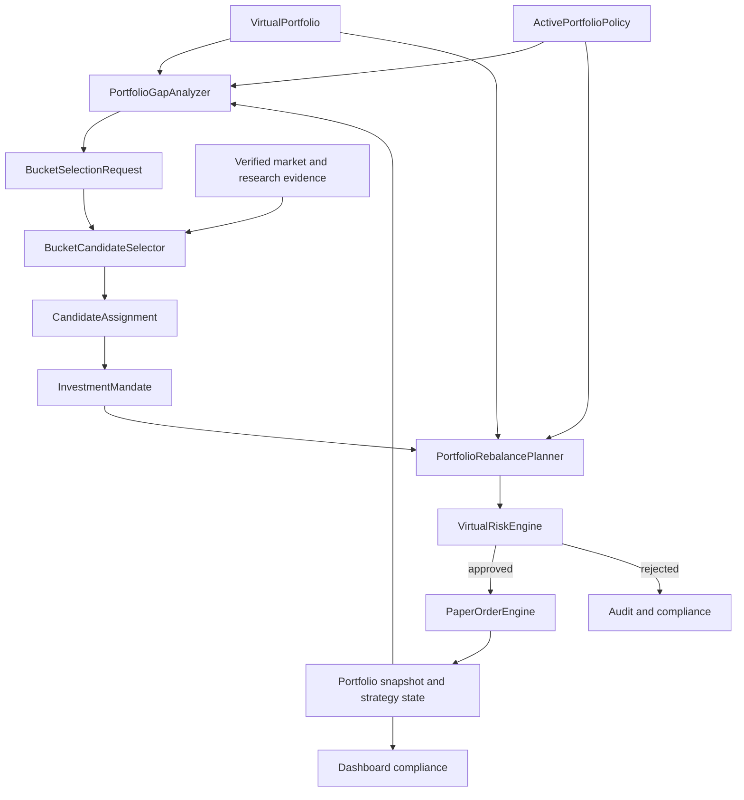

# 전략 포트폴리오 운용 및 버킷 기반 종목 선택 계획

## 1. 문서 목적

이 문서는 paper-only 가상 포트폴리오를 `종목 후보를 먼저 고르는 구조`에서
`포트폴리오 역할과 자금 배분을 먼저 정하고, 부족한 역할에 맞는 종목을 고르는 구조`로
전환하기 위한 제품·도메인·구현 계획을 정의한다.

핵심 결정은 다음과 같다.

> `ActivePortfolioPolicy`가 자금의 역할을 먼저 결정하고,
> `BucketCandidateSelector`는 목표 대비 부족한 strategy bucket만 채운다.

이 문서의 계획은 `BROKER_PROVIDER=mock`, `TRADING_ENABLED=false`,
`AI_DECISION_MODE=paper_only` 경계를 유지한다. 특정 종목 추천, 실계좌 변경,
live `TradingSignal`, live `OrderIntent`, broker mutation은 범위에 포함하지 않는다.

## 2. 문제 정의

현재 코드는 다음 기반을 이미 가지고 있다.

- `long_term`, `swing`, `short_term`, `intraday`, `hedge` strategy bucket
- strategy bucket metadata를 가진 candidate, position, trade contract
- bucket별 exposure와 turnover risk limit
- `PortfolioPolicy` draft validation과 append-only 저장
- strategy bucket별 historical replay preset과 isolated test record
- cash reserve, market regime allocation, hedge, execution cost, portfolio analytics

그러나 이 기능은 하나의 운용 루프로 연결되지 않았다.

- 저장된 `PortfolioPolicy` 중 현재 적용할 정책을 가리키는 active pointer가 없다.
- main portfolio compliance는 저장된 정책의 target을 읽지 못한다.
- 종목의 `strategyBucket`은 주로 universe manifest에 미리 지정된 metadata다.
- 같은 포트폴리오에서 bucket마다 다른 판단 주기와 exit policy를 동시에 적용하지 않는다.
- bucket 목표 비중은 있지만 종목별 역할, 목표 비중, 보유기간과 검토 주기가 없다.
- `holdingPeriodHint`는 validation metadata이며 실제 time-based exit를 강제하지 않는다.
- isolated bucket test 결과를 통합 포트폴리오 정책으로 자동 승격하지 않는다.

결과적으로 현재 시스템은 bucket별 실험은 가능하지만 다음 질문에 일관되게 답하지
못한다.

1. 현재 포트폴리오에서 어떤 역할이 부족한가?
2. 부족한 역할을 어떤 조건의 종목으로 채워야 하는가?
3. 선택된 종목은 어느 정도 비중과 기간으로 보유해야 하는가?
4. 언제 유지, 축소, 교체 또는 청산해야 하는가?
5. 여러 bucket의 판단이 충돌하면 어떤 규칙으로 해결하는가?

## 3. 목표와 비목표

### 3.1 목표

- 정책이 종목 선택보다 항상 먼저 평가된다.
- 하나의 shared virtual portfolio에서 여러 strategy bucket을 함께 운용한다.
- bucket별 목표·허용 비중, 회전율, 낙폭, 보유기간과 판단 주기를 강제한다.
- 종목마다 하나의 명시적인 `InvestmentMandate`를 유지한다.
- 부족한 bucket에 대해서만 candidate selection budget을 사용한다.
- 종목 선택, sizing, rebalance와 exit를 deterministic backend가 계산한다.
- Codex는 구조화된 근거를 바탕으로 후보를 설명하거나 paper-only 판단을 제안할 수
  있지만 최종 allocation과 Risk Engine을 소유하지 않는다.
- policy, mandate, selection, rebalance, risk decision, fill, portfolio snapshot을
  hash와 ID로 추적할 수 있어야 한다.
- historical replay가 동일한 policy와 evidence에서 재현 가능한 결과를 만든다.

### 3.2 비목표

- live trading 또는 실계좌 포트폴리오 변경
- 자연어에서 직접 주문을 생성하는 기능
- 근거가 없는 특정 종목 추천이나 수익률 보장
- AI가 임의로 bucket, target weight 또는 Risk Engine 결과를 확정하는 기능
- 하나의 backtest 최고 수익률만으로 정책을 자동 활성화하는 기능
- 승인되지 않은 외부 데이터나 비공식 Toss source를 live 경로에 연결하는 기능

## 4. 현재 구현 기준선

| 기능 | 현재 상태 | 목표 상태 |
| --- | --- | --- |
| strategy bucket schema | 구현 | 유지 |
| policy draft validation | 구현 | runtime policy contract와 통합 |
| policy append-only 저장 | activation repository까지 구현 | runner에서 active policy 사용 |
| bucket target/min/max weight | active policy compliance에 적용, sizing 미연결 | sizing에도 동일 policy 적용 |
| bucket exposure/turnover gate | 구현, policy 입력 연결은 수동 | active policy에서 자동 파생 |
| bucket별 replay preset | 구현 | shared portfolio orchestration에 재사용 |
| 종목별 bucket | manifest metadata 중심 | deterministic assignment와 mandate로 승격 |
| 종목별 target range | mandate strict contract에 구현, persistence 미연결 | mandate repository/state에 연결 |
| 실제 보유기간 상태 | 미구현 | position strategy state에 추가 |
| 통합 rebalance plan | 미구현 | preview와 paper execution 분리 |
| active policy 기반 dashboard | 구현 | 동일 policy hash compliance 유지 |
| 여러 bucket 동시 실행 | 미구현 | cadence-aware orchestrator 추가 |

runtime policy의 immutable dependency contract, read-only filesystem loader,
validation candidate 정규화와 strict persistence adapter는 구현되어 있다. activation lifecycle은
strict event contract, dependency를 다시 해소하는 deterministic as-of fold와 cross-process
atomic append/dedupe repository까지 구현되었다. runner 연결은 아직 포함하지 않는다.

현재 dashboard policy builder의 초기 draft는 다음 비중을 사용한다. 이 값은 활성
정책이나 투자 권고가 아니라 paper simulation을 시작하기 위한 편집 가능한 예시다.

| Bucket | Target | Min | Max | Max turnover | Max drawdown | Holding hint | Selection trigger | Entry floor |
| --- | ---: | ---: | ---: | ---: | ---: | --- | --- | ---: |
| `long_term` | 35% | 20% | 50% | 15% | 18% | `multi_month` | `below_min` | - |
| `swing` | 20% | 10% | 30% | 35% | 12% | `multi_week` | `below_min` | - |
| `short_term` | 15% | 0% | 25% | 50% | 8% | `multi_day` | `entry_floor_on_due_cycle` | 5% |
| `intraday` | 10% | 0% | 15% | 100% | 4% | `intraday` | `entry_floor_on_due_cycle` | 2% |
| `hedge` | 5% | 0% | 15% | 40% | 6% | `hedge` | `entry_floor_on_due_cycle` | 2% |
| cash | 15% | - | - | - | - | dynamic regime | - | - |

`Selection trigger`와 `Entry floor` 열은 현재 builder에 구현된 값이 아니라 위 초기
비중을 runtime policy로 정규화할 때 추가할 계획 기본값이다.

Policy builder의 drawdown/turnover 값과 historical replay preset의 take-profit,
stop-loss, trailing stop 값은 현재 서로 다른 configuration source다. runtime policy를
도입할 때 두 설정을 하나의 versioned bucket policy로 통합해야 한다.

## 5. 목표 운용 모델



운용 순서는 다음으로 고정한다.

1. active policy와 현재 portfolio를 같은 시점 기준으로 읽는다.
2. mark-to-market 후 bucket, symbol, cash, market, country, currency exposure를 계산한다.
3. 목표 범위를 벗어난 bucket과 position을 찾는다.
4. 축소 또는 청산 계획을 신규 매수 계획보다 먼저 만든다.
5. bucket의 명시적인 `selectionTrigger`가 충족될 때만
   `BucketSelectionRequest`를 만든다.
6. bucket 전용 hard gate와 score로 candidate를 평가한다.
7. backend가 종목별 target range와 최대 notional을 산정한다.
8. Risk Engine이 최신 portfolio와 candidate evidence로 다시 검증한다.
9. 승인된 order만 paper fill로 반영한다.
10. policy/mandate/rebalance/risk/fill lineage를 저장하고 compliance를 다시 계산한다.

## 6. 도메인 계약

아래 contract는 구현 방향을 설명하기 위한 목표 형태다. 실제 schema 추가 시 Zod
strict schema, version, parser, migration과 negative test를 함께 작성한다.

### 6.1 `PortfolioPolicyActivationEvent`

```ts
type PortfolioPolicyActivationEvent =
  | {
      eventType: "activated";
      mode: "paper_only";
      activationId: string;
      activationEventHash: string;
      portfolioId: string;
      activationSequence: number;
      policyRecordId: string;
      policyId: string;
      policyVersion: string;
      policyHash: string;
      policyLineageHash: string;
      supersedesActivationId?: string;
      effectiveFrom: string;
      createdAt: string;
    }
  | {
      eventType: "retired";
      mode: "paper_only";
      retirementEventId: string;
      activationEventHash: string;
      portfolioId: string;
      activationSequence: number;
      retiredActivationId: string;
      reasonCode: string;
      effectiveFrom: string;
      createdAt: string;
    };
```

- policy record 자체는 immutable하게 유지한다.
- `activationId`와 `retirementEventId`는 재사용하지 않는다.
- `activationEventHash`는 variant별 event ID, hash와 `createdAt`을 제외한 complete canonical
  payload에서 계산하며 event ID는 hash에서 파생한다. resolver는 sequence fold 전에 모든
  event를 독립 rehash하고 policy record ID/ID/version/hash/lineage tuple,
  supersedes/retired target, effective time 또는 reason이 바뀐 record를 fail-closed한다. exact
  payload retry만 기존 event로 수렴한다.
- event는 backend가 append 시 부여한 portfolio별 연속 `activationSequence`를 가진다.
  예약·backdate를 지원하지 않으며 `effectiveFrom`은 `createdAt`과 같은 즉시 적용 시각이어야
  한다. 미래 또는 과거 effective time과 sequence gap/duplicate를 거절한다.
- 교체 activation은 현재 active ID를 `supersedesActivationId`로 지정해 한 event에서 이전
  activation을 닫고 새 policy를 연다. policy 없이 중단할 때는 `retiredActivationId`를 가진
  retirement event를 append한다.
- as-of resolver는 `effectiveFrom <= asOf`인 event만 선택한 뒤 `activationSequence` 오름차순으로
  fold하고 supersedes/retired target이 그 시점의 current active와 정확히 일치하는지
  검증한다. unknown target, 이미 닫힌 target과 분기된 transition은 fail-closed한다.
- 같은 `portfolioId`와 시점에 active policy가 0개 또는 2개 이상이면 해당 portfolio
  실행을 fail-closed한다.
- simulation run은 시작 시 policy hash를 고정하며 실행 도중 새 정책으로 바뀌지 않는다.

### 6.2 `StrategyBucketPolicy`

```ts
type TakeProfitPolicy =
  | { mode: "disabled" }
  | {
      mode: "full_exit";
      takeProfitRatio: number;
    }
  | {
      mode: "partial_then_trail";
      takeProfitRatio: number;
      takeProfitSellRatio: number;
      trailingStopFromPeakRatio: number;
    };

interface StrategyBucketExitPolicy {
  takeProfit: TakeProfitPolicy;
  stopLossRatio?: number;
  timeExpiryAction: "review_required" | "sell_all";
}

type EvidenceClass =
  | "market_technical"
  | "fundamental_quality"
  | "portfolio_fit"
  | "execution_fit";

interface EvidenceRequirement {
  evidenceClass: EvidenceClass;
  sourceContractId: string;
  maximumAgeSeconds: number;
  minimumObservationCount?: number;
}

interface BucketSelectionPolicyRecord {
  selectionPolicyRecordId: string;
  bucket: StrategyBucket;
  version: string;
  hash: string;
  lineageHash: string;
  requiredEvidence: EvidenceRequirement[];
  everyTickSourceRequirement?: {
    sourceContractId: string;
    eventType: "verified_market_packet";
    maximumAgeSeconds: number;
    dedupeKey: "packet_hash";
  };
  hardGateRuleIds: string[];
  scoringModelVersion: string;
  featureDefinitionRefs: string[];
  createdAt: string;
}

interface BucketSelectionPolicyRef {
  selectionPolicyRecordId: string;
  version: string;
  hash: string;
  lineageHash: string;
}

type CanonicalRiskParameterValue =
  | string
  | number
  | boolean
  | null
  | CanonicalRiskParameterValue[]
  | { [key: string]: CanonicalRiskParameterValue };

interface PortfolioRiskRuleParameterRecord {
  riskRuleParameterRecordId: string;
  ruleId: string;
  ruleVersion: string;
  version: string;
  hash: string;
  lineageHash: string;
  parameters: { [key: string]: CanonicalRiskParameterValue };
  createdAt: string;
}

interface PortfolioRiskRuleParameterRef {
  riskRuleParameterRecordId: string;
  version: string;
  hash: string;
  lineageHash: string;
}

interface PortfolioRiskRuleSetRecord {
  riskRuleSetRecordId: string;
  version: string;
  hash: string;
  lineageHash: string;
  rules: Array<{
    ruleId: string;
    ruleVersion: string;
    appliesTo: Array<"BUY" | "SELL">;
    parameterRef: PortfolioRiskRuleParameterRef;
  }>;
  createdAt: string;
}

interface PortfolioRiskRuleSetRef {
  riskRuleSetRecordId: string;
  version: string;
  hash: string;
  lineageHash: string;
}

interface PortfolioLegacyReduceOnlyPolicy {
  allowBuyOrIncrease: false;
  maximumParticipationRatio: number;
  riskRuleSetRef: PortfolioRiskRuleSetRef;
}

type BucketSelectionTrigger =
  | { mode: "below_min" }
  | {
      mode: "entry_floor_on_due_cycle";
      entryWeightRatio: number;
    };

interface ScheduleBoundaryRecord {
  scheduleBoundaryRecordId: string;
  market: Market;
  version: string;
  hash: string;
  lineageHash: string;
  timeZone: string;
  sessionCalendarRecordId: string;
  sessionCalendarVersion: string;
  sessionCalendarHash: string;
  sessionCalendarLineageHash: string;
  interval: "hourly" | "daily" | "weekly";
  anchorLocalTime: string;
  weeklyAnchorDay?: "monday" | "tuesday" | "wednesday" | "thursday" | "friday";
  nonSessionDayRule: "previous_session" | "next_session";
  createdAt: string;
}

type SessionCalendarEntry =
  | {
      exchangeDate: string;
      sessionKind: "closed";
      sourceEvidenceRefs: string[];
    }
  | {
      exchangeDate: string;
      sessionKind: "regular" | "early_close" | "delayed_open";
      opensAt: string;
      closesAt: string;
      sourceEvidenceRefs: string[];
    };

interface SessionCalendarRecord {
  sessionCalendarRecordId: string;
  market: Market;
  version: string;
  hash: string;
  lineageHash: string;
  timeZone: string;
  validFromExchangeDate: string;
  validThroughExchangeDate: string;
  sessions: SessionCalendarEntry[];
  createdAt: string;
}

interface ScheduleBoundaryRef {
  scheduleBoundaryRecordId: string;
  version: string;
  hash: string;
  lineageHash: string;
}

type BucketReviewCadence =
  | { mode: "every_tick" }
  | {
      mode: "scheduled";
      boundaryRefs: ScheduleBoundaryRef[];
    };

interface BucketDrawdownSemanticsRecord {
  drawdownSemanticsRecordId: string;
  version: string;
  hash: string;
  lineageHash: string;
  equityBasis: "bucket_assets_plus_cash";
  unitFlowRule: "mint_burn_at_pre_flow_unit_nav";
  pnlRule: "mark_to_market_and_execution_cost_only";
  highWaterMarkRule: "max_previous_and_resulting_unit_nav";
  drawdownFormula: "one_minus_unit_nav_over_high_water_mark";
  emptyEpochRule: "preserve_nav_until_explicit_initial_or_empty_epoch";
  activationCarryRule: "carry_when_semantics_hash_matches";
  createdAt: string;
}

interface BucketDrawdownSemanticsRef {
  drawdownSemanticsRecordId: string;
  version: string;
  hash: string;
  lineageHash: string;
}

interface StrategyBucketPolicy {
  bucket: StrategyBucket;
  targetWeightRatio: number;
  minWeightRatio: number;
  maxWeightRatio: number;
  maxTurnoverRatio: number;
  turnoverWindow: {
    mode: "fixed_utc";
    durationSeconds: number;
    anchor: "unix_epoch";
    denominator: "window_open_portfolio_net_worth_krw";
  };
  maxDrawdownRatio: number;
  drawdownSemanticsRef: BucketDrawdownSemanticsRef;
  reviewCadence: BucketReviewCadence;
  eventTriggers: Array<
    "regime_change" | "thesis_evidence_change"
  >;
  selectionTrigger: BucketSelectionTrigger;
  minimumHoldingSeconds?: number;
  maximumHoldingSeconds?: number;
  exitPolicy: StrategyBucketExitPolicy;
  enabledMarkets: Market[];
  enabledAssetClasses: string[];
  selectionPolicyRef: BucketSelectionPolicyRef;
  riskRuleSetRef: PortfolioRiskRuleSetRef;
}
```

- `holdingPeriodHint`를 실제 cadence와 holding boundary로 구체화한다.
- `entry_floor_on_due_cycle`은 min 값과 무관하게 `entryWeightRatio`를 필수로 가지며
  `minWeightRatio <= entryWeightRatio <= targetWeightRatio`와 양수 조건을 검증한다.
- target이 양수이고 min이 0인 bucket에 `below_min`을 지정하면 empty portfolio에서
  영구적으로 선택 불가능하므로 policy validation에서 거절한다.
- `every_tick`은 `reviewCadence.mode = every_tick`으로 표현하며 `intraday` bucket이고
  참조한 immutable selection policy에
  `everyTickSourceRequirement`가 있을 때만 허용한다.
- selection policy hash는 record ID, `hash` 자체와 `createdAt`을 제외한 전체 payload에서
  계산한다. required evidence는 evidence class/source contract, hard-gate ID와 feature ref는
  각 canonical key로 정렬하고 duplicate를 거절하며 every-tick source requirement와 scoring
  model version도 digest에 포함한다. record ID는 hash에서 파생한다.
- scheduled cadence는 대상 market별 immutable `ScheduleBoundaryRecord`를 정확히 하나씩
  참조한다. record는 IANA timezone, versioned session calendar, local anchor, interval,
  weekly anchor와 non-session-day rule을 고정한다. 누락·중복 market, hash mismatch 또는
  policy가 허용한 market과 boundary market 불일치는 activation에서 거절한다.
- `weeklyAnchorDay`는 weekly record에서만 필수이며 hourly/daily record에는 허용하지 않는다.
  `hash`는 ID, `hash` 자체와 `createdAt`을 제외한 전체 boundary payload의 canonical hash로
  검증한다.
- `SessionCalendarRecord`는 exchange date별 session을 중복 없이 정렬해 저장한다. closed
  session은 open/close를 가질 수 없고, open session은 timezone offset이 포함된
  `opensAt < closesAt`을 필수로 가진다. record hash는 ID, `hash` 자체와 `createdAt`을 제외한
  전체 payload를 묶고 각 entry는 provenance ref를 가져야 한다.
- valid range의 모든 calendar date는 open 또는 closed entry를 정확히 하나 가져야 하며
  provenance ref는 검증된 official calendar evidence/publication으로 resolve되어야 한다.
- boundary resolver는 exact session calendar ID/version/hash를 읽는다. policy activation은
  calendar의 missing/corrupt와 market/timezone 불일치를 fail-closed하고, due-cycle 생성은 이에
  더해 requested slot의 date coverage를 검증해 date gap도 fail-closed한다.
- `enabledMarkets`는 비어 있지 않은 canonical unique set이어야 한다. scheduled cadence의
  resolved boundary market 집합은 `enabledMarkets`와 정확히 같아야 하고 `every_tick` packet,
  selection request, mandate 및 rebalance action의 market도 이 집합 안에 있어야 한다.
- schedule slot ID와 cutoff는 boundary record 및 session calendar로 계산한다. DST, 휴장,
  조기 종료를 구현체의 local timezone이나 처리 시각으로 추정하지 않는다.
- turnover window는 Unix epoch를 anchor로 한 고정 UTC 구간이며 duration은 양의 정수다.
  window ID는 policy와 독립적으로 portfolio/bucket/window start/end에서 파생하고 분모는 window 시작 직전
  immutable portfolio snapshot의 positive `virtualNetWorthKrw`로 고정한다. 분모를 resolve할 수
  없거나 0 이하이면 신규 fill을 fail-closed하며 중간 자금 유입으로 분모를 재설정하지 않는다.
- 같은 window 안의 policy activation은 기존 turnover event/state 누계를 그대로 이어받고 새
  policy의 `maxTurnoverRatio`를 누계에 적용한다. `turnoverWindow` duration/anchor/denominator를
  바꾸는 policy는 기존 window가 끝난 정확한 boundary에서만 activation할 수 있으며 중간
  activation은 거절한다. 정책 교체 자체로 window나 누계를 초기화할 수 없다.
- 모든 BUY/SELL fill의 absolute filled notional을 `BucketTurnoverEvent`에 append하고 선형
  predecessor, exact plan/action/fill origin, full event hash와 누계를 검증한다. state hash는
  event replay 결과와 같아야 하며 fill retry는 기존 event로 수렴한다. turnover ratio는
  `cumulativeAbsoluteFilledNotionalKrw / windowOpenPortfolioNetWorthKrw`다.
- turnover event hash는 event ID/hash/createdAt을 제외한 complete payload에서 계산하고 ID는
  hash에서 파생한다. state ID는 window identity에서 파생하며 state hash는 자기 hash를 제외한
  complete snapshot payload에서 계산한다. resolver는 event chain을 replay해 누계, ratio,
  last event와 state hash를 독립 검증한다.
- `risk_breach`는 선택 가능한 `eventTriggers` 값이 아니다. 모든 enabled bucket은 market
  mark, fill, fee, cash-flow와 risk-state update마다 cadence와 무관하게 Risk Engine에서
  재평가되며 breach는 즉시 신규 매수를 차단하고 sell-first reduce-only cycle을 만든다.
- activation과 replay 시작 시 `selectionPolicyRef`가 같은 bucket/version/hash의 immutable
  record로 resolve되어야 한다. required evidence, freshness, source contract, hard gate,
  feature와 scoring version을 구현 기본값으로 대체하지 않는다. resolver는 canonical payload를
  독립 rehash해 ID/ref/hash가 모두 일치하지 않으면 fail-closed한다.
- `riskRuleSetRef`도 같은 ID/version/hash의 immutable record로 resolve하고 rule ID 중복,
  빈 applicability와 parameter ref mismatch를 거절한다. action side에 적용되는 rule 전체가
  Risk Engine decision의 required set이며 caller가 일부 rule만 선택할 수 없다.
- risk rule set은 rule ID로 canonical sort하고 ID/createdAt/hash를 제외한 payload에서 hash를
  계산한다. BUY와 SELL 각각에 적용되는 required rule이 하나 이상이어야 하며 record는
  append-only다.
- 각 `parameterRef`는 같은 rule ID/version을 가진 immutable
  `PortfolioRiskRuleParameterRecord`로 resolve되어야 한다. parameter record hash는 ID,
  `hash`, `createdAt`을 제외한 canonical payload에서 계산하고 ID는 hash에서 파생한다.
  object key는 lexical order로 canonicalize하고 non-finite number, duplicate key와 지원하지
  않는 value type을 거절한다. Risk Engine replay와 fill 직전 재검증은 이 저장 payload의
  수치·enum·boolean만 사용하며 현재 runtime default로 누락값을 보충하지 않는다.
- `drawdownSemanticsRef`는 exact immutable `BucketDrawdownSemanticsRecord`로 resolve한다. hash는
  ID/hash/createdAt을 제외한 complete payload에서 계산하고 ID는 hash에서 파생한다. activation,
  risk-state replay와 breach evaluation은 저장된 unit flow/PnL/HWM/drawdown/empty/carry rule만
  사용하고 runtime 구현 기본값으로 대체하지 않는다. 독립 rehash 또는 version/hash가 다르면
  activation과 신규 매수를 fail-closed한다.
- 여섯 dependency record는 semantic `hash`/hash-derived ID와 별도로 `lineageHash`를 가진다.
  `lineageHash`는 `recordType`, record ID, semantic hash, `createdAt`과 canonical child
  `dependencyLineageHashes`의 digest이며 모든 ref가 이를 포함한다. risk rule set은 parameter
  lineage를, schedule boundary는 session calendar lineage를 parent lineage digest에 포함해
  상위 runtime policy hash까지 생성 시각 provenance를 연쇄 결속한다. 새 lineage-only field는
  기존 semantic hash/ID 입력에서 제외해 append-only artifact identity를 유지한다. parser,
  loader와 resolver는 semantic hash/ID와 lineage hash를 모두 독립
  검증하며 어느 dependency의 `createdAt`만 바뀌어도 activation 전 fail-closed한다.
- active `PortfolioPolicy` canonical hash는 각 bucket의 `enabledMarkets`, complete
  `selectionPolicyRef`, `riskRuleSetRef`, `drawdownSemanticsRef`, `reviewCadence` boundary ref와
  `turnoverWindow`를 포함해
  selection/risk/schedule rule 교체가 동일 policy hash 아래에서 일어나지 않게 한다.
- root `PortfolioPolicy`는 bucket lineage가 없는 position 전용
  `PortfolioLegacyReduceOnlyPolicy`를 필수로 가지며 이 config와 rule-set ref도 policy hash에
  포함한다. 이 policy는 SELL과 exposure 축소만 허용하고 bucket을 합성하지 않는다.
- take-profit을 사용하지 않으면 `disabled`, 전량 익절은 trigger ratio가 필수인
  `full_exit`, 부분 익절은 trigger/sell/trailing ratio가 모두 필수인
  `partial_then_trail`로만 표현한다. 각 ratio의 범위도 strict validation한다.
- `maximumHoldingSeconds`가 있으면 `timeExpiryAction`을 함께 검증한다.
- holding boundary는 `minimumHoldingSeconds >= 0`, `maximumHoldingSeconds > 0`이고 둘 다
  있으면 반드시 `minimumHoldingSeconds < maximumHoldingSeconds`여야 한다. 같거나 역전된
  값은 policy validation에서 거절한다.
- `review_required`는 만료 시 신규 매수를 차단하고 검토 상태로만 전환한다.
- `sell_all`을 명시한 bucket만 만료 시 reduce-only paper sell candidate를 만들며,
  Risk Engine 재검증을 통과해야 한다.
- lifecycle, stale evidence, Risk Engine reject는 minimum holding보다 우선한다.

### 6.3 `InvestmentMandate`

```ts
type ManualCapacityReservationLineage = {
  manualCapacityReservationId: string;
  manualCapacityReservationHash: string;
  reservedMaximumNotionalKrw: number;
} &
  (
    | {
        reservationKind: "new_position";
        reservedSlotOrdinal: number;
      }
    | {
        reservationKind: "increase_existing";
        existingPositionRef: string;
      }
  );

type MandateAssignmentLineage =
  | {
      assignmentSource: "manual_policy";
      manualAuthorizationScope: "open_or_increase";
      manualAssignmentEventId: string;
      capacityReservation: ManualCapacityReservationLineage;
    }
  | {
      assignmentSource: "manual_policy";
      manualAuthorizationScope: "classify_existing_reduce_only";
      manualAssignmentEventId: string;
    }
  | {
      assignmentSource: "deterministic_selector";
      selectionRequestId: string;
      candidateAssignmentId: string;
      candidateAssignmentSetId: string;
      candidateAssignmentSetHash: string;
      selectedRank: number;
      openingCapacityReservationId: string;
      openingCapacityReservationHash: string;
      reservedSlotOrdinal: number;
      reservedMaximumNotionalKrw: number;
      scoringModelVersion: string;
      selectionScore: number;
    };

type InvestmentMandateRecord = InvestmentMandateBase & MandateAssignmentLineage;

interface InvestmentMandateEventBase {
  mandateEventId: string;
  mandateEventHash: string;
  mandateId: string;
  mandateHash: string;
  portfolioId: string;
  market: Market;
  symbol: string;
  bucket: StrategyBucket;
  policyHash: string;
  asOf: string;
  reasonCodes: string[];
  createdAt: string;
}

type InvestmentMandateEvent = InvestmentMandateEventBase &
  (
    | {
        eventType: "activated";
        previousMandateEventId?: string;
      }
    | {
        eventType: "review_required";
        previousMandateEventId: string;
      }
    | {
        eventType: "retired";
        previousMandateEventId: string;
        supersededByMandateId?: string;
      }
  );

interface InvestmentMandateBase {
  mandateId: string;
  mandateHash: string;
  portfolioId: string;
  market: Market;
  symbol: string;
  bucket: StrategyBucket;
  policyHash: string;
  asOf: string;
  targetWeightRatio: number;
  minWeightRatio: number;
  maxWeightRatio: number;
  maximumOpeningNotionalKrw: number;
  reasonCodes: string[];
  evidenceRefs: string[];
  evidenceAsOf: string;
  reviewCadence: BucketReviewCadence;
  validFrom: string;
  reviewAfter?: string;
  expiresAt?: string;
  createdAt: string;
}

interface ManualAssignmentEventBase {
  manualAssignmentEventId: string;
  manualAssignmentEventHash: string;
  portfolioId: string;
  policyHash: string;
  market: Market;
  symbol: string;
  bucket: StrategyBucket;
  asOf: string;
  selectionPolicyRecordId: string;
  selectionPolicyHash: string;
  reasonCodes: string[];
  evidenceRefs: string[];
  evidenceAsOf: string;
  evidenceValidationHash: string;
  authorizationRef: string;
  createdAt: string;
}

type ManualAssignmentEvent = ManualAssignmentEventBase &
  (
    | {
        authorizationScope: "open_or_increase";
        evidenceEligibility: "eligible";
        portfolioSnapshotId: string;
        portfolioSnapshotHash: string;
        sizingInputRecordId: string;
        minWeightRatio: number;
        targetWeightRatio: number;
        maxWeightRatio: number;
        maximumNotionalKrw: number;
        sizingInputHash: string;
        sizingOutputHash: string;
      }
    | {
        authorizationScope: "classify_existing_reduce_only";
        evidenceEligibility: "eligible" | "blocked";
        classificationMinWeightRatio: number;
        classificationTargetWeightRatio: number;
        classificationMaxWeightRatio: number;
      }
  );

interface ManualOpeningCapacityReservationRecordBase {
  manualCapacityReservationId: string;
  manualCapacityReservationHash: string;
  manualAssignmentEventId: string;
  manualAssignmentEventHash: string;
  portfolioId: string;
  policyHash: string;
  bucket: StrategyBucket;
  market: Market;
  symbol: string;
  currentPortfolioSnapshotId: string;
  currentPortfolioSnapshotHash: string;
  capacityLedgerVersion: number;
  reservedMaximumNotionalKrw: number;
  resultingReservedNotionalKrw: number;
  authorizationRef: string;
  createdAt: string;
}

type ManualOpeningCapacityReservationRecord =
  ManualOpeningCapacityReservationRecordBase &
    (
      | {
          reservationKind: "new_position";
          reservedSlotOrdinal: number;
        }
      | {
          reservationKind: "increase_existing";
          existingPositionRef: string;
        }
    );

interface BucketOpeningCapacityState {
  capacityStateId: string;
  capacityStateHash: string;
  portfolioId: string;
  policyHash: string;
  bucket: StrategyBucket;
  currentPortfolioSnapshotId: string;
  currentPortfolioSnapshotHash: string;
  capacityLedgerVersion: number;
  activePositionCount: number;
  pendingReservationCount: number;
  mandateBoundUnusedSlotCount: number;
  availableSlots: number;
  reservedOpeningNotionalKrw: number;
  remainingOpeningBudgetKrw: number;
  lastReservationRecordId?: string;
  asOf: string;
}

interface OpeningCapacityReservationEventBase {
  capacityReservationEventId: string;
  capacityReservationEventHash: string;
  reservationId: string;
  reservationHash: string;
  portfolioId: string;
  policyHash: string;
  bucket: StrategyBucket;
  remainingReservedNotionalKrw: number;
  occupiesNewPositionSlot: boolean;
  capacityLedgerVersion: number;
  asOf: string;
  createdAt: string;
}

type OpeningCapacityReservationEvent = OpeningCapacityReservationEventBase &
  (
    | {
        eventType: "reserved";
        previousCapacityReservationEventId?: never;
        reservationSource:
          | {
              sourceKind: "manual";
              manualCapacityReservationId: string;
              manualCapacityReservationHash: string;
            }
          | {
              sourceKind: "selector";
              candidateAssignmentSetId: string;
              candidateAssignmentSetHash: string;
              candidateAssignmentId: string;
              reservedSlotOrdinal: number;
            };
      }
    | {
        eventType: "bound_to_mandate";
        previousCapacityReservationEventId: string;
        mandateId: string;
        mandateHash: string;
      }
    | {
        eventType: "partially_consumed";
        previousCapacityReservationEventId: string;
        mandateId: string;
        mandateHash: string;
        fillId: string;
        paperFillRecordId: string;
        paperFillHash: string;
      }
    | {
        eventType: "consumed_by_position";
        previousCapacityReservationEventId: string;
        mandateId: string;
        mandateHash: string;
        fillId: string;
        paperFillRecordId: string;
        paperFillHash: string;
        resultingPositionRef: string;
      }
    | {
        eventType: "released";
        previousCapacityReservationEventId: string;
        releaseOrigin:
          | { originKind: "request_cancelled"; requestOrManualEventId: string }
          | {
              originKind: "mandate_terminal";
              mandateId: string;
              mandateHash: string;
              mandateEventId: string;
              mandateEventHash: string;
            };
        releaseReasonCode: string;
      }
  );
```

- 같은 `portfolioId + market + symbol`에는 하나의 active mandate만 허용한다.
- 같은 portfolio 안에서 같은 종목을 두 bucket에 중복 계상하지 않는다.
- mandate record와 event ID는 재사용하지 않는다. record 생성 직후 상태는 `proposed`이며
  status는 event chain을 fold해 `active`, `review_required`, `retired`로 파생한다.
- `mandateHash`는 mandate ID, hash와 `createdAt`을 제외한 complete record payload에서
  계산하며 reason/evidence ref를 canonical sort하고 duplicate를 거절한다. mandate ID는 이
  hash에서 파생하고 resolver는 사용 전 독립 rehash한다. `reviewAfter`, `expiresAt`, cadence,
  target range, evidence와 assignment lineage 중 하나라도 달라지면 같은 mandate로 인정하지 않는다.
- mandate event도 event ID/hash/createdAt을 제외한 complete payload로 `mandateEventHash`를
  계산하고 ID를 hash에서 파생한다. 모든 event는 exact `mandateId + mandateHash`를 보존한다.
  position strategy state는 mandate ID/hash와 current mandate event ID/hash를 함께 저장하며
  record/event/state 중 하나라도 resolve 또는 rehash되지 않으면 신규 매수를 fail-closed한다.
- 첫 activation event만 `previousMandateEventId`를 생략할 수 있다. 이후 event는 현재 chain
  head를 정확히 가리켜야 하며 unknown predecessor, duplicate ID, branch, retired 이후 전이는
  fail-closed한다.
- bucket 변경은 새 mandate record를 먼저 만들고 기존 mandate의 retirement event에
  `supersededByMandateId`를 기록한 뒤 새 mandate를 activate하는 명시적 migration이다.
- 보유 position의 bucket 변경은 `BucketMandateMigrationTransferRecord` 없이는 완료할 수 없다.
  record는 retiring/activating mandate ID/hash, source mark head, quantity, 동일 price/evidence,
  `transferEquityKrw = quantity * transferPriceKrw`와 transfer group을 full-payload hash로 묶고
  ID를 hash에서 파생한다. from/to bucket은 달라야 하며 exact position과 mandate scope를
  resolve하고 독립 재계산한다.
- migration transaction은 old mark head `bucket_transfer_out`, old bucket
  `strategy_transfer_out(sequence=0)`, new bucket `strategy_transfer_in(sequence=1)`, new mark head
  `bucket_transfer_in`, old mandate retirement, new mandate activation, position strategy-state
  변경과 resulting risk states를 모두 원자 commit한다. transfer out은 음수, in은 같은 절댓값의
  양수여서 portfolio total equity는 변하지 않는다. 각 bucket은 transfer 직전 unit NAV에서 units를
  burn/mint해 NAV와 high-water mark history를 유지한다. old head는 terminal로 닫고 new head는
  동일 quantity/price/evidence로 시작한다. partial/cross-policy/duplicate transfer와 한쪽만 보이는
  상태는 fail-closed한다.
- resolver가 같은 `portfolioId + market + symbol`에 active mandate를 2개 이상 찾으면 해당
  종목의 신규 매수를 중단한다.
- `deterministic_selector` mandate는 request, assignment, scoring model과 score를 모두
  필수로 보존한다.
- `manual_policy` mandate는 selector lineage field를 포함하지 않고
  `manualAssignmentEventId`와 event의 `authorizationScope`를 필수로 보존한다. `open_or_increase`만
  strict `new_position | increase_existing` capacity reservation lineage를 요구하고
  `classify_existing_reduce_only`에는 이를 허용하지 않는다.
  같은 transaction에서 append될 event payload를 먼저 검증하고 portfolio/policy/symbol/bucket/as-of
  scope가 mandate와 일치해야 한다.
- manual assignment event hash는 event ID/hash/createdAt을 제외한 complete variant payload에서
  계산하고 ID는 hash에서 파생한다. mandate 발급 전에 scope, evidence/validation,
  authorization, sizing 또는 classification range를 포함한 payload를 독립 rehash하며 exact
  retry만 기존 event로 수렴한다.
- manual event의 `open_or_increase`는 active bucket selection policy를 resolve해 자동
  selector와 같은 required evidence, freshness와 hard gate를 통과한 `eligible` 결과 및
  validation hash가 있을 때만 허용한다. 또한 immutable portfolio sizing snapshot과
  selector와 동일한 backend sizing algorithm에서 나온 immutable sizing input record,
  input/output hash, min/target/max range와 maximum notional을 필수로 보존한다.
  `authorizationRef`는 이 gate와 sizing을 우회할 수 없다.
- manual open/increase는 event에 저장된 과거 snapshot만 신뢰하지 않는다. event append와
  mandate activation을 묶는 transaction에서 current portfolio와 `BucketOpeningCapacityState`를
  다시 읽어 active position+pending reservation+active mandate의 unused opening reservation 수,
  current gap과 aggregate reserved notional을 재계산한다. 신규 symbol은 available slot과 remaining
  budget이 모두 양수일 때만 다음 unique slot ordinal과 `min(manual maximum, remaining budget)`을
  reserve한다. 기존 position 증가는 새 slot을 차감하지 않지만 remaining budget은 reserve한다.
- `ManualOpeningCapacityReservationRecord`는 ID/hash/createdAt을 제외한 complete payload로 hash와
  hash-derived ID를 만들며 manual event ID/hash, current snapshot, CAS ledger version, slot과
  notional 또는 existing position ref를 보존한다. manual event, reservation, mandate activation과 ledger version increment는
  한 transaction으로 commit하고 실패 시 모두 rollback한다. mandate는 reservation ID/hash와
  동일 reservation kind/slot 또는 position ref/notional을 보존하며 reservation ID는 하나의
  mandate에만 bind할 수 있다.
- `BucketOpeningCapacityState`는 selector와 manual open/increase가 함께 사용하는 bucket별 current
  ledger다. state hash는 자기 hash를 제외한 complete payload로 계산하며 resolver는 current
  portfolio와 `OpeningCapacityReservationEvent` chain을 replay해 active position, pending 및
  mandate-bound unused slot 수, available slot, reserved notional과 remaining budget을 독립
  재계산한다. snapshot/hash mismatch, version
  gap 또는 state mismatch는 신규 mandate를 fail-closed한다.
- capacity reservation event hash는 event ID/hash/createdAt을 제외한 complete strict variant
  payload에서 계산하고 ID는 hash에서 파생한다. resolver는 source assignment/manual reservation,
  mandate/event와 paper fill origin을 exact ID/hash로 resolve한 뒤 독립 rehash한다. 첫 `reserved`
  event만 predecessor를 생략하며 이후 event는 current chain head와 다음 ledger version을 정확히
  가리켜야 한다. unknown/optional origin, transition branch, version gap, terminal 이후 event,
  증가한 remaining notional과 event type에 맞지 않는 slot flag는 모두 거절한다.
- selector assignment reservation과 manual reservation은 모두 expected `capacityLedgerVersion`을
  조건으로 같은 state를 compare-and-swap한다. `(portfolioId, policyHash, bucket,
  reservedSlotOrdinal)`은 active/unconsumed 동안 unique하고 총 reserved notional은 current gap과
  maximum additional exposure budget을 넘을 수 없다. mandate activation은 reservation을
  `bound_to_mandate`로 한 번만 전환할 뿐 slot/notional을 해제하지 않는다. 신규 position의 첫
  BUY fill이 생길 때 slot reservation을 `consumed_by_position`으로 바꾸고 active position count를
  같은 transaction에서 늘려 합계 점유량을 유지한다. partial fill은 filled notional만 차감하고
  잔여 reservation은 mandate에 계속 묶는다. target 충족 또는 mandate 취소·retire 시에만 잔여를
  consume/release하며 ledger를 같은 transaction에서 갱신한다.
  충돌한 요청은 stale snapshot으로 재계산해야 하며 이전 snapshot의 별도 reservation을 만들 수 없다.
- selector mandate와 최초 `reserved` event는 ledger가 부여한 전역 `reservedSlotOrdinal`, reservation
  ID/hash와 reserved maximum notional을 직접 보존한다. resolver는 assignment set의 request-local
  `selectedRank`를 slot으로 간주하지 않고 capacity event chain에서 같은 ordinal과 reservation
  ID/hash를 독립 검증한다.
- `classify_existing_reduce_only`는 evidence가 blocked여도 기존 position 분류를 위해
  classification range를 기록할 수 있지만 신규 매수와 수량 증가는 금지한다.
- AI 문자열은 `reasonCodes`나 `evidenceRefs`를 대체할 수 없다.
- target weight는 AI 출력이 아니라 backend sizing 결과다.

### 6.4 `PositionStrategyState`

```ts
type PositionStrategyState =
  | AssignedPositionStrategyState
  | UnassignedLegacyPositionStrategyState;

interface AssignedPositionStrategyState {
  stateKind: "assigned";
  positionStrategyStateHash: string;
  portfolioId: string;
  market: Market;
  symbol: string;
  mandateId: string;
  mandateHash: string;
  lastMandateEventId: string;
  lastMandateEventHash: string;
  policyHash: string;
  openedAt: string;
  lastIncreasedAt?: string;
  lastReducedAt?: string;
  lastReviewedAt: string;
  nextReviewAt?: string;
  lastReviewedTriggerRef: string;
  peakPriceKrw: number;
  partialTakeProfitExecuted: boolean;
  thesisStatus: "intact" | "watch" | "invalidated" | "unknown";
}

interface UnassignedLegacyPositionStrategyState {
  stateKind: "unassigned_legacy";
  positionStrategyStateHash: string;
  portfolioId: string;
  market: Market;
  symbol: string;
  observedPositionRef: string;
  reasonCodes: Array<
    "missing_mandate" | "missing_policy_lineage" | "missing_opened_at"
  >;
  detectedAt: string;
  status: "review_required";
}
```

기존 replay-local trailing state를 durable strategy state로 승격한다. portfolio snapshot과
strategy state의 policy/mandate lineage가 일치하지 않으면 신규 매수를 중단한다.
- `positionStrategyStateHash`는 hash 자체를 제외한 complete variant payload에서 계산한다.
  resolver는 매 read/restart마다 strict variant를 canonicalize해 독립 rehash하고 assigned
  state의 mandate/event ID/hash를 exact resolve한다. peak, partial take-profit, holding/review
  timestamp, thesis status 또는 legacy reason 중 하나라도 digest와 다르면 해당 symbol의 신규
  action을 fail-closed하고 read-only corruption 상태로 보고한다.
legacy position에 mandate, policy hash 또는 신뢰할 수 있는 `openedAt`이 없으면 값을
추정하지 않고 `unassigned_legacy` variant로 저장한다. 이 variant에는 가상의 lineage나
holding state를 채우지 않으며, 하나라도 존재하면 해당 portfolio의 신규 매수를
fail-closed하고 read-only inspection과 Risk Engine을 통과한 reduce-only 처리만 허용한다.
scheduled cadence mandate/state는 `reviewAfter`/`nextReviewAt`을 필수로 검증한다.
`every_tick`은 두 timestamp를 생략하고 `lastReviewedTriggerRef`에 마지막 처리 market
packet hash를 저장해 다음 packet의 due 여부를 결정한다.

### 6.5 `BucketRiskState`

```ts
interface BucketRiskState {
  riskStateEpochId: string;
  portfolioId: string;
  bucket: StrategyBucket;
  policyHash: string;
  drawdownSemanticsHash: string;
  units: number;
  unitNavKrw: number;
  highWaterMarkUnitNavKrw: number;
  equityKrw: number;
  drawdownRatio: number;
  lastBucketEquityEventId: string;
  riskStateHash: string;
  asOf: string;
}

interface BucketTurnoverState {
  turnoverStateId: string;
  turnoverStateHash: string;
  portfolioId: string;
  bucket: StrategyBucket;
  lastAppliedPolicyHash: string;
  windowStartedAt: string;
  windowEndsAt: string;
  windowOpenPortfolioNetWorthKrw: number;
  cumulativeAbsoluteFilledNotionalKrw: number;
  turnoverRatio: number;
  lastTurnoverEventId?: string;
  asOf: string;
}

interface BucketTurnoverEvent {
  turnoverEventId: string;
  turnoverEventHash: string;
  previousTurnoverEventId?: string;
  turnoverStateId: string;
  portfolioId: string;
  bucket: StrategyBucket;
  policyHash: string;
  rebalancePlanId: string;
  rebalanceActionId: string;
  fillId: string;
  absoluteFilledNotionalKrw: number;
  resultingCumulativeAbsoluteFilledNotionalKrw: number;
  asOf: string;
  createdAt: string;
}

interface BucketValuationMarkRecord {
  bucketValuationMarkRecordId: string;
  valuationMarkHash: string;
  portfolioId: string;
  bucket: StrategyBucket;
  policyHash: string;
  positionInputs: Array<{
    market: Market;
    symbol: string;
    quantity: number;
    previousPositionMarkHeadId: string;
    previousPositionMarkHeadHash: string;
    previousPriceKrw: number;
    currentPriceKrw: number;
    previousPriceEvidenceRef: string;
    currentPriceEvidenceRef: string;
  }>;
  equityDeltaKrw: number;
  asOf: string;
  createdAt: string;
}

interface BucketPositionMarkHeadState {
  positionMarkHeadId: string;
  positionMarkHeadHash: string;
  portfolioId: string;
  bucket: StrategyBucket;
  market: Market;
  symbol: string;
  quantity: number;
  currentPriceKrw: number;
  currentPriceEvidenceRef: string;
  lastPositionMarkHeadEventId: string;
  lastPositionMarkHeadEventHash: string;
  lastValuationMarkRecordId?: string;
  lastValuationMarkHash?: string;
  lastPositionMutationRef?: string;
  asOf: string;
}

interface BucketMandateMigrationTransferRecord {
  migrationRecordId: string;
  migrationRecordHash: string;
  portfolioId: string;
  market: Market;
  symbol: string;
  quantity: number;
  fromBucket: StrategyBucket;
  toBucket: StrategyBucket;
  retiringMandateId: string;
  retiringMandateHash: string;
  activatingMandateId: string;
  activatingMandateHash: string;
  sourcePositionMarkHeadId: string;
  sourcePositionMarkHeadHash: string;
  transferPriceKrw: number;
  transferPriceEvidenceRef: string;
  transferEquityKrw: number;
  transferGroupId: string;
  asOf: string;
  createdAt: string;
}

interface BucketPositionMarkHeadEventBase {
  positionMarkHeadEventId: string;
  positionMarkHeadEventHash: string;
  portfolioId: string;
  bucket: StrategyBucket;
  market: Market;
  symbol: string;
  resultingQuantity: number;
  resultingPriceKrw: number;
  resultingPriceEvidenceRef: string;
  asOf: string;
  createdAt: string;
}

type BucketPositionMarkHeadEvent = BucketPositionMarkHeadEventBase &
  (
    | {
        eventType: "initialized";
        previousPositionMarkHeadEventId?: never;
        initializationOrigin:
          | {
              originKind: "position_opening_fill";
              fillId: string;
              paperFillRecordId: string;
              paperFillHash: string;
            }
          | {
              originKind: "legacy_verified_mark";
              observedPositionRef: string;
              markEvidenceRef: string;
            };
      }
    | {
        eventType: "valuation_applied";
        previousPositionMarkHeadEventId: string;
        previousPositionMarkHeadEventHash: string;
        bucketValuationMarkRecordId: string;
        valuationMarkHash: string;
        bucketEquityEventId: string;
        bucketEquityEventHash: string;
      }
    | {
        eventType: "position_mutation_applied";
        previousPositionMarkHeadEventId: string;
        previousPositionMarkHeadEventHash: string;
        mutationOrigin:
          | {
              originKind: "paper_fill";
              fillId: string;
              paperFillRecordId: string;
              paperFillHash: string;
            }
          | {
              originKind: "verified_migration";
              migrationRecordId: string;
              migrationRecordHash: string;
            };
      }
    | {
        eventType: "bucket_transfer_out";
        previousPositionMarkHeadEventId: string;
        previousPositionMarkHeadEventHash: string;
        migrationRecordId: string;
        migrationRecordHash: string;
        transferGroupId: string;
      }
    | {
        eventType: "bucket_transfer_in";
        previousPositionMarkHeadEventId?: never;
        previousPositionMarkHeadEventHash?: never;
        migrationRecordId: string;
        migrationRecordHash: string;
        transferGroupId: string;
      }
  );

type BucketEquityEvent =
  | {
      eventType: "epoch_initialized";
      bucketEquityEventId: string;
      bucketEquityEventHash: string;
      riskStateEpochId: string;
      activationId: string;
      previousRiskStateEpochId?: string;
      portfolioId: string;
      bucket: StrategyBucket;
      policyHash: string;
      drawdownSemanticsHash: string;
      initializationMode: "initial_or_empty" | "carried_forward";
      initialEquityKrw: number;
      initialUnits: number;
      initialUnitNavKrw: number;
      initialHighWaterMarkUnitNavKrw: number;
      asOf: string;
    }
  | {
      eventType: "capital_flow";
      bucketEquityEventId: string;
      bucketEquityEventHash: string;
      previousBucketEquityEventId: string;
      riskStateEpochId: string;
      portfolioId: string;
      bucket: StrategyBucket;
      policyHash: string;
      amountKrw: number;
      rebalancePlanId: string;
      rebalanceActionId: string;
      fillId: string;
      paperFillRecordId: string;
      paperFillHash: string;
      fillAccountingGroupId: string;
      fillAccountingSequence: 0 | 1;
      asOf: string;
    }
  | {
      eventType: "valuation";
      bucketEquityEventId: string;
      bucketEquityEventHash: string;
      previousBucketEquityEventId: string;
      riskStateEpochId: string;
      portfolioId: string;
      bucket: StrategyBucket;
      policyHash: string;
      equityDeltaKrw: number;
      bucketValuationMarkRecordId: string;
      valuationMarkHash: string;
      evidenceRefs: string[];
      asOf: string;
    }
  | {
      eventType: "execution_cost";
      bucketEquityEventId: string;
      bucketEquityEventHash: string;
      previousBucketEquityEventId: string;
      riskStateEpochId: string;
      portfolioId: string;
      bucket: StrategyBucket;
      policyHash: string;
      equityDeltaKrw: number;
      rebalancePlanId: string;
      rebalanceActionId: string;
      fillId: string;
      paperFillRecordId: string;
      paperFillHash: string;
      fillAccountingGroupId: string;
      fillAccountingSequence: 0 | 1;
      evidenceRefs: string[];
      asOf: string;
    }
  | {
      eventType: "strategy_transfer_out" | "strategy_transfer_in";
      bucketEquityEventId: string;
      bucketEquityEventHash: string;
      previousBucketEquityEventId: string;
      riskStateEpochId: string;
      portfolioId: string;
      bucket: StrategyBucket;
      policyHash: string;
      migrationRecordId: string;
      migrationRecordHash: string;
      transferGroupId: string;
      transferSequence: 0 | 1;
      amountKrw: number;
      asOf: string;
    };
```

- policy activation은 bucket별 새 `riskStateEpochId`를 만들고 activation ID를 직접 참조하는
  `epoch_initialized` event로 시작한다. 초기화에는 존재하지 않는 rebalance plan을 참조하지
  않는다.
- 모든 bucket equity event는 event ID와 `bucketEquityEventHash`를 제외한 complete variant
  payload에서 hash를 계산하고 ID를 hash에서 파생한다. predecessor fold 전에 event type,
  epoch/activation, amount/delta, execution/mark origin과 초기 NAV/HWM/units를 포함한 payload를
  독립 rehash하며 mismatch는 전체 epoch를 corrupt로 처리해 신규 매수를 fail-closed한다.
- 기존 bucket risk state가 있고 `drawdownSemanticsHash`가 같으면 `carried_forward`로 이전
  epoch ID, unit NAV와 high-water mark를 그대로 이어받는다. 정책의 다른 field가 바뀌어도
  drawdown history는 초기화되지 않는다.
- 최초 epoch이거나 bucket units/equity가 모두 0인 경우에만 `initial_or_empty`를 허용하고
  unit NAV/high-water mark를 1로 시작한다. exposure가 남은 상태에서 drawdown semantics
  hash가 바뀌면 activation을 거절하며 암묵적인 baseline reset은 허용하지 않는다.
- 모든 initialization에서 `initialEquityKrw >= 0`,
  `initialUnits = initialEquityKrw / initialUnitNavKrw`, high-water mark가 unit NAV 이상인지
  검증한다. 이전 epoch와 high-water mark event는 삭제하지 않는다.
- shared cash와 bucket 사이의 allocation/deallocation은 `capital_flow` event로 기록하고
  flow 직전 unit NAV에서 unit을 mint/burn한다. 따라서 자금 이동 자체는 unit NAV와
  drawdown을 바꾸지 않는다. 양수 amount는 mint, 음수 amount는 burn이며 0 amount와
  보유 unit을 초과하는 burn은 거절한다.
- `strategy_transfer_out/in`은 shared cash flow나 fill이 아니라 위 verified mandate migration
  record만 origin으로 사용한다. 같은 transfer group의 out/in 금액 합은 0이고 sequence는
  old=0, new=1이어야 하며 두 bucket event, mark-head transfer와 mandate state를 한 transaction에서
  처리한다. transfer는 각 bucket의 unit 수만 조정하고 unit NAV/HWM 또는 portfolio total equity를
  바꾸지 않는다.
- capital flow는 exact plan/action/fill origin을 resolve하고 amount가 해당 fill에서 파생된
  cash 이동과 일치해야 한다. `fillId`는 모든 bucket capital-flow event에서 unique하며
  acknowledgement-loss retry는 기존 event를 반환한다. 새 event ID로
  같은 origin을 다시 append하거나 다른 amount에 재사용하면 거절한다.
- fill accounting group ID는 portfolio/plan/action/fill에서 결정론적으로 파생한다. BUY는
  `capital_flow(sequence=0) -> execution_cost(sequence=1)`, SELL은
  `execution_cost(sequence=0) -> capital_flow(sequence=1)` 순서로 고정한다. SELL deallocation
  amount는 비용 반영 후의 net proceeds이며 post-cost unit NAV에서 units를 burn한다.
  두 event는 한 durable transaction에서 연속 append하거나 둘 다 보이지 않게 처리하고,
  순서 역전·중간 event 삽입·불완전 group·같은 origin의 다른 sequence를 거절한다.
- bucket 내부 BUY/SELL은 asset/cash 교환이므로 체결 notional 자체는 손익이 아니다.
  mark-to-market PnL과 fee/slippage만 equity와 unit NAV를 변경한다.
- `valuation.equityDeltaKrw`는 mark-to-market 결과에 따라 양수 또는 음수일 수 있다.
  valuation은 exact immutable `BucketValuationMarkRecord` ID/hash를 참조한다. mark record는
  position input을 market/symbol 순으로 canonicalize하고 duplicate를 거절하며 ID/hash/createdAt을
  제외한 payload로 hash와 hash-derived ID를 만든다. resolver는 저장된 quantity와 이전/현재
  mark evidence로 delta를 독립 재계산한다. 각 input의 previous head ID/hash, quantity, price와
  evidence는 해당 symbol의 current `BucketPositionMarkHeadState`와 정확히 같아야 하고
  `previousPriceKrw`는 그 head의 `currentPriceKrw`여야 한다. current `asOf`는 head보다 뒤여야 하며
  같은 symbol의 overlapping/discontinuous interval은 거절한다. valuation event와 모든 resulting
  position mark head CAS update는 한 transaction으로 처리한다. 같은 epoch/bucket/mark record origin의 exact retry는
  기존 event를 반환하고 새 event ID, predecessor 또는 delta로 중복 append할 수 없다.
- fill 또는 position migration으로 quantity가 바뀌면 다음 valuation 전에 exact fill/migration
  origin을 가진 position mark head update로 quantity와 price basis를 조정한다. resolver는 이전
  head와 mutation origin을 replay해 새 head를 검증하며, 임의의 이전 가격을 제시하거나 fill 이후
  오래된 head에서 valuation을 분기할 수 없다. initial/legacy position의 첫 head는 verified current
  mark evidence로 열고 그 자체로 valuation PnL을 만들지 않는다.
- paper fill mutation은 quantity를 바꾸기 전에 기존 quantity 전체를 fill record의 authenticated
  `sourcePriceKrw`/price evidence로 valuation하고 그 valuation event/head update를 먼저 원자 적용한다.
  이어지는 mutation head의 `resultingPriceKrw`와 evidence는 같은 source price/evidence여야 하며
  BUY/SELL 모두 `fillPriceKrw`로 rebase할 수 없다. spread/slippage/impact 차이는 이미
  `execution_cost`로 계상하므로 이를 mark baseline에 다시 포함하지 않는다. 신규 position은 source
  price로 initialize하고, verified migration은 previous head의 price/evidence를 그대로 보존하는
  quantity reconciliation만 허용한다. migration이 가격을 바꾸려면 별도 authenticated valuation을
  먼저 적용해야 한다. resolver는 origin fill/migration과 이 규칙으로 resulting head를 독립 재계산한다.
- position mark head event hash는 event ID/hash/createdAt을 제외한 complete strict variant
  payload에서 계산하고 ID는 hash에서 파생한다. `initialized`와 새 bucket head의
  `bucket_transfer_in`만 predecessor를 생략하며 valuation, mutation과 `bucket_transfer_out`은
  previous event ID/hash와 exact authenticated origin을 필수로 가진다. transfer-out 이후 old
  head event는 terminal이다. head
  snapshot hash는 자기 hash를 제외한 complete payload에서 계산하고 stable ID는
  portfolio/bucket/market/symbol에서 파생한다. 사용 전 event chain을 독립 rehash·replay해 resulting
  quantity/price/evidence, last origin과 snapshot hash가 모두 일치해야 하며 mismatch는 valuation과
  신규 매수를 fail-closed한다.
  `execution_cost.equityDeltaKrw`는 0 이하만 허용하고 exact `PaperFillExecutionRecord`
  ID/hash를 참조한다. resolver는 source/fill price, quantity, participation/liquidity input,
  complete execution policy와 fee/tax/spread/slippage/impact breakdown을 독립 재계산하고
  `equityDeltaKrw = -totalCostKrw`인지 검증한다. exact plan/action/fill scope가 다르거나 양수
  cost, unresolved/corrupt fill 또는 중복 origin cost event는 거절한다.
- `capital_flow`, `valuation`, `execution_cost`를 append할 때마다 resulting equity/units에서
  unit NAV를 계산한다. capital flow는 NAV/HWM을 유지하고 valuation/execution cost 후에는
  `highWaterMarkUnitNavKrw = max(previous, unitNavKrw)`,
  `drawdownRatio = 1 - unitNavKrw / highWaterMarkUnitNavKrw`로 계산한다.
- resulting risk state를 같은 transaction/event fold에서 먼저 확정한 뒤 risk breach를
  평가한다. 특히 fee/slippage만으로 drawdown limit을 넘으면 이전 snapshot 값이 아니라 새
  drawdown으로 즉시 buy 차단과 reduce-only cycle을 만든다.
- units가 0이면 마지막 unit NAV/high-water mark를 유지하며, 같은 epoch의 재진입은 그
  NAV에서 mint한다. 새 policy activation도 위 `initial_or_empty` 조건이 아니면 baseline을
  재설정할 수 없다.
- epoch의 첫 event는 반드시 predecessor가 없는 `epoch_initialized`여야 한다. 이후 event는
  `previousBucketEquityEventId`를 필수로 가지며 event ID와 predecessor를 선형 append-only로
  검증한다. current snapshot은 event replay로 재구성 가능해야 하며 event/snapshot mismatch나
  누락은 신규 매수를 fail-closed한다.
- `riskStateHash`는 hash 자체를 제외한 current state payload의 canonical digest이며 event
  replay 결과와 독립 rehash가 모두 일치해야 한다.

### 6.6 `PortfolioSizingSnapshot`, `BucketSelectionRequest`와 `CandidateAssignment`

```ts
interface PortfolioExposureSnapshot {
  virtualNetWorthKrw: number;
  cashKrw: number;
  bucketExposureKrw: Record<StrategyBucket, number>;
  unassignedExposureKrw?: number; // positive only; omit when no unassigned holdings
  symbolExposureKrw: Array<{
    market: Market;
    symbol: string;
    exposureKrw: number;
  }>;
  marketExposureKrw: Record<string, number>;
  sectorExposureKrw: Record<string, number>;
  countryExposureKrw: Record<string, number>;
  currencyExposureKrw: Record<string, number>;
  pendingBuyExposureKrw: number;
  pendingSellExposureKrw: number;
}

type PendingPortfolioActionInput = {
  planId: string;
  planHash: string;
  planEventId: string;
  planEventHash: string;
  actionId: string;
  actionExecutionTargetHash: string;
  market: Market;
  symbol: string;
  remainingNotionalKrw: number;
  asOf: string;
} &
  (
    | {
        side: "BUY";
        openingCapacityReservationId: string;
        openingCapacityReservationHash: string;
      }
    | {
        side: "SELL";
        remainingQuantity: number;
        priceEvidenceRef: string;
      }
  );

interface PortfolioSizingSnapshot {
  portfolioSnapshotId: string;
  portfolioId: string;
  portfolioVersion: string;
  policyHash: string;
  asOf: string;
  virtualPortfolio: VirtualPortfolio;
  valuationInputs: Array<
    | {
        kind: "mark_price";
        market: Market;
        symbol: string;
        priceKrw: number;
        evidenceRef: string;
        evidenceAsOf: string;
      }
    | {
        kind: "fx_rate";
        baseCurrency: string;
        quoteCurrency: "KRW";
        rate: number;
        evidenceRef: string;
        evidenceAsOf: string;
      }
  >;
  pendingActionInputs: PendingPortfolioActionInput[];
  exposureSnapshot: PortfolioExposureSnapshot;
  exposureSnapshotHash: string;
  portfolioSnapshotHash: string;
}

interface BucketSelectionRequest {
  requestId: string;
  requestHash: string;
  cycleId: string;
  triggerIdentity: string;
  triggerRef: string;
  portfolioId: string;
  portfolioSnapshotId: string;
  portfolioSnapshotHash: string;
  policyHash: string;
  asOf: string;
  bucket: StrategyBucket;
  gapBasis: "min" | "entry_floor";
  gapKrw: number;
  availableSlots: number;
  maximumAdditionalExposureKrw: number;
  evidenceCutoffAt: string;
  createdAt: string;
}

interface CandidateSizingInputRecord {
  sizingInputRecordId: string;
  requestId: string;
  portfolioId: string;
  portfolioSnapshotId: string;
  portfolioSnapshotHash: string;
  policyHash: string;
  asOf: string;
  market: Market;
  symbol: string;
  bucket: StrategyBucket;
  scoringModelVersion: string;
  sizingAlgorithmVersion: string;
  selectionScore: number;
  exposureKeys: {
    sector: string;
    country: string;
    currency: string;
    classificationEvidenceRef: string;
  };
  featureInputs: Array<{
    featureDefinitionRef: string;
    value: number | boolean | string;
    evidenceRefs: string[];
  }>;
  exposureCapInputs: {
    bucketRemainingKrw: number;
    symbolRemainingKrw: number;
    sectorRemainingKrw: number;
    countryRemainingKrw: number;
    currencyRemainingKrw: number;
    cashAvailableKrw: number;
  };
  liquidityInput: {
    averageDailyNotionalKrw: number;
    maximumParticipationRatio: number;
    maximumLiquidityNotionalKrw: number;
    evidenceRefs: string[];
  };
  executionCostInput: {
    modelVersion: string;
    side: "BUY" | "SELL";
    referenceNotionalKrw: number;
    participationRate: number;
    fillPriceRule: "current_candidate_last_price";
    feeBps: number;
    taxBps: number;
    halfSpreadBps: number;
    slippageBps: number;
    fillRatio: number;
    allowFractionalShares: boolean;
    maxVolumeParticipationRate: number;
    minLiquidityFillRatio: number;
    rejectStaleLiquidity: boolean;
    marketImpactBpsPerParticipationRate: number;
    estimatedCostKrw: number;
    evidenceRefs: string[];
  };
  sizingInputHash: string;
  createdAt: string;
}

interface CandidateAssignment {
  assignmentId: string;
  requestId: string;
  sizingInputRecordId: string;
  portfolioId: string;
  portfolioSnapshotId: string;
  portfolioSnapshotHash: string;
  policyHash: string;
  asOf: string;
  market: Market;
  symbol: string;
  bucket: StrategyBucket;
  eligibility: "eligible" | "watch" | "blocked";
  minWeightRatio: number;
  targetWeightRatio: number;
  maxWeightRatio: number;
  maximumNotionalKrw: number;
  selectionScore: number;
  reasonCodes: string[];
  evidenceRefs: string[];
  scoringModelVersion: string;
  sizingInputHash: string;
  sizingOutputHash: string;
  assignmentHash: string;
  createdAt: string;
}

interface CandidateAssignmentSetRecord {
  candidateAssignmentSetId: string;
  candidateAssignmentSetHash: string;
  requestId: string;
  requestHash: string;
  availableSlots: number;
  requestAllocationBudgetKrw: number;
  orderedAssignments: Array<{
    assignmentId: string;
    assignmentHash: string;
    eligibility: "eligible" | "watch" | "blocked";
    selectionScore: number;
    market: Market;
    symbol: string;
  }>;
  selectedAssignments: Array<{
    assignmentId: string;
    assignmentHash: string;
    selectedRank: number;
    reservedMaximumNotionalKrw: number;
  }>;
  totalReservedMaximumNotionalKrw: number;
  createdAt: string;
}
```

`watch`와 `blocked` candidate는 주문 후보가 될 수 없다. required evidence가 없거나
stale이면 높은 score가 있더라도 `eligible`로 승격하지 않는다.
`PortfolioSizingSnapshot`은 해당 시점의 paper `VirtualPortfolio`, 실제 사용한 mark/FX
값과 provenance, 계산된 exposure payload를 canonical form으로 append-only 저장한다.
symbol exposure는 raw symbol string으로 keying하지 않고 `(market, symbol)` tuple을 market,
symbol 순서로 정렬하며 duplicate tuple을 거절한다.
- `exposureSnapshotHash`는 hash field를 제외한 complete exposure payload에서 계산한다. map
  key는 lexical order, symbol exposure는 market/symbol order로 canonicalize하고 duplicate와
  non-finite number를 거절한다. resolver는 virtual portfolio와 valuation input에서 exposure를
  다시 계산해 payload와 hash가 모두 같은지 검증한다.
- `portfolioSnapshotHash`는 snapshot ID와 자기 hash를 제외하고 independently verified
  `exposureSnapshotHash`를 포함한 complete snapshot payload에서 계산하며 ID는 hash에서
  파생한다. virtual portfolio의 position/order array는 stable domain key로 정렬한다. valuation
  input은 mark를 market/symbol, FX를 base/quote currency로 정렬하고 duplicate logical identity를
  거절하며 mark는 exact `(market, symbol)` position, FX는 exact currency pair에만 적용한다.
  downstream consumer는 두 hash를
  독립 재구성하기 전에는 snapshot을 sizing 또는 risk input으로 사용하지 않는다.
- `pendingActionInputs`는 nonterminal approved/executing plan의 remaining action만 포함하고 exact
  plan/event ID/hash, execution target과 BUY reservation 또는 SELL quantity/price origin을 직접
  보존한다. resolver는 plan event chain, fill cumulative와 reservation chain을 replay해 remaining
  amount를 재계산하고 market/symbol/side 순으로 canonicalize한다. `pendingBuyExposureKrw`와
  `pendingSellExposureKrw`는 이 입력의 합으로만 파생하며 pending input이 빈 경우에만 둘 다 0일
  수 있다. unresolved/corrupt action, duplicate logical action 또는 total mismatch는 snapshot을
  sizing에 사용하지 않고 fail-closed한다.
request의 snapshot ID/hash가 이 immutable record와 일치하지 않으면 selection과 sizing을
거절한다.
- `requestHash`는 request ID/hash/createdAt을 제외한 complete payload에서 계산하고 request ID는
  hash에서 결정론적으로 파생한다. request는 cycle의 exact trigger identity/ref를 직접
  보존하며 같은 payload retry는 기존 record를 반환한다. `(cycleId, bucket)` unique key가 같은
  두 번째 payload나 같은 ID의 hash collision은 거절한다.
- selector는 sizing 전에 exact policy와 independently verified portfolio snapshot에서 current
  exposure, min/entry-floor gap, available slot, cash/exposure cap을 다시 계산한다. derived
  `gapBasis`, `gapKrw`, `availableSlots`, `maximumAdditionalExposureKrw`, cutoff와 request full
  digest가 저장값과 정확히 같지 않으면 request를 소비하지 않는다.
`CandidateSizingInputRecord`는 policy/snapshot/request scope, versioned feature value와 evidence,
exposure cap, liquidity 및 execution cost model input 전체를 canonical form으로 append-only
저장한다. `sizingInputHash`는 record ID, hash와 생성 시각을 제외한 이 전체 payload에서
계산한다. assignment는 exact record ID/hash를 직접 보존하며 record가 resolve되지 않거나
scope/hash가 다르면 생성하지 않는다.
execution cost input은 현재 `PaperExecutionPolicy`의 fill rule, fee, tax, spread, slippage,
fill/fractional/liquidity/staleness 및 market-impact parameter 전체와 side, reference notional,
participation rate를 보존한다. `estimatedCostKrw`는 이 저장값만으로 독립 재계산하며 runtime
default로 누락 parameter를 보충하지 않는다.
feature/evidence ref와 분류 metadata는 모두 resolve되어야 하며 array와 exposure key는
canonical order로 정규화한다. sizing algorithm version이 다르면 같은 input으로 취급하지 않는다.
- `sizingInputRecordId`와 `assignmentId`는 서로 다른 domain prefix와
  request/market/symbol에서 각각 결정론적으로 파생한다. exact retry는 기존 record를
  반환하고 같은 identity에 다른 sizing input hash 또는 assignment payload를 쓰는 요청은
  fail-closed한다.
`sizingOutputHash`는 계산된 min/target/max weight range와 최대 notional을 canonicalize해
만든다. selector mandate의 range는 assignment 값과 정확히 같아야 하며 input/output hash
검증을 모두 통과해야 한다. assignment의 portfolio/snapshot/policy/as-of scope는 request를
읽지 못해도 독립 검증할 수 있도록 직접 저장하고, resolve 가능한 request와도 일치해야 한다.
- `assignmentHash`는 `assignmentId`, `assignmentHash`, `createdAt`을 제외한 assignment 전체
  payload에서 계산한다. reason/evidence ref는 canonical sort하고 duplicate를 거절하며
  eligibility, score, model version, input/output hash와 range/notional을 모두 digest에 포함한다.
  append와 mandate 발급 전에 독립 rehash가 일치해야 한다.
- mandate resolver는 exact selection policy와 sizing input의 feature/evidence를 다시 읽어
  required evidence freshness 및 모든 hard gate를 deterministic하게 재평가한다. 재계산한
  `eligibility`, `selectionScore`, `reasonCodes`가 assignment와 정확히 같지 않거나 assignment가
  `eligible`이 아니면 input/output/assignment hash가 유효해도 mandate를 만들지 않는다.
- 한 request의 모든 assignment를 저장한 뒤 immutable `CandidateAssignmentSetRecord`를 한 번
  seal한다. eligible 우선, selection score 내림차순, market/symbol canonical tie-break로 전체를
  정렬하고 selected assignment는 앞의 `min(availableSlots, eligibleCount)`개와 정확히 같아야
  한다. `requestAllocationBudgetKrw = min(gapKrw, maximumAdditionalExposureKrw)`로 고정하고
  rank 순서로 각 assignment의 individual maximum과 remaining request budget 중 작은 값을
  reserve한다. 모든 positive reservation의 합은 request budget 이하여야 하며 0 reservation은
  selected list에서 제외한다. set hash는 ID/hash/createdAt을 제외한 complete payload에서 계산하고 ID는 hash에서
  파생하며 request당 두 번째 set을 거절한다.
- deterministic selector mandate는 exact set ID/hash와 selected rank를 보존한다. resolver는
  request의 verified `availableSlots`, ordered assignment hashes와 top-N을 독립 재계산하고 해당
  assignment가 selected list의 같은 rank에 있을 때만 발급한다.
  assignment의 individual cap과 set의 `reservedMaximumNotionalKrw` 중 작은 값을
  `maximumOpeningNotionalKrw`로 고정하고 request 전체 reservation 합도 다시 검증한다.
  mandate repository는
  `candidateAssignmentId`를 unique consumption key로 사용해 같은 assignment의 두 번째 mandate를
  거절한다. set의 reservation을 실제 mandate로 소비할 때 current `BucketOpeningCapacityState`를
  다시 계산하고 manual reservation과 같은 slot/notional ledger를 expected version으로
  compare-and-swap한다. set seal과 mandate activation 사이에 manual 또는 다른 selector가 용량을
  먼저 차지했으면 transaction을 rollback하고 stale request로 재평가한다.

### 6.7 `RebalancePlanRecord`와 `RebalancePlanEvent`

```ts
type RebalanceExecutionTarget =
  | {
      targetKind: "fractional_buy_notional";
      targetNotionalKrw: number;
    }
  | {
      targetKind: "fractional_sell_quantity";
      targetQuantity: number;
      referencePriceKrw: number;
      markedTargetNotionalKrw: number;
      priceEvidenceRef: string;
    }
  | {
      targetKind: "whole_share_quantity";
      targetQuantity: number;
      referencePriceKrw: number;
      plannedNotionalKrw: number;
      residualNotionalKrw: number;
      priceEvidenceRef: string;
    };

interface RebalanceActionBase {
  actionId: string;
  actionSequence: number;
  market: Market;
  symbol: string;
  executionTarget: RebalanceExecutionTarget;
  maximumNotionalKrw: number;
  reasonCodes: string[];
}

type RebalanceAction = RebalanceActionBase &
  (
    | {
        lineageKind: "mandate";
        side: "BUY" | "SELL";
        mandateId: string;
      }
    | {
        lineageKind: "unassigned_legacy_reduce_only";
        side: "SELL";
        observedPositionRef: string;
        legacyStateDetectedAt: string;
      }
  );

type RebalancePlanPredecessor =
  | {
      predecessorKind: "applied";
      predecessorPlanId: string;
      predecessorPlanHash: string;
      predecessorPlanEventId: string;
      predecessorPlanEventHash: string;
    }
  | {
      predecessorKind: "stale";
      predecessorPlanId: string;
      predecessorPlanHash: string;
      predecessorPlanEventId: string;
      predecessorPlanEventHash: string;
    };

interface RebalancePlanRecord {
  planId: string;
  cycleId: string;
  portfolioId: string;
  portfolioVersion: string;
  portfolioSnapshotHash: string;
  policyHash: string;
  evidenceCutoffAt: string;
  triggerRef: string;
  phase: "sell" | "buy";
  predecessor?: RebalancePlanPredecessor;
  actions: [RebalanceAction, ...RebalanceAction[]];
  planHash: string;
  createdAt: string;
}

interface PortfolioActionRiskDecision {
  riskDecisionId: string;
  riskDecisionHash: string;
  riskRuleSetRecordId: string;
  riskRuleSetVersion: string;
  riskRuleSetHash: string;
  planId: string;
  actionId: string;
  portfolioId: string;
  policyHash: string;
  expectedPortfolioVersion: string;
  expectedPortfolioSnapshotHash: string;
  market: Market;
  symbol: string;
  side: "BUY" | "SELL";
  riskRuleScope:
    | { scopeKind: "bucket"; bucket: StrategyBucket }
    | { scopeKind: "legacy_reduce_only"; legacyPolicyHash: string };
  actionExecutionTargetHash: string;
  turnoverAssessment:
    | {
        scopeKind: "bucket";
        turnoverStateId: string;
        turnoverStateHash: string;
        turnoverWindowOpenPortfolioNetWorthKrw: number;
        priorBucketTurnoverNotionalKrw: number;
        requestedBucketTurnoverNotionalKrw: number;
        resultingBucketTurnoverRatio: number;
      }
    | {
        scopeKind: "legacy_reduce_only";
        countedInBucketTurnover: false;
      };
  priorCumulativeFilledNotionalKrw: number;
  priorCumulativeFilledQuantity: number;
  requestedNotionalKrw: number;
  requestedQuantity: number;
  worstCaseFillNotionalKrw: number;
  approvedMaximumFillNotionalKrw: number;
  cashAssessment:
    | {
        side: "BUY";
        worstCaseNetCashDebitKrw: number;
        approvedMaximumNetCashDebitKrw: number;
      }
    | {
        side: "SELL";
        expectedMinimumNetCashCreditKrw: number;
      };
  decision: "approved" | "rejected";
  requiredRuleIds: string[];
  ruleResults: Array<{
    ruleId: string;
    result: "pass" | "fail";
    reasonCode: string;
  }>;
  riskInputHash: string;
  riskEvidenceRefs: string[];
  decidedAt: string;
}

interface PaperFillExecutionRecord {
  paperFillRecordId: string;
  paperFillHash: string;
  portfolioId: string;
  rebalancePlanId: string;
  rebalanceActionId: string;
  fillId: string;
  market: Market;
  symbol: string;
  side: "BUY" | "SELL";
  requestedNotionalKrw: number;
  requestedQuantity: number;
  quantityOverride: number | null;
  sourcePriceKrw: number;
  sourcePriceEvidence: {
    sourceContractId: string;
    evidenceRef: string;
    evidenceHash: string;
    market: Market;
    symbol: string;
    priceField: "last_price";
    observedAt: string;
  };
  averagePriceKrw: number | null;
  fillPriceKrw: number;
  quantity: number;
  filledNotionalKrw: number;
  grossAmountKrw: number;
  netAmountKrw: number;
  participationRate: number | null;
  volume: number | null;
  averageVolume: number | null;
  liquidityStale: boolean;
  fillStatus: "filled" | "partial";
  liquidityStatus: "not_modeled" | "sufficient" | "partial";
  liquidityRejectReason: null;
  fractionalShares: boolean;
  executionPolicy: {
    modelVersion: string;
    fillPriceRule: "current_candidate_last_price";
    slippageBps: number;
    feeBps: number;
    taxBps: number;
    halfSpreadBps: number;
    fillRatio: number;
    allowFractionalShares: boolean;
    maxVolumeParticipationRate: number;
    minLiquidityFillRatio: number;
    rejectStaleLiquidity: boolean;
    marketImpactBpsPerParticipationRate: number;
  };
  costBreakdown: {
    feeKrw: number;
    taxKrw: number;
    slippageKrw: number;
    spreadCostKrw: number;
    impactCostKrw: number;
    totalCostKrw: number;
  };
  evidenceRefs: string[];
  asOf: string;
  createdAt: string;
}

interface PortfolioLegacyExecutionAccountingRecord {
  legacyAccountingRecordId: string;
  legacyAccountingHash: string;
  portfolioId: string;
  observedPositionRef: string;
  activePortfolioPolicyHash: string;
  rebalancePlanId: string;
  rebalanceActionId: string;
  fillId: string;
  paperFillRecordId: string;
  paperFillHash: string;
  grossProceedsKrw: number;
  totalExecutionCostKrw: number;
  netCashCreditKrw: number;
  expectedPrePortfolioVersion: string;
  expectedPrePortfolioSnapshotHash: string;
  resultingPortfolioVersion: string;
  resultingPortfolioSnapshotHash: string;
  asOf: string;
  createdAt: string;
}

type RebalancePlanEvent =
  | {
      planEventId: string;
      planEventHash: string;
      previousPlanEventId?: never;
      eventType: "previewed";
      planId: string;
      planHash: string;
      cycleId: string;
      portfolioId: string;
      portfolioVersion: string;
      portfolioSnapshotHash: string;
      policyHash: string;
      asOf: string;
    }
  | {
      planEventId: string;
      planEventHash: string;
      previousPlanEventId: string;
      eventType: "approved" | "rejected";
      planId: string;
      planHash: string;
      cycleId: string;
      portfolioId: string;
      portfolioVersion: string;
      portfolioSnapshotHash: string;
      policyHash: string;
      asOf: string;
      reasonCodes: string[];
    }
  | {
      planEventId: string;
      planEventHash: string;
      previousPlanEventId: string;
      eventType: "stale";
      planId: string;
      planHash: string;
      cycleId: string;
      portfolioId: string;
      portfolioVersion: string;
      portfolioSnapshotHash: string;
      policyHash: string;
      observedCurrentPortfolioVersion: string;
      observedCurrentPortfolioSnapshotId: string;
      observedCurrentPortfolioSnapshotHash: string;
      asOf: string;
      reasonCodes: string[];
    }
  | {
      planEventId: string;
      planEventHash: string;
      previousPlanEventId: string;
      eventType: "execution_applied";
      planId: string;
      planHash: string;
      cycleId: string;
      portfolioId: string;
      portfolioVersion: string;
      portfolioSnapshotHash: string;
      policyHash: string;
      asOf: string;
      actionId: string;
      actionSequence: number;
      fillSequence: number;
      fillId: string;
      paperFillRecordId: string;
      paperFillHash: string;
      requestedNotionalKrw: number;
      requestedQuantity: number;
      filledNotionalKrw: number;
      filledQuantity: number;
      cumulativeFilledNotionalKrw: number;
      cumulativeFilledQuantity: number;
      riskDecisionId: string;
      expectedPrePortfolioVersion: string;
      expectedPrePortfolioSnapshotHash: string;
      resultingPortfolioVersion: string;
      resultingPortfolioSnapshotHash: string;
    }
  | {
      planEventId: string;
      planEventHash: string;
      previousPlanEventId: string;
      eventType: "applied";
      planId: string;
      planHash: string;
      cycleId: string;
      portfolioId: string;
      portfolioVersion: string;
      portfolioSnapshotHash: string;
      policyHash: string;
      asOf: string;
      executionEventIds: string[];
      resultingPortfolioVersion: string;
      resultingPortfolioSnapshotHash: string;
    };
```

- plan 본문은 immutable `RebalancePlanRecord`로 한 번만 저장한다. `planHash`는 plan ID,
  `planHash` 자체와 생성 시각을 제외한 scope와 ordered action payload의 canonical hash다.
  `planId`는 domain prefix와 `planHash`에서 파생하며 모든 plan event가 exact `planId + planHash`를
  직접 보존한다. resolver는 event fold와 approval 전에 record를 독립 rehash하고 ID/hash/event
  binding 중 하나라도 다르면 plan을 corrupt로 보고 실행을 fail-closed한다.
- 동일 cycle ID의 동일 scope/hash 재시도는 기존 plan을 반환한다. 같은 cycle ID에 다른
  scope, action 또는 hash를 쓰거나 두 번째 plan을 만드는 요청은 거절한다.
- 하나의 plan에는 한 side만 포함한다. 같은 orchestration trigger에 SELL과 BUY가 모두
  필요하면 `sell` plan을 먼저 적용하고, 새 mark/risk snapshot에서 `buy` plan을 다시
  산출한다. 후속 plan은 새 cycle ID와 `predecessorKind = applied` union으로 선행 SELL plan과
  terminal event의 ID/hash를 직접 연결한다.
- action sequence는 0부터 gap 없이 증가하고 action ID는 plan 안에서 unique해야 한다.
  `sell` plan에는 SELL만, `buy` plan에는 BUY만 허용한다. initial plan은 predecessor를 생략하고,
  후속 BUY는 `applied`, stale replacement는 `stale` predecessor만 허용한다. predecessor union의
  plan/event ID/hash는 exact terminal event로 resolve되어야 하고 그 resulting snapshot 또는
  stale event의 `observedCurrentPortfolioVersion`/snapshot ID/hash가 후속 plan의 preview scope와
  같아야 한다. stale event의 기존 `portfolioVersion`/`portfolioSnapshotHash`는 원 plan scope로
  유지하며 관측된 current snapshot으로 덮어쓰지 않는다.
- fractional BUY는 양수 `targetNotionalKrw`, fractional SELL은 양수 `targetQuantity`,
  whole-share 실행은 양의 정수 `targetQuantity`를 immutable target으로 사용한다.
  fractional SELL quantity는 snapshot의 가용 quantity 이하이고 BUY/SELL side와 target kind가
  일치해야 한다. whole-share target은 sizing 시점의
  reference price/evidence로 `plannedNotionalKrw`와 floor rounding 후 남은
  `residualNotionalKrw`를 기록한다. planned/target notional은 `maximumNotionalKrw` 이하이고
  SELL target은 snapshot의 가용 position도 넘을 수 없다. executor는 target을 재결정하지 않는다.
  Plan의 KRW notional/cap/residual은 safe integer이며 양수 target과 cap, 비음수 residual을 사용한다.
  Quantity target의 표시 notional은 기존 paper execution의 KRW gross convention과 동일하게
  `Math.round(targetQuantity * referencePriceKrw)`로 검증한다. Residual의 원래 sizing budget과
  floor 수량 선택의 정당성은 sizing/source resolver가 별도로 재구성해야 한다.
- `actionExecutionTargetHash`는 plan에 저장된 complete `executionTarget`의 canonical hash이며
  Risk Engine과 execution event가 같은 target을 독립 검증할 때 사용한다.
- 일반 action은 active mandate를 참조한다. `unassigned_legacy_reduce_only`는 mandate ID를
  합성하지 않고 저장된 legacy state의 `observedPositionRef`/`detectedAt`을 직접 참조하며
  SELL만 허용한다. 이 variant도 lifecycle/Risk Engine 검증을 우회할 수 없다.
- legacy reduce-only fill은 bucket을 합성하거나 `BucketEquityEvent`/`BucketTurnoverEvent`를
  만들지 않는다. 대신 exact observed position, root legacy policy, plan/action/fill과 verified
  paper fill record를 참조하는 `PortfolioLegacyExecutionAccountingRecord`를 사용한다.
  record hash는 ID/hash/createdAt을 제외한 complete payload에서 계산하고 ID는 hash에서 파생한다.
  gross proceeds, total cost와 net cash credit을 fill record에서 독립 재계산하고 position 감소,
  shared cash credit, portfolio version/snapshot과 accounting record를 한 transaction으로 반영한다.
  retry는 기존 record를 반환하며 bucket/policy/mandate lineage를 만들어내지 않는다.
- legacy fill 이후에는 resulting portfolio snapshot으로 portfolio-level exposure, cash reserve와
  root risk rule을 즉시 재평가한다. 비용은 같은 legacy accounting record에 포함하므로 bucket
  fee/cash-flow update를 만들지 않고 fill-origin risk-state update로 trigger lineage를 보존한다.
- 첫 event는 predecessor가 없는 `previewed`여야 한다. 이후 event는 직전 event ID를
  `previousPlanEventId`로 참조하며 record와 동일한 plan/cycle/portfolio/version/snapshot/
  policy scope를 직접 저장한다.
- `planEventHash`는 event ID와 자기 hash를 제외한 complete variant payload에서
  계산하고 event ID는 hash에서 파생한다. chain fold 전에 모든 event를 독립 rehash하며
  event type, reason, predecessor, risk/fill 또는 resulting state가 바뀐 record는 fail-closed한다.
- 허용 전이는 `previewed -> approved | rejected | stale`, `approved -> execution_applied |
  rejected | stale`, `execution_applied -> execution_applied | applied | rejected |
  stale`뿐이다. `rejected`, `stale`, `applied`는 terminal이며 unknown predecessor, duplicate
  event ID, branch, terminal 이후 event는 거절한다.
- 각 paper fill 직후 `execution_applied`를 durable하게 기록한다. event는 action/fill별 Risk
  Engine decision과 실행 직전 expected version/snapshot, 실행 직후 resulting version/snapshot을
  일대일로 보존하고 exact paper fill record ID/hash를 참조한다. fill ID는 portfolio 전체에서
  globally unique하고 같은 fill을 다른 plan/action 또는 새 event로 재기록할 수 없다.
- `PaperFillExecutionRecord` hash는 record ID/hash/createdAt을 제외한 complete payload에서
  계산하고 ID는 hash에서 파생한다. execution policy, source price, liquidity evidence와
  participation에서 fill price, quantity, gross/net amount와 모든 cost component를 독립 재계산해
  stored output 및 total과 대조한다. exact retry만 기존 record로 수렴하며 이 검증 전에는
  execution event, cost/flow event 또는 portfolio mutation을 만들지 않는다.
- `sourcePriceEvidence`는 fill의 market/symbol과 정확히 같은 typed price observation을 가리키며
  source contract, evidence ID/hash, `last_price` field와 observed time을 직접 보존한다. resolver는
  evidence payload를 독립 rehash하고 해당 field의 값과 `sourcePriceKrw`, freshness cutoff를
  대조한다. generic `evidenceRefs`의 배열 순서나 liquidity evidence를 source price origin으로
  추정하지 않으며 unresolved/mismatched observation은 fill과 mark-head mutation을 거절한다.
- 성공적으로 저장되는 `PaperFillExecutionRecord.liquidityStatus`는 기존
  `PaperLiquidityStatus` 중 `not_modeled`, `sufficient`, `partial`만 사용한다. `rejected` 또는
  `stale` liquidity result와 reject reason이 있는 결과는 fill record나 execution/accounting
  event를 만들지 않고 plan을 `rejected` 또는 `stale` terminal로 전환한다. 문서 전용 별칭인
  `filled`나 `unavailable`은 저장 contract에서 허용하지 않는다.
- `PortfolioActionRiskDecision`은 기존 범용 decision ID를 그대로 신뢰하지 않고 plan/action,
  policy, market/symbol/side, execution target hash, prior cumulative notional/quantity, 이번
  requested notional/quantity와 expected pre-state를 canonical risk input hash에 묶는다.
  `execution_applied` 전에 exact record가
  resolve되고 `approved`이며 action, amount와 expected state가 모두 일치해야 한다.
  stale/unrelated/rejected decision은 실행할 수 없다.
- bucket action decision은 current turnover window/state ID/hash, 고정 분모, prior cumulative
  notional과 이번 요청의 worst-case absolute turnover contribution을 risk input에 묶는다.
  Risk Engine은 resulting turnover ratio가 `maxTurnoverRatio` 이하인 범위만 승인한다. fill
  직전 state가 달라졌거나 실제 fill 반영 후 누계가 cap을 넘으면 portfolio mutation과
  turnover event를 모두 거절한다. fill 성공 시 같은 transaction에서 turnover event/state를
  갱신한 뒤 다음 action을 평가한다.
- mandate action은 active mandate의 bucket rule set을 사용하고 legacy action은 root policy의
  `PortfolioLegacyReduceOnlyPolicy.riskRuleSetRef`만 사용한다. scope union이 action lineage와
  맞지 않거나 legacy decision이 bucket을 주장하면 거절한다.
  `legacyPolicyHash`는 활성 root policy의 `legacyReduceOnlyPolicy` 전체 payload를
  `hashCanonicalPayload`로 계산한 digest이며 riskRuleSetRef의 lineageHash도 포함한다.
- decision resolver는 위 scope로 선택한 exact risk rule set에서 action side에 적용되는 canonical
  required rule ID 집합을 다시 계산한다. `requiredRuleIds`와 result의 unique rule ID 집합이
  정확히 같고 모든 result가 `pass`일 때만 `decision = approved`를 파생한다. 빈 결과,
  missing/extra/duplicate rule, 하나라도 `fail`인 approved record와 hash mismatch는 corrupt로
  보고 fail-closed한다.
- `riskDecisionHash`는 decision ID와 digest 자체를 제외한 input/output 전체를 canonicalize해
  계산하고 decision ID는 이 digest에서 파생한다. 실행 직전 resolver는 immutable
  plan/action/snapshot/rule-set/evidence ref에서 input을 복원해 모든 rule, worst-case notional,
  approved maximum과 derived decision을 deterministic하게 다시 계산한다. 재계산 결과나 full
  decision digest가 stored record와 다르면 실행을 fail-closed한다.
- action별 fill sequence는 0부터 gap 없이 증가하고 `filledNotionalKrw > 0`,
  `filledQuantity > 0`, notional/quantity cumulative가 각각 이전 값과 이번 fill의 합인지
  검증한다. fractional BUY의 requested/filled/cumulative notional은 남은 target 이하이고
  fractional SELL과 whole-share의 requested/filled/cumulative quantity는 남은 target 이하이어야
  한다. Risk Engine은 current
  price와 complete cost bound로 `worstCaseFillNotionalKrw`와 BUY의
  `worstCaseNetCashDebitKrw`를 계산한다. action remaining/exposure/liquidity cap은 gross filled
  notional에, current spendable cash와 policy cash reserve cap은 비용을 포함한 net debit에
  적용한다. 두 값이 각각 `approvedMaximumFillNotionalKrw`와
  `approvedMaximumNetCashDebitKrw` 이하여야만 decision을 승인한다.
- deterministic paper fill을 계산한 뒤 portfolio를 변경하기 전에 actual `filledNotionalKrw`가
  해당 gross approved maximum 이하이고 BUY `netAmountKrw`가 net-debit approval, current
  spendable cash와 cash reserve를 넘지 않는지 검증한다. 새 cumulative filled notional도
  action의 `maximumNotionalKrw` 및 current exposure/liquidity cap을 넘을 수 없다. 하나라도
  초과하면 `execution_applied`, cost/flow/turnover event 또는 portfolio mutation 없이 거절한다.
- SELL은 verified paper fill의 actual `netAmountKrw`가 risk decision의 independently recomputed
  `expectedMinimumNetCashCreditKrw` 이상인지 mutation 전에 검증한다. 실제 net credit가 floor보다
  작으면 execution event, bucket/legacy accounting, turnover 또는 portfolio mutation을 모두
  만들지 않고 rejected/stale policy에 따라 종료한다.
- event는 action sequence/fill sequence 순서로만
  append하며 다음 action은 이전 action이 target을 채운 뒤에만 시작한다. retry는 기존 fill
  ID/event를 반환하며 새 ID로 같은 체결을 중복 계상할 수 없다.
- 하나의 accepted fill은 pre-fill source-price valuation과 valuation head update, verified
  `PaperFillExecutionRecord`, portfolio quantity/cash mutation, position mutation-head event,
  reservation/turnover/cost/capital-flow/risk-state event, resulting portfolio snapshot과
  `execution_applied` event를 하나의 durable transaction으로 commit한다. 적용 순서는 canonical
  sequence로 고정하되 외부 observer에는 전부 보이거나 전부 보이지 않아야 한다. 중간 실패는
  모두 rollback하며 restart가 새 quantity와 이전 mark head 또는 회계 없는 portfolio를 볼 수 없다.
- 첫 fill 전에는 plan record의 preview version/snapshot을 current state와 비교한다. 이후
  fill의 expected pre-state는 직전 `execution_applied`의 resulting state와 같아야 한다.
  이 선형 chain에 기록된 in-plan mutation은 stale이 아니며, 그 외 version/snapshot drift는
  plan을 terminal `stale`로 만든다.
- `applied`는 fractional BUY의 cumulative filled notional이 `targetNotionalKrw`, fractional
  SELL과 whole-share action의 cumulative filled quantity가 `targetQuantity`와 정확히 같고
  체결 결과가 event chain에 기록된 뒤에만 만들고
  ordered `executionEventIds`와 최종 portfolio version/snapshot을 보존한다. 한 plan에 정확히
  한 번만 존재할 수 있다.
- current plan state는 event chain fold로 재구성한다. 재시작 후 snapshot/cache와 replay
  결과가 다르거나 chain이 불완전하면 신규 적용을 fail-closed한다.

## 7. Bucket별 종목 선택 정책

모든 종목을 하나의 공통 ranking으로 줄 세우지 않는다. 공통 lifecycle/freshness/
liquidity gate를 통과한 뒤 bucket별 feature set과 threshold를 적용한다.

| Bucket | 주요 목적 | 우선 evidence | 배제 또는 감점 조건 |
| --- | --- | --- | --- |
| `long_term` | 완만한 장기 성장과 자본 보존 | 장기 추세 지속성, realized volatility, drawdown, liquidity, 재무 안정성 | 불충분한 장기 이력, 높은 구조적 변동성, 필수 재무 evidence 누락 |
| `swing` | 수주 단위 추세 포착 | 중기 momentum, volume confirmation, trend persistence, gap risk | 약한 추세, 과도한 gap/impact, stale signal |
| `short_term` | 수일 단위 전술 기회 | 단기 momentum, 거래대금, 변동성 범위, 명확한 exit distance | 낮은 유동성, 손익비 부족, 이벤트 불확실성 |
| `intraday` | 당일 변동 활용 | intraday interval, spread, participation, volume, market impact | daily-only data, stale quote, 당일 청산 근거 부족 |
| `hedge` | 전체 하방 노출 감소 | downside exposure reduction, correlation evidence, hedge cost | gross만 늘리는 hedge, metadata 누락, 비용 상한 초과 |

### 7.1 Evidence 단계

현재 가격·거래량 snapshot만으로 검증 가능한 범위와 추가 source가 필요한 범위를
분리한다.

1. `market_technical`
   - 수익률, realized volatility, drawdown, trend persistence, volume과 liquidity
   - 현재 historical ingestion으로 계산 가능한 범위
2. `fundamental_quality`
   - 매출·이익·현금흐름 안정성, 부채, 배당 지속성 같은 장기 품질 evidence
   - provenance가 확인된 별도 read-only source contract 필요
3. `portfolio_fit`
   - 기존 position과의 sector/country/currency correlation 및 concentration 영향
4. `execution_fit`
   - spread, 예상 participation, slippage와 market impact

`long_term` policy가 `fundamental_quality`를 required로 선언한 경우 해당 source가 없는
candidate는 `unknown` 또는 `blocked`로 남긴다. 가격 상승만으로 기업 안정성을
추정하지 않는다.

### 7.2 Score와 sizing 분리

`calculateMarketTechnicalCandidateFeatures`의 `market_technical_features.v1`은 supplied historical
snapshot의 순수 계산 분할이다. 단일 market/symbol/interval, 명시적 windowStart/asOf,
minimumObservationCount(2~4096), maximumAgeSeconds를 받아 다음 6개 versioned feature를 만든다.

| Feature definition | 계산·단위 |
| --- | --- |
| `market_technical.window_return_ratio.v1` | 마지막/첫 last price의 변화 비율 |
| `market_technical.observation_return_population_stddev.v1` | 인접 last price 단순 수익률의 모집단 표준편차; 연율화 없음 |
| `market_technical.maximum_last_price_drawdown_ratio.v1` | 각 last price 이전 누적 최고값 대비 최대 하락 비율 |
| `market_technical.positive_observation_return_ratio.v1` | 양수인 인접 수익률 수 / 전체 인접 수익률 수; 보합은 양수 아님 |
| `market_technical.average_bar_volume.v1` | 제공된 bar volume의 산술평균 |
| `market_technical.average_bar_last_price_notional_krw.v1` | 제공된 bar의 lastPriceKrw × volume 산술평균; 실제 체결 거래대금 아님 |

가격은 lastPriceKrw를 사용하며 optional close/OHLC로 대체하지 않는다. 양수 safe-integer last price,
모든 bar의 nonnegative safe-integer volume과 safe-integer price×volume을 요구한다. 평균 합계는
BigInt로 계산해 개별 값은 안전하지만 합이 safe integer를 넘는 경우의 손실을 피한다. Numeric feature는
finite·음의 0 없음이 필요하다. 부족한 관측, 누락 volume, 잘못된 수치·Unicode 식별자·qualified timestamp,
mixed scope/interval, duplicate ID 또는 같은 instant, window 밖/미래 observedAt과 stale latest는 거절한다.
Maximum age 경계는 포함한다. Snapshot createdAt은 observedAt 이상이어야 하지만 과거 이력의 나중 생성
시각일 수 있다. CreatedAt이 역사적 asOf 뒤인 입력을 계산할 수 있다는 사실은 point-in-time availability를
증명하지 않는다.

계산은 snapshot을 observedAt 순서로, sourceRefs/riskTags를 canonical 순서로 복제 정렬하고 입력을
변경하지 않는다. Input hash는 model version·scope·window·limit 및 complete normalized snapshot을
결속한다. 각 source snapshot의 ID/전체 hash를 반환하며 6개 feature의 evidenceRef는 같은 full input hash에서
파생한다. Output hash는 모든 반환 payload를 결속하고 결과는 deep-freeze한다. 이 reference는 계산 입력의
identity일 뿐 durable evidence artifact의 존재·원본 신뢰도·검증 완료를 뜻하지 않는다.

Daily/intraday interval은 scope와 hash에 보존한다. 누락 session/bar를 채우거나 calendar completeness,
동일 간격, source trust, adjusted-price/FX provenance, spread/실제 execution fit 또는 fundamental quality를
추론하지 않는다. 2개 관측의 변동성 0도 충분한 변동성 evidence라는 뜻은 아니다. 실제 원본 저장소의 전체
검증, feature evidence 저장/resolve, bucket policy의 required evidence·hard gate 및 scoring은 후속이다.
현재 함수는 selectionScore/eligibility를 만들지 않고 candidate input writer·runner·Risk에 연결하지 않는다.

`MarketTechnicalCandidateEvidenceRecord`는 이 계산의 전체 canonical input과 output을 함께 보존하는
재생 가능한 content contract다. `market_technical_candidate_evidence.v1`은 선언된 sourceContractId,
calculationInput, calculation, evidenceRef와 createdAt을 가진다. EvidenceHash는 자기 자신만 제외한
전체 record(생성 시각 포함)를 결속하며 evidenceRef는 기존 계산 input identity를 유지한다. 같은 input의
source contract 선언 또는 createdAt이 다르면 reference는 같아도 record hash는 다르므로 저장소의
exact retry로 자동 취급할 수 없다. CreatedAt은 asOf 및 포함된 모든 snapshot materialization 시각
이상이어야 한다. 과거 asOf 이후 생성된 이력을 포함할 수 있지만 point-in-time availability를 뜻하지 않는다.

Factory는 기존 계산기의 공용 normalizer로 snapshot/sourceRef/riskTag 순서를 정규화하며 계산식과
기존 v1 input/output hash 정의는 변경하지 않는다. Parser는 모든 지표를 재실행하고 canonical input,
모든 output/source hash, definition/value/ref, model version과 record hash 전체를 비교한다. 공격자가
틀린 지표의 output hash와 record hash를 함께 다시 계산해도 거절한다. 비정규 record 순서를 읽으면서
조용히 정렬하지 않으며 unknown field와 미지원 계산 model도 거절한다. 반환 내용은 deep-freeze한다.

`resolveMarketTechnicalCandidateSizingFeatures`는 sizing input과 evidence record를 독립 파싱·재생한 뒤
market/symbol/asOf instant와 생성 순서를 대조하고 6개 feature의 value 및 evidenceRefs가 정확히 같은지
확인한다. 그 외 feature나 score, 분류, exposure/liquidity cap, cost 및 sizing 값은 검증하지 않는다.
SourceContractId는 선언이며 실제 provider/file provenance 검증이 아니다. 이 분할은 파일 저장이나
원본 history의 complete read, required-evidence/hard-gate 정책, assignment/mandate 발급, Risk·runner
연결을 추가하지 않는다. Parser 또는 feature binding 성공을 candidate eligibility로 사용하면 안 된다.
기존 API·artifact 형식 변경은 없고 신규 content contract는 미연결 상태라 코드 rollback에 데이터 변환이 없다.

Historical 원본 관측 분할은 `FileHistoricalMarketSnapshotStore.withDurableVerifiedHistory`다.
저장소 append와 Yahoo/Toss historical ingest의 dataset 교체는 같은 per-file exclusive lock을 사용하고
검증 consumer 완료까지 잠금을 유지한다. 기존 `readAll`/`readUpTo`의 non-locking 조회와
corruptLineCount 계약은 유지한다. CLI의 dataset 교체 의미도 유지하되 완전히 쓴 임시 파일을 fsync한
뒤 rename으로 게시한다. 게시 전 write/fsync/rename 실패는 이전 source를 유지하고 실패한 임시 파일은
명시적 점검용으로 남긴다. Rename 이후 directory sync 실패는 새 dataset이 남을 수 있는 불확실한
결과이며 성공으로 바꾸지 않는다. Source append 성공만으로 durable observation이 발급되지는 않는다.
Recursive mkdir 이후에는 관측뿐 아니라 append/replace 작성 경로도 root부터 데이터 디렉터리까지
상위 directory chain을 먼저 sync한다. 지원되는 sync에서 실패하면 lock 획득이나 source 게시 전에
중단하므로 새 중첩 경로의 directory entry를 동기화하지 않고 dataset 성공을 반환하지 않는다.

새 관측 경로는 실제 전체 파일의 UTF-8 bytes와 strict snapshot schema, 정규 문자열·수치,
qualified timestamp/생성 순서, duplicate snapshot ID 및 torn final line을 검증한다. Corrupt suffix를
건너뛰거나 query/limit으로 숨기지 않는다.
검증 경로는 빈 줄·공백 줄도 record 오류로 거절하고 마지막 개행의 split sentinel만 제외한다.
0바이트 dataset과 정상 CRLF record는 허용한다. 기존 조회는 빈 줄을 계속 무시하므로 과거 Yahoo의
개행 한 줄짜리 빈 dataset도 조회 가능하지만 새 strict 관측에서는 거절하며 자동 정규화하지 않는다.
원본 descriptor와 directory를 sync한 뒤 같은 descriptor의 bytes 및 재개방한 path의
file identity/size/mtime/ctime를 대조한다. 파일이 없으면 directory sync 후
부재를 재확인하며 dataset을 만들지 않는다. 관측된 모든 record createdAt은 observedAt 이하여야 한다.
Volume 완전성·가격/volume safe integer·동일 instant 중복 등 feature별 조건은 계산기가 별도로 검증한다.

Callback 동안만 유효한 private WeakMap lease와 `recordCount`, complete recordsHash(생성 시각 포함),
observedAt을 반환한다. 저장된 관측값은 이후 append/restart에도 실제 prefix count/hash/시각을 재검증하며,
prefix 교체·삭제·createdAt 변경과 미래 관측값을 거절한다. Clone이나 callback 종료 후 참조는 lease가
아니다. Consumer 또는 lock release가 실패해도 lease는 만료한다. Lock은 monotonic timeout 안에서
exclusive open의 EEXIST 및 Windows EPERM만 재시도하고 초기화 실패·abandoned/replaced token은
자동 삭제하지 않는다. 재진입은 같은 lock과 경합하므로 consumer는 전달받은 history를 재사용해야 한다.

이는 지정된 local source의 관측이며 provider 신뢰도, 과거 시점의 availability, calendar completeness,
FX/adjustment provenance나 candidate eligibility를 증명하지 않는다. 잠금은 이 저장소와 연결한 ingest
writer의 협력 규약이며 외부에서 직접 파일을 수정하는 것을 OS 권한으로 금지하지 않는다. 관측 전/중
교체는 byte/identity 검증으로 거절하고 저장된 prefix는 후속 사용 시 다시 확인해야 한다. Windows의
directory sync EPERM 제한은 기존 저장소와 같으며 실제 전원 장애 복구 보장은 검증하지 않았다.
새 source 관측은 fsync와 lock을 쓰므로 조회 전용 MCP에 연결하지 않는다. Evidence 레코드의 실제
source-window 결속·저장과 bucket policy/score/sizing 연결은 후속이다. 기존 JSONL 형식과 safe defaults는
유지하며 rollback 시 구버전 writer를 새 관측 consumer와 섞지 않아야 한다. 실패 lock/임시 파일은
writer 부재와 원본 일관성을 확인한 후 명시적으로 복구해야 하며 자동 stale lock 회수는 제공하지 않는다.

원본과 지표의 연결 분할은 `MarketTechnicalEvidenceFileSource.withEvidence`다. 실제 지정된 historical
파일의 strict 관측과 writer lock 안에서 `market/symbol/interval/windowStart/asOf`가 일치하는 모든
record를 추출해 기존 지표 evidence factory로 전달한다. Query는 snapshots를 받지 않으며 caller가
선택한 배열이나 상위 N개로 source를 대체하지 않는다. 양 끝 시각을 포함하고 최소 관측 수·4096개
상한·freshness·중복 instant·가격/volume 검증은 기존 calculator normalizer를 사용한다. Scope 밖
record도 파일 전체 검증에서 제외하지 않는다. 실제 원본은 보존하고 계산 입력의 record/sourceRef
순서만 기존 규칙으로 정규화한다. 비동기 잠금 대기 전에 query를 복제한다.

`createMarketTechnicalEvidenceFromHistory`는 live history lease를 요구하고 관측 이후의 실제 생성
시각으로 evidence를 만든다. 생성 clock이 source 관측보다 역행하면 거절한다. 반환되는
`market_technical_source_binding.v1`은 complete evidence와 전체 source prefix 관측값을 묶는다.
`resolveMarketTechnicalEvidenceSourceBinding`은 실제 live history에서 저장 prefix를 검증하고 그
prefix의 같은 query 구간을 다시 추출·정규화해 complete calculationInput과 비교한다. 일부 bar 누락,
가격 바꾸기와 evidence 전체 rehash도 실제 source window와 다르면 거절한다. Evidence 생성 시각은
source 관측 시각 이상이어야 한다. 이후 append된 이력은 예전 receipt의 구간에 소급 포함하지 않으며
prefix 안의 관련 없는 record도 삭제·수정되면 hash 검증이 실패한다.

File source는 consumer가 끝날 때까지 writer lock을 유지하고 실제 history도 함께 전달한다. 새 관측
또는 downstream transaction이 필요하면 callback 안의 history를 재사용해야 한다. 종료 후 또는
clone한 history로는 factory/resolver를 사용할 수 없다. 반환 binding 자체는 저장 commit이나 독립
lease가 아니며 supplied receipt의 과거 발급 사실을 인증하지 않는다. 영구 보존에는 실제 source lock
안에서 receipt와 evidence를 함께 commit하고 조회 때 재검증하는 후속 append-only 저장소가 필요하다.
SourceContractId는 여전히 선언이며 provider 신뢰·PIT availability·calendar completeness·FX 검증이나
bucket policy가 선택한 window의 정당성을 증명하지 않는다. 후보 eligibility/score/sizing/실행 권한,
runner 자동 연결과 저장 artifact는 추가하지 않는다. 기존 API·JSONL·지표 v1 계산 형식은 유지하며
새 opt-in 연결 코드의 rollback에는 데이터 변환이 없다. 영구 evidence 저장과 실제 sizing 연결은 후속이다.

영구 보존 분할은 `MarketTechnicalEvidenceFileRepository`의 opt-in
`market-technical-evidence-records.jsonl`이다. `capture`는 query만 받아 실제 historical source에서
binding을 생성하며 supplied evidence/receipt/createdAt append를 제공하지 않는다. Historical source →
evidence log 순서로 잠금을 획득하고 전체 기존 log 검증, 신규 capture, 재시도와 조회 consumer 동안
원본 writer를 막는다. 각 entry는 complete binding, appendStartedAt, previousCommitHash와 entryHash를
보존하고 commit marker는 entryHash, committedAt과 commitHash를 결속한다. Source prefix 및 구간·모든
feature를 매번 재검증하며 log의 strict v1 pair/v2 triple, hash/chain, unique evidenceRef와 시각 순서도 확인한다.

같은 canonical 계산 입력과 sourceContractId의 capture는 최초 binding/createdAt/receipt/commit을
그대로 반환한다. API 입력에 createdAt이 없으므로 새 관측 시각으로 기존 record를 대체하지 않는다.
같은 evidenceRef의 다른 sourceContractId 또는 계산 payload는 collision이다. 이후 구간 밖 source
append는 기존 capture를 변경하지 않으며 새 matching bar로 계산 input hash가 달라지면 새 capture다.
이것은 capture 연산의 멱등성이지 서로 다른 createdAt을 가진 supplied record의 exact retry 승인이 아니다.

Pending 표시를 먼저 동기화하고 entry/commit marker와 신규 v2 completion을 각각 append/fsync한 후에만 pending을 제거한다.
중단된 쓰기, 남은 pending, blank/corrupt/torn line, 잘못된 UTF-8와 hash/시간/원본 불일치는 자동
복구하지 않는다. Pending 제거 이후 directory sync 실패는 complete capture가 남아 있을 수 있으므로
성공을 가정하지 않고 다음 접근에서 전체 source/log를 재검증한다. Commit 시각은 최종 flush 완료
시각이 아니다. 새 durable 관측은 log의 flush와 byte/path identity 재대조 후 callback 동안만 발급한다.
Receipt는 complete origins hash(원본 관측·본문·commit 시각과 hash 포함), count와 observedAt이며
저장 prefix를 이후 재시작/append에서도 재검증한다. Clone·만료된 history는 lease가 아니다.

새 중첩 log 경로는 ancestor chain을 먼저 sync한다. 잠금은 monotonic timeout과 exclusive open의
EEXIST/Windows EPERM 재시도만 허용하고 초기화 실패·foreign/abandoned token은 보존한다. Source와
destination의 직접 경로 중복은 거절한다. 기존 Windows directory sync EPERM 제한과 협력 writer
경계는 유지하며 OS 접근 제어·전원 장애 보장을 추가하지 않는다. `readAll` 결과는 새 lease가 아니므로
downstream 원자적 처리는 `withDurableVerifiedHistory` callback을 사용해야 한다. 기존 API/거래 설정과
runner는 변경하지 않고 새 artifact만 opt-in으로 작성한다. Rollback은 아래 v1/v2 호환성 경계를
따르며 artifact를 자동 삭제하지 않는다. 실제 sizing input의 evidence origin 연결은 아래 resolver가
수행한다. 정책·hard gate·score·배분/주문 실행은 후속이며 저장 성공을 후보 승인이나 source 신뢰 승격으로 쓰지 않는다.

저장된 sizing 입력의 시장 지표 연결은 `CandidateMarketTechnicalFeatureResolver.withResolvedFeatures`다.
Record ID로 실제 candidate sizing input을 읽고, 6개 versioned market feature의 evidenceRef를 실제
market technical evidence log의 unique committed origin에 연결한다. 기존 순수 feature resolver로
market/symbol/asOf instant, 각 definition/value/ref 전체를 재검증한다. 누락·복수·mixed ref나 다른
값은 input 자체를 다시 hash하고 정상 저장했더라도 거절한다. Evidence의 생성 시각뿐 아니라 실제
marker 동기화 이후 관측한 completion 시각이 sizing input createdAt 및 appendStartedAt보다 엄격히
앞서야 한다. 같은 밀리초 시각은 선후관계를 입증하지 못하므로 거절한다. 메모리에서 만든 evidence나
파일에 commit되지 않은 reference는 통과하지 않는다.

Lock 순서는 request → portfolio sizing snapshot → candidate input → historical source → market
technical evidence다. 기존 저장소의 실제 source/원본·hash/시각 재검증을 모두 사용하고 consumer
완료까지 잠금을 유지한다. 현재 evidence capture는 candidate input 저장소에 재진입하지 않으므로
이 순서와 역방향 의존성을 만들지 않는다. Consumer는 같은 source 저장소에 재진입하지 않아야 한다.
선택된 두 origin은 immutable binding으로 반환하며 `getCandidateMarketTechnicalFeatureSources`는
callback 동안만 실제 두 history의 durable 관측을 조회한다. Clone이나 callback 종료/실패 후의
binding은 lease가 아니며 별도 transaction/저장 성공을 인증하지 않는다.

이 연결은 저장된 시장 지표 6개에 한정한다. 나머지 feature, selectionScore/scoring model 지원,
classification·exposure/liquidity cap·execution cost·sizing 계산, 정책의 required evidence/선택 구간,
cutoff/PIT·provider 신뢰 및 eligibility를 평가하지 않는다. Request/portfolio snapshot 원본 검증은
기존 저장소를 사용하지만 active policy/trigger/gap/capacity 재계산을 대신하지 않는다. Runner/Risk나
주문 surface를 자동 연결하지 않으며 input 파일 형식·writer API·거래 기본값은 유지한다.

기존 evidence `committedAt`은 marker 쓰기·fsync 전에 채집한 시각이므로 후보 입력의 availability
근거로 사용하지 않는다. 신규 capture는 `market_technical_evidence_entry.v2`와 기존 commit marker를
먼저 file/directory sync하고, 그 이후의 `observedAt`, entryHash, commitHash를 담은
`market_technical_evidence_completion.v1`을 세 번째 줄로 기록·동기화한다. Completion hash는 세 번째
줄의 complete payload에서 계산하고 다음 entry의 predecessor 및 observation prefix hash에 포함한다.
Reader는 v2의 completion 누락·변조·미래/역행 시각, 다음 append보다 늦은 completion을 거절한다.
Completion 쓰기·동기화 실패와 clock 역행은 pending barrier를 유지한다. 이 증거는 앞의 entry/marker
동기화 완료를 증명하며 completion 자신의 저장 완료나 여러 artifact의 원자 transaction을 뜻하지 않는다.

기존 v1의 2줄 기록은 조회·exact capture retry에서 그대로 반환하고 completion을 소급 추가하지 않는다.
새 resolver는 completion 없는 v1 evidence를 후보 입력의 저장 완료 증거로 거절한다. V1/v2 혼합 이력은
기존 v1 commit hash 또는 신규 v2 completion hash를 predecessor로 이어 독립 검증한다. V1-only reader는
v2를 읽을 수 없으므로 writer보다 먼저 호환 reader를 배포해야 한다. Rollback은 새 capture/consumer를
비활성화하되 v1/v2 reader를 유지하고 기록을 삭제·v1으로 변환하지 않는다. 운영 artifact 변경은 실행하지 않았다.

- `selectionScore`는 같은 bucket 안에서 candidate 우선순위를 정한다.
- score는 target weight를 직접 결정하지 않는다.
- backend는 bucket gap, available slots, symbol cap, liquidity cap, concentration cap,
  cash reserve와 execution cost를 적용해 target range를 산정한다.
- 동일 candidate evidence, feature input과 scoring model version은 동일한 정렬과
  reason code를 만들어야 한다.
- sizing 재현성은 `policyHash`, versioned portfolio snapshot, selection request,
  candidate assignment, exposure/liquidity cap과 execution cost를 포함한 전체
  `sizingInputHash`에 묶는다. 동일한 전체 입력만 동일한 target range와 최대 notional을
  만들어야 한다.
- 동점은 `market`, `symbol` canonical order로 해소해 replay 재현성을 보장한다.

초기 sizing은 복잡한 최적화보다 다음 bounded allocation을 사용한다.

1. bucket gap을 available slot 수로 나눈 기본 notional을 계산한다.
2. candidate score에 따른 deterministic multiplier를 허용 범위 안에서 적용한다.
3. symbol, bucket, sector, country, currency, liquidity limit 중 가장 작은 cap을 적용한다.
4. selected rank 순으로 remaining request allocation budget을 reserve해 aggregate maximum이
   gap과 `maximumAdditionalExposureKrw` 중 작은 값을 넘지 않게 한다.
5. 최소 주문 단위보다 작거나 비용 대비 편익 threshold를 넘지 못하면 거래하지 않는다.
6. exact target을 추적하지 않고 min/max rebalance band 안에서는 유지한다.

## 8. Portfolio gap과 리밸런싱

### 8.1 Gap 계산

각 bucket에 대해 다음 값을 산출한다.

```text
currentWeight = bucketExposureKrw / virtualNetWorthKrw
targetGapKrw = max(0, targetWeightKrw - currentExposureKrw)
overweightKrw = max(0, currentExposureKrw - maxWeightKrw)
underweightKrw = max(0, minWeightKrw - currentExposureKrw)
entryWeightKrw = selectionTrigger.entryWeightRatio * virtualNetWorthKrw
entryGapKrw = max(0, entryWeightKrw - currentExposureKrw)
```

- `selectionTrigger.mode = below_min`이면 `underweightKrw > 0`일 때만 request를 만든다.
- `targetGapKrw`는 compliance와 목표 대비 drift 표시용이며 그 자체로 매수 요청이나
  exact-target 추격을 발생시키지 않는다.
- `selectionTrigger.mode = entry_floor_on_due_cycle`이면 bucket cadence 또는 event trigger가
  도래했고 `entryGapKrw > 0`일 때만 request를 만든다. 이 모드는 min이 0인 선택적
  bucket을 empty portfolio에서 bootstrap하되 entry floor까지만 채우는 명시적 band
  예외다. entry floor에 도달한 뒤에는 target을 추격하지 않는다.
- target보다 낮지만 min 이상인 `below_min` bucket은 비용과 turnover를 고려해 유지한다.
- `entry_floor_on_due_cycle`도 required evidence, buy capacity, cash reserve, cost와 turnover
  gate를 통과하지 못하면 request 또는 trade를 만들지 않는다.
- max를 넘으면 신규 매수를 차단하고 sell/rebalance candidate를 만든다.
- cash reserve 미달이면 모든 신규 매수를 차단한다.

### 8.2 결정 우선순위

하나의 orchestration cycle에서 다음 우선순위를 고정한다.

1. lifecycle invalidation과 명시적인 fail-closed safety action
2. stop-loss와 risk limit 위반 축소
3. stale/missing critical evidence의 신규 매수 차단과 보유 position review
4. maximum holding review와 thesis invalidation
5. bucket/symbol overweight rebalance
6. take-profit와 trailing stop
7. cash/hedge reserve 복구
8. policy selection trigger를 충족한 bucket 신규 매수

SELL과 BUY가 같은 orchestration trigger에서 필요하면 side별 plan을 분리한다. SELL plan을
먼저 paper fill하고 mark-to-market 및 risk snapshot을 다시 만든 뒤 새 snapshot/version에
묶인 BUY plan을 생성·평가한다. 두 plan은 같은 trigger claim 아래에서 predecessor terminal
event와 phase로 서로 다른 cycle ID를 파생한다. 같은 종목에 상충하는 BUY/SELL을 동시에
발행하지 않는다.

### 8.3 Idempotency와 동시성

```ts
interface PortfolioPolicyTriggerEventBase {
  policyTriggerEventId: string;
  portfolioId: string;
  policyHash: string;
  eventHash: string;
  evidenceRefs: string[];
  asOf: string;
  createdAt: string;
}

type PortfolioPolicyTriggerEvent = PortfolioPolicyTriggerEventBase &
  (
    | {
        eventType: "regime_change";
        market: Market;
        previousRegime: string;
        currentRegime: string;
      }
    | {
        eventType: "thesis_evidence_change";
        mandateId: string;
        market: Market;
        symbol: string;
        previousThesisStatus: "intact" | "watch" | "invalidated" | "unknown";
        currentThesisStatus: "intact" | "watch" | "invalidated" | "unknown";
      }
  );

interface PortfolioRiskStateUpdateRecordBase {
  riskStateUpdateRecordId: string;
  portfolioId: string;
  policyHash: string;
  stateUpdateHash: string;
  asOf: string;
  createdAt: string;
}

type PortfolioRiskStateUpdateRecord = PortfolioRiskStateUpdateRecordBase &
  (
    | {
        stateUpdateKind: "market_mark";
        portfolioSnapshotId: string;
        portfolioSnapshotHash: string;
      }
    | {
        stateUpdateKind: "fill";
        rebalancePlanId: string;
        rebalanceActionId: string;
        planExecutionEventId: string;
        fillId: string;
        paperFillRecordId: string;
        paperFillHash: string;
        accountingScope:
          | {
              scopeKind: "bucket";
              fillAccountingGroupId: string;
            }
          | {
              scopeKind: "legacy_portfolio";
              legacyAccountingRecordId: string;
              legacyAccountingHash: string;
            };
      }
    | {
        stateUpdateKind: "fee" | "cash_flow";
        bucketEquityEventId: string;
        rebalancePlanId: string;
        rebalanceActionId: string;
        fillId: string;
      }
    | {
        stateUpdateKind: "risk_state";
        riskStateEpochId: string;
        bucket: StrategyBucket;
        lastBucketEquityEventId: string;
        riskStateHash: string;
      }
  );

type PortfolioCycleTrigger =
  | {
      triggerKind: "scheduled";
      scheduleBoundaryHash: string;
      scheduleSlotId: string;
      slotEndsAt: string;
    }
  | {
      triggerKind: "every_tick";
      packetHash: string;
      packetAsOf: string;
    }
  | {
      triggerKind: "policy_event";
      eventType: "regime_change" | "thesis_evidence_change";
      policyTriggerEventId: string;
      eventHash: string;
      eventAsOf: string;
    }
  | {
      triggerKind: "risk_breach";
      stateUpdateKind: "market_mark" | "fill" | "fee" | "cash_flow" | "risk_state";
      riskStateUpdateRecordId: string;
      stateUpdateHash: string;
      stateUpdateAsOf: string;
    };

interface PortfolioTriggerClaimRecord {
  triggerClaimId: string;
  triggerClaimHash: string;
  portfolioId: string;
  policyHash: string;
  triggerIdentity: string;
  triggerRef: string;
  evidenceCutoffAt: string;
  triggerPayloadHash: string;
  evaluationPortfolioVersion: string;
  evaluationPortfolioSnapshotId: string;
  evaluationPortfolioSnapshotHash: string;
  createdAt: string;
}

type PortfolioTriggerClaimEvent =
  | {
      triggerClaimEventId: string;
      triggerClaimEventHash: string;
      triggerClaimId: string;
      triggerClaimHash: string;
      previousTriggerClaimEventId?: never;
      eventType: "evaluation_started";
      initialCycleId: string;
      asOf: string;
      createdAt: string;
    }
  | {
      triggerClaimEventId: string;
      triggerClaimEventHash: string;
      triggerClaimId: string;
      triggerClaimHash: string;
      previousTriggerClaimEventId: string;
      eventType: "completed_with_plan";
      initialCycleId: string;
      planId: string;
      planHash: string;
      asOf: string;
      createdAt: string;
    }
  | {
      triggerClaimEventId: string;
      triggerClaimEventHash: string;
      triggerClaimId: string;
      triggerClaimHash: string;
      previousTriggerClaimEventId: string;
      eventType: "completed_no_action";
      initialCycleId: string;
      reasonCodes: string[];
      resultingPortfolioVersion: string;
      resultingPortfolioSnapshotHash: string;
      asOf: string;
      createdAt: string;
    };
```

- trigger claim ID는 mutable portfolio state와 독립적으로 `portfolioId + policyHash +
  evidenceCutoffAt + triggerIdentity + triggerRef`에서 파생한다. claim은 durable unique key로
  먼저 append한다. 최초 claim은 그 순간의 immutable evaluation portfolio version/snapshot
  ID/hash를 함께 고정하며 `triggerClaimHash`는 ID/hash/createdAt을 제외한 complete payload에서
  계산한다. exact payload 재시도는 기존 claim과 terminal result를 반환하고 같은 ID의 다른
  payload/hash는 거절한다.
- claim 생성과 첫 `evaluation_started` event append는 한 transaction으로 commit한다. claim event는
  ID/hash/createdAt을 제외한 complete payload로 hash와 hash-derived ID를 만들고 exact claim
  ID/hash 및 선형 predecessor를 보존한다. terminal은 `completed_with_plan` 또는
  `completed_no_action` 하나뿐이며 branch, duplicate terminal과 terminal 이후 event를 거절한다.
- crash 후 terminal event가 없으면 current portfolio로 다시 평가하지 않고 claim에 고정된
  evaluation snapshot과 deterministic initial cycle ID로 평가를 resume한다. plan record와
  plan의 최초 `previewed` event 및 `completed_with_plan` event는 같은 transaction에서 저장한다.
  세 record 중 하나라도 저장되지 않으면 모두 rollback해 claim을 nonterminal로 유지한다. action이
  없을 때도 reason과 resulting snapshot을 가진 `completed_no_action` event를 durable하게 남긴다.
  따라서 claim만 소비되거나 event chain 없는 plan이 남아 risk breach/no-op 결과가 유실될 수 없다.
- initial cycle ID는 `triggerClaimId + initial`에서 파생한다. portfolio version/snapshot은
  immutable plan의 preview scope와 stale 검증에는 포함하지만 trigger claim 또는 initial cycle
  identity에는 포함하지 않는다. 따라서 성공 후 acknowledgement가 유실되어 같은 packet/event가
  다시 들어와도 변경된 snapshot으로 두 번째 initial cycle을 만들 수 없다.
- `PortfolioCycleTrigger`에서 identity/ref/cutoff를 한 가지 방식으로만 만든다. scheduled는
  `triggerIdentity = scheduled:<scheduleBoundaryHash>`, ref는 canonical slot ID, cutoff는 slot
  end다. `every_tick` identity는 `every_tick`, ref는 packet hash, cutoff는 packet `asOf`다.
  policy event identity는 `event:<eventType>`, ref/cutoff는 immutable event hash/`asOf`다. risk
  breach identity는 `risk_breach:<stateUpdateKind>`, ref/cutoff는 원인이 된 immutable state
  update hash/`asOf`다. union에 없는 trigger나 field 조합은 거절한다.
- `PortfolioPolicyTriggerEvent`는 event ID/createdAt/hash를 제외한 canonical payload에서
  `eventHash`를 만들고 event ID를 hash에서 결정론적으로 파생해 append-only 저장한다. 같은
  hash 재시도는 기존 record를 반환하고 같은 ID의 payload/hash 충돌을 거절한다. trigger는
  exact ID/hash/type/as-of/portfolio/policy를 resolve하며 evidence, mandate 또는 market scope가
  누락·불일치하면 cycle을 만들지 않는다.
- previous/current 값은 달라야 하고 evidence ref는 비어 있을 수 없다. thesis event의 mandate는
  같은 portfolio/policy/market/symbol의 active mandate로 resolve되어야 한다.
- `PortfolioRiskStateUpdateRecord`는 update kind별 exact immutable origin을 참조한다. market
  mark는 portfolio snapshot, fill은 plan/action/execution event/fill, fee와 cash flow는 bucket
  equity event 및 plan/action/fill, risk state는 epoch/last event/state hash를 resolve한다.
- fill update는 exact paper fill record와 accounting scope도 resolve한다. bucket scope는 fill
  accounting group, legacy scope는 portfolio-level legacy accounting record를 요구하며 두 variant를
  섞거나 legacy fill에 bucket equity origin을 합성하면 거절한다.
- state update hash는 record ID, `stateUpdateHash`와 `createdAt`을 제외한 canonical payload에서
  계산하고 ID는 kind와 hash에서 결정론적으로 파생한다. exact retry는 기존 record를 반환하며 missing origin,
  as-of/scope/hash mismatch, 같은 ID의 payload collision을 거절한다. risk-breach trigger는 exact
  update record ID/hash/kind/as-of를 검증한 뒤에만 cycle을 만든다.
- `evidenceCutoffAt`은 처리 시작 시각이 아니라 trigger에서 canonical하게 파생한다.
  scheduled cycle은 schedule slot end, `every_tick`은 packet `asOf`, event trigger는 event
  `asOf`, risk breach는 state update `asOf`를 사용하며 같은 `triggerRef`가 다른 cutoff를
  제시하면 거절한다.
- 같은 cycle ID의 rebalance plan은 한 번만 적용한다.
- SELL 완료 후 BUY 후속 cycle은 `triggerClaimId + post_sell_buy +
  predecessor.predecessorPlanEventId`, stale replacement는 `triggerClaimId + replacement +
  predecessor.predecessorPlanEventId`에서 파생하되 predecessor kind를 cycle identity에 함께
  포함한다. 둘 다 선행 terminal event와 새 preview snapshot을 exact resolve하며 같은
  predecessor의 중복 cycle을 거절한다. mutable snapshot만 바뀌었다는 이유로 replacement를
  만들 수 없다.
- 후속 BUY plan record는 `predecessorKind = applied`, stale replacement plan record는
  `predecessorKind = stale`을 사용하고 각각 선행 plan/event ID/hash를 보존한다. union kind와
  실제 terminal event type이 다르거나 predecessor plan hash가 재계산 결과와 다르면 거절한다.
  stale replacement는 predecessor stale event에 저장된 observed current version/snapshot을 exact
  resolve하고 새 plan preview scope에 그대로 묶는다.
- plan의 preview, approval, fill execution, rejection, stale, applied 상태는 immutable plan
  record와 선형 append-only event chain으로 저장하며 재시작 후 replay로 current state를
  복원한다.
- 첫 실행 전 portfolio version/snapshot 또는 policy hash가 preview와 다르면 plan을 terminal
  `stale`로 기록하고 적용하지 않는다. 실행 시작 후에는 직전 `execution_applied`가 선언한
  resulting state만 다음 action의 expected state로 허용한다. 다른 drift는 `stale`이며, 새
  snapshot/version drift만으로 새 cycle ID를 만들지 않는다. terminal `stale` event를 먼저
  기록한 뒤 그 event를 predecessor로 삼아야 replacement preview를 생성할 수 있고, SELL 후속
  BUY도 선행 `applied` event를 predecessor로 삼는다.
- multi-process 실행 전 portfolio-scoped lock 또는 compare-and-swap version을 둔다.
- decision/trade/portfolio/strategy-state 저장 실패가 부분 상태를 만들지 않도록 durable
  transaction boundary 또는 재구성 가능한 append-only event contract가 필요하다.

## 9. Multi-bucket orchestration

각 bucket은 같은 portfolio를 사용하되 정상 review/selection은 자신의 cadence가 도래했을
때만 평가한다. risk breach 검사는 아래 cadence와 별도로 모든 relevant state update마다
강제한다.

| Bucket | 초기 paper cadence | 실행 조건 |
| --- | --- | --- |
| `long_term` | weekly | 정기 review, thesis/evidence 변경, risk breach |
| `swing` | daily | market close snapshot과 중기 signal 갱신 |
| `short_term` | daily | 신선한 단기 signal과 exit evidence 존재 |
| `intraday` | `hourly` 또는 `every_tick` | intraday source와 liquidity evidence가 모두 준비된 경우 |
| `hedge` | daily 또는 regime change | 하방 노출과 hedge effectiveness 재계산 |

표의 cadence는 운영 의도를 나타내는 초기값이다. 실제 due 시각과 schedule slot은 policy가
참조한 market별 `ScheduleBoundaryRecord`에서만 계산하며 서버 timezone이나 단순 UTC 날짜
경계에 의존하지 않는다.
daily data만 있는 실행에서 `intraday`를 활성화하지 않는다. cadence별 source requirement가
충족되지 않으면 해당 bucket만 `degraded` 또는 `blocked`로 두고 다른 bucket의 read-only
평가를 계속할 수 있다.
`every_tick`은 busy loop가 아니라 새로 검증된 market packet event마다 한 번 실행한다.
동일 packet hash의 중복 event는 같은 trigger claim과 initial cycle ID로 수렴해 한 번만
처리한다. portfolio가 이미 변경된 뒤의 retry도 기존 결과를 반환한다. 정기 cadence
외 `regime_change`와 thesis evidence 변경은 `eventTriggers`로 선언한다. risk breach는
선택형 trigger가 아니며 모든 enabled bucket에 항상 적용한다.

## 10. Policy lifecycle과 저장 artifact

계획된 artifact는 모두 paper-only이며 real account identifier를 포함하지 않는다.

| Artifact | 형태 | 책임 |
| --- | --- | --- |
| `bucket-selection-policy-records.jsonl` | 신규 append-only | evidence/freshness/hard gate/scoring rule set |
| `portfolio-risk-rule-parameter-records.jsonl` | 신규 append-only | rule별 canonical parameter payload와 immutable hash |
| `portfolio-risk-rule-set-records.jsonl` | 신규 append-only | side별 required Risk Engine rule과 parameter ref |
| `bucket-drawdown-semantics-records.jsonl` | 신규 append-only | unit NAV/HWM/reset/carry 계산 규칙 payload |
| `session-calendar-records.jsonl` | 신규 append-only | exchange-date별 session과 provenance |
| `schedule-boundary-records.jsonl` | 신규 append-only | market timezone, calendar와 cadence slot boundary |
| `portfolio-policy-records.jsonl` | 기존 append-only | validated immutable policy |
| `runtime-portfolio-policy-records.jsonl` | 신규 append-only | dependency-resolved canonical runtime policy와 immutable lineage |
| `portfolio-policy-activations.jsonl` | 신규 append-only | portfolio별 active/retired policy lineage |
| `manual-assignment-events.jsonl` | 신규 append-only | full digest로 인증한 manual authorization과 sizing lineage |
| `manual-opening-capacity-reservations.jsonl` | 신규 append-only | manual open/increase의 single-use slot·notional 예약 |
| `opening-capacity-reservation-events.jsonl` | 신규 append-only | selector/manual 예약의 mandate binding, fill 소비와 release chain |
| `bucket-opening-capacity-state.json` | 신규 snapshot | selector/manual 공용 slot·opening budget CAS ledger |
| `instrument-mandate-records.jsonl` | 신규 append-only | immutable 종목 역할·target·evidence |
| `instrument-mandate-events.jsonl` | 신규 append-only | mandate hash에 묶인 activate/review/retire transition chain |
| `bucket-mandate-migration-transfers.jsonl` | 신규 append-only | cross-bucket equity·mark-head·mandate 원자 transfer |
| `position-strategy-state.json` | 신규 snapshot | full digest로 검증하는 현재 보유기간·peak·review 상태 |
| `bucket-equity-events.jsonl` | 신규 append-only | full-event digest를 가진 capital flow, valuation, execution cost |
| `bucket-valuation-mark-records.jsonl` | 신규 append-only | valuation별 immutable position/mark origin과 delta |
| `bucket-position-mark-head-events.jsonl` | 신규 append-only | 종목별 mark initialization, valuation과 position mutation chain |
| `bucket-position-mark-head-state.json` | 신규 snapshot | 종목별 last accepted price/evidence와 valuation predecessor |
| `bucket-risk-state.json` | 신규 snapshot | unit NAV, high-water mark와 drawdown current state |
| `bucket-turnover-events.jsonl` | 신규 append-only | window별 fill turnover 원천과 누계 |
| `bucket-turnover-state.json` | 신규 snapshot | 고정 분모, 누적 notional과 turnover ratio |
| `portfolio-sizing-snapshots.jsonl` | 신규 append-only | sizing 시점의 virtual portfolio, mark와 exposure |
| `candidate-sizing-input-records.jsonl` | 신규 append-only | feature, exposure/liquidity cap과 execution cost input |
| `market-technical-evidence-records.jsonl` | 신규 append-only | 실제 historical source prefix와 지표 evidence의 entry/commit pair |
| `portfolio-policy-trigger-events.jsonl` | 신규 append-only | regime/thesis evidence change payload와 canonical hash |
| `portfolio-risk-state-updates.jsonl` | 신규 append-only | risk trigger별 immutable update origin과 canonical hash |
| `portfolio-trigger-claims.jsonl` | 신규 append-only | mutable snapshot과 독립적인 trigger dedupe claim |
| `portfolio-trigger-claim-events.jsonl` | 신규 append-only | claim 평가 시작과 plan/no-action terminal 결과 |
| `portfolio-gap-snapshots.jsonl` | 신규 append-only | policy 대비 현재 gap |
| `bucket-selection-requests.jsonl` | 신규 append-only | full digest와 재계산 가능한 bucket selection 요청 |
| `candidate-assignments.jsonl` | 신규 append-only | request별 eligibility, score, sizing 입력·결과와 전체 digest |
| `candidate-assignment-sets.jsonl` | 신규 append-only | request별 sealed ordering, top-N과 slot selection |
| `rebalance-plan-records.jsonl` | 신규 append-only | immutable plan scope, action과 canonical hash |
| `portfolio-action-risk-decisions.jsonl` | 신규 append-only | plan/action/pre-state별 Risk Engine 최종 판단 |
| `rebalance-plan-events.jsonl` | 신규 append-only | preview, approval, fill execution, rejection, stale, applied transition chain |
| `paper-fill-execution-records.jsonl` | 신규 append-only | 실제 fill input/output과 비용 breakdown 전체 digest |
| `portfolio-legacy-execution-accounting.jsonl` | 신규 append-only | unassigned legacy SELL의 portfolio-level 회계 |

정책에 묶인 selector, mandate와 rebalance downstream artifact는 최소한 `policyHash`,
`portfolioId`, `asOf`를 record 또는 record envelope에 직접 포함하고, source/evidence
ref가 적용되면 해당 ref도 직접 포함한다. `unassigned_legacy`는 policy lineage가 없음을
명시하는 예외다. corrupt line이나 lineage mismatch는 경고만 표시하고 계속 매수하는
대신 fail-closed한다.
legacy position의 안전한 축소는 `unassigned_legacy_reduce_only` action만 사용하며 fabricated
mandate 없이 observed position과 legacy state에 연결한다. 이 경로로 BUY 또는 increase를
표현할 수 없다.
selector가 만든 mandate는 immutable portfolio sizing snapshot, request, sizing input과
assignment record를 순서대로 append-only 저장한 뒤에만 발행한다. 각 ID가 resolve되지
않거나 policy/snapshot/scoring/sizing lineage가 일치하지 않으면 mandate 생성을 거절한다.
manual mandate도 같은 transaction에서 `ManualAssignmentEvent`를 검증·append하고 scope와 해당
sizing 또는 classification range가 일치할 때만 발행한다. 신규 매수를 허용하는 manual event는 active
selection policy의 동일한 evidence/freshness/hard gate와 immutable portfolio snapshot 기반
sizing input record 및 backend sizing input/output hash까지 검증한다. active policy가 참조하는
selection policy record가 없거나 hash가 다르면 candidate evaluation과 신규 매수를
fail-closed한다. selector와 manual 신규 mandate는 공용 `BucketOpeningCapacityState`를 CAS로
갱신해 같은 bucket의 slot과 opening budget을 원자적으로 예약·소비한다.

## 11. API와 Dashboard 계획

### 11.1 Local Operations API

기존 endpoint는 유지한다.

```text
POST /paper/policies/validate
POST /paper/policies
```

계획 endpoint는 다음과 같다.

```text
GET  /paper/policies/active
POST /paper/policies/{policyRecordId}/activate
GET  /virtual/portfolio/gaps
POST /paper/portfolio/rebalance/preview
GET  /paper/portfolio/rebalance/plans/{planId}
```

- `GET`은 read-only다.
- policy activation과 rebalance preview 저장은 same-origin, mutation token, explicit
  operation header를 요구하는 guarded paper-only mutation이다.
- preview는 paper order를 실행하지 않는다.
- 실제 paper execution endpoint는 별도 PR에서 idempotency와 version check가 갖춰진 뒤
  추가한다.
- 어떤 endpoint도 live order 또는 broker mutation을 만들지 않는다.

### 11.2 Dashboard

`/dashboard/portfolio`는 같은 active policy hash를 기준으로 다음을 표시한다.

- bucket별 target/min/current/max와 KRW gap
- 종목별 mandate, target range, 보유기간, 다음 review 시각
- selection evidence freshness와 blocked reason
- 예정된 rebalance action과 예상 비용
- cash reserve와 hedge effectiveness
- policy version, activation 시각과 마지막 orchestration cycle

target policy를 읽지 못하면 현재처럼 임의의 `0%` target이나 `ok`를 표시하지 않고
`missing_policy`로 명확히 구분한다.

## 12. Historical replay와 검증 정책

- replay run은 active pointer를 실시간으로 따라가지 않고 시작 시 고정한 policy record를
  사용한다.
- 각 bucket isolated replay와 full shared-portfolio replay를 모두 실행한다.
- isolated 결과가 좋아도 full policy로 자동 승격하지 않는다.
- train 결과로 선택한 policy는 validation/test holdout에서 별도로 평가한다.
- 거래비용, turnover, drawdown, rejection, provider failure와 missing evidence를 수익률과
  함께 기록한다.
- long-term candidate는 데이터 window가 짧거나 fundamental evidence가 없으면 별도
  `evidence_insufficient` 상태로 보고한다.
- 결과 보고는 paper-only research artifact이며 투자 성과로 표현하지 않는다.

## 13. 구현 순서

각 단계는 독립적으로 review/revert할 수 있는 작은 PR로 진행한다.

### PR 1. Runtime policy contract와 activation lineage

실제 구현은 다음처럼 독립적으로 검토 가능한 책임으로 나눈다.

1. immutable policy dependency contract: selection policy, risk parameter/rule set,
   drawdown semantics, session calendar, schedule boundary의 strict schema, canonical hash와
   hash-derived ID 검증
2. dependency repository/resolver와 current validation candidate의 runtime policy 정규화
3. append-only activation event repository와 single-active as-of resolver

첫 단계의 contract는 `src/portfolio/runtimePolicyContracts.ts`에 두며 filesystem 저장이나
runner/order engine 연결을 포함하지 않는다. 후속 resolver는 이 contract가 검증한 exact
ID/version/hash만 사용하고 runtime default로 누락값을 보충하지 않는다.

두 번째 단계도 exact dependency resolver와 validation candidate 정규화/persistence adapter로
나눈다. resolver는 `src/portfolio/runtimePolicyDependencyResolver.ts`에서 전체 dependency set의
손상·중복 ID를 먼저 거절하고 selection/risk/drawdown/schedule/calendar ref를 독립 재검증한다.
정규화와 filesystem adapter는 resolver 위의 별도 변경으로 추가하며 activation이나 runner에는
아직 연결하지 않는다.

filesystem adapter의 첫 변경은 `src/portfolio/runtimePolicyDependencyFiles.ts`의 read-only
loader로 제한한다. 여섯 dependency JSONL 중 corrupt line이 하나라도 있으면 부분 record set을
만들지 않고 전체 load를 거절하며, 로드 후 resolver가 semantic hash와 duplicate ID를 다시
검증한다. lineage field 도입 전 record는 loader가 원본 파일을 수정하지 않는 read-time migration으로
leaf lineage를 결정적으로 backfill하고 risk set→parameter, boundary→calendar lineage를 exact ref로
연결한 뒤 최신 parser를 통과시킨다. legacy semantic hash/ID는 유지하며 partial lineage나 ref
mismatch는 migration하지 않고 fail-closed한다. 부모 parser가 trim하던 legacy record ID와 nested
ref ID/version은 같은 canonical form으로 변환한 뒤 exact lookup과 lineage 계산을 수행한다. offset
legacy `createdAt`은 주변 공백을 먼저 제거해 이미 명시된 zone을 보존한다. offset 없는 legacy
`createdAt`의 시간대는 추측하지
않으며 loader 기본 동작은 해당 record를 거절한다. 운영자가 `legacyOffsetlessCreatedAtOffset`에 `Z`
또는 `-14:00`~`+14:00` 범위의 numeric offset을 명시한 경우에만 메모리에서 시각대를 보완하고,
ISO와 `YYYY/MM/DD`/`MM/DD/YYYY` date-only 값은 해당 offset의 자정으로 정규화한다. semantic
hash/ID와 원본 파일은 그대로
유지한다. 단독 `Z`/`z`, `GMT`/`UTC`, RFC numeric zone, `GMT+HHMM`, 짧은
`GMT+H`/`+HH`/`GMT+H:MM` offset, `GMT0`/`UT0` 계열의 zero-suffixed UTC 또는 ISO compact numeric offset처럼 시간대가 명시된 legacy 형식은 별도 option보다
우선해 epoch-equivalent ISO UTC로 canonicalize한다.
기존 `JsonlStore.append`는 cross-process atomic
dedupe를 제공하지 않으므로 dependency writer와 exact-retry 처리는 원자성 계약을 갖춘 후속
변경 전까지 노출하지 않는다.

current validation candidate 정규화는 `src/portfolio/runtimePortfolioPolicy.ts`가 담당한다.
기존 candidate의 allocation/cash/hedge/exposure 값은 backend validation을 다시 통과해야 하며,
normalizer는 candidate와 record ID를 따로 받지 않고 strict `PaperPolicyRecord`를 받아
record ID 파생 규칙, record tuple, policy hash, validation summary가 내장 candidate와
일치하는지 다시 검증한다. runtime payload의 `sourcePolicyRecordHash`는 strict source record
전체의 canonical digest를 저장해 같은 policy ID/생성 millisecond가 재사용되어도 정확한 source
payload를 구분한다. source tuple의 식별자는 이미 trim된 canonical 값이어야 하며
source `validation.validatedAt`은 source record `createdAt`과 같아야 한다. runtime `createdAt`은
source record `createdAt`보다 빠를 수 없다. resolve된 selection, risk set/parameter, drawdown,
schedule boundary/calendar와 legacy risk dependency도 runtime `createdAt` 이후에 생성될 수 없다.
각 dependency ref는 ID/version/semantic hash뿐 아니라 `lineageHash`도 exact-match해야 하며,
상위 runtime policy hash가 resolved dependency의 생성 시각 provenance까지 고정한다.
각 risk parameter `createdAt`은 참조한 risk rule set보다 늦을 수 없고, session calendar
`createdAt`은 참조한 schedule boundary보다 늦을 수 없다. flat runtime cutoff만 만족하는
역전된 nested lineage도 resolver에서 거절한다.
chronology에 참여하는 activation timestamp는 `Z` 또는 numeric UTC offset과 정확히 3자리
millisecond precision을 포함해야 하며, sub-millisecond 입력을 허용하지 않는다.
dependency/runtime policy timestamp도 `Z` 또는 numeric UTC offset을 포함하고
sub-millisecond를 허용하지 않으며 최대 3자리 fractional second까지만 허용한다.
여섯 dependency record의 constructor와 parser가 이 조건을 직접 강제해 offset 없는
`createdAt` artifact가 저장된 뒤 runtime resolution에서만 실패하는 상태를 허용하지 않는다.
stored runtime record parser는 strict schema parse 결과가 raw input과 deep-equal해야만 허용해
root와 nested identifier의 조용한 trim 변환을 거절하며 `createdAt` offset도 다시 검증한다.
runtime record는 semantic policy hash/ID와 별도 `lineageHash`에 `createdAt`을 결속해 저장 시각
단독 변조를 거절한다.
filesystem repository는 `src/portfolio/runtimePortfolioPolicyFiles.ts`가 담당한다.
`runtime-portfolio-policy-records.jsonl`의 read-validate-append 전체를 `wx` exclusive lock으로
직렬화하고, record를 append하거나 읽을 때마다 complete payload hash와 hash-derived ID를
재검증한 뒤 모든 immutable dependency ref를 다시 해소한다. exact record retry는 기존 record로
수렴하며 file handle sync 이후에만 성공을 반환한다. 같은 semantic ID의 다른 lineage,
corrupt/torn/blank line, duplicate record ID 또는 abandoned lock은 자동 복구하지 않고
fail-closed한다. 이 repository도 runner/order engine에는 연결하지 않는다.
cadence, holding, exit, selection/risk/drawdown/calendar ref는 bucket별 normalization input으로
명시해야 한다. 결과 record는 canonical 5-bucket 순서, source policy hash, legacy reduce-only
rule-set ref를 포함한 complete payload hash와 hash-derived ID를 가지며 저장 전 dependency
resolver를 통과한다. asset class canonicalization은 runtime contract와 동일한 UTF-8 byte
comparator를 사용한다. activation 시 runtime default로 누락값을 보충하지 않는다.

activation contract와 as-of resolver는 `src/portfolio/runtimePortfolioPolicyActivation.ts`가
담당한다. activated/retired payload 전체를 독립 rehash하고 event ID를 hash에서 다시 파생하며,
portfolio별 sequence, 즉시 적용 시각, supersedes/retired target을 선형 fold한다. activated
policy는 record ID/ID/version/hash/lineage tuple을 exact-match하고 모든 bucket의
selection/risk/drawdown/schedule/calendar dependency와 root legacy risk set을 다시 해소한다.
scheduled bucket은 activation 시 enabled market과 boundary market의 canonical 집합이 정확히
같아야 하며, 실제 exchange-date coverage는 해당 orchestration cycle에서 검증한다. 교체 policy가
bucket의 turnover window semantics를 바꾸면 기존 Unix-epoch window의 정확한 boundary에서만
활성화한다.

filesystem repository는 `src/portfolio/runtimePortfolioPolicyActivationFiles.ts`가 담당한다.
`portfolio-policy-activations.jsonl`의 read-validate-append 전체를 `wx` exclusive lock으로
직렬화하고 portfolio별 sequence를 repository 안에서 부여한다. 같은 append input의 retry는 이미
저장된 event로 수렴하며 file handle sync 이후에만 성공을 반환한다. corrupt/torn line, duplicate
event ID, invalid chain 또는 abandoned lock은 자동 복구를 추측하지 않고 fail-closed한다. 이
repository도 runner/order engine에는 아직 연결하지 않는다.

- current validation candidate를 runtime `PortfolioPolicy` contract로 정규화
- immutable bucket selection policy ref와 resolver validation
- immutable portfolio risk rule parameter/rule set ref와 required-rule resolver
- immutable bucket drawdown semantics ref와 activation/replay resolver
- immutable market schedule boundary ref와 timezone/calendar/hash validation
- immutable session calendar record와 date-coverage resolver
- append-only activation record와 single-active fail-closed resolver
- policy hash/version parser와 migration test
- runner와 order engine에는 아직 연결하지 않음

완료 조건:

- `portfolioId`별 active policy 1개를 deterministic하게 읽는다.
- 해당 portfolio의 active policy 없음, 중복 active, corrupt lineage를 모두 거절한다.
- enabled market 집합과 scheduled boundary market 집합이 정확히 일치한다.

### PR 2. Active policy 기반 portfolio compliance

- `portfolio-compliance`가 active policy target/min/max를 읽도록 연결
- bucket gap과 `under`, `over`, `ok`, `missing_policy` 계산
- dashboard에 실제 policy version과 gap 표시

`src/api/dashboardViewModels.ts`는 virtual portfolio snapshot의 `updatedAt`을 as-of로 사용해
immutable dependency, `runtime-portfolio-policy-records.jsonl`,
`portfolio-policy-activations.jsonl`을 strict read한 뒤 해당 `portfolioId`의 active policy를
해소한다. 화면에 내리는 `activePolicy`는 runtime record ID, policy ID/version/hash와 activation
ID/effective time을 함께 보존한다. bucket `gapRatio`는 `targetWeightRatio -
currentWeightRatio`이며 min 미만은 `under`, max 초과는 `over`, band 안은 `ok`다. active policy가
없거나 retired 상태이면 target/min/max/gap을 `null`과 `missing_policy`로 내리고, corrupt
policy/dependency/activation lineage는 `policyStatus = invalid`, source `corrupt`, 전체 `breach`로
fail-closed한다. portfolio as-of는 UTC 또는 numeric offset이 있는 timestamp만 canonical UTC로
정규화하며 numeric offset의 extended `+09:00`과 basic `+0900` 형식을 모두 허용한다. active
policy가 hedge를 비활성화한 경우 관측 hedge 효과성은 표시하되 이를 전체 breach에는 합산하지
않는다. backend는 이 정책 상태를 hedge compliance의 `policyEnabled`로 내리고 Next.js breach
목록도 같은 flag가 `true`일 때만 `ineffective`/`over_hedged`를 위반으로 표시한다.
`strategyBucket`이 없는 legacy position은 `unassigned` exposure로 별도 표시하고 active
policy compliance를 `breach`로 fail-closed한다. `ImmutablePolicyDependencyFileLoader`도 여섯
dependency JSONL을 처음 읽는 동안 생길 수 있는 mixed generation 또는 append 중인 마지막 줄의
transient corruption을 내부에서 한 번 더 읽어 검증한다. 두 번째 generation이 clean strict
append-only extension인 경우에만 복구한다. dependency → policy → activation
publication 사이의 모든 cross-file race는 앞서 읽은 각 record 배열을 exact prefix로 보존하는
strict append-only extension이 관찰된 경우에만 bounded re-read한다. truncated, reordered,
replaced generation과 stable corruption은 재시도로 숨기지 않는다.
policy repository는 dependency validation 전 raw record generation을, activation repository는
history validation 전 structural event generation을 함께 반환한다. 따라서 최초 validation이 stale
dependency/policy 때문에 실패해도 retry policy/event 배열이 최초 관찰 배열을 exact prefix로
보존하는지 독립적으로 검증한다.
active policy가 있을 때 cash target과 absolute reserve floor도 같은 policy record에서 읽는다. 이
read-only 경로는 runner, Risk Engine 또는 OrderRouter를 호출하지 않는다.

Next.js dashboard contract와 `/dashboard`, `/dashboard/portfolio` Server Component는 nullable
band/gap을 0%로 대체하지 않고 `missing`으로 표시하며, active policy version/hash와 bucket별
min/target/max/current/gap을 backend ViewModel 그대로 렌더링한다.

완료 조건:

- 저장 정책과 화면 target이 같은 policy hash를 사용한다.
- policy가 없을 때 `0% target`을 정상값처럼 표시하지 않는다.

### PR 3. `InvestmentMandate`와 position strategy state

- immutable mandate record/event chain, assigned/unassigned legacy state와 manual assignment
  event의 strict schema/repository
- mandate/event full-payload digest와 position state의 exact hash binding
- portfolio 안에서 한 종목 하나의 active mandate invariant
- 기존 position의 `unassigned_legacy` migration
- position peak/review/holding age와 bucket unit-NAV drawdown state persistence
- position strategy state full-payload digest와 restart 검증

첫 분할은 `InvestmentMandateRecord`, lifecycle event와 manual assignment event의
strict variant schema, canonical ordered set, full-payload hash, hash-derived ID와 timezone-safe
chronology 검증을 구현한다. `createdAt`은 semantic hash에서 제외하며 parser가 저장 payload를
독립 rehash한다. `every_tick` mandate는 `intraday` bucket에만 허용하고 manual
`open_or_increase` assignment의 `maximumNotionalKrw`는 양수로 제한한다. opening-capable
mandate와 assignment는 양수 `targetWeightRatio`와 `maxWeightRatio`를 요구한다.
retired lifecycle event의 `supersededByMandateId`는 자기 `mandateId`와 같을 수 없다.

두 번째 분할은 `instrument-mandate-records.jsonl`과
`instrument-mandate-events.jsonl`을 하나의 exclusive lock 아래 read-validate-append하는 strict
repository를 구현한다. exact retry는 저장된 동일 record/event로 수렴하고 ID collision, torn/blank
JSONL, abandoned lock과 전체 history rehash/fold 실패는 쓰기 전에 fail-closed한다. lifecycle은
`portfolioId + market + symbol`별 단일 predecessor chain으로 fold한다. 최초 activation만
predecessor를 생략하고, 후속 activation은 기존 retirement가 미리 선언한 proposed successor와
정확히 일치해야 한다. 따라서 `proposed`, `active`, `review_required`, `retired` 상태는 저장하지
않고 event replay로 파생하며 한 종목에 두 current mandate가 생기는 branch를 거절한다. manual
assignment repository/dependency resolver, durable `PositionStrategyState` repository, bucket equity state와 runner
연결은 후속 분할 전까지 구현 완료로 간주하지 않는다.

세 번째 분할은 assigned/unassigned legacy `PositionStrategyState`의 strict variant와 complete
payload hash를 구현한다. parser는 read/restart마다 저장 payload를 canonical form으로 독립 rehash하고
legacy reason duplicate/order, peak price와 holding/review timestamp를 검증한다. assigned state
resolver는 exact mandate ID/hash, current mandate event ID/hash와 portfolio/market/symbol/policy scope를
다시 해소한다. scheduled state의 `nextReviewAt`은 mandate `reviewAfter`와 같아야 하며 every-tick
state는 `nextReviewAt`을 생략하고 `lastReviewedTriggerRef`에 SHA-256 market packet hash를 보존한다.
legacy variant에는 mandate/policy/holding lineage를 합성하지 않는다. durable position state
repository, manual assignment repository/dependency resolver, legacy migration coordinator, bucket equity
state와 runner 연결은 후속 분할 전까지 구현 완료로 간주하지 않는다.

네 번째 분할은 canonical instrument scope 순서로 저장하는
`position-strategy-state.json` snapshot repository를 구현한다. 각 read/restart는 모든 state의 complete
payload hash와 assigned mandate/event dependency를 다시 검증하며, mandate repository의 consistent
snapshot lock을 position-state CAS commit까지 유지해 review/retirement transition과 stale state 쓰기의
경합을 막는다. `(portfolioId, market, symbol)`별 expected state hash compare-and-swap, concurrent exact
retry 수렴, 임시 파일 durable sync 후 atomic replace, duplicate scope/non-canonical order/torn write/
abandoned lock fail-closed를 적용한다. assigned state update는 `openedAt`을 바꿀 수 없고 holding/review
timestamp, peak price와 partial take-profit 실행 여부를 과거 상태로 되돌릴 수 없다. manual assignment
repository/dependency resolver, legacy migration coordinator, mandate transition과 position state를 함께
commit하는 다중 파일 coordinator, bucket equity state와 runner 연결은 후속 분할 전까지 구현 완료로
간주하지 않는다.

다섯 번째 분할은 `manual-assignment-events.jsonl` strict append-only repository를 구현한다. event
ID/hash를 매 read마다 독립 검증하고 concurrent exact retry는 기존 event로 수렴시키며 ID collision,
torn/blank/corrupt/duplicate line과 abandoned lock은 append 전에 fail-closed한다. activation-aware
caller가 제공한 active runtime policy와 selection policy record는 event의 portfolio/policy/bucket/market,
selection record ID/hash/version/lineage와 정확히 일치해야 한다. 저장된 event를 manual mandate에
bind할 때 assignment ID, authorization scope, portfolio/policy/market/symbol/bucket/as-of, evidence refs와
classification 또는 opening range를 모두 비교한다. open/increase mandate의 reserved notional은 양수이고
mandate opening cap과 같으며 event의 authorized maximum을 넘을 수 없다. evidence observation replay,
portfolio sizing snapshot/input/output, capacity reservation record와 active policy activation을 한 lock에서
다시 해소하는 coordinator는 PR4/5 계약과 함께 후속 분할 전까지 구현 완료로 간주하지 않는다.

여섯 번째 분할은 `BucketEquityEvent`의 epoch initialization, capital flow, valuation,
execution cost, strategy transfer strict variant와 `BucketRiskState` snapshot contract를 구현한다.
event는 ID/hash를 제외한 complete payload를 digest하고 ID를 hash에서 파생하며, initialization
mode별 predecessor, units/NAV/high-water mark 관계, event별 금액 부호와 accounting sequence,
valuation/cost evidence의 canonical order를 검증한다. risk snapshot은 equity, NAV/high-water mark와
drawdown을 독립 재계산하고 complete payload hash를 검증한다. JSON digest에서 `-0`이 `0`으로
축약되는 identity ambiguity를 막기 위해 0을 허용하는 금액과 비율에도 negative zero를 거절한다.
equity, units와 unit NAV 사이의 교차 산술 검증은 IEEE-754 역연산 오차만 수용하는 규모 기반의
결정론적 허용오차를 적용하고 그 범위를 넘는 drift는 거절한다.
append-only repository의 선형 predecessor fold, exact origin resolver와 fill group/transfer의 다중 파일
durable transaction은 후속 분할 전까지 구현 완료로 간주하지 않는다.

일곱 번째 분할은 `bucket-equity-events.jsonl` strict append-only repository와 deterministic
replay fold를 구현한다. repository는 하나의 exclusive lock 아래 매 read/restart마다 모든 event의
complete payload hash와 hash-derived ID를 다시 검증하고, `(portfolioId, bucket)`별 current epoch와
event head를 재구성한다. epoch 첫 event, exact predecessor, policy scope, non-regressing `asOf`,
initial-or-empty 조건과 동일 drawdown semantics의 exact carried state를 검증한다. capital flow와
strategy transfer는 flow 직전 unit NAV에서 unit을 mint/burn해 NAV/HWM을 유지하고, valuation과
execution cost는 resulting equity에서 unit NAV/HWM/drawdown을 갱신한다. 초과 burn, 음수·비유한
equity/unit, branch/stale epoch와 corrupt/torn/blank/duplicate JSONL은 append 전에 fail-closed한다.
보유 unit이 남은 100% drawdown은 terminal zero-NAV와 drawdown 1로 기록하되, unit이 0인 empty
epoch는 마지막 positive NAV/HWM을 보존하고 zero-NAV에서의 unit flow는 거절한다.
concurrent exact retry는 기존 event로 수렴하고 새 event는 file/directory durable sync 후 공개한다.
별도 `bucket-risk-state.json` snapshot persistence와 event/snapshot atomic commit, activation/policy 및
fill/valuation/migration exact origin resolver, fill accounting group/transfer 다중 파일 transaction,
risk breach 평가와 runner 연결은 후속 분할 전까지 구현 완료로 간주하지 않는다.

여덟 번째 분할은 replay 결과를 canonical `(portfolioId, bucket)` 순서로 저장하는
`bucket-risk-state.json` durable projection과 event/snapshot commit journal을 구현한다. 모든 정상
read/restart는 snapshot state별 complete payload hash, duplicate scope/order와 전체 event replay의
exact equality를 검증하며 journal이 없을 때 missing/corrupt/torn/mismatch snapshot을 자동 보정하지
않고 fail-closed한다. append는 이전 event-log byte length와 raw SHA-256, candidate event와 resulting
states 전체를 hash한 pending journal을 먼저 atomic replace/sync하고 event append와 snapshot replace를
같은 lock에서 수행한다. restart recovery는 journal의 이전 raw prefix와 candidate line을 독립 검증해
완전한 event는 snapshot projection을 완료하고, candidate line의 검증된 partial prefix만 남은 경우
이전 byte boundary로 truncate하고 이전 replay state를 복원한다. 예상하지 않은 later bytes, prefix/hash,
candidate/resulting-state 불일치는 복구하지 않는다. external activation/policy 및 fill/valuation/migration
origin resolver, fill accounting group/transfer와 다른 저장소를 포괄하는 transaction, risk breach 평가와
runner 연결은 후속 분할 전까지 구현 완료로 간주하지 않는다.

아홉 번째 분할은 `epoch_initialized` event를 activation-aware caller가 제공한 exact active runtime
policy pair와 immutable drawdown dependency에 결속하는 순수 origin resolver를 구현한다. resolver는
activation event와 runtime policy record를 독립 rehash하고 activation의 portfolio/policy
record/ID/version/hash/lineage tuple, event의 activation ID·portfolio·policy hash와 activation
`effectiveFrom` 시각을 모두 exact-match한다. 해당 bucket의 drawdown semantics ref도 immutable
dependency repository에서 다시 해소해 event hash와 비교한다. active pair의 추가 field, retired
event, dependency corruption 또는 어느 lineage mismatch도 거절한다. activation history를 같은
lock에서 현재 시각 기준으로 해소하고 epoch event/projection을 commit하는 coordinator, 기존 epoch의
carry-forward 판단과 runner 연결은 후속 분할 전까지 구현 완료로 간주하지 않는다.

열 번째 분할은 valuation event의 immutable origin인 `BucketValuationMarkRecord` strict contract를
구현한다. record constructor는 position input을 UTF-8 기준 market/symbol 순으로 canonicalize하고
instrument duplicate를 거절한다. parser는 ID/hash/`createdAt`을 제외한 complete payload를 독립
rehash하고 ID를 hash에서 다시 파생하며, 각 quantity와 current/previous KRW price 차이의 합으로
`equityDeltaKrw`를 결정론적으로 재계산한다. signed zero, 비유한 산술, nonzero contribution의
zero underflow, `asOf`보다 이른 `createdAt`,
non-canonical stored order와 identity drift는 fail-closed한다. exact previous mark-head/evidence 해소,
append-only record repository, position mark-head CAS update와 valuation event를 묶는 transaction은
후속 분할 전까지 구현 완료로 간주하지 않는다.

열한 번째 분할은 `bucket-valuation-mark-records.jsonl` strict append-only repository를 구현한다.
read/append마다 모든 record를 독립 rehash하고 record ID와 `(portfolioId, bucket, asOf)` origin
중복을 거절한다. exact record retry는 같은 stored record로 수렴하며 같은 origin의 다른 mark는
collision으로 fail-closed한다. read-validate-append 전체를 cross-process exclusive lock으로
직렬화하고 append file/directory sync 이후에만 성공을 반환한다. torn/blank/corrupt line,
duplicate ID/origin과 abandoned lock은 자동 복구하지 않는다. exact mark-head/evidence resolver와
position mark-head CAS 및 bucket equity event를 포괄하는 transaction은 후속 분할 전까지 구현
완료로 간주하지 않는다.

열두 번째 분할은 종목별 valuation predecessor를 보존하는 `BucketPositionMarkHeadEvent`와
`BucketPositionMarkHeadState` strict contract를 구현한다. event는 `initialized`,
`valuation_applied`, `position_mutation_applied`, `bucket_transfer_out`, `bucket_transfer_in` variant를
분리하고 event ID/hash/`createdAt`을 제외한 complete payload를 독립 rehash해 hash-derived ID를
검증한다. initialization과 mutation origin은 strict discriminated union으로 제한하고 predecessor가
필요한 variant는 ID/hash pair를 모두 요구한다. snapshot stable ID는
`portfolioId + bucket + market + symbol` scope에서 파생하고 자기 hash를 제외한 complete payload를
검증하며 valuation ID/hash는 함께 존재하거나 함께 생략해야 한다. signed zero, 비양수 price,
`asOf` 이전 `createdAt`, legacy verified mark의 evidence 변경, source transfer-out의 nonzero quantity는
fail-closed한다. append-only event repository, chain replay와 snapshot CAS persistence, fill/valuation/
migration exact origin resolver 및 bucket equity transaction 연결은 후속 분할 전까지 구현 완료로
간주하지 않는다.

열세 번째 분할은 append-only event를 current snapshot으로 재구성하는 순수
`foldBucketPositionMarkHeadHistory` replay를 구현한다. fold는 모든 event를 독립 rehash하고 global
event ID duplicate, scope별 predecessor ID/hash branch, 초기화 전 chained event, active head의 두 번째
root, closed head의 predecessor chaining과 `asOf`/`createdAt` 시각 역행을 거절한다. valuation은
mark interval을 반드시 전진시키고 quantity를 보존하며, position mutation과 transfer-out은 직전 accepted price/evidence를
바꿀 수 없다. mutation은 quantity를 실제로 변경해야 하고 transfer-out은 source quantity를 0으로
종료한다. fill과 migration origin은 event variant가 달라도 동일 scope에서 한 번만 소비할 수 있으며,
동일 scope의 authenticated origin 재사용을 거절하고 replay snapshot은
`portfolioId + bucket + market + symbol` UTF-8 순서로 canonicalize한다. quantity 0으로 닫힌 head는
후속 `initialized` 또는 `bucket_transfer_in` root로만 다시 열 수 있다. external origin resolver,
append-only repository와 durable snapshot CAS transaction은 후속 분할 전까지 구현 완료로 간주하지
않는다.

열네 번째 분할은 `bucket-position-mark-head-events.jsonl` strict append-only repository를 구현한다.
read/append마다 전체 event log를 다시 parse·rehash하고
`foldBucketPositionMarkHeadHistory`로 재생해 duplicate event ID/origin, predecessor branch, scope별
시간 역행과 잘못된 closed/reopen 전이를 저장소 경계에서도 fail-closed한다. exact event retry는
`createdAt`까지 동일한 stored event로 수렴하며 같은 hash-derived ID의 다른 stored payload는
collision으로 거절한다. read-validate-append 전체를 cross-process exclusive lock으로 직렬화하고
append file/directory sync 이후에만 성공을 반환한다. torn/blank/corrupt line, replay 불일치와
abandoned lock은 자동 복구하지 않는다. `bucket-position-mark-head-state.json` durable snapshot CAS와
event/snapshot commit journal, fill/valuation/migration 및 bucket equity exact origin resolver를 묶는
coordinator는 후속 분할 전까지 구현 완료로 간주하지 않는다.

열다섯 번째 분할은 replay 결과를 canonical
`(portfolioId, bucket, market, symbol)` 순서로 저장하는
`bucket-position-mark-head-state.json` durable projection과 event/snapshot commit journal을 구현한다.
모든 정상 read/restart는 snapshot state별 complete payload hash, duplicate scope/order와 전체 event
replay의 exact equality를 검증하며 journal이 없을 때 missing/corrupt/torn/mismatch snapshot을 자동
보정하지 않고 fail-closed한다. append는 이전 event-log byte length와 raw SHA-256, candidate event와
resulting states 전체를 hash한 pending journal을 먼저 atomic replace/sync하고 event append와 snapshot
replace를 같은 lock에서 수행한다. restart recovery는 journal의 이전 raw prefix와 candidate line을
독립 검증해 완전한 event는 snapshot projection을 완료하고, candidate line의 검증된 partial prefix만
남은 경우 이전 byte boundary로 truncate하고 이전 replay state를 복원한다. 예상하지 않은 later bytes,
prefix/hash, candidate/resulting-state 불일치는 복구하지 않는다. Windows lock file delete-pending의
일시적 `EPERM`은 같은 bounded timeout 안에서만 contention으로 재시도하며 abandoned lock은 제거하지
않는다. fill/valuation/migration 및 bucket equity exact origin resolver를 묶는 coordinator와 runner
연결은 후속 분할 전까지 구현 완료로 간주하지 않는다.

열여섯 번째 분할은 immutable valuation mark를 current position mark-head snapshot에 결속하는 순수
`resolveBucketValuationMarkPreviousHeads` resolver를 구현한다. resolver는 mark record와 제공된 모든
state를 독립 rehash하고 duplicate state scope를 거절한다. mark의 `(portfolioId, bucket)`에 속한
quantity 양수 active head 집합과 `positionInputs`가 정확히 같은 instrument 집합인지 확인하고, 각
input의 stable head ID/hash, quantity, `previousPriceKrw`/`previousPriceEvidenceRef`가 current head와
exact-match하며 mark `asOf`가 모든 head interval을 strict하게 전진시키는지 검증한다. closed head와
다른 portfolio/bucket scope는 valuation 대상에서 제외한다. typed current-price evidence contract가
아직 없으므로 generic ref에서 current price를 추정하거나 evidence hash를 합성하지 않는다. current
price evidence resolver, immutable mark repository/current snapshot을 같은 lock에서 해소하는
coordinator와 valuation bucket-equity event 및 모든 mark-head CAS update의 원자 commit은 후속 분할
전까지 구현 완료로 간주하지 않는다.

열일곱 번째 분할은 valuation과 paper fill이 공용으로 참조할 immutable
`SourcePriceEvidenceRecord` strict contract를 구현한다. record payload는 `sourceContractId`, exact
market/symbol, `priceField = last_price`, 양수 KRW price, offset-qualified `observedAt`과 canonical
unique raw `sourceRefs`를 포함한다. `evidenceHash`는 `evidenceRef`/hash/`createdAt`을 제외한 complete
payload에서 계산하고 `evidenceRef`는 hash-derived ID로 만든다. parser는 stored payload를 독립
rehash하고 non-canonical source ref order, duplicate provenance, unsupported price field, identity drift와
observation 이전 `createdAt`을 거절한다. 기존 `HistoricalMarketSnapshot.snapshotId`나 generic
`sourceRefs`는 payload hash와 결속되지 않았으므로 immutable price origin으로 승격하지 않는다.
append-only evidence repository, valuation mark의 current price/evidence resolver와 fill execution
contract 연결은 후속 분할 전까지 구현 완료로 간주하지 않는다.

열여덟 번째 분할은 `source-price-evidence-records.jsonl` strict append-only repository를 구현한다.
read/append마다 모든 record를 독립 rehash하고 evidence ref duplicate와
`(sourceContractId, market, symbol, priceField, observed instant)` semantic origin duplicate를 거절한다.
exact retry는 `createdAt`까지 같은 stored record로 수렴하고 같은 hash-derived ref의 다른 record 또는
같은 origin의 다른 price/provenance는 collision으로 fail-closed한다. read-validate-append 전체를
cross-process exclusive lock으로 직렬화하고 append file/directory sync 이후에만 성공을 반환한다.
Windows lock delete-pending `EPERM`은 bounded timeout 안에서만 contention으로 재시도하며
torn/blank/corrupt line, duplicate ref/origin과 abandoned lock은 자동 복구하지 않는다. valuation mark
current evidence resolver, verified source adapter와 fill execution contract 연결은 후속 분할 전까지
구현 완료로 간주하지 않는다.

열아홉 번째 분할은 valuation mark의 각 `currentPriceEvidenceRef`를 immutable
`SourcePriceEvidenceRecord`에 결속하는 resolver를 구현한다. resolver는 supplied evidence를 독립
rehash하고 duplicate/unresolved ref를 거절하며 market/symbol, `priceField = last_price`, exact
`currentPriceKrw`와 observed instant가 valuation input 및 mark `asOf`와 일치하는지 검증한다. offset
표현이 달라도 같은 instant는 허용한다. `createdAt`은 두 record의 authenticated identity material이
아니므로 resolver는 생성 순서를 추정하지 않는다. previous position head 검증과 active position
complete-set 규칙은 기존 resolver를 그대로 통과하며 결과는 canonical position input 순서의 immutable
typed origin으로 반환한다. 신뢰 가능한 append ordering과 valuation event, position mark-head CAS,
bucket equity event를 동일 repository lock 아래 원자 적용하는 coordinator, verified source adapter와 fill
execution 연결은 후속 분할 전까지 구현 완료로 간주하지 않는다.

스무 번째 분할은 verified mark origin과 current `BucketRiskState`에서 complete valuation application
event set을 결정론적으로 projection한다. risk state는 payload hash를 독립 검증하고 mark와
portfolio/bucket/policy가 exact-match하며 mark `asOf`보다 늦지 않고 모든 current position head
`asOf`보다 이르지 않은지 확인한다. projection은 current
bucket equity head를 predecessor로 하는 `valuation` event를 먼저 만들고 mark의 current typed price
evidence ref 전체를 canonical evidence set으로 결속한다. valuation event의 evidence 상한은 valuation
mark의 position 상한과 같은 10,000개이며 execution-cost event의 128개 상한은 유지한다. 이어서 모든
canonical position input에 대해 current position event complete set을 독립 rehash하고 state의 event
ID/hash, scope, quantity, price, evidence, `asOf`와 exact-match한 head를 predecessor로 한다. 동일 mark
ID/hash와 생성된 bucket equity event ID/hash를 참조하는 `valuation_applied` event를 만들며, `createdAt`은
mark와 supplied current head event 중 늦은 instant의 원문 값을 선택해 replay chronology를 보존한다.
결과 event는 기존 strict constructor의 hash-derived identity를 사용한다. 생성한 equity event를 current
risk state에 즉시 순수 적용해 predecessor/epoch/policy/as-of와
risk state가 zero-unit empty epoch이면 delta가 0 또는 net-zero여도 active valuation을 fail-closed한다.
그 밖의 negative balance, numeric precision 규칙은 기존 replay 계산을 재사용하고
`resultingRiskState`까지 검증한다.
전체 application graph는 immutable하다. `createdAt`은 event identity material이 아니므로 이 projection
자체가 독립적인 생성 시각 진위를 보장하지는 않는다. 후속 repository coordinator는 동일 lock 아래 저장된
current head event를 공급해야 한다. mark append와 bucket equity event, 모든 position mark-head event/state를
단일 durable transaction으로 commit하는 repository coordinator와 runner 연결은 후속 분할 전까지 구현
완료로 간주하지 않는다.

스물한 번째 분할은 `BucketValuationApplicationFileRepository`가 verified valuation mark,
bucket equity event/risk state와 모든 position mark-head event/state를 하나의 durable aggregate
transaction으로 commit하도록 구현한다. coordinator는 mark, equity, position repository의 기존
cross-process lock과 immutable source-price evidence read lock 네 개를 경로 순서대로 모두 획득한 뒤
저장된 event log와 snapshot을 다시 replay하고,
caller가 전달한 risk/head snapshot이 아니라 lock 안에서 해소한 current state를 projection 입력으로
사용한다. aggregate journal은 세 append-only log의 이전 byte length/raw SHA-256, 두 state document의
이전 hash, complete application graph와 resulting states를 결속하며 durable journal 저장이 commit
decision이다. restart recovery는 각 log가 이전 prefix와 journal suffix의 검증된 prefix인지, state
document가 이전 또는 resulting bytes인지, 전체 graph와 replay 결과가 일치하는지 확인한 뒤 모든 target을
roll-forward하고 journal을 제거한다. 예상하지 않은 later bytes, prefix/hash drift, 불완전 graph,
component repository의 pending journal과 abandoned lock은 자동 보정하지 않고 fail-closed한다.

aggregate journal이 남은 동안 기존 mark/equity/position 단일 repository reader와 writer도 동일 lock 획득
후 `requires aggregate recovery`로 중단하므로 cross-repository partial state를 노출하지 않는다. crash로
남은 lock은 운영자가 process 종료와 소유권을 확인한 뒤 별도 절차로 정리해야 하며 coordinator가 stale
lock을 추정해 삭제하지 않는다. `SourcePriceEvidenceRecord`는 이미 별도 immutable dependency로 검증되며
이번 transaction의 mutation 대상에는 포함하지 않는다. 대신 coordinator는 initial apply, recovery,
exact retry와 snapshot read에서 mark의 모든 current evidence ref를 durable evidence log에서 exact-resolve하고
record의 scope/value/observed instant를 다시 검증해 dangling provenance를 fail-closed한다. exact retry는
저장된 complete application graph와 durable evidence를 검증한 뒤 같은 결과로 수렴한다. standalone mark
repository가 exact mark를 먼저 저장했지만 application event graph가 아직 전혀 없다면 aggregate journal의
`recordWriteMode = already_stored`로 기존 mark를 prefix에 결속하고 equity/position graph만 원자 완료한다.
graph 일부만 존재하거나 stored mark가 다르면 fail-closed한다. runner가 verified mark 생성과 이 coordinator
호출을 orchestration하는 연결은 후속 분할 전까지 구현 완료로 간주하지 않는다.

스물두 번째 분할은 `runBucketValuationOnce` workflow가 durable current position/evidence에서 verified
mark를 만들고 aggregate coordinator에 적용하도록 연결한다. run input은 portfolio/bucket/policy,
canonical unique current evidence ref complete set, offset-qualified `asOf`/`createdAt`만 허용하며 live order,
broker 또는 자연어 decision field를 받지 않는다. workflow는 먼저 aggregate snapshot을 읽어 pending
journal recovery와 기존 mark/equity/position/evidence 검증을 끝낸다. 동일 portfolio/bucket/as-of mark가
이미 있으면 supplied policy와 evidence ref set이 exact-match할 때만 저장 mark로 retry하고, 적용 후
current head에서 같은 origin의 새 mark를 재계산하지 않는다. 신규 origin은 active position complete set과
durable evidence를 instrument scope로 일대일 해소하고 previous head ID/hash, quantity, previous/current
price/evidence에서 delta를 계산해 strict mark constructor를 통과시킨다. proposal read 이후 position이나 risk
state가 바뀌는 race는 aggregate coordinator의 lock 내부 재해소에서 stale로 fail-closed한다. 이 workflow는
기존 legacy `paperRunOnce` virtual-decision/order pipeline이나 scheduler에 연결하지 않으며 paper order,
fill 또는 broker mutation을 만들지 않는다. cadence orchestrator가 due bucket별 workflow input을 만드는
연결은 PR6 범위 전까지 구현 완료로 간주하지 않는다.

완료 조건:

- 모든 신규 paper position이 mandate와 policy hash를 가진다.
- selector가 만든 mandate는 request, assignment와 scoring model lineage를 가진다.
- manual mandate는 먼저 저장된 assignment event와 scope/range가 일치한다.
- manual assignment event의 complete payload digest와 hash-derived ID가 일치한다.
- manual `open_or_increase`는 selector와 같은 evidence gate를 통과하고,
  `classify_existing_reduce_only`는 buy/increase를 만들지 않는다.
- lineage 또는 holding timestamp가 없는 legacy position은 값을 자동 추정하지 않고
  `unassigned_legacy`와 `review_required`로 구분하며 해당 portfolio의 신규 매수를 막는다.
- mandate event chain의 branch/unknown predecessor/terminal transition을 거절한다.
- mandate/event/state의 canonical hash가 다르면 신규 매수를 거절한다.
- position strategy state의 peak/partial-exit/holding/review payload rehash가 일치한다.
- 재시작 후 bucket equity event replay와 risk snapshot이 같은 unit NAV/high-water mark를 만든다.

예약 원본 계약 분할은 `ManualOpeningCapacityReservationRecord`의 strict
`new_position | increase_existing` variant와 factory/parser를 구현한다. Manual assignment ID/hash,
portfolio/policy/bucket/market/symbol, transaction의 current snapshot ID/hash, CAS ledger version,
예약 notional과 resulting aggregate notional, authorization ref 및 slot ordinal 또는 기존 position ref를
완전한 payload hash에 포함한다. ID/hash/createdAt만 digest에서 제외하고 ID는 digest에서 파생한다.
Safe-integer 금액·version·slot, 양수 예약 금액, aggregate >= individual 예약과 canonical UTC 시각을
검증하며 variant 간 필드 혼합·unknown field·정규화가 필요한 문자열을 거절한다.

Pure binding은 독립 rehash한 `open_or_increase` manual event의 exact ID/hash, scope, authorization,
maximum notional 및 생성 시각을 대조한다. `classify_existing_reduce_only`로는 opening 예약을 만들 수 없다.
Manual opening mandate와 연결할 때 기존 assignment binding에 더해 reservation ID/hash, 종류,
slot 또는 position ref, 예약 notional 전체와 생성 순서를 확인한다. Current transaction snapshot은
manual event의 과거 sizing snapshot과 다를 수 있으므로 동일하다고 강제하지 않는다.

이 분할은 불변 record와 원본 payload 간 결속 계약이며 현재 capacity를 예약·소비하는 권한은 아니다.
실제 current snapshot/position, active policy, evidence/sizing 원본, selector/manual 공용 ledger의
slot/budget/CAS 재계산, single-use mandate binding, reservation lifecycle event 저장과 manual event·
mandate activation의 원자 commit은 후속이다. 새 record 파일은 아직 쓰지 않으며 기존 mandate writer,
Risk 생성 및 실행 경로는 변경하지 않는다. Schema migration이나 artifact 변환이 없어 코드 rollback만
필요하다. 전체 수용 기준의 예약 원장 완료로 표시하지 않는다.

예약 lifecycle 이벤트 계약 분할은 `openingCapacityReservationEvent.ts`에서 `reserved`,
`bound_to_mandate`, `partially_consumed`, `consumed_by_position`, `released`의 strict union과
factory/parser를 구현한다. 최초 예약만 predecessor를 생략하며 manual/selector source와
취소/mandate terminal release origin을 별도 strict variant로 검증한다. ID/hash/createdAt을
제외한 전체 payload를 독립 rehash하고 hash-derived ID를 대조한다. Source/release origin도
freeze하며 safe integer, 음의 0, canonical UTC 및 `asOf <= createdAt`을 검사한다.

Reserved/bound/partial의 잔액은 양수이고 released는 잔액 0 및 slot 미점유다. Partial/position
consumption은 slot을 점유하지 않으며 selector의 신규 예약은 slot을 점유해야 한다. 신규 position의
첫 체결이 slot을 position으로 전환한 뒤에도 notional 잔액이 남을 수 있으므로
`consumed_by_position`에는 0 또는 양수 잔액을 허용한다. 이후 잔액 소진·terminal 판정은
단일 event의 이름만으로 결정하지 않고 후속 chain replay가 검증해야 한다.

Manual reserved event의 pure binding은 manual event와 reservation record를 독립 파싱하고
event의 reservation ID/hash, scope, ledger version, 초기 예약 금액과 new/increase slot flag,
source 생성 시각을 대조한다. 이는 실제 저장된 원본의 관측 증명이나 현재 capacity 권한이 아니다.
Predecessor의 실존/분기, global ledger version 순서, 잔액 감소·fill 금액 일치, selector 및 mandate/fill
실제 원본, 중복 binding/slot과 append-only 저장·원자 commit은 후속이다. 기존 writer나 Risk 경로에
연결하지 않으며 자동 migration·artifact 생성·live surface 변경은 없다. 계약만으로 예약 원장이나
전체 수용 기준이 완료됐다고 표시하지 않는다.

예약 이력 재생 분할은 `replayOpeningCapacityReservationEvents`로 단일 portfolio/policy/bucket의
supplied event 목록을 처음부터 fold한다. 빈 원장은 version 0이며 모든 event는 전체 원장 순서대로
1씩 증가한다. 여러 예약이 교차 진행할 수 있으므로 predecessor는 전역 직전 event가 아니라 해당
reservation의 현재 head여야 한다. 독립 event parser를 재사용하고 scope/hash 변경, version gap,
ID 재사용, branch, asOf/createdAt 역행 및 terminal 이후 전이를 거절한다.

Bind는 reserved에서 한 번만 가능하고 slot·notional을 유지하며 mandate ID는 다른 reservation에
재사용하지 않는다. Fill은 bound mandate ID/hash와 같고 잔액을 엄격히 줄여야 한다. 신규 slot의
첫 fill은 consumed_by_position이어야 하며 이후 partial에서도 이미 소비한 position ref를 보존한다.
같은 fill/paper record ID 재사용과 position 바꿔치기를 거절한다. 잔액 0 또는 released는 terminal이다.
Unbound 취소는 request_cancelled, bound 이후 해제는 같은 mandate의 terminal origin만 허용한다.
Selector assignment ID를 새 예약에서 재사용하지 않으며 모든 중간 단계의 aggregate notional을
BigInt로 계산해 safe integer 범위를 넘는 이력은 거절한다.

반환값은 immutable event 목록과 scope 및 complete event 목록(createdAt 포함)의 history hash,
reservation별 head·mandate·position ref·소비/해제 금액,
전체 잔액 및 pending/bound-unused 신규 slot 수다. 이 값은 source claim의 구조적 재생 결과이며
`BucketOpeningCapacityState`나 latest ledger/CAS 증명이 아니다. 실제 manual/selector/mandate terminal/
fill 원본, fill notional과 차감액 일치, manual/selector 전역 slot ordinal uniqueness, current snapshot의
active position과 gap/budget, policy migration 및 persistence/atomic commit은 후속이다. 유효한 prefix도
성공할 수 있으므로 이 결과만으로 최신 상태나 실행 권한을 발급하지 않는다. Artifact·기존 writer·Risk
동작과 live surface는 변경하지 않으며 데이터 migration 없이 코드 rollback이 가능하다.

수동 예약의 실제 원본 조회 선행 분할은 `ManualAssignmentFileRepository.withDurableVerifiedHistory`로
manual assignment의 전체 이력을 독립 검증·동기화하고 consumer가 끝날 때까지 기존 source lock을
유지한다. 일반 `readAll`과 동일한 strict JSONL parser를 사용해 torn/blank/corrupt/duplicate 이력을
거절하며, 새 조회는 regular file과 동일 descriptor의 bytes 및 inode/size/수정 시각을 동기화 전후에
대조한다. Pathname을 다시 열어 descriptor identity도 비교하므로 관측 중 rewrite/replace/append/
truncate를 정상 이력으로 승격하지 않는다. 없는 파일은 directory sync 후 부재를 재확인하며 빈
원본 파일을 생성하지 않는다. Windows directory fsync의 기존 EPERM 제한은 유지하고 그 외 오류는
consumer 호출 전에 거절한다.

관측값은 전체 event count와 createdAt을 포함한 complete event 목록의 hash, fsync 이후이면서
마지막 재검증 이전의 observedAt이다. Frozen history의 private WeakMap lease는 callback 동안에만
유효하고 정상 반환·예외 모두 즉시 폐기한다. 일반 read 결과, 복사한 history나 callback 밖에 보관한
객체는 durable observation으로 사용할 수 없다. 저장된 receipt는 현재 live lease 안에서 count/hash와
관측 시각 상한을 대조해 동일 prefix를 재검증할 수 있지만, receipt 문자열 자체를 신뢰하거나 과거
commit 시각·최신 원장·실행 권한을 증명하지 않는다. Consumer는 자신이 선택한 원본 repository에서
직접 lease를 취득해야 하며 같은 저장소를 callback 안에서 재진입하지 않는다.

테스트는 classification/opening 이력, absent/empty, append/restart prefix, createdAt 변경과 손상,
다른 프로세스의 writer 차단, fsync/directory 오류, 관측 중 원본 변경, 관측 시각과 callback 실패 후
lease/lock 해제를 검증한다. 기존 append 형식·기본값과 writer 호출 경로는 유지한다. 이 조회는
원본을 fsync하므로 순수 read-only I/O는 아니지만 domain event를 append하거나 고치지 않는다.
Manual reservation 저장소와 actual snapshot 결속, evidence/sizing/active policy, shared capacity
ledger/CAS 및 mandate activation 원자 commit은 후속이며 예약 원장 완료로 표시하지 않는다.
Artifact migration이 없고 신규 consumer를 중지한 뒤 코드 rollback이 가능하다.

수동 예약 기록 저장 분할은 `ManualOpeningCapacityReservationFileRepository`에서 계획한
`manual-opening-capacity-reservations.jsonl`을 실제 작성하고 재시작 시 재검증한다. Manual assignment →
portfolio sizing snapshot → reservation 순서로 lock을 획득하고 실제 두 source의 durable lease를
예약 파일 처리 및 consumer 종료까지 유지한다. Reservation record는 기존 독립 parser/binding을
통과해야 하며 실제 manual event의 ID/hash·authorization·scope·maximum notional과 실제 snapshot의
ID/hash·portfolio/policy·asOf를 대조한다. Source 관측보다 뒤의 event/snapshot, append 시각보다 뒤의
record/관측 시각은 거절한다. Snapshot이 실제 저장됐음을 검증하지만 최신 current portfolio라는
판단과 existing position 존재·gap/slot/budget 계산은 아직 이 저장소의 권한이 아니다.

각 entry는 complete reservation, createdAt을 포함한 manual/snapshot prefix 관측값,
appendStartedAt 및 previousCommitHash를 독립 hash하고, 별도 commit marker가 entryHash와
committedAt을 hash한다. Read/append마다 전체 pair와 실제 source prefix를 재검증하므로 source
삭제·변조·손상 suffix, 자체 재해시한 잘못된 source receipt, predecessor/marker/hash/시각 불일치와
duplicate ID를 거절한다. Exact retry는 원래 저장한 source 관측값을 그대로 반환하고 새 관측값으로
과거 origin을 덮어쓰지 않는다. 같은 record ID에 다른 createdAt은 collision이다.

Append는 pending barrier를 먼저 동기화한 뒤 entry와 marker를 각각 append/fsync하고 마지막에
barrier를 제거·directory sync한다. 도중 실패 시 성공을 반환하지 않으며 남은 pending/torn/불완전
pair는 자동 복구하거나 삭제하지 않는다. Marker의 committedAt은 entry fsync 이후 marker 작성
시각이지 전체 transaction 완료 시각 증명이 아니다. 미래 consumer는 callback 동안만 유효한
`getDurableManualCapacityReservationObservation`의 새 관측 시각을 사용해야 한다. 유효한 이력
prefix만으로 latest ledger를 증명하지 않으며 여러 artifact의 rollback이나 예약 승인으로 승격하지 않는다.

Source와 destination의 파일 관측은 실제 bytes/descriptor/path identity를 재검증하고, callback의
정상/실패 종료에서 lease를 폐기한다. Destination lock은 monotonic deadline으로 획득 경합을 제한하고
초기화 실패 시 ownership을 추정해 pathname을 삭제하지 않는다. 테스트는 실제 파일·원본 재조회,
두 예약 variant와 retry/restart, 동시 exact retry, pending/entry/marker/fsync/remove 실패,
source lock 유지, 관측 중 rewrite, frozen wall clock의 abandoned lock을 검증한다.

이 저장소는 opt-in source-bound record 보존이며 기존 mandate/Risk/runner에 연결하지 않는다.
Shared capacity event 저장·projection/CAS, manual event/예약/mandate activation의 원자 commit과
policy/evidence/sizing/current portfolio 연결은 후속이다. 기존 artifact 변환은 없고 rollback 시
새 consumer/writer를 중지한 뒤 파일을 보존해야 한다. 이전 코드가 새 artifact를 읽지 못하는 상태를
예약이 없는 것으로 취급해 실행하지 않도록 consumer 배포 순서를 별도로 검증해야 한다.

### PR 4. `PortfolioGapAnalyzer`

- bucket/symbol/cash gap read model
- min/max band와 available slot 계산
- immutable portfolio sizing snapshot과 mark provenance repository
- policy의 `selectionTrigger`별 request 생성 조건
- selection request append-only repository

첫 분할은 active runtime policy와 같은 portfolio/policy scope의 verified exposure 및 opening capacity
입력에서 bucket gap을 계산하는 순수 `analyzePortfolioGaps`를 구현한다. bucket exposure와 capacity는
canonical complete bucket 순서를 강제하고, slot은 active position, pending reservation,
mandate-bound unused reservation을 모두 점유한 것으로 계산한다. `below_min`은 min gap만,
`entry_floor_on_due_cycle`은 due bucket의 entry-floor gap만 selection trigger로 인정하며 target gap은
관찰용으로만 남긴다. cash opening capacity는 target cash ratio와 절대 minimum 중 큰 reserve 및 pending
BUY exposure를 차감해 계산하고, reserve 부족이나 available slot 부재 시 bucket의
`maximumAdditionalExposureKrw`를 0으로 fail-closed한다. immutable sizing snapshot과 mark provenance,
selection request 저장은 후속 분할 전까지 구현 완료로 간주하지 않는다.

두 번째 분할은 `PortfolioExposureSnapshot` strict payload와 독립
`exposureSnapshotHash` 검증을 구현한다. bucket map은 complete lexical key set, symbol exposure는
canonical `(market, symbol)` 순서와 unique tuple을 강제하고 market/sector/country/currency map도
lexical key 순서로 보존한다. cash를 제외한 position exposure와 모든 dimension 합계가 같아야 한다.
bucket 차원은 bucket 합계와 별도 `unassignedExposureKrw`의 합으로 대조한다. 이 optional 필드는
미분류 보유분의 양수 노출이 있을 때만 기록하며 0, -0, undefined, 비정수·unsafe 값은 거절한다.
기존 분류 완료 snapshot에는 필드를 추가하지 않아 기존 payload hash/ID와 bytes를 유지한다.
market 합계는 symbol tuple에서 다시 집계한 값과 exact-match해야 한다. JavaScript object enumeration이
lexical order를 보존할 수 없는 integer-index 형태의 동적 classification key는 거절하고 `GICS:10`처럼
명시적인 비정수 namespace를 사용한다. 동적 classification map의 0 entry,
non-safe/non-finite/negative-zero 금액, current position exposure를 넘는 pending SELL은
fail-closed한다. full `PortfolioSizingSnapshot`, virtual portfolio/valuation/pending action replay resolver와
append-only repository는 후속 분할 전까지 구현 완료로 간주하지 않는다.

세 번째 분할은 full sizing snapshot에 들어갈 `PortfolioValuationInput`과
`PendingPortfolioActionInput` strict canonical array 계약을 구현한다. valuation은 mark를
`(market, symbol)`, FX를 `(baseCurrency, quoteCurrency)` identity로 중복 없이 정렬하고, pending
action은 `(market, symbol, side, planId, actionId)` 순서와 plan/action unique identity를 강제한다.
BUY는 opening capacity reservation ID/hash, SELL은 remaining quantity와 price evidence ref를
필수 origin으로 보존한다. pending BUY/SELL exposure는 canonical action의 remaining notional 합으로만
safe-integer 계산한다. exact mark/FX coverage, plan/reservation/fill chain replay와 snapshot 결속은 후속
분할 전까지 구현 완료로 간주하지 않는다.

네 번째 분할은 canonical `VirtualPortfolio`, verified exposure, valuation/pending input을 하나의
immutable `PortfolioSizingSnapshot`으로 결속한다. position은 `(market, symbol, strategyBucket)`
identity로 bucket 분할을 보존하면서 stable order와 duplicate 거절을 적용하고, nested set 성격의
risk tag와 price source ref도 정렬한다. snapshot hash는 ID/hash를 제외한 complete payload에서
계산하고 ID는 hash-derived identity로 만든다. portfolio scope, as-of chronology, cash와 pending
BUY/SELL exposure total mismatch는 fail-closed하며 virtual portfolio/position/price 시각도 numeric
offset 또는 UTC를 요구하고 price update는 enclosing position update보다 늦을 수 없다. JSON
hash에서 `0`과 구분되지 않는 virtual portfolio/position의
negative zero numeric field와 JSON persistence에서 누락되는 explicit `undefined` position field도
hash 전에 거절한다. exact mark/FX coverage와 virtual NAV/dimension
재계산, plan/fill/reservation chain replay 및 append-only persistence는 후속 분할 전까지 구현 완료로
간주하지 않는다.

다섯 번째 분할은 저장된 sizing snapshot을 downstream sizing/risk input으로 사용하기 전에
`resolvePortfolioSizingSnapshot`으로 두 hash를 재검증하고 valuation/exposure를 독립 replay한다.
보유 `(market, symbol)`마다 mark가 정확히 하나 있어야 하며 split-bucket position은 같은 mark를
공유한다. KR 보유는 KRW, US 보유는 USD로 분류하고 US exposure가 있으면 exact `USD/KRW` FX
provenance를 요구하며 unused mark/FX도 거절한다. resolver는 mark와 quantity에서 virtual NAV 및
bucket/symbol/market/sector/country/currency exposure를 safe-integer로 재계산하고 저장 exposure
payload/hash와 exact-match한다. strategy bucket이 없는 보유분은 bucket을 합성하지 않고 별도
unassigned exposure로 재생하며 symbol/market/sector/country/currency 및 전체 NAV에는 포함한다.
같은 종목의 assigned/unassigned lot은 각 bucket 여부를 유지하고 하나의 mark를 공유한다.
sector 또는 region이 없는 position과 embedded market price/value/PnL 불일치는 계속 fail-closed한다.
unassigned 필드 누락·잘못된 금액·가짜 bucket 집계는 valuation replay와 다르면 거절한다.
이 표현은 관측된 미분류 보유분의 평가일 뿐 mandate, legacy position-state 원본, BUY 권한이나
실행 승인을 합성하지 않는다. 신규 필드가 있는 artifact를 쓰기 전에 호환 reader를 배포해야 하며,
이후 rollback은 신규 생성을 중단하고 호환 reader를 유지해야 한다. 파일 삭제·자동 변환은 없다.
`resolveBucketSelectionRequest`는 미분류 노출이 있는 snapshot을 gap/slot/capacity 계산 전에 거절한다.
평가·조회 표현을 허용해도 미분류 보유분이 하나라도 있을 때 portfolio 신규 매수를 차단하는 경계는 유지한다.
FX rate는 이미 KRW로 정규화된 `priceKrw`의
conversion provenance이므로 이 분할에서 mark에 다시 곱하지 않는다. plan/fill/reservation chain
replay와 append-only snapshot/request persistence는 후속 분할 전까지 구현 완료로 간주하지 않는다.

여섯 번째 분할은 valuation/exposure replay를 통과한 snapshot만
`portfolio-sizing-snapshots.jsonl`에 저장하는 strict append-only repository를 구현한다. append와
read 모두 complete log의 schema, nested/outer hash 및 valuation/exposure replay를 다시 검증한다.
snapshot ID exact retry는 기존 record로 수렴하며 같은
`(portfolioId, portfolioVersion, policyHash, asOf)` origin의 다른 payload, duplicate ID/origin,
torn/blank/corrupt line을 거절한다. thread/process writer는 exclusive lock과 file/directory sync로
직렬화하고 abandoned lock은 자동 제거하지 않는다. pending plan/fill/reservation chain replay와
selection request contract/repository는 후속 분할 전까지 구현 완료로 간주하지 않는다.

일곱 번째 분할은 `BucketSelectionRequest` strict contract를 구현한다. request hash는
request ID/hash/createdAt을 제외한 cycle/trigger, portfolio snapshot, policy, bucket gap/slot/cap,
cutoff 전체 semantic payload에서 계산하고 ID는 hash에서 파생한다. gap, available slot,
maximum additional exposure는 양수 safe integer여야 하고 additional exposure는 gap을 넘을 수 없다.
`evidenceCutoffAt <= asOf <= createdAt`을 offset-qualified instant로 검증하며 normalized identifier,
malformed Unicode, unknown field와 stored identity tamper를 거절한다. createdAt은 semantic retry
identity에서 제외한다. snapshot/policy/gap 재해소, trigger 종류별 cutoff 파생과 append-only request
repository는 후속 분할 전까지 구현 완료로 간주하지 않는다.

여덟 번째 분할은 `bucket-selection-requests.jsonl` strict append-only repository를 구현한다.
append/read는 stored request의 complete payload hash와 hash-derived ID를 다시 검증한다. createdAt만
다른 동일 semantic request retry는 최초 record로 수렴하고, `(cycleId, bucket)` origin이 같은 다른
payload는 거절한다. complete history의 duplicate ID/origin, torn/blank/corrupt line을 fail-closed하며
thread/process writer는 exclusive lock과 file/directory sync로 직렬화한다. abandoned lock은 자동
제거하지 않는다. snapshot/policy/gap 재해소와 trigger별 cutoff 검증은 후속 resolver 전까지 구현
완료로 간주하지 않는다.

아홉 번째 분할은 저장된 request가 참조하는 `PortfolioSizingSnapshot`의 ID/hash/scope/as-of를
`resolvePortfolioSizingSnapshot`으로 다시 검증하고, activation-aware caller가 제공한 active runtime
policy와 mandate/reservation replay 경계가 제공한 canonical opening-capacity 입력으로 bucket gap,
available slot, maximum additional exposure를 독립 재계산하는 `resolveBucketSelectionRequest`를
구현한다. replay 후 request eligibility가 사라지거나 gap basis/금액/slot/cap 중 하나라도 다르면
fail-closed한다. 이 resolver는 `entry_floor_on_due_cycle` request를 due로 두고 gap만 재계산하며,
trigger identity/ref 및 canonical `evidenceCutoffAt` 파생은 trigger-specific resolver가 공급하고 검증하는
후속 분할 전까지 구현 완료로 간주하지 않는다.

열 번째 분할은 `PortfolioCycleTrigger`를 `scheduled`, `every_tick`, `policy_event`, `risk_breach`의
strict union으로 구현하고 complete trigger payload hash와 identity/ref/cutoff를 한 경로에서만
파생한다. scheduled는 boundary hash/slot ID/slot end, every-tick은 packet hash/as-of, policy event는
event type/hash/as-of, risk breach는 state-update kind/hash/as-of를 사용한다. Selection request resolver는
파생된 세 필드와 request를 exact-match하고 scheduled/every-tick cadence 및 선언된 policy event trigger
호환성도 검증한다. `risk_breach` cycle은 sell-first reduce-only이므로 selection request에서는
fail-closed한다. Schedule slot, packet, policy event, risk-state update의 원본 immutable record 해소는 각
source-specific resolver 후속 분할 전까지 구현 완료로 간주하지 않는다.

열한 번째 분할은 `every_tick` trigger가 참조하는 기존 `MarketPacket` complete history를 raw JSONL에서
strict schema로 다시 읽어 schema normalization 전 canonical form을 검증하고 각 packet payload hash를
독립 재계산하는 source resolver를 구현한다. trigger의
packet hash는 정확히 하나의 canonical packet으로 해소되어야 하며 `packetAsOf`는 packet에 저장된
`generatedAt`과 exact-match해야 한다. 누락·중복 packet hash, hash가 달라진 payload, cutoff drift와
관련 없는 손상 record도 fail-closed하며 JSON stringify hash 충돌을 만드는 nested negative zero도
canonical packet에서 거절한다. JSON parse 전에 object scope별 decoded member name을 검사해 duplicate
key collapse도 거절하고, raw line과 parse 후 compact JSON 재직렬화가 다르면 numeric precision 및
string escape의 lexical hash collision으로 간주한다. Schedule slot, policy event와 risk-state update의 원본
immutable record 해소는 각 후속 분할 전까지 구현 완료로 간주하지 않는다.

열두 번째 분할은 `every_tick` source resolver를 `BucketSelectionRequest` resolver에 연결한다. every-tick
request는 raw canonical packet history와 bucket policy가 exact-ref한 immutable selection policy를
반드시 제공해야 한다. resolver는 `verified-market-packet.v1` source/evidence contract, policy chronology,
packet portfolio ID, `maximumAgeSeconds`, packet expiry와 candidate market의 bucket `enabledMarkets` 포함을
검증하고, freshness 계산에 쓰는 packet/candidate timestamp는 offset-qualified 형식만 허용하며 source
packet/policy를 결과에 보존한다. 다른 trigger에 every-tick source를 제공하거나 source를
누락·무시하는 경로도 fail-closed한다. 현재 packet contract가 observation count를 증명하지 않으므로
`minimumObservationCount`를 요구하는 market evidence policy도 추정 없이 거절한다. Schedule slot, policy
event와 risk-state update source resolution은 후속 분할 전까지 구현 완료로 간주하지 않는다.

열세 번째 분할은 `PortfolioPolicyTriggerEvent`의 strict immutable contract를 구현한다. regime와 thesis
variant는 portfolio/policy scope, non-empty canonical evidence ref, offset-qualified `asOf`를 공유하고
previous/current 값이 반드시 달라야 한다. event hash는 ID/hash/createdAt을 제외한 complete payload에서
계산하며 ID는 hash-derived identity로 만든다. createdAt만 다른 semantic retry는 같은 identity로
수렴하고 stored payload/hash/ID drift, unknown field, duplicate evidence와 미래 as-of를 fail-closed한다.
Append-only repository, active mandate/evidence source 해소 및 cycle trigger 연결은 후속 분할 전까지 구현
완료로 간주하지 않는다.

열네 번째 분할은 검증된 `PortfolioPolicyTriggerEvent`만
`portfolio-policy-trigger-events.jsonl`에 저장하는 strict append-only repository를 구현한다. append와
read는 complete history의 strict schema와 payload hash/hash-derived ID를 다시 검증한다. 동일 semantic
event의 createdAt-only retry는 최초 record로 수렴하고, duplicate ID/hash, torn/blank/corrupt line을
fail-closed한다. thread/process writer는 exclusive lock과 file/directory sync로 직렬화하며 abandoned
lock은 자동 제거하지 않는다. Active mandate/evidence source 해소 및 cycle trigger 연결은 후속 분할 전까지
구현 완료로 간주하지 않는다.

열다섯 번째 분할은 `policy_event` cycle trigger를 complete immutable policy event history에 exact-bind하는
source resolver를 구현한다. repository/full-log parser가 만든 opaque verified history만 입력으로 받고,
history의 모든 event를 strict parse·rehash하고 duplicate ID/hash를 거절한 뒤
trigger의 event ID가 정확히 하나의 record로 해소되어야 한다. resolved record의 event hash/type/as-of는
trigger와 exact-match해야 하며 관련 없는 손상 event도 무시하지 않는다. Portfolio/policy/market scope,
active mandate와 evidence artifact 해소 및 selection request 연결은 후속 분할 전까지 구현 완료로 간주하지
않는다.

열여섯 번째 분할은 `PortfolioRiskStateUpdateRecord`의 strict immutable contract를 구현한다. market
mark, fill, fee, cash flow와 risk-state variant는 portfolio/policy scope 및 offset-qualified as-of를
공유하고 각 variant의 immutable origin ID/hash를 complete payload에 보존한다. fill accounting scope는
bucket과 legacy portfolio의 strict union으로 분리해 혼합을 거절한다. state-update hash는
ID/hash/createdAt을 제외한 payload에서 계산하고 record ID는 update kind와 hash에서 파생한다.
createdAt-only retry는 같은 identity로 수렴하며 payload/hash/ID drift와 미래 as-of를 fail-closed한다.
Append-only repository와 origin/state replay 및 risk-breach trigger 연결은 후속 분할 전까지 구현 완료로
간주하지 않는다.

열일곱 번째 분할은 `PortfolioRiskStateUpdateRecord`를
`portfolio-risk-state-updates.jsonl`에 보존하는 strict append-only repository를 구현한다. 모든 read와
append는 전체 log를 strict parse·rehash하고 duplicate ID/hash, blank/corrupt line과 torn final line을
fail-closed한다. createdAt-only retry는 최초 record로 수렴하고, thread/process writer는 exclusive lock과
file/directory sync로 직렬화한다. repository/full-log parser만 opaque verified history를 만들 수 있으며
abandoned lock은 자동 제거하지 않는다. 각 update kind의 immutable origin/state replay와 risk-breach cycle
trigger 연결은 후속 분할 전까지 구현 완료로 간주하지 않는다.

열여덟 번째 분할은 `risk_breach` cycle trigger를 complete immutable risk-state update history에
exact-bind하는 source resolver를 구현한다. repository/full-log parser가 만든 opaque verified history만
입력으로 받고 모든 record를 strict parse·rehash하며 duplicate ID/hash를 거절한다. trigger의 update ID는
정확히 하나의 record로 해소되어야 하고 update hash/kind/as-of가 exact-match해야 한다. 관련 없는 손상
record도 무시하지 않는다. 각 update kind의 portfolio/policy scope와 immutable origin/state replay 및
Risk Engine breach 판정 연결은 후속 분할 전까지 구현 완료로 간주하지 않는다.

열아홉 번째 분할은 `policy_event`와 `risk_breach` source resolver가 resolved immutable record의
`portfolioId`와 `policyHash`를 caller의 expected active scope와 exact-match하도록 강화한다. trigger의
ID/hash/type 또는 kind/as-of만 일치해도 다른 portfolio나 policy epoch의 source를 재사용할 수 없으며 scope
drift는 cycle 생성 전에 fail-closed한다. Policy event의 market/evidence/active mandate 검증과 risk-state
update kind별 origin/state replay는 후속 분할 전까지 구현 완료로 간주하지 않는다.

스무 번째 분할은 scheduled trigger를 immutable `ScheduleBoundaryRecord`와 versioned
`SessionCalendarRecord`에서 재현하는 source resolver를 구현한다. boundary/calendar의
ID/version/hash/lineage/market/timezone/createdAt 관계를 다시 검증하고 daily/weekly anchor는 open session
안이면 그대로, session 밖이면 actual close로 정규화한다. hourly는 anchor grid에서 session open 이후의
정시 boundary와 actual close를 생성한다. closed target date는 선언된 previous/next-session rule로 이동하고
같은 actual session으로 모인 slot은 하나로 수렴한다. Canonical slot ID는 boundary/calendar
ID/version/hash/lineage, market, exchange date, interval과 slot end의 complete hash에서 파생한다. Trigger의 boundary hash, slot ID와
slot end가 모두 exact-match하지 않으면 fail-closed한다. Runtime policy/request 연결은 후속 분할 전까지
구현 완료로 간주하지 않는다.

스물한 번째 분할은 scheduled source resolver를 `BucketSelectionRequest` replay에 연결한다. Scheduled
request는 boundary/calendar source를 반드시 제공해야 하며 runtime policy의 bucket cadence ref와
boundary ID/version/hash/lineage가 exact-match해야 한다. Boundary market은 bucket enabled market이어야
하고 boundary는 active runtime policy보다 늦게 생성될 수 없다. 다른 trigger variant에 scheduled source를
주입하거나 source를 생략하면 fail-closed한다. Policy-event source와 evidence/mandate 연결은 후속 분할
전까지 구현 완료로 간주하지 않는다.

스물두 번째 분할은 policy event의 raw evidence ref를 그대로 신뢰하지 않도록
`PortfolioPolicyTriggerEvidenceRecord` strict immutable contract를 구현한다. Regime/thesis variant는
upstream source contract와 immutable artifact ID/hash, portfolio/policy/market, 관측 시각 및 transition
값을 complete payload에 보존하고 thesis variant는 mandate/symbol scope도 필수로 가진다. Evidence hash는
ref/hash/createdAt을 제외한 payload에서 계산하고 ref는 hash-derived identity로 만들며, createdAt-only
retry는 같은 semantic identity로 수렴한다. Unknown field, identity drift, offset 없는 시각, observation보다
이른 생성 시각, 같은 previous/current 값과 noncanonical identifier는 fail-closed한다. Append-only
repository, contract-specific source artifact 검증 adapter, event evidence ref 해소, active mandate 및
selection request 연결은 후속 분할 전까지 구현 완료로 간주하지 않는다.

스물세 번째 분할은 검증된 `PortfolioPolicyTriggerEvidenceRecord`만
`portfolio-policy-trigger-evidence-records.jsonl`에 저장하는 strict append-only repository를 구현한다.
모든 read와 append는 complete history의 schema와 evidence hash/hash-derived ref를 다시 검증하고,
동일 semantic evidence의 createdAt-only retry는 최초 record로 수렴한다. Duplicate ref/hash,
torn/blank/corrupt line을 fail-closed하며 thread/process writer는 exclusive lock과 file/directory sync로
직렬화하고 abandoned lock은 자동 제거하지 않는다. Downstream resolver가 raw array를 verified history로
위조하지 못하도록 opaque history wrapper만 노출한다. Contract-specific source artifact 검증 adapter,
event evidence ref 해소, active mandate 및 selection request 연결은 후속 분할 전까지 구현 완료로
간주하지 않는다.

스물네 번째 분할은 every-tick packet, policy event와 risk-state update resolver가 complete history의
검증 여부를 discoverable Symbol property가 아니라 module-private `WeakSet` identity로 판정하도록
강화한다. 정상 history를 prototype으로 상속하거나 reflection으로 property를 복사해 임의 records를
주입한 wrapper도 verified history로 사용할 수 없어야 하며, parser/repository가 실제 생성한 frozen
instance만 source resolver에 전달할 수 있다. Policy-event evidence/active mandate와 risk-state kind별
origin/state replay 및 selection request 연결은 후속 분할 전까지 구현 완료로 간주하지 않는다.

스물다섯 번째 분할은 `policy_event` cycle trigger의 event `evidenceRefs`를 complete immutable
`PortfolioPolicyTriggerEvidenceRecord` history에 exact-bind한다. Opaque verified history의 모든 record를
strict parse·rehash하고 duplicate ref/hash를 거절한 뒤 event의 각 ref가 정확히 하나의 record로 해소되어야
한다. Resolved evidence의 portfolio/policy/market/type과 regime 또는 thesis transition은 event와
exact-match해야 하며 observation은 event `asOf` 이후일 수 없고 evidence `createdAt`은 event
`createdAt` 이후일 수 없다. 관련 없는 손상 record도 무시하지 않는다. Contract-specific source artifact
검증 adapter, thesis event의 as-of active mandate 및 selection request 연결은 후속 분할 전까지 구현 완료로
간주하지 않는다.

스물여섯 번째 분할은 thesis `policy_event`가 참조하는 mandate를 complete investment mandate
record/event history에서 event `asOf` 기준으로 replay한다. Complete history를 먼저 strict 검증해 cutoff
이후의 손상 record/event를 숨길 수 없게 하고, repository shared lock을 보유한 callback 안에서만 유효한
opaque history lease로 stale generation 재사용을 차단한다. `asOf` 이후 effective event와 event `createdAt`
이후에 알려진 record/event를 제외한 prefix를 다시 검증한다. Exact mandate ID와
portfolio/policy/market/symbol이 일치하고 event cutoff에서 `active` 또는 `review_required`이며
`validFrom <= asOf < expiresAt` 범위 안인 mandate가 정확히 하나여야 한다. Regime event에 mandate history를
주입하거나 thesis event에서 생략하면 fail-closed한다.
Contract-specific source artifact 검증 adapter와 selection request 연결은 후속 분할 전까지 구현 완료로
간주하지 않는다.

스물일곱 번째 분할은 policy-event source resolver를 `BucketSelectionRequest` replay에 연결한다.
`policy_event` request는 opaque verified event/evidence history를 반드시 제공해야 하며 thesis event는
investment mandate repository의 shared-lock lease 안에서 active mandate를 함께 해소해야 한다. Resolved
event market은 bucket enabled market이어야 하고 event `createdAt`은 request `createdAt` 이후일 수 없다.
Thesis mandate의 bucket과 review cadence는 request bucket/runtime policy와 exact-match해야 한다. 다른 trigger
variant에 policy-event source를 주입하거나 policy-event request에서 source를 생략하면 fail-closed한다.
Contract-specific source artifact 검증 adapter는 후속 분할 전까지 구현 완료로 간주하지 않는다.

스물여덟 번째 분할은 `market_mark` risk-state update가 참조하는 immutable
`PortfolioSizingSnapshot`을 risk-breach source resolver에서 독립 재현한다. Market-mark update는 snapshot
source를 반드시 제공해야 하며 resolver는 complete payload hash와 hash-derived ID를 다시 검증한 뒤 update의
snapshot ID/hash, portfolio/policy scope와 `asOf`를 exact-match한다. 다른 update kind에 market-mark source를
주입하거나 market-mark source를 생략하면 fail-closed한다. Fill/fee/cash-flow/risk-state update의 kind별
immutable origin/state replay와 Risk Engine breach 판정 연결은 후속 분할 전까지 구현 완료로 간주하지 않는다.

스물아홉 번째 분할은 `risk_state` update가 참조하는 immutable `BucketRiskState`를 risk-breach source
resolver에서 독립 재현한다. Risk-state update는 bucket risk-state source를 반드시 제공해야 하며 resolver는
complete payload hash를 다시 검증한 뒤 update의 epoch ID, last bucket equity event ID, state hash,
portfolio/policy/bucket scope와 `asOf`를 exact-match한다. 다른 update kind에 bucket risk-state source를
주입하거나 risk-state source를 생략하면 fail-closed한다. Fill/fee/cash-flow update의 kind별 immutable
origin/state replay와 Risk Engine breach 판정 연결은 후속 분할 전까지 구현 완료로 간주하지 않는다.

서른 번째 분할은 `fee`와 `cash_flow` update가 참조하는 immutable `BucketEquityEvent`를 risk-breach
source resolver에서 독립 재현한다. Fee는 `execution_cost`, cash flow는 `capital_flow` event만 허용하며
complete event payload hash와 hash-derived ID를 다시 검증한다. Event ID, plan/action/fill lineage,
portfolio/policy scope와 `asOf`를 update에 exact-match하고 다른 update kind의 event source 주입 및 source
누락을 fail-closed한다. Complete bucket equity event history의 predecessor/state replay, fill update origin과
Risk Engine breach 판정 연결은 후속 분할 전까지 구현 완료로 간주하지 않는다.

서른한 번째 분할은 accepted paper fill을 complete immutable `PaperFillExecutionRecord`로 보존하는 strict
contract를 구현한다. Record는 plan/action/fill, market/symbol/side, source-price evidence projection,
execution policy와 liquidity input, requested/filled quantity·notional, gross/net amount 및 cost breakdown을
complete payload에 포함한다. Stored output은 기존 deterministic paper execution model로 다시 계산하고
accepted `filled`/`partial`과 non-rejected liquidity result만 허용한다. Evidence ref canonical order와 source
scope/chronology를 검증하고 record hash는 ID/hash/createdAt을 제외한 payload, ID는 hash에서 파생한다.
Append-only repository, typed source-price evidence exact resolver, plan execution event/accounting origin과 fill
risk-state update 연결은 후속 분할 전까지 구현 완료로 간주하지 않는다.

서른두 번째 분할은 `PaperFillExecutionRecord`를 strict append-only JSONL repository에 보존한다. Repository는
append 전 입력과 complete history의 각 line을 strict record parser로 독립 검증하고, torn/blank/corrupt
line, duplicate record ID/hash, duplicate `(portfolioId, fillId)`를 fail-closed한다. 동일 payload의
`createdAt`만 다른 재시도는 최초 durable record로
수렴시키며 thread/process 간 exclusive lock, file/directory sync, lock ownership token으로 append durability와
직렬화를 보장한다. Verified complete history는 module-private provenance를 통과한 opaque wrapper로만 제공한다.
Typed source-price evidence exact resolver, plan execution event/accounting origin과 fill risk-state update 연결은
후속 분할 전까지 구현 완료로 간주하지 않는다.

서른세 번째 분할은 `PaperFillExecutionRecord.sourcePriceEvidence` projection을 immutable
`SourcePriceEvidenceRecord`에 exact-resolve한다. Resolver는 supplied evidence를 strict parser로 독립 rehash하고
evidence ref/hash, source contract, market/symbol, `last_price`, observation instant를 projection과 대조하며
`priceKrw`를 fill의 `sourcePriceKrw`와 exact-match한다. Availability 판단에는 caller-provided evidence
`createdAt`을 사용하지 않고, strict append-only `SourcePriceEvidenceFileRepository`가 append 시 생성한
`appendedAt`을 사용한다. 초기 durable envelope은 complete evidence record, 쓰기 전 `appendedAt`, predecessor
entry hash를 포함한다. 아래 서른여덟 번째 분할은 이를 post-fsync commit origin으로 강화한다.
Resolver는 repository가 발급한 opaque verified complete history에서만 origin을 얻으며 현재는
`appendedAt`이 fill `asOf` 이상이면 fail-closed한다. 기존 raw-record
line은 신뢰 가능한 append timestamp가 없으므로 자동 호환하지 않고 typed source evidence artifact를 새 envelope
format으로 재생성해야 한다. Plan execution event/accounting origin과 fill risk-state update 연결은 후속 분할
전까지 구현 완료로 간주하지 않는다.

서른네 번째 분할은 한 accepted fill의 portfolio mutation을 immutable
`RebalancePlanExecutionAppliedEvent` variant로 보존하는 strict contract를 구현한다. Event는 plan/action/fill
sequence, exact paper fill ID/hash, requested/current/cumulative fill amount, Risk decision ID와 pre/resulting
portfolio version/snapshot을 complete payload에 포함한다. Cumulative amount는 current fill 이상이어야 하고
resulting portfolio state는 pre-state를 반드시 전진시킨다. Filled quantity는 requested quantity를 초과할 수
없지만 slippage가 반영된 filled notional은 requested notional을 초과할 수 있고,
후속 Risk decision resolver가 `approvedMaximumFillNotionalKrw`와 exact 검증한다. Event hash는 ID/hash를
제외한 complete payload, ID는 hash에서 파생한다. Full `RebalancePlanEvent` union repository/fold, exact
plan/action/risk/fill resolver와 accounting/risk-state mutation 연결은 후속 분할 전까지 구현 완료로 간주하지
않는다.

서른다섯 번째 분할은 plan action 실행 직전 Risk Engine 결과를 immutable
`PortfolioActionRiskDecision`으로 보존하는 strict contract를 구현한다. Decision은 exact rule-set, plan/action,
portfolio snapshot, action target, bucket 또는 legacy scope, turnover/cash assessment, prior cumulative와
requested/worst-case/approved maximum, canonical rule results와 evidence refs를 complete payload에 포함한다.
Required rule ID 집합과 result ID 집합을 exact-match하고 모든 result에서 approved/rejected를 파생하며 bucket
turnover contribution을 `worstCaseFillNotionalKrw`와 exact-match한 뒤 저장된 분모·prior로 ratio를 재계산한다.
Approved decision은 worst-case gross fill과 BUY net debit가 각각 저장된 approved maximum 이하일 때만 허용한다.
Rejected decision은 가용 capacity가 없는 원인을 보존하도록 approved maximum 0을 허용하되 음수는 거절한다.
BUY worst-case net debit는 비용이 음수가 아니므로 worst-case gross fill 이상이어야 한다.
SELL minimum net credit는 worst-case gross fill 이하여야 하며, approved record는 이 gross 값이
approved maximum 이하이므로 승인 상한보다 큰 수령 하한을 기록할 수 없다.
`riskInputHash`는 caller에게 받지 않고 canonical rule-set/plan/action/snapshot/scope/turnover basis/prior/request와
evidence ref projection에서 계산하며 parse 시 독립 재계산한다.
모든 identifier는 lone surrogate를 거절하여 UTF-8 정렬 동률로 인한 canonical identity 분기를 차단한다.
Decision hash는 ID/hash를 제외한 complete
payload, ID는 hash에서 파생한다. Rule-set/plan/action/snapshot/evidence deterministic resolver와
`execution_applied` actual fill cap 검증은 후속 분할 전까지 구현 완료로 간주하지 않는다.

서른여섯 번째 분할은 `PortfolioActionRiskDecisionFileRepository`의 append-only JSONL 저장소를
구현한다. Complete decision을 독립 parse/rehash하고 정확한 retry만 기존 record와 저장시각으로 수렴한다.
Repository가 생성한 `appendedAt`, complete record와 predecessor hash를 entry hash에 결합하며
decision time 이전 append, torn/corrupt line, duplicate identity와 chain mismatch를 fail-closed한다.
Read와 append는 동일한 exclusive lock을 사용하고 record/lock 및 가능한 directory fsync를 수행한다.
Verified history는 실제 repository read에서만 발급하며 raw parser 결과나 prototype 복제로 대체할 수 없다.
이 검증은 저장 이력의 무결성 범위이며 Risk rule-set/plan/action/evidence의 의미적 인증과 독립 재평가,
fill binding 및 multi-artifact transaction은 아직 후속 범위이다. 기존 파일의 migration이나 live 경로 변경은 없다.

서른일곱 번째 분할은 `validateRebalancePlanExecutionFillRiskBinding`으로 execution event와
저장된 decision/fill을 대조한다. Exact record ID/hash, portfolio/plan/action/policy와 market/symbol/side,
requested/filled 금액·수량, expected pre-state 및 prior+fill cumulative를 검증한다.
Paper-fill raw parser의 기존 구조 검증 API는 유지하되, 이 binding에서는 repository read에서만
발급되는 추가 내부 brand를 요구하여 임의 JSONL에서 만든 history를 실제 저장 근거로 인정하지 않는다.
Source-price origin과 availability도 다시 검증하며 decision 저장시각 < fill cutoff <= event cutoff를
요구한다. Fill source-price evidence ID는 decision의 `riskEvidenceRefs`에도 포함돼야 하며
fill record 생성시각이 event cutoff보다 늦으면 거절한다.
신규 paper fill은 `paper_fill_execution_entry.v1` envelope에 `appendStartedAt`과 predecessor hash를
저장하고 record fsync가 완료된 뒤 `paper_fill_execution_commit.v1` marker의 `committedAt`을
채집·저장한다. Origin의 `appendedAt`은 이 post-fsync 시각이며 binding은 event cutoff보다 엄격히
이전인지 검증한다. 같은 밀리초는 실제 선후관계를 증명하지 못하므로 거절하며, caller는 append
완료 후 origin보다 늦은 cutoff에서 event를 생성해야 한다. Marker는 해당 entry hash를 포함하고
후속 entry는 marker hash를 predecessor로 참조한다.
Marker 누락·변조·torn pair는 읽기와 append를 모두 거절하며 자동 복구·timestamp 합성을 하지 않는다.
기존 bare record의
조회와 exact retry는 유지하지만 append 시각은 합성하지 않으며 execution binding은 이를
`review_required` legacy로 거절한다. Versioned entry 뒤의 bare entry는 downgrade로 거절한다.
새 reader는 legacy prefix와 versioned entry를 함께 읽지만 이전 reader는 versioned entry를 읽지
못하므로 롤백 시 신규 실행을 중지하고 새 reader를 유지하거나 별도 검증된 호환 절차가 필요하다.
가격 근거의 post-fsync origin도 decision의 `decidedAt`보다 엄격히 이전이어야 한다.
Risk decision 저장소의 기존 fsync 전 `appendedAt` 한계는 아래 서른아홉 번째 분할에서
post-fsync origin과 중간 실패 검증으로 보강한다. 이 binding만으로 최종 실행을 승인하면 안 된다.
Actual gross approved cap, BUY net debit cap 및 SELL net credit floor를 넘으면 거절한다.
이 순수 validator는 mutation이나 최종 실행 승인을 하지 않는다. Plan/action 원본, rule-set/evidence
독립 재평가, action sequence/target, current state/capacity 및 multi-artifact transaction 검증은 후속 범위이다.

서른여덟 번째 분할은 가격 근거의 실제 record durability를 `source_price_evidence_entry.v2`와
`source_price_evidence_commit.v1` marker 쌍으로 보존한다. Entry는 complete record, `appendStartedAt`,
predecessor hash를 포함하고 file/directory sync를 마친 뒤 채집한 `committedAt`을 별도 marker에 저장한다.
Marker는 entry hash에 결합하며 다음 entry는 marker hash를 predecessor로 참조한다. Origin API의
`appendedAt`은 marker의 post-record-fsync `committedAt`으로 해소한다. Marker 자체의 저장 완료시각을
의미하지 않는다. Marker 누락·torn pair·변조·orphan·chain 절단은 read/append 모두 fail-closed하며
자동 marker 보충이나 기록 삭제를 하지 않는다.

기존 unversioned envelope prefix는 조회와 exact retry bytes를 유지하지만 post-fsync 시각을 합성하지
않는다. Legacy source origin은 `review_required` 오류로 거절하고 versioned pair 뒤의 legacy append도
거절한다. 기존 raw record parser의 조회 계약과 bucket valuation read 경로는 유지한다. 실제 fsync를
지연시키는 회귀 테스트와 mixed legacy/new prefix, source→fill 및 source→decision 동일 밀리초 거절을
검증한다. 같은 밀리초는 선후관계가 불명확하므로 downstream cutoff는 origin보다 늦어야 한다.
이전 reader는 새 pair를 읽지 못하므로 새 기록이 생긴 후에는 reader를 유지하거나 검증된 별도 호환
절차가 필요하다. Runtime 자동 migration이나 외부 호출은 없으며 최종 plan/action/transaction
연결은 여전히 후속이다.

서른아홉 번째 분할은 Risk 결정 저장소에도 `portfolio_action_risk_decision_entry.v2`와
`portfolio_action_risk_decision_commit.v1` 쌍을 적용한다. 결정 record와 append 시작시각,
predecessor를 hash로 결합하고 record/file directory sync 완료 후 채집한 `committedAt`을 별도
marker에 기록한다. 후속 entry의 predecessor는 직전 marker의 hash이다. 기존 origin API의
`appendedAt`은 post-record-fsync 시각이며 marker 자체의 저장 완료시각을 뜻하지 않는다.
Execution binding은 이 Risk origin보다 fill cutoff가 엄격히 늦어야 한다고 검증한다.
새 append 시작시각이 직전 committed pair의 완료시각보다 이르면 쓰기 전에 거절하며, reader도
동일한 cross-entry 순서를 검사한다. Pair 내부에서만 시계 역행을 검사하는 것으로는 충분하지 않다.

저장소 간 시계 역행은 timestamp 비교만으로 증명할 수 없으므로, 체결의
`createAndAppendWithRiskOrigin`은 Risk repository-issued history에서 approved origin을 먼저
해소한 후 내부 factory로 체결을 생성한다. 이미 생성된 record/ID/hash 및 caller가 제공한
asOf/createdAt은 거절하고 내부에서 시각을 채집한다. 신규 생성시각은 Risk origin보다 늦어야 한다.
`paper_fill_execution_entry.v2`에 Risk decision ID/hash와 commit hash/시각을 결합하여
체결 생성 전에 해당 Risk 원본이 이미 존재했음을 기록한다. 기존 unbound 체결에
나중에 receipt를 붙이거나 다른 Risk 원본으로 교체하는 retry는 bytes 변경 없이 거절한다.
Execution binding은 receipt와 현재 verified Risk origin이 정확히 일치해야 하며, 기존 bare/v1
체결의 조회·일반 retry는 유지하되 최종 binding에는 사용할 수 없다. Raw parser는 receipt 발급
권한을 얻지 않는다. 재시작·동시 retry·receipt 변조·Risk 교체 및 체결 저장 후 시계를 되돌려
Risk를 append하는 경우를 검증한다. 새 v2 체결도 이전 reader와 호환되지 않는다.
같은 portfolio/fill ID의 생성 입력과 Risk receipt가 모두 같은 retry는 최초 record·시각·bytes로
수렴한다. 이 API는 생성 순서와 provenance를 검증하지만 Risk rule-set 재평가나 최종 실행 승인이 아니다.

Legacy envelope prefix의 조회·exact retry bytes는 유지하지만 승인 origin을 합성하거나 승격하지
않는다. Legacy origin은 `review_required`로 거절한다. 새로운 pair 뒤 legacy, missing/torn/orphaned
marker, record/marker hash·시간·predecessor 변조, prefix 절단은 read/append에서 fail-closed이다.
실제 record fsync 지연 및 fsync 오류를 주입해 완료시각 채집과 incomplete pair 재시도 차단을
검증한다. 자동 복구·삭제·backfill은 없으며 이전 reader는 새 pair와 호환되지 않는다. 새 기록 이후
rollback은 새 reader 유지 또는 검증된 별도 호환 절차가 필요하다.
이 변경은 Risk rule-set/evidence의 의미적 인증·독립 재평가, plan/action/state 연결이나 multi-artifact
atomic execution을 구현하지 않는다. 해당 최종 승인·실행 연결은 후속이며 live 경로는 변경하지 않는다.

마흔 번째 분할은 `resolvePortfolioActionRiskDecisionPolicy`로 저장된 Risk 결정의 정책·규칙
참조를 해소한다. 설정된 단일 `baseDir`에서 Risk repository-issued history와 기존 consistent
policy/activation/dependency generation을 직접 읽으며 외부 배열·snapshot·loader 입력은 허용하지
않는다. 결정시각의 activation history를 fold한 뒤 exact policy hash를 대조한다. Bucket scope는 해당 bucket의 enabled market과
risk rule set을, legacy SELL scope는 root legacy policy 전체 hash와 전용 rule-set ref를 검증한다.
기존 immutable dependency resolver로 rule-set/parameter identity·version·hash·lineage 및 생성
순서를 검증하고 action side에 해당하는 rule ID 집합을 다시 계산한다. 자체적으로 일관된
decision이라도 policy-selected rule set 또는 required/result ID 집합이 다르면 fail-closed한다.

이 resolver는 rejected decision도 설명 목적으로 반환하지만 이를 approved로 승격하지 않는다.
결정 이후 retirement는 과거 결정시각 해소에 영향을 주지 않으므로 현재 실행 권한을 증명하지는
않는다. 현재 active policy, mandate/action/plan/snapshot 원본과 수치 입력 복원, 각 규칙의 독립
재평가·cap 계산, turnover/portfolio mutation 연결은 후속이다. 기존 fill binding과 최종 executor에는
아직 연결하지 않았으며 이 resolver만으로 실행을 승인하면 안 된다.
이 조회는 저장 경로와 파일 접근 제어를 신뢰하며 파일을 직접 재작성할 수 있는 공격자에 대한
외부 인증이나 읽기 이후의 동시 변경까지 고정하는 실행 transaction을 제공하지 않는다.

정책을 나중에 backfill하여 기존 결정을 소급 정당화하지 못하도록
`PortfolioActionRiskDecisionFileRepository.createAndAppendWithPolicyOrigin`이 같은 경로의
전체 정책 generation을 읽고 activation 파일을 cooperative lock 아래 fsync한 뒤에만
Risk 레코드를 생성한다. `decidedAt`·완성 레코드 입력은 받지 않으며 activation ID/hash,
runtime policy ID/hash/lineage와 관측 시각을 `portfolio_action_risk_decision_entry.v3`의
`policyOrigin` receipt에 묶고 기존 commit marker와 함께 저장한다. resolver는 이 receipt와
결정시각의 활성 정책이 일치하는지도 확인한다. 기존 bare/v2 query·exact retry는 유지하지만
receipt 없는 결정은 새 policy resolver에서 legacy review 대상으로 거절하며 자동 승격하지 않는다.
동일 생성 입력과 동일 activation identity의 factory retry는 원래 record·receipt·시각을 반환하고,
기존 무근거 record에 receipt를 추가하거나 다른 activation으로 교체하지 않는다.
이 factory도 caller의 규칙 결과를 독립 재계산하지 않으므로 최종 Risk 승인 API가 아니다.
v3 저장 뒤 구 reader는 fail-closed하므로 rollback 시 새 reader를 유지해야 하며 자동 downgrade는 없다.

완료 조건:

- overweight bucket은 신규 candidate request를 만들지 않는다.
- `below_min` request는 `underweightKrw > 0`일 때만, `entry_floor_on_due_cycle` request는
  due cycle에서 `entryGapKrw > 0`일 때만 생성된다.
- min이 0이고 target이 양수인 선택적 bucket은 명시적인 entry floor까지만 empty
  portfolio bootstrap이 가능하며 floor 도달 후 target을 반복 추격하지 않는다.
- cash reserve 미달이면 모든 buy capacity가 0이다.
- 같은 cycle/bucket의 selection request retry는 기존 record로 수렴한다.

### PR 5. Bucket candidate selector contract

Candidate input 저장의 source 의존성으로 `BucketSelectionRequestFileRepository`는
`withDurableVerifiedHistory`를 제공한다. 기존 request writer와 같은 lock을 consumer 완료까지
유지하고 실제 전체 파일의 strict parsing, ID/hash 및 cycle/bucket unique origin 검증을 재사용한다.
Regular file과 UTF-8 bytes를 확인한 뒤 file/directory sync, 동일 descriptor bytes 및 경로 재개방
identity/size/mtime/ctime 재검증을 수행한다. 파일이 없으면 directory sync 후 부재를 다시 확인하며
빈 artifact를 만들지 않는다. 관측 중 변경, 잘린 마지막 줄 또는 corrupt suffix는 consumer 호출 전에 거절한다.

Private WeakMap의 관측 lease는 callback 성공·실패·lock release 오류 모두에서 만료하며 clone이나
일반 `readAll()` 결과로 대체할 수 없다. 저장 가능한 관측값은 `requestCount`, complete request 배열의
`requestsHash`, flush 뒤 재검증 전 `observedAt`이다. Semantic request hash가 제외하는 `createdAt`도
이 prefix hash에는 포함한다. `resolveObservedBucketSelectionRequestHistory`는 현재 live lease에서
count/hash와 관측 시각을 대조해 과거 prefix를 다시 확인한다. 이후 append와 restart는 허용하지만
과거 prefix 삭제·교체·createdAt 변경은 거절한다. 기존 semantic retry는 최초 저장된 createdAt을 유지한다.
새 관측 발급 시 모든 request의 createdAt이 관측 시각 이하여야 하며, 과거 prefix 재검증에서도
각 request의 createdAt이 저장된 observedAt 이하여야 한다. 시계 역행·미래 시각의 복구 로그는 consumer
호출 전에 거절하고, 시계가 회복된 뒤라도 생성 이전 시각을 가진 과거 관측값을 승인하지 않는다.
동일 시각은 허용하며 offset 표기는 instant로 비교한다.

Lock 획득은 monotonic timeout 내 exclusive open의 EEXIST 및 Windows EPERM만 재시도한다.
Token write/fsync 실패는 재시도하지 않고 소유권을 확정할 수 없는 lock 파일을 복구용으로 보존한다.
기존/교체된 lock을 자동 삭제하지 않으며 wall clock 정지에도 경합 timeout이 끝난다. Consumer는 이미
받은 history를 재사용해야 하고 같은 저장소 재진입은 lock 경합이다.

이 기능은 실제 요청 파일 관측만 증명한다. 원래 append 완료 시각, trigger/policy/snapshot source,
gap/current capacity, feature/eligibility/score/cost/sizing 계산 또는 allocation 권한을 증명하지 않는다.
기존 `resolveBucketSelectionRequest`의 재계산과 실제 원본 결속은 downstream에서 별도로 필요하다.
원본 조회 자체는 candidate input을 저장하지 않는다. 입력 저장은 아래 저장 분할에서 다루며
selector/manual 공용 ledger 연결은 후속이다. 원본 조회의 새 artifact/기존 JSONL 형식과
runtime writer 연결 변경은 없으며 schema/data migration 없이 코드 rollback할 수 있다. 새 조회는
fsync를 수행하므로 pure filesystem read-only API로 보지 않는다. Windows directory sync의 기존 EPERM
제한은 유지하며 실제 저장 장치 장애 복구를 검증했다고 주장하지 않는다.

- 공통 hard gate와 bucket별 scoring interface
- immutable selection policy record와 hash resolver
- price/volume 기반 `market_technical` feature부터 구현
- evidence completeness와 scoring model version 기록
- candidate assignment append-only repository와 request lineage 검증
- assignment full-payload digest와 eligibility/hard-gate 독립 재평가
- request별 sealed assignment set의 deterministic top-N과 unique assignment consumption
- selector/manual 공용 bucket opening capacity ledger와 version CAS
- mandate activation부터 position 생성까지 유지되는 reservation lifecycle event chain
- canonical candidate sizing input repository와 input hash replay
- manifest bucket은 observed metadata로 유지하되 자동 acceptance 근거로 사용하지 않음

Selector sizing 입력의 첫 분할은 `candidateSizingInput.ts`의 strict `CandidateSizingInputRecord`
계약과 factory/parser 및 순수 request binding이다. Request/portfolio/snapshot/policy/as-of,
market/symbol/bucket, scoring/sizing version과 score, 분류 provenance, feature value/evidence,
모든 exposure cap, liquidity 및 complete execution-cost input을 명시적으로 보존한다. Cost input의
fill rule·fee/tax/spread/slippage·fractional/fill/liquidity/staleness/market-impact parameter는 기존
strict paper execution policy schema를 재사용하되 cost model version을 별도 식별자로 보존한다.
누락된 parameter를 runtime default로 보충하지 않는다.

Sizing input hash는 record ID/hash/createdAt을 제외한 complete payload다. Record ID는 이 hash가
아니라 `requestId + market + symbol` tuple에서 `candidate_sizing_input` domain prefix로 파생한다.
따라서 같은 candidate의 score/feature/cap/model 변경은 같은 ID의 다른 payload hash이며 후속
repository가 이를 exact retry와 구분해 collision으로 거절해야 한다. CreatedAt만 달라지면 ID/hash는
같지만 이 계약 자체가 저장소 retry를 승인하지 않는다.

Factory는 featureDefinitionRef와 각 evidence ref 배열을 UTF-8 순서로 정렬하고 duplicate feature/ref를
거절한다. Parser는 이미 canonical인 순서만 허용하고 hash/ID를 독립 계산한다. Unknown nested field,
필수 parameter 누락, non-finite·음의 0, unsafe/음수 KRW, 범위 밖 ratio, 잘못된 Unicode/identifier와
asOf 이전 createdAt을 거절한다. 결과 전체는 deep-freeze한다. Pure request binding은 request를 독립
파싱하고 request ID, portfolio/snapshot/policy/bucket과 asOf instant 및 생성 순서를 대조한다.

이는 supplied sizing input의 불변 계약이며 실제 feature/evidence/classification source, score와
eligibility/hard gate, exposure/liquidity cap 및 estimatedCostKrw의 독립 재계산을 증명하지 않는다.
Model version 문자열도 지원되는 실행 모델이나 계산 완료라는 증명이 아니다. Versioned 비용 추정과
sizing range 계산, canonical input 저장소, assignment/set 및 shared capacity ledger 연결은 후속이다.
기존 fill simulator의 계산과 다른 추정식을 같은 version의 결과로 합성하지 않는다. 기존 실행 경로에
연결하거나 artifact를 쓰지 않아 migration 없이 코드 rollback이 가능하다.

입력 저장 분할은 `CandidateSizingInputFileRepository`를 통해 계획된
`candidate-sizing-input-records.jsonl`에 canonical input과 실제 원본 관측값을 함께 보존한다.
Request → portfolio sizing snapshot → candidate input 순서로 source/destination lock을 획득하며
전체 조회·신규 append·exact retry 및 live consumer 동안 유지한다. `candidate_sizing_input_entry.v1`은
complete record, request/snapshot prefix 관측값, appendStartedAt, previousCommitHash와 entryHash를
보존하고 `candidate_sizing_input_commit.v1`은 해당 entryHash, committedAt 및 commitHash를 결속한다.
각 조회는 record hash/ID, entry/marker hash·연속 chain·시각·unique input ID를 독립 검증한다.

실제 request prefix에서 request를 찾고 input의 portfolio/snapshot/policy/bucket/as-of 및 생성 순서를
대조한다. 실제 snapshot prefix도 읽어 snapshot ID/hash, portfolio/policy/as-of와 관측 이전 존재 조건을
확인한다. 저장 당시 prefix는 이후 append/restart에서도 다시 검증하며 corrupt suffix를 무시하지 않는다.
같은 request/market/symbol의 완전히 같은 record만 최초 origin 그대로 반환한다. Score/feature/cap/cost/
model 또는 createdAt이 바뀐 동일 identity는 collision이며 새 observation으로 원래 origin을 덮어쓰지 않는다.

Pending barrier를 먼저 sync한 뒤 entry와 commit marker를 각각 append/fsync한다. 모든 단계가 성공한
뒤에만 pending을 제거하고 directory sync한다. Pending 존재, 불완전 pair 또는 corrupt log는 자동 복구하지
않으며 명시적인 복구가 필요하다. Pending 제거 후 마지막 directory sync 실패는 이미 pair가 남아 있을 수
있는 불확실한 결과이므로 성공으로 가정하지 않고 전체 source/log를 다시 검증해야 한다. Commit marker의
작성 시각은 전체 transaction의 durable completion 시각이 아니다. Getter의 durable observation은 새
원본/log flush·bytes/경로 identity 재검증을 마친 callback 동안만 유효하며 종료 시 만료한다. 잘못된 UTF-8,
관측 중 파일 변경, 과거/미래 시각 및 fsync 실패는 fail-closed한다.

저장은 supplied feature/score/cap/cost의 선언을 원본 요청·snapshot과 결속하는 책임이다. 실제 feature와
classification/evidence source 검증, active policy/trigger/gap의 재계산, eligibility·score·cost·sizing output
평가와 assignment/set/공용 capacity CAS는 아직 구현하지 않는다. 저장 성공을 후보 채택이나 mandate 발급
권한으로 사용하지 않는다. 기존 runner/Risk/writer의 자동 연결이나 거래 기본값 변경은 없고 새 opt-in
artifact만 추가한다. 코드 rollback으로 기존 경로를 유지할 수 있으며 신규 artifact를 자동 삭제하지 않는다.

완료 조건:

- 같은 입력은 같은 ordering과 reason code를 만든다.
- policy가 요구하는 evidence/source/freshness rule을 exact record에서 읽는다.
- required evidence가 없는 candidate는 fail-closed한다.
- assignment 전체 payload rehash와 eligibility/score/reason code 재계산이 일치한다.
- sizing input record에서 feature, exposure/liquidity cap과 cost input을 재구성해 같은 hash와
  output range를 만든다.
- 같은 snapshot의 selector와 manual 요청이 경합해도 unique slot과 opening budget을 초과하지 않는다.
- mandate만 활성화되고 fill이 늦어져도 unused opening capacity가 해제되지 않는다.

### PR 6. Rebalance preview planner

- sell-first deterministic plan
- target range, turnover, cost와 liquidity threshold
- portfolio/policy version binding과 idempotency key
- immutable plan record와 append-only state event chain
- plan ID/hash/event binding과 applied/stale predecessor strict union
- plan event full-payload digest, hash-derived ID와 독립 rehash
- bucket turnover window/event/state와 action risk input binding
- side별 chained plan과 fill별 risk decision/execution state lineage
- action-scoped risk decision resolver와 partial-fill cumulative guard
- read-only preview 및 artifact 저장

첫 번째 분할은 Risk/partial-fill source 해소의 선행 계약인 `RebalancePlanRecord`를 구현한다.
`rebalancePlan.ts`는 scope와 ordered action payload를 hash하고 `rebalance_plan` prefix로 ID를
파생한다. `createdAt`은 semantic hash에서 제외하되 cutoff 이후인지 검증한다. Action sequence는
0부터 연속이어야 하며 ID는 plan 안에서 unique, side는 phase와 일치해야 한다. Mandate와
legacy reduce-only lineage는 strict union으로 분리하고 legacy BUY나 합성 mandate를 거절한다.
Fractional BUY/SELL 및 whole-share target은 side·quantity·integer KRW cap과 표시 notional
재계산을 검증하며 complete target hash를 별도로 제공한다. Reason은 canonical sort 후 중복을
거절하고 read에서는 이미 canonical인 full record만 독립 rehash한다.

이 분할은 immutable content contract만 제공한다. Cycle당 유일 저장, append-only repository,
predecessor terminal event와 snapshot/mandate/price 원본 해소, residual sizing 재계산, execution
fold와 Risk/fill binding 및 atomic transaction은 아직 후속이다. `applied` predecessor는 후속
BUY shape만 허용하지만 실제 predecessor가 SELL applied였는지 이 contract만으로 승인하지 않는다.
기존 live/order/MCP 경로는 연결하거나 변경하지 않는다.

두 번째 분할은 `RebalancePlanFileRepository`로 immutable plan artifact를 저장한다.
`rebalance-plan-records.jsonl`에 `rebalance_plan_entry.v1`과 `rebalance_plan_commit.v1`을
쌍으로 append하며 record와 directory sync 이후에만 관측한 committedAt을 marker에 남긴다.
다음 entry는 직전 marker hash를 predecessor로 사용한다. 전체 read는 record/entry/marker
hash, 시간 순서와 unique plan/cycle ID를 독립 검증하며 torn pair, duplicate, 순서 변경,
미완성 write를 자동 복구하거나 무시하지 않는다.

Cooperative process는 exclusive lock 아래 read/validate/append를 직렬화하며 같은 cycle의
다른 scope/action/hash는 거절한다. 생성시각만 다른 semantic retry는 최초 record와 원래
origin을 유지한다. Repository-issued history의 WeakMap provenance와 post-record-fsync origin을
제공하지만 serialized copy나 순수 parser 결과를 repository origin으로 승격하지 않는다.
Abandoned lock은 자동 삭제하지 않으며 lock 대기는 monotonic elapsed time으로 제한한다.
Windows의 delete-pending lock 획득은 일시적 `EPERM`도 제한 시간까지 재시도하지만 lock 획득
후의 write/fsync/ownership 오류는 재시도로 감추지 않고 전파한다.

이 저장소는 plan artifact만 저장한다. Cycle claim completion·최초 preview event와의 원자 저장,
predecessor/mandate/snapshot/price source 해소, Risk 생성 전 plan availability receipt와
최종 execution fold는 아직 후속이다. 검증된 과거 read가 최신 generation 또는 실행 권한을
뜻하지 않으며 저장 경로를 재작성할 수 있는 공격자에 대한 외부 인증도 제공하지 않는다.

세 번째 분할은 `rebalancePlanEvent.ts`의 전체 event union content contract다. `previewed`,
`approved`, `rejected`, `stale`, `execution_applied`, `applied`의 variant별 필드를 strict하게
분리하고 event ID/hash를 제외한 full payload를 hash한다. `previewed`에는 predecessor를
허용하지 않고 나머지는 필수로 보존한다. Reason은 비어 있지 않은 canonical unique 집합이고
`applied.executionEventIds`는 비어 있지 않은 unique ordered 배열이며 정렬하지 않는다.
기존 `execution_applied` 전용 creator/parser와 hash 의미는 그대로 재사용한다.

`validateRebalancePlanEventRecordBinding`은 plan과 event를 각각 독립 rehash한 뒤 exact
plan/cycle/portfolio/version/snapshot/policy scope, creation 이후 event 시각 및 execution action
ID/sequence를 비교한다. Stale observed state와 execution pre/resulting state가 바뀌어도 공통
scope는 최초 plan preview의 값을 유지한다. 이 helper는 content 대조이며 source authenticity,
실제 predecessor/linear transition/terminal 여부, applied target 충족, cumulative fill/Risk replay,
최신 portfolio state와 durable origin을 증명하지 않는다. Event repository/fold와 실행 연결은 후속이다.

네 번째 분할은 `replayRebalancePlanEvents`의 순수 상태 재생이다. 입력 plan/event를 독립 검증한
뒤 첫 preview, 즉시 predecessor, nondecreasing event time과 허용 선형 전이를 검사한다.
Plan은 frozen binding을 만들 때 한 번만 parse/rehash하고 각 event는 그 원본에 대조한다.
다음 미완료 action은 단조 증가 cursor로 추적해 event마다 전체 action 배열을 재탐색하지 않는다.
Duplicate event, branch, terminal 이후 event를 거절하고 action이 target을 채워야 다음 action을
시작한다. Fill sequence는 action마다 0부터 연속이며 notional/quantity 누계는 직전 값과 실제
fill 합계여야 한다. 동일 plan 이력에서 fill/paper-fill/Risk decision ID 재사용을 거절한다.
수량은 `canonicalQuantity.ts`에서 Number의 canonical decimal 표기를 BigInt 단위로 바꿔
덧셈·remaining 비교한다. `0.1 + 0.2` 누계는 `0.3`이며 epsilon으로 target 초과를 허용하지 않는다.
324자리 scale은 Number의 최소 양수까지 표현하기 위한 내부 단위일 뿐 broker lot-size 규칙이
아니다. 정확한 십진 합계를 Number contract로 표현할 수 없으면 반올림하지 않고 fail-closed한다.
저장 Risk/fill binding도 같은 수량 합계를 사용한다. 과거 binary-drift 누계는 자동 수정하거나
승격하지 않으며 해당 이력은 재검토가 필요하다.

Fractional BUY는 requested/filled/cumulative notional을, fractional SELL과 whole-share는
requested/filled/cumulative quantity를 immutable target에 대조한다. 모든 실제 gross 누계는
action notional cap 이하이며 KRW는 positive safe integer, whole-share quantity는 정수여야 한다.
Quantity target은 reference-price notional 미달만으로 완료를 지연하지 않는다. 첫 fill의 pre-state는
plan preview, 이후는 직전 fill resulting state와 같아야 한다. Applied는 모든 action 완료,
정확한 ordered execution IDs 및 마지막 resulting state가 일치해야만 재생된다.
Execution resulting version은 최초 plan version이나 이전 fill의 version을 재사용할 수 없다.
이 검사는 action 경계 및 incomplete prefix에도 적용하며 opaque version의 정렬은 가정하지 않는다.

이 결과는 supplied content의 replay이며 valid prefix도 허용한다. Repository가 발급한 최신 이력,
실제 fill/Risk/price 원본, plan-before-Risk availability, policy/rule 수치 replay, portfolio-wide fill
uniqueness 및 cross-artifact atomic commit을 대신하지 않는다. Stale observed state와 마지막
execution state도 구분하며 외부 상태를 변경하지 않는다. 해당 저장·해소·실행 연결은 후속이다.

이 분할의 전체 회귀 검증에서 runtime policy 저장소의 동시 exclusive lock 획득이 Windows
`EPERM`으로 실패한 경계를 보강한다. `open("wx")`의 `EEXIST`와 Windows `EPERM`만
monotonic deadline 안에서 재시도하며 token 쓰기/fsync, ownership 오류는 재시도하지 않는다.
영구 획득 오류는 원인을 보존한 timeout으로 실패하고 abandoned lock은 삭제하지 않는다.
실제 동시 읽기, 일시·영구 오류 주입 및 frozen wall clock 테스트로 이 경계를 검증한다.

다섯 번째 분할은 `RebalancePlanEventFileRepository`의 append-only event 저장과 read replay다.
`rebalance-plan-events.jsonl`의 `rebalance_plan_event_entry.v1`은 full event, plan 저장 원본의
`planCommitHash`, append 시작시각과 직전 global commit hash를 결합한다. Record와 directory
sync 뒤 채집한 시각을 `rebalance_plan_event_commit.v1`에 저장하며 불완전한 쌍은 거절한다.
Plan과 event는 별도 lock을 가지며 event lock 안에서 plan repository의 검증된 history를 읽는다.
이 순서는 cooperative writer 사이의 event append를 직렬화하지만 두 파일의 원자 commit은 아니다.

모든 read에서 plan origin과 event/entry/marker hash, 저장 시각과 global chain을 검증하고,
plan별 event를 모아 순수 replay로 scope/transition/partial fill/applied 상태를 다시 검증한다.
최초 event의 `asOf`는 저장된 plan availability 이후, successor의 `asOf`는 저장된 이전 event
availability 이후여야 한다. Exact event retry는 전체 기존 파일을 먼저 검증하고 최초 원본·bytes를
유지하며 다른 predecessor/terminal 이후 append는 거절한다. Torn line/pair, 중복, 분기 또는
재해시된 잘못된 plan origin을 자동 복구하거나 무시하지 않는다. 저장소가 발급한 frozen history만
WeakMap 기반 origin/replay 해소에 사용할 수 있다.

`generationHash`는 해당 read가 관측한 global tail이며 이후 append에도 과거 token은 historical
observation으로만 유효하다. 유효한 suffix 전체를 삭제하거나 파일을 통째로 재작성할 권한이 있는
공격자를 외부 anchor 없이 탐지한다고 주장하지 않는다. 저장된 execution/approval event 자체가
실제 fill/Risk/price provenance 또는 최종 Risk 승인을 뜻하지 않는다. Cycle claim+plan+preview,
portfolio-wide fill uniqueness 및 accounting/state와의 cross-artifact transaction은 아직 후속이다.

여섯 번째 분할은 `PortfolioActionRiskDecisionFileRepository.createAndAppendWithPlanOrigin`과
`resolvePortfolioActionRiskDecisionPlan`으로 Risk 결정의 plan/action/pre-state 입력을 연결한다.
Factory는 같은 base directory에서 plan/event repository의 검증 및 fsync를 마치고 active policy를
새로 읽은 뒤 결정시각을 채집한다. Plan/event 조회 중 retirement 또는 policy 교체가 발생하면
그 변경을 반영한 정책으로 대조한다. Event 관측시각과 plan 원본은 동일 event lock 아래 보존하며
반환 후 새 event가 생겨도 과거 이력에 새 관측시각을 붙이지 않는다.
마지막 activation read는 `withDurableActivePolicy`로 lock을 유지한 채 다시 검증·fsync하고,
그 상태를 fold한 시각을 v4 `decidedAt`으로 사용한다. Risk entry/marker 저장이 끝날 때까지
activation lock을 유지하여 중간 retirement/supersession을 차단한다. Lock 순서는 activation→Risk며
실패해도 두 lock은 해제된다. 이미 미래 effectiveFrom이 있는 정책도 동일 결정시각에서 해소한다.
v4 policy origin은 같은 lock 안에서 검증·fsync한 전체 activation event 배열의 `eventCount`와
`eventsHash`를 `activationHistory`로 저장한다. 이후 과거 effectiveFrom을 가진 retirement가
추가돼도 당시 결정의 정책 해소에는 저장된 개수의 prefix를 독립 rehash하여 사용한다. 전체 현재
이력의 손상은 먼저 거절하며 prefix 누락·교체도 실패한다. 이는 당시 알려진 정책의 역사적 설명이지
소급 변경 후의 현재 실행 허가가 아니며, 신규 생성은 최신 정책 이력을 다시 확인한다.
`portfolio_action_risk_decision_entry.v4`에는 기존 policy origin과 함께
plan ID/hash/commit/availability, 직전 event ID/hash/commit/availability 및 관측 시각을 저장한다.
Caller가 완성 record나 결정시각을 전달하는 입력은 거절하며 나중에 기존 record에 plan receipt를
덧붙이거나 교체하는 retry도 허용하지 않는다.

관측한 이력은 approved 또는 execution_applied여야 하며 다음 미완료 action만 결정 대상으로
허용한다. Plan/policy/portfolio, market/symbol/side, execution target hash와 mandate/legacy scope
종류를 대조하고 expected portfolio version/snapshot 및 prior cumulative를 replay 결과와 비교한다.
Approved decision의 요청 금액과 gross 상한은 action 잔여 cap 이하여야 하고 fractional BUY의 요청·승인 상한은
잔여 notional target 이하, 수량 target은 canonical decimal remaining 이하이며 whole-share 요청은
정수여야 한다. Rejected decision은 초과 요청을 설명할 수 있으나 scope/pre-state 검증은 동일하다.
Event replay도 각 체결 요청 금액을 직전 누적 체결 금액을 차감한 action 잔여 cap과 대조한다.
이미 저장된 초과 요청 이력도 fail-closed하며 원본을 자동 수정하거나 한도를 확대하지 않는다.

Resolver는 저장된 v4 receipt가 가리키는 predecessor까지의 이력을 전체 저장 파일에서 복원하고
원본 및 policy-selected rule 집합을 다시 대조한다. 이후 새 event가 생겨도 과거 결정을 설명할 수
있으며 그 결과가 현재 실행 권한이나 최신 state 예약을 뜻하지는 않는다. Factory의 생성 retry는
같은 입력·policy·plan·predecessor일 때 최초 record/receipt/bytes를 유지한다. 이력이 전진하면 새
pre-state 입력이 필요하며 과거 record 자체의 일반 append retry는 그대로 보존한다.
동일 생성 retry 중 정책의 미래 event가 추가되어도 최초 activation history receipt는 교체하지
않는다. 다른 입력으로 새 결정을 만들면 미래 effective event까지 포함한 새 generation을 저장한다.
Retry는 activation lock을 유지한 현재 이력에 최초 receipt의 개수·hash와 일치하는 prefix가
남아 있는지도 검증한다. 활성 정책이 같더라도 최초 관측 suffix가 잘리거나 교체됐다면 실패한다.

기존 bare/v2/v3 조회·exact retry는 유지하지만 plan receipt 없는 결정은 새 resolver에서
review_required로 거절하며 자동 승격하지 않는다. v4 저장 후 이전 reader는 호환되지 않으므로
rollback 시 신규 생성을 멈추고 새 reader를 유지하거나 별도 검증된 호환 절차가 필요하다.
여섯 번째 분할에는 Mandate 원본의 bucket 일치가 포함되지 않는다. 가격·snapshot·turnover 원본과
실제 Risk 수치 규칙의 독립 재평가, 관측 이후 변경을 막는 실행 transaction은 후속이다. 이 변경은 Risk 결과를 실제로 계산하거나
최종 실행을 승인하지 않으며 live 경로를 추가하지 않는다.

일곱 번째 분할은 Risk 생성 전에 mandate 원본을 관측하기 위한 저장소 경로다.
`InvestmentMandateFileRepository.withDurableVerifiedHistory`는 두 JSONL의 전체 record/event를
같은 shared lock 아래 각각 동일 handle로 읽고 검증한 후 두 파일을 fsync하고 `observedAt`을 채집한다.
존재하는 빈 파일도 fsync하며, 없는 파일은 디렉터리 동기화 이후 경로 부재를 다시 확인한다.
관측시각은 두 원본의 동기화 이후이면서 최종 bytes/descriptor/path identity 재검증 이전에 고정한다.
한 원본을 처리하는 동안 다른 원본이 교체·덮어쓰기·삭제되면 consumer를 호출하지 않는다.
확보한 source handle은 성공과 부분 실패 모두 닫는다. 검증 뒤 비협력 writer가 변경해도 과거 원본에
그 변경보다 늦은 관측시각을 붙이지 않으며, 이 관측을 현재 실행 권한으로 해석하지 않는다.
`getDurableInvestmentMandateObservation`은 이 lease 안에서만 record/event 개수와 전체 payload
배열 hash를 반환한다. 일반 verified read·복사본·만료 lease는 durable observation을 얻을 수 없다.
Consumer 성공/실패 시 lease를 폐기하고 잠금을 해제하며 source fsync 실패 시 consumer를 호출하지
않는다. `resolveObservedInvestmentMandateHistory`는 새 durable lease에서 이전 관측의 두 prefix를
개수·hash로 독립 검증하고 유효한 record/event 조합만 재생한다. 전체 현재 이력의 손상은 먼저
거절하고 prefix를 새 verified lease로 승격하지 않는다. 정상 append 이후에도 과거 상태를 재생할 수
있지만 truncation·replacement는 거절한다. 관측은 bytes의 내구성 확인일 뿐 payload 생성 시각의
진위나 현재 실행 권한을 보증하지 않는다. 이 저장소 분할 자체는 Risk receipt를 저장하지 않으며
기존 mandate 파일 형식 및 일반 조회·append 계약은 유지한다.

여덟 번째 분할은 `createAndAppendWithMandateOrigin`으로 실제 mandate 원본을 Risk 생성에 연결한다.
저장된 plan/event를 확인한 다음 mandate shared lock → activation lock → Risk lock 순서로 획득하고
Risk commit까지 두 원본 lease를 유지한다. 신규 v5 entry는 v4 policy/plan receipt에 mandate
ID/hash, 결정시점 current event ID/hash와 두 원본 배열의 관측 count/hash/time을 추가한다.
Plan action의 mandateId가 가리키는 원본은 portfolio/policy/market/symbol/bucket과 일치해야 하고,
결정시각에 active 또는 review_required이며 `validFrom <= decidedAt < expiresAt`이어야 한다.
expiresAt이 없으면 상한은 적용하지 않는다. Approved BUY는 active mandate가 필요하며 manual
`classify_existing_reduce_only`를 거절한다. Review-required/reduce-only mandate의 SELL과
review-required BUY의 rejected 설명은 허용하지만 source/scope/유효기간 검증은 동일하다.
Legacy reduce-only action은 mandate를 합성하지 않고 기존 plan-bound 경로를 유지한다.

`resolvePortfolioActionRiskDecisionMandate`는 policy/plan을 재검증하고 저장된 관측 prefix를
현재 durable mandate 이력에서 해소해 당시 event와 상태를 독립 대조한다. 나중에 소급 retirement가
append되어도 기존 결정은 최초 generation 기준으로 설명하며 신규 생성은 최신 이력으로 거절한다.
생성 retry는 최초 receipt를 보존하고 그 prefix가 축소·교체되지 않았는지 같은 source lock 아래 확인한다.
v4 이하 record에 mandate receipt를 사후 추가하거나 자동 승격하지 않는다. 두 원본 fsync 실패와
mandate identity·상태·scope 불일치에서는 신규 Risk record를 남기지 않는다.

이 경로는 caller가 제공한 Risk 결과의 원본 결속이지 Risk 수치 규칙의 계산이나 현재 실행 허가가 아니다.
Manual/selector assignment와 reservation 원본, review cadence/holding expiry 판단, 가격·snapshot·turnover,
최종 fill/accounting transaction 연결은 후속이다. v5 reader를 먼저 배포하고 새 factory를 사용해야 하며,
v5 저장 후 rollback은 신규 생성을 중단하고 호환 reader를 유지해야 한다. 기존 파일을 삭제·변환하거나
live/broker/실제 portfolio mutation을 추가하지 않는다.

아홉 번째 분할은 Risk 현금·노출 입력 연결 전에 저장된 `PortfolioSizingSnapshot` 원본 세대를
관측하는 경로다. `PortfolioSizingSnapshotFileRepository.withDurableVerifiedHistory`는 기존 전체
parse/valuation replay를 수행한 후 동일 file handle을 fsync하고 원본 bytes를 같은 handle에서 다시 읽는다.
Handle의 dev/ino/size/mtime/ctime과 경로의 identity까지 대조해 관측 도중 덮어쓰기·교체를 거절한 뒤,
같은 lock 아래 배열 count/hash와 관측시각을 제공한다. Consumer 종료 시 성공·실패 모두 lease가 만료되며 fsync 실패에서는 consumer를
호출하지 않는다. 파일이 없으면 디렉터리 동기화 후 경로 부재를 다시 확인하고, 중간에 생성된 파일이나
symlink는 거절한다. 관측시각은 fsync 이후이면서 최종 handle/path 또는 부재 재확인 이전에 고정한다.
검증 후 비협력 writer가 파일을 바꾸더라도 과거 원본에 그 변경보다 늦은 관측시각을 붙이지 않는다.
빈 저장소는 count 0/빈 배열 hash로 관측하되 파일이나 가짜 snapshot을 만들지 않는다.
`resolveObservedPortfolioSizingSnapshotHistory`는 현재 durable lease에서 과거 관측 prefix의 개수·hash를
대조한다. 정상 append 뒤에는 당시 내용을 복원하며 source 축소·교체와 전체 이력의 손상은 거절한다.
직렬화된 receipt는 대조용 데이터일 뿐 새 lease가 아니다. 관측은 저장 bytes의 내구성 확인이며
valuation의 외부 가격·FX 진위, pending action/reservation 원본, 최신 portfolio state 또는 실행 권한을
보증하지 않는다. Risk에 snapshot receipt를 저장하고 plan pre-state와 결속하는 연결은 후속이다.
Snapshot 파일 형식, 기존 read/append/retry 계약과 설정은 변경하지 않아 코드 롤백이 가능하다.

열 번째 분할은 `createAndAppendWithSnapshotOrigin`으로 저장된 valuation-resolved snapshot을 Risk
결정 생성 전에 연결한다. Snapshot source lease를 획득하고 기존 plan/event를 재생한 다음,
snapshot → mandate(assigned action만) → activation → Risk 순서로 source lease를 Risk commit까지
유지한다. 원본은 expected portfolio version/hash, portfolio/policy scope와 일치해야 하고 snapshot
as-of 및 각 관측시각은 decidedAt보다 늦을 수 없다. 최초 preview뿐 아니라 partial execution 후
replayed pre-state가 가리키는 resulting snapshot도 동일하게 해소한다. 미분류 노출이 있으면 approved
BUY를 거절하며 rejected BUY 설명과 legacy reduce-only SELL은 원본 검증을 거쳐 허용한다.
Legacy action에는 mandate origin을 합성하지 않고 null로 저장한다.

신규 v6 Risk entry는 기존 policy/plan origin에 snapshot ID/hash, exposure hash와 source 전체 배열의
count/hash/time을 추가한다. Assigned action은 기존 mandate receipt도 필수다. Retry는 원래 record와
receipt를 보존하며 최초 관측 prefix의 축소·교체를 같은 source lock 아래 거절한다. v5 이하에
snapshot receipt를 사후 추가하거나 자동 승격하지 않는다. `resolvePortfolioActionRiskDecisionSnapshot`은
저장된 policy/plan/mandate 및 snapshot prefix를 재검증하고 현금·보유 수량·각 exposure 차원의 실제
평가 입력을 반환한다. 전체 source가 손상되면 유효한 prefix만 잘라서 진행하지 않는다.

이 분할은 Risk 입력 원본의 결속이며 caller ruleResults의 실제 수치 계산, 가격/FX 및 turnover 원본의
외부 진위, legacy position-state 원본, reservation 해소 또는 최신 실행 승인 증거는 아니다.
기존 API/파일 경로와 v2~v5 읽기·생성 경로는 유지한다. v6를 쓰기 전에 호환 reader를 배포하며 v6 저장 후
rollback은 신규 생성을 중단하고 호환 reader를 유지해야 한다. 기존 artifact 삭제·자동 변환은 없다.

열한 번째 분할은 `validateRiskDecisionCashCapacity`를 snapshot-bound 생성·retry와 과거 resolver에
연결한다. 실제 valuation replay의 cash/NAV/pending BUY 및 당시 활성 정책으로
`max(0, cash - max(minimumCashReserveKrw, round(NAV * targetCashRatio)) - pendingBuyExposureKrw)`를
재계산한다. Approved BUY의 worst-case net debit과 approved maximum net debit은 모두 정수 KRW이며
이 상한을 넘을 수 없다. Gross notional만 현금과 비교해 비용을 빠뜨리거나, actual worst-case가 작다는
이유로 더 큰 approval cap을 허용하지 않는다. 준비금·pending 차감은 각각 0에서 포화시켜 overflow를
막는다. Pending SELL 대금은 현금에 더하지 않으며 caller plan/action ID만으로 pending BUY를 제외하지 않는다.

`resolvePortfolioActionRiskDecisionSnapshot`은 BUY에 frozen `cashCapacity`를 반환하고 SELL에는 null을
반환한다. Rejected BUY는 현금이 부족해도 과거 거절 근거를 재생한다. SELL/legacy reduce-only의
현금 부족은 감축을 막지 않는다. 이 상한은 필요한 거절 조건이며 pending BUY의 추가 비용, reservation
원본·소유권·해소, 가격 및 complete cost bound, exposure/turnover와 versioned rule result 전체의
독립 재평가를 완료한 실행 승인이 아니다. 기존 pending exposure는 gross notional이므로 이 값으로
최종 spendable cash를 확정하거나 approval authority를 발급하지 않는다.

Risk payload/hash와 v2~v6 파일 bytes는 변경하지 않는다. 기존 provenance 없는 생성·raw read 경로도
유지한다. 다만 기존 v6에 잘못된 over-cash approval이 있으면 강화된 historical resolver가 거절한다.
해당 이력은 삭제·수정하지 않고 검토 대상으로 보존한다. 코드 rollback은 bytes 변환 없이 가능하지만
이 현금 gate도 제거하므로 신규 생성/실행 경로를 중단한 상태에서 이전 reader로 과거 raw 이력만 읽는다.

열두 번째 분할은 `validateRiskDecisionSnapshotState`의 approved SELL에 실제 보유 수량 상한을
적용한다. Snapshot의 market/symbol과 Risk bucket이 같은 lot만 사용하며, legacy reduce-only는
`strategyBucket`이 없는 lot만 사용한다. 다른 bucket·legacy의 같은 symbol 수량을 합산하거나
존재하지 않는 lot을 합성하지 않는다. Requested quantity를 canonical decimal units로 비교하므로
epsilon으로 보유 초과를 허용하지 않는다. Snapshot 자체가 per-market/symbol/bucket 중복 lot을
거절하므로 정확히 하나의 lot 또는 0 수량 상한으로 해소된다.

공통 snapshot validator를 사용하는 생성·retry·historical resolver에 동일하게 적용한다.
Partial execution 후에는 replayed resulting snapshot의 수량을 쓰고 prior cumulative fill을 다시
차감하지 않는다. Rejected SELL은 보유분이 없어도 거절 근거 조회를 유지한다. BUY 동작은 변경하지 않는다.
이 검사는 snapshot에 기록된 물리적 수량의 필요조건이다. Pending SELL 예약과 충돌·dedupe,
position-state 및 legacy observedPositionRef 원본, Mandate 소유권 lineage와 최종 실행 transaction을
대체하지 않는다. 기존 v2~v6 bytes/hash 및 raw read는 유지하고 over-owned v6 승인만 강화된
resolver에서 거절한다. 해당 기록을 삭제·자동 재작성하지 않는다. Rollback 시에도 신규 생성/실행을
중단한 채 과거 raw 이력만 조회해야 하며, 이전 코드로 돌아가면 이 수량 gate가 사라진다.

열세 번째 분할은 Risk의 가격 원본 연결을 위한 `SourcePriceEvidenceFileRepository`의
`withDurableVerifiedHistory`를 구현한다. 저장된 complete source-price history를 같은 descriptor로
읽기·검증·fsync하고 directory sync 후 관측시각을 찍는다. Consumer 전에 bytes, descriptor 및
pathname의 파일 identity/size/mtime/ctime을 재확인한다. 빈 파일도 fsync하고 없는 파일은 directory
sync와 absence 재확인으로 관측하되 source 파일을 만들지 않는다. 관측시각은 최종 검증/handle close
이전 값이므로 그 이후 비협력 writer의 교체를 과거 원본에 더 늦은 시각으로 붙이지 않는다.

관측 receipt는 `recordCount`, `entriesHash`, `observedAt`을 가지며 entries hash는 각 record와
nullable durable commit 시각, 전체 entry/commit provenance를 포함한 tail hash에 결속된다.
단순 record array뿐 아니라 commit metadata만 바뀐 경우도 원래 prefix 해소를 거절한다.
새 관측과 직렬화된 과거 receipt 모두 해당 prefix의 record 생성·durable commit 시각보다 이를 수 없다.
Callback 동안만 repository가 발급한 WeakMap lease가 유효하고 완료/예외 시 폐기한다. 일반 read,
복제·상속 history, 직렬화 receipt 및 반환된 historical prefix에는 새 lease를 부여하지 않는다.
원래 prefix 뒤 정상 append는 허용하되 source 축소·교체·전체 suffix 손상·시계 역행·fsync/directory
실패는 fail-closed한다. 기존 legacy entry의 durable origin 부재를 새 관측으로 승격하지 않는다.

기존 파일 bytes와 read/append/retry 형식은 변경하지 않는다. Rollback은 코드만으로 가능하며
artifact 삭제·변환은 없다. 이 분할은 durable source observation 제공이며 아직 Risk 생성 receipt나
가격/비용 계산에 연결된 것은 아니다. 관측한 파일을 외부 가격 진위나 최신 실행 승인으로 승격하지
않는다. Consumer 쪽 Risk receipt 결속은 다음 분할에서 연결하며 pending/cost/turnover·최종 실행 검증은 후속이다.

열네 번째 분할은 `createAndAppendWithPriceOrigin(input, evidenceRef)`와
`resolvePortfolioActionRiskDecisionPrice`를 연결한다. Caller는 typed price reference만 선택하며
가격 숫자·history·receipt·decidedAt를 주입하지 않는다. 입력은 첫 비동기 조회 전에 복사한다.
실제 가격 저장소의 durable lease를 획득한 뒤 snapshot → mandate(assigned만) → activation → Risk
순서로 lock을 획득하고 Risk commit까지 유지한다. Legacy reduce-only SELL에는 mandate를 합성하지 않는다.
선택한 가격은 Risk의 evidence list에 존재하고 market/symbol이 같아야 하며 observedAt, createdAt 및
durable committedAt가 모두 decidedAt 이하여야 한다. Plan preview의 reference quote와 Risk의 quote는
서로 다른 시점일 수 있으므로 두 ref의 동일성을 강제하지 않는다.

신규 `portfolio_action_risk_decision_entry.v7`은 v6의 정책·plan·mandate·snapshot 원본과 필수
`priceOrigin = { evidenceRef, evidenceHash, observation: { recordCount, entriesHash, observedAt } }`를
entry hash에 포함한다. Decision payload/hash와 기존 commit marker 형식은 변경하지 않는다.
Exact retry는 최초 receipt와 record를 반환하고 bytes를 변경하지 않는다. 정상 source append 뒤에는
원래 prefix를 재생하지만 source 소실·축소·commit metadata 교체·corrupt suffix와 identity 변경은
실패한다. 과거 resolver는 policy/plan/snapshot/mandate를 해소한 뒤 원래 가격 prefix와 identity를 대조한다.
Legacy 가격의 durable origin 부재 및 v6 이하 Risk의 price origin 부재는 자동 승격하지 않는다.

`portfolioActionRiskDecisionPolicyResolver.test.ts`는 assigned BUY/SELL과 legacy SELL의 실제 저장소
연결, 입력 변형·잘못된 source scope·과거 availability, restart/retry, rehashed receipt와 source 변조,
source fsync 실패 및 Risk commit 중 경쟁 price writer 차단을 검증한다.
기존 entry는 기존 reader 의미로 계속 읽고 origin 조회의 `priceOrigin`은 null이다. v7 writer 활성화 전에
모든 consumer reader를 갱신해야 한다. v7 기록 후 구버전 reader로 단순 rollback하면 unknown schema로
fail-closed하므로 신규 생성·실행을 중지하고 v7 호환 reader를 유지한다. 파일을 v6로 낮추거나 기록을
삭제·재해시하지 않는다. DB migration, live 거래 설정 및 외부 API 변경은 없다.
이 분할은 판단 당시 가격 입력의 원본 결속이며 외부 가격 진위·현재 freshness·수치 Risk rule 재계산·
complete cost bound 또는 현재 execution authority를 증명하지 않는다. 해당 계산과 실행 연결은 후속이다.

열다섯 번째 분할은 v7 Risk가 선택한 가격과 paper fill의 실제 source price identity를 연결한다.
`PaperFillExecutionFileRepository.createAndAppendWithRiskOrigin`은 fill payload를 검증한 뒤
`sourcePriceEvidence.evidenceRef/evidenceHash`가 Risk의 `priceOrigin`과 같은지 저장·retry 전에 검사한다.
`validateRebalancePlanExecutionFillRiskBinding`도 실제 저장 가격을 해소한 뒤 동일 검사를 수행한다.
Risk evidence list에 두 quote가 있어도 선택하지 않은 quote를 체결에 대입할 수 없다. 저장된 fill과
event 및 entry/commit hash를 재계산해 quote를 교체한 경우도 binding 단계에서 거절한다.

`portfolioActionRiskDecisionPolicyResolver.test.ts`는 실제 v7 생성부터 assigned BUY/SELL 및 legacy SELL의
fill 저장·restart retry·event binding까지 연결한다. 다른 listed quote 또는 selected ref의 hash 교체는
fill write 전에 거절하며, 이미 저장된 fill bytes를 완전히 rehash한 교체도 read-only binding에서 거절한다.
이 테스트의 event는 binding 검증용이며 실제 portfolio mutation이나 execution event transaction을 기록하지 않는다.
기존 v6 이하 Risk의 null price origin과 기존 fill/event bytes 형식은 그대로 유지한다. 그 경로는 여전히
기존 수준의 부분 검증이며 v7 원본 검증 통과로 취급하지 않는다. V7 선택 가격과 불일치하는 기존 fill은
raw read 가능하더라도 새 binding을 통과할 수 없다. Rollback은 코드로 가능하지만 신규 실행을 중지한 뒤
진행해야 하며 불일치 artifact를 자동 수정·삭제하지 않는다. 이 identity gate만으로 가격 원본 prefix 재생,
freshness, complete cost bound, 전체 Risk 재평가 또는 최종 execution transaction을 대체하지 않는다.

열여섯 번째 분할은 `PortfolioActionExecutionPreview` 순수 계산 계약을 구현한다. Risk가 비용 계산을
위해 선행 fill record를 요구하고 fill record가 다시 Risk origin을 요구하는 순환을 피하도록, fill ID나
파일 저장 없이 기존 `buildPaperFill`의 실행 수량·gross/net·fee/tax/slippage/spread/impact를 계산한다.
기존 fill의 full policy schema를 공유하고 side, typed source-price record, post-fillRatio requested notional,
nullable quantity override, nullable volume/averageVolume, liquidityStale와 asOf를 strict input으로 받는다.
정책 누락을 simulator 기본값으로 채우지 않으며 모델 버전과 모든 정책 값을 명시해야 한다.

`executionInputHash`는 complete input에, `executionPreviewHash`와 hash-derived ID는 schema version,
input/hash, requested quantity 및 모든 execution output에 결속된다. Parser는 가격 payload를 재해시하고
전체 모델을 다시 실행해 저장 값/identity와 대조한다. 정상·partial뿐 아니라 modeled liquidity rejected/stale
결과도 별도로 재생하며 이러한 결과를 accepted fill로 승격하지 않는다. Missing volume은 명시적인
`not_modeled`로 보존하되 stale을 거절하는 정책에서 missing volume과 stale=true가 같이 들어오면,
기존 simulator의 not-modeled 성공 fallback을 사용하지 않고 fail-closed한다.

Requested notional은 기존 fill record와 같이 fillRatio 적용 후 기준이다. Quantity override와 반올림한
source-price notional이 다르면 거절한다. Whole-share override와 부분 체결 결과 모두 정수만 허용하고 모델 계산 금액은
safe integer, fill price는 양의 safe integer, 수량은 canonical decimal 범위를 확인한다. 0으로 반올림된
체결 가격·성공 금액, 비정상 participation, target division overflow와 비정상 비용 결과는 거절한다.
Slippage는 fill price에 이미 반영되므로 BUY net에 다시 더하지 않으며 total cost의 설명 항목에는 포함한다.

`portfolioActionExecutionPreview.test.ts`는 모든 BUY/SELL 비용의 명시적 기대값과 기존 fill record parser
parity, partial/insufficient/stale/missing liquidity, fillRatio·whole share, 정책 누락·미래/변조 가격·unsafe
금액 및 complete rehash로도 숨길 수 없는 output 변조를 검증한다. 기존 fill record 형식/기본값은
변경하지 않는다. 이 계약은 로컬 순수 계산이며 artifact persistence, actual policy/liquidity source origin,
가격 freshness, Risk worst-case/approval 상한과 최종 execution transaction 연결은 후속이다.
따라서 `filled` 계산 결과나 preview hash를 Risk 승인 또는 실제 체결로 사용하지 않는다. DB migration과
자동 artifact 변경은 없고 아직 writer/consumer가 없으므로 이번 코드 rollback에 저장 데이터 변환은 없다.

열일곱 번째 분할은 `createPortfolioPolicyExecutionPreview`로 실제 저장된 active policy와 typed 가격을
위 순수 계산에 연결한다. 입력은 storage root, portfolio/expected policy hash, bucket 또는 legacy scope,
market/symbol/price ref, side/request와 liquidity 값이다. Caller가 실행 정책, 가격 payload, 평가 시각이나
activation history를 대체할 수 없다. Price durable lease 다음 activation lock을 잡고 backend 관측 시각을
생성하며, 활성 bucket의 enabled market 및 risk rule set 또는 legacy root의 rule set을 선택한다.
Legacy는 SELL만 허용한다. 이 경로는 scope 선택을 mandate나 plan 원본으로 인증하지 않는다.

선택된 rule set에는 해당 side에 적용되는 `paper_execution`, `ruleVersion = v1`이 있어야 한다.
해당 immutable parameter record의 `parameters`는 다음 opt-in strict 계약을 사용한다.

```typescript
{
  schemaVersion: "portfolio_execution_rule.v1",
  markets: {
    KR?: { executionPolicy: CompletePaperExecutionPolicy,
      maximumPriceAgeSeconds: number, allowedPriceSourceContractIds: string[] },
    US?: { executionPolicy: CompletePaperExecutionPolicy,
      maximumPriceAgeSeconds: number, allowedPriceSourceContractIds: string[] }
  }
}
```

적어도 한 market 설정이 필요하며 요청 market의 설정을 다른 시장에서 빌려오지 않는다. 가격 최대 나이는
양의 safe integer 초이고 허용 source contract 목록은 비어 있지 않은 정렬·중복 없는 목록이다. 전체 실행
정책에는 기본값을 채우지 않는다. 기존 policy에는 이 rule을 자동 추가하거나 활성화하지 않으며 누락된
policy는 이 새 preview 진입점에서만 fail-closed한다. 기존 generic Risk 저장/해소 동작은 변경하지 않는다.

저장 가격의 ref/hash, market/symbol, source contract allowlist, observed/created/저장 관측 시각을 검증하고
backend cutoff 기준 나이가 최대값 이하인지 확인한다. 결과는 순수 preview와 exact activation generation,
policy lineage, rule-set/parameter ref 및 가격 observation을 포함한 context와 complete observation hash다.
재시작 후 다시 읽어 같은 모델 출력을 얻되 새 관측 시각이므로 hash의 retry 동일성을 보장하지 않는다.
반환값은 저장 artifact 또는 재사용 가능한 실행 권한이 아니다. 유동성 값은 아직 caller 입력이며 원본
검증을 주장하지 않는다. 가격의 외부 진위, mandate/plan 인증, Risk 수치 승인과 최종 원자 실행은 후속이다.

기존 실제 policy 저장소 fixture를 확장해 BUY/SELL·legacy별 fee/tax 계산, 재시작, caller override와
mutation, 정책 drift/retirement, 누락/버전/side/market 설정, source/freshness 및 corrupt 원본을 검사한다.
Risk/fill 파일이 생성되지 않는 것도 검증한다. Artifact format이나 기본 거래 설정은 변경하지 않으므로
새 진입점을 제거하는 코드 rollback이 가능하며 기존 policy의 rewrite/data migration은 없다.

열여덟 번째 분할은 `createPortfolioPacketExecutionPreview`로 `market-packets.jsonl`의 canonical
packet/candidate 거래량을 정책 기반 preview에 연결한다. Caller는 `liquidityPacketHash`만 지정하며
`volume`, `averageVolume`, `liquidityStale`, packet/history payload 또는 평가 시각을 덮어쓸 수 없다.
기존 strict raw packet reader를 사용해 전체 파일의 corrupt/torn/blank/비canonical line을 거절하고,
독립 rehash한 packet이 정확히 하나인지, 그 packet ID가 다른 payload에 재사용되지 않았는지 검사한다.
선택 packet의 portfolio ID와 candidate의 market/symbol도 정확히 하나로 일치해야 한다.

선택 candidate의 두 volume 필드는 명시적으로 null 또는 유한 nonnegative supported quantity로 매핑한다.
둘 다 없으면 evidence 누락으로 거절하고 0은 보존해 기존 liquidity model이 rejected로 계산하게 한다.
평균 거래량만 있으면 기존 모델의 average-only 계산을 보존한다. Packet 생성·만료 및 candidate 수집·만료
시각은 offset-qualified ISO로 검사하며 collected <= generated <= cutoff, cutoff < expires/staleAfter를
요구한다. Packet read 직후와 실제 policy/price I/O 뒤 preview cutoff 모두 검사해 도중 만료도 거절한다.

반환은 policy preview, `stored-market-packet-liquidity.v1`의 packet/hash/sourceRefs/시각/전체 read history
count/hash context 및 이 전체의 observation hash다. 위 source contract 명칭은 로컬 packet projection의
종류이며 외부 source 진위나 policy-selected source trust를 뜻하지 않는다. 일반 packet 저장소는 price의
durable lease와 다르므로 이 context를 fsync 관측 receipt, 역사적 availability 증명 또는 실행 권한으로
사용하지 않는다. Packet의 portfolio balance/eligibility도 현재 Risk state나 plan 승인으로 사용하지 않는다.
현재 adapter는 fresh volume 조회와 모델 계산 연결이며 원본의 durable 결속, 정책별 liquidity source/기간
규칙, 모든 Risk 수치 재평가와 최종 실행 transaction은 후속이다.

실제 packet writer와 policy/price 저장소를 조합한 6개 테스트에서 BUY/SELL·legacy 부분 체결 비용,
재시작과 override 차단, scope/hash mismatch, corrupt/duplicate/reused ID, 모호한 candidate, missing/zero/
average-only/unsafe volume, 정확한 만료 경계 및 I/O 중 만료를 검사한다. Risk/fill artifact는 생성하지
않는다. 기존 packet·Risk·fill format과 기본 실행 경로는 변경하지 않으며 코드 rollback에 데이터 변환은 없다.

열아홉 번째 분할은 whole-share 부분 체결 계산을 명시적인 `execution_simulator.v5`로 추가한다.
기존 v4는 quantity override가 있으면 `allowFractionalShares=false`여도 유동성 cap이 만든 5.5주 같은
소수 수량을 반환한다. 순수 preview가 이를 거절하던 경계를 해소하되 기존 v4 artifact의 재생 값을
바꾸지 않도록 `buildVersionedPaperFill`이 저장된 modelVersion으로 v4/v5를 분기한다.
기존 `buildPaperFill`, runner와 `PAPER_EXECUTION_MODEL_VERSION` 기본값은 v4로 유지한다.

V5는 whole-share override가 양의 safe integer인지 확인하고, 수량 산출 뒤 override 유무와 관계없이
내림한다. 유동성이 모델링된 경우 실제 내림 수량의 source-price notional/requested notional 비율이
`minLiquidityFillRatio` 이상인지 다시 검사한다. 0주 또는 최소 비율 미달은 0 amount의
`rejected/insufficient_liquidity` 결과이며, 정상 결과는 내림 수량에서 gross/net·fee/tax/spread/impact와
participation을 다시 계산한다. Fractional share 계산은 기존 모델을 재사용한다.

순수 preview와 `PaperFillExecutionRecord`의 complete execution policy는 v4/v5를 명시적으로 허용하고
둘 다 저장된 버전으로 독립 replay한다. 기존 v4 record의 값과 identity를 유지하며 modelVersion만
바꿔 v4 소수 부분 체결을 v5로 재해시하는 것은 replay mismatch로 거절한다. 활성 policy의 parameter가
v5를 명시해야 새 계산을 사용하며 기존 정책이나 artifact를 자동 승격하지 않는다. V5 reader를 먼저
배포한 뒤 새 parameter를 선택해야 한다. V5 artifact 생성 후 구 reader로 rollback하면 읽기가 실패하므로
호환 reader를 유지하고 새 v5 선택을 중지해야 하며 기존 v5 데이터를 v4로 덮어쓰지 않는다.

버전 dispatch, legacy default, BUY/SELL 정수 부분 체결 및 내림 후 최소 비율·0주 거절, fractional 경로
동일성, preview의 전체 비용과 fill parser parity, v4/v5 round-trip 및 버전 바꿔치기 거절을 검증한다.
이 변경은 모델 계산이며 Risk 승인·원본 durable 결속이나 최종 실행 transaction을 추가하지 않는다.

스무 번째 분할은 `createPortfolioPlanExecutionPreview`로 저장된 plan/event 진행 상태와
policy/price/packet 실행 미리보기를 연결한다. 호출자는 plan ID, 예상 predecessor event hash,
가격 ref와 packet hash만 전달하며 action, side, bucket, 수량·금액은 덮어쓸 수 없다.
Approved 또는 execution_applied 상태의 다음 미완료 action을 고르고, fractional BUY는 남은 목표
notional, quantity target은 canonical decimal 차감으로 남은 수량을 계산한다. 현재 source price로
산출한 요청 또는 모델의 gross amount가 남은 action cap을 넘으면 목표를 임의로 축소하지 않고 거절한다.
Whole-share/fractional target과 실제 선택된 실행 정책의 share mode도 일치해야 한다.

Mandate action의 bucket은 실제 저장 mandate에서 해소하고 BUY는 active open-or-increase 상태만
허용한다. Legacy action은 root reduce-only SELL scope를 사용한다. 계산 전후 plan commit/predecessor와
mandate history를 다시 읽어 도중 변경을 거절하며 backend cutoff에서 mandate 유효성을 다시 평가한다.
반환 context는 plan origin, 실행 전 portfolio version/hash, action/target hash, 누적 체결과 남은 cap 및
mandate 관측 hash를 포함한다. 관측 시각이 달라지는 재호출은 새 observation이며 동일 실행값 재현만 보장한다.

이는 순차 read의 미리보기이지 여러 파일을 묶은 lease나 최신 실제 portfolio 증명, capacity reservation,
Risk 승인 또는 실행 transaction이 아니다. 저장 execution event의 Risk/fill 원본 검증 및 최종 portfolio
CAS는 후속 실행 연결에서 필요하다. 기존 artifact와 runner는 변경하지 않으며 데이터 migration 없이
코드 rollback이 가능하다. 실제 저장 fixture로 BUY/SELL/legacy, 정수 부분 체결, 0.3-0.1=0.2 잔량,
predecessor drift, terminal/retired/reduce-only, source cap, caller override와 I/O 중 plan/mandate 변경을 검증한다.

스물한 번째 분할은 `createAndAppendWithExecutionOrigin`으로 계획 기반 실행 미리보기를
`portfolio_action_risk_decision_entry.v8`의 `executionOrigin`에 보존한다. 호출자는 예상 plan event,
가격 ref와 packet hash를 선택할 뿐 모델 정책·유동성·시각을 주입하지 않는다. 기존 price → snapshot →
mandate → activation → Risk 저장 순서를 유지하고 실제 선택된 전체 rule set/ID와 `paper_execution.v1`
parameter ref를 검증한다. Plan에서 계산한 요청과 Risk 요청이 같아야 하며 modeled gross보다 작은
worst-case gross, BUY modeled net보다 작은 worst-case debit, SELL modeled net보다 큰 minimum credit를
거절한다. `paper_execution` 결과는 pass여야 한다. 다른 required Risk 결과의 수치 계산은 아직 별도다.

저장된 preview는 전체 모델 입력과 출력·hash를 독립 재생한다. 과거 execution resolver는 실제
policy parameter, source price, plan의 남은 목표 및 원래 packet history prefix까지 다시 해소한다.
Packet 관측은 canonical 일반 read/prefix 비교이며 fsync receipt나 외부 데이터 진위 증명이 아니다.
나중의 무관한 packet append는 과거 prefix를 대체하지 않고, retry는 기존 receipt와 bytes를 유지한다.
저장 identity를 먼저 확인하므로 packet/가격 만료 뒤의 지연 retry도 당시 cutoff와 실제 원본을 재해소해
기존 결정을 반환한다. 이 반환은 만료를 연장하거나 새 체결 권한을 만들지 않는다. Selection identity 변경,
원본 손상 및 새 요청은 이 과거 반환 경로로 우회하지 못하며 새 체결에는 현재 freshness 검증이 유지된다.
다른 packet/model로 receipt를 교체하거나 v1–v7 기록에 receipt를 덧붙이지 않는다.

Risk-bound fill writer와 plan execution fill binding은 동일한 source price 숫자/ref/hash, 요청,
수량 override, volume/averageVolume, 전체 실행 정책과 수량·가격·비용 출력을 요구한다.
반올림 결과만 같거나 더 저렴한 정책이어도 입력이 다르면 거절한다. 가격 maximum age와 packet의
expiresAt/staleAfter는 Risk decidedAt 및 fill asOf에서 각각 검증한다. 원래 packet의 생성 시각은
liquidity readAt보다 늦을 수 없으며 독립 재해시한 과거 기록에도 이 순서를 강제한다. 평균 매입가 기반 손익은 이 비용
미리보기의 입력·출력이 아니며 별도 accounting 검증 대상이다. 이 비용 경계는 고정된 동일 입력의
모의 체결에 한정되며 일반적인 시장 worst-case, 모든 Risk 규칙의 승인 또는 최신 portfolio 권한이 아니다.
Fill retry도 저장소 lock 안에서 동일 입력과 Risk origin을 확인하고 기존 fill의 원래 asOf로 검증한다.
만료 후 재시도는 기존 bytes/시각을 보존하며 새로운 fill ID나 변경된 모델 입력으로 재사용하지 못한다.
현재 capacity 예약, portfolio CAS 및 fill/accounting/valuation/event의 원자 실행은 후속이다.

BUY/SELL/legacy/whole-share 저장·재시작, 비용 과소 기재, 불완전 rule set, caller override,
독립 재해시한 모델/parameter/freshness 변경, packet prefix 교체와 retry, 기존 v7 승격 거절,
반올림에 가려진 가격 변경 및 더 저렴한 체결 모델 교체를 실제 저장 fixture로 검증한다.
새 factory만 v8을 쓰며 기존 factory의 형식은 유지한다. V8 reader를 먼저 배포하고 새 쓰기를 활성화해야
한다. V8 기록 후에는 호환 reader를 유지한 채 새 v8 쓰기를 중지해 rollback하며 기존 파일을 v7로
재작성하지 않는다. Live 경로, API와 runner 기본값은 변경하지 않는다.

스물두 번째 분할은 `bucketTurnover.ts`에서 고정 UTC window의 `BucketTurnoverEvent`와
`BucketTurnoverState` 계약 및 전체 window 재생을 구현한다. Window는 Unix epoch 기준 floor로
산출하며 시작 포함·끝 제외, 정수 초 duration과 canonical UTC milliseconds를 사용한다.
State ID는 portfolio/bucket/start/end에서만 파생하므로 policy hash가 바뀌어도 동일 window ID를
유지한다. 초기 root는 window 시작 시각, positive safe-integer KRW 분모와 0 누계를 갖는다.
이 순수 factory의 분모는 아직 source-authenticated 값이 아니며 window 시작 직전 실제 immutable
snapshot 선택 및 원본 검증은 저장·해소 연결에서 반드시 수행해야 한다.

Event는 complete payload에서 ID/hash/createdAt만 제외해 hash와 ID를 계산한다. Replay는 빈 root에서
전체 event를 순서대로 검증하며 exact window scope/predecessor, event/fill 중복, asOf/createdAt 역행, 구간 초과와
safe-integer 합산 overflow를 거절한다. 누계와 ratio를 독립 계산하고 마지막 policy hash/event ID를
반영한다. Policy 교체 event라도 분모를 바꾸거나 누계를 초기화하지 않는다. State hash는 자기 hash를
제외한 complete payload에서 계산하며 `resolveBucketTurnoverState`는 자체 rehash가 유효한 snapshot도
전체 event 재생 결과와 다르면 거절한다. 원본 이벤트 정책의 실제 activation 검증은 별도다.

해당 분할은 순수 계약·재생이며 file repository, window root의 유일성·분모 원본, 실제 plan/action/fill
source 해소, window 간 global fill uniqueness, retry 저장 수렴, current state CAS, Risk 회전율 cap 계산과
fill/accounting 원자 반영은 후속이다. 기존 수동 Risk 입력이나 runner에 자동 연결하지 않는다.
UTC 경계·epoch 이전 시각, 정책 교체 누계, 재시작 재생, complete rehash 변경, 중복·branch·scope·시각 및
safe-integer overflow를 synthetic unit fixture로 검증한다. 기존 artifact/API/default 변경 및 migration은
없으므로 이 미연결 모듈을 되돌리는 데 데이터 변환은 필요 없다.

스물세 번째 분할은 `bucketTurnoverSnapshotOrigin.ts`에서 실제 sizing snapshot 저장소의 live durable
lease를 받아 window 시작 직전 snapshot과 분모를 결속한다. 같은 portfolio의 `asOf < windowStartedAt`
중 가장 최신 시각을 선택하며 파일 append 순서나 policy hash로 후보를 좁히지 않는다. 최신 시각이
동률이면 모호한 원본으로 거절하고, 없거나 NAV가 0 이하이면 과거 양수 snapshot으로 fallback하지
않는다. 구간 시작과 같은 시각 및 구간 이후 snapshot은 분모 후보에서 제외한다.

Origin은 initial state, 정확한 snapshot ID/hash·exposure hash와 전체 관측 prefix receipt를 포함한다.
Historical resolver는 재시작 후에도 현재 durable source에서 원래 prefix를 재검증해 원래 분모를
유지한다. 나중에 도착한 과거 시각 snapshot은 새 관측의 후보를 바꿀 수 있지만 기존 origin의
분모를 바꾸지 않는다. 원본 prefix의 변경·절단과 corrupt/torn suffix는 fail-closed한다. 복제되거나
만료된 history 객체는 lease로 인정하지 않으며, 신규 요청의 미래 asOf와 임의 분모 필드는 거절한다.

이 연결은 snapshot 내용·출처 검증이며 policy/duration activation 인증, persisted window root의
최초 유일성 또는 현재 Risk 권한은 아니다. 후속 window repository가 전체 origin을 hash-covered
기록에 저장하고 동일 window의 최초 origin을 보존해야 한다. 임의로 구성한 receipt의 과거 발급을
증명하거나 새 root로 기존 window를 대체하는 동작을 허용하는 API는 추가하지 않는다. 기존 snapshot
파일 bytes/format과 runner는 유지한다. 실제 임시 저장소 기반 원본 선택·lease·재시작·prefix 변경
테스트를 추가하며 외부 데이터, live order 또는 credential은 사용하지 않는다.

스물네 번째 분할은 `bucketTurnoverWindowFiles.ts`에서 최초 window의 분모·snapshot origin과
실제 활성 정책 origin을 `bucket-turnover-windows.jsonl`의 entry/commit 쌍으로 저장한다. 요청은
portfolio/bucket/expectedPolicyHash만 받고 시각·duration·분모·원본 receipt는 호출자가 주입하지
못한다. Snapshot source → activation → window의 잠금 순서에서 source 관측과 policy 관측이 같은
UTC window에 있는지 확인한 후 정책이 선택한 duration으로 최초 root를 생성한다.

Entry는 전체 snapshot/policy origin, appendStartedAt, previous commit hash를 결속하고 commit
marker는 entry hash와 실제 entry fsync 후 채집한 committedAt을 결속한다. Reader는 원래 snapshot
prefix와 활성 정책 prefix, exact policy/activation identity, duration, 초기 state hash, 전체 commit
chain·시각과 window 유일성을 재검증한다. Snapshot 관측보다 미래이거나 window 끝 이상인 commit도
거절한다. 신규 append 전 `.bucket-turnover-window-pending.json`을 durable하게 생성하고 entry
fsync 후의 committedAt 및 marker fsync 완료 시각이 구간 안임을 확인한 뒤에만 pending을 제거한다.
동기화 중 구간이 끝나거나 실패하면 pending을 남겨 완성된 pair가 있어도 이후 read/retry를 거절한다.
Pending은 자동 수리·삭제하지 않으며 정상 기록과 함께 호환 reader가 계속 인식해야 한다.

같은 window가 존재하면 원본을 먼저 검증하고 sync한 뒤 그대로 반환한다. 이후 snapshot 도착이나
동일 duration의 정책 교체로 최초 분모·origin을 교체하지 않는다. 신규/재시도 요청은 현재 활성
정책과 expected hash의 일치를 요구하며 과거 origin 조회는 `readVerifiedHistory`로 분리한다.
복제된 history는 repository-issued origin으로 인정하지 않는다. 불완전 entry/commit, torn/corrupt,
중복 root, rehash된 분모·policy·predecessor·시각 변경과 abandoned lock은 자동 수리하지 않고
fail-closed한다. 실제 임시 저장소, 다중 process 최초 생성, retry·reopen·정책 변경, UTC 경계,
clock rollback과 fsync failure 테스트를 추가한다.

이는 최초 window 저장 경계이며 turnover fill event 저장, 누계 projection, 현재 Risk 한도 검사나
fill/accounting 원자 반영은 후속이다. 기존 파일·API·runner는 변경하지 않으며 새 파일은 이 명시적
repository 호출에서만 생성한다. 기존 데이터 migration은 없고 rollback 시 신규 쓰기를 중지하며
이미 쓴 origin 파일과 호환 reader를 보존한다. Corrupt/torn 파일을 삭제하거나 prefix로 자동 절단해
복구하지 않는다. 설정된 storage root 전체를 일관되게 재작성하는 공격에 대한 외부 인증은 아니다.

스물다섯 번째 분할은 `bucketTurnoverFillOrigin.ts`의 `resolveBucketTurnoverFillOrigin`에서 실제
저장된 paper fill ID를 회전율 입력 원본으로 해소한다. 요청은 baseDir/paperFillRecordId만 받고
금액·bucket·시각·Risk receipt를 주입하지 못한다. 저장된 fill의 Risk receipt와 원래 결정의
commit/hash/time을 비교하고 기존 execution resolver로 정책, plan predecessor, mandate 관측
prefix, snapshot, 가격 및 liquidity/model 원본을 재검증한다. Plan/action/market/symbol/side와
mandate bucket이 맞아야 하며 실제 fill economics가 동결된 실행 모델 및 승인된 gross/net
한도를 만족해야 한다. Legacy reduce-only fill과 Risk origin 없는 기존 fill은 거절한다.

Fill 시각과 원래 정책 duration으로 window identity를 계산해 실제 최초 window 저장소에서
원본을 찾는다. Risk assessment의 window ID와 고정 분모가 같아야 하고 window commit은 Risk
결정 이전, Risk commit은 fill 이전, fill의 post-fsync completion은 window 끝 이전이어야 한다. 반환 금액은
requested notional이나 net cash가 아니라 실제 `filledNotionalKrw`이며 asOf도 fill 원본을 따른다.
Plan/mandate/fill/Risk의 식별자·hash 및 최초 window 원본을 중첩 동결해 역사적 설명에 제공한다.

기존 Risk 통합 fixture를 재사용해 partial BUY, SELL, whole-share fill, 독립 재해시한 plan/action
치환, Risk receipt 변조, 원본 누락/손상/pending, 분모·window 불일치, 늦은 fill commit과 시계
역행을 검증한다. 별도 runner/API 변경은 없다. `createAndAppendWithRiskCompletion`은 opt-in
`paper_fill_execution_entry.v3`/commit/completion 세 줄을 기록하며 entry와 marker의 fsync 및
directory sync 완료 후 채집한 시각을 completion hash에 결속한다. Reader는 세 줄의 hash와
시간 순서를 재검증하고 completion 파일 sync 후에만 repository origin을 발급한다. 다음 entry는
completion hash를 predecessor로 사용한다. Completion 기록 시점의 추가 sync가 늦더라도 이
증거가 가리키는 것은 앞선 fill pair의 동기화 완료 시각이며 전체 회계 transaction 완료가 아니다.
원본 resolver는 completion이 없는 v1/v2 fill을 거절하고 재시도로 proof를 소급 추가하지 않는다.
구간 경계를 넘는 실제 FileHandle marker sync 지연과 marker sync 실패를 주입해 거절을 검증한다.
기존 append/Risk-origin 생성 메서드의 v1/v2 동작은 유지한다. v3 쓰기는 명시적 opt-in이며 기존
파일 변환 migration은 없다. Rollback 시 신규 쓰기를 중지하고 이미 기록한 v3 및 호환 reader를
보존해야 한다. Completion line 삭제나 기존 기록 승격은 하지 않는다. 이는 원본 결속이며 turnover event 저장·누계
재생에 의한 assessment state hash/prior 검증, 현재 정책 cap, assignment/reservation 원본과
fill/accounting 원자 반영은 후속이다. 역사적 조회를 현재 실행 권한으로 사용하지 않는다.

스물여섯 번째 분할은 `BucketTurnoverEventFileRepository`가 저장된 paper fill ID와 expected
turnover state hash만 받아 `bucket-turnover-events.jsonl`에 entry/commit 쌍을 생성한다. 실제
source resolver가 제공하는 amount·bucket·policy·plan/action/fill·asOf를 사용하고 predecessor와
resulting cumulative는 잠긴 전체 prior replay에서 계산한다. Risk assessment의 state hash와
prior cumulative도 재생 결과와 같아야 하며 실제 fill이 Risk requested turnover를 초과할 수 없다.
이는 과거 입력의 정합성 검사이고 현재 정책의 maxTurnoverRatio 평가나 실행 승인은 아니다.

Entry는 complete event/source/prior-state hash/append timestamp/global predecessor를 결속하고
marker는 entry hash와 commit timestamp를 결속한다. Reader는 매 source를 실제 저장소에서 다시
해소하고 전체 canonical payload와 원본을 비교한 뒤 window별 event chain을 재생한다. 여러
window에 걸쳐 portfolio/fill ID는 한 번만 나타나며 동일 retry는 최초 source와 prior hash로만
기존 event를 반환한다. `readWindowState`는 실제 최초 root와 전체 events를 다시 재생하고 별도
`bucket-turnover-state.json` projection 저장은 후속이다. Clone history는 발급 원본으로 인정하지 않는다.

신규 event는 fill completion 관측 시각 이상이면서 window 안에서만 생성한다. 실제 completion
원본을 해소한 뒤 생성하므로 밀리초 단위 시계에서 동일 시각은 허용하고 이전 시각은 거절한다. Pending barrier를
먼저 sync하고 entry/marker를 각각 sync하며 marker fsync 완료까지 구간 안인지 확인한 뒤에만
pending을 제거한다. Sync 실패, 구간 초과, torn/corrupt와 abandoned lock은 자동 복구하지 않는다.
Event 저장소 lock 안에서 source resolver의 기존 source lock들을 획득하므로 source lease를
이미 보유한 callback 안에서 이 API를 호출하지 않는다. 공용 transaction coordinator의 lock
순서·fill/accounting 원자 적용 및 durable current Risk state 관측은 후속에서 명시적으로 연결한다.

기존 Risk 통합 fixture에서 두 체결의 누계와 state 재생, 원래 hash 재시도, 서로 다른 process의
동시 최초 저장, rehash한 event/source/chain 변조, 오래된 Risk prior, 실제 source 손상과 fsync
실패·경계 초과를 검증한다. 이는 artifact 통합 테스트이며 전체 portfolio 실행 E2E는 아니다.
기존 파일을 변환하는 migration이나 runner/API 변경은 없다. Rollback 시 신규 쓰기를 중지하고
기록된 event/pending 및 호환 reader를 보존한다. 손상된 suffix를 삭제하거나 pending을 자동 제거하지 않는다.

스물일곱 번째 분할은 `BucketTurnoverStateFileRepository`가 실제 최초 window와 event의 전체
재생 결과를 `bucket-turnover-state.json`에 저장한다. Document v1은 sourceWindowCount와
sourceWindowGenerationHash, sourceEventCount와 sourceEventGenerationHash, turnoverStateId 순으로
정렬된 전체 states 및 자신만 제외한 complete payload의 projectionHash를 가진다. Caller는
expectedProjectionHash만 제공하며 state·분모·누계·시각을 지정하지 않는다.

명시적 refresh는 기존 projection이 실제 append-only 원본의 정확한 historical prefix인지 먼저
독립 검증하고, expected hash가 맞으면 현재 전체 재생 결과를 temporary file fsync → atomic rename
→ directory sync로 교체한다. 이미 동일한 최신 projection이면 bytes/hash를 유지한 채 sync한다.
일반 조회는 missing/stale projection을 자동 갱신하지 않는다. Corrupt projection, 원본 prefix 유실,
손상 및 pending은 read/refresh 모두 fail-closed하며 기존 bytes를 보존한다. Snapshot 자체가 없으면
명시적 null expected hash refresh로 실제 원본에서 최초 생성할 수 있지만 다른 source를 복구하지 않는다.

Event 저장소의 `withDurableStateSources`와 window 저장소의 `withDurableVerifiedHistory`는
event → snapshot → window lock 순서로 projection read/refresh callback까지 writer를 배제한다.
`withDurableSnapshot`은 projection 파일 sync 후 backend 관측 시각을 발급하며 WeakMap 관측은
callback 안에서만 유효하다. Clone 및 반환/예외 이후의 관측 사용을 거절한다. 이 callback 안에서
동일 source 저장소를 재진입하지 않는다. 현재 policy/Risk/reservation lock, 선택 window의 유효기간과
정책 cap 평가 및 fill/accounting 공용 transaction은 포함하지 않는다. Event append는 projection을
자동 갱신하지 않으며 후속 coordinator가 명시적 refresh와 Risk 연결을 수행해야 한다.

실제 저장 fixture에서 초기 root/두 fill 누계, 정상 historical prefix에서 current CAS 갱신, 두 window
보존, rehash한 state/source 변조와 source prefix 유실, pending 차단, 3 process 최초 refresh 수렴,
callback writer 배제·권한 만료 및 temporary/snapshot fsync 실패를 검증한다. Migration 명령은 없고
최초 생성은 refresh API로 수행한다. Rollback은 projection consumer/writer를 함께 중지하고 원본
JSONL과 호환 reader를 보존한다. Projection 교체는 원본 event를 수정하거나 전체 회계 transaction을
완성하지 않는다. 실제 전원 차단과 전체 portfolio E2E 검증은 후속이다.

스물여덟 번째 분할은 `validateRiskDecisionTurnoverCapacity`를 policy-bound/plan-bound 및 그 상위
snapshot/price/execution-bound Risk 생성 경로와 historical policy resolver에 연결한다. Parsed policy와
decision의 portfolio/hash, bucket/market을 대조하고 입력 assessment의 고정 분모·prior·requested 금액을
safe integer로 검증한다. 누계 합산은 BigInt로 수행하고 safe integer overflow는 거절한다.

Bucket의 maxTurnoverRatio는 canonical decimal units로 계산해 `floor(분모 × 정책 비율)`을 정수
원화 최대 누계로 사용한다. 예를 들어 십진 0.29와 분모 1,000은 290원까지 허용하지만 십진
0.3333333333333333과 분모 3은 1원을 허용하지 않는다. 반올림한 division 값의 equality나 epsilon으로
한도를 넓히지 않는다. 한도를 초과한 approved 결정은 저장 전에 실패하고, 같은 내용을 rehash한 과거
approved 기록도 policy resolver에서 거절한다. Rejected 기록은 한도 평가를 설명하며 bucket 회전율에
포함하지 않는 legacy reduce-only의 기존 경계를 유지한다. 반환된 `remainingTurnoverNotionalKrw`는
요청 반영 후의 가정 잔여액 `max(0, 최대 누계 - prior - requested)`이다. 한도 도달·초과 시 0이며,
rejected 결정의 반환값도 해당 요청을 가정한 설명이지 실제 차감·예약 결과가 아니다.

정책이 변경되면 같은 입력 prior 누계에 새 정책 한도를 적용하며 누계를 0으로 바꾸지 않는다. 과거
조회는 결정 당시의 검증된 정책으로 한도를 확인한다. 기존 generic record parser/저장 schema를 바꾸거나
기존 파일을 변환하지 않지만 정책 한도를 위반한 과거 approved 기록은 이제 policy/execution 해소가 실패한다.
그 기록을 자동 삭제·수정하지 않고 operator review 대상으로 남긴다. Rollback으로 한도 초과 승인이 다시
해소될 수 있으므로 관련 consumer를 중지한 상태에서 이전 코드로 되돌린다.

이 단계는 입력된 turnover assessment의 정책 상한을 강제하는 필요조건이다. Current projection의 실제
state/hash/분모를 Risk 생성 및 재시도에 연결하는 origin, 실행 시점의 window 만료·policy drift 검사,
reservation·fill/accounting transaction 및 나머지 ruleResults의 독립 계산은 후속이다. Caller가 주장한
prior를 현재 원본으로 인증했다고 간주하지 않는다. 통합 테스트는 BUY/SELL의 경계값/초과, plan/execution
생성 전 무기록 실패, rejected 설명, rehash한 과거 승인 거절 및 하향 policy activation을 검증한다.
기존 실행 비용 fixture의 turnover 분모는 해당 fixture 규모인 1,000,000원으로 맞춘다.

완료 조건:

- preview는 portfolio와 trade를 변경하지 않는다.
- stale preview 또는 version mismatch를 적용할 수 없다.
- plan 상태는 허용된 선형 transition만 가지며 재시작 후 동일하게 복원된다.
- plan event payload digest가 다르면 승인·실행을 fail-closed한다.
- plan ID가 record hash에서 파생되고 모든 event가 같은 plan hash를 보존한다.
- stale replacement와 SELL 후속 BUY가 각 terminal predecessor union을 정확히 보존한다.
- claim completion, plan record와 최초 preview event가 하나의 transaction으로 저장된다.
- terminal plan은 재승인·재적용할 수 없고 applied plan은 정확히 한 번만 적용된다.
- SELL/BUY가 함께 필요하면 SELL applied snapshot에 묶인 별도 BUY plan만 생성된다.
- 모든 fill이 Risk Engine decision과 pre/resulting portfolio state에 연결된다.
- 모든 fill의 실제 가격·유동성·비용 breakdown이 독립 재현되고 BUY net debit cap을 통과한다.
- partial fill 누계가 execution target을 넘지 않고 target 미달 plan은 applied가 될 수 없다.
- 각 action은 cap과 별도의 fractional BUY notional 또는 fractional/whole-share quantity
  target을 가지며 executor가 target을 재결정하지 않는다.
- unassigned legacy position은 observed state에 연결된 reduce-only SELL로만 표현된다.
- unassigned legacy SELL은 bucket lineage 없이 portfolio-level accounting record로 원자 반영된다.

스물아홉 번째 분할은 `resolveCurrentPortfolioActionRiskDecisionTurnover`로 실제 저장된 execution-bound
Risk를 현재 회전율 projection 및 활성 정책과 연결해 읽기 전용 재검증한다. 전체 Risk/plan/mandate/
snapshot/price/liquidity 원본은 projection lock 전에 해소한다. 이후 event → snapshot → window lock을
유지한 상태에서 선택된 Risk 원본이 그대로인지 재확인하고 Risk lock을 해제한 뒤 activation을 잠근다.
Window 생성도 snapshot lock을 먼저 필요로 하므로 activation/window lock 순서가 교착하는 writer는
동시에 진입하지 못한다. Projection callback 안에서 price/snapshot resolver를 다시 호출하지 않는다.

현재 정책의 bucket/market, policy hash와 activation ID/hash를 결정 당시 원본과 대조한다. 같은 정책을
retire 후 다시 활성화한 경우도 이전 Risk가 새 activation의 승인이 되지 않는다. 현재 UTC window를
정책 duration으로 계산하고 실제 state의 hash, 누계 및 최초 snapshot 분모와 assessment를 비교한다.
전체 원본을 재생한 projection의 window 및 마지막 event completion 가용 시각이 `decidedAt`보다 엄격히 이전인지
검사해, 아직 저장되지 않았던 미래 누계를 과거 결정이 미리 참조한 것처럼 rehash하는 입력도 거절한다.
밀리초 시각이 같으면 독립적으로 생성된 Risk와 원본 저장 완료의 선후관계를 증명할 수 없어 거절한다.
관측 시각은 선택된 Risk의 실제 commit 시각 이상이어야 하며, 결정 시각 이후라도 commit 이전으로
시계가 역행하면 거절한다. 최신 상태 및 정책 대조 뒤 기존 정책 회전율 상한 검증을 다시 적용한다.

`getDurableBucketTurnoverStateSource`는 활성 projection 관측에서만 원본 가용 시각과 commit/completion hash를
반환한다. Marker timestamp는 마지막 fsync와 pending 제거 전일 수 있어 가용 시각으로 쓰지 않는다.
Window `createOrResolveWithCompletion`과 event `appendFillWithCompletion`은 opt-in v2 entry를 기록하고,
entry/marker fsync와 pending barrier의 durable 제거 후 completion 시각을 샘플링해 세 번째 행으로
저장한다. Completion은 source kind·marker commit hash·시각의 전체 payload를 hash로 결속하며 다음
global predecessor와 projection generation은 completion hash를 사용한다. V2의 누락·손상된 세 번째 행은
완료되지 않은 이력으로 거절한다. V1 root/event에 completion을 사후 추가하거나 시각을 합성하지 않는다.
V1의 과거 replay와 기존 writer는 유지하지만, 선택한 root 또는 마지막 event의 completion이 없으면
current 검사를 거절한다. Clone, callback 종료·예외 뒤 접근은 거절한다. Resolver는 상태 파일을 자동 생성·refresh하지
않고 missing/stale/corrupt/pending 및 fsync 실패를 그대로 차단한다. 체결 후 projection을 refresh해도
이전 누계를 참조한 Risk는 current 검사에서 거절하며, 기존 historical resolver의 과거 설명은 유지한다.

반환된 `turnoverObservation`은 `observedAt`의 검사 결과이지 재사용 가능한 lease나 실행 권한이 아니다.
Risk 생성 receipt/재시도 원본 결속, 현재 가격·잔고·소유 수량·예약·전체 rule 재평가 및 원자 체결 coordinator는
여전히 후속이다. Risk entry·runner·MCP·HTTP·거래 기본값은 변경하지 않는다. 자동 migration은 없으며
v2 reader를 먼저 배포하고 opt-in writer를 사용해야 한다. 새 형식 기록 후에는 관련 consumer를 중지하고
v2 reader를 유지해야 하며, v2를 모르는 코드로 곧바로 rollback하면 해당 이력 조회가 실패한다. 기존 파일을
자동 삭제·변환하지 않고 operator review 대상으로 남긴다. Completion은 앞선 실제 데이터와 barrier 제거의
완료 증명이지 자기 자신의 fsync 또는 여러 artifact의 원자 실행을 증명하는 receipt가 아니다.
통합 테스트는 BUY/SELL, stale projection/체결 후 old Risk, rehash한 누계·분모·hash, 원본 가용성,
구간 만료·retirement·동일 정책 재활성화, source lease 수명과 fsync 실패를 검증한다. 추가로 marker fsync
도중 실제 다음 Risk를 생성하는 경합을 재현해, marker 이후라도 completion 이전 결정은 current 검사가 거절함을 검증한다.

서른 번째 분할은 `BucketTurnoverStateFileRepository.withDurableRiskSources`로 회전율 projection,
가격 및 portfolio snapshot의 실제 원본 관측을 한 callback에 제공한다. 기존 projection 조회 안에서
price를 새로 잠그면 price → snapshot 순서의 Risk writer와 교착될 수 있으므로 새 경로는 event를
잠그고 과거 fill/Risk 원본을 먼저 해소한 다음 price → snapshot → window 순서로 잠근다. Window
저장소가 같은 baseDir의 가격·snapshot 원본을 직접 읽으며 caller가 다른 저장소의 history를 주입하지
못한다. Event/window writer 배제와 기존 projection 검증을 유지하고 모든 source lock을 callback의
성공·실패 종료까지 보존한다. Callback은 전달받은 history를 재사용하고 같은 저장소를 재진입하지 않는다.
설정된 lock timeout/retry는 event의 과거 fill → Risk → policy/plan/snapshot/mandate/price 및 window
원본 조회에도 전달한다. 제한은 각 잠금 획득의 경합 대기 값이며 전체 replay·파일 I/O·callback의 총
실행 시간 제한이 아니다. 옵션을 생략한 기존 resolver의 기본값은 유지한다.

가격 → snapshot → projection 관측 시각의 역행은 소비자 호출 전에 거절한다. Clone 및 callback 종료
뒤에는 원본 lease getter가 실패한다. Missing/stale/corrupt projection, pending event 및 각 source
fsync 실패에서 callback은 호출되지 않는다. 기존 read/refresh 및 저장 형식은 변경하지 않으며
projection을 자동 생성하거나 refresh하지 않는다. 별도 프로세스의 잠금 경합, price owner가 snapshot을
읽을 수 있는 획득 순서, 예외 해제, fsync 실패 및 시계 역행을 실제 임시 저장소로 검증한다.

이 분할은 Risk 생성 연결의 잠금 선행조건이며 policy/mandate/Risk 생성·receipt 저장, 과거 turnover
prefix 재검증, 현금·수량 예약 및 원자 체결은 후속이다. 현재 Risk 생성 메서드를 이 callback 안에서
그대로 호출하면 원본 저장소 재진입이므로 허용하지 않는다. 기존 데이터를 변환하지 않으며 rollback은
신규 consumer를 중지하고 코드만 되돌릴 수 있다. 거래·MCP·HTTP 설정과 paper-only 기본값은 유지한다.

서른한 번째 분할은 `PortfolioActionRiskDecisionFileRepository.createAndAppendWithTurnoverOrigin`으로
실제 회전율 원본을 Risk 생성과 append까지 연결한다. Opt-in Risk entry v9는 기존 v8의 policy,
plan, mandate, snapshot, price 및 execution 원본에 strict `portfolio_risk_turnover_origin.v1`을
추가한다. 이 원본은 선택한 state ID/hash, window/마지막 event의 commit·completion hash,
가용 시각과 전체 projection의 window/event count·generation hash·projection hash·관측 시각을
저장한다. 전체 원본은 entry hash 재계산에 포함되며 domain Risk record hash는 변경하지 않는다.

생성은 event → price → snapshot → window → mandate → activation → Risk 잠금 순서로 실제
원본을 보존한다. 가격·잔고 이력을 재사용하고 원본 저장소를 재진입하지 않는다. 실제 정책의
window ID, 고정 분모, 이전 누계, state hash 및 회전율 한도를 입력과 비교한다. 원본 completion은
decision보다 엄격히 앞서야 하고 source observation은 decision보다 늦을 수 없다. Projection의
missing/stale/corrupt 또는 completion 없는 legacy 원본은 새 v9 생성 전에 거절한다. 자동 refresh,
가용 시각 합성 및 기존 v8 결정에 대한 v9 원본 소급 추가는 하지 않는다.

동일 입력 재시도는 원래 저장한 관측 prefix를 실제 원본에서 재검증하고 기존 결정을 반환한다.
새 원본으로 과거 결정을 덮어쓰지 않는다. 동시 생성이 Risk 잠금에서 같은 결정을 발견하면 이미
보유한 source lease 안에서 원래 prefix를 재생한다. 과거 execution resolver는 v9 원본도 검증하지만
현재 projection cache를 요구하지 않으며 현재 실행 권한을 발급하지 않는다. Event reader는 각 event
이전까지 검증한 prefix를 내부 replay 동안만 전달하여 event → fill → Risk → event 순환 조회를
방지한다. Prefix metadata는 복사하고 저장소 root 및 내부 replay 수명을 확인하므로 caller clone,
다른 root의 이력과 반환 후 캐시한 이력을 재주입할 수 없다.

재생은 실제 prefix count·generation·projection hash와 선택 source identity를 모두 비교한다.
관측 시각보다 뒤에 완료된 포함 원본과 관측 시각보다 엄격히 앞서 완료됐지만 누락된 원본은
거절한다. 같은 millisecond의 시각만으로 전후 순서를 증명하지 않으며 새 생성 경로에서는 전체
잠긴 이력을 사용한다. Source receipt 자체가 현재 실행 권한이나 현금·수량 예약을 의미하지 않는다.
Risk append fsync 실패 시 성공 결과를 반환하지 않고 원본 lock을 해제하며 불완전 Risk 이력은
자동 복구·삭제하지 않는다. 전체 artifact에 걸친 원자 체결/회계 rollback은 여전히 후속 범위이다.

기존 v1~v8 reader/writer와 저장된 fill/event source payload는 유지하고 v9에만 선택적
`turnoverOrigin` 필드를 반환한다. 자동 migration은 없다. V9 reader를 먼저 배포하고 opt-in writer를
사용해야 한다. V9 기록 후에는 writer/consumer를 중지하고 v9 reader를 유지해야 하며 v9를 모르는
코드로 즉시 rollback하면 이력 조회가 실패한다. 기존 파일을 변환하거나 삭제하지 않는다.
테스트는 BUY/SELL, exact/concurrent retry, 두 번의 실제 paper fill 이후 prefix 재생, v8 소급 변경
거절, 독립 rehash 원본 위조, 가용 시각 경계, cached/clone/foreign prefix, stale projection,
실제 Risk fsync 동안 source lock 유지 및 실패 후 해제·불완전 이력 보존을 검증한다.
현재 가격·잔고·수량 예약 및 모든 Risk rule 수치 재평가, runner/원자 체결 coordinator 연결은 후속이다.
MCP·HTTP·live order surface와 mock/paper-only 기본값은 변경하지 않는다.

### PR 7. Shared portfolio multi-bucket paper orchestrator

- cadence scheduler와 conflict resolver
- immutable regime/thesis trigger event repository와 dedupe resolver
- immutable risk-state update origin repository와 breach trigger resolver
- frozen evaluation snapshot을 가진 resumable trigger claim event chain
- bucket별 exit policy와 selection request 실행
- 각 fill 후 mark-to-market 및 risk snapshot 재평가
- paper-only execution과 audit lineage

완료 조건:

- 하나의 cycle에서 상충하는 BUY/SELL이 발생하지 않는다.
- 일반 paper fill은 policy/mandate/decision/risk decision, legacy reduce-only fill은 active root
  policy/observed legacy state/decision/risk decision/accounting record와 연결된다.

### PR 8. Integrated replay와 운영 화면

- isolated bucket과 full portfolio 비교
- target drift, turnover, cost, drawdown, evidence gap report
- mandate timeline과 rebalance plan dashboard
- E2E, accessibility, replay reproducibility 검증

완료 조건:

- 동일 fixture, policy, seed가 동일 final portfolio와 lineage hash를 만든다.
- dashboard가 backend ViewModel만 사용해 compliance를 표시한다.

### 후속 단계. Fundamental evidence source

- 공식적이고 provenance를 보존하는 read-only 재무 데이터 contract
- credential, 비용, 라이선스 또는 외부 계정 설정이 필요하면 owner 판단 후 진행
- source가 준비되기 전에는 long-term quality를 가격 데이터만으로 확정하지 않음

## 14. 테스트 전략

### Contract 및 invariant

- bucket target + cash target 합계 100%
- target이 min/max 범위 안에 존재
- policy hash canonicalization과 version compatibility
- activation sequence gap/duplicate와 future/backdated effective time 거절
- activation event full-payload digest, hash-derived ID와 독립 rehash 검증
- as-of activation fold와 supersedes/retired target 검증
- activation repository의 cross-process exact retry 수렴, atomic sequence와 corrupt/torn line 거절
- active policy의 selection policy ref가 immutable record와 일치
- selection policy payload canonical ordering, digest 제외 field와 독립 rehash 검증
- active policy의 risk rule set ref와 canonical required rule이 immutable record와 일치
- risk parameter payload canonical hash, rule ID/version scope와 독립 resolver 검증
- drawdown semantics payload digest와 unit NAV/HWM/reset/carry rule resolver 검증
- root legacy reduce-only rule set ref와 SELL-only scope 해소
- `portfolioId`당 single active policy
- `portfolioId + market + symbol`당 single active mandate
- mandate event chain의 선형 predecessor와 derived status 검증
- mandate record/event full-payload digest와 position state의 exact hash binding
- mandate와 position의 policy hash 일치
- selector mandate의 request/assignment/scoring model lineage 완전성
- candidate assignment set의 sealed ordering/top-N, available slot cap과 unique consumption
- selected assignment reservation 합계의 request gap/additional-exposure budget 상한
- selector/manual 동시 요청의 공용 capacity ledger CAS, unique slot과 aggregate budget 상한
- selector mandate/event의 ledger-assigned global slot ordinal과 reservation ID/hash 일치
- reservation의 mandate binding, partial fill, position 생성과 release transition replay
- reservation event strict variant의 full-payload rehash와 mandatory origin 검증
- candidate assignment의 full-payload digest와 eligibility/hard-gate 독립 재평가
- selector/manual sizing input record의 feature/cap/liquidity/cost payload와 hash 완전성
- portfolio sizing snapshot의 exposure/full digest 재계산과 canonical ordering 검증
- pending plan/action/reservation input replay와 BUY/SELL exposure total 일치
- valuation mark의 market/symbol, FX의 base/quote identity와 duplicate 거절
- cross-bucket mandate migration의 zero-sum equity, unit NAV/HWM와 mark-head 보존
- 종목별 previous mark head 연속성, overlap/gap과 stale predecessor 거절
- mark head event strict variant rehash와 snapshot replay 일치
- position mark-head event repository의 thread/process exact retry 수렴과 corrupt/torn/branch/origin 거절
- position mark-head durable snapshot의 replay equality와 journal complete/partial recovery 검증
- valuation mark의 active position completeness와 previous head ID/hash/quantity/price/evidence 해소
- typed source-price evidence의 complete payload hash와 hash-derived ref 및 canonical provenance 검증
- source-price evidence repository의 process retry 수렴과 ref/origin/corrupt history 거절
- selector mandate의 min/target/max range와 assignment `sizingOutputHash` 일치
- manual mandate의 assignment event reference와 scope/range 일치
- manual `open_or_increase`의 active selection policy evidence validation hash 일치
- manual `open_or_increase`의 immutable portfolio snapshot과 backend sizing input/output hash 일치
- manual event/reservation/mandate/state의 원자 commit, rollback과 reservation single-use
- manual `classify_existing_reduce_only`의 buy/increase 차단
- selector mandate가 참조하는 append-only request/assignment record의 해소 가능성
- selection request가 참조하는 immutable portfolio sizing snapshot의 해소와 hash 검증
- cycle-derived selection request와 request/symbol-derived assignment identity 및 collision 거절
- selection request full-payload digest와 snapshot/policy 기반 gap/slot/cap 독립 재계산
- legacy unassigned state에 fabricated mandate/policy/holding timestamp가 없음
- trigger 종류별 canonical `evidenceCutoffAt` 파생과 같은 trigger ref의 cutoff mismatch 거절
- mutable portfolio snapshot과 독립적인 trigger claim dedupe, 성공 후 동일 packet retry 수렴
- claim 생성/시작 원자성과 crash 후 frozen snapshot resume, plan/no-action terminal 결과 보존
- schedule/session calendar hash 입력의 ID/digest/createdAt 제외와 독립 rehash 검증
- session calendar ID/version/hash/date coverage와 entry provenance 검증
- scheduled cadence boundary의 timezone/calendar/hash 해소와 DST·휴장·조기 종료 slot 재현
- bucket `enabledMarkets`와 scheduled boundary/packet/request/mandate/action market 일치
- rebalance plan record hash와 선형 event predecessor/scope 일치
- hash-derived plan ID와 모든 plan event의 exact plan ID/hash binding
- rebalance plan event full-payload digest와 hash-derived ID 검증
- rebalance plan의 허용 transition, terminal state와 duplicate/branch 거절
- sell/buy 혼합 plan 거절과 SELL applied snapshot 기반 후속 BUY plan lineage
- fractional BUY notional, fractional SELL quantity와 whole-share quantity/residual의 strict
  union, cap 및 완료 조건 검증
- mandate action과 unassigned legacy reduce-only action의 strict lineage union 검증
- 각 fill의 action/risk decision/pre-resulting portfolio state mapping 검증
- risk decision의 plan/action/target/pre-state exact scope 및 input hash 검증
- turnover window/state replay, prior/requested 누계와 risk-decision cap 검증
- 같은 window의 policy activation 누계 승계와 mid-window window semantics 변경 거절
- full risk decision digest rehash와 deterministic rule/output 재평가
- mandate bucket rule scope와 legacy portfolio-level SELL rule scope 분리
- risk rule set의 required rule 완전성, duplicate/missing/extra/fail result 거절
- partial fill requested/filled/sequence/cumulative 계산, target 초과와 target 미달 applied 거절
- whole-share slippage 후 actual/cumulative notional의 approved cash/exposure/liquidity cap 재검증
- 성공 fill의 liquidity status가 `not_modeled | sufficient | partial`인지 검증하고
  `filled | unavailable | rejected | stale` 저장 및 reject reason 동반 fill 거절
- fractional SELL의 quantity 기반 완료와 불필요한 residual notional 대기 방지
- capital-flow execution origin 중복과 amount mismatch 거절
- 모든 bucket equity event variant의 full-payload digest와 hash-derived ID 검증
- strategy transfer pair의 sequence, equal-and-opposite amount와 전체 transaction 원자성
- valuation mark payload rehash/delta 재계산과 duplicate mark origin retry 수렴
- valuation current price evidence의 ref/hash/scope/value/observed instant 검증
- valuation risk-state scope/policy/head와 equity/position event origin graph 검증
- fill/position mutation 후 mark head rebase와 다음 valuation predecessor CAS 검증
- fill 전 source-price valuation, source-price mutation head와 execution-cost 단일 계상
- fill-price rebase 및 valuation 없는 price-changing migration 거절
- source-price evidence가 generic/liquidity ref이거나 market/symbol/as-of/hash가 다른 fill 거절
- corrupt mark head snapshot, event branch와 unauthenticated mutation origin 거절
- policy trigger event ID/hash/type/as-of/scope resolver와 payload collision 거절

### Gap 및 sizing

- `below_min` mode는 min/max band 내부에서 불필요한 trade가 없음
- `entry_floor_on_due_cycle`은 due cycle과 entry gap이 모두 있을 때만 floor까지 selection 가능
- overweight sell이 underweight buy보다 먼저 처리됨
- cash reserve, symbol, bucket, sector, country, currency limit 중 최소 cap 적용
- `(market, symbol)` exposure tuple 정렬·중복 거절과 동일 symbol의 market별 cap 분리
- dust와 거래비용 threshold 이하의 계획 제외
- sizing input record의 algorithm/feature/classification/cap/liquidity/cost payload rehash와 replay
- tax/market-impact를 포함한 full execution policy와 cost calculation input 재현
- 동일한 전체 `sizingInputHash`의 target range와 최대 notional 재현 및
  `sizingOutputHash` 검증

### Bucket risk state

- BUY/SELL notional은 drawdown 손익으로 계상하지 않고 fee/slippage와 mark PnL만 반영
- shared cash allocation/deallocation이 unit을 mint/burn하고 unit NAV를 바꾸지 않음
- positive execution-cost delta, unresolved execution과 duplicate cost event 거절
- execution-cost plan/action/fill origin mismatch와 cross-plan duplicate fill 거절
- actual fill full-payload rehash, 비용 breakdown 재계산과 execution-cost delta 일치
- typed source-price evidence의 market/symbol/field/as-of/hash와 fill source price 일치
- BUY worst-case/actual net cash debit의 spendable cash·reserve cap 검증
- SELL actual net cash credit의 approved/recomputed minimum floor 검증
- BUY/SELL fill accounting group의 side별 cost/flow 순서와 atomic append 검증
- valuation/head, fill, quantity/cash mutation, 회계·risk·snapshot·execution event 전체 원자성
- fee-only equity 감소 직후 unit NAV/drawdown 재계산과 breach 평가
- 재시작 event replay와 snapshot의 unit NAV/high-water mark/drawdown 일치
- 동일 drawdown semantics의 policy activation에서 unit NAV/high-water mark 승계
- exposure가 있는 상태의 drawdown semantics 변경 activation 거절
- 최초 또는 empty 초기화 외 high-water mark 암묵적 초기화 금지
- activation ID를 참조하는 epoch initialization과 initial unit/equity 검증
- corrupt/missing event와 snapshot mismatch의 신규 매수 fail-closed

### Cadence 및 exit

- bucket별 due/not-due 판단
- `every_tick` packet hash deduplication과 event trigger cycle identity
- scheduled/every-tick/policy-event/risk-breach trigger union의 identity/ref/cutoff 재현
- risk update kind별 immutable origin resolver, retry 수렴과 ID/payload collision 거절
- legacy fill risk update의 portfolio accounting origin과 bucket-origin 혼용 거절
- minimum/maximum holding boundary
- 같거나 역전된 minimum/maximum holding boundary의 validation 거절
- `timeExpiryAction`별 review-only와 reduce-only sell 동작
- partial take-profit 후 durable trailing state
- lifecycle invalidation과 risk breach가 minimum holding보다 우선
- 모든 enabled bucket의 market mark/fill/fee/cash-flow/risk-state update마다 risk breach 강제 평가

### 실패 및 복구

- active policy 없음/중복/corrupt
- stale evidence와 missing required feature
- portfolio version drift
- stale terminal event 이후 새 portfolio snapshot/version으로 replacement preview 생성
- duplicate trigger claim/cycle 및 duplicate plan apply
- stale replacement와 SELL 후속 BUY cycle의 terminal predecessor 기반 identity 검증
- applied/stale predecessor strict union과 plan/event ID/hash/type mismatch 거절
- stale event의 original scope와 observed current snapshot 분리 및 replacement scope binding
- completed-with-plan, plan record와 최초 preview event의 원자 commit/rollback
- trigger claim 중간 crash 뒤 frozen evaluation snapshot resume 및 no-action terminal dedupe
- plan event chain 재시작 복원과 applied plan의 exactly-once 검증
- in-plan expected mutation 허용과 unrelated portfolio drift의 stale 전환
- decision/trade/state 중간 실패 후 재구성 또는 안전 중단

### Safety

- `BROKER_PROVIDER=mock`, `TRADING_ENABLED=false` 유지
- live `TradingSignal`, `OrderIntent`, broker endpoint 생성 없음
- MCP portfolio tool은 read-only 유지
- account, credential, order/execution identifier masking

## 15. 호환성과 롤백

- 기존 `VirtualPortfolio`와 historical replay artifact는 즉시 제거하지 않는다.
- 신규 field는 versioned artifact 또는 별도 state로 도입하고 legacy input을 명시적으로
  `unassigned_legacy`/`review_required`로 정규화한다. 누락된 lineage나 holding timestamp는
  합성하지 않는다.
- policy activation 이전에는 현재 paper runner 동작을 유지한다.
- 각 구현 PR은 feature flag 또는 미연결 contract 상태로 배포 가능해야 한다.
- active policy 적용에 문제가 있으면 현재 `activationId`를 `supersedesActivationId`로
  지정한 새 activation event로 이전 validated policy를 다시 활성화한다. policy 없이
  중단할 때만 명시적인 retirement event를 사용하며 저장 record를 수정하거나 삭제하지 않는다.
- DB schema 변경은 현재 계획에 없으며 local JSON/JSONL artifact migration만 대상이다.

## 16. 최종 수용 기준

다음 조건을 모두 만족해야 전략 포트폴리오 운용이 연결된 것으로 본다.

- [ ] active policy가 전체 자금의 bucket/cash 목표를 단일 source of truth로 제공한다.
- [ ] 현재 portfolio gap이 active policy 기준으로 계산된다.
- [ ] 종목 탐색은 bucket별 `selectionTrigger`가 충족된 request에서만 시작된다.
- [ ] candidate selection이 bucket별 hard gate와 versioned score를 사용한다.
- [ ] 모든 신규 position이 종목별 mandate와 target range를 가진다.
- [ ] holding age, review cadence, exit state가 durable하게 보존된다.
- [ ] 여러 bucket이 하나의 portfolio에서 서로 다른 cadence로 실행된다.
- [ ] rebalance는 band, turnover, cost, liquidity와 Risk Engine을 통과한다.
- [ ] 동일 trigger의 중복 initial cycle, 동일 cycle의 중복 적용과 상충 주문이 차단된다.
- [ ] dashboard가 active policy와 동일한 hash로 target/current/gap을 표시한다.
- [ ] isolated bucket 결과와 full portfolio 결과를 분리해서 검증한다.
- [ ] 모든 경로가 paper-only이고 live order surface를 추가하지 않는다.
