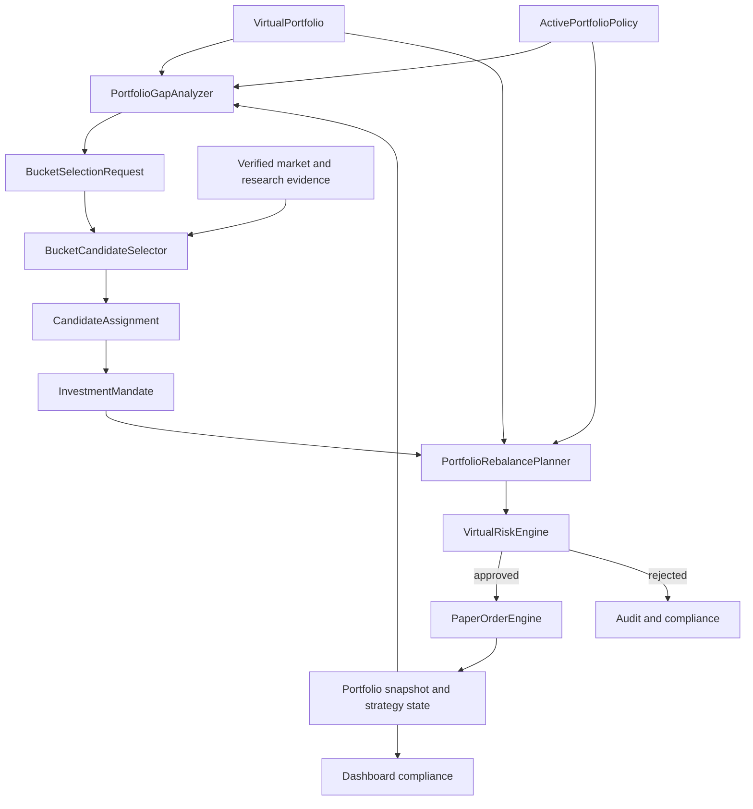

# 전략 포트폴리오 운용 및 버킷 기반 종목 선택 계획

## 1. 문서 목적

이 문서는 paper-only 가상 포트폴리오를 `종목 후보를 먼저 고르는 구조`에서
`포트폴리오 역할과 자금 배분을 먼저 정하고, 부족한 역할에 맞는 종목을 고르는 구조`로
전환하기 위한 제품·도메인·구현 계획을 정의한다.

핵심 결정은 다음과 같다.

> `ActivePortfolioPolicy`가 자금의 역할을 먼저 결정하고,
> `BucketCandidateSelector`는 목표 대비 부족한 strategy bucket만 채운다.

이 문서의 계획은 `BROKER_PROVIDER=mock`, `TRADING_ENABLED=false`,
`AI_DECISION_MODE=paper_only` 경계를 유지한다. 특정 종목 추천, 실계좌 변경,
live `TradingSignal`, live `OrderIntent`, broker mutation은 범위에 포함하지 않는다.

## 2. 문제 정의

현재 코드는 다음 기반을 이미 가지고 있다.

- `long_term`, `swing`, `short_term`, `intraday`, `hedge` strategy bucket
- strategy bucket metadata를 가진 candidate, position, trade contract
- bucket별 exposure와 turnover risk limit
- `PortfolioPolicy` draft validation과 append-only 저장
- strategy bucket별 historical replay preset과 isolated test record
- cash reserve, market regime allocation, hedge, execution cost, portfolio analytics

그러나 이 기능은 하나의 운용 루프로 연결되지 않았다.

- 저장된 `PortfolioPolicy` 중 현재 적용할 정책을 가리키는 active pointer가 없다.
- main portfolio compliance는 저장된 정책의 target을 읽지 못한다.
- 종목의 `strategyBucket`은 주로 universe manifest에 미리 지정된 metadata다.
- 같은 포트폴리오에서 bucket마다 다른 판단 주기와 exit policy를 동시에 적용하지 않는다.
- bucket 목표 비중은 있지만 종목별 역할, 목표 비중, 보유기간과 검토 주기가 없다.
- `holdingPeriodHint`는 validation metadata이며 실제 time-based exit를 강제하지 않는다.
- isolated bucket test 결과를 통합 포트폴리오 정책으로 자동 승격하지 않는다.

결과적으로 현재 시스템은 bucket별 실험은 가능하지만 다음 질문에 일관되게 답하지
못한다.

1. 현재 포트폴리오에서 어떤 역할이 부족한가?
2. 부족한 역할을 어떤 조건의 종목으로 채워야 하는가?
3. 선택된 종목은 어느 정도 비중과 기간으로 보유해야 하는가?
4. 언제 유지, 축소, 교체 또는 청산해야 하는가?
5. 여러 bucket의 판단이 충돌하면 어떤 규칙으로 해결하는가?

## 3. 목표와 비목표

### 3.1 목표

- 정책이 종목 선택보다 항상 먼저 평가된다.
- 하나의 shared virtual portfolio에서 여러 strategy bucket을 함께 운용한다.
- bucket별 목표·허용 비중, 회전율, 낙폭, 보유기간과 판단 주기를 강제한다.
- 종목마다 하나의 명시적인 `InvestmentMandate`를 유지한다.
- 부족한 bucket에 대해서만 candidate selection budget을 사용한다.
- 종목 선택, sizing, rebalance와 exit를 deterministic backend가 계산한다.
- Codex는 구조화된 근거를 바탕으로 후보를 설명하거나 paper-only 판단을 제안할 수
  있지만 최종 allocation과 Risk Engine을 소유하지 않는다.
- policy, mandate, selection, rebalance, risk decision, fill, portfolio snapshot을
  hash와 ID로 추적할 수 있어야 한다.
- historical replay가 동일한 policy와 evidence에서 재현 가능한 결과를 만든다.

### 3.2 비목표

- live trading 또는 실계좌 포트폴리오 변경
- 자연어에서 직접 주문을 생성하는 기능
- 근거가 없는 특정 종목 추천이나 수익률 보장
- AI가 임의로 bucket, target weight 또는 Risk Engine 결과를 확정하는 기능
- 하나의 backtest 최고 수익률만으로 정책을 자동 활성화하는 기능
- 승인되지 않은 외부 데이터나 비공식 Toss source를 live 경로에 연결하는 기능

## 4. 현재 구현 기준선

| 기능 | 현재 상태 | 목표 상태 |
| --- | --- | --- |
| strategy bucket schema | 구현 | 유지 |
| policy draft validation | 구현 | runtime policy contract와 통합 |
| policy append-only 저장 | 구현 | active/retired lifecycle 추가 |
| bucket target/min/max weight | draft에 구현 | 실제 compliance와 sizing에 적용 |
| bucket exposure/turnover gate | 구현, policy 입력 연결은 수동 | active policy에서 자동 파생 |
| bucket별 replay preset | 구현 | shared portfolio orchestration에 재사용 |
| 종목별 bucket | manifest metadata 중심 | deterministic assignment와 mandate로 승격 |
| 종목별 target range | 미구현 | mandate에 추가 |
| 실제 보유기간 상태 | 미구현 | position strategy state에 추가 |
| 통합 rebalance plan | 미구현 | preview와 paper execution 분리 |
| active policy 기반 dashboard | 미구현 | 동일 policy hash로 compliance 계산 |
| 여러 bucket 동시 실행 | 미구현 | cadence-aware orchestrator 추가 |

현재 dashboard policy builder의 초기 draft는 다음 비중을 사용한다. 이 값은 활성
정책이나 투자 권고가 아니라 paper simulation을 시작하기 위한 편집 가능한 예시다.

| Bucket | Target | Min | Max | Max turnover | Max drawdown | Holding hint | Selection trigger | Entry floor |
| --- | ---: | ---: | ---: | ---: | ---: | --- | --- | ---: |
| `long_term` | 35% | 20% | 50% | 15% | 18% | `multi_month` | `below_min` | - |
| `swing` | 20% | 10% | 30% | 35% | 12% | `multi_week` | `below_min` | - |
| `short_term` | 15% | 0% | 25% | 50% | 8% | `multi_day` | `entry_floor_on_due_cycle` | 5% |
| `intraday` | 10% | 0% | 15% | 100% | 4% | `intraday` | `entry_floor_on_due_cycle` | 2% |
| `hedge` | 5% | 0% | 15% | 40% | 6% | `hedge` | `entry_floor_on_due_cycle` | 2% |
| cash | 15% | - | - | - | - | dynamic regime | - | - |

`Selection trigger`와 `Entry floor` 열은 현재 builder에 구현된 값이 아니라 위 초기
비중을 runtime policy로 정규화할 때 추가할 계획 기본값이다.

Policy builder의 drawdown/turnover 값과 historical replay preset의 take-profit,
stop-loss, trailing stop 값은 현재 서로 다른 configuration source다. runtime policy를
도입할 때 두 설정을 하나의 versioned bucket policy로 통합해야 한다.

## 5. 목표 운용 모델



운용 순서는 다음으로 고정한다.

1. active policy와 현재 portfolio를 같은 시점 기준으로 읽는다.
2. mark-to-market 후 bucket, symbol, cash, market, country, currency exposure를 계산한다.
3. 목표 범위를 벗어난 bucket과 position을 찾는다.
4. 축소 또는 청산 계획을 신규 매수 계획보다 먼저 만든다.
5. bucket의 명시적인 `selectionTrigger`가 충족될 때만
   `BucketSelectionRequest`를 만든다.
6. bucket 전용 hard gate와 score로 candidate를 평가한다.
7. backend가 종목별 target range와 최대 notional을 산정한다.
8. Risk Engine이 최신 portfolio와 candidate evidence로 다시 검증한다.
9. 승인된 order만 paper fill로 반영한다.
10. policy/mandate/rebalance/risk/fill lineage를 저장하고 compliance를 다시 계산한다.

## 6. 도메인 계약

아래 contract는 구현 방향을 설명하기 위한 목표 형태다. 실제 schema 추가 시 Zod
strict schema, version, parser, migration과 negative test를 함께 작성한다.

### 6.1 `PortfolioPolicyActivationEvent`

```ts
type PortfolioPolicyActivationEvent =
  | {
      eventType: "activated";
      mode: "paper_only";
      activationId: string;
      portfolioId: string;
      activationSequence: number;
      policyRecordId: string;
      policyId: string;
      policyVersion: string;
      policyHash: string;
      supersedesActivationId?: string;
      effectiveFrom: string;
      createdAt: string;
    }
  | {
      eventType: "retired";
      mode: "paper_only";
      retirementEventId: string;
      portfolioId: string;
      activationSequence: number;
      retiredActivationId: string;
      reasonCode: string;
      effectiveFrom: string;
      createdAt: string;
    };
```

- policy record 자체는 immutable하게 유지한다.
- `activationId`와 `retirementEventId`는 재사용하지 않는다.
- event는 backend가 append 시 부여한 portfolio별 연속 `activationSequence`를 가진다.
  예약·backdate를 지원하지 않으며 `effectiveFrom`은 `createdAt`과 같은 즉시 적용 시각이어야
  한다. 미래 또는 과거 effective time과 sequence gap/duplicate를 거절한다.
- 교체 activation은 현재 active ID를 `supersedesActivationId`로 지정해 한 event에서 이전
  activation을 닫고 새 policy를 연다. policy 없이 중단할 때는 `retiredActivationId`를 가진
  retirement event를 append한다.
- as-of resolver는 `effectiveFrom <= asOf`인 event만 선택한 뒤 `activationSequence` 오름차순으로
  fold하고 supersedes/retired target이 그 시점의 current active와 정확히 일치하는지
  검증한다. unknown target, 이미 닫힌 target과 분기된 transition은 fail-closed한다.
- 같은 `portfolioId`와 시점에 active policy가 0개 또는 2개 이상이면 해당 portfolio
  실행을 fail-closed한다.
- simulation run은 시작 시 policy hash를 고정하며 실행 도중 새 정책으로 바뀌지 않는다.

### 6.2 `StrategyBucketPolicy`

```ts
type TakeProfitPolicy =
  | { mode: "disabled" }
  | {
      mode: "full_exit";
      takeProfitRatio: number;
    }
  | {
      mode: "partial_then_trail";
      takeProfitRatio: number;
      takeProfitSellRatio: number;
      trailingStopFromPeakRatio: number;
    };

interface StrategyBucketExitPolicy {
  takeProfit: TakeProfitPolicy;
  stopLossRatio?: number;
  timeExpiryAction: "review_required" | "sell_all";
}

type EvidenceClass =
  | "market_technical"
  | "fundamental_quality"
  | "portfolio_fit"
  | "execution_fit";

interface EvidenceRequirement {
  evidenceClass: EvidenceClass;
  sourceContractId: string;
  maximumAgeSeconds: number;
  minimumObservationCount?: number;
}

interface BucketSelectionPolicyRecord {
  selectionPolicyRecordId: string;
  bucket: StrategyBucket;
  version: string;
  hash: string;
  requiredEvidence: EvidenceRequirement[];
  everyTickSourceRequirement?: {
    sourceContractId: string;
    eventType: "verified_market_packet";
    maximumAgeSeconds: number;
    dedupeKey: "packet_hash";
  };
  hardGateRuleIds: string[];
  scoringModelVersion: string;
  featureDefinitionRefs: string[];
  createdAt: string;
}

interface BucketSelectionPolicyRef {
  selectionPolicyRecordId: string;
  version: string;
  hash: string;
}

type BucketSelectionTrigger =
  | { mode: "below_min" }
  | {
      mode: "entry_floor_on_due_cycle";
      entryWeightRatio: number;
    };

interface ScheduleBoundaryRecord {
  scheduleBoundaryRecordId: string;
  market: Market;
  version: string;
  hash: string;
  timeZone: string;
  sessionCalendarRecordId: string;
  sessionCalendarVersion: string;
  sessionCalendarHash: string;
  interval: "hourly" | "daily" | "weekly";
  anchorLocalTime: string;
  weeklyAnchorDay?: "monday" | "tuesday" | "wednesday" | "thursday" | "friday";
  nonSessionDayRule: "previous_session" | "next_session";
  createdAt: string;
}

type SessionCalendarEntry =
  | {
      exchangeDate: string;
      sessionKind: "closed";
      sourceEvidenceRefs: string[];
    }
  | {
      exchangeDate: string;
      sessionKind: "regular" | "early_close" | "delayed_open";
      opensAt: string;
      closesAt: string;
      sourceEvidenceRefs: string[];
    };

interface SessionCalendarRecord {
  sessionCalendarRecordId: string;
  market: Market;
  version: string;
  hash: string;
  timeZone: string;
  validFromExchangeDate: string;
  validThroughExchangeDate: string;
  sessions: SessionCalendarEntry[];
  createdAt: string;
}

interface ScheduleBoundaryRef {
  scheduleBoundaryRecordId: string;
  version: string;
  hash: string;
}

type BucketReviewCadence =
  | { mode: "every_tick" }
  | {
      mode: "scheduled";
      boundaryRefs: ScheduleBoundaryRef[];
    };

interface StrategyBucketPolicy {
  bucket: StrategyBucket;
  targetWeightRatio: number;
  minWeightRatio: number;
  maxWeightRatio: number;
  maxTurnoverRatio: number;
  maxDrawdownRatio: number;
  drawdownSemanticsVersion: string;
  drawdownSemanticsHash: string;
  reviewCadence: BucketReviewCadence;
  eventTriggers: Array<
    "regime_change" | "thesis_evidence_change"
  >;
  selectionTrigger: BucketSelectionTrigger;
  minimumHoldingSeconds?: number;
  maximumHoldingSeconds?: number;
  exitPolicy: StrategyBucketExitPolicy;
  enabledMarkets: Market[];
  enabledAssetClasses: string[];
  selectionPolicyRef: BucketSelectionPolicyRef;
}
```

- `holdingPeriodHint`를 실제 cadence와 holding boundary로 구체화한다.
- `entry_floor_on_due_cycle`은 min 값과 무관하게 `entryWeightRatio`를 필수로 가지며
  `minWeightRatio <= entryWeightRatio <= targetWeightRatio`와 양수 조건을 검증한다.
- target이 양수이고 min이 0인 bucket에 `below_min`을 지정하면 empty portfolio에서
  영구적으로 선택 불가능하므로 policy validation에서 거절한다.
- `every_tick`은 `reviewCadence.mode = every_tick`으로 표현하며 `intraday` bucket이고
  참조한 immutable selection policy에
  `everyTickSourceRequirement`가 있을 때만 허용한다.
- scheduled cadence는 대상 market별 immutable `ScheduleBoundaryRecord`를 정확히 하나씩
  참조한다. record는 IANA timezone, versioned session calendar, local anchor, interval,
  weekly anchor와 non-session-day rule을 고정한다. 누락·중복 market, hash mismatch 또는
  policy가 허용한 market과 boundary market 불일치는 activation에서 거절한다.
- `weeklyAnchorDay`는 weekly record에서만 필수이며 hourly/daily record에는 허용하지 않는다.
  `hash`는 ID와 `createdAt`을 제외한 전체 boundary payload의 canonical hash로 검증한다.
- `SessionCalendarRecord`는 exchange date별 session을 중복 없이 정렬해 저장한다. closed
  session은 open/close를 가질 수 없고, open session은 timezone offset이 포함된
  `opensAt < closesAt`을 필수로 가진다. record hash는 ID/createdAt을 제외한 전체 payload를
  묶고 각 entry는 provenance ref를 가져야 한다.
- valid range의 모든 calendar date는 open 또는 closed entry를 정확히 하나 가져야 하며
  provenance ref는 검증된 official calendar evidence/publication으로 resolve되어야 한다.
- boundary resolver는 exact session calendar ID/version/hash를 읽고 market/timezone 일치와
  requested slot의 date coverage를 검증한다. record가 missing/corrupt하거나 date gap이 있으면
  policy activation과 due-cycle 생성을 fail-closed한다.
- `enabledMarkets`는 비어 있지 않은 canonical unique set이어야 한다. scheduled cadence의
  resolved boundary market 집합은 `enabledMarkets`와 정확히 같아야 하고 `every_tick` packet,
  selection request, mandate 및 rebalance action의 market도 이 집합 안에 있어야 한다.
- schedule slot ID와 cutoff는 boundary record 및 session calendar로 계산한다. DST, 휴장,
  조기 종료를 구현체의 local timezone이나 처리 시각으로 추정하지 않는다.
- `risk_breach`는 선택 가능한 `eventTriggers` 값이 아니다. 모든 enabled bucket은 market
  mark, fill, fee, cash-flow와 risk-state update마다 cadence와 무관하게 Risk Engine에서
  재평가되며 breach는 즉시 신규 매수를 차단하고 sell-first reduce-only cycle을 만든다.
- activation과 replay 시작 시 `selectionPolicyRef`가 같은 bucket/version/hash의 immutable
  record로 resolve되어야 한다. required evidence, freshness, source contract, hard gate,
  feature와 scoring version을 구현 기본값으로 대체하지 않는다.
- active `PortfolioPolicy` canonical hash는 각 bucket의 `enabledMarkets`, complete
  `selectionPolicyRef`와 `reviewCadence` boundary ref를 포함해 selection/schedule rule 교체가
  동일 policy hash 아래에서 일어나지 않게 한다.
- take-profit을 사용하지 않으면 `disabled`, 전량 익절은 trigger ratio가 필수인
  `full_exit`, 부분 익절은 trigger/sell/trailing ratio가 모두 필수인
  `partial_then_trail`로만 표현한다. 각 ratio의 범위도 strict validation한다.
- `maximumHoldingSeconds`가 있으면 `timeExpiryAction`을 함께 검증한다.
- holding boundary는 `minimumHoldingSeconds >= 0`, `maximumHoldingSeconds > 0`이고 둘 다
  있으면 반드시 `minimumHoldingSeconds < maximumHoldingSeconds`여야 한다. 같거나 역전된
  값은 policy validation에서 거절한다.
- `review_required`는 만료 시 신규 매수를 차단하고 검토 상태로만 전환한다.
- `sell_all`을 명시한 bucket만 만료 시 reduce-only paper sell candidate를 만들며,
  Risk Engine 재검증을 통과해야 한다.
- lifecycle, stale evidence, Risk Engine reject는 minimum holding보다 우선한다.

### 6.3 `InvestmentMandate`

```ts
type MandateAssignmentLineage =
  | {
      assignmentSource: "manual_policy";
      manualAssignmentEventId: string;
    }
  | {
      assignmentSource: "deterministic_selector";
      selectionRequestId: string;
      candidateAssignmentId: string;
      scoringModelVersion: string;
      selectionScore: number;
    };

type InvestmentMandateRecord = InvestmentMandateBase & MandateAssignmentLineage;

interface InvestmentMandateEventBase {
  mandateEventId: string;
  mandateId: string;
  portfolioId: string;
  market: Market;
  symbol: string;
  bucket: StrategyBucket;
  policyHash: string;
  asOf: string;
  reasonCodes: string[];
}

type InvestmentMandateEvent = InvestmentMandateEventBase &
  (
    | {
        eventType: "activated";
        previousMandateEventId?: string;
      }
    | {
        eventType: "review_required";
        previousMandateEventId: string;
      }
    | {
        eventType: "retired";
        previousMandateEventId: string;
        supersededByMandateId?: string;
      }
  );

interface InvestmentMandateBase {
  mandateId: string;
  portfolioId: string;
  market: Market;
  symbol: string;
  bucket: StrategyBucket;
  policyHash: string;
  asOf: string;
  targetWeightRatio: number;
  minWeightRatio: number;
  maxWeightRatio: number;
  reasonCodes: string[];
  evidenceRefs: string[];
  evidenceAsOf: string;
  reviewCadence: BucketReviewCadence;
  validFrom: string;
  reviewAfter?: string;
  expiresAt?: string;
  createdAt: string;
}

interface ManualAssignmentEventBase {
  manualAssignmentEventId: string;
  portfolioId: string;
  policyHash: string;
  market: Market;
  symbol: string;
  bucket: StrategyBucket;
  asOf: string;
  selectionPolicyRecordId: string;
  selectionPolicyHash: string;
  reasonCodes: string[];
  evidenceRefs: string[];
  evidenceAsOf: string;
  evidenceValidationHash: string;
  authorizationRef: string;
}

type ManualAssignmentEvent = ManualAssignmentEventBase &
  (
    | {
        authorizationScope: "open_or_increase";
        evidenceEligibility: "eligible";
        portfolioSnapshotId: string;
        portfolioSnapshotHash: string;
        sizingInputRecordId: string;
        minWeightRatio: number;
        targetWeightRatio: number;
        maxWeightRatio: number;
        maximumNotionalKrw: number;
        sizingInputHash: string;
        sizingOutputHash: string;
      }
    | {
        authorizationScope: "classify_existing_reduce_only";
        evidenceEligibility: "eligible" | "blocked";
        classificationMinWeightRatio: number;
        classificationTargetWeightRatio: number;
        classificationMaxWeightRatio: number;
      }
  );
```

- 같은 `portfolioId + market + symbol`에는 하나의 active mandate만 허용한다.
- 같은 portfolio 안에서 같은 종목을 두 bucket에 중복 계상하지 않는다.
- mandate record와 event ID는 재사용하지 않는다. record 생성 직후 상태는 `proposed`이며
  status는 event chain을 fold해 `active`, `review_required`, `retired`로 파생한다.
- 첫 activation event만 `previousMandateEventId`를 생략할 수 있다. 이후 event는 현재 chain
  head를 정확히 가리켜야 하며 unknown predecessor, duplicate ID, branch, retired 이후 전이는
  fail-closed한다.
- bucket 변경은 새 mandate record를 먼저 만들고 기존 mandate의 retirement event에
  `supersededByMandateId`를 기록한 뒤 새 mandate를 activate하는 명시적 migration이다.
- resolver가 같은 `portfolioId + market + symbol`에 active mandate를 2개 이상 찾으면 해당
  종목의 신규 매수를 중단한다.
- `deterministic_selector` mandate는 request, assignment, scoring model과 score를 모두
  필수로 보존한다.
- `manual_policy` mandate는 selector lineage field를 포함하지 않고
  `manualAssignmentEventId`를 필수로 보존한다. 해당 append-only event가 먼저 저장되고
  portfolio/policy/symbol/bucket/as-of scope가 mandate와 일치해야 한다.
- manual event의 `open_or_increase`는 active bucket selection policy를 resolve해 자동
  selector와 같은 required evidence, freshness와 hard gate를 통과한 `eligible` 결과 및
  validation hash가 있을 때만 허용한다. 또한 immutable portfolio sizing snapshot과
  selector와 동일한 backend sizing algorithm에서 나온 immutable sizing input record,
  input/output hash, min/target/max range와 maximum notional을 필수로 보존한다.
  `authorizationRef`는 이 gate와 sizing을 우회할 수 없다.
- `classify_existing_reduce_only`는 evidence가 blocked여도 기존 position 분류를 위해
  classification range를 기록할 수 있지만 신규 매수와 수량 증가는 금지한다.
- AI 문자열은 `reasonCodes`나 `evidenceRefs`를 대체할 수 없다.
- target weight는 AI 출력이 아니라 backend sizing 결과다.

### 6.4 `PositionStrategyState`

```ts
type PositionStrategyState =
  | AssignedPositionStrategyState
  | UnassignedLegacyPositionStrategyState;

interface AssignedPositionStrategyState {
  stateKind: "assigned";
  portfolioId: string;
  market: Market;
  symbol: string;
  mandateId: string;
  policyHash: string;
  openedAt: string;
  lastIncreasedAt?: string;
  lastReducedAt?: string;
  lastReviewedAt: string;
  nextReviewAt?: string;
  lastReviewedTriggerRef: string;
  peakPriceKrw: number;
  partialTakeProfitExecuted: boolean;
  thesisStatus: "intact" | "watch" | "invalidated" | "unknown";
}

interface UnassignedLegacyPositionStrategyState {
  stateKind: "unassigned_legacy";
  portfolioId: string;
  market: Market;
  symbol: string;
  observedPositionRef: string;
  reasonCodes: Array<
    "missing_mandate" | "missing_policy_lineage" | "missing_opened_at"
  >;
  detectedAt: string;
  status: "review_required";
}
```

기존 replay-local trailing state를 durable strategy state로 승격한다. portfolio snapshot과
strategy state의 policy/mandate lineage가 일치하지 않으면 신규 매수를 중단한다.
legacy position에 mandate, policy hash 또는 신뢰할 수 있는 `openedAt`이 없으면 값을
추정하지 않고 `unassigned_legacy` variant로 저장한다. 이 variant에는 가상의 lineage나
holding state를 채우지 않으며, 하나라도 존재하면 해당 portfolio의 신규 매수를
fail-closed하고 read-only inspection과 Risk Engine을 통과한 reduce-only 처리만 허용한다.
scheduled cadence mandate/state는 `reviewAfter`/`nextReviewAt`을 필수로 검증한다.
`every_tick`은 두 timestamp를 생략하고 `lastReviewedTriggerRef`에 마지막 처리 market
packet hash를 저장해 다음 packet의 due 여부를 결정한다.

### 6.5 `BucketRiskState`

```ts
interface BucketRiskState {
  riskStateEpochId: string;
  portfolioId: string;
  bucket: StrategyBucket;
  policyHash: string;
  drawdownSemanticsHash: string;
  units: number;
  unitNavKrw: number;
  highWaterMarkUnitNavKrw: number;
  equityKrw: number;
  drawdownRatio: number;
  lastBucketEquityEventId: string;
  asOf: string;
}

type BucketEquityEvent =
  | {
      eventType: "epoch_initialized";
      bucketEquityEventId: string;
      riskStateEpochId: string;
      activationId: string;
      previousRiskStateEpochId?: string;
      portfolioId: string;
      bucket: StrategyBucket;
      policyHash: string;
      drawdownSemanticsHash: string;
      initializationMode: "initial_or_empty" | "carried_forward";
      initialEquityKrw: number;
      initialUnits: number;
      initialUnitNavKrw: number;
      initialHighWaterMarkUnitNavKrw: number;
      asOf: string;
    }
  | {
      eventType: "capital_flow";
      bucketEquityEventId: string;
      previousBucketEquityEventId: string;
      riskStateEpochId: string;
      portfolioId: string;
      bucket: StrategyBucket;
      policyHash: string;
      amountKrw: number;
      rebalancePlanId: string;
      asOf: string;
    }
  | {
      eventType: "valuation";
      bucketEquityEventId: string;
      previousBucketEquityEventId: string;
      riskStateEpochId: string;
      portfolioId: string;
      bucket: StrategyBucket;
      policyHash: string;
      equityDeltaKrw: number;
      evidenceRefs: string[];
      asOf: string;
    }
  | {
      eventType: "execution_cost";
      bucketEquityEventId: string;
      previousBucketEquityEventId: string;
      riskStateEpochId: string;
      portfolioId: string;
      bucket: StrategyBucket;
      policyHash: string;
      equityDeltaKrw: number;
      executionEventId: string;
      evidenceRefs: string[];
      asOf: string;
    };
```

- policy activation은 bucket별 새 `riskStateEpochId`를 만들고 activation ID를 직접 참조하는
  `epoch_initialized` event로 시작한다. 초기화에는 존재하지 않는 rebalance plan을 참조하지
  않는다.
- 기존 bucket risk state가 있고 `drawdownSemanticsHash`가 같으면 `carried_forward`로 이전
  epoch ID, unit NAV와 high-water mark를 그대로 이어받는다. 정책의 다른 field가 바뀌어도
  drawdown history는 초기화되지 않는다.
- 최초 epoch이거나 bucket units/equity가 모두 0인 경우에만 `initial_or_empty`를 허용하고
  unit NAV/high-water mark를 1로 시작한다. exposure가 남은 상태에서 drawdown semantics
  hash가 바뀌면 activation을 거절하며 암묵적인 baseline reset은 허용하지 않는다.
- 모든 initialization에서 `initialEquityKrw >= 0`,
  `initialUnits = initialEquityKrw / initialUnitNavKrw`, high-water mark가 unit NAV 이상인지
  검증한다. 이전 epoch와 high-water mark event는 삭제하지 않는다.
- shared cash와 bucket 사이의 allocation/deallocation은 `capital_flow` event로 기록하고
  flow 직전 unit NAV에서 unit을 mint/burn한다. 따라서 자금 이동 자체는 unit NAV와
  drawdown을 바꾸지 않는다. 양수 amount는 mint, 음수 amount는 burn이며 0 amount와
  보유 unit을 초과하는 burn은 거절한다.
- bucket 내부 BUY/SELL은 asset/cash 교환이므로 체결 notional 자체는 손익이 아니다.
  mark-to-market PnL과 fee/slippage만 equity와 unit NAV를 변경한다.
- `valuation.equityDeltaKrw`는 mark-to-market 결과에 따라 양수 또는 음수일 수 있다.
  `execution_cost.equityDeltaKrw`는 0 이하만 허용하고 fill별 `executionEventId`로 fee/slippage
  근거를 연결한다. 양수 cost, unresolved execution 또는 중복 cost event는 거절한다.
- valuation 후 `highWaterMarkUnitNavKrw = max(previous, unitNavKrw)`,
  `drawdownRatio = 1 - unitNavKrw / highWaterMarkUnitNavKrw`로 계산한다.
- units가 0이면 마지막 unit NAV/high-water mark를 유지하며, 같은 epoch의 재진입은 그
  NAV에서 mint한다. 새 policy activation도 위 `initial_or_empty` 조건이 아니면 baseline을
  재설정할 수 없다.
- epoch의 첫 event는 반드시 predecessor가 없는 `epoch_initialized`여야 한다. 이후 event는
  `previousBucketEquityEventId`를 필수로 가지며 event ID와 predecessor를 선형 append-only로
  검증한다. current snapshot은 event replay로 재구성 가능해야 하며 event/snapshot mismatch나
  누락은 신규 매수를 fail-closed한다.

### 6.6 `PortfolioSizingSnapshot`, `BucketSelectionRequest`와 `CandidateAssignment`

```ts
interface PortfolioExposureSnapshot {
  virtualNetWorthKrw: number;
  cashKrw: number;
  bucketExposureKrw: Record<StrategyBucket, number>;
  symbolExposureKrw: Record<string, number>;
  marketExposureKrw: Record<string, number>;
  sectorExposureKrw: Record<string, number>;
  countryExposureKrw: Record<string, number>;
  currencyExposureKrw: Record<string, number>;
  pendingBuyExposureKrw: number;
  pendingSellExposureKrw: number;
}

interface PortfolioSizingSnapshot {
  portfolioSnapshotId: string;
  portfolioId: string;
  portfolioVersion: string;
  policyHash: string;
  asOf: string;
  virtualPortfolio: VirtualPortfolio;
  valuationInputs: Array<{
    kind: "mark_price" | "fx_rate";
    key: string;
    value: number;
    evidenceRef: string;
    evidenceAsOf: string;
  }>;
  exposureSnapshot: PortfolioExposureSnapshot;
  exposureSnapshotHash: string;
  portfolioSnapshotHash: string;
}

interface BucketSelectionRequest {
  requestId: string;
  portfolioId: string;
  portfolioSnapshotId: string;
  portfolioSnapshotHash: string;
  policyHash: string;
  asOf: string;
  bucket: StrategyBucket;
  gapBasis: "min" | "entry_floor";
  gapKrw: number;
  availableSlots: number;
  maximumAdditionalExposureKrw: number;
  evidenceCutoffAt: string;
}

interface CandidateSizingInputRecord {
  sizingInputRecordId: string;
  requestId: string;
  portfolioId: string;
  portfolioSnapshotId: string;
  portfolioSnapshotHash: string;
  policyHash: string;
  asOf: string;
  market: Market;
  symbol: string;
  bucket: StrategyBucket;
  scoringModelVersion: string;
  sizingAlgorithmVersion: string;
  selectionScore: number;
  exposureKeys: {
    sector: string;
    country: string;
    currency: string;
    classificationEvidenceRef: string;
  };
  featureInputs: Array<{
    featureDefinitionRef: string;
    value: number | boolean | string;
    evidenceRefs: string[];
  }>;
  exposureCapInputs: {
    bucketRemainingKrw: number;
    symbolRemainingKrw: number;
    sectorRemainingKrw: number;
    countryRemainingKrw: number;
    currencyRemainingKrw: number;
    cashAvailableKrw: number;
  };
  liquidityInput: {
    averageDailyNotionalKrw: number;
    maximumParticipationRatio: number;
    maximumLiquidityNotionalKrw: number;
    evidenceRefs: string[];
  };
  executionCostInput: {
    modelVersion: string;
    feeBps: number;
    halfSpreadBps: number;
    slippageBps: number;
    estimatedCostKrw: number;
    evidenceRefs: string[];
  };
  sizingInputHash: string;
  createdAt: string;
}

interface CandidateAssignment {
  assignmentId: string;
  requestId: string;
  sizingInputRecordId: string;
  portfolioId: string;
  portfolioSnapshotId: string;
  portfolioSnapshotHash: string;
  policyHash: string;
  asOf: string;
  market: Market;
  symbol: string;
  bucket: StrategyBucket;
  eligibility: "eligible" | "watch" | "blocked";
  minWeightRatio: number;
  targetWeightRatio: number;
  maxWeightRatio: number;
  maximumNotionalKrw: number;
  selectionScore: number;
  reasonCodes: string[];
  evidenceRefs: string[];
  scoringModelVersion: string;
  sizingInputHash: string;
  sizingOutputHash: string;
}
```

`watch`와 `blocked` candidate는 주문 후보가 될 수 없다. required evidence가 없거나
stale이면 높은 score가 있더라도 `eligible`로 승격하지 않는다.
`PortfolioSizingSnapshot`은 해당 시점의 paper `VirtualPortfolio`, 실제 사용한 mark/FX
값과 provenance, 계산된 exposure payload를 canonical form으로 append-only 저장한다.
request의 snapshot ID/hash가 이 immutable record와 일치하지 않으면 selection과 sizing을
거절한다.
`CandidateSizingInputRecord`는 policy/snapshot/request scope, versioned feature value와 evidence,
exposure cap, liquidity 및 execution cost model input 전체를 canonical form으로 append-only
저장한다. `sizingInputHash`는 record ID, hash와 생성 시각을 제외한 이 전체 payload에서
계산한다. assignment는 exact record ID/hash를 직접 보존하며 record가 resolve되지 않거나
scope/hash가 다르면 생성하지 않는다.
feature/evidence ref와 분류 metadata는 모두 resolve되어야 하며 array와 exposure key는
canonical order로 정규화한다. sizing algorithm version이 다르면 같은 input으로 취급하지 않는다.
`sizingOutputHash`는 계산된 min/target/max weight range와 최대 notional을 canonicalize해
만든다. selector mandate의 range는 assignment 값과 정확히 같아야 하며 input/output hash
검증을 모두 통과해야 한다. assignment의 portfolio/snapshot/policy/as-of scope는 request를
읽지 못해도 독립 검증할 수 있도록 직접 저장하고, resolve 가능한 request와도 일치해야 한다.

### 6.7 `RebalancePlanRecord`와 `RebalancePlanEvent`

```ts
interface RebalanceActionBase {
  actionId: string;
  actionSequence: number;
  market: Market;
  symbol: string;
  targetNotionalKrw: number;
  maximumNotionalKrw: number;
  reasonCodes: string[];
}

type RebalanceAction = RebalanceActionBase &
  (
    | {
        lineageKind: "mandate";
        side: "BUY" | "SELL";
        mandateId: string;
      }
    | {
        lineageKind: "unassigned_legacy_reduce_only";
        side: "SELL";
        observedPositionRef: string;
        legacyStateDetectedAt: string;
      }
  );

interface RebalancePlanRecord {
  planId: string;
  cycleId: string;
  portfolioId: string;
  portfolioVersion: string;
  portfolioSnapshotHash: string;
  policyHash: string;
  evidenceCutoffAt: string;
  triggerRef: string;
  phase: "sell" | "buy";
  predecessorPlanId?: string;
  predecessorAppliedPlanEventId?: string;
  actions: [RebalanceAction, ...RebalanceAction[]];
  planHash: string;
  createdAt: string;
}

interface PortfolioActionRiskDecision {
  riskDecisionId: string;
  planId: string;
  actionId: string;
  portfolioId: string;
  policyHash: string;
  expectedPortfolioVersion: string;
  expectedPortfolioSnapshotHash: string;
  market: Market;
  symbol: string;
  side: "BUY" | "SELL";
  actionTargetNotionalKrw: number;
  priorCumulativeFilledNotionalKrw: number;
  requestedNotionalKrw: number;
  decision: "approved" | "rejected";
  ruleResults: Array<{
    ruleId: string;
    result: "pass" | "fail";
    reasonCode: string;
  }>;
  riskInputHash: string;
  decidedAt: string;
}

type RebalancePlanEvent =
  | {
      planEventId: string;
      previousPlanEventId?: never;
      eventType: "previewed";
      planId: string;
      cycleId: string;
      portfolioId: string;
      portfolioVersion: string;
      portfolioSnapshotHash: string;
      policyHash: string;
      asOf: string;
    }
  | {
      planEventId: string;
      previousPlanEventId: string;
      eventType: "approved" | "rejected" | "stale";
      planId: string;
      cycleId: string;
      portfolioId: string;
      portfolioVersion: string;
      portfolioSnapshotHash: string;
      policyHash: string;
      asOf: string;
      reasonCodes: string[];
    }
  | {
      planEventId: string;
      previousPlanEventId: string;
      eventType: "execution_applied";
      planId: string;
      cycleId: string;
      portfolioId: string;
      portfolioVersion: string;
      portfolioSnapshotHash: string;
      policyHash: string;
      asOf: string;
      actionId: string;
      actionSequence: number;
      fillSequence: number;
      fillId: string;
      requestedNotionalKrw: number;
      filledNotionalKrw: number;
      cumulativeFilledNotionalKrw: number;
      riskDecisionId: string;
      expectedPrePortfolioVersion: string;
      expectedPrePortfolioSnapshotHash: string;
      resultingPortfolioVersion: string;
      resultingPortfolioSnapshotHash: string;
    }
  | {
      planEventId: string;
      previousPlanEventId: string;
      eventType: "applied";
      planId: string;
      cycleId: string;
      portfolioId: string;
      portfolioVersion: string;
      portfolioSnapshotHash: string;
      policyHash: string;
      asOf: string;
      executionEventIds: string[];
      resultingPortfolioVersion: string;
      resultingPortfolioSnapshotHash: string;
    };
```

- plan 본문은 immutable `RebalancePlanRecord`로 한 번만 저장한다. `planHash`는 plan ID와
  생성 시각을 제외한 scope와 ordered action payload의 canonical hash다.
- 동일 cycle ID의 동일 scope/hash 재시도는 기존 plan을 반환한다. 같은 cycle ID에 다른
  scope, action 또는 hash를 쓰거나 두 번째 plan을 만드는 요청은 거절한다.
- 하나의 plan에는 한 side만 포함한다. 같은 orchestration trigger에 SELL과 BUY가 모두
  필요하면 `sell` plan을 먼저 적용하고, 새 mark/risk snapshot에서 `buy` plan을 다시
  산출한다. 후속 plan은 새 cycle ID와 `predecessorPlanId`/
  `predecessorAppliedPlanEventId`로 선행 SELL 결과를 직접 연결한다.
- action sequence는 0부터 gap 없이 증가하고 action ID는 plan 안에서 unique해야 한다.
  `sell` plan에는 SELL만, `buy` plan에는 BUY만 허용한다. 두 predecessor field는 함께
  존재하거나 함께 생략하며 predecessor는 terminal `applied`이고 그 resulting snapshot이
  후속 plan의 preview snapshot과 같아야 한다.
- `targetNotionalKrw`는 immutable plan이 실제 요청하는 양수 금액이며
  `targetNotionalKrw <= maximumNotionalKrw`를 검증한다. executor는 이 값을 cap 안에서 다시
  선택하지 않는다. SELL은 snapshot의 가용 position notional도 넘을 수 없다.
- 일반 action은 active mandate를 참조한다. `unassigned_legacy_reduce_only`는 mandate ID를
  합성하지 않고 저장된 legacy state의 `observedPositionRef`/`detectedAt`을 직접 참조하며
  SELL만 허용한다. 이 variant도 lifecycle/Risk Engine 검증을 우회할 수 없다.
- 첫 event는 predecessor가 없는 `previewed`여야 한다. 이후 event는 직전 event ID를
  `previousPlanEventId`로 참조하며 record와 동일한 plan/cycle/portfolio/version/snapshot/
  policy scope를 직접 저장한다.
- 허용 전이는 `previewed -> approved | rejected | stale`, `approved -> execution_applied |
  rejected | stale`, `execution_applied -> execution_applied | applied | rejected |
  stale`뿐이다. `rejected`, `stale`, `applied`는 terminal이며 unknown predecessor, duplicate
  event ID, branch, terminal 이후 event는 거절한다.
- 각 paper fill 직후 `execution_applied`를 durable하게 기록한다. event는 action/fill별 Risk
  Engine decision과 실행 직전 expected version/snapshot, 실행 직후 resulting version/snapshot을
  일대일로 보존한다. fill ID는 plan 전체에서 unique하고 같은 fill을 재기록할 수 없다.
- `PortfolioActionRiskDecision`은 기존 범용 decision ID를 그대로 신뢰하지 않고 plan/action,
  policy, market/symbol/side, action target, prior cumulative, 이번 requested notional과 expected
  pre-state를 canonical risk input hash에 묶는다. `execution_applied` 전에 exact record가
  resolve되고 `approved`이며 action, amount와 expected state가 모두 일치해야 한다.
  stale/unrelated/rejected decision은 실행할 수 없다.
- action별 fill sequence는 0부터 gap 없이 증가하고 `filledNotionalKrw > 0`,
  `cumulativeFilledNotionalKrw = previous cumulative + filledNotionalKrw`, cumulative가 action의
  `targetNotionalKrw` 이하인지 append 전에 검증한다. requested notional은 남은 target 이하이고
  filled notional은 requested 이하이어야 한다. event는 action sequence/fill sequence 순서로만
  append하며 다음 action은 이전 action이 target을 채운 뒤에만 시작한다. retry는 기존 fill
  ID/event를 반환하며 새 ID로 같은 체결을 중복 계상할 수 없다.
- 첫 fill 전에는 plan record의 preview version/snapshot을 current state와 비교한다. 이후
  fill의 expected pre-state는 직전 `execution_applied`의 resulting state와 같아야 한다.
  이 선형 chain에 기록된 in-plan mutation은 stale이 아니며, 그 외 version/snapshot drift는
  plan을 terminal `stale`로 만든다.
- `applied`는 모든 action의 cumulative filled notional이 각 `targetNotionalKrw`와 정확히
  같고 체결 결과가 event chain에 기록된 뒤에만 만들고
  ordered `executionEventIds`와 최종 portfolio version/snapshot을 보존한다. 한 plan에 정확히
  한 번만 존재할 수 있다.
- current plan state는 event chain fold로 재구성한다. 재시작 후 snapshot/cache와 replay
  결과가 다르거나 chain이 불완전하면 신규 적용을 fail-closed한다.

## 7. Bucket별 종목 선택 정책

모든 종목을 하나의 공통 ranking으로 줄 세우지 않는다. 공통 lifecycle/freshness/
liquidity gate를 통과한 뒤 bucket별 feature set과 threshold를 적용한다.

| Bucket | 주요 목적 | 우선 evidence | 배제 또는 감점 조건 |
| --- | --- | --- | --- |
| `long_term` | 완만한 장기 성장과 자본 보존 | 장기 추세 지속성, realized volatility, drawdown, liquidity, 재무 안정성 | 불충분한 장기 이력, 높은 구조적 변동성, 필수 재무 evidence 누락 |
| `swing` | 수주 단위 추세 포착 | 중기 momentum, volume confirmation, trend persistence, gap risk | 약한 추세, 과도한 gap/impact, stale signal |
| `short_term` | 수일 단위 전술 기회 | 단기 momentum, 거래대금, 변동성 범위, 명확한 exit distance | 낮은 유동성, 손익비 부족, 이벤트 불확실성 |
| `intraday` | 당일 변동 활용 | intraday interval, spread, participation, volume, market impact | daily-only data, stale quote, 당일 청산 근거 부족 |
| `hedge` | 전체 하방 노출 감소 | downside exposure reduction, correlation evidence, hedge cost | gross만 늘리는 hedge, metadata 누락, 비용 상한 초과 |

### 7.1 Evidence 단계

현재 가격·거래량 snapshot만으로 검증 가능한 범위와 추가 source가 필요한 범위를
분리한다.

1. `market_technical`
   - 수익률, realized volatility, drawdown, trend persistence, volume과 liquidity
   - 현재 historical ingestion으로 계산 가능한 범위
2. `fundamental_quality`
   - 매출·이익·현금흐름 안정성, 부채, 배당 지속성 같은 장기 품질 evidence
   - provenance가 확인된 별도 read-only source contract 필요
3. `portfolio_fit`
   - 기존 position과의 sector/country/currency correlation 및 concentration 영향
4. `execution_fit`
   - spread, 예상 participation, slippage와 market impact

`long_term` policy가 `fundamental_quality`를 required로 선언한 경우 해당 source가 없는
candidate는 `unknown` 또는 `blocked`로 남긴다. 가격 상승만으로 기업 안정성을
추정하지 않는다.

### 7.2 Score와 sizing 분리

- `selectionScore`는 같은 bucket 안에서 candidate 우선순위를 정한다.
- score는 target weight를 직접 결정하지 않는다.
- backend는 bucket gap, available slots, symbol cap, liquidity cap, concentration cap,
  cash reserve와 execution cost를 적용해 target range를 산정한다.
- 동일 candidate evidence, feature input과 scoring model version은 동일한 정렬과
  reason code를 만들어야 한다.
- sizing 재현성은 `policyHash`, versioned portfolio snapshot, selection request,
  candidate assignment, exposure/liquidity cap과 execution cost를 포함한 전체
  `sizingInputHash`에 묶는다. 동일한 전체 입력만 동일한 target range와 최대 notional을
  만들어야 한다.
- 동점은 `market`, `symbol` canonical order로 해소해 replay 재현성을 보장한다.

초기 sizing은 복잡한 최적화보다 다음 bounded allocation을 사용한다.

1. bucket gap을 available slot 수로 나눈 기본 notional을 계산한다.
2. candidate score에 따른 deterministic multiplier를 허용 범위 안에서 적용한다.
3. symbol, bucket, sector, country, currency, liquidity limit 중 가장 작은 cap을 적용한다.
4. 최소 주문 단위보다 작거나 비용 대비 편익 threshold를 넘지 못하면 거래하지 않는다.
5. exact target을 추적하지 않고 min/max rebalance band 안에서는 유지한다.

## 8. Portfolio gap과 리밸런싱

### 8.1 Gap 계산

각 bucket에 대해 다음 값을 산출한다.

```text
currentWeight = bucketExposureKrw / virtualNetWorthKrw
targetGapKrw = max(0, targetWeightKrw - currentExposureKrw)
overweightKrw = max(0, currentExposureKrw - maxWeightKrw)
underweightKrw = max(0, minWeightKrw - currentExposureKrw)
entryWeightKrw = selectionTrigger.entryWeightRatio * virtualNetWorthKrw
entryGapKrw = max(0, entryWeightKrw - currentExposureKrw)
```

- `selectionTrigger.mode = below_min`이면 `underweightKrw > 0`일 때만 request를 만든다.
- `targetGapKrw`는 compliance와 목표 대비 drift 표시용이며 그 자체로 매수 요청이나
  exact-target 추격을 발생시키지 않는다.
- `selectionTrigger.mode = entry_floor_on_due_cycle`이면 bucket cadence 또는 event trigger가
  도래했고 `entryGapKrw > 0`일 때만 request를 만든다. 이 모드는 min이 0인 선택적
  bucket을 empty portfolio에서 bootstrap하되 entry floor까지만 채우는 명시적 band
  예외다. entry floor에 도달한 뒤에는 target을 추격하지 않는다.
- target보다 낮지만 min 이상인 `below_min` bucket은 비용과 turnover를 고려해 유지한다.
- `entry_floor_on_due_cycle`도 required evidence, buy capacity, cash reserve, cost와 turnover
  gate를 통과하지 못하면 request 또는 trade를 만들지 않는다.
- max를 넘으면 신규 매수를 차단하고 sell/rebalance candidate를 만든다.
- cash reserve 미달이면 모든 신규 매수를 차단한다.

### 8.2 결정 우선순위

하나의 orchestration cycle에서 다음 우선순위를 고정한다.

1. lifecycle invalidation과 명시적인 fail-closed safety action
2. stop-loss와 risk limit 위반 축소
3. stale/missing critical evidence의 신규 매수 차단과 보유 position review
4. maximum holding review와 thesis invalidation
5. bucket/symbol overweight rebalance
6. take-profit와 trailing stop
7. cash/hedge reserve 복구
8. policy selection trigger를 충족한 bucket 신규 매수

SELL과 BUY가 같은 orchestration trigger에서 필요하면 side별 plan을 분리한다. SELL plan을
먼저 paper fill하고 mark-to-market 및 risk snapshot을 다시 만든 뒤 새 snapshot/version에
묶인 BUY plan을 생성·평가한다. 두 plan은 predecessor로 연결하되 cycle ID는 각각의 snapshot
기준으로 다르다. 같은 종목에 상충하는 BUY/SELL을 동시에 발행하지 않는다.

### 8.3 Idempotency와 동시성

```ts
type PortfolioCycleTrigger =
  | {
      triggerKind: "scheduled";
      scheduleBoundaryHash: string;
      scheduleSlotId: string;
      slotEndsAt: string;
    }
  | {
      triggerKind: "every_tick";
      packetHash: string;
      packetAsOf: string;
    }
  | {
      triggerKind: "policy_event";
      eventType: "regime_change" | "thesis_evidence_change";
      eventRef: string;
      eventAsOf: string;
    }
  | {
      triggerKind: "risk_breach";
      stateUpdateKind: "market_mark" | "fill" | "fee" | "cash_flow" | "risk_state";
      stateUpdateRef: string;
      stateUpdateAsOf: string;
    };
```

- cycle ID는 `portfolioId + policyHash + portfolioVersion + portfolioSnapshotHash +
  evidenceCutoffAt + triggerIdentity + triggerRef`에서 파생한다.
- `PortfolioCycleTrigger`에서 identity/ref/cutoff를 한 가지 방식으로만 만든다. scheduled는
  `triggerIdentity = scheduled:<scheduleBoundaryHash>`, ref는 canonical slot ID, cutoff는 slot
  end다. `every_tick` identity는 `every_tick`, ref는 packet hash, cutoff는 packet `asOf`다.
  policy event identity는 `event:<eventType>`, ref/cutoff는 immutable event ref/`asOf`다. risk
  breach identity는 `risk_breach:<stateUpdateKind>`, ref/cutoff는 원인이 된 immutable state
  update ref/`asOf`다. union에 없는 trigger나 field 조합은 거절한다.
- `evidenceCutoffAt`은 처리 시작 시각이 아니라 trigger에서 canonical하게 파생한다.
  scheduled cycle은 schedule slot end, `every_tick`은 packet `asOf`, event trigger는 event
  `asOf`를 사용하며 같은 `triggerRef`가 다른 cutoff를 제시하면 거절한다.
- 같은 cycle ID의 rebalance plan은 한 번만 적용한다.
- plan의 preview, approval, fill execution, rejection, stale, applied 상태는 immutable plan
  record와 선형 append-only event chain으로 저장하며 재시작 후 replay로 current state를
  복원한다.
- 첫 실행 전 portfolio version/snapshot 또는 policy hash가 preview와 다르면 plan을 terminal
  `stale`로 기록하고 적용하지 않는다. 실행 시작 후에는 직전 `execution_applied`가 선언한
  resulting state만 다음 action의 expected state로 허용한다. 다른 drift는 `stale`이며, 새
  snapshot/version은 새 cycle ID를 만들므로 replacement 또는 SELL 후속 BUY preview를
  생성할 수 있다.
- multi-process 실행 전 portfolio-scoped lock 또는 compare-and-swap version을 둔다.
- decision/trade/portfolio/strategy-state 저장 실패가 부분 상태를 만들지 않도록 durable
  transaction boundary 또는 재구성 가능한 append-only event contract가 필요하다.

## 9. Multi-bucket orchestration

각 bucket은 같은 portfolio를 사용하되 정상 review/selection은 자신의 cadence가 도래했을
때만 평가한다. risk breach 검사는 아래 cadence와 별도로 모든 relevant state update마다
강제한다.

| Bucket | 초기 paper cadence | 실행 조건 |
| --- | --- | --- |
| `long_term` | weekly | 정기 review, thesis/evidence 변경, risk breach |
| `swing` | daily | market close snapshot과 중기 signal 갱신 |
| `short_term` | daily | 신선한 단기 signal과 exit evidence 존재 |
| `intraday` | `hourly` 또는 `every_tick` | intraday source와 liquidity evidence가 모두 준비된 경우 |
| `hedge` | daily 또는 regime change | 하방 노출과 hedge effectiveness 재계산 |

표의 cadence는 운영 의도를 나타내는 초기값이다. 실제 due 시각과 schedule slot은 policy가
참조한 market별 `ScheduleBoundaryRecord`에서만 계산하며 서버 timezone이나 단순 UTC 날짜
경계에 의존하지 않는다.
daily data만 있는 실행에서 `intraday`를 활성화하지 않는다. cadence별 source requirement가
충족되지 않으면 해당 bucket만 `degraded` 또는 `blocked`로 두고 다른 bucket의 read-only
평가를 계속할 수 있다.
`every_tick`은 busy loop가 아니라 새로 검증된 market packet event마다 한 번 실행한다.
동일 packet hash의 중복 event는 같은 cycle ID로 수렴해 한 번만 처리한다. 정기 cadence
외 `regime_change`와 thesis evidence 변경은 `eventTriggers`로 선언한다. risk breach는
선택형 trigger가 아니며 모든 enabled bucket에 항상 적용한다.

## 10. Policy lifecycle과 저장 artifact

계획된 artifact는 모두 paper-only이며 real account identifier를 포함하지 않는다.

| Artifact | 형태 | 책임 |
| --- | --- | --- |
| `bucket-selection-policy-records.jsonl` | 신규 append-only | evidence/freshness/hard gate/scoring rule set |
| `session-calendar-records.jsonl` | 신규 append-only | exchange-date별 session과 provenance |
| `schedule-boundary-records.jsonl` | 신규 append-only | market timezone, calendar와 cadence slot boundary |
| `portfolio-policy-records.jsonl` | 기존 append-only | validated immutable policy |
| `portfolio-policy-activations.jsonl` | 신규 append-only | portfolio별 active/retired policy lineage |
| `manual-assignment-events.jsonl` | 신규 append-only | manual mandate authorization과 sizing lineage |
| `instrument-mandate-records.jsonl` | 신규 append-only | immutable 종목 역할·target·evidence |
| `instrument-mandate-events.jsonl` | 신규 append-only | mandate activate/review/retire transition chain |
| `position-strategy-state.json` | 신규 snapshot | 현재 보유기간·peak·review 상태 |
| `bucket-equity-events.jsonl` | 신규 append-only | bucket capital flow, valuation, execution cost |
| `bucket-risk-state.json` | 신규 snapshot | unit NAV, high-water mark와 drawdown current state |
| `portfolio-sizing-snapshots.jsonl` | 신규 append-only | sizing 시점의 virtual portfolio, mark와 exposure |
| `candidate-sizing-input-records.jsonl` | 신규 append-only | feature, exposure/liquidity cap과 execution cost input |
| `portfolio-gap-snapshots.jsonl` | 신규 append-only | policy 대비 현재 gap |
| `bucket-selection-requests.jsonl` | 신규 append-only | snapshot/policy에 묶인 bucket selection 요청 |
| `candidate-assignments.jsonl` | 신규 append-only | request별 eligibility, score, sizing 입력과 결과 |
| `rebalance-plan-records.jsonl` | 신규 append-only | immutable plan scope, action과 canonical hash |
| `portfolio-action-risk-decisions.jsonl` | 신규 append-only | plan/action/pre-state별 Risk Engine 최종 판단 |
| `rebalance-plan-events.jsonl` | 신규 append-only | preview, approval, fill execution, rejection, stale, applied transition chain |

정책에 묶인 selector, mandate와 rebalance downstream artifact는 최소한 `policyHash`,
`portfolioId`, `asOf`를 record 또는 record envelope에 직접 포함하고, source/evidence
ref가 적용되면 해당 ref도 직접 포함한다. `unassigned_legacy`는 policy lineage가 없음을
명시하는 예외다. corrupt line이나 lineage mismatch는 경고만 표시하고 계속 매수하는
대신 fail-closed한다.
legacy position의 안전한 축소는 `unassigned_legacy_reduce_only` action만 사용하며 fabricated
mandate 없이 observed position과 legacy state에 연결한다. 이 경로로 BUY 또는 increase를
표현할 수 없다.
selector가 만든 mandate는 immutable portfolio sizing snapshot, request, sizing input과
assignment record를 순서대로 append-only 저장한 뒤에만 발행한다. 각 ID가 resolve되지
않거나 policy/snapshot/scoring/sizing lineage가 일치하지 않으면 mandate 생성을 거절한다.
manual mandate도 `ManualAssignmentEvent`를 먼저 저장하고 scope와 해당 sizing 또는
classification range가 일치할 때만 발행한다. 신규 매수를 허용하는 manual event는 active
selection policy의 동일한 evidence/freshness/hard gate와 immutable portfolio snapshot 기반
sizing input record 및 backend sizing input/output hash까지 검증한다. active policy가 참조하는
selection policy record가 없거나 hash가 다르면 candidate evaluation과 신규 매수를
fail-closed한다.

## 11. API와 Dashboard 계획

### 11.1 Local Operations API

기존 endpoint는 유지한다.

```text
POST /paper/policies/validate
POST /paper/policies
```

계획 endpoint는 다음과 같다.

```text
GET  /paper/policies/active
POST /paper/policies/{policyRecordId}/activate
GET  /virtual/portfolio/gaps
POST /paper/portfolio/rebalance/preview
GET  /paper/portfolio/rebalance/plans/{planId}
```

- `GET`은 read-only다.
- policy activation과 rebalance preview 저장은 same-origin, mutation token, explicit
  operation header를 요구하는 guarded paper-only mutation이다.
- preview는 paper order를 실행하지 않는다.
- 실제 paper execution endpoint는 별도 PR에서 idempotency와 version check가 갖춰진 뒤
  추가한다.
- 어떤 endpoint도 live order 또는 broker mutation을 만들지 않는다.

### 11.2 Dashboard

`/dashboard/portfolio`는 같은 active policy hash를 기준으로 다음을 표시한다.

- bucket별 target/min/current/max와 KRW gap
- 종목별 mandate, target range, 보유기간, 다음 review 시각
- selection evidence freshness와 blocked reason
- 예정된 rebalance action과 예상 비용
- cash reserve와 hedge effectiveness
- policy version, activation 시각과 마지막 orchestration cycle

target policy를 읽지 못하면 현재처럼 임의의 `0%` target이나 `ok`를 표시하지 않고
`missing_policy`로 명확히 구분한다.

## 12. Historical replay와 검증 정책

- replay run은 active pointer를 실시간으로 따라가지 않고 시작 시 고정한 policy record를
  사용한다.
- 각 bucket isolated replay와 full shared-portfolio replay를 모두 실행한다.
- isolated 결과가 좋아도 full policy로 자동 승격하지 않는다.
- train 결과로 선택한 policy는 validation/test holdout에서 별도로 평가한다.
- 거래비용, turnover, drawdown, rejection, provider failure와 missing evidence를 수익률과
  함께 기록한다.
- long-term candidate는 데이터 window가 짧거나 fundamental evidence가 없으면 별도
  `evidence_insufficient` 상태로 보고한다.
- 결과 보고는 paper-only research artifact이며 투자 성과로 표현하지 않는다.

## 13. 구현 순서

각 단계는 독립적으로 review/revert할 수 있는 작은 PR로 진행한다.

### PR 1. Runtime policy contract와 activation lineage

- current validation candidate를 runtime `PortfolioPolicy` contract로 정규화
- immutable bucket selection policy ref와 resolver validation
- immutable market schedule boundary ref와 timezone/calendar/hash validation
- immutable session calendar record와 date-coverage resolver
- append-only activation record와 single-active fail-closed resolver
- policy hash/version parser와 migration test
- runner와 order engine에는 아직 연결하지 않음

완료 조건:

- `portfolioId`별 active policy 1개를 deterministic하게 읽는다.
- 해당 portfolio의 active policy 없음, 중복 active, corrupt lineage를 모두 거절한다.
- enabled market 집합과 scheduled boundary market 집합이 정확히 일치한다.

### PR 2. Active policy 기반 portfolio compliance

- `portfolio-compliance`가 active policy target/min/max를 읽도록 연결
- bucket gap과 `under`, `over`, `ok`, `missing_policy` 계산
- dashboard에 실제 policy version과 gap 표시

완료 조건:

- 저장 정책과 화면 target이 같은 policy hash를 사용한다.
- policy가 없을 때 `0% target`을 정상값처럼 표시하지 않는다.

### PR 3. `InvestmentMandate`와 position strategy state

- immutable mandate record/event chain, assigned/unassigned legacy state와 manual assignment
  event의 strict schema/repository
- portfolio 안에서 한 종목 하나의 active mandate invariant
- 기존 position의 `unassigned_legacy` migration
- position peak/review/holding age와 bucket unit-NAV drawdown state persistence

완료 조건:

- 모든 신규 paper position이 mandate와 policy hash를 가진다.
- selector가 만든 mandate는 request, assignment와 scoring model lineage를 가진다.
- manual mandate는 먼저 저장된 assignment event와 scope/range가 일치한다.
- manual `open_or_increase`는 selector와 같은 evidence gate를 통과하고,
  `classify_existing_reduce_only`는 buy/increase를 만들지 않는다.
- lineage 또는 holding timestamp가 없는 legacy position은 값을 자동 추정하지 않고
  `unassigned_legacy`와 `review_required`로 구분하며 해당 portfolio의 신규 매수를 막는다.
- mandate event chain의 branch/unknown predecessor/terminal transition을 거절한다.
- 재시작 후 bucket equity event replay와 risk snapshot이 같은 unit NAV/high-water mark를 만든다.

### PR 4. `PortfolioGapAnalyzer`

- bucket/symbol/cash gap read model
- min/max band와 available slot 계산
- immutable portfolio sizing snapshot과 mark provenance repository
- policy의 `selectionTrigger`별 request 생성 조건
- selection request append-only repository

완료 조건:

- overweight bucket은 신규 candidate request를 만들지 않는다.
- `below_min` request는 `underweightKrw > 0`일 때만, `entry_floor_on_due_cycle` request는
  due cycle에서 `entryGapKrw > 0`일 때만 생성된다.
- min이 0이고 target이 양수인 선택적 bucket은 명시적인 entry floor까지만 empty
  portfolio bootstrap이 가능하며 floor 도달 후 target을 반복 추격하지 않는다.
- cash reserve 미달이면 모든 buy capacity가 0이다.

### PR 5. Bucket candidate selector contract

- 공통 hard gate와 bucket별 scoring interface
- immutable selection policy record와 hash resolver
- price/volume 기반 `market_technical` feature부터 구현
- evidence completeness와 scoring model version 기록
- candidate assignment append-only repository와 request lineage 검증
- canonical candidate sizing input repository와 input hash replay
- manifest bucket은 observed metadata로 유지하되 자동 acceptance 근거로 사용하지 않음

완료 조건:

- 같은 입력은 같은 ordering과 reason code를 만든다.
- policy가 요구하는 evidence/source/freshness rule을 exact record에서 읽는다.
- required evidence가 없는 candidate는 fail-closed한다.
- sizing input record에서 feature, exposure/liquidity cap과 cost input을 재구성해 같은 hash와
  output range를 만든다.

### PR 6. Rebalance preview planner

- sell-first deterministic plan
- target range, turnover, cost와 liquidity threshold
- portfolio/policy version binding과 idempotency key
- immutable plan record와 append-only state event chain
- side별 chained plan과 fill별 risk decision/execution state lineage
- action-scoped risk decision resolver와 partial-fill cumulative guard
- read-only preview 및 artifact 저장

완료 조건:

- preview는 portfolio와 trade를 변경하지 않는다.
- stale preview 또는 version mismatch를 적용할 수 없다.
- plan 상태는 허용된 선형 transition만 가지며 재시작 후 동일하게 복원된다.
- terminal plan은 재승인·재적용할 수 없고 applied plan은 정확히 한 번만 적용된다.
- SELL/BUY가 함께 필요하면 SELL applied snapshot에 묶인 별도 BUY plan만 생성된다.
- 모든 fill이 Risk Engine decision과 pre/resulting portfolio state에 연결된다.
- partial fill 누계가 action target을 넘지 않고 target 미달 plan은 applied가 될 수 없다.
- 각 action은 cap과 별도의 concrete target notional을 가지며 executor가 금액을 재결정하지 않는다.
- unassigned legacy position은 observed state에 연결된 reduce-only SELL로만 표현된다.

### PR 7. Shared portfolio multi-bucket paper orchestrator

- cadence scheduler와 conflict resolver
- bucket별 exit policy와 selection request 실행
- 각 fill 후 mark-to-market 및 risk snapshot 재평가
- paper-only execution과 audit lineage

완료 조건:

- 하나의 cycle에서 상충하는 BUY/SELL이 발생하지 않는다.
- 모든 paper fill이 policy, mandate, decision, risk decision과 연결된다.

### PR 8. Integrated replay와 운영 화면

- isolated bucket과 full portfolio 비교
- target drift, turnover, cost, drawdown, evidence gap report
- mandate timeline과 rebalance plan dashboard
- E2E, accessibility, replay reproducibility 검증

완료 조건:

- 동일 fixture, policy, seed가 동일 final portfolio와 lineage hash를 만든다.
- dashboard가 backend ViewModel만 사용해 compliance를 표시한다.

### 후속 단계. Fundamental evidence source

- 공식적이고 provenance를 보존하는 read-only 재무 데이터 contract
- credential, 비용, 라이선스 또는 외부 계정 설정이 필요하면 owner 판단 후 진행
- source가 준비되기 전에는 long-term quality를 가격 데이터만으로 확정하지 않음

## 14. 테스트 전략

### Contract 및 invariant

- bucket target + cash target 합계 100%
- target이 min/max 범위 안에 존재
- policy hash canonicalization과 version compatibility
- activation sequence gap/duplicate와 future/backdated effective time 거절
- as-of activation fold와 supersedes/retired target 검증
- active policy의 selection policy ref가 immutable record와 일치
- `portfolioId`당 single active policy
- `portfolioId + market + symbol`당 single active mandate
- mandate event chain의 선형 predecessor와 derived status 검증
- mandate와 position의 policy hash 일치
- selector mandate의 request/assignment/scoring model lineage 완전성
- selector/manual sizing input record의 feature/cap/liquidity/cost payload와 hash 완전성
- selector mandate의 min/target/max range와 assignment `sizingOutputHash` 일치
- manual mandate의 assignment event reference와 scope/range 일치
- manual `open_or_increase`의 active selection policy evidence validation hash 일치
- manual `open_or_increase`의 immutable portfolio snapshot과 backend sizing input/output hash 일치
- manual `classify_existing_reduce_only`의 buy/increase 차단
- selector mandate가 참조하는 append-only request/assignment record의 해소 가능성
- selection request가 참조하는 immutable portfolio sizing snapshot의 해소와 hash 검증
- legacy unassigned state에 fabricated mandate/policy/holding timestamp가 없음
- trigger 종류별 canonical `evidenceCutoffAt` 파생과 같은 trigger ref의 cutoff mismatch 거절
- session calendar ID/version/hash/date coverage와 entry provenance 검증
- scheduled cadence boundary의 timezone/calendar/hash 해소와 DST·휴장·조기 종료 slot 재현
- bucket `enabledMarkets`와 scheduled boundary/packet/request/mandate/action market 일치
- rebalance plan record hash와 선형 event predecessor/scope 일치
- rebalance plan의 허용 transition, terminal state와 duplicate/branch 거절
- sell/buy 혼합 plan 거절과 SELL applied snapshot 기반 후속 BUY plan lineage
- action target notional의 양수/cap/가용 position 범위 검증
- mandate action과 unassigned legacy reduce-only action의 strict lineage union 검증
- 각 fill의 action/risk decision/pre-resulting portfolio state mapping 검증
- risk decision의 plan/action/target/pre-state exact scope 및 input hash 검증
- partial fill requested/filled/sequence/cumulative 계산, target 초과와 target 미달 applied 거절

### Gap 및 sizing

- `below_min` mode는 min/max band 내부에서 불필요한 trade가 없음
- `entry_floor_on_due_cycle`은 due cycle과 entry gap이 모두 있을 때만 floor까지 selection 가능
- overweight sell이 underweight buy보다 먼저 처리됨
- cash reserve, symbol, bucket, sector, country, currency limit 중 최소 cap 적용
- dust와 거래비용 threshold 이하의 계획 제외
- sizing input record의 algorithm/feature/classification/cap/liquidity/cost payload rehash와 replay
- 동일한 전체 `sizingInputHash`의 target range와 최대 notional 재현 및
  `sizingOutputHash` 검증

### Bucket risk state

- BUY/SELL notional은 drawdown 손익으로 계상하지 않고 fee/slippage와 mark PnL만 반영
- shared cash allocation/deallocation이 unit을 mint/burn하고 unit NAV를 바꾸지 않음
- positive execution-cost delta, unresolved execution과 duplicate cost event 거절
- 재시작 event replay와 snapshot의 unit NAV/high-water mark/drawdown 일치
- 동일 drawdown semantics의 policy activation에서 unit NAV/high-water mark 승계
- exposure가 있는 상태의 drawdown semantics 변경 activation 거절
- 최초 또는 empty 초기화 외 high-water mark 암묵적 초기화 금지
- activation ID를 참조하는 epoch initialization과 initial unit/equity 검증
- corrupt/missing event와 snapshot mismatch의 신규 매수 fail-closed

### Cadence 및 exit

- bucket별 due/not-due 판단
- `every_tick` packet hash deduplication과 event trigger cycle identity
- scheduled/every-tick/policy-event/risk-breach trigger union의 identity/ref/cutoff 재현
- minimum/maximum holding boundary
- 같거나 역전된 minimum/maximum holding boundary의 validation 거절
- `timeExpiryAction`별 review-only와 reduce-only sell 동작
- partial take-profit 후 durable trailing state
- lifecycle invalidation과 risk breach가 minimum holding보다 우선
- 모든 enabled bucket의 market mark/fill/fee/cash-flow/risk-state update마다 risk breach 강제 평가

### 실패 및 복구

- active policy 없음/중복/corrupt
- stale evidence와 missing required feature
- portfolio version drift
- stale cycle 이후 새 portfolio snapshot/version으로 replacement preview 생성
- duplicate cycle 및 duplicate plan apply
- plan event chain 재시작 복원과 applied plan의 exactly-once 검증
- in-plan expected mutation 허용과 unrelated portfolio drift의 stale 전환
- decision/trade/state 중간 실패 후 재구성 또는 안전 중단

### Safety

- `BROKER_PROVIDER=mock`, `TRADING_ENABLED=false` 유지
- live `TradingSignal`, `OrderIntent`, broker endpoint 생성 없음
- MCP portfolio tool은 read-only 유지
- account, credential, order/execution identifier masking

## 15. 호환성과 롤백

- 기존 `VirtualPortfolio`와 historical replay artifact는 즉시 제거하지 않는다.
- 신규 field는 versioned artifact 또는 별도 state로 도입하고 legacy input을 명시적으로
  `unassigned_legacy`/`review_required`로 정규화한다. 누락된 lineage나 holding timestamp는
  합성하지 않는다.
- policy activation 이전에는 현재 paper runner 동작을 유지한다.
- 각 구현 PR은 feature flag 또는 미연결 contract 상태로 배포 가능해야 한다.
- active policy 적용에 문제가 있으면 현재 `activationId`를 `supersedesActivationId`로
  지정한 새 activation event로 이전 validated policy를 다시 활성화한다. policy 없이
  중단할 때만 명시적인 retirement event를 사용하며 저장 record를 수정하거나 삭제하지 않는다.
- DB schema 변경은 현재 계획에 없으며 local JSON/JSONL artifact migration만 대상이다.

## 16. 최종 수용 기준

다음 조건을 모두 만족해야 전략 포트폴리오 운용이 연결된 것으로 본다.

- [ ] active policy가 전체 자금의 bucket/cash 목표를 단일 source of truth로 제공한다.
- [ ] 현재 portfolio gap이 active policy 기준으로 계산된다.
- [ ] 종목 탐색은 bucket별 `selectionTrigger`가 충족된 request에서만 시작된다.
- [ ] candidate selection이 bucket별 hard gate와 versioned score를 사용한다.
- [ ] 모든 신규 position이 종목별 mandate와 target range를 가진다.
- [ ] holding age, review cadence, exit state가 durable하게 보존된다.
- [ ] 여러 bucket이 하나의 portfolio에서 서로 다른 cadence로 실행된다.
- [ ] rebalance는 band, turnover, cost, liquidity와 Risk Engine을 통과한다.
- [ ] 동일 cycle의 중복 적용과 상충 주문이 차단된다.
- [ ] dashboard가 active policy와 동일한 hash로 target/current/gap을 표시한다.
- [ ] isolated bucket 결과와 full portfolio 결과를 분리해서 검증한다.
- [ ] 모든 경로가 paper-only이고 live order surface를 추가하지 않는다.
