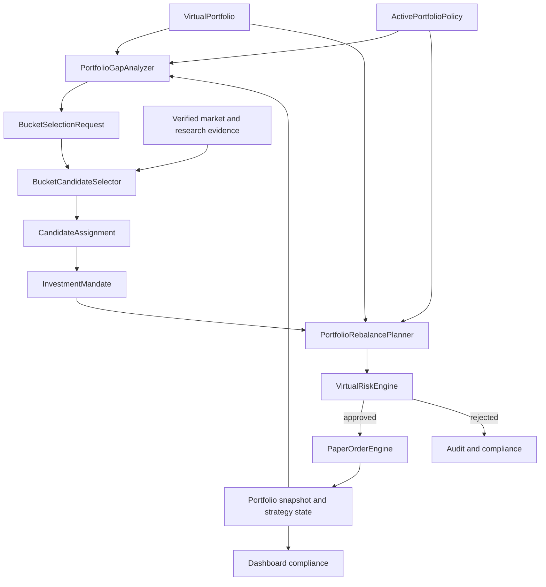

# 전략 포트폴리오 운용 및 버킷 기반 종목 선택 계획

## 1. 문서 목적

이 문서는 paper-only 가상 포트폴리오를 `종목 후보를 먼저 고르는 구조`에서
`포트폴리오 역할과 자금 배분을 먼저 정하고, 부족한 역할에 맞는 종목을 고르는 구조`로
전환하기 위한 제품·도메인·구현 계획을 정의한다.

핵심 결정은 다음과 같다.

> `ActivePortfolioPolicy`가 자금의 역할을 먼저 결정하고,
> `BucketCandidateSelector`는 목표 대비 부족한 strategy bucket만 채운다.

이 문서의 계획은 `BROKER_PROVIDER=mock`, `TRADING_ENABLED=false`,
`AI_DECISION_MODE=paper_only` 경계를 유지한다. 특정 종목 추천, 실계좌 변경,
live `TradingSignal`, live `OrderIntent`, broker mutation은 범위에 포함하지 않는다.

## 2. 문제 정의

현재 코드는 다음 기반을 이미 가지고 있다.

- `long_term`, `swing`, `short_term`, `intraday`, `hedge` strategy bucket
- strategy bucket metadata를 가진 candidate, position, trade contract
- bucket별 exposure와 turnover risk limit
- `PortfolioPolicy` draft validation과 append-only 저장
- strategy bucket별 historical replay preset과 isolated test record
- cash reserve, market regime allocation, hedge, execution cost, portfolio analytics

그러나 이 기능은 하나의 운용 루프로 연결되지 않았다.

- 저장된 `PortfolioPolicy` 중 현재 적용할 정책을 가리키는 active pointer가 없다.
- main portfolio compliance는 저장된 정책의 target을 읽지 못한다.
- 종목의 `strategyBucket`은 주로 universe manifest에 미리 지정된 metadata다.
- 같은 포트폴리오에서 bucket마다 다른 판단 주기와 exit policy를 동시에 적용하지 않는다.
- bucket 목표 비중은 있지만 종목별 역할, 목표 비중, 보유기간과 검토 주기가 없다.
- `holdingPeriodHint`는 validation metadata이며 실제 time-based exit를 강제하지 않는다.
- isolated bucket test 결과를 통합 포트폴리오 정책으로 자동 승격하지 않는다.

결과적으로 현재 시스템은 bucket별 실험은 가능하지만 다음 질문에 일관되게 답하지
못한다.

1. 현재 포트폴리오에서 어떤 역할이 부족한가?
2. 부족한 역할을 어떤 조건의 종목으로 채워야 하는가?
3. 선택된 종목은 어느 정도 비중과 기간으로 보유해야 하는가?
4. 언제 유지, 축소, 교체 또는 청산해야 하는가?
5. 여러 bucket의 판단이 충돌하면 어떤 규칙으로 해결하는가?

## 3. 목표와 비목표

### 3.1 목표

- 정책이 종목 선택보다 항상 먼저 평가된다.
- 하나의 shared virtual portfolio에서 여러 strategy bucket을 함께 운용한다.
- bucket별 목표·허용 비중, 회전율, 낙폭, 보유기간과 판단 주기를 강제한다.
- 종목마다 하나의 명시적인 `InvestmentMandate`를 유지한다.
- 부족한 bucket에 대해서만 candidate selection budget을 사용한다.
- 종목 선택, sizing, rebalance와 exit를 deterministic backend가 계산한다.
- Codex는 구조화된 근거를 바탕으로 후보를 설명하거나 paper-only 판단을 제안할 수
  있지만 최종 allocation과 Risk Engine을 소유하지 않는다.
- policy, mandate, selection, rebalance, risk decision, fill, portfolio snapshot을
  hash와 ID로 추적할 수 있어야 한다.
- historical replay가 동일한 policy와 evidence에서 재현 가능한 결과를 만든다.

### 3.2 비목표

- live trading 또는 실계좌 포트폴리오 변경
- 자연어에서 직접 주문을 생성하는 기능
- 근거가 없는 특정 종목 추천이나 수익률 보장
- AI가 임의로 bucket, target weight 또는 Risk Engine 결과를 확정하는 기능
- 하나의 backtest 최고 수익률만으로 정책을 자동 활성화하는 기능
- 승인되지 않은 외부 데이터나 비공식 Toss source를 live 경로에 연결하는 기능

## 4. 현재 구현 기준선

| 기능 | 현재 상태 | 목표 상태 |
| --- | --- | --- |
| strategy bucket schema | 구현 | 유지 |
| policy draft validation | 구현 | runtime policy contract와 통합 |
| policy append-only 저장 | 구현 | active/retired lifecycle 추가 |
| bucket target/min/max weight | draft에 구현 | 실제 compliance와 sizing에 적용 |
| bucket exposure/turnover gate | 구현, policy 입력 연결은 수동 | active policy에서 자동 파생 |
| bucket별 replay preset | 구현 | shared portfolio orchestration에 재사용 |
| 종목별 bucket | manifest metadata 중심 | deterministic assignment와 mandate로 승격 |
| 종목별 target range | 미구현 | mandate에 추가 |
| 실제 보유기간 상태 | 미구현 | position strategy state에 추가 |
| 통합 rebalance plan | 미구현 | preview와 paper execution 분리 |
| active policy 기반 dashboard | 미구현 | 동일 policy hash로 compliance 계산 |
| 여러 bucket 동시 실행 | 미구현 | cadence-aware orchestrator 추가 |

현재 dashboard policy builder의 초기 draft는 다음 비중을 사용한다. 이 값은 활성
정책이나 투자 권고가 아니라 paper simulation을 시작하기 위한 편집 가능한 예시다.

| Bucket | Target | Min | Max | Max turnover | Max drawdown | Holding hint |
| --- | ---: | ---: | ---: | ---: | ---: | --- |
| `long_term` | 35% | 20% | 50% | 15% | 18% | `multi_month` |
| `swing` | 20% | 10% | 30% | 35% | 12% | `multi_week` |
| `short_term` | 15% | 0% | 25% | 50% | 8% | `multi_day` |
| `intraday` | 10% | 0% | 15% | 100% | 4% | `intraday` |
| `hedge` | 5% | 0% | 15% | 40% | 6% | `hedge` |
| cash | 15% | - | - | - | - | dynamic regime |

Policy builder의 drawdown/turnover 값과 historical replay preset의 take-profit,
stop-loss, trailing stop 값은 현재 서로 다른 configuration source다. runtime policy를
도입할 때 두 설정을 하나의 versioned bucket policy로 통합해야 한다.

## 5. 목표 운용 모델



운용 순서는 다음으로 고정한다.

1. active policy와 현재 portfolio를 같은 시점 기준으로 읽는다.
2. mark-to-market 후 bucket, symbol, cash, market, country, currency exposure를 계산한다.
3. 목표 범위를 벗어난 bucket과 position을 찾는다.
4. 축소 또는 청산 계획을 신규 매수 계획보다 먼저 만든다.
5. min weight 미달로 `underweightKrw > 0`인 bucket에만
   `BucketSelectionRequest`를 만든다.
6. bucket 전용 hard gate와 score로 candidate를 평가한다.
7. backend가 종목별 target range와 최대 notional을 산정한다.
8. Risk Engine이 최신 portfolio와 candidate evidence로 다시 검증한다.
9. 승인된 order만 paper fill로 반영한다.
10. policy/mandate/rebalance/risk/fill lineage를 저장하고 compliance를 다시 계산한다.

## 6. 도메인 계약

아래 contract는 구현 방향을 설명하기 위한 목표 형태다. 실제 schema 추가 시 Zod
strict schema, version, parser, migration과 negative test를 함께 작성한다.

### 6.1 `ActivePortfolioPolicyRef`

```ts
interface ActivePortfolioPolicyRef {
  mode: "paper_only";
  activationId: string;
  portfolioId: string;
  policyRecordId: string;
  policyId: string;
  policyVersion: string;
  policyHash: string;
  status: "active" | "retired";
  effectiveFrom: string;
  createdAt: string;
}
```

- policy record 자체는 immutable하게 유지한다.
- 활성화와 교체는 append-only activation event로 기록한다.
- 같은 `portfolioId`와 시점에 active policy가 0개 또는 2개 이상이면 해당 portfolio
  실행을 fail-closed한다.
- simulation run은 시작 시 policy hash를 고정하며 실행 도중 새 정책으로 바뀌지 않는다.

### 6.2 `StrategyBucketPolicy`

```ts
interface StrategyBucketPolicy {
  bucket: StrategyBucket;
  targetWeightRatio: number;
  minWeightRatio: number;
  maxWeightRatio: number;
  maxTurnoverRatio: number;
  maxDrawdownRatio: number;
  reviewCadence: "hourly" | "daily" | "weekly";
  minimumHoldingSeconds?: number;
  maximumHoldingSeconds?: number;
  exitPolicy: {
    takeProfitRatio?: number;
    takeProfitMode: "full_exit" | "partial_then_trail";
    takeProfitSellRatio?: number;
    trailingStopFromPeakRatio?: number;
    stopLossRatio?: number;
    timeExpiryAction: "review_required" | "sell_all";
  };
  enabledAssetClasses: string[];
  selectionPolicyVersion: string;
}
```

- `holdingPeriodHint`를 실제 cadence와 holding boundary로 구체화한다.
- `maximumHoldingSeconds`가 있으면 `timeExpiryAction`을 함께 검증한다.
- `review_required`는 만료 시 신규 매수를 차단하고 검토 상태로만 전환한다.
- `sell_all`을 명시한 bucket만 만료 시 reduce-only paper sell candidate를 만들며,
  Risk Engine 재검증을 통과해야 한다.
- lifecycle, stale evidence, Risk Engine reject는 minimum holding보다 우선한다.

### 6.3 `InvestmentMandate`

```ts
interface InvestmentMandate {
  mandateId: string;
  portfolioId: string;
  market: Market;
  symbol: string;
  bucket: StrategyBucket;
  policyHash: string;
  assignmentSource: "manual_policy" | "deterministic_selector";
  selectionRequestId?: string;
  candidateAssignmentId?: string;
  scoringModelVersion?: string;
  targetWeightRatio: number;
  minWeightRatio: number;
  maxWeightRatio: number;
  selectionScore: number;
  reasonCodes: string[];
  evidenceRefs: string[];
  evidenceAsOf: string;
  reviewCadence: "hourly" | "daily" | "weekly";
  validFrom: string;
  reviewAfter: string;
  expiresAt?: string;
  status: "proposed" | "active" | "review_required" | "retired";
}
```

- 같은 `portfolioId + market + symbol`에는 하나의 active mandate만 허용한다.
- 같은 portfolio 안에서 같은 종목을 두 bucket에 중복 계상하지 않는다.
- bucket 변경은 기존 mandate를 retire하고 새 mandate를 발행하는 명시적 migration이다.
- `deterministic_selector` mandate는 `selectionRequestId`, `candidateAssignmentId`,
  `scoringModelVersion`을 모두 필수로 보존한다.
- `manual_policy` mandate는 selector lineage field를 포함하지 않으며 별도의 manual
  assignment audit event를 참조한다.
- AI 문자열은 `reasonCodes`나 `evidenceRefs`를 대체할 수 없다.
- target weight는 AI 출력이 아니라 backend sizing 결과다.

### 6.4 `PositionStrategyState`

```ts
type PositionStrategyState =
  | AssignedPositionStrategyState
  | UnassignedLegacyPositionStrategyState;

interface AssignedPositionStrategyState {
  stateKind: "assigned";
  portfolioId: string;
  market: Market;
  symbol: string;
  mandateId: string;
  policyHash: string;
  openedAt: string;
  lastIncreasedAt?: string;
  lastReducedAt?: string;
  lastReviewedAt: string;
  nextReviewAt: string;
  peakPriceKrw: number;
  partialTakeProfitExecuted: boolean;
  thesisStatus: "intact" | "watch" | "invalidated" | "unknown";
}

interface UnassignedLegacyPositionStrategyState {
  stateKind: "unassigned_legacy";
  portfolioId: string;
  market: Market;
  symbol: string;
  observedPositionRef: string;
  reasonCodes: Array<
    "missing_mandate" | "missing_policy_lineage" | "missing_opened_at"
  >;
  detectedAt: string;
  status: "review_required";
}
```

기존 replay-local trailing state를 durable strategy state로 승격한다. portfolio snapshot과
strategy state의 policy/mandate lineage가 일치하지 않으면 신규 매수를 중단한다.
legacy position에 mandate, policy hash 또는 신뢰할 수 있는 `openedAt`이 없으면 값을
추정하지 않고 `unassigned_legacy` variant로 저장한다. 이 variant에는 가상의 lineage나
holding state를 채우지 않으며, 하나라도 존재하면 해당 portfolio의 신규 매수를
fail-closed하고 read-only inspection과 Risk Engine을 통과한 reduce-only 처리만 허용한다.

### 6.5 `BucketSelectionRequest`와 `CandidateAssignment`

```ts
interface BucketSelectionRequest {
  requestId: string;
  portfolioId: string;
  portfolioSnapshotId: string;
  portfolioSnapshotHash: string;
  policyHash: string;
  bucket: StrategyBucket;
  gapKrw: number;
  availableSlots: number;
  maximumAdditionalExposureKrw: number;
  evidenceCutoffAt: string;
}

interface CandidateAssignment {
  assignmentId: string;
  requestId: string;
  market: Market;
  symbol: string;
  bucket: StrategyBucket;
  eligibility: "eligible" | "watch" | "blocked";
  targetWeightRatio: number;
  maximumNotionalKrw: number;
  selectionScore: number;
  reasonCodes: string[];
  evidenceRefs: string[];
  scoringModelVersion: string;
  sizingInputHash: string;
}
```

`watch`와 `blocked` candidate는 주문 후보가 될 수 없다. required evidence가 없거나
stale이면 높은 score가 있더라도 `eligible`로 승격하지 않는다.
`sizingInputHash`는 policy hash, portfolio snapshot hash, selection request, candidate
assignment feature, exposure/liquidity cap과 execution cost input을 canonicalize해 만든다.

## 7. Bucket별 종목 선택 정책

모든 종목을 하나의 공통 ranking으로 줄 세우지 않는다. 공통 lifecycle/freshness/
liquidity gate를 통과한 뒤 bucket별 feature set과 threshold를 적용한다.

| Bucket | 주요 목적 | 우선 evidence | 배제 또는 감점 조건 |
| --- | --- | --- | --- |
| `long_term` | 완만한 장기 성장과 자본 보존 | 장기 추세 지속성, realized volatility, drawdown, liquidity, 재무 안정성 | 불충분한 장기 이력, 높은 구조적 변동성, 필수 재무 evidence 누락 |
| `swing` | 수주 단위 추세 포착 | 중기 momentum, volume confirmation, trend persistence, gap risk | 약한 추세, 과도한 gap/impact, stale signal |
| `short_term` | 수일 단위 전술 기회 | 단기 momentum, 거래대금, 변동성 범위, 명확한 exit distance | 낮은 유동성, 손익비 부족, 이벤트 불확실성 |
| `intraday` | 당일 변동 활용 | intraday interval, spread, participation, volume, market impact | daily-only data, stale quote, 당일 청산 근거 부족 |
| `hedge` | 전체 하방 노출 감소 | downside exposure reduction, correlation evidence, hedge cost | gross만 늘리는 hedge, metadata 누락, 비용 상한 초과 |

### 7.1 Evidence 단계

현재 가격·거래량 snapshot만으로 검증 가능한 범위와 추가 source가 필요한 범위를
분리한다.

1. `market_technical`
   - 수익률, realized volatility, drawdown, trend persistence, volume과 liquidity
   - 현재 historical ingestion으로 계산 가능한 범위
2. `fundamental_quality`
   - 매출·이익·현금흐름 안정성, 부채, 배당 지속성 같은 장기 품질 evidence
   - provenance가 확인된 별도 read-only source contract 필요
3. `portfolio_fit`
   - 기존 position과의 sector/country/currency correlation 및 concentration 영향
4. `execution_fit`
   - spread, 예상 participation, slippage와 market impact

`long_term` policy가 `fundamental_quality`를 required로 선언한 경우 해당 source가 없는
candidate는 `unknown` 또는 `blocked`로 남긴다. 가격 상승만으로 기업 안정성을
추정하지 않는다.

### 7.2 Score와 sizing 분리

- `selectionScore`는 같은 bucket 안에서 candidate 우선순위를 정한다.
- score는 target weight를 직접 결정하지 않는다.
- backend는 bucket gap, available slots, symbol cap, liquidity cap, concentration cap,
  cash reserve와 execution cost를 적용해 target range를 산정한다.
- 동일 candidate evidence, feature input과 scoring model version은 동일한 정렬과
  reason code를 만들어야 한다.
- sizing 재현성은 `policyHash`, versioned portfolio snapshot, selection request,
  candidate assignment, exposure/liquidity cap과 execution cost를 포함한 전체
  `sizingInputHash`에 묶는다. 동일한 전체 입력만 동일한 target range와 최대 notional을
  만들어야 한다.
- 동점은 `market`, `symbol` canonical order로 해소해 replay 재현성을 보장한다.

초기 sizing은 복잡한 최적화보다 다음 bounded allocation을 사용한다.

1. bucket gap을 available slot 수로 나눈 기본 notional을 계산한다.
2. candidate score에 따른 deterministic multiplier를 허용 범위 안에서 적용한다.
3. symbol, bucket, sector, country, currency, liquidity limit 중 가장 작은 cap을 적용한다.
4. 최소 주문 단위보다 작거나 비용 대비 편익 threshold를 넘지 못하면 거래하지 않는다.
5. exact target을 추적하지 않고 min/max rebalance band 안에서는 유지한다.

## 8. Portfolio gap과 리밸런싱

### 8.1 Gap 계산

각 bucket에 대해 다음 값을 산출한다.

```text
currentWeight = bucketExposureKrw / virtualNetWorthKrw
targetGapKrw = max(0, targetWeightKrw - currentExposureKrw)
overweightKrw = max(0, currentExposureKrw - maxWeightKrw)
underweightKrw = max(0, minWeightKrw - currentExposureKrw)
```

- `underweightKrw > 0`인 bucket을 신규 selection 우선 대상으로 삼는다.
- target보다 낮지만 min 이상이면 비용과 turnover를 고려해 유지할 수 있다.
- max를 넘으면 신규 매수를 차단하고 sell/rebalance candidate를 만든다.
- cash reserve 미달이면 모든 신규 매수를 차단한다.

### 8.2 결정 우선순위

하나의 orchestration cycle에서 다음 우선순위를 고정한다.

1. lifecycle invalidation과 명시적인 fail-closed safety action
2. stop-loss와 risk limit 위반 축소
3. stale/missing critical evidence의 신규 매수 차단과 보유 position review
4. maximum holding review와 thesis invalidation
5. bucket/symbol overweight rebalance
6. take-profit와 trailing stop
7. cash/hedge reserve 복구
8. underweight bucket 신규 매수

SELL과 BUY가 같은 cycle에 있으면 SELL을 먼저 paper fill하고 mark-to-market 및 risk
snapshot을 다시 만든 뒤 BUY를 평가한다. 같은 종목에 상충하는 BUY/SELL을 동시에
발행하지 않는다.

### 8.3 Idempotency와 동시성

- cycle ID는 `portfolioId + policyHash + evidenceCutoffAt + cadence`에서 파생한다.
- 같은 cycle ID의 rebalance plan은 한 번만 적용한다.
- portfolio version 또는 policy hash가 preview 이후 달라지면 plan을 폐기한다.
- multi-process 실행 전 portfolio-scoped lock 또는 compare-and-swap version을 둔다.
- decision/trade/portfolio/strategy-state 저장 실패가 부분 상태를 만들지 않도록 durable
  transaction boundary 또는 재구성 가능한 append-only event contract가 필요하다.

## 9. Multi-bucket orchestration

각 bucket은 같은 portfolio를 사용하되 자신의 cadence가 도래했을 때만 평가한다.

| Bucket | 초기 paper cadence | 실행 조건 |
| --- | --- | --- |
| `long_term` | weekly | 정기 review, thesis/evidence 변경, risk breach |
| `swing` | daily | market close snapshot과 중기 signal 갱신 |
| `short_term` | daily | 신선한 단기 signal과 exit evidence 존재 |
| `intraday` | hourly/every tick | intraday source와 liquidity evidence가 모두 준비된 경우 |
| `hedge` | daily 또는 regime change | 하방 노출과 hedge effectiveness 재계산 |

daily data만 있는 실행에서 `intraday`를 활성화하지 않는다. cadence별 source requirement가
충족되지 않으면 해당 bucket만 `degraded` 또는 `blocked`로 두고 다른 bucket의 read-only
평가를 계속할 수 있다.

## 10. Policy lifecycle과 저장 artifact

계획된 artifact는 모두 paper-only이며 real account identifier를 포함하지 않는다.

| Artifact | 형태 | 책임 |
| --- | --- | --- |
| `portfolio-policy-records.jsonl` | 기존 append-only | validated immutable policy |
| `portfolio-policy-activations.jsonl` | 신규 append-only | portfolio별 active/retired policy lineage |
| `instrument-mandates.jsonl` | 신규 append-only | 종목 역할·target·evidence 변화 |
| `position-strategy-state.json` | 신규 snapshot | 현재 보유기간·peak·review 상태 |
| `portfolio-gap-snapshots.jsonl` | 신규 append-only | policy 대비 현재 gap |
| `bucket-selection-requests.jsonl` | 신규 append-only | snapshot/policy에 묶인 bucket selection 요청 |
| `candidate-assignments.jsonl` | 신규 append-only | request별 eligibility, score, sizing 입력과 결과 |
| `rebalance-plans.jsonl` | 신규 append-only | preview, approval, rejection, applied 상태 |

모든 downstream artifact는 최소한 `policyHash`, `portfolioId`, `asOf`, source/evidence ref를
포함한다. corrupt line이나 lineage mismatch는 경고만 표시하고 계속 매수하는 대신
fail-closed한다.
selector가 만든 mandate는 참조하는 request와 assignment record를 먼저 append-only로
저장한 뒤에만 발행한다. 두 ID가 resolve되지 않거나 policy/snapshot/scoring/sizing
lineage가 일치하지 않으면 mandate 생성을 거절한다.

## 11. API와 Dashboard 계획

### 11.1 Local Operations API

기존 endpoint는 유지한다.

```text
POST /paper/policies/validate
POST /paper/policies
```

계획 endpoint는 다음과 같다.

```text
GET  /paper/policies/active
POST /paper/policies/{policyRecordId}/activate
GET  /virtual/portfolio/gaps
POST /paper/portfolio/rebalance/preview
GET  /paper/portfolio/rebalance/plans/{planId}
```

- `GET`은 read-only다.
- policy activation과 rebalance preview 저장은 same-origin, mutation token, explicit
  operation header를 요구하는 guarded paper-only mutation이다.
- preview는 paper order를 실행하지 않는다.
- 실제 paper execution endpoint는 별도 PR에서 idempotency와 version check가 갖춰진 뒤
  추가한다.
- 어떤 endpoint도 live order 또는 broker mutation을 만들지 않는다.

### 11.2 Dashboard

`/dashboard/portfolio`는 같은 active policy hash를 기준으로 다음을 표시한다.

- bucket별 target/min/current/max와 KRW gap
- 종목별 mandate, target range, 보유기간, 다음 review 시각
- selection evidence freshness와 blocked reason
- 예정된 rebalance action과 예상 비용
- cash reserve와 hedge effectiveness
- policy version, activation 시각과 마지막 orchestration cycle

target policy를 읽지 못하면 현재처럼 임의의 `0%` target이나 `ok`를 표시하지 않고
`missing_policy`로 명확히 구분한다.

## 12. Historical replay와 검증 정책

- replay run은 active pointer를 실시간으로 따라가지 않고 시작 시 고정한 policy record를
  사용한다.
- 각 bucket isolated replay와 full shared-portfolio replay를 모두 실행한다.
- isolated 결과가 좋아도 full policy로 자동 승격하지 않는다.
- train 결과로 선택한 policy는 validation/test holdout에서 별도로 평가한다.
- 거래비용, turnover, drawdown, rejection, provider failure와 missing evidence를 수익률과
  함께 기록한다.
- long-term candidate는 데이터 window가 짧거나 fundamental evidence가 없으면 별도
  `evidence_insufficient` 상태로 보고한다.
- 결과 보고는 paper-only research artifact이며 투자 성과로 표현하지 않는다.

## 13. 구현 순서

각 단계는 독립적으로 review/revert할 수 있는 작은 PR로 진행한다.

### PR 1. Runtime policy contract와 activation lineage

- current validation candidate를 runtime `PortfolioPolicy` contract로 정규화
- append-only activation record와 single-active fail-closed resolver
- policy hash/version parser와 migration test
- runner와 order engine에는 아직 연결하지 않음

완료 조건:

- `portfolioId`별 active policy 1개를 deterministic하게 읽는다.
- 해당 portfolio의 active policy 없음, 중복 active, corrupt lineage를 모두 거절한다.

### PR 2. Active policy 기반 portfolio compliance

- `portfolio-compliance`가 active policy target/min/max를 읽도록 연결
- bucket gap과 `under`, `over`, `ok`, `missing_policy` 계산
- dashboard에 실제 policy version과 gap 표시

완료 조건:

- 저장 정책과 화면 target이 같은 policy hash를 사용한다.
- policy가 없을 때 `0% target`을 정상값처럼 표시하지 않는다.

### PR 3. `InvestmentMandate`와 position strategy state

- assigned/unassigned legacy state를 구분하는 strict schema와 repository
- portfolio 안에서 한 종목 하나의 active mandate invariant
- 기존 position의 `unassigned_legacy` migration
- peak, review cadence, holding age persistence

완료 조건:

- 모든 신규 paper position이 mandate와 policy hash를 가진다.
- selector가 만든 mandate는 request, assignment와 scoring model lineage를 가진다.
- lineage 또는 holding timestamp가 없는 legacy position은 값을 자동 추정하지 않고
  `unassigned_legacy`와 `review_required`로 구분하며 해당 portfolio의 신규 매수를 막는다.

### PR 4. `PortfolioGapAnalyzer`

- bucket/symbol/cash gap read model
- min/max band와 available slot 계산
- selection request 생성 조건
- selection request append-only repository

완료 조건:

- overweight bucket은 신규 candidate request를 만들지 않는다.
- `BucketSelectionRequest`는 `underweightKrw > 0`이고 buy capacity가 있는 bucket에만
  생성된다.
- cash reserve 미달이면 모든 buy capacity가 0이다.

### PR 5. Bucket candidate selector contract

- 공통 hard gate와 bucket별 scoring interface
- price/volume 기반 `market_technical` feature부터 구현
- evidence completeness와 scoring model version 기록
- candidate assignment append-only repository와 request lineage 검증
- manifest bucket은 observed metadata로 유지하되 자동 acceptance 근거로 사용하지 않음

완료 조건:

- 같은 입력은 같은 ordering과 reason code를 만든다.
- required evidence가 없는 candidate는 fail-closed한다.

### PR 6. Rebalance preview planner

- sell-first deterministic plan
- target range, turnover, cost와 liquidity threshold
- portfolio/policy version binding과 idempotency key
- read-only preview 및 artifact 저장

완료 조건:

- preview는 portfolio와 trade를 변경하지 않는다.
- stale preview 또는 version mismatch를 적용할 수 없다.

### PR 7. Shared portfolio multi-bucket paper orchestrator

- cadence scheduler와 conflict resolver
- bucket별 exit policy와 selection request 실행
- 각 fill 후 mark-to-market 및 risk snapshot 재평가
- paper-only execution과 audit lineage

완료 조건:

- 하나의 cycle에서 상충하는 BUY/SELL이 발생하지 않는다.
- 모든 paper fill이 policy, mandate, decision, risk decision과 연결된다.

### PR 8. Integrated replay와 운영 화면

- isolated bucket과 full portfolio 비교
- target drift, turnover, cost, drawdown, evidence gap report
- mandate timeline과 rebalance plan dashboard
- E2E, accessibility, replay reproducibility 검증

완료 조건:

- 동일 fixture, policy, seed가 동일 final portfolio와 lineage hash를 만든다.
- dashboard가 backend ViewModel만 사용해 compliance를 표시한다.

### 후속 단계. Fundamental evidence source

- 공식적이고 provenance를 보존하는 read-only 재무 데이터 contract
- credential, 비용, 라이선스 또는 외부 계정 설정이 필요하면 owner 판단 후 진행
- source가 준비되기 전에는 long-term quality를 가격 데이터만으로 확정하지 않음

## 14. 테스트 전략

### Contract 및 invariant

- bucket target + cash target 합계 100%
- target이 min/max 범위 안에 존재
- policy hash canonicalization과 version compatibility
- `portfolioId`당 single active policy
- `portfolioId + market + symbol`당 single active mandate
- mandate와 position의 policy hash 일치
- selector mandate의 request/assignment/scoring model lineage 완전성
- selector mandate가 참조하는 append-only request/assignment record의 해소 가능성
- legacy unassigned state에 fabricated mandate/policy/holding timestamp가 없음

### Gap 및 sizing

- min/max band 내부에서 불필요한 trade 없음
- overweight sell이 underweight buy보다 먼저 처리됨
- cash reserve, symbol, bucket, sector, country, currency limit 중 최소 cap 적용
- dust와 거래비용 threshold 이하의 계획 제외
- 동일한 전체 `sizingInputHash`의 target range와 최대 notional 재현

### Cadence 및 exit

- bucket별 due/not-due 판단
- minimum/maximum holding boundary
- `timeExpiryAction`별 review-only와 reduce-only sell 동작
- partial take-profit 후 durable trailing state
- lifecycle invalidation과 risk breach가 minimum holding보다 우선

### 실패 및 복구

- active policy 없음/중복/corrupt
- stale evidence와 missing required feature
- portfolio version drift
- duplicate cycle 및 duplicate plan apply
- decision/trade/state 중간 실패 후 재구성 또는 안전 중단

### Safety

- `BROKER_PROVIDER=mock`, `TRADING_ENABLED=false` 유지
- live `TradingSignal`, `OrderIntent`, broker endpoint 생성 없음
- MCP portfolio tool은 read-only 유지
- account, credential, order/execution identifier masking

## 15. 호환성과 롤백

- 기존 `VirtualPortfolio`와 historical replay artifact는 즉시 제거하지 않는다.
- 신규 field는 versioned artifact 또는 별도 state로 도입하고 legacy input을 명시적으로
  `unassigned_legacy`/`review_required`로 정규화한다. 누락된 lineage나 holding timestamp는
  합성하지 않는다.
- policy activation 이전에는 현재 paper runner 동작을 유지한다.
- 각 구현 PR은 feature flag 또는 미연결 contract 상태로 배포 가능해야 한다.
- active policy 적용에 문제가 있으면 activation event를 retire하고 이전 validated policy를
  새 activation event로 복구한다. 저장 record를 수정하거나 삭제하지 않는다.
- DB schema 변경은 현재 계획에 없으며 local JSON/JSONL artifact migration만 대상이다.

## 16. 최종 수용 기준

다음 조건을 모두 만족해야 전략 포트폴리오 운용이 연결된 것으로 본다.

- [ ] active policy가 전체 자금의 bucket/cash 목표를 단일 source of truth로 제공한다.
- [ ] 현재 portfolio gap이 active policy 기준으로 계산된다.
- [ ] 종목 탐색은 underweight bucket request에서만 시작된다.
- [ ] candidate selection이 bucket별 hard gate와 versioned score를 사용한다.
- [ ] 모든 신규 position이 종목별 mandate와 target range를 가진다.
- [ ] holding age, review cadence, exit state가 durable하게 보존된다.
- [ ] 여러 bucket이 하나의 portfolio에서 서로 다른 cadence로 실행된다.
- [ ] rebalance는 band, turnover, cost, liquidity와 Risk Engine을 통과한다.
- [ ] 동일 cycle의 중복 적용과 상충 주문이 차단된다.
- [ ] dashboard가 active policy와 동일한 hash로 target/current/gap을 표시한다.
- [ ] isolated bucket 결과와 full portfolio 결과를 분리해서 검증한다.
- [ ] 모든 경로가 paper-only이고 live order surface를 추가하지 않는다.
